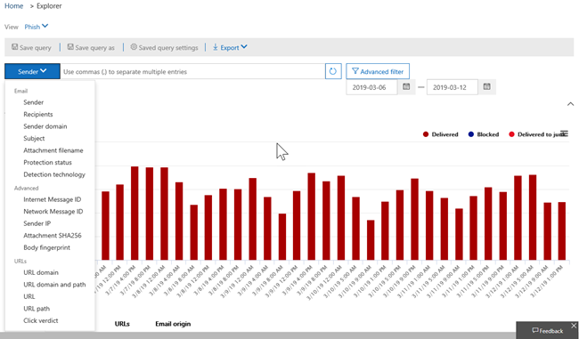
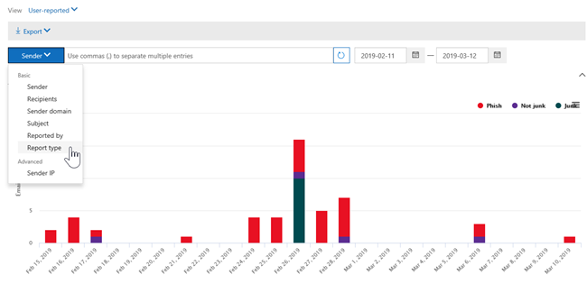

# 威脅瀏覽器和即時偵測中的視圖Views in Threat Explorer and real-time detections

[!INCLUDE [Microsoft 365 Defender rebranding](../includes/microsoft-defender-for-office.md)]

[威脅瀏覽器](threat-explorer.md) (和即時偵測報告) 是強大的近即時工具，可協助安全性運作小組調查和回應安全性 & 合規性中心內的威脅。[Threat Explorer](threat-explorer.md) (and the real-time detections report) is a powerful, near real-time tool to help Security Operations teams investigate and respond to threats in the Security & Compliance Center. Explorer (和即時偵測報告) 會顯示可疑惡意程式碼和網路釣魚詐騙在 Office 365 中的電子郵件和檔案中的相關資訊，以及組織的其他安全性威脅和風險。Explorer (and the real-time detections report) displays information about suspected malware and phish in email and files in Office 365, as well as other security threats and risks to your organization.

- 如果您有 [Microsoft Defender For Office 365](office-365-atp.md) 方案2，則會有 Explorer。If you have [Microsoft Defender for Office 365](office-365-atp.md) Plan 2, then you have Explorer.
- 如果您有 Microsoft Defender for Office 365 方案1，則會進行即時偵測。If you have Microsoft Defender for Office 365 Plan 1, then you have real-time detections.

當您第一次開啟 Explorer (或即時偵測報告) 時，預設視圖會顯示過去7天的電子郵件惡意程式碼偵測。When you first open Explorer (or the real-time detections report), the default view shows email malware detections for the past 7 days. 此報告也可顯示 Microsoft Defender for Office 365 偵測，例如由 [安全連結](atp-safe-links.md)偵測到的惡意 URLs，以及 [安全附件](atp-safe-attachments.md)偵測到的惡意檔案。This report can also show Microsoft Defender for Office 365 detections, such as malicious URLs detected by [Safe Links](atp-safe-links.md), and malicious files detected by [Safe Attachments](atp-safe-attachments.md). 您可以修改此報告以顯示過去30天的資料 (與 Microsoft Defender for Office 365 P2 付費訂閱) 。This report can be modified to show data for the past 30 days (with a Microsoft Defender for Office 365 P2 paid subscription). 試用訂閱只會包含過去7天的資料。Trial subscriptions will include data for the past seven days only.

****

|訂閱Subscription|實用Utility|資料天數Days of Data|
|---|---|---|
|Microsoft Defender for Office 365 P1 試用版Microsoft Defender for Office 365 P1 trial|即時偵測Real-time detections|7 7|
|Microsoft Defender for Office 365 P1 已付費Microsoft Defender for Office 365 P1 paid|即時偵測Real-time detections|大約30|
|適用于 office 的 Microsoft Defender 365 P1 已付費測試 Defender for Office 365 P2 試用版Microsoft Defender for Office 365 P1 paid testing Defender for Office 365 P2 trial|威脅總管Threat Explorer|7 7|
|Microsoft Defender for Office 365 P2 試用版Microsoft Defender for Office 365 P2 trial|威脅總管Threat Explorer|7 7|
|Microsoft Defender for Office 365 P2 已支付Microsoft Defender for Office 365 P2 paid|威脅總管Threat Explorer|大約30|
|

使用 [ **View** ] （查看）功能表來變更顯示的資訊。Use the **View** menu to change what information is displayed. 工具提示可協助您決定要使用的視圖。Tooltips help you determine which view to use.

選取視圖後，您就可以套用篩選器，並設定查詢進行進一步的分析。Once you have selected a view, you can apply filters and set up queries to conduct further analysis. 下列各節提供 Explorer (或即時偵測) 中所提供的各種視圖的簡短概述。The following sections provide a brief overview of the various views available in Explorer (or real-time detections).

## 電子郵件 > 惡意程式碼Email > Malware

若要查看此報告，請在 Explorer (或即時偵測) 中，選擇 [ **view**  >  **Email**  >  **Malware**]。To view this report, in Explorer (or real-time detections), choose **View** > **Email** > **Malware**. 此視圖顯示識別為包含惡意程式碼之電子郵件的相關資訊。This view shows information about email messages that were identified as containing malware.

按一下 [ **寄件者** ] 開啟您的查看選項清單。Click **Sender** to open your list of viewing options. 使用此清單，透過寄件者、收件者、寄件者網域、主旨、偵測技術、保護狀態等方式來查看資料。Use this list to view data by sender, recipients, sender domain, subject, detection technology, protection status, and more.

例如，若要查看對偵測到的電子郵件所採取的動作，請挑選清單中的 [ **保護狀態** ]。For example, to see what actions were taken on detected email messages, choose **Protection status** in the list. 選取一個選項，然後按一下 [重新整理] 按鈕，將該篩選套用至您的報表。Select an option, and then click the Refresh button to apply that filter to your report.

在圖表下方，查看特定郵件的詳細資料。Below the chart, view more details about specific messages. 當您選取清單中的專案時，會開啟一個彈出窗格，您可以在其中深入瞭解您所選取的專案。When you select an item in the list, a fly-out pane opens, where you can learn more about the item you selected.

## 電子郵件 > 網路釣魚Email > Phish

若要查看此報告，請在 Explorer (或即時偵測) 中，選擇 [ **view**  >  **Email**  >  **釣魚網絡**]。To view this report, in Explorer (or real-time detections), choose **View** > **Email** > **Phish**. 此視圖顯示視為網路釣魚企圖的電子郵件。This view shows email messages identified as phishing attempts.

按一下 [ **寄件者** ] 開啟您的查看選項清單。Click **Sender** to open your list of viewing options. 使用此清單，依寄件者、收件者、寄件者網域、寄件者 IP、URL 網域、判定結果等方式來查看資料。Use this list to view data by sender, recipients, sender domain, sender IP, URL domain, click verdict, and more.

例如，若要查看在已識別為網路釣魚企圖的 URLs 上按一下人員時採取的動作，請挑選清單中 **的 [依** 序顯示]，然後選取一或多個選項，然後按一下 [重新整理] 按鈕。For example, to see what actions were taken when people clicked on URLs that were identified as phishing attempts, choose **Click verdict** in the list, select one or more options, and then click the Refresh button.

![按一下網路釣魚報告的 [已判定選項]](../../media/ThreatExplorerEmailPhishClickVerdictOptions.png)

在圖表下方，查看特定訊息、URL 按一下、URLs 及電子郵件原始的詳細資料。Below the chart, view more details about specific messages, URL clicks, URLs, and email origin.

當您選取清單中的專案（例如已偵測到的 URL）時，就會開啟彈出窗格，您可以在其中深入瞭解您所選取的專案。When you select an item in the list, such as a URL that was detected, a fly-out pane opens, where you can learn more about the item you selected.

## 電子郵件 > 提交Email > Submissions

若要查看此報告，請在 Explorer (或即時偵測) 中，選擇 [ **view**  >  **Email**  >  **報送**]。To view this report, in Explorer (or real-time detections), choose **View** > **Email** > **Submissions**. 此視圖顯示使用者已舉報為垃圾郵件、非垃圾郵件或網路釣魚電子郵件的電子郵件。This view shows email that users have reported as junk, not junk, or phishing email.

按一下 [ **寄件者** ] 開啟您的查看選項清單。Click **Sender** to open your list of viewing options. 使用此清單，以 [寄件者]、[收件者]、[報告] 類型 (使用者判斷電子郵件為垃圾郵件、非垃圾郵件或網路釣魚) 等等的方式來查看資訊。Use this list to view information by sender, recipients, report type (the user's determination that the email was junk, not junk, or phish), and more.

例如，若要查看報告為網路釣魚企圖的電子郵件資訊，請按一下 [**寄件者**  >  **報告類型**]，選取 [**網路釣魚**]，然後按一下 [重新整理] 按鈕。For example, to view information about email messages that were reported as phishing attempts, click **Sender** > **Report type**, select **Phish**, and then click the Refresh button.

在圖表下方，查看特定電子郵件訊息的詳細資訊，例如主題行、寄件者的 IP 位址、將郵件報告為垃圾郵件的使用者，而非垃圾郵件或網路釣魚網路等等。Below the chart, view more details about specific email messages, such as subject line, the sender's IP address, the user that reported the message as junk, not junk, or phish, and more.

選取清單中的專案，以查看其他詳細資料。Select an item in the list to view additional details.

## 電子郵件 > 所有電子郵件Email > All email

若要在瀏覽器中查看此報告 **View**，請選擇 [在  >  **Email**  >  **所有郵件** 中查看電子郵件]。To view this report, in Explorer, choose **View** > **Email** > **All mail**. 這種方式會顯示電子郵件活動的完整視圖，包括因網路釣魚或惡意程式碼而識別為惡意的電子郵件，而且所有非惡意郵件 (一般電子郵件、垃圾郵件和大宗郵件) 。This views shows an all-up view of email activity, including email identified as malicious due to phishing or malware, as well all non-malicious mail (normal email, spam, and bulk mail).

> [!NOTE]
> 如果您收到的錯誤是 **要顯示太多資料**，請新增篩選器，並視需要縮小您正在查看的日期範圍。If you get an error that reads **Too much data to display**, add a filter and, if necessary, narrow the date range you're viewing.

若要套用篩選，請選擇 [ **寄件者**]，選取清單中的專案，然後按一下 [重新整理] 按鈕。To apply a filter, choose **Sender**, select an item in the list, and then click the Refresh button. 在我們的範例中，我們使用 **偵測技術** 做為篩選 (有許多選項可供使用) 。In our example, we used **Detection technology** as a filter (there are several options available). 依寄件者、寄件者的網域、收件者、主旨、附件檔案名、惡意程式碼系列、保護狀態 (動作來查看資訊。) 、偵測技術365中的威脅防護功能和原則， (偵測到惡意程式碼的方式) 等等。View information by sender, sender's domain, recipients, subject, attachment filename, malware family, protection status (actions taken by your threat protection features and policies in Office 365), detection technology (how the malware was detected), and more.

在圖表下方，查看特定電子郵件的詳細資料，例如主旨行、收件者、寄件者、狀態等等。Below the chart, view more details about specific email messages, such as subject line, recipient, sender, status, and so on.

## 內容 > 惡意程式碼Content > Malware

若要查看此報告，請在 Explorer (或即時偵測) 中，選擇 [ **view**  >  **Content**  >  **Malware**]。To view this report, in Explorer (or real-time detections), choose **View** > **Content** > **Malware**. 此視圖會顯示 [Microsoft Defender For Office 365 在 SharePoint Online、商務 OneDrive For Business 及 Microsoft 小組中](atp-for-spo-odb-and-teams.md)識別為惡意的檔案。This view shows files that were identified as malicious by [Microsoft Defender for Office 365 in SharePoint Online, OneDrive for Business, and Microsoft Teams](atp-for-spo-odb-and-teams.md).

透過惡意程式碼系列來查看資訊，偵測技術 (偵測到惡意軟體的方式) ，以及工作量 (OneDrive、SharePoint 或小組) 。View information by malware family, detection technology (how the malware was detected), and workload (OneDrive, SharePoint, or Teams).

在圖表下方，查看特定檔案的詳細資訊，例如附件檔案名、工作量、檔案大小、最後修改檔案的使用者等等。Below the chart, view more details about specific files, such as attachment filename, workload, file size, who last modified the file, and more.

## 按一下以篩選功能Click-to-filter capabilities

透過 Explorer (和即時偵測) ，您可以在按一下時套用篩選。With Explorer (and real-time detections), you can apply a filter in a click. 按一下圖例中的專案，該專案就會變成報告的篩選器。Click an item in the legend, and that item becomes a filter for the report. 例如，假設我們在瀏覽器中查看惡意程式碼視圖：For example, suppose we are looking at the Malware view in Explorer:

按一下此圖表中的 **ATP 引爆** ，會產生如下的視圖：Clicking **ATP Detonation** in this chart results in a view like this:

在此視圖中，我們現在查看以 [安全附件](atp-safe-attachments.md)引爆之檔案的資料。In this view, we are now looking at data for files that were detonated by [Safe Attachments](atp-safe-attachments.md). 在圖表下方，我們可以看到具有安全附件所偵測到之附件的特定電子郵件的詳細資料。Below the chart, we can see details about specific email messages that had attachments that were detected by Safe Attachments.

選取一個或多個專案時，會啟動 [ **動作** ] 功能表，提供數個選項供您選擇 (s) 的選取專案。Selecting one or more items activates the **Actions** menu, which offers several choices from which to choose for the selected item(s).

您可以在按一下並流覽至特定詳細資料的情況中進行篩選，以在調查威脅時節省很多時間。The ability to filter in a click and navigate to specific details can save you a lot of time in investigating threats.

## 查詢和篩選Queries and filters

Explorer (和即時偵測報告) 具有多種強大的篩選和查詢功能，可讓您深入瞭解詳細資料，例如主要目標使用者、主要惡意程式碼系列、偵測技術等等。Explorer (as well as the real-time detections report) has several powerful filters and querying capabilities that enable you to drill into details, such as top targeted users, top malware families, detection technology and more. 每種類型的報表都提供不同的方式來查看及流覽資料。Each kind of report offers a variety of ways to view and explore data.

> [!IMPORTANT]
> 在 Explorer (或即時偵測) 的查詢列中，請勿使用萬用字元（如星號或問號）。Do not use wildcard characters, such as an asterisk or a question mark, in the query bar for Explorer (or real-time detections). 當您在電子郵件訊息的 [主旨] **欄位** 上進行搜尋時，Explorer (或即時偵測) 會執行部分比對，類似于萬用字元搜尋的結果。When you search on the **Subject field** for email messages, Explorer (or real-time detections) will perform partial matching and yield results similar to a wildcard search.
