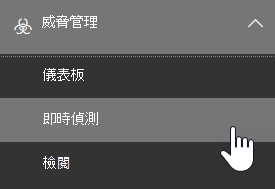
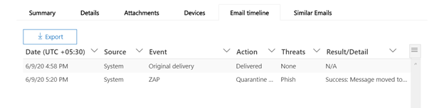
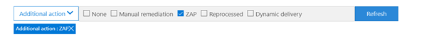
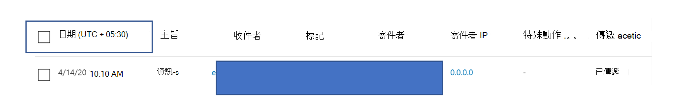
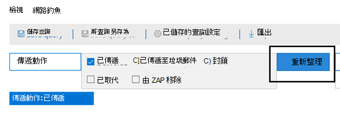
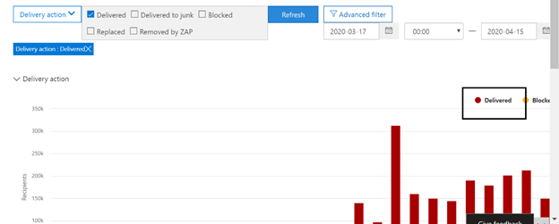
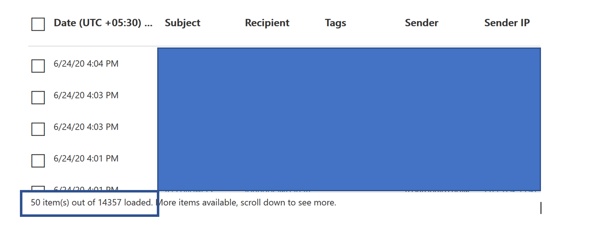
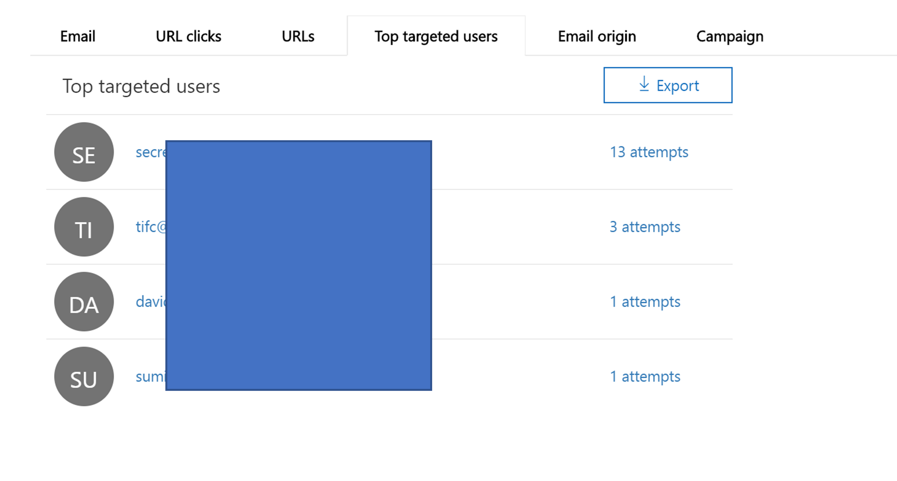
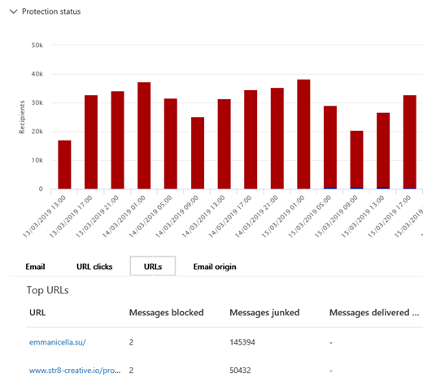

# 威脅總管和即時偵測Threat Explorer and real-time detections

[!INCLUDE [Microsoft 365 Defender rebranding](../includes/microsoft-defender-for-office.md)]

如果貴組織具有 [Office 365 進階威脅防護](office-365-atp.md) (Office 365 ATP)，而且您具有[必要的權限](#required-licenses-and-permissions)，您具有**總管**或**即時偵測** (先前的*即時報告* — [查看新增功能](#new-features-in-threat-explorer-and-real-time-detections)！)。If your organization has [Office 365 Advanced Threat Protection](office-365-atp.md) (Office 365 ATP), and you have the [necessary permissions](#required-licenses-and-permissions), you have either **Explorer** or **real-time detections** (formerly *real-time reports* — [see what's new](#new-features-in-threat-explorer-and-real-time-detections)!). 在 [安全性 & 規範中心] 中，移至 [ **威脅管理**]，然後選擇 [ **Explorer** ] _或_[ **即時**偵測]。In the Security & Compliance Center, go to **Threat management**, and then choose **Explorer** _or_ **Real-time detections**.

|在 ATP 方案 2，您會看到：With ATP Plan 2, you see:|在 ATP 方案 1，您會看到：With ATP Plan 1, you see:|
|---|---|
|||
|

總管 (或即時偵測) 提供您強大的報告，讓您的安全性作業小組以有效的方式調查及回應威脅。With Explorer (or real-time detections), you have a powerful report that enables your Security Operations team to investigate and respond to threats effectively and efficiently. 報告類似下列影像：The report resembles the following image:

您可以使用此報告：With this report, you can:

- [查看 Microsoft 365 的安全性功能偵測到的惡意程式碼See malware detected by Microsoft 365 security features](#see-malware-detected-in-email-by-technology)
- [檢視網路釣魚 URL 並按一下結果View data about phishing URLs and click verdict](#view-data-about-phishing-urls-and-click-verdict)
- [從總管中的檢視啟動自動化的調查和回應程序](#start-automated-investigation-and-response) (僅限 ATP 方案 2)[Start an automated investigation and response process from a view in Explorer](#start-automated-investigation-and-response) (ATP Plan 2 only)
- ... [調查惡意電子郵件等功能](#more-ways-to-use-explorer-or-real-time-detections)！... [Investigate malicious email, and more](#more-ways-to-use-explorer-or-real-time-detections)!

## 威脅瀏覽器中的標記Tags in Threat Explorer

> [!NOTE] 
> 使用者標記功能是在預覽中，並非所有人都可以使用，而且可能會變更。The user tags feature is in Preview, isn't available to everyone, and is subject to change. 如需發行排程的相關資訊，請參閱 Microsoft 365 藍圖。For information about the release schedule, check out the Microsoft 365 roadmap.

使用者標記是 Microsoft Defender for Office 365 中特定使用者群組的識別碼。User tags are identifiers for specific groups of users in Microsoft Defender for Office 365. 如需有關標記、授權和設定標記的詳細資訊，請參閱下列網址： [Office 365 ATP 中的使用者標記](user-tags.md)。For more information around Tags, licensing and configuring Tags, read more here: [User tags in Office 365 ATP](user-tags.md).

在威脅瀏覽器內，您可以在下列體驗中看到使用者標記的資訊：Within Threat Explorer, you will be able to see information around User Tags in the following experiences:

#### 電子郵件格線視圖Email Grid View

在 [電子郵件] 窗格中顯示的 [標記] 欄會包含已套用至寄件者或收件者信箱的所有標記。The Tags column shown in the email grid would contains all the tags that have been applied to the sender or recipient mailboxes. 依預設，會先顯示「優先順序」帳戶之類的系統標記。By default, system tags like priority accounts are shown first.

#### 篩選Filtering
現在我們有標記為篩選，因此您可以只搜尋優先順序帳戶或特定使用者標記案例 (，甚至在此體驗) 中排除包含某些標記的結果。We now have Tags as a filter so you can hunt just across priority accounts, or specific User tags scenarios (and even exclude results with certain tags as part of this experience). 結合使用我們提供的多個其他篩選器，可協助您縮小調查範圍Combining these with the multiple other filters that we provide, would help you to narrow down your scope of investigation

#### 電子郵件詳細資料快顯視窗Email Detail Flyout
若要查看寄件者和收件者的個別標記，請按一下 [主旨]。To view the individual tags for sender and Recipient, click on the subject. 它會開啟 [郵件詳細資料] 浮出。It opens the message details flyout. 在 [摘要] 索引標籤中，[寄件者] 和 [收件者] 標記會分開顯示（如果它們存在於電子郵件In the summary tab, sender and recipient tags are shown separately, if they are present for an email.
寄件者和收件者個別標記的相關資訊也會延伸至匯出的 CSV，您可以在兩個不同的欄中查看這些詳細資料。The information about individual tags for sender and Recipient, also extends to exported CSV, where you can see these details in 2 separate columns. 

標記資訊也會顯示在 URL 中按一下 [飛入]。Tags information is also shown in URL clicks flyout. 若要取得 URL，請按一下 [飛入]，您將需要移至 [網路釣魚] 或 [所有電子郵件] 視圖，然後 URLs 或 URL 按一下索引標籤。按一下個別的 [URL]，會顯示有關該 URL 之按一下動作的詳細資料，並有與該按一下關聯的標記。To get to the URL clicks flyout, you would need to go to Phish or All Email view, and then to URLs or URL Clicks Tab. Clicking on an individual URL flyout would show more details about Clicks for that URL, and would have Tags associated with that click. 

##  (即將開始的威脅搜尋體驗的增強功能) Improvements to Threat Hunting Experience (upcoming)

### 更新的電子郵件威脅資訊Updated Threat Information for Emails

我們著重于平臺和資料品質改進，以提升電子郵件記錄的資料準確性和一致性。We have focused on platform and data quality improvements to increase data accuracy and consistency for email records. 這些更新包括整合投遞和交付後資訊 (範例動作執行于將電子郵件當作 ZAP) 處理常式的一部分，並增加大量類似垃圾郵件（如垃圾決定）、實體層級威脅 (例如，哪些 URL 為惡意) 及最新的傳遞位置。These set of updates includes consolidation of pre-delivery and post-delivery information (example action executed on an email as part of ZAP process) into a single record  along with added richness like Spam verdict, Entity level threats (e.g., which URL was malicious) and latest delivery locations. 

在這些更新後，您會看到每一封郵件的單一專案，不論郵件所發生的不同投遞事件為何。After these updates, you'll see a single entry for each message, regardless of the different post-delivery events that have taken place on the message. 動作可包含 ZAP、手動修正 (，這表示系統管理動作) 、動態傳遞等等。Actions can include ZAP, Manual Remediation (which means admin action), Dynamic Delivery etc. 

除了顯示惡意程式碼和網路釣魚威脅之外，您現在還可以查看與電子郵件相關聯的垃圾郵件結論。In addition to showing malware and phish threats, you'll now be able to see spam verdict associated with an email. 在電子郵件中，您將能夠看到與對應偵測技術相關的電子郵件相關威脅。Within the email, you will be able to see all the threats associated with the email along with the corresponding detection technologies. 每封電子郵件可以有0個、1個或多個威脅。Each email can have 0, 1, or multiple threats. 您會在 [電子郵件] 浮出控制項的 [詳細資料] 區段中看到目前的威脅。You'll see the current Threats in the Details section of the Email flyout. 此外，如果有多個威脅 (例如，具有惡意程式碼和網路釣魚) 的電子郵件，偵測技術人員將會提供 Threat-Detection 對應，表示哪些偵測技術會導致威脅識別。Additionally, for multiple threats (e.g., an email having both Malware and Phish), Detection tech field would give the Threat-Detection mapping, meaning which detection tech led to the identification of the Threat.

這組偵測技術已更新，以包含新的偵測方法、垃圾郵件偵測技術，以及跨所有不同的電子郵件視圖 (惡意程式碼、網路釣魚程式、所有電子郵件) ，您將擁有相同且一致的偵測技術集合，以篩選結果。The set of detection technologies has been updated to include new detection methods, as well as spam detection technologies, and across all the different email views (Malware, Phish, All Email), you'll have the same, consistent set of Detection technologies to filter the results. 

> [!NOTE]
> 判定分析可能不一定要與實體關聯。Verdict analysis might not necessarily be tied to entities. 舉例來說，電子郵件可能會分類為網路釣魚或垃圾郵件，但沒有任何 URLs，其上有任何網路釣魚/垃圾郵件的標記。As an example, an email might be classified as Phish or Spam, but there are no URLs which have any Phish/Spam verdict stamped on them. 這是因為在指派判定之前，我們的篩選也會評估電子郵件的內容和其他詳細資料。This is because our filters also evaluate content and other details for an email, before assigning a verdict. 
 
#### URLs 中的威脅Threats in URLs

在 [電子郵件飛出] 中 > 詳細資料] 索引標籤，您現在可以查看 url 的特定威脅。 URL 的威脅 (威脅可以是惡意程式碼、網路釣魚、垃圾郵件或無) Within email flyout-> Details tab, you would now be able to see the specific threat for a URL (Threat for a URL can be Malware, Phish, Spam or None)

> [!div class="mx-imgBorder"]
> 

###  (即將開始的時程表視圖更新) Updated Timeline View (upcoming)

> [!div class="mx-imgBorder"]
> 

除了識別所有傳遞和傳遞後事件以外，[時程表] 視圖也提供這些事件子集合在該時間點所識別之威脅的相關資訊。In addition to identifying all delivery and post-delivery events, timeline view also gives information about the Threat identified at that point of time for a subset of these events. 此外，它還提供其他動作的詳細資訊 (例如，ZAP、手動修正) 以及該動作的結果。It also gives you more information about Additional Actions (e.g., ZAP, Manual Remediation) along with the Result of that action. 時程表視圖包含原始傳遞的相關資訊，以及後續對電子郵件執行的後續傳遞事件。Timeline view contains information about the Original delivery and subsequently any post-delivery events performed on an email.

-   來源：這可以是以系統管理員/系統/使用者為基礎的事件來源。Source: This can be Admin/System/user based on what was the source of the event.
-   Event：這包括最上層的事件，例如原始傳遞、手動修正、ZAP、報送及動態傳遞。Event: This includes top-level events like Original Delivery, Manual Remediation, ZAP, Submissions, and Dynamic Delivery.
-   動作：這涵蓋做為 ZAP 或 Admin 動作一部分所採取的特定動作 (例如，Soft Delete) 。Action: This covers the specific action that was taken either as part of ZAP or Admin Action (e.g., Soft Delete).
-   威脅：涵蓋該時間點 (惡意程式碼、網路釣魚詐騙、垃圾郵件) 所識別的威脅。Threats: Covers the threats (Malware, Phish, Spam) identified at that point of time.
-   Result/Details：涵蓋動作結果的詳細資訊，不論它是在 ZAP/系統管理動作中執行。Result/Details: Covers more information about the Result of the Action, whether it was performed as part of ZAP/Admin Action.

### 原始及最近的傳遞位置Original and Latest Delivery location

目前，我們在電子郵件格線和電子郵件飛出範圍內呈現的位置。Today, we surface delivery Location within email grid and email flyout. 接下來，[傳遞位置] 欄位將會重新命名為原始傳遞位置。Going forward, the Delivery Location field will be renamed to Original Delivery Location. 此外，我們也會引入另一個稱為 [最新傳遞位置] 的欄位。Additionally, we're also introducing another field called Latest delivery location. 

原始傳遞位置可提供有關最初傳送電子郵件的位置的詳細資訊。The original delivery location would give more information about where an email was delivered initially. 最新的傳遞位置包含的位置，電子郵件可能會在進入後的系統動作（如 **移至 [已刪除的專案**]）之後，將執行。The latest delivery location would include location where an email may have landed after system actions like ZAP or admin actions like **Move to Deleted Items**. 最新的傳遞位置是用來通知系統管理員郵件的最後一個已知位置送達後或任何系統/系統管理員動作。Latest delivery location is intended to inform admins of the message's last known location post-delivery or any system/admin actions. 根據設計，它不會在電子郵件上包含任何使用者相關的動作。By design, it doesn't include any end-user-related actions on the email. 例如：如果使用者刪除郵件或將郵件移至封存/pst，將不會更新郵件的 [傳遞] 位置。For example: if a user deletes a message or moves the message to archive/pst, the message "delivery" location will not be updated. 不過，如果系統動作更新了位置 (例如，ZAP 產生的電子郵件移至隔離區) ，您會看到最新的傳遞位置作為隔離區。However, if a system action updated the location (e.g., ZAP resulting in an email moving to Quarantine), you would see the Latest delivery location as Quarantine. 

> [!div class="mx-imgBorder"]
> 

> [!NOTE]
> 在某些情況下，傳遞位置和傳遞動作可能會顯示「未知」為下列值：There are few cases where Delivery Location and Delivery Action may show 'Unknown' as the value:
> 
> - 您可能會看到傳遞位置為 [已傳遞]，而傳遞位置是未知的。You might see Delivery location as Delivered, and Delivery Location as Unknown. 當郵件已傳遞，但是收件匣規則會將郵件移至預設資料夾 (草稿、封存等等 ) ，而不是收件匣或垃圾郵件資料夾。This happens when the message was delivered, but an Inbox rule moved the message to a default folder (Draft, Archive, etc.) instead of the Inbox or Junk Email folders. 
> 
> - 如果系統管理員/系統動作 (（例如，ZAP、Admin 動作) 會嘗試，但找不到該郵件），則最新的傳遞位置可能是未知的。Latest Delivery Location can be unknown if an admin/system action (e.g., ZAP, Admin Action) is attempted, but the message isn't found. 通常動作會在使用者移動或刪除郵件之後發生。Typically, the action happens after the user has moved or deleted the Message. 在這種情況下，請在時程表視圖中驗證 [結果/詳細資料] 欄位。In such cases, verify the Result/Details Column in timeline view. 尋找郵件：使用者已移動或刪除的郵件。Look for the message: Message moved or deleted by the user.

> [!div class="mx-imgBorder"]
> 

### 其他動作Additional Actions 

其他動作包含已套用的電子郵件傳遞發佈的動作，而且可以包含 ZAP、手動修正 (系統管理員採取的動作，例如，Soft Delete) 、動態傳遞，以及重新處理 (電子郵件被 retroactively 為良好) 。Additional Actions consist of the actions that were applied post the delivery of the Email, and can include ZAP, Manual Remediation (action taken by an Admin e.g., Soft Delete), Dynamic Delivery, and Reprocessed (an email was retroactively detected as good). 

> [!NOTE]
>
> - 做為此變更的一部分，目前在傳遞動作篩選中所移除的 ZAP 值會變得不復存在。As part of this change, the Removed by ZAP value currently surfaced in the Delivery Action filter is going away. 您可以使用此方法，透過其他動作來搜尋所有 ZAP 嘗試的電子郵件。You'll have a way to search for all email with the ZAP attempt through the Additional Actions.
>
> - 偵測技術和其他動作會有新的欄位和值，尤其是針對 ZAP 案例) 所做的 (。There will be new fields and values for Detection technologies and Additional actions (especially for ZAP scenarios). 評估您現有的已儲存查詢和追蹤的查詢，以確定其使用新的值。Evaluate your existing Saved Queries and Tracked queries to make sure they work with the new values. 

> [!div class="mx-imgBorder"]
> 

### 系統覆寫System overrides 

系統覆寫是一種方法，它會根據威脅及我們篩選堆疊) 所識別的其他偵測，覆寫 system (所提供的傳遞位置，以對郵件進行預定的傳遞位置的例外狀況。System overrides are a method of making exceptions to the intended delivery location of a message by overriding the delivery location provided by system (based on the threats and other detections identified by our filtering stack). 系統覆寫可透過租使用者或使用者原則加以設定，以依照原則所建議的方式傳遞郵件。System overrides can be set through tenant or user policy to deliver the message as suggested by the policy. 覆寫可用於識別任何因設定缺口而無意間傳遞的惡意郵件 (例如，由使用者) 設定的非常廣泛的安全寄件者原則。Overrides are useful in identifying any unintentional delivery of malicious messages due to configurations gaps (for example, a very broad Safe Sender policy set by a user). 這些覆寫值可以是：These override values can be:

- 使用者原則允許：這是使用者在信箱層級建立原則時允許網域或寄件者。Allowed by user policy: This is when a user allows domains or senders by creating policies at the mailbox level.
- 由使用者原則封鎖：當使用者在信箱層級建立原則時會封鎖網域或寄件者。Blocked by user policy: This is when a user blocks domains or senders by creating policies at the mailbox level.
- 組織原則的允許：這是組織的安全小組設定原則或 Exchange 郵件流程規則 (也稱為傳輸) 規則，可讓組織中的使用者和網域都能使用。Allowed by org policy: This is when the organization's security teams set policies or Exchange mail flow rules (also known as transport rules) to allow senders and domains for users in their organization. 這可供一組使用者或整個組織使用。This can be for a set of users or the entire organization.
- 由組織原則封鎖：這是組織的安全小組設定原則或郵件流程規則，以封鎖組織中使用者的寄件者、網域、郵件語言或來源 Ip。Blocked by org policy: This is when the organization's security teams set policies or mail flow rules to block senders, domains, message languages, or source IPs for users in their organization. 這種情況也可以用於一組使用者或整個組織。This can also be for a set of users or the entire organization.
- 組織原則封鎖的副檔名：這是由組織的安全性小組透過反惡意程式碼原則設定封鎖的檔案類型副檔名。File extension blocked by org policy: This is when a file type extension is blocked by the security teams of an organization through the anti-malware policy settings. 這些值現在會顯示在電子郵件詳細資料中，以協助調查。These values will now be displayed in email details to help with investigations. Secops 小組也可以使用豐富型篩選功能，篩選封鎖的副檔名。Secops teams can also filter on blocked file extensions using the rich filtering capability.

> [!div class="mx-imgBorder"]
> 

### URL 和點擊體驗的增強功能Improvements around URL and Clicks Experience

針對 URL 及 URL 按一下 [資料] 的一組增強功能包括：The set of improvements focused towards URL and URL clicks data include:

 - 顯示已完全按一下的 URL (包括 URL 內飛入的 [點擊] 區段中，任何屬於 URL) 的查詢參數。Showing full Clicked URL (including any query Parameters which are part of URL) within the Clicks Section in URL Flyout. 目前，我們會在標題列中顯示 URL 網域和路徑。Currently we show the URL domain and path in title bar. 我們正在擴充該資訊以顯示完整的 URL。We're extending that information to show the full URL.
 
 - 跨 URL 篩選器的修正 (URL 與 URL 網域 vs URL 網域和路徑) ：我們已在搜尋包含 URL/按一下判定的郵件時，進行了一些更新。Fixes across URL filters (URL vs URL domain vs URL Domain and path): We've made updates around searching for messages that contain a URL/Click verdict. 在此情況下，我們已啟用通訊協定不可知搜尋的支援 (含義，您可以直接搜尋沒有 HTTP) 的 URL。As part of that, we've enabled support for protocol agnostic searches (meaning, you can directly search for a URL without http). 根據預設，除非明確指定，否則 URL 搜尋會對應至 HTTP。By default, the URL search maps to http, unless explicitly specified. 例如：For example:

   1. `http://`在「url」、「Url 網域」和「Url 網域及路徑」篩選欄位中，以不含前置詞的方式進行搜尋。Search with and without the `http://` prefix in "URL", "URL Domain", and "URL Domain and Path" filter fields. 這種行為是一致的，且應該顯示相同的結果。This behavior is consistent, and should show the same result.
   
   1. `https://`在「URL」中搜尋前置詞。Search for the `https://` prefix in "URL". 如果不存在，則 `http://` 會假設首碼。When not present, the `http://` prefix is assumed.
   
   1. `/` 忽略 "URL 路徑"、"URL 網域"、"URL 網域和路徑" 欄位的開頭和結尾。`/` in beginning and end of the "URL path", "URL Domain", "URL domain and path" fields is ignored. `/` 在 [URL] 欄位結束時忽略。`/` at the end of the "URL" field is ignored. 

### 網路釣魚信賴等級Phish Confidence Level

網路釣魚信賴等級可協助識別置信度，以將電子郵件分類為網路釣魚。Phish confidence level helps to identify the degree of confidence, with which an email was categorized as Phish. 這兩個可能的值為 High 和 Normal。The two possible values are High and Normal. 在初始階段中，此篩選器只會在威脅瀏覽器的網路釣魚視圖中使用。In the initial stages, this filter will be available only in the Phish view of Threat Explorer.

### ZAP URL 信號ZAP URL Signal 

通常用於將電子郵件識別為網路釣魚並在傳送後移除的 ZAP 網路釣魚警報案例。Typically used for ZAP Phish Alert scenarios where an email was identified as Phish and removed after delivery. 這是用來在瀏覽器中使用對應的結果來連接警示。This is used to connect the alert with the corresponding results in Explorer. 這是警示的其中一個 IOCs。It is one of the IOCs for the alert. 

## 豐富威脅瀏覽器和 Real-Time 偵測的增強功能Experience Improvements to Threat Explorer and Real-Time Detections

在改進搜尋程式的過程中，我們對威脅瀏覽器進行一些更新，並 Real-Time 偵測。As part of improving the hunting process, we have made a few updates to Threat Explorer and Real-Time Detections. 這些是「經驗」的改善，其重點是讓搜尋體驗更為一致。These are ‘experience’ improvements, with the focus on making the hunting experience more consistent. 這些變更如下所示：These changes are outlined below:

- [時區改進Timezone improvements](#timezone-improvements)
- [重新整理程式中的更新Update in the Refresh process](#update-in-the-refresh-process)
- [新增至篩選的圖表深入分析Chart drilldown to add to filters](#chart-drilldown-to-add-to-filters)
- [在產品資訊更新In product information updates](#in-product-information-updates)

### 時區改進Timezone improvements

您會看到入口網站中的電子郵件記錄以及匯出資料的時區。You will see the timezone for the email records within the Portal, as well as for Exported data. 您可以透過電子郵件格線、詳細資料行中的電子郵件時程表及類似的電子郵件，在體驗上看到時區，這樣就不會為使用者提供明確的結果集時區。The timezone will be visible across experiences like Email Grid, Details Flyout, Email Timeline, and Similar Emails, so that the timezone for the result set is clear to the user.

> [!div class="mx-imgBorder"]
> 

### 重新整理程式中的更新Update in the Refresh process

我們已聽說過與自動重新整理有關之混淆的回饋 (例如，當您變更日期時，此頁面會重新整理) 和手動重新整理 (其他篩選) 。We have heard feedback around confusion with automatic refresh (e.g. for date, as soon as you change the date, the page would refresh) and manual refresh (for other filters). 同樣地，移除篩選器會導致自動重新整理，這會導致在修改查詢時變更不同篩選的情況可能會造成不一致的搜尋體驗。Similarly, removing filters leads to automatic refresh, this causes situations where changing the different filters while modifying the query can cause inconsistent search experiences. 若要解決此情況，我們會移至手動篩選機制。To solve this, we are moving to a manual filtering mechanism.

從經驗的觀點來看，使用者可以從 filter set 和 date) 套用及移除不同的篩選範圍 (，然後按下 [重新整理] 按鈕，以在完成定義查詢之後篩選結果。From an experience standpoint, the user can apply and remove the different range of filters (from the filter set, and date), and press the refresh button to filter the results once they are done with defining the query. 重新整理按鈕也已更新，可在螢幕上清晰地呼叫。The refresh button has also been updated to call it out clearly on the screen. 我們也針對這項變更，更新工具提示及產品中的檔。We have also updated tooltips and in-product documentation around this change.

> [!div class="mx-imgBorder"]
> ![按一下 [重新整理] 以篩選結果](../../media/ManualRefresh.png)

### 新增至篩選的圖表深入分析Chart drilldown to add to filters

您現在可以按一下圖表圖例值，將該值新增為篩選。You will now be able to click on the chart legend values to add that value as a filter. 請注意，您仍然需要按一下 [重新整理] 按鈕，以在上述變更中篩選結果。Note that you will still have to click on the refresh button to filter the results as part of the change described above.

> [!div class="mx-imgBorder"]
> 

### 在產品資訊更新In product information updates

您也應該會看到產品中的其他詳細資料。You should also see additional details within the product. 例如，在 [格線] 中的搜尋結果總數 (請參閱下列) ，以及標籤、錯誤訊息及工具提示等方面的增強功能，以提供有關篩選、搜尋經驗及結果集的詳細資訊。For example, the total number of search results within grid (see below), as well as improvements around labels, error messages and tooltips, to give more information around filters, search experience, and result set.

> [!div class="mx-imgBorder"]
> 

## 威脅瀏覽器中的延伸功能Extended capabilities in Threat Explorer

### 主要目標使用者Top targeted users

如今，我們會在惡意程式碼系列 (內的主要惡意程式碼) 區段中，公開主要目標使用者的清單。Today we expose the list of the top targeted users in the Malware View for Emails (within the Top Malware Families section). 我們也會在網路釣魚和所有電子郵件視圖中擴充此視圖，您可以在其中看到前五個目標使用者，以及每位使用者對對應 (view 的嘗試次數。例如，針對 [網路釣魚視圖]，您將能夠看到) 的網路釣魚嘗試次數。We will be extending this view within Phish and All Email views as well, where you will be able to see the top five targeted users along with the number of attempts for each user for the corresponding view (for example, for Phish view you will be able to see the number of Phish attempts).
您也可以將目標使用者的清單匯出為3000的限制，以及每個電子郵件 view 的離線分析嘗試次數。You will also be able to export the list of targeted users up to a limit of 3000 along with the number of attempts for offline analysis for each email view. 除此之外，選取 [否]。In addition to that, selecting No. 嘗試 (例如，下列 13) 會在威脅瀏覽器中開啟篩選的視圖，這樣您就可以深入瞭解該使用者的電子郵件和威脅。of attempts (for example, 13 attempts below) would open a filtered view in Threat Explorer, so that you can look at more details across emails and threats for that user.

> [!div class="mx-imgBorder"]
> 

### Exchange 傳輸規則Exchange transport rules
在資料豐富中，您也應該可以查看已套用至郵件的所有不同傳輸規則。As part of data enrichment, you should also be able to see all the different transport rules which were applied to a message. 此資訊將會出現在 [電子郵件格線] 視圖中 (以進行查看，請選取 [格線] 中的 [欄選項]，然後在 [格線] 的 [欄] 選項中新增 Exchange Transport Rule) 以及電子郵件中的詳細資訊。This information will be present within the Email grid view (to view this, select Column options in the grid and add Exchange Transport Rule from the Column options in the grid) as well as Details flyout in the email.
您可以同時看到 GUID，以及已套用至郵件的傳輸規則名稱。You would be able to see both the GUID as well as the name of the transport rules which were applied to the message. 此外，您也可以使用傳輸規則的名稱來搜尋郵件。Additionally, you would be able to search for the messages using the name of the transport rule. 這會是「包含」搜尋，這表示您也可以使用部分搜尋進行搜尋。This would be a ‘Contains’ search which means you will be able to search using partial searches as well.

#### 重要注意事項：Important Note:
ETR 搜尋和名稱可用性取決於指派給您的特定角色。ETR search and name availability would depend on the specific role that has been assigned to you. 您必須具有下列其中一個角色/許可權，才能查看 ETR 名稱和搜尋。You will need to have one of the following roles/permissions in order to view the ETR names and search.  如果您未指派任何下列角色，您將無法看到傳輸規則的名稱，並使用 ETR 名稱來搜尋郵件。。If you do not have any of the following roles assigned to you, you will not be able to see the names of the transport rules, and search for the messages using the ETR names. 不過，您將可以在電子郵件詳細資料中看到 ETR 標籤及 GUID 資訊。However, you will be able to see the ETR label and GUID information within the Email Details. 在電子郵件網格、電子郵件 flyouts、篩選和匯出等中查看記錄的其他體驗不會受到影響。Your other experiences around viewing records in Email Grids, Email flyouts, Filters, and Export are not impacted.

- 僅限 EXO-資料遺失防護：全部EXO Only - Data Loss Prevention: All
- 僅限 EXO-O365SupportViewConfig： AllEXO Only - O365SupportViewConfig: All
- AAD 或 EXO-安全性系統管理員： AllAAD or EXO - Security Admin: All
- AAD 或 EXO-Security Reader： AllAAD or EXO - Security Reader: All
- 僅限 EXO-Transport Rules： AllEXO Only - Transport Rules: All
- 僅限 EXO-View-Only 設定： AllEXO Only - View-Only Configuration: All

在電子郵件格線、詳細資料浮出和匯出的 CSV 中，ETRs 會以如下所示的名稱/GUID 呈現。Within the email grid, Details flyout, and Exported CSV, the ETRs are presented with a Name/GUID as shown below.

> [!div class="mx-imgBorder"]
> 

### 輸入連接器Inbound connectors

連接器是一組指示，可自訂您的電子郵件流向和來源於您的 Microsoft 365 或 Office 365 組織的方式，以及套用任何安全性限制或控制措施的功能。Connectors are a collection of instructions that customize the way your email flows to and from your Microsoft 365 or Office 365 organization, with the ability to apply any security restriction or controls. 在威脅瀏覽器內，您現在可以查看與電子郵件相關的連接器，也能使用連接器名稱搜尋電子郵件。Within Threat Explorer, you will now have the ability to view the connectors which are related to an email as well as search for emails using the connector names.
連接器的搜尋是「包含」，其性質表示部分關鍵字搜尋應該也會運作。The search for connectors is ‘Contains’ in nature which means partial keyword searches should work as well.
在主格線視圖中，[詳細資料] 飛入和匯出的 CSV，連接器會以如下所示的名稱/GUID 格式顯示：Within the Main grid view, the Details flyout, and the Exported CSV, the connectors are shown in the Name/GUID format as shown below:

> [!div class="mx-imgBorder"]
> 

## 威脅總管和即時偵測的新功能New features in Threat Explorer and real-time detections

威脅總管和即時偵測新增了三個新功能：Three new features added into Threat Explorer and real-time detections:

- [預覽電子郵件標頭和下載電子郵件內文Preview email header and download email body](#preview-email-header-and-download-email-body)
- [電子郵件時間表Email timeline](#email-timeline)
- [匯出 URL 點擊資料Export URL click data](#export-url-click-data)

新功能如下所列。These new features are outlined below.

### 預覽電子郵件標頭和下載電子郵件內文Preview email header and download email body

預覽電子郵件標頭和下載電子郵件內文能力為威脅總管提供的新功能。The ability to preview an email header and download the email body are new features available in Threat Explorer. 系統管理員將能分析下載的標頭/電子郵件訊息是否存在威脅。Admins will be able to analyze downloaded headers/email messages for threats. 由於下載電子郵件訊息可能有資訊暴露的風險，此程序是由角色型存取控制 (RBAC) 來控制。Because downloading email messages can risk the exposure of information, this process is controlled by roles-based access control (RBAC). 新的角色， *預覽*必須新增至另一個角色群組 (例如安全作業或安全性系統管理員) ，授與可在 [所有電子郵件] 視圖中下載郵件和預覽標頭的能力。A new role, *Preview*, must be added to another role group (such as Security Operations or Security Administrator) to grant the ability to download mails and preview headers in all-email messages view.

但總管 (和即時偵測) 也會新增新欄位，設計用於提供您更完整的電子郵件訊息目標位置資訊。But Explorer (and real-time detections) also adds fresh new fields designed to give you a more complete picture of where your email messages land. 這項變更的部分目標是讓安全性作業人員更容易搜捕，但最後的結果在於對問題電子郵件訊息的位置一目了然。Part of the goal of this change is to make hunting easier for Security Ops people, but the net result is knowing the location of problem email messages at a glance.

這是如何達成？How is this done? 傳遞狀態現在劃分為兩個資料行：Delivery Status is now broken out into two columns:

- **傳遞動作** - 這封電子郵件的狀態為何？**Delivery Action** - What is the status of this email?
- **傳遞位置** - 結果這封電子郵件是如何路由傳送？**Delivery Location** - Where was this email routed as a result?

「傳遞動作」是基於現有原則或偵測對電子郵件所採取的動作。Delivery Action is the action taken on an email due to existing policies or detections. 以下是電子郵件可能採取的動作：Here are the possible actions an email can take:

|已傳遞Delivered|已標示為垃圾郵件Junked|已封鎖Blocked|已取代Replaced|
|---|---|---|---|
|電子郵件已傳送至使用者的收件匣或資料夾，而且使用者可以直接存取。Email was delivered to Inbox or folder of a user and the user can directly access it.|電子郵件會傳送至使用者的垃圾郵件資料夾或已刪除的資料夾，而且使用者可以存取這些資料夾中的電子郵件。Email was sent to either user’s Junk folder or Deleted folder, and the user has access to emails in those folders.|任何隔離、失敗或丟棄的電子郵件。Any emails that are quarantined, that  failed, or were dropped. 這完全無法由使用者存取！This is completely inaccessible by the user!|任何電子郵件，惡意附件會以表示附件惡意的 .txt 檔取代。Any email where malicious attachments are replaced by .txt files that state the attachment was malicious.|

|已傳遞Delivered|已標示為垃圾郵件Junked|已封鎖Blocked|已取代Replaced|
|---|---|---|---|
|電子郵件已傳遞至使用者的收件匣或其他資料夾，使用者可以直接存取。Email was delivered to the user's inbox or another folder, and the user can directly access it.|電子郵件會傳送至使用者的垃圾郵件資料夾或已刪除的資料夾，而且使用者可以存取這些資料夾中的電子郵件。Email was sent to either user's Junk folder or Deleted folder, and the user has access to email messages in those folders.|任何已隔離、傳遞失敗或已捨棄的電子郵件，使用者均無法存取。Any email messages that are quarantined, that failed, or were dropped, and are not accessible by the user.|以 .txt 檔案替換為惡意附件的任何電子郵件訊息，均指出附件是惡意的。Any email messages where malicious attachments were replaced by .txt files that state the attachments were malicious.|
|

以下是使用者可以查看及無法查看的內容：And here is what the user can see, and what they can't:

|使用者可以存取Accessible to end users|使用者無法存取 Inaccessible to end users|
|---|---|
|已傳遞Delivered|已封鎖Blocked|
|已標示為垃圾郵件Junked|已取代Replaced|

傳遞位置顯示原則和執行傳遞後偵測的結果。Delivery location shows the results of policies and detections that run post-delivery. 其連結到「傳遞動作」。It's linked to a Delivery Action. 已新增此欄位，以深入了解找到問題電子郵件時所採取的動作。This field was added to give insight into the action taken when a problem mail is found. 以下是傳遞位置可能的值：Here are the possible values of delivery location:

- **收件匣或資料夾**：電子郵件位於收件匣或資料夾中 (根據您的電子郵件規則)。**Inbox or folder**: The email is in inbox or a folder (according to your email rules).
- **部署或外部**：信箱不存在於雲端上，但為內部部署。**On-prem or external**: The mailbox doesn't exist on cloud but is on-premises.
- **垃圾郵件資料夾**：電子郵件位於使用者的 [垃圾郵件] 資料夾中。**Junk folder**: The email is in the Junk folder of a user.
- **刪除的郵件資料夾**：電子郵件位於使用者的 [刪除的郵件] 資料夾中。**Deleted items folder**: The email in the Deleted items folder of a user.
- **隔離**：隔離中的電子郵件，而不是使用者信箱中的電子郵件。**Quarantine**: The email in quarantine, and is not in a user's mailbox.
- **失敗**；電子郵件無法傳遞至信箱。**Failed**: The email failed to reach the mailbox.
- **已捨棄**：電子郵件在郵件流程的某處遺失。**Dropped**: The email gets lost somewhere in the mail flow.

### 電子郵件時間表Email timeline

**電子郵件時間表**是總管的另一個新功能，目標是提升系統管理員的搜捕體驗。The **Email Timeline** is another new Explorer feature aimed at making the hunting experience better for admins. 這可減少不規則性，因為花較少的時間檢查不同位置以嘗試了解事件。It cuts down on randomization because there is less time spent checking different locations to try to understand the event. 當多個事件同時或接近同時發生在某電子郵件時，這些事件會出現在時刻表檢視。When multiple events happen at, or close to, the same time on an email, those events will show up in a timeline view. 事實上，某些在傳遞郵件後發生的事件會由「特殊動作」欄擷取。In fact, some events that happen post-delivery to your mail will be captured in the 'Special action' column. 透過結合該郵件在時間表的資訊和傳遞郵件後採取的特殊動作，能讓系統管理員深入了解其原則的運作方式、郵件最後路由傳送的位置，以及在某些情況下最終評估的內容。Combining the information from the timeline of that mail with the special action taken on the mail post-delivery will give admins insight into how their policies work, where the mail was finally routed, and, in some cases, what the final assessment was.

如需有關調查惡意電子郵件訊息的詳細討論，請參閱 [調查並修復 Office 365 中傳遞的惡意電子郵件](investigate-malicious-email-that-was-delivered.md)。For more discussion about investigating malicious email messages, see [Investigate and remediate malicious email that was delivered in Office 365](investigate-malicious-email-that-was-delivered.md).

### 匯出 URL 點擊資料Export URL click data

此外，您現在可以將 URL 點選的報告匯出到 Microsoft Excel 中，以便檢視其 [網路郵件識別碼] 以及 [按一下結果]，從而更容易了解 URL 點擊流量的來源。Also, you will now be able to export reports for URL clicks to Microsoft Excel in order to view both their Network Message ID, and their Click Verdict, making the task of understanding where your URL click traffic originated easier. 以下說明運作方式。Here's how it works. 在 Office 365 的威脅管理快速啟動中開啟，按一下此鏈結：Starting in Threat Management on the Office 365 quick-launch, click through this chain:

**瀏覽器** \>**查看網路釣魚** \>**按一下** \>Top **URLs 或 URL 上擊** \>**按一下任一筆記錄開啟 URL 彈出**視窗**Explorer** \> **View Phish** \> **Clicks** \> **Top URLs or URL Top Clicks** \> **Click on any record to open URL flyout**

當您按一下清單中的 URL 時，將會在飛出面版上看到新的 [匯出] 按鈕。When you click on a URL in the list, you'll see a new Export button on the fly-out panel. 使用此按鈕將資料移至 Excel 試算表，以便更輕鬆地進行報告。Use this button to move data to an Excel spreadsheet for easier reporting.

您可以在即時偵測報告中取得相同的位置，如下所示：You can get to the same location in the real-time detections report as follows:

**瀏覽器** \>**即時偵測** \>**查看網路釣魚** \>**URLs** \>**上 URLs 或上按一下** \>**按一下任一筆記錄開啟 URL 彈出** \> 視窗**流覽至 [點擊]** 索引標籤。**Explorer** \> **Real-time Detections** \> **View Phish** \> **URLs** \> **Top URLs or Top Clicks** \> **Click on any record to open URL flyout** \> **Navigate to the Clicks Tab.**

> [!TIP]
> 當您透過網路郵件識別碼在總管或關聯的協力廠商工具中進行搜尋時，網路郵件識別碼會將點擊返回對應到特定的郵件。Network Message ID maps the click back to specific mails when you search through Explorer or associated 3rd party tools via Network Message ID. 搜尋網路郵件識別碼時，系統會提供系統管理員與點擊結果相關聯的特定電子郵件。Searching through the Network Message ID will give admins the specific email associated with a click result. 匯出時，網路郵件識別碼的關聯識別可提供更快且更強大的分析。On export having, the correlating identification of Network Message ID makes for quicker and more powerful analysis.

> [!div class="mx-imgBorder"]
> 

## 查看透過技術在電子郵件中偵測到的惡意程式碼See malware detected in email by technology

假設您想要查看 Microsoft 365 技術在電子郵件中偵測到惡意程式碼。Suppose you want to see malware detected in email, by Microsoft 365 technology. 若要這麼做，請使用總管 (或即時偵測) 的 [[電子郵件] > [惡意程式碼]](threat-explorer-views.md#email--malware) 檢視。To do this, use the [Email > Malware](threat-explorer-views.md#email--malware) view of Explorer (or real-time detections).

1. 在安全性與合規性中心 ([https://protection.office.com](https://protection.office.com)) 選擇 **[威脅管理]** > **[總管]** (或 **[即時偵測]**)。In the Security & Compliance Center ([https://protection.office.com](https://protection.office.com)), choose **Threat management** > **Explorer** (or **Real-time detections**). (此範例使用總管。)(This example uses Explorer.)

2. 在 **[檢視]** 功能表中，選擇 **[電子郵件]** > **[惡意程式碼 ]**。In the **View** menu, choose **Email** > **Malware**.

   > [!div class="mx-imgBorder"]
   > 

3. 按一下 **[寄件者]**，然後選擇 **[基本]** > **[偵測技術]**。Click **Sender**, and then choose **Basic** > **Detection technology**.

   您的偵測技術現在可做為報告的篩選器。Your detection technologies are now available as filters for the report.

   > [!div class="mx-imgBorder"]
   > 

4. 選取一個選項，然後按一下 **[重新整理]** 按鈕來套用該篩選器。Select an option, and then click the **Refresh** button to apply that filter.

   > [!div class="mx-imgBorder"]
   > 

報告會使用您所選取的技術選項重新整理，以顯示在電子郵件中偵測到的惡意程式碼。The report refreshes to show the results malware detected in email, using the technology option you selected. 您可以從這裡進行進一步分析。From here, you can conduct further analysis.

## 檢視網路釣魚 URL 並按一下結果View data about phishing URLs and click verdict

假設您想要查看透過電子郵件中的 URL 進行的網路釣魚攻擊，包括允許、封鎖及覆寫的 URL 清單。Suppose that you want to see phishing attempts through URLs in email, including a list of URLs that were allowed, blocked, and overridden. 識別所按一下的 URLs 需要設定 [安全連結](atp-safe-links.md) 。Identifying URLs that were clicked requires [Safe Links](atp-safe-links.md) to be configured. 確定您已設定 [安全連結原則](set-up-atp-safe-links-policies.md) ，以供按一下時的保護和記錄按一下 [安全連結] 的 [verdicts]。Make sure that you have set up [Safe Links policies](set-up-atp-safe-links-policies.md) for time-of-click protection and logging of click verdicts by Safe Links.

若要檢閱郵件中的網路釣魚 URL 和網路釣魚郵件中的 URL 點擊，請使用總管 (或即時偵測) 的 [[電子郵件] > [網路釣魚]](threat-explorer-views.md#email--phish) 檢視。To review phish URLs in messages and clicks on URLs in phish messages, use the [Email > Phish](threat-explorer-views.md#email--phish) view of Explorer (or real-time detections).

1. 在安全性與合規性中心 ([https://protection.office.com](https://protection.office.com)) 選擇 **[威脅管理]** > **[總管]** (或 **[即時偵測]**)。In the Security & Compliance Center ([https://protection.office.com](https://protection.office.com)), choose **Threat management** > **Explorer** (or **Real-time detections**). (此範例使用總管。)(This example uses Explorer.)

2. 在 **[檢視]** 功能表中，選擇 **[電子郵件]** > **[網路釣魚]**。In the **View** menu, choose **Email** > **Phish**.

   > [!div class="mx-imgBorder"]
   > 

3. 按一下 **[寄件者]**，然後選擇 **[URL]** > **按一下結果**。Click **Sender**, and then choose **URLs** > **Click verdict**.

4. 選取一或多個選項，例如 **[已封鎖]** 和 **[封鎖覆寫]**，然後按一下要套用該篩選器的選項同一行上的 **[重新整理]** 按鈕。Select one or more options, such as **Blocked** and **Block overridden**, and then click the **Refresh** button that is on the same line as the options to apply that filter. (請勿重新整理瀏覽器視窗。)(Don't refresh your browser window.)

   > [!div class="mx-imgBorder"]
   > 

   報告會重新整理以在報告下的 [URL] 索引標籤上顯示兩個不同的 URL 表格：The report refreshes to show two different URL tables on the URL tab under the report:

   - **[熱門 URL]** 為已篩選的郵件中的 URL，而電子郵件傳送動作會計算每個 URL。**Top URLs** are the URLs contained in the messages you have filtered down to, and the email delivery action counts for each URL. 在網路釣魚電子郵件檢視中，此清單通常會包含合法的 URL。In the phish email view, this list typically will contain legitimate URLs. 攻擊者會在這些郵件中混雜善意和惡意的 URL，以試圖傳遞這些郵件，但他們會讓惡意連結看起來更加有趣，以誘使使用者點擊。Attackers include a mix of good and bad URLs in their messages to try to get them delivered, but they will make the malicious links more interesting for the user to click. URLs 的表格依電子郵件總數 (排序，但是請注意，此欄位是隱藏的，可簡化 view) 。The table of URLs is sorted by total email count (but note that this column is hidden to simplify the view).

   - **[熱門點擊]** 為點擊過的包含在安全連結中的 URL，並依總點擊數排序 (為了簡化檢視，此欄也不會顯示)。**Top clicks** are the Safe Links wrapped URLs that were clicked, sorted by total click count (this column is also not shown to simplify the view). 依資料行的總計數表示每個點擊過的 URL 的安全連結按一下結果計數。Total counts by column indicate the Safe Links click verdict count for each clicked URL. 在網路釣魚電子郵件視圖中，這些都很經常是可疑或惡意的 URLs，但可能包含不具威脅但位於網路釣魚郵件中的 URLs。In the phish email view, these are more often suspicious or malicious URLs, but could include URLs that are not threats but are in phish messages. 已開啟的連結 URL 點擊不會顯示在這裡。URL clicks on unwrapped links will not show up here.

   兩個 URL 表格依傳遞動作和位置顯示網路釣魚電子郵件訊息熱門 URL，並顯示已封鎖的 URL 點擊 (或儘管已警告卻仍造訪的 URL)，讓您了解使用者接收到及互動的潛在惡意連結。The two URL tables show top URLs in phishing email messages by delivery action and location, and they show URL clicks that were blocked (or visited despite a warning) so that you can understand what potential bad links were received by users and interacted with by users. 您可以從這裡進行進一步分析。From here, you can conduct further analysis. 例如，在圖表的下方，您可以查看貴組織環境中封鎖的電子郵件訊息熱門 URL。For example, below the chart, you can see the top URLs in email messages that were blocked in your organization's environment.

   > [!div class="mx-imgBorder"]
   > 

   選取 URL 以檢視更多詳細資訊。Select a URL to view more detailed information.

   > [!NOTE]
   > 在 [URL 飛入] 對話方塊中，會移除電子郵件上的篩選，以顯示您環境中 URL 公開的完整視圖。In the URL flyout dialog, the filtering on email messages is removed to show you the full view of the URL's exposure in your environment. 這能讓您在總管中篩選出擔心的電子郵件訊息，找出具有潛在威脅的特定 URL，然後了解暴露於環境 (經由 URL 詳細資料對話方塊) 中的 URL，而不需要將 URL 篩選新增至總管檢視本身。This lets you filter down email messages in Explorer to ones you are concerned about, find specific URLs that are potential threats, then expand your understanding of the URL exposure in your environment (via the URL details dialog) without having to add URL filters to the Explorer view itself.

### 不同按一下 verdicts 的轉譯Interpretation of different click verdicts

在電子郵件或 URL flyouts 中，按一下上方和篩選體驗內，您會在搜尋體驗的一部分看到不同的按一下值。Within the Email or URL flyouts, Top Clicks as well as within our filtering experiences, you will see different click values as part of your hunting experience. 以下是按一下 Verdicts 及其轉譯的可能值：Below are the possible values of Click Verdicts and their interpretation:

- **無**：我們無法捕獲 URL 的判定。**None**: We were unable to capture the verdict for the URL. 使用者可能已按一下透過 URL。The user might have clicked through the URL.
- **允許**：允許使用者流覽至 URL。**Allowed**: The user was allowed to navigate to the URL.
- 已**封鎖**：已封鎖使用者流覽至 URL。**Blocked**: The User was blocked from navigating to the URL.
- **擱置的判定**：使用者已呈現「引爆擱置」頁面。**Pending verdict**: The user was presented with the detonation pending page.
- **封鎖已封鎖**：已封鎖使用者流覽至 URL;不過，使用者 overrode 區塊以流覽至 URL。**Blocked overridden**: The user was blocked from navigating to the URL; however, the user overrode the block to navigate to the URL.
- **擱置的判定略過**：使用者呈現的是引爆頁面;不過，使用者 overrode 頁面以流覽至 URL。**Pending verdict bypassed**: The user was presented with the detonation page; however, the user overrode the page to navigate to the URL.
- **錯誤**：使用者已呈現錯誤頁面。**Error**: The user was presented with the error page. 這也可能表示在捕獲判定時發生錯誤。This can also mean there was an error in capturing the verdict.
- **失敗**：捕獲判定時，發生未知的例外狀況。**Failure**: There was unknown exception while capturing the verdict. 使用者可能已按一下透過 URL。The user might have clicked through the URL.

## 檢閱使用者回報的電子郵件訊息Review email messages reported by users

假設您想透過使用 [Outlook 和 Outlook 網頁版的回報郵件增益集](enable-the-report-message-add-in.md)來查看貴組織使用者回報為「垃圾郵件」、「非垃圾郵件」或「網路釣魚」的電子郵件。Suppose that you want to see email messages that users in your organization have reported as Junk, Not Junk, or Phishing by using the [Report Message add-in for Outlook and Outlook on the web](enable-the-report-message-add-in.md). 若要這麼做，請使用總管 (或即時偵測) 的 [[電子郵件] > [提交]](threat-explorer-views.md#email--submissions) 檢視。To do this, use the [Email > Submissions](threat-explorer-views.md#email--submissions) view of Explorer (or real-time detections).

1. 在安全性與合規性中心 ([https://protection.office.com](https://protection.office.com)) 選擇 **[威脅管理]** > **[總管]** (或 **[即時偵測]**)。In the Security & Compliance Center ([https://protection.office.com](https://protection.office.com)), choose **Threat management** > **Explorer** (or **Real-time detections**). (此範例使用總管。)(This example uses Explorer.)

2. 在 **[檢視]** 功能表中，選擇 **[電子郵件]** > **[提交]**。In the **View** menu, choose **Email** > **Submissions**.

   > [!div class="mx-imgBorder"]
   > 

3. 按一下 **[寄件者]**，然後選擇 **[基本]** > **[回報類型]**。Click **Sender**, and then choose **Basic** > **Report type**.

4. 選取一個選項，例如 **[網路釣魚]**，然後按一下 **[重新整理]** 按鈕。Select an option, such as **Phish**, and then click the **Refresh** button.

   > [!div class="mx-imgBorder"]
   > 

報告會重新整理，顯示貴組織中的人員回報為網路釣魚攻擊的電子郵件相關資料。The report refreshes to show data about email messages that people in your organization have reported as a phishing attempt. 您可以使用此資訊來進行進一步分析，並視需要調整 [ATP 防網路釣魚原則](configure-atp-anti-phishing-policies.md)。You can use this information to conduct further analysis, and if necessary, adjust your [ATP anti-phishing policies](configure-atp-anti-phishing-policies.md).

## 啟動自動調查及回應Start automated investigation and response

> [!NOTE]
> **Office 365 ATP 方案 2** 和 **Office 365 E5** 提供自動化調查及回應功能。Automated investigation and response capabilities are available in **Office 365 ATP Plan 2** and **Office 365 E5**.

(新增！) [自動化調查及回應](automated-investigation-response-office.md)能為您的安全性作業小組節省許多時間和精力來調查及降低網路攻擊。(NEW!) [Automated investigation and response](automated-investigation-response-office.md) can save your security operations team much time and effort in investigating and mitigating cyberattacks. 除了設定會觸發安全性劇本的警示，您可以在總管中的檢視啟動自動化調查及回應程序。In addition to configuring alerts that can trigger a security playbook, you can start an automated investigation and response process from a view in Explorer.

如需這方面的詳細資訊，請參閱[範例：安全性系統管理員從總管觸發調查](automated-investigation-response-office.md#example-a-security-administrator-triggers-an-investigation-from-threat-explorer)。For details on this, see [Example: A security administrator triggers an investigation from Explorer](automated-investigation-response-office.md#example-a-security-administrator-triggers-an-investigation-from-threat-explorer).

## 更多使用總管 (或即時偵測) 的方法More ways to use Explorer (or real-time detections)

除了這篇文章所述的案例，總管 (或即時偵測) 還有更多回報選項。In addition to the scenarios outlined in this article, you have many more reporting options available with Explorer (or real-time detections).

- [尋找並調查傳送的惡意電子郵件Find and investigate malicious email that was delivered](investigate-malicious-email-that-was-delivered.md)
- [威脅防護狀態報告Threat protection status report](view-email-security-reports.md#threat-protection-status-report)
- [取得威脅總管 (和即時偵測) 檢視的概觀Get an overview of the views in Threat Explorer (and real-time detections)](threat-explorer-views.md)
- [Microsoft 威脅防護的自動化調查及回應Automated investigation and response in Microsoft Threat Protection](https://docs.microsoft.com/microsoft-365/security/mtp/mtp-autoir)

## 必要的授權和權限Required licenses and permissions

您必須具備 [Office 365 ATP](office-365-atp.md) 才能取得總管或即時偵測。You must have [Office 365 ATP](office-365-atp.md) to get Explorer or real-time detections.

- 總管會包含在 Office 365 ATP 方案 2。Explorer is included in Office 365 ATP Plan 2.
- 即時偵測報告會包含在 Office 365 ATP 方案 1。The real-time detections report is included in Office 365 ATP Plan 1.
- 請計劃指派授權給所有應受 Office 365 ATP 保護的使用者。Plan to assign licenses for all users who should be protected by Office 365 ATP. (總管或即時偵測會為經過授權的使用者顯示偵測資料。)(Explorer or real-time detections shows detection data for licensed users.)

若要檢視及使用總管或即時偵測，您必須具有適當的權限，例如授與安全性系統管理員或安全性讀取者的權限。To view and use Explorer or real-time detections, you must have appropriate permissions, such as those granted to a security administrator or security reader.

- 針對「安全性與合規性中心」，您必須受指派下列其中一個角色：For the Security &amp; Compliance Center, you must have one of the following roles assigned:

  - 組織管理Organization Management
  - 安全性系統管理員 (這可以在 Azure Active Directory 系統管理中心指派 ([https://aad.portal.azure.com](https://aad.portal.azure.com)))Security Administrator (this can be assigned in the Azure Active Directory admin center ([https://aad.portal.azure.com](https://aad.portal.azure.com)))
  - 安全性讀取者Security Reader

- 針對 Exchange Online，您必須在 Exchange 系統管理中心 ([https://outlook.office365.com/ecp](https://outlook.office365.com/ecp)) 或 PowerShell Cmdlet (請參閱 [Exchange Online PowerShell](https://docs.microsoft.com/powershell/exchange/exchange-online-powershell)) 受指派下列其中一個角色：For Exchange Online, you must have one of the following roles assigned in either the Exchange admin center ([https://outlook.office365.com/ecp](https://outlook.office365.com/ecp)) or with PowerShell cmdlets (See [Exchange Online PowerShell](https://docs.microsoft.com/powershell/exchange/exchange-online-powershell)):

  - 組織管理Organization Management
  - 僅檢視組織管理View-only Organization Management
  - 僅檢視收件者角色View-Only Recipients role
  - 合規性管理Compliance Management

若要深入了解角色和權限，請參閱下列資源：To learn more about roles and permissions, see the following resources:

- [安全性與 &amp; 合規性中心的許可權Permissions in the Security &amp; Compliance Center](permissions-in-the-security-and-compliance-center.md)
- [Exchange Online 中的功能權限Feature permissions in Exchange Online](https://docs.microsoft.com/exchange/permissions-exo/feature-permissions)

## 威脅瀏覽器與即時偵測的某些差異Some differences between Threat Explorer and real-time detections

- Office 365 ATP 方案 1 提供**即時偵測**報告，而 Office 365 ATP 方案 2 提供**威脅總管**。The **real-time detections** report is available in Office 365 ATP Plan 1, whereas **Threat Explorer** is available in Office 365 ATP Plan 2.
- **即時**偵測報告可讓您即時查看偵測。The **real-time detections** report allows you to view detections in real time. **威脅總管**也有這個功能，但也能讓您檢視特定攻擊的其他詳細資料。**Threat Explorer** does this as well, but also allows you to view additional details for a given attack.
- **所有的電子郵件**view 均可在**威脅瀏覽器**中 (，而不會在**即時**偵測報告) 中。An **All email** view is available in **Threat Explorer** (and is not in the **real-time detections** report).
- **威脅瀏覽器**中包含更多篩選功能和可用的動作。More filtering capabilities and available actions are included in **Threat Explorer**.

如需詳細資訊，請參閱 [Office 365 ATP 服務說明：各高級威脅防護的功能可用性 (ATP) 方案](https://docs.microsoft.com/office365/servicedescriptions/office-365-advanced-threat-protection-service-description#feature-availability-across-advanced-threat-protection-atp-plans)。For more details, see [Office 365 ATP Service Description: Feature availability across Advanced Threat Protection (ATP) plans](https://docs.microsoft.com/office365/servicedescriptions/office-365-advanced-threat-protection-service-description#feature-availability-across-advanced-threat-protection-atp-plans).
