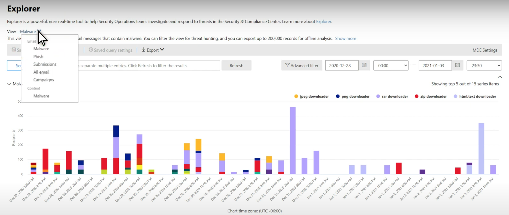

# Microsoft Defender for Office 365 威脅瀏覽器中的威脅搜尋Threat hunting in Threat Explorer for Microsoft Defender for Office 365

本文內容：In this article:

- [威脅瀏覽器逐步流覽Threat Explorer walk-through](#threat-explorer-walk-through)
- [電子郵件調查Email investigation](#email-investigation)
- [電子郵件修復Email remediation](#email-remediation)
- [威脅搜尋體驗的增強功能Improvements to threat hunting experience](#improvements-to-threat-hunting-experience)

> [!NOTE]
> 這是 **威脅 Explorer (Explorer)**、**電子郵件安全性** 及 **Explorer 和即時** 偵測 (基礎的 **3 篇文章** 中的一部分，例如工具間的差異，以及操作) 所需的許可權。This is part of a **3-article series** on **Threat Explorer (Explorer)**, **email security**, and **Explorer and Real-time detections basics** (such as differences between the tools, and permissions needed to operate them). 此系列中的其他兩篇文章是 [使用威脅瀏覽器的電子郵件安全性](email-security-in-microsoft-defender.md) 和 [威脅瀏覽器，以及即時的偵測基礎知識](real-time-detections.md)。The other two articles in this series are [Email security with Threat Explorer](email-security-in-microsoft-defender.md) and [Threat Explorer and Real-time detections basics](real-time-detections.md).

**適用於****Applies to**
- [適用於 Office 365 的 Microsoft Defender 方案 1 和方案 2Microsoft Defender for Office 365 plan 1 and plan 2](defender-for-office-365.md)
- [Microsoft 365 DefenderMicrosoft 365 Defender](../defender/microsoft-365-defender.md)

如果您的組織有 [Office 365 的 Microsoft Defender](defender-for-office-365.md)，而且您具有 [許可權](#required-licenses-and-permissions)，您可以使用 **Explorer** 或 **即時** 偵測來偵測和修正威脅。If your organization has [Microsoft Defender for Office 365](defender-for-office-365.md), and you have the [permissions](#required-licenses-and-permissions), you can use **Explorer** or **Real-time detections** to detect and remediate threats. 

在 [ **安全性 & 規範中心**] 中，移至 [ **威脅管理**]，然後選擇 [ **Explorer** ] _或_[ **即時** 偵測]。In the **Security & Compliance Center**, go to **Threat management**, and then choose **Explorer** _or_ **Real-time detections**.

 

****

|使用 Microsoft Defender Office 365 方案2，您會看到：With Microsoft Defender for Office 365 Plan 2, you see:|使用 Microsoft Defender Office 365 方案1，您會看到：With Microsoft Defender for Office 365 Plan 1, you see:|
|---|---|
|||
|

使用這些工具，您可以：With these tools, you can:

- 查看 Microsoft 365 安全性功能偵測到的惡意程式碼See malware detected by Microsoft 365 security features
- 查看網路釣魚 URL，然後按一下 [已判定資料]View phishing URL and click verdict data
- 從瀏覽器中的視圖開始自動調查和回應程式Start an automated investigation and response process from a view in Explorer
- 調查惡意電子郵件及其他Investigate malicious email, and more

如需詳細資訊，請參閱 [使用威脅瀏覽器的電子郵件安全性](email-security-in-microsoft-defender.md)。For more information, see [Email security with Threat Explorer](email-security-in-microsoft-defender.md). 

## 威脅瀏覽器逐步流覽Threat Explorer walk-through

在 Microsoft Defender for Office 365 中，有兩個訂閱者案（方案1和方案2）。In Microsoft Defender for Office 365, there are two subscription plans—Plan 1 and Plan 2. 手動運作的威脅搜尋工具，都存在於兩個計畫中的不同名稱和不同功能。Manually operated Threat hunting tools exist in both plans, under different names and with different capabilities.

Office 365 方案1的 Defender 使用 *即時* 偵測，也就是 *威脅瀏覽器* 的子集 (也稱為計畫2中的 *Explorer*) 搜尋工具。Defender for Office 365 Plan 1 uses *Real-time detections*, which is a subset of the *Threat Explorer* (also called *Explorer*) hunting tool in Plan 2. 在此系列文章中，大部分的範例是使用完整威脅瀏覽器建立的。In this series of articles, most of the examples were created using the full Threat Explorer. 管理員應該在即時偵測中測試任何步驟，以查看其適用的位置。Admins should test any steps in Real-time detections to see where they apply.

若要開啟 Explorer 工具，請移至 **Security & 合規性中心**  >  **威脅管理**  >  **瀏覽器** (或 **即時** 偵測) 。To open the Explorer tool, go to **Security & Compliance Center** > **Threat management** > **Explorer** (or **Real-time detections**). 依預設，您會到達 **惡意軟體** 頁面，但使用 [View] （ **查看** ）下拉式功能表以熟悉您的選項。By default, you’ll arrive on the **Malware** page, but use the **View** drop down to get familiar with your options. 如果您要搜尋網路釣魚網路，或鑽研至威脅活動，請選擇這些視圖。If you’re hunting Phish, or digging into a threat campaign, choose those views.

> [!div class="mx-imgBorder"]
> 

一旦安全性作業 (Sec Op) 人員會選取他們想要查看的資料、範圍是否如使用者 **報送** 或更大的查看（如 **所有電子郵件**），他們可以使用 [ **寄件者** ] 按鈕進一步篩選。Once a security operations (Sec Ops) person selects the data they want to see, whether the scope is narrow view like user **Submissions**, or a wider view, like **All email**, they can use the **Sender** button to further filter. 請記得選取 [重新整理]，以完成篩選動作。Remember to select Refresh to complete your filtering actions.

> [!div class="mx-imgBorder"]
> 

若要在瀏覽器中精煉焦點或即時偵測，您可以在層中想到。Refining focus in Explorer or Real-time detection can be thought of in layers. 第一個是 **View**。The first is **View**. 第二個可以視為 *篩選的焦點*。The second can be thought of as a *filtered focus*. 例如，您可以透過記錄決策來回溯您在尋找威脅時所採取的步驟：若要在瀏覽器中找出問題， **我選擇具有收件者篩選器焦點的惡意程式碼視圖**。For example, you can retrace the steps you took in finding a threat by recording your decisions like this: To find the issue in Explorer, **I chose the Malware View with a Recipient filter focus**. 這可讓您更輕鬆 retracing 步驟。This makes retracing your steps easier.

> [!TIP]
> 如果 Sec Ops 使用標籤來標示其考慮高值 **目標的帳戶** ，他們可以像網路釣魚視圖一樣，進行選擇 *篩選焦點 (包括使用) 的日期範圍*。If Sec Ops uses **Tags** to mark accounts they consider high valued targets, they can make selections like *Phish View with a Tags filter focus (include a date range if used)*. 這會在時間範圍 (等時間範圍內，向使用者顯示其高價值的使用者目標，例如，當某些網路釣魚攻擊針對其行業) 所發生的情況。This will show them any phishing attempts directed at their high value user targets during a time-range (like dates when certain phishing attacks are happening a lot for their industry). 

您可以使用日期範圍控制項，對日期範圍進行改進。Refinements can be made on date ranges by using the date range controls. 在這裡，您可以在 **惡意** 代碼視圖中查看瀏覽器，並使用 **偵測技術** 篩選焦點。Here you can see Explorer in **Malware** view, with a **Detection Technology** filter focus. 但它是可讓 Sec Ops 小組深入瞭解的「 **高級篩選** 」按鈕。But it’s the **Advanced filter** button that lets Sec Ops teams dig deep. 

> [!div class="mx-imgBorder"]
> 

按一下 [ **高級] 篩選器** 會彈出面板，讓每個 hunters 建立查詢本身，讓它們包含或排除所需查看的資訊。Clicking the **Advanced filter** pops a panel that will let Sec Ops hunters build queries themselves, letting them include or exclude the information they need to see. 瀏覽器頁面上的圖表和表格都會反映其結果。Both the chart and table on the Explorer page will reflect their results. 

> [!div class="mx-imgBorder"]
> 

使用 [ **欄選項** ] 按鈕，以取得表格中最有説明的資訊類型：Use the **Column options** button to get the kind of information on the table that would be most helpful: 

> [!div class="mx-imgBorder"]
> 

> [!div class="mx-imgBorder"]
> 

在同一個 mien 中，請務必測試顯示選項。In the same mien, make sure to test your display options. 不同的物件會對相同資料的不同簡報有很好的反應。Different audiences will react well to different presentations of the same data. 針對有些檢視器， **電子郵件來源** 地圖可顯示威脅的普及或更快，比其旁邊的 [ **市場活動顯示** ] 選項更快。For some viewers, the **Email Origins** map can show that a threat is widespread or discreet more quickly than the **Campaign display** option right next to it. 每秒 Op 可以利用這些顯示效果，使底線成為安全性和保護的必要點，或用於進行後續比較，以示範其動作的效能。Sec Ops can make use of these displays to best make points that underscore the need for security and protection, or for later comparison, to demonstrate the effectiveness of their actions. 

> [!div class="mx-imgBorder"]
> 

> [!div class="mx-imgBorder"]
> 

### 電子郵件調查Email investigation

當您看到可疑的電子郵件時，按一下名稱以展開右側的飛出視窗。When you see a suspicious email, click the name to expand the flyout on the right. 在這裡，允許 Sec Ops 的橫幅會看到 [ [電子郵件實體] 頁面](mdo-email-entity-page.md) 可供使用。Here, the banner that lets Sec Ops see the [email entity page](mdo-email-entity-page.md) is available.

[電子郵件實體] 頁面會將可在 [ **詳細** 資料]、[ **附件**]、[ **裝置**] 底下找到的內容，包含更多組織的資料。The email entity page pulls together contents that can be found under **Details**, **Attachments**, **Devices**, but includes more organized data. 這包括 DMARC 結果、純文字顯示（含副本選項的電子郵件標題）、判定已安全引爆之附件的資訊，以及 detonations 丟棄的檔案， (可以包含已連接的 IP 位址，以及) 的頁面或檔案的螢幕擷取畫面。This includes things like DMARC results, plain text display of the email header with a copy option, verdict information on attachments that were securely detonated, and files those detonations dropped (can include IP addresses that were contacted and screenshots of pages or files). URLs 及其 verdicts 也會以報告的類似詳細資料列出。URLs and their verdicts are also listed with similar details reported. 

當您到達此階段時，[電子郵件實體] 頁面將對最後一個步驟（*修正*）很重要。When you reach this stage, the email entity page will be critical to the final step—*remediation*. 

> [!div class="mx-imgBorder"]
> 

> [!TIP]
> 若要深入瞭解 [ **分析** ] 索引標籤上的 [豐富的電子郵件實體) ] 頁面 (，包括引爆附件的結果、包含 URLs 的結果，以及安全的電子郵件預覽，請按一下 [這裡](mdo-email-entity-page.md)。To learn more about the rich email entity page (seen below on the **Analysis** tab), including the results of detonated Attachments, findings for included URLs, and safe Email preview, click [here](mdo-email-entity-page.md).

> [!div class="mx-imgBorder"]
> ![電子郵件實體頁面的 [分析] 索引標籤](../../media/threat-explorer-analysis-tab.png)

### 電子郵件修復Email remediation

當 Sec Op 人員判斷電子郵件成為威脅之後，下一個瀏覽器或即時偵測步驟便會處理威脅並修正該威脅。Once a Sec Ops person determines that an email is a threat, the next Explorer or Real-time detection step is dealing with the threat and remediating it. 若要執行此動作，可以傳回威脅瀏覽器，選取問題電子郵件的核取方塊，然後使用 [ **動作** ] 按鈕。This can be done by returning to Threat Explorer, selecting the checkbox for the problem email, and using the **Actions** button.

> [!div class="mx-imgBorder"]
> ![威脅瀏覽器中的 [動作] 按鈕](../../media/threat-explorer-email-actions-button.png)

在這裡，分析員可以採取類似于垃圾郵件、網路釣魚或惡意程式碼等動作來報告郵件，也就是在您有計劃 2) 的情況下，可以包含觸發自動調查和回應 (或 AIR) 行動手冊 (的其他調查。Here, the analyst can take actions like reporting the mail as Spam, Phishing, or Malware, contacting recipients, or further investigations that can include triggering Automated Investigation and Response (or AIR) playbooks (if you have Plan 2). 或者，也可以將郵件報告為乾淨。Or, the mail can also be reported as clean.

> [!div class="mx-imgBorder"]
> ![[動作] 下拉式清單](../../media/threat-explorer-email-actions-drop-down.png)

## 威脅搜尋體驗的增強功能Improvements to threat hunting experience

### 警示識別碼Alert ID

從警示流覽至威脅瀏覽器時，會依照 **警示識別碼** 篩選該 **視圖**。When navigating from an alert into Threat Explorer, the **View** will be filtered by **Alert ID**. 這也適用于即時偵測。This also applies in Real-time detection. 會顯示與特定警示相關的郵件，以及 (計數) 的電子郵件總數。Messages relevant to the specific alert, and an email total (a count) are shown. 您將能夠查看郵件是否屬於警示的一部分，以及從該郵件流覽至相關的警示。You will be able to see if a message was part of an alert, as well as navigate from that message to the related alert.

最後，警示識別碼會包含在 URL 中，例如： `https://protection.office.com/viewalerts?id=372c9b5b-a6c3-5847-fa00-08d8abb04ef1`Finally, alert ID is included in the URL, for example: `https://protection.office.com/viewalerts?id=372c9b5b-a6c3-5847-fa00-08d8abb04ef1`

> [!div class="mx-imgBorder"]
> 

> [!div class="mx-imgBorder"]
> 

### 延伸 Explorer (和即時偵測) 資料保留與試用承租人的搜尋限制Extending Explorer (and Real-time detections) data retention and search limit for trial tenants 

在此變更中，分析者將可以搜尋並篩選超過30天的電子郵件資料 (會在威脅瀏覽器中增加7天) ，在威脅瀏覽器中增加，針對 Office P1 和 P2 試用租使用者的 Defender 進行即時偵測。As part of this change, analysts will be able to search for, and filter email data across 30 days (increased from seven days) in Threat Explorer and Real-time detections for both Defender for Office P1 and P2 trial tenants. 這不會影響 P1 和 P2 E5 客戶的任何實際執行承租人，保留預設值為已30天。This doesn’t impact any production tenants for both P1 and P2 E5 customers, where the retention default is already 30 days.

### 更新的匯出限制Updated Export limit 

可以從威脅瀏覽器匯出的電子郵件記錄數目現在是 200000 (為 9990) 。The number of Emails records that can be exported from Threat Explorer is now 200,000 (was 9990). 可以匯出的一組資料行不會變更。The set of columns that can be exported is unchanged. 

### 威脅瀏覽器中的標記Tags in Threat Explorer

> [!NOTE]
> [使用者標記] 功能是在預覽中，並非所有人都可以使用。The user tags feature is in Preview and may not be available to everyone. 此外，預覽可能也會變更。Also, Previews are subject to change. 如需發行排程的相關資訊，請參閱 Microsoft 365 藍圖。For information about the release schedule, check out the Microsoft 365 roadmap.

使用者標記識別 Microsoft Defender 中 Office 365 的特定使用者群組。User tags identify specific groups of users in Microsoft Defender for Office 365. 如需標記的相關資訊（包括授權和設定），請參閱 [User tags](user-tags.md)。For more information about tags, including licensing and configuration, see [User tags](user-tags.md).

在威脅瀏覽器中，您可以在下列體驗中看到使用者標記的相關資訊。In Threat Explorer, you can see information about user tags in the following experiences.

#### 電子郵件格線視圖Email grid view

當分析員查看 [ **標記** ] 欄的電子郵件格線時，他們會看到所有已套用到寄件者或收件者信箱的標記。When analysts look at the **Tags** column the email grid, they are seeing all tags that have been applied to sender or recipient mailboxes. 依預設，會先顯示「 *優先順序」帳戶* 之類的系統標記。By default, system tags like *priority accounts* are shown first.

> [!div class="mx-imgBorder"]
> 

#### 篩選Filtering

標記可用作篩選。Tags can be used as filters. 以這種方式，只在優先順序帳戶中加以搜尋，或使用特定的使用者標記案例。Hunt among priority accounts only, or use specific user tags scenarios this way. 您也可以排除包含某些標記的結果。You can also exclude results that have certain tags. 結合標記與其他篩選和日期範圍，以縮小您的調查範圍。Combine Tags with other filters and date ranges to narrow your scope of investigation. 

> [!div class="mx-imgBorder"]
> 

#### 電子郵件詳細資料快顯視窗Email detail flyout

若要查看寄件者和收件者的個別標記，請選取電子郵件以開啟 [郵件詳細資料] 浮出。To view the individual tags for sender and recipient, select an email to open the message details flyout. 在 [ **摘要** ] 索引標籤上，會分別顯示寄件者和收件者標記。On the **Summary** tab, the sender and recipient tags are shown separately. 寄件者和收件者個別標記的相關資訊可匯出為 CSV 資料。The information about individual tags for sender and recipient can be exported as CSV data. 

> [!div class="mx-imgBorder"]
> 

標記資訊也會顯示在 URL 中按一下 [飛入]。Tags information is also shown in the URL clicks flyout. 若要查看，請移至網路釣魚或所有電子郵件 view > **URLs** 或 **URL 按一下** ] 索引標籤。選取個別的 [URL] 飛出，以查看有關該 URL 之按一下的其他詳細資料，包括任何與該按一下相關聯的標記。To see it, go to Phish or All Email view > **URLs** or **URL Clicks** tab. Select an individual URL flyout to see additional details about clicks for that URL, including any Tags associated with that click.

### 更新時程表視圖Updated Timeline View

> [!div class="mx-imgBorder"]
> 
>
觀看[此影片](https://www.youtube.com/watch?v=UoVzN0lYbfY&list=PL3ZTgFEc7LystRja2GnDeUFqk44k7-KXf&index=4)瞭解更多資訊。Learn more by watching [this video](https://www.youtube.com/watch?v=UoVzN0lYbfY&list=PL3ZTgFEc7LystRja2GnDeUFqk44k7-KXf&index=4).

## 延伸功能Extended capabilities

### 主要目標使用者Top targeted users

主要惡意程式碼系列會顯示惡意程式碼區段中 **主要的目標使用者** 。Top Malware Families shows the **top targeted users** in the Malware section. 主要的目標使用者將透過網路釣魚和所有電子郵件視圖延伸。Top targeted users will be extended through Phish and All Email views too. 分析員將可以查看前5位目標使用者，以及每個視圖中每位使用者的嘗試次數。Analysts will be able to see the top-five targeted users, along with the number of attempts for each user in each view. 

安全性作業使用者可以匯出目標使用者的清單，最多可匯出3000的限制，以及嘗試的次數，以供每個電子郵件 view 之離線分析使用。Security operations people be able to export the list of targeted users, up to a limit of 3,000, along with the number of attempts made, for offline analysis for each email view. 此外，選取 [嘗試次數] (例如，13在下列的圖像中嘗試) 會在威脅瀏覽器中開啟篩選的視圖，這樣您就能看到有關電子郵件的詳細資料，以及該使用者的威脅。Also, selecting the number of attempts (for example, 13 attempts in the image below) will open a filtered view in Threat Explorer, so you can see more details across emails, and threats for that user.  

> [!div class="mx-imgBorder"]
> 

### 傳輸規則 ExchangeExchange transport rules

安全性作業小組能夠在電子郵件格線視圖中查看所有 Exchange 的傳輸規則 (或郵件流程規則) 套用至郵件。The security operations team will be able to see all the Exchange transport rules (or Mail flow rules) applied to a message, in the Email grid view. 選取格線中的 [**欄選項**]，然後從 [欄] 選項 **新增 Exchange 傳輸規則**。Select **Column options** in the grid and then **Add Exchange Transport Rule** from the column options. 在電子郵件中的 [**詳細資料**] 快顯視窗中也會顯示 Exchange 傳輸規則] 選項。The Exchange transport rules option is also visible on the **Details** flyout in the email. 

會出現套用至郵件的傳輸規則名稱及 Guid。Names and GUIDs of the transport rules applied to the message appear. 分析員將可以使用傳輸規則的名稱來搜尋郵件。Analysts will be able to search for messages by using the name of the transport rule. 這是包含搜尋，也就是您也可以進行部分搜尋。This is a CONTAINS search, which means you can do partial searches as well. 

> [!IMPORTANT]
> Exchange 傳輸規則搜尋與名稱可用性取決於指派給您的特定角色。Exchange transport rule search and name availability depend on the specific role assigned to you. 您必須具有下列其中一個角色或許可權，才能查看傳輸規則名稱和搜尋。You need to have one of the following roles or permissions to view the transport rule names and search. 不過，即使沒有下列角色或許可權，分析員還是可以在電子郵件詳細資料中看到傳輸規則標籤及 GUID 資訊。However, even without the roles or permissions below, an analyst may see the transport rule label and GUID information in the Email Details. 其他記錄流覽的電子郵件格線、電子郵件 flyouts、篩選和匯出不會受到影響。Other record-viewing experiences in Email Grids, Email flyouts, Filters, and Export are not affected.
>
> - Exchange Online僅資料遺失防護：全部Exchange Online Only - Data Loss Prevention: All
> - Exchange Online僅 O365SupportViewConfig： AllExchange Online Only - O365SupportViewConfig: All
> - Microsoft Azure Active Directory 或 Exchange Online 安全性管理員： AllMicrosoft Azure Active Directory or Exchange Online - Security Admin: All
> - Azure Active Directory 或 Exchange Online 安全性讀者： AllAzure Active Directory or Exchange Online - Security Reader: All
> - Exchange Online僅傳輸規則：全部Exchange Online Only - Transport Rules: All
> - Exchange Online僅 View-Only 設定：全部Exchange Online Only - View-Only Configuration: All
>
> 在電子郵件格線、詳細資料浮出和匯出的 CSV 中，ETRs 會以如下所示的名稱/GUID 呈現。Within the email grid, Details flyout, and Exported CSV, the ETRs are presented with a Name/GUID as shown below.
>
> > [!div class="mx-imgBorder"]
> > 

### 輸入連接器Inbound connectors

連接器是一組指示，可自訂您的電子郵件進出 Microsoft 365 或 Office 365 組織的方式。Connectors are a collection of instructions that customize how your email flows to and from your Microsoft 365 or Office 365 organization. 它們可讓您套用任何安全性限制或控制項。They enable you to apply any security restrictions or controls. 在 [威脅瀏覽器] 中，您可以查看與電子郵件相關的連接器，並搜尋使用連接器名稱的電子郵件。In Threat Explorer, you can view the connectors that are related to an email and search for emails using connector names. 

連接器的搜尋是包含查詢，這表示部分關鍵字搜尋可以運作：The search for connectors is a CONTAINS query, which means partial keyword searches can work: 

> [!div class="mx-imgBorder"]
> 

## 必要的授權和權限Required licenses and permissions

您必須具有[Microsoft Defender Office 365](defender-for-office-365.md) ，才能使用 Explorer 或即時偵測。You must have [Microsoft Defender for Office 365](defender-for-office-365.md) to use Explorer or Real-time detections.

- Explorer 會包含在 Office 365 方案2的 Defender 中。Explorer is included in Defender for Office 365 Plan 2.
- 在 Office 365 方案1的 Defender 中包含即時偵測報告。The Real-time detections report is included in Defender for Office 365 Plan 1.
- 規劃為所有應受 Office 365 Defender 保護的使用者指派授權。Plan to assign licenses for all users who should be protected by Defender for Office 365. 瀏覽器和即時偵測顯示已授權使用者的偵測資料。Explorer and Real-time detections show detection data for licensed users.

若要查看和使用 Explorer 或即時偵測，您必須具備下列各項：To view and use Explorer or Real-time detections, you must have the following:

- 針對安全性 & 規範中心：For the Security & Compliance Center:

  - 組織管理Organization Management
  - 安全性管理員 (可以在 Azure Active Directory 系統管理中心 (中指派 <https://aad.portal.azure.com>) Security Administrator (this can be assigned in the Azure Active Directory admin center (<https://aad.portal.azure.com>)
  - 安全性讀取者Security Reader

- Exchange Online：For Exchange Online:

  - 組織管理Organization Management
  - 僅限檢視組織管理View-Only Organization Management
  - 僅限檢視收件者View-Only Recipients
  - 合規性管理Compliance Management

若要深入了解角色和權限，請參閱下列資源：To learn more about roles and permissions, see the following resources:

- [安全性與合規性中心的權限Permissions in the Security & Compliance Center](permissions-in-the-security-and-compliance-center.md)
- [Exchange Online 中的功能權限Feature permissions in Exchange Online](/exchange/permissions-exo/feature-permissions)
- [Exchange Online PowerShellExchange Online PowerShell](/powershell/exchange/exchange-online-powershell)

## 其他資訊More information

- [尋找並調查傳送的惡意電子郵件Find and investigate malicious email that was delivered](investigate-malicious-email-that-was-delivered.md) 
- [檢視在 SharePoint Online、OneDrive 和 Microsoft Teams 中偵測到的惡意檔案View malicious files detected in SharePoint Online, OneDrive, and Microsoft Teams](mdo-for-spo-odb-and-teams.md) 
- [取得威脅瀏覽器中的視圖 (和即時偵測的概覽) Get an overview of the views in Threat Explorer (and Real-time detections)](threat-explorer-views.md) 
- [威脅防護狀態報告Threat protection status report](view-email-security-reports.md#threat-protection-status-report) 
- [Microsoft 威脅防護的自動化調查及回應Automated investigation and response in Microsoft Threat Protection](automated-investigation-response-office.md) 
- [使用電子郵件實體頁面調查電子郵件Investigate emails with the Email Entity Page](mdo-email-entity-page.md)