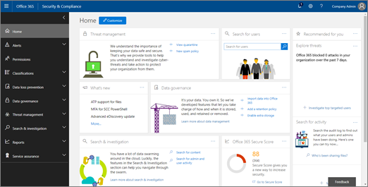

# 威脅追蹤器 - 新增和值得注意的功能Threat Trackers - New and Noteworthy

[!INCLUDE [Microsoft 365 Defender rebranding](../includes/microsoft-defender-for-office.md)]

[Office 365 威脅調查和回應](office-365-ti.md) 功能可讓您的組織的安全性小組探索和採取行動，以防範 cybersecurity 威脅。[Office 365 Threat Investigation and Response](office-365-ti.md) capabilities enable your organization's security team to discover and take action against cybersecurity threats. Office 365 威脅調查和回應功能包括威脅追蹤器功能，包括值得注意的追蹤器。Office 365 Threat Investigation and Response capabilities include Threat Tracker features, including Noteworthy trackers. 請閱讀本文，以取得這些新功能及後續步驟的概述。Read this article to get an overview of these new features and next steps. 

> [!IMPORTANT]
> Office 365 威脅情報現在是 Microsoft Defender for Office 365 Plan 2，另外還有其他威脅防護功能。Office 365 Threat Intelligence is now Microsoft Defender for Office 365 Plan 2, along with additional threat protection capabilities. 若要深入瞭解，請參閱 [Microsoft defender For office 365 方案和價格](https://products.office.com/exchange/advance-threat-protection) 和 [Microsoft defender For Office 365 服務說明](https://docs.microsoft.com/office365/servicedescriptions/office-365-advanced-threat-protection-service-description)。To learn more, see [Microsoft Defender for Office 365 plans and pricing](https://products.office.com/exchange/advance-threat-protection) and the [Microsoft Defender for Office 365 Service Description](https://docs.microsoft.com/office365/servicedescriptions/office-365-advanced-threat-protection-service-description).
  
## 何謂威脅追蹤器？What are Threat Trackers?

威脅追蹤器是資訊性的小元件和視圖，可讓您在可能會影響公司的不同 cybersecurity 問題上進行智慧。Threat Trackers are informative widgets and views that provide you with intelligence on different cybersecurity issues that might impact your company. 例如，您可以使用威脅追蹤器來查看有關趨勢惡意程式碼活動的資訊。For example, you can view information about trending malware campaigns using Threat Trackers.
  

  
大多數追蹤器頁面包括定期更新的趨勢數位、小小元件，可協助您瞭解哪些問題最大或已增加的問題，以及會帶您前往瀏覽器之 [ **動作** ] 欄中的快速連結，您可以在其中查看更詳細的資訊。Most tracker pages include trending numbers that are updated periodically, widgets to help you understand which issues are the biggest or have grown the most, and a quick link in the **Actions** column that takes you to Explorer, where you can view more detailed information. 
  

  
追蹤器只是您使用 [Microsoft Defender For Office 365 方案 2](office-365-ti.md)所獲得的眾多極佳功能。Trackers are just a few of the many great features you get with [Microsoft Defender for Office 365 Plan 2](office-365-ti.md). 威脅追蹤器包括 [Noteworth](#noteworthy-trackers)追蹤器、 [趨勢](#trending-trackers)追蹤器、 [追蹤的查詢](#tracked-queries)，以及 [已儲存的查詢](#saved-queries)。Threat Trackers include [Noteworth trackers](#noteworthy-trackers), [Trending trackers](#trending-trackers), [Tracked queries](#tracked-queries), and [Saved queries](#saved-queries).
  
若要查看和使用您組織的威脅追蹤追蹤器，請移至安全性與 &amp; 合規性中心 ( [https://protection.office.com](https://protection.office.com)) ，然後選擇 [ **威脅管理** \> **威脅追蹤** 器]。To view and use your Threat Trackers for your organization, go to the Security &amp; Compliance Center ( [https://protection.office.com](https://protection.office.com)) and choose **Threat management** \> **Threat tracker**.
  
> [!NOTE]
> 若要使用威脅追蹤追蹤器，您必須是全域系統管理員、安全性管理員或安全性讀取者。To use Threat Trackers, you must be a global administrator, security administrator, or security reader. 請參閱 [安全性與 &amp; 合規性中心的許可權](permissions-in-the-security-and-compliance-center.md)。See [Permissions in the Security &amp; Compliance Center](permissions-in-the-security-and-compliance-center.md). 
  
### 注意追蹤追蹤Noteworthy trackers

您會發現追蹤追蹤器，您可以在其中找到您應該知道的大、小威脅和風險。Noteworthy trackers are where you'll find big and smaller threats and risks that we think you should know about. 值得注意的追蹤追蹤程式可協助您找出這些問題是否存在於 Microsoft 365 環境中，加上下列)  (的文章連結，可提供更多有關所發生事情的詳細資訊，以及如何影響組織使用 Office 365 的方式。Noteworthy trackers help you find whether these issues exist in your Microsoft 365 environment, plus link to articles (like this one) that give you more details on what is happening, and how they'll impact your organization's use of Office 365. 不論是 Wannacry、Petya) 或現有威脅（可能會造成一些新的 (難題） (例如，或現有威脅（如其他 inaugural 值得注意的專案-Nemucod) ），您可以在此找到重要的新專案，而您的安全小組應定期檢查及檢查。Whether it's a big new threat (e.g. Wannacry, Petya) or an existing threat that might create some new challenges (like our other inaugural Noteworthy item - Nemucod), this is where you'll find important new items you and your security team should review and examine periodically.
  
通常，追蹤追蹤追蹤器只會在我們找出新威脅時一周內發佈，而且考慮您可能需要此功能所提供的額外洞察力。Typically Noteworthy trackers will be posted for just a couple of weeks when we identify new threats and think you might need the extra visibility that this feature provides. 當威脅的最大風險通過後，我們就會移除該值得注意的專案。Once the biggest risk for a threat has passed, we'll remove that Noteworthy item. 如此一來，我們便可以將清單保持在最新和其他相關的新專案。This way, we can keep the list fresh and up to date with other relevant new items.
  
### 趨勢追蹤器Trending trackers

趨勢追蹤追蹤器 (以前稱為「活動」) 在過去一周內，反白顯示貴組織的電子郵件所收到的新威脅。Trending trackers (formerly called Campaigns) highlight new threats received in your organization's email in the past week.
  

  
趨勢追蹤追蹤器讓您瞭解您應該檢查的新威脅，以確保您的公司環境對攻擊的準備。Trending trackers give you an idea of new threats you should review to ensure your broader corporate environment is prepared against attacks.
  
### 追蹤的查詢Tracked queries

追蹤的查詢會利用您已儲存的查詢，定期評估您組織中的 Microsoft 365 活動。Tracked queries leverage your saved queries to periodically assess Microsoft 365 activity in your organization. 這可讓您進行事件的趨勢分析，以及即將到來的月份。This gives you event trending, with more to come in the coming months. 追蹤的查詢會自動執行，提供最新資訊，而不需要記住重新執行查詢。Tracked queries run automatically, giving you up-to-date information without having to remember to re-run your queries.
  

  
### 已儲存的查詢Saved queries

儲存的查詢也會在追蹤器區段中找到。Saved queries are also found in the Trackers section. 您可以使用儲存的查詢來儲存您想快又重複的一般瀏覽器搜尋，而不必每次都重新建立搜尋。You can use Saved queries to store the common Explorer searches that you want to get back to quicker and repeatedly, without having to re-create the search every time.
  

  
您可以使用瀏覽器頁面頂端的 [ **儲存查詢** ] 按鈕，儲存值得注意的追蹤器查詢或任何您自己的 Explorer 查詢。You can always save a Noteworthy tracker query or any of your own Explorer queries using the **Save query** button at the top of the Explorer page. 儲存在 [追蹤] 頁面上的 [ **儲存的查詢** ] 清單中，會顯示所有儲存的專案。Anything saved there will show up in the **Saved queries** list on the Tracker page. 
  
## 追蹤器與瀏覽器Trackers and Explorer

不論您是在 (即將推出的電子郵件、內容或辦公室活動) ，Explorer 和追蹤追蹤都會一起運作，以協助您調查和追蹤安全性風險和威脅。Whether you're reviewing email, content, or Office activities (coming soon), Explorer and Trackers work together to help you investigate and track security risks and threats. 所有共同追蹤追蹤器提供的資訊，可保護您的使用者，方法是強調新的、值得注意和經常搜尋的問題-確保您的業務在移動至雲端時得到更好的保護。All together, Trackers provide you with information to protect your users by highlighting new, notable, and frequently searched issues - ensuring your business is better protected as it moves to the cloud.
  
請記住，您可以在 [安全性 & 合規性中心](https://support.microsoft.com/office/a5f2fd18-b029-4257-b5a8-ae83e7768c85)的右下方，按一下右下角的 [ **意見** 反應] 按鈕，隨時提供我們對此或其他 Microsoft 365 安全性功能的意見反應。And remember that you can always provide us feedback on this or other Microsoft 365 security features by clicking on the **Feedback** button in the lower right corner of the [Overview of the Security & Compliance Center](https://support.microsoft.com/office/a5f2fd18-b029-4257-b5a8-ae83e7768c85).
  

  
## 追蹤器和 Microsoft Defender for Office 365Trackers and Microsoft Defender for Office 365

透過我們的 inaugural 值得注意的威脅，我們會強調 [安全附件](atp-safe-attachments.md)所偵測到的高級惡意程式碼威脅。With our inaugural Noteworthy threat, we're highlighting advanced malware threats detected by [Safe Attachments](atp-safe-attachments.md). 如果您是 Office 365 企業版 E5 客戶，而您不是使用 [Microsoft Defender For Office 365](office-365-atp.md)，您應該會包含在您的訂閱中。If you're an Office 365 Enterprise E5 customer and you're not using [Microsoft Defender for Office 365](office-365-atp.md), you should be - it's included in your subscription. 即使您有其他安全性工具篩選您的 Office 365 服務的電子郵件流程，Office 365 的 Defender 仍可提供值。Defender for Office 365 provides value even if you have other security tools filtering email flow with your Office 365 services. 不過，當您主要的電子郵件安全性解決方案是透過 Office 365 時，反垃圾郵件和 [安全連結](atp-safe-links.md) 功能就能發揮最佳作用。However, anti-spam and [Safe Links](atp-safe-links.md) features work best when your main email security solution is through Office 365.
  

  
在當今威脅 riddled 世界中，只執行傳統的反惡意程式碼掃描，表示您未受到攻擊的程度不足。In today's threat-riddled world, running only traditional anti-malware scans means you are not protected well enough against attacks. 當今更為複雜的攻擊者使用常用工具，以建立新的、經過模糊處理或延遲的攻擊，而這些攻擊會因傳統的簽章型反惡意程式碼引擎而無法辨識。Today's more sophisticated attackers use commonly available tools to create new, obfuscated, or delayed attacks that won't be recognized by traditional signature-based anti-malware engines. [安全附件] 功能會取得電子郵件附件，並在虛擬環境中引爆它們，以判斷它們是否安全或惡意。The Safe Attachments feature takes email attachments and detonates them in a virtual environment to determine whether they're safe or malicious. 此引爆程式會開啟虛擬電腦環境中的每個檔案，然後觀察在開啟該檔案後會發生什麼情況。This detonation process opens each file in a virtual computer environment, then watches what happens after the file is opened. 不論是 PDF、壓縮檔或 Office 檔，惡意程式碼都會隱藏在檔案中，只有在受害者在其電腦上開啟之後，才啟用該檔案。Whether it's a PDF, and compressed file, or an Office document, malicious code can be hidden in a file, activating only once the victim opens it on their computer. 透過 detonating 和分析電子郵件流程中的檔案，Office 365 的 Defender 功能會根據行為、檔信譽及許多啟發式規則，尋找這些威脅。By detonating and analyzing the file in the email flow, Defender for Office 365 capabilities finds these threats based on behaviors, file reputation, and a number of heuristic rules.
  
新的值得注意的威脅篩選會顯示最近透過安全附件偵測到的專案。The new Noteworthy threat filter highlights items that were recently detected through Safe Attachments. 這些偵測是指在您的電子郵件流程或其他客戶的電子郵件中，並非先前由 Microsoft 365 找到的新惡意檔案專案。These detections represent items that are new malicious files, not previously found by Microsoft 365 in either your email flow or other customers' email. 請留意值得注意之威脅追蹤追蹤專案中的專案，查看其目標，並查看 [高級分析] 索引標籤 (所顯示的引爆詳細資料，請按一下瀏覽器中的電子郵件主題) 。Pay attention to the items in the Noteworthy Threat Tracker, see who was targeted by them, and review the detonation details shown on the Advanced Analysis tab (found by clicking on the subject of the email in Explorer). 附注您只會在 [安全附件] 功能所偵測到的電子郵件上找到此索引標籤-這項值得注意的追蹤器包含該篩選，但您也可以在瀏覽器中使用該篩選器進行其他搜尋Note you'll only find this tab on emails detected by the Safe Attachments capability - this Noteworthy tracker includes that filter, but you can also use that filter for other searches in Explorer.
  
## 後續步驟Next steps

- 如果您的組織還沒有這些 Office 365 威脅調查和回應功能，請參閱 [如何取得 office 365 威脅調查和回應功能？](office-365-ti.md)。If your organization doesn't already have these Office 365 Threat Investigation and Response capabilities, see [How do we get Office 365 Threat Investigation and Response capabilities?](office-365-ti.md).

- 確定您的安全性小組已指派正確的角色和許可權。Make sure that your security team has the correct roles and permissions assigned. 您必須是全域系統管理員，或具有安全性管理員或在安全性與規範中心中指定的「搜尋」和「清除」角色 &amp; 。You must be a global administrator, or have the Security Administrator or Search and Purge role assigned in the Security &amp; Compliance Center. 請參閱 [安全性與 &amp; 合規性中心的許可權](permissions-in-the-security-and-compliance-center.md)。See [Permissions in the Security &amp; Compliance Center](permissions-in-the-security-and-compliance-center.md).

- 在您的 Microsoft 365 環境中觀賞要顯示的新追蹤器。Watch for the new Trackers to show up in your Microsoft 365 environment. 若有可用，您可以在 [這裡](https://protection.office.com/)找到追蹤追蹤器。When available, you'll find your Trackers [here](https://protection.office.com/). 移至 **威脅管理** \> **威脅** 追蹤器。Go to **Threat management** \> **Threat trackers**.

- 若尚未這麼做，請深入瞭解並為您的組織設定 [Microsoft Defender For Office 365](office-365-atp.md) （包括 [安全連結](atp-safe-links.md) 和 [安全附件](atp-safe-attachments.md)）。If you haven't already done so, learn more about and configure [Microsoft Defender for Office 365](office-365-atp.md) for your organization, including [Safe links](atp-safe-links.md) and [Safe Attachments](atp-safe-attachments.md).
