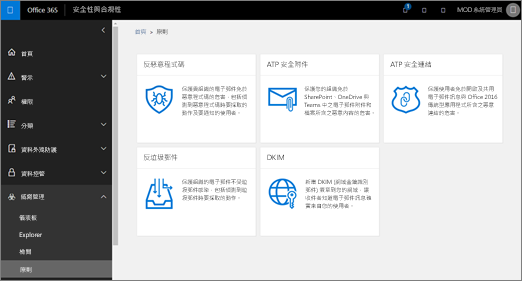
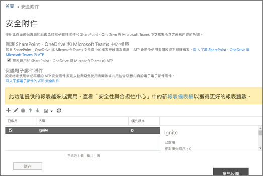

# 開啟適用於 SharePoint、OneDrive 及 Microsoft Teams 的 Office 365 ATPTurn on Office 365 ATP for SharePoint, OneDrive, and Microsoft Teams

> [!IMPORTANT]
> 本文適用於擁有 [Office 365 進階威脅防護](office-365-atp.md)的企業客戶。This article is intended for business customers who have [Office 365 Advanced Threat Protection](office-365-atp.md). 如果您是家用版使用者且正在尋找 Outlook 中安全連結的相關資訊，請參閱[進階 Outlook.com 安全性](https://support.office.com/article/882d2243-eab9-4545-a58a-b36fee4a46e2)。If you are a home user looking for information about Safe Links in Outlook, see [Advanced Outlook.com security](https://support.office.com/article/882d2243-eab9-4545-a58a-b36fee4a46e2).

[適用於 SharePoint、OneDrive 和 Microsoft Teams 的 Office 365 ATP](atp-for-spo-odb-and-teams.md) 可防止組織不小心共用惡意檔案。[Office 365 ATP for SharePoint, OneDrive, and Microsoft Teams](atp-for-spo-odb-and-teams.md) protects your organization from inadvertently sharing malicious files. 偵測到惡意檔案時，該檔案會遭到封鎖，因此在組織的安全性小組採取進一步動作之前，任何人都無法開啟、複製、移動或共用該檔案。When a malicious file is detected, that file is blocked so that no one can open, copy, move, or share it until further actions are taken by the organization's security team. 請參閱這篇文章以開啟適用於 SharePoint、OneDrive 和 Teams 的 ATP、設定通知以通知您偵測到的檔案，並採取後續步驟。Read this article to turn on ATP for SharePoint, OneDrive, and Teams, set up alerts to be notified about detected files, and take your next steps.

若要定義 (或編輯) ATP 原則，您必須獲派適當的角色。To define (or edit) ATP policies, you must be assigned an appropriate role. 下表中有一些範例描述：Some examples are described in the following table:

|角色Role|指派位置/條件Where/how assigned|
|---------|---------|
|Office 365 全域系統管理員Office 365 Global Administrator|註冊購買 Office 365 的人會預設為全域系統管理員。The person who signs up to buy Office 365 is a global admin by default. (請參閱[關於 Office 365 系統管理員角色](https://docs.microsoft.com/office365/admin/add-users/about-admin-roles)以深入了解。)(See [About Office 365 admin roles](https://docs.microsoft.com/office365/admin/add-users/about-admin-roles) to learn more.)|
|安全性系統管理員Security Administrator|Azure Active Directory 系統管理中心 ([https://aad.portal.azure.com](https://aad.portal.azure.com))Azure Active Directory admin center ([https://aad.portal.azure.com](https://aad.portal.azure.com))|
|Exchange Online 組織管理Exchange Online Organization Management|Exchange 系統管理中心 ([https://outlook.office365.com/ecp](https://outlook.office365.com/ecp))Exchange admin center ([https://outlook.office365.com/ecp](https://outlook.office365.com/ecp))  或or    PowerShell Cmdlet (請參閱 [Exchange Online PowerShell](https://docs.microsoft.com/powershell/exchange/exchange-online/exchange-online-powershell))PowerShell cmdlets (See [Exchange Online PowerShell](https://docs.microsoft.com/powershell/exchange/exchange-online/exchange-online-powershell))|

## 開啟適用於 SharePoint、OneDrive 與 Microsoft Teams 的 ATPTurn on ATP for SharePoint, OneDrive, and Microsoft Teams

**開始此程序之前，請先確認您的 Office 365 環境已開啟稽核記錄**。**Before you begin this procedure, make sure that audit logging is already turned on for your Office 365 environment**. 這項工作通常是由在 Exchange Online 中獲派稽核記錄角色的人員完成。This is typically done by someone who has the Audit Logs role assigned in Exchange Online. 如需詳細資訊，請參閱[開啟或關閉 Office 365 稽核記錄搜尋](../../compliance/turn-audit-log-search-on-or-off.md)。For more information, see [Turn Office 365 audit log search on or off](../../compliance/turn-audit-log-search-on-or-off.md).

1. 移至 [https://protection.office.com](https://protection.office.com) 然後以您的公司或學校帳戶登入。Go to [https://protection.office.com](https://protection.office.com), and sign in with your work or school account.

2. 在 Office 365 安全性的 & 合規性中心，在左側的導覽窗格中，**威脅管理**] 下選擇 [**原則** \> **安全附件**。In the Office 365 Security & Compliance Center, in the left navigation pane, under **Threat management**, choose **Policy** \> **Safe Attachments**.

   

3. 選取 **[開啟適用於 SharePoint、OneDrive 與 Microsoft Teams 的 ATP]**。Select **Turn on ATP for SharePoint, OneDrive, and Microsoft Teams**.

   

4. 按一下 **[儲存]**。Click **Save**.

5. 檢閱 (並視需要編輯) 組織的 [[安全附件原則]](set-up-atp-safe-attachments-policies.md) 和 [[安全連結原則]](set-up-atp-safe-links-policies.md)。Review (and, as appropriate, edit) your organization's [Safe Attachments policies](set-up-atp-safe-attachments-policies.md) and [Safe Links policies](set-up-atp-safe-links-policies.md).

6. （建議使用）以全域管理員或 SharePoint Online 系統管理員，執行**[Set-spotenant](https://docs.microsoft.com/powershell/module/sharepoint-online/Set-SPOTenant)** 指令程式搭配_DisallowInfectedFileDownload_參數設為*true*。(Recommended) As a global administrator or a SharePoint Online administrator, run the **[Set-SPOTenant](https://docs.microsoft.com/powershell/module/sharepoint-online/Set-SPOTenant)** cmdlet with the _DisallowInfectedFileDownload_ parameter set to *true*.

   - 將參數設定為 *true* 可封鎖偵測到的檔案的所有動作 (刪除除外)。Setting the parameter to *true* blocks all actions (except Delete) for detected files. 使用者將無法開啟、移動、複製或共用偵測到的檔案。People cannot open, move, copy, or share detected files.

   - 將參數設定為 *false* 可封鎖所有動作 (刪除和下載除外)。Setting the parameter to *false* blocks all actions except Delete and Download. 使用者可以選擇接受風險並下載偵測到的檔案。People can choose to accept the risk and download a detected file.

7. 最多需要 30 分鐘的時間，變更才會散佈至所有 Office 365 資料中心。Allow up to 30 minutes for your changes to spread to all Office 365 datacenters.

8. (建議) 繼續為偵測到的檔案設定警示。(Recommended) Proceed to set up alerts for detected files.

若要深入了解如何在 Office 365 中使用 PowerShell，請參閱[使用 PowerShell 管理 Office 365](https://docs.microsoft.com/office365/enterprise/powershell/manage-office-365-with-office-365-powershell)。To learn more about using PowerShell with Office 365, see [Manage Office 365 with PowerShell](https://docs.microsoft.com/office365/enterprise/powershell/manage-office-365-with-office-365-powershell).

若要深入了解當檔案被偵測為惡意檔案時的使用者體驗，請參閱[在 SharePoint Online、OneDrive 或 Microsoft Teams 中找到惡意檔案時該怎麼做](https://support.office.com/article/01e902ad-a903-4e0f-b093-1e1ac0c37ad2)。To learn more about the user experience when a file has been detected as malicious, see [What to do when a malicious file is found in SharePoint Online, OneDrive, or Microsoft Teams](https://support.office.com/article/01e902ad-a903-4e0f-b093-1e1ac0c37ad2).

## 為偵測到的檔案設定警示Set up alerts for detected files

若要在 SharePoint Online、商務用 OneDrive 或 Microsoft Teams 中的檔案被識別為惡意檔案時收到通知，您可以設定警示。To receive notification when a file in SharePoint Online, OneDrive for Business, or Microsoft Teams has been identified as malicious, you can set up an alert.

1. 在[Office 365 安全性 & 合規性中心](https://protection.office.com)中，選擇 [**提醒** \> **管理警示**。In the [Office 365 Security & Compliance Center](https://protection.office.com), choose **Alerts** \> **Manage alerts**.

2. 選擇 **[新警示原則]**。Choose **New alert policy**.

3. 指定警示的名稱。Specify a name for the alert. 例如，您可以輸入「程式庫中的惡意檔案」。For example, you could type Malicious Files in Libraries.

4. 輸入警示描述。Type a description for the alert. 例如，當您在 SharePoint Online、OneDrive 或 Microsoft Teams 中偵測到惡意檔案時，您可以輸入「通知系統管理員」。For example, you could type Notifies admins when malicious files are detected in SharePoint Online, OneDrive, or Microsoft Teams.

5. 在 **[下列情況時傳送此通知...]** 區段中，執行下列動作：In the **Send this alert when...** section, do the following:

   a.a. 在 **[活動]** 清單中，選擇 **[已偵測到檔案中的惡意程式碼]**。In the **Activities** list, choose **Detected malware in file**.

   b.b. 將 **[使用者]** 欄位保留空白。Leave the **Users** field empty.

6. 在 **[傳送此通知到...]** 區段中，選取一或多位全域系統管理員、安全性系統管理員，或在偵測到惡意檔案時應收到通知的安全性讀者。In the **Send this alert to...** section, select one or more global administrators, security administrators, or security readers who should receive notification when a malicious file is detected.

7. 按一下 **[儲存]**。Click **Save**.

若要深入了解提醒，請參閱[建立 Office 365 安全性 & 合規性中心中的活動警訊](../../compliance/create-activity-alerts.md)。To learn more about alerts, see [Create activity alerts in the Office 365 Security & Compliance Center](../../compliance/create-activity-alerts.md).

## 後續步驟Next steps

1. [檢視在 SharePoint、OneDrive 或 Microsoft Teams 中偵測到的惡意檔案資訊View information about malicious files detected in SharePoint, OneDrive, or Microsoft Teams](malicious-files-detected-in-spo-odb-or-teams.md)

2. [以 Office 365 系統管理員身分管理隔離的郵件和檔案Manage quarantined messages and files as an administrator in Office 365](manage-quarantined-messages-and-files.md)
