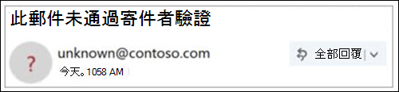

# 未驗證寄件者

> [!NOTE]
> 這些更新現在會立即推出，並非所有使用者都能使用這些更新。 Enterprise Outlook.com 和 Enterprise Outlook Win32 桌面使用者均支援此功能。 目前不適用於消費者 Office 365 使用者。

若要防止網路釣魚郵件到達您的信箱，Office 365 會驗證寄件者是否為他們所說的使用者，並將可疑郵件標記為垃圾郵件。

> [!IMPORTANT]
> 當郵件標示為網路釣魚詐騙時，Outlook 會在頁面頂端顯示警告，但仍然可以開啟郵件中的任何連結。

## 如何在收件匣中識別可疑郵件？

當郵件的寄件者無法識別或其身分識別與 [寄件者] 位址中所看到的不同時，Outlook 會顯示指示器。

## 您會在寄件者圖像中看到 '？ '

當 Office 365 無法使用電子郵件驗證技術驗證寄件者的身分識別時，會在寄件者圖像中顯示「？」。

並非所有驗證失敗的郵件皆為惡意。 不過，如果您無法辨識寄件者，請務必小心與不會驗證的郵件互動。 或者，如果您辨識的寄件者在寄件者圖像中通常不會有 '？ '，但您突然開始看到此寄件者，則可能是寄件者遭到欺騙的簽署。

## 如何管理接收未驗證寄件者處理的郵件 

如果您是 Office 365 客戶，您可以透過 Office 365 安全性 & 規範中心管理這項功能。

- 在安全性 & 規範中心中，全域或安全性管理員可以透過反網路釣魚原則的反欺騙防護功能開啟或關閉該功能。 此外，您可以在 Exchange Online PowerShell 中使用**AntiPhishPolicy 指令程式**。 如需詳細資訊，請參閱[Office 365 中的反網路釣魚保護](anti-phishing-protection.md)和 [設定 AntiPhishPolicy](https://docs.microsoft.com/powershell/module/exchange/set-antiphishpolicy)。

    

- 如果系統管理員識別出誤報，但寄件者不應接收未驗證的寄件者治療，則可以採取下列其中一項動作，將寄件者新增至「欺騙智慧欺騙允許」清單：

  - 透過欺騙智慧洞察力新增網域配對。 如需詳細資訊，請參閱[演練：欺騙性智慧洞察力](walkthrough-spoof-intelligence-insight.md)。

  - 透過 Exchange Online PowerShell 中的**Set-PhishFilterPolicy** Cmdlet 新增網域對。 如需詳細資訊，請參閱[Set-PhishFilterPolicy](https://docs.microsoft.com/powershell/module/exchange/set-phishfilterpolicy)和[設定 Office 365 ATP 反網路釣魚和反網路釣魚原則](set-up-anti-phishing-policies.md)。

此外，如果郵件透過郵件流程規則（也稱為傳輸規則）或安全網域清單（反垃圾郵件原則）傳遞至 [收件匣]，則不會套用未驗證寄件者的處理。

## 如何管理 "via" 標記 

如果您是 Office 365 客戶，您可以透過 Office 365 安全性 & 規範中心管理這項功能，與管理未驗證之寄件者處理的方式相同。 如果您將寄件者新增至欺騙智慧欺騙允許清單，將不會套用「透過」處理。

## 常見問題集

### Outlook.com 和 Outlook Win32 桌面使用哪些準則來新增 '？ ' 和「透過」屬性？

針對寄件者影像中的 '？ '： Outlook.com 要求郵件傳遞 SPF 或 DKIM 驗證，並接收 dmarc pass 或從 Office 365 欺騙智慧的複合驗證傳遞。 如需詳細資訊，請參閱[在 office 365 中設定 SPF 以協助防止](set-up-spf-in-office-365-to-help-prevent-spoofing.md)詐騙和[使用 DKIM 驗證從您的自訂365網域傳送的輸出電子郵件](use-dkim-to-validate-outbound-email.md)。

在 [via] 標記中：如果 [寄件者] 位址中的網域與 DKIM 簽章中的網域不同，或是來自于 SMTP 郵件，Outlook.com 會顯示這兩個欄位之一的網域（首選 DKIM 簽章）。

### 如何在不利用欺騙智慧欺騙允許清單的情況下移除 '？ '？

針對寄件者映射中的 '？ '：作為寄件者，您應該使用 SPF 或 DKIM 來驗證郵件。

在 [via] 標記中：作為寄件者，您應該確定 DKIM 簽章中的網域或 SMTP 郵件與「寄件者」位址中的網域相同，或為子域。

### Outlook.com 和 Outlook Win32 桌面會針對所有未通過驗證的郵件顯示此值嗎？

不一定。 Office 365 可能會在郵件中有其他屬性可驗證寄件者。

## 相關主題

[協助保護您的 Outlook.com 電子郵件帳戶](https://support.microsoft.com/office/a4f20fc5-4307-4ece-8231-6d4d4bd8a9ba)

[在 Outlook.com 中處理網路釣魚或欺騙](https://support.office.com/article/0d882ea5-eedc-4bed-aebc-079ffa1105a3)

[在網頁上的 Outlook 中篩選垃圾郵件和垃圾郵件](https://support.microsoft.com/office/db786e79-54e2-40cc-904f-d89d57b7f41d)
