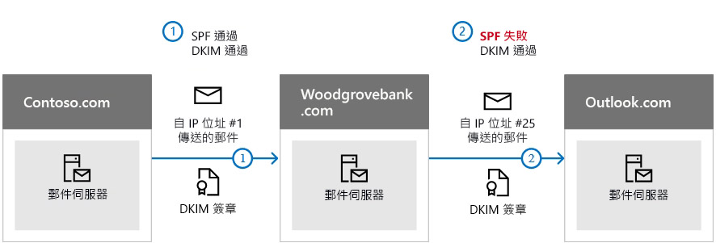

# <a name="use-dkim-to-validate-outbound-email-sent-from-your-custom-domain"></a><span data-ttu-id="a4f6a-103">使用 DKIM 驗證從您自訂網域傳送的輸出電子郵件</span><span class="sxs-lookup"><span data-stu-id="a4f6a-103">Use DKIM to validate outbound email sent from your custom domain</span></span>

[!INCLUDE [Microsoft 365 Defender rebranding](../includes/microsoft-defender-for-office.md)]

<span data-ttu-id="a4f6a-104">**適用於**</span><span class="sxs-lookup"><span data-stu-id="a4f6a-104">**Applies to**</span></span>
- [<span data-ttu-id="a4f6a-105">Exchange Online Protection</span><span class="sxs-lookup"><span data-stu-id="a4f6a-105">Exchange Online Protection</span></span>](exchange-online-protection-overview.md)
- [<span data-ttu-id="a4f6a-106">適用於 Office 365 的 Microsoft Defender 方案 1 和方案 2</span><span class="sxs-lookup"><span data-stu-id="a4f6a-106">Microsoft Defender for Office 365 plan 1 and plan 2</span></span>](defender-for-office-365.md)
- [<span data-ttu-id="a4f6a-107">Microsoft 365 Defender</span><span class="sxs-lookup"><span data-stu-id="a4f6a-107">Microsoft 365 Defender</span></span>](../defender/microsoft-365-defender.md)

 <span data-ttu-id="a4f6a-108">本文列出在 Microsoft 365 中使用網域金鑰識別郵件 (DKIM) 的步驟，以確保目的地電子郵件系統會信任從您自訂網域對外傳送的郵件。</span><span class="sxs-lookup"><span data-stu-id="a4f6a-108">This article lists the steps to use DomainKeys Identified Mail (DKIM) with Microsoft 365 to ensure that destination email systems trust messages sent outbound from your custom domain.</span></span>

<span data-ttu-id="a4f6a-109">本文內容：</span><span class="sxs-lookup"><span data-stu-id="a4f6a-109">In this article:</span></span>

- [<span data-ttu-id="a4f6a-110">DKIM 防止惡意詐騙的效用為何優於單獨使用 SPF</span><span class="sxs-lookup"><span data-stu-id="a4f6a-110">How DKIM works better than SPF alone to prevent malicious spoofing</span></span>](#how-dkim-works-better-than-spf-alone-to-prevent-malicious-spoofing)
- [<span data-ttu-id="a4f6a-111">將 1024 位元金鑰手動升級至 2048 位元 DKIM 加密金鑰的步驟</span><span class="sxs-lookup"><span data-stu-id="a4f6a-111">Steps to manually upgrade your 1024-bit keys to 2048-bit DKIM encryption keys</span></span>](#steps-to-manually-upgrade-your-1024-bit-keys-to-2048-bit-dkim-encryption-keys)
- [<span data-ttu-id="a4f6a-112">手動設定 DKIM 的步驟</span><span class="sxs-lookup"><span data-stu-id="a4f6a-112">Steps to manually set up DKIM</span></span>](#steps-to-manually-set-up-dkim)
- [<span data-ttu-id="a4f6a-113">為多個自訂網域設定 DKIM 的步驟</span><span class="sxs-lookup"><span data-stu-id="a4f6a-113">Steps to configure DKIM for more than one custom domain</span></span>](#to-configure-dkim-for-more-than-one-custom-domain)
- [<span data-ttu-id="a4f6a-114">停用自訂網域 DKIM 簽署原則</span><span class="sxs-lookup"><span data-stu-id="a4f6a-114">Disabling the DKIM signing policy for a custom domain</span></span>](#disabling-the-dkim-signing-policy-for-a-custom-domain)
- [<span data-ttu-id="a4f6a-115">DKIM 和 Microsoft 365 的預設行為</span><span class="sxs-lookup"><span data-stu-id="a4f6a-115">Default behavior for DKIM and Microsoft 365</span></span>](#default-behavior-for-dkim-and-microsoft-365)
- [<span data-ttu-id="a4f6a-116">設定 DKIM，讓第三方服務可代表您的自訂網域傳送 (或偽造) 電子郵件</span><span class="sxs-lookup"><span data-stu-id="a4f6a-116">Set up DKIM so that a third-party service can send, or spoof, email on behalf of your custom domain</span></span>](#set-up-dkim-so-that-a-third-party-service-can-send-or-spoof-email-on-behalf-of-your-custom-domain)
- [<span data-ttu-id="a4f6a-117">後續步驟：為 Microsoft 365 設定 DKIM 之後</span><span class="sxs-lookup"><span data-stu-id="a4f6a-117">Next steps: After you set up DKIM for Microsoft 365</span></span>](#next-steps-after-you-set-up-dkim-for-microsoft-365)

> [!NOTE]
> <span data-ttu-id="a4f6a-118">Microsoft 365 會自動為其初始 'onmicrosoft.com' 網域設定 DKIM。</span><span class="sxs-lookup"><span data-stu-id="a4f6a-118">Microsoft 365 automatically sets up DKIM for its initial 'onmicrosoft.com' domains.</span></span> <span data-ttu-id="a4f6a-119">這表示您不需要執行任何操作，即可為任何初始網域名稱設定 DKIM (例如：litware.onmicrosoft.com)。</span><span class="sxs-lookup"><span data-stu-id="a4f6a-119">That means you don't need to do anything to set up DKIM for any initial domain names (for example, litware.onmicrosoft.com).</span></span> <span data-ttu-id="a4f6a-120">如需網域的詳細資訊，請參閱[網域常見問題集](../../admin/setup/domains-faq.yml#why-do-i-have-an--onmicrosoft-com--domain)。</span><span class="sxs-lookup"><span data-stu-id="a4f6a-120">For more information about domains, see [Domains FAQ](../../admin/setup/domains-faq.yml#why-do-i-have-an--onmicrosoft-com--domain).</span></span>

<span data-ttu-id="a4f6a-121">DKIM 是三個驗證方法 (SPF、DKIM 和 DMARC) 的其中一個，可協助防止攻擊者傳送看起來像來自您網域的郵件。</span><span class="sxs-lookup"><span data-stu-id="a4f6a-121">DKIM is one of the trio of Authentication methods (SPF, DKIM and DMARC) that help prevent attackers from sending messages that look like they come from your domain.</span></span>

<span data-ttu-id="a4f6a-122">DKIM 可讓您在郵件標頭中將數位簽章新增到外寄電子郵件訊息中。</span><span class="sxs-lookup"><span data-stu-id="a4f6a-122">DKIM lets you add a digital signature to outbound email messages in the message header.</span></span> <span data-ttu-id="a4f6a-123">在設定 DKIM 時，您會授權給網域，使其能夠使用密碼編譯驗證將其名稱簽署至電子郵件訊息，或建立關聯。</span><span class="sxs-lookup"><span data-stu-id="a4f6a-123">When you configure DKIM, you authorize your domain to associate, or sign, its name to an email message using cryptographic authentication.</span></span> <span data-ttu-id="a4f6a-124">電子郵件系統在取得來自您網域的電子郵件時，可以利用此數位簽章來協助驗證內送電子郵件是否合法。</span><span class="sxs-lookup"><span data-stu-id="a4f6a-124">Email systems that get email from your domain can use this digital signature to help verify whether incoming email is legitimate.</span></span>

<span data-ttu-id="a4f6a-125">基本而言，私密金鑰會加密網域外寄電子郵件中的標頭。</span><span class="sxs-lookup"><span data-stu-id="a4f6a-125">In basic, a private key encrypts the header in a domain's outgoing email.</span></span> <span data-ttu-id="a4f6a-126">您可以將公開金鑰發佈至網域的 DNS 記錄，讓接收端伺服器可以用此金鑰來解碼簽章。</span><span class="sxs-lookup"><span data-stu-id="a4f6a-126">The public key is published in the domain's DNS records, and receiving servers can use that key to decode the signature.</span></span> <span data-ttu-id="a4f6a-127">DKIM 驗證可協助接收伺服器確認郵件確實來自您的網域，而不是有人對您的網域 *進行詐騙*。</span><span class="sxs-lookup"><span data-stu-id="a4f6a-127">DKIM verification helps the receiving servers confirm the mail is really coming from your domain and not someone *spoofing* your domain.</span></span>

> [!TIP]
><span data-ttu-id="a4f6a-p104">您也可以選擇不為自訂網域進行任何 DKIM 設定。如果您未替自訂網域設定 DKIM，Microsoft 365 將會為您的自訂網域建立私密和公開金鑰組、啟用 DKIM 簽章，然後設定 Microsoft 365 預設原則。</span><span class="sxs-lookup"><span data-stu-id="a4f6a-p104">You can choose to do nothing about DKIM for your custom domain too. If you don't set up DKIM for your custom domain, Microsoft 365 creates a private and public key pair, enables DKIM signing, and then configures the Microsoft 365 default policy for your custom domain.</span></span>

 <span data-ttu-id="a4f6a-p105">Microsoft 365 的內建 DKIM 設定對大部分的客戶而言已足夠使用，但在下列情況下，您仍應手動為自訂網域設定 DKIM：</span><span class="sxs-lookup"><span data-stu-id="a4f6a-p105">Microsoft-365's built-in DKIM configuration is sufficient coverage for most customers. However, you should manually configure DKIM for your custom domain in the following circumstances:</span></span>

- <span data-ttu-id="a4f6a-132">您在 Microsoft 365 中有多個自訂網域</span><span class="sxs-lookup"><span data-stu-id="a4f6a-132">You have more than one custom domain in Microsoft 365</span></span>
- <span data-ttu-id="a4f6a-133">您也將設定 DMARC (**建議**)</span><span class="sxs-lookup"><span data-stu-id="a4f6a-133">You're going to set up DMARC too (**recommended**)</span></span>
- <span data-ttu-id="a4f6a-134">您想要控管私密金鑰</span><span class="sxs-lookup"><span data-stu-id="a4f6a-134">You want control over your private key</span></span>
- <span data-ttu-id="a4f6a-135">您想要自訂 CNAME 記錄</span><span class="sxs-lookup"><span data-stu-id="a4f6a-135">You want to customize your CNAME records</span></span>
- <span data-ttu-id="a4f6a-136">您想要為來自於第三方網域的電子郵件設定 DKIM，例如，當您使用第三方大量郵件寄件者時。</span><span class="sxs-lookup"><span data-stu-id="a4f6a-136">You want to set up DKIM keys for email originating out of a third-party domain, for example, if you use a third-party bulk mailer.</span></span>

## <a name="how-dkim-works-better-than-spf-alone-to-prevent-malicious-spoofing"></a><span data-ttu-id="a4f6a-137">DKIM 防止惡意詐騙的效用為何優於單獨使用 SPF</span><span class="sxs-lookup"><span data-stu-id="a4f6a-137">How DKIM works better than SPF alone to prevent malicious spoofing</span></span>
<span data-ttu-id="a4f6a-138"><a name="HowDKIMWorks"> </a></span><span class="sxs-lookup"><span data-stu-id="a4f6a-138"><a name="HowDKIMWorks"> </a></span></span>

<span data-ttu-id="a4f6a-139">SPF 會在郵件信封中新增資訊，但 DKIM 則會為郵件標頭中的數位簽章 *加密*。</span><span class="sxs-lookup"><span data-stu-id="a4f6a-139">SPF adds information to a message envelope but DKIM *encrypts* a signature within the message header.</span></span> <span data-ttu-id="a4f6a-140">當您轉寄郵件時，轉寄端伺服器可能會將該郵件信封的某些部分移除掉。</span><span class="sxs-lookup"><span data-stu-id="a4f6a-140">When you forward a message, portions of that message's envelope can be stripped away by the forwarding server.</span></span> <span data-ttu-id="a4f6a-141">由於數位簽章是電子郵件標頭的一部分，會存留在電子郵件訊息內，因此即使郵件已轉寄，DKIM 仍可運作，如下列範例所示。</span><span class="sxs-lookup"><span data-stu-id="a4f6a-141">Since the digital signature stays with the email message because it's part of the email header, DKIM works even when a message has been forwarded as shown in the following example.</span></span>



<span data-ttu-id="a4f6a-143">在此範例中，如果您只為您的網域發佈 SPF TXT 記錄，收件者的郵件伺服器可能會將您的電子郵件標示為垃圾郵件，並產生誤判的結果。</span><span class="sxs-lookup"><span data-stu-id="a4f6a-143">In this example, if you had only published an SPF TXT record for your domain, the recipient's mail server could have marked your email as spam and generated a false positive result.</span></span> <span data-ttu-id="a4f6a-144">**在此案例中，加入 DKIM 可減少 *誤判* 垃圾郵件的報告。**</span><span class="sxs-lookup"><span data-stu-id="a4f6a-144">**The addition of DKIM in this scenario reduces *false positive* spam reporting.**</span></span> <span data-ttu-id="a4f6a-145">由於 DKIM 也使用公開金鑰密碼編譯進行驗證，而非僅使用 IP 位址，因此我們認為 DKIM 是遠優於 SPF 的驗證形式。</span><span class="sxs-lookup"><span data-stu-id="a4f6a-145">Because DKIM relies on public key cryptography to authenticate and not just IP addresses, DKIM is considered a much stronger form of authentication than SPF.</span></span> <span data-ttu-id="a4f6a-146">我們建議您在部署中應同時使用 SPF 和 DKIM 以及 DMARC。</span><span class="sxs-lookup"><span data-stu-id="a4f6a-146">We recommend using both SPF and DKIM, as well as DMARC in your deployment.</span></span>

> [!TIP]
> <span data-ttu-id="a4f6a-147">DKIM 會使用私密金鑰將加密的簽章插入郵件標頭中。</span><span class="sxs-lookup"><span data-stu-id="a4f6a-147">DKIM uses a private key to insert an encrypted signature into the message headers.</span></span> <span data-ttu-id="a4f6a-148">登入網域 (或輸出網域) 會在標頭中插入作為 **d=** 欄位的值。</span><span class="sxs-lookup"><span data-stu-id="a4f6a-148">The signing domain, or outbound domain, is inserted as the value of the **d=** field in the header.</span></span> <span data-ttu-id="a4f6a-149">驗證網域 (或收件者網域) 隨後會使用 **d=** 欄位來查閱來自 DNS 的公開金鑰，並驗證郵件。</span><span class="sxs-lookup"><span data-stu-id="a4f6a-149">The verifying domain, or recipient's domain, then uses the **d=** field to look up the public key from DNS, and authenticate the message.</span></span> <span data-ttu-id="a4f6a-150">如果訊息通過驗證，即可通過 DKIM 檢查。</span><span class="sxs-lookup"><span data-stu-id="a4f6a-150">If the message is verified, the DKIM check passes.</span></span>


## <a name="steps-to-manually-upgrade-your-1024-bit-keys-to-2048-bit-dkim-encryption-keys"></a><span data-ttu-id="a4f6a-151">將 1024 位元金鑰手動升級至 2048 位元 DKIM 加密金鑰的步驟</span><span class="sxs-lookup"><span data-stu-id="a4f6a-151">Steps to manually upgrade your 1024-bit keys to 2048-bit DKIM encryption keys</span></span>
<span data-ttu-id="a4f6a-152"><a name="1024to2048DKIM"> </a></span><span class="sxs-lookup"><span data-stu-id="a4f6a-152"><a name="1024to2048DKIM"> </a></span></span>

> [!NOTE]
> <span data-ttu-id="a4f6a-153">Microsoft 365 會自動為 *onmicrosoft.com* 網域設定 DKIM。</span><span class="sxs-lookup"><span data-stu-id="a4f6a-153">Microsoft 365 automatically sets up DKIM for *onmicrosoft.com* domains.</span></span> <span data-ttu-id="a4f6a-154">不需要任何步驟，就可以將 DKIM 用於任何初始網域名稱 (例如 litware.*onmicrosoft.com*)。</span><span class="sxs-lookup"><span data-stu-id="a4f6a-154">No steps are needed to use DKIM for any initial domain names (like litware.*onmicrosoft.com*).</span></span> <span data-ttu-id="a4f6a-155">如需網域的詳細資訊，請參閱 [網域常見問題集](../../admin/setup/domains-faq.yml#why-do-i-have-an--onmicrosoft-com--domain)。</span><span class="sxs-lookup"><span data-stu-id="a4f6a-155">For more information about domains, see [Domains FAQ](../../admin/setup/domains-faq.yml#why-do-i-have-an--onmicrosoft-com--domain).</span></span>

<span data-ttu-id="a4f6a-156">由於 DKIM 金鑰同時支援 1024 和 2048 位元，這些指示會告訴您如何在 [Exchange Online PowerShell](/powershell/exchange/connect-to-exchange-online-powershell) 中將您的 1024 位元金鑰升級至 2048。</span><span class="sxs-lookup"><span data-stu-id="a4f6a-156">Since both 1024 and 2048 bitness are supported for DKIM keys, these directions will tell you how to upgrade your 1024-bit key to 2048 in [Exchange Online PowerShell](/powershell/exchange/connect-to-exchange-online-powershell).</span></span> <span data-ttu-id="a4f6a-157">下列步驟適用於兩個使用案例，請選擇最符合您設定的案例。</span><span class="sxs-lookup"><span data-stu-id="a4f6a-157">The steps below are for two use-cases, please choose the one that best fits your configuration.</span></span>

- <span data-ttu-id="a4f6a-158">當您 **已設定 DKIM** 時，您可以執行下列命令來輪轉位元：</span><span class="sxs-lookup"><span data-stu-id="a4f6a-158">When you **already have DKIM configured**, you rotate bitness by running the following command:</span></span>

  ```powershell
  Rotate-DkimSigningConfig -KeySize 2048 -Identity {Guid of the existing Signing Config}
  ```

  <span data-ttu-id="a4f6a-159">**或**</span><span class="sxs-lookup"><span data-stu-id="a4f6a-159">**or**</span></span>

- <span data-ttu-id="a4f6a-160">如需 **DKIM 的新實作**，請執行下列命令：</span><span class="sxs-lookup"><span data-stu-id="a4f6a-160">For a **new implementation of DKIM**, run the following command:</span></span>

  ```powershell
  New-DkimSigningConfig -DomainName <Domain for which config is to be created> -KeySize 2048 -Enabled $true
  ```

<span data-ttu-id="a4f6a-161">請透過執行下列命令，保持連線至 Exchange Online PowerShell，以 *確認* 設定：</span><span class="sxs-lookup"><span data-stu-id="a4f6a-161">Stay connected to Exchange Online PowerShell to *verify* the configuration by running the following command:</span></span>

```powershell
Get-DkimSigningConfig -Identity <Domain for which the configuration was set> | Format-List
```

> [!TIP]
> <span data-ttu-id="a4f6a-162">這個新的 2048 位元金鑰會在 RotateOnDate 時生效，並會在過渡期使用 1024 位元金鑰傳送電子郵件。</span><span class="sxs-lookup"><span data-stu-id="a4f6a-162">This new 2048-bit key takes effect on the RotateOnDate, and will send emails with the 1024-bit key in the interim.</span></span> <span data-ttu-id="a4f6a-163">4 天後，您可以使用 2048 位元金鑰再次測試 (亦即輪轉對第二個選取器生效的時候)。</span><span class="sxs-lookup"><span data-stu-id="a4f6a-163">After four days, you can test again with the 2048-bit key (that is, once the rotation takes effect to the second selector).</span></span>

<span data-ttu-id="a4f6a-164">如果您想要輪轉至第二個選取器，您的選項為 a) 讓 Microsoft 365 服務輪選取器，並在接下來 6 個月內升級到 2048 位元，或是 b) 在 4 天後並確認 2048 位元使用中時，使用上方所列的適當 Cmdlet，手動輪轉第二個選取器金鑰。</span><span class="sxs-lookup"><span data-stu-id="a4f6a-164">If you want to rotate to the second selector, your options are a) let the Microsoft 365 service rotate the selector and upgrade to 2048-bitness within the next 6 months, or b) after 4 days and confirming that 2048-bitness is in use, manually rotate the second selector key by using the appropriate cmdlet listed above.</span></span>

<span data-ttu-id="a4f6a-165">如需詳細的語法和參數資訊，請參閱下列文章：[Rotate-DkimSigningConfig](/powershell/module/exchange/rotate-dkimsigningconfig)、[New-DkimSigningConfig](/powershell/module/exchange/new-dkimsigningconfig) 和 [Get-DkimSigningConfig](/powershell/module/exchange/get-dkimsigningconfig)。</span><span class="sxs-lookup"><span data-stu-id="a4f6a-165">For detailed syntax and parameter information, see the following articles: [Rotate-DkimSigningConfig](/powershell/module/exchange/rotate-dkimsigningconfig), [New-DkimSigningConfig](/powershell/module/exchange/new-dkimsigningconfig), and [Get-DkimSigningConfig](/powershell/module/exchange/get-dkimsigningconfig).</span></span>

## <a name="steps-to-manually-set-up-dkim"></a><span data-ttu-id="a4f6a-166">手動設定 DKIM 的步驟</span><span class="sxs-lookup"><span data-stu-id="a4f6a-166">Steps to manually set up DKIM</span></span>
<span data-ttu-id="a4f6a-167"><a name="SetUpDKIMO365"> </a></span><span class="sxs-lookup"><span data-stu-id="a4f6a-167"><a name="SetUpDKIMO365"> </a></span></span>

<span data-ttu-id="a4f6a-168">若要設定 DKIM，您應完成下列步驟：</span><span class="sxs-lookup"><span data-stu-id="a4f6a-168">To configure DKIM, you will complete these steps:</span></span>

- [<span data-ttu-id="a4f6a-169">將兩個 CNAME 記錄發佈至您在 DNS 中的自訂網域</span><span class="sxs-lookup"><span data-stu-id="a4f6a-169">Publish two CNAME records for your custom domain in DNS</span></span>](use-dkim-to-validate-outbound-email.md#Publish2CNAME)
- [<span data-ttu-id="a4f6a-170">為自訂網域啟用 DKIM 簽署</span><span class="sxs-lookup"><span data-stu-id="a4f6a-170">Enable DKIM signing for your custom domain</span></span>](use-dkim-to-validate-outbound-email.md#EnableDKIMinO365)

### <a name="publish-two-cname-records-for-your-custom-domain-in-dns"></a><span data-ttu-id="a4f6a-171">將兩個 CNAME 記錄發佈至您在 DNS 中的自訂網域</span><span class="sxs-lookup"><span data-stu-id="a4f6a-171">Publish two CNAME records for your custom domain in DNS</span></span>
<span data-ttu-id="a4f6a-172"><a name="Publish2CNAME"> </a></span><span class="sxs-lookup"><span data-stu-id="a4f6a-172"><a name="Publish2CNAME"> </a></span></span>

<span data-ttu-id="a4f6a-173">對於要在 DNS 中新增 DKIM 簽章的每個網域，您必須發佈兩個 CNAME 記錄。</span><span class="sxs-lookup"><span data-stu-id="a4f6a-173">For each domain for which you want to add a DKIM signature in DNS, you need to publish two CNAME records.</span></span>

> [!NOTE]
> <span data-ttu-id="a4f6a-174">如果您還沒有閱讀完整的文章，則可能錯過了這份可節省時間的 PowerShell 連線資訊：[連線至 Exchange Online PowerShell](/powershell/exchange/connect-to-exchange-online-powershell)。</span><span class="sxs-lookup"><span data-stu-id="a4f6a-174">If you haven't read the full article, you may have missed this time-saving PowerShell connection information: [Connect to Exchange Online PowerShell](/powershell/exchange/connect-to-exchange-online-powershell).</span></span>

<span data-ttu-id="a4f6a-175">在 Exchange Online PowerShell 中執行下列命令，以建立選取器記錄：</span><span class="sxs-lookup"><span data-stu-id="a4f6a-175">Run the following commands in Exchange Online PowerShell to create the selector records:</span></span>

```powershell
New-DkimSigningConfig -DomainName <domain> -Enabled $false
Get-DkimSigningConfig -Identity <domain> | Format-List Selector1CNAME, Selector2CNAME
```

<span data-ttu-id="a4f6a-176">如果您在 Microsoft 365 中除了初始網域以外也佈建了自訂網域，則必須為每個額外的網域發佈兩個 CNAME 記錄。</span><span class="sxs-lookup"><span data-stu-id="a4f6a-176">If you have provisioned custom domains in addition to the initial domain in Microsoft 365, you must publish two CNAME records for each additional domain.</span></span> <span data-ttu-id="a4f6a-177">因此，如果您有兩個網域，您必須發佈兩個額外的 CNAME 記錄，依此類推。</span><span class="sxs-lookup"><span data-stu-id="a4f6a-177">So, if you have two domains, you must publish two additional CNAME records, and so on.</span></span>

<span data-ttu-id="a4f6a-178">CNAME 記錄應使用下列格式。</span><span class="sxs-lookup"><span data-stu-id="a4f6a-178">Use the following format for the CNAME records.</span></span>

> [!IMPORTANT]
> <span data-ttu-id="a4f6a-179">如果您是我們的 GCC High 客戶，我們會以不同的方式計算 _domainGuid_！</span><span class="sxs-lookup"><span data-stu-id="a4f6a-179">If you are one of our GCC High customers, we calculate _domainGuid_ differently!</span></span> <span data-ttu-id="a4f6a-180">我們在計算 _domainGuid_ 時不會查閱您 _initialDomain_ 的 MX 記錄，而是會直接從自訂的網域計算。</span><span class="sxs-lookup"><span data-stu-id="a4f6a-180">Instead of looking up the MX record for your _initialDomain_ to calculate _domainGuid_, instead we calculate it directly from the customized domain.</span></span> <span data-ttu-id="a4f6a-181">例如，如果您的自訂網域是 "contoso.com"，則您的 domainGuid 會變成 "contoso-com"，任何句點都會取代為虛線。</span><span class="sxs-lookup"><span data-stu-id="a4f6a-181">For example, if your customized domain is "contoso.com" your domainGuid becomes "contoso-com", any periods are replaced with a dash.</span></span> <span data-ttu-id="a4f6a-182">因此，無論您的 initialDomain 指向哪個 MX 記錄，您都將一律使用上述方法來計算在您的 CNAME 記錄中使用的 domainGuid。</span><span class="sxs-lookup"><span data-stu-id="a4f6a-182">So, regardless of what MX record your initialDomain points to, you'll always use the above method to calculate the domainGuid to use in your CNAME records.</span></span>

```console
Host name:            selector1._domainkey
Points to address or value:    selector1-<domainGUID>._domainkey.<initialDomain>
TTL:                3600

Host name:            selector2._domainkey
Points to address or value:    selector2-<domainGUID>._domainkey.<initialDomain>
TTL:                3600
```

<span data-ttu-id="a4f6a-183">其中：</span><span class="sxs-lookup"><span data-stu-id="a4f6a-183">Where:</span></span>

- <span data-ttu-id="a4f6a-184">Microsoft 365 的選取器將一律為 "selector1" 或 "selector2"。</span><span class="sxs-lookup"><span data-stu-id="a4f6a-184">For Microsoft 365, the selectors will always be "selector1" or "selector2".</span></span>
- <span data-ttu-id="a4f6a-185">_domainGUID_ 會與您自訂網域的自訂 MX 記錄中顯示於 mail.protection.outlook.com 前面的 _domainGUID_ 相同。</span><span class="sxs-lookup"><span data-stu-id="a4f6a-185">_domainGUID_ is the same as the _domainGUID_ in the customized MX record for your custom domain that appears before mail.protection.outlook.com.</span></span> <span data-ttu-id="a4f6a-186">例如，在網域 contoso.com 的下列 MX 記錄中，_domainGUID_ 為 contoso-com：</span><span class="sxs-lookup"><span data-stu-id="a4f6a-186">For example, in the following MX record for the domain contoso.com, the _domainGUID_ is contoso-com:</span></span>

  > <span data-ttu-id="a4f6a-p115">contoso.com.  3600  IN  MX   5 contoso-com.mail.protection.outlook.com</span><span class="sxs-lookup"><span data-stu-id="a4f6a-p115">contoso.com.  3600  IN  MX   5 contoso-com.mail.protection.outlook.com</span></span>

- <span data-ttu-id="a4f6a-189">_initialDomain_ 是您註冊 Microsoft 365 時所使用的網域。</span><span class="sxs-lookup"><span data-stu-id="a4f6a-189">_initialDomain_ is the domain that you used when you signed up for Microsoft 365.</span></span> <span data-ttu-id="a4f6a-190">初始網域的結尾一律為 onmicrosoft.com。</span><span class="sxs-lookup"><span data-stu-id="a4f6a-190">Initial domains always end in onmicrosoft.com.</span></span> <span data-ttu-id="a4f6a-191">如需如何判斷初始網域的相關資訊，請參閱[網域的常見問題集](../../admin/setup/domains-faq.yml#why-do-i-have-an--onmicrosoft-com--domain)。</span><span class="sxs-lookup"><span data-stu-id="a4f6a-191">For information about determining your initial domain, see [Domains FAQ](../../admin/setup/domains-faq.yml#why-do-i-have-an--onmicrosoft-com--domain).</span></span>

<span data-ttu-id="a4f6a-192">例如，如果您的初始網域為 cohovineyardandwinery.onmicrosoft.com，並且有兩個自訂網域 cohovineyard.com 和 cohowinery.com，則必須為每個額外的網域各設定兩個 CNAME 記錄，因此共計四個 CNAME 記錄。</span><span class="sxs-lookup"><span data-stu-id="a4f6a-192">For example, if you have an initial domain of cohovineyardandwinery.onmicrosoft.com, and two custom domains cohovineyard.com and cohowinery.com, you would need to set up two CNAME records for each additional domain, for a total of four CNAME records.</span></span>

```console
Host name:            selector1._domainkey
Points to address or value:    selector1-cohovineyard-com._domainkey.cohovineyardandwinery.onmicrosoft.com
TTL:                3600

Host name:            selector2._domainkey
Points to address or value:    selector2-cohovineyard-com._domainkey.cohovineyardandwinery.onmicrosoft.com
TTL:                3600

Host name:            selector1._domainkey
Points to address or value:    selector1-cohowinery-com._domainkey.cohovineyardandwinery.onmicrosoft.com
TTL:                3600

Host name:            selector2._domainkey
Points to address or value:    selector2-cohowinery-com._domainkey.cohovineyardandwinery.onmicrosoft.com
TTL:                3600
```

> [!NOTE]
> <span data-ttu-id="a4f6a-193">建立第二筆記錄很重要，但建立時只能使用其中一個選取器。</span><span class="sxs-lookup"><span data-stu-id="a4f6a-193">It's important to create the second record, but only one of the selectors may be available at the time of creation.</span></span> <span data-ttu-id="a4f6a-194">基本上，第二個選取器可能會指向尚未建立的位址。</span><span class="sxs-lookup"><span data-stu-id="a4f6a-194">In essence, the second selector might point to an address that hasn't been created yet.</span></span> <span data-ttu-id="a4f6a-195">我們還是建議您建立第二筆 CNAME 記錄，因為您的金鑰輪換會較流暢。</span><span class="sxs-lookup"><span data-stu-id="a4f6a-195">We still recommended that you create the second CNAME record, because your key rotation will be seamless.</span></span>

### <a name="steps-to-enable-dkim-signing-for-your-custom-domain"></a><span data-ttu-id="a4f6a-196">為自訂網域啟用 DKIM 簽署的步驟</span><span class="sxs-lookup"><span data-stu-id="a4f6a-196">Steps to enable DKIM signing for your custom domain</span></span>
<span data-ttu-id="a4f6a-197"><a name="EnableDKIMinO365"> </a></span><span class="sxs-lookup"><span data-stu-id="a4f6a-197"><a name="EnableDKIMinO365"> </a></span></span>

<span data-ttu-id="a4f6a-198">在 DNS 中發佈 CNAME 記錄後，您即可透過 Microsoft 365 啟用 DKIM 簽署。</span><span class="sxs-lookup"><span data-stu-id="a4f6a-198">Once you have published the CNAME records in DNS, you are ready to enable DKIM signing through Microsoft 365.</span></span> <span data-ttu-id="a4f6a-199">您可以透過 Microsoft 365 系統管理中心或使用 PowerShell 來執行此作業。</span><span class="sxs-lookup"><span data-stu-id="a4f6a-199">You can do this either through the Microsoft 365 admin center or by using PowerShell.</span></span>

#### <a name="to-enable-dkim-signing-for-your-custom-domain-in-the-microsoft-365-defender-portal"></a><span data-ttu-id="a4f6a-200">若要在 Microsoft 365 Defender 入口網站中啟用自訂網域的 DKIM 簽署</span><span class="sxs-lookup"><span data-stu-id="a4f6a-200">To enable DKIM signing for your custom domain in the Microsoft 365 Defender portal</span></span>

1. <span data-ttu-id="a4f6a-201">[使用公司或學校帳戶](https://support.microsoft.com/office/e9eb7d51-5430-4929-91ab-6157c5a050b4)開啟 Microsoft 365 Defender 入口網站。</span><span class="sxs-lookup"><span data-stu-id="a4f6a-201">Open the Microsoft 365 Defender portal [using your work or school account](https://support.microsoft.com/office/e9eb7d51-5430-4929-91ab-6157c5a050b4).</span></span>

2. <span data-ttu-id="a4f6a-202">前往 **[電子郵件與共同作業]** \> **[原則與規則]** \> **[威脅原則]** \> **[規則]** 區段 \> **[DKIM]**。</span><span class="sxs-lookup"><span data-stu-id="a4f6a-202">Go to **Email & Collaboration** \> **Policies & rules** \> **Threat policies** \> **Rules** section \> **DKIM**.</span></span> <span data-ttu-id="a4f6a-203">或者，若要直接前往 DKIM 頁面，請使用 <https://security.microsoft.com/dkimv2>。</span><span class="sxs-lookup"><span data-stu-id="a4f6a-203">Or, to go directly to the DKIM page, use <https://security.microsoft.com/dkimv2>.</span></span>

3. <span data-ttu-id="a4f6a-204">在 **[DKIM]** 頁面上，按一下名稱以選取網域。</span><span class="sxs-lookup"><span data-stu-id="a4f6a-204">On the **DKIM** page, select the domain by clicking on the name.</span></span>

4. <span data-ttu-id="a4f6a-205">在顯示的詳細資料飛出視窗中，將 **[使用 DKIM 簽章簽署此網域的郵件]** 設定為 **[啟用]** (![[切換開啟]](../../media/scc-toggle-on.png))</span><span class="sxs-lookup"><span data-stu-id="a4f6a-205">In the details flyout that appears, chang the **Sign messages for this domain with DKIM signatures** setting to **Enabled** ()</span></span>

   <span data-ttu-id="a4f6a-206">完成後，按一下 **[變換 DKIM 金鑰]**。</span><span class="sxs-lookup"><span data-stu-id="a4f6a-206">When you're finished, click **Rotate DKIM keys**.</span></span>

5. <span data-ttu-id="a4f6a-207">對每個自訂網域重複此步驟。</span><span class="sxs-lookup"><span data-stu-id="a4f6a-207">Repeat these step for each custom domain.</span></span>

#### <a name="to-enable-dkim-signing-for-your-custom-domain-by-using-powershell"></a><span data-ttu-id="a4f6a-208">使用 PowerShell 為自訂網域啟用 DKIM 簽署</span><span class="sxs-lookup"><span data-stu-id="a4f6a-208">To enable DKIM signing for your custom domain by using PowerShell</span></span>

> [!IMPORTANT]
> :::image type="content" source="../../media/dkim.png" alt-text="「沒有儲存于這個網域的 DKIM 金鑰。」錯誤。":::
> <span data-ttu-id="a4f6a-210">如果您是第一次設定 DKIM，並看到螢幕顯示 [沒有儲存此網域的 DKIM 金鑰] 錯誤，請完成下列步驟 2 的命令 (如範例 `Set-DkimSigningConfig -Identity contoso.com -Enabled $true`)，以查看金鑰。</span><span class="sxs-lookup"><span data-stu-id="a4f6a-210">If you are configuring DKIM for the first time and see the error 'No DKIM keys saved for this domain' complete the command in step 2 below (for example, `Set-DkimSigningConfig -Identity contoso.com -Enabled $true`) to see the key.</span></span>

1. <span data-ttu-id="a4f6a-211">[連線至 Exchange Online PowerShell](/powershell/exchange/connect-to-exchange-online-powershell)。</span><span class="sxs-lookup"><span data-stu-id="a4f6a-211">[Connect to Exchange Online PowerShell](/powershell/exchange/connect-to-exchange-online-powershell).</span></span>

2. <span data-ttu-id="a4f6a-212">使用下列語法：</span><span class="sxs-lookup"><span data-stu-id="a4f6a-212">Use the following syntax:</span></span>

   ```powershell
   Set-DkimSigningConfig -Identity <Domain> -Enabled $true
   ```

   <span data-ttu-id="a4f6a-213">\<Domain\> 是要啟用 DKIM 簽署的自訂網域名稱。</span><span class="sxs-lookup"><span data-stu-id="a4f6a-213">\<Domain\> is the name of the custom domain that you want to enable DKIM signing for.</span></span>

   <span data-ttu-id="a4f6a-214">此範例會啟用 contoso.com 網域的 DKIM 簽署：</span><span class="sxs-lookup"><span data-stu-id="a4f6a-214">This example enables DKIM signing for the domain contoso.com:</span></span>

   ```powershell
   Set-DkimSigningConfig -Identity contoso.com -Enabled $true
   ```

#### <a name="to-confirm-dkim-signing-is-configured-properly-for-microsoft-365"></a><span data-ttu-id="a4f6a-215">確認已為 Microsoft 365 正確設定 DKIM 簽章</span><span class="sxs-lookup"><span data-stu-id="a4f6a-215">To Confirm DKIM signing is configured properly for Microsoft 365</span></span>

<span data-ttu-id="a4f6a-216">請稍待幾分鐘，再依照下列步驟來確認您已正確設定 DKIM。</span><span class="sxs-lookup"><span data-stu-id="a4f6a-216">Wait a few minutes before you follow these steps to confirm that you have properly configured DKIM.</span></span> <span data-ttu-id="a4f6a-217">這可讓關於網域的 DKIM 資訊有時間散佈到整個網路。</span><span class="sxs-lookup"><span data-stu-id="a4f6a-217">This allows time for the DKIM information about the domain to be spread throughout the network.</span></span>

- <span data-ttu-id="a4f6a-218">從已啟用 Microsoft 365 DKIM 的網域內包含的帳戶，傳送郵件到另一個電子郵件帳戶，例如 outlook.com 或 Hotmail.com。</span><span class="sxs-lookup"><span data-stu-id="a4f6a-218">Send a message from an account within your Microsoft 365 DKIM-enabled domain to another email account such as outlook.com or Hotmail.com.</span></span>
- <span data-ttu-id="a4f6a-219">請勿使用 aol.com 帳戶進行測試。</span><span class="sxs-lookup"><span data-stu-id="a4f6a-219">Do not use an aol.com account for testing purposes.</span></span> <span data-ttu-id="a4f6a-220">在通過 SPF 檢查的情況下，AOL 可能會略過 DKIM 檢查。</span><span class="sxs-lookup"><span data-stu-id="a4f6a-220">AOL may skip the DKIM check if the SPF check passes.</span></span> <span data-ttu-id="a4f6a-221">這將使您的測試失去效用。</span><span class="sxs-lookup"><span data-stu-id="a4f6a-221">This will nullify your test.</span></span>
- <span data-ttu-id="a4f6a-222">開啟郵件並查看標頭。</span><span class="sxs-lookup"><span data-stu-id="a4f6a-222">Open the message and look at the header.</span></span> <span data-ttu-id="a4f6a-223">檢視郵件標頭的指示會隨著您的郵件用戶端而不同。</span><span class="sxs-lookup"><span data-stu-id="a4f6a-223">Instructions for viewing the header for the message will vary depending on your messaging client.</span></span> <span data-ttu-id="a4f6a-224">如需在 Outlook 中檢視郵件標題的相關指示，請參閱[在 Outlook 中檢視網路訊息標題](https://support.microsoft.com/office/cd039382-dc6e-4264-ac74-c048563d212c)。</span><span class="sxs-lookup"><span data-stu-id="a4f6a-224">For instructions on viewing message headers in Outlook, see [View internet message headers in Outlook](https://support.microsoft.com/office/cd039382-dc6e-4264-ac74-c048563d212c).</span></span>

  <span data-ttu-id="a4f6a-p123">DKIM 簽署的郵件會包含您在發佈 CNAME 項目時所定義的主機名稱和網域。郵件會如下列範例所示：</span><span class="sxs-lookup"><span data-stu-id="a4f6a-p123">The DKIM-signed message will contain the host name and domain you defined when you published the CNAME entries. The message will look something like this example:</span></span>

  ```console
    From: Example User <example@contoso.com>
    DKIM-Signature: v=1; a=rsa-sha256; q=dns/txt; c=relaxed/relaxed;
        s=selector1; d=contoso.com; t=1429912795;
        h=From:To:Message-ID:Subject:MIME-Version:Content-Type;
        bh=<body hash>;
        b=<signed field>;
  ```

- <span data-ttu-id="a4f6a-227">查看 Authentication-Results 標頭。</span><span class="sxs-lookup"><span data-stu-id="a4f6a-227">Look for the Authentication-Results header.</span></span> <span data-ttu-id="a4f6a-228">雖然每個接收服務分別使用稍有不同的格式為內送郵件加上戳記，但結果應會包含類似於 **DKIM=pass** 或 **DKIM=OK** 的項目。</span><span class="sxs-lookup"><span data-stu-id="a4f6a-228">While each receiving service uses a slightly different format to stamp the incoming mail, the result should include something like **DKIM=pass** or **DKIM=OK**.</span></span>

## <a name="to-configure-dkim-for-more-than-one-custom-domain"></a><span data-ttu-id="a4f6a-229">為多個自訂網域設定 DKIM</span><span class="sxs-lookup"><span data-stu-id="a4f6a-229">To configure DKIM for more than one custom domain</span></span>
<span data-ttu-id="a4f6a-230"><a name="DKIMMultiDomain"> </a></span><span class="sxs-lookup"><span data-stu-id="a4f6a-230"><a name="DKIMMultiDomain"> </a></span></span>

<span data-ttu-id="a4f6a-231">如果您日後決定要新增另一個自訂網域，且您想要為新的網域啟用 DKIM，您必須為每個網域完成本文所述的步驟。</span><span class="sxs-lookup"><span data-stu-id="a4f6a-231">If at some point in the future you decide to add another custom domain and you want to enable DKIM for the new domain, you must complete the steps in this article for each domain.</span></span> <span data-ttu-id="a4f6a-232">明確而言，請完成[手動設定 DKIM 時需執行哪些作業](use-dkim-to-validate-outbound-email.md#SetUpDKIMO365)中的所有步驟。</span><span class="sxs-lookup"><span data-stu-id="a4f6a-232">Specifically, complete all steps in [What you need to do to manually set up DKIM](use-dkim-to-validate-outbound-email.md#SetUpDKIMO365).</span></span>

## <a name="disabling-the-dkim-signing-policy-for-a-custom-domain"></a><span data-ttu-id="a4f6a-233">停用自訂網域 DKIM 簽署原則</span><span class="sxs-lookup"><span data-stu-id="a4f6a-233">Disabling the DKIM signing policy for a custom domain</span></span>
<span data-ttu-id="a4f6a-234"><a name="DisableDKIMSigningPolicy"> </a></span><span class="sxs-lookup"><span data-stu-id="a4f6a-234"><a name="DisableDKIMSigningPolicy"> </a></span></span>

<span data-ttu-id="a4f6a-235">停用簽署原則並不會完全停用 DKIM。</span><span class="sxs-lookup"><span data-stu-id="a4f6a-235">Disabling the signing policy does not completely disable DKIM.</span></span> <span data-ttu-id="a4f6a-236">一段時間後，Microsoft 365 會自動為您的網域套用預設的原則。</span><span class="sxs-lookup"><span data-stu-id="a4f6a-236">After a period of time, Microsoft 365 will automatically apply the default policy for your domain.</span></span> <span data-ttu-id="a4f6a-237">如需詳細資訊，請參閱 [DKIM 與 Microsoft 365 的預設行為](use-dkim-to-validate-outbound-email.md#DefaultDKIMbehavior)。</span><span class="sxs-lookup"><span data-stu-id="a4f6a-237">For more information, see [Default behavior for DKIM and Microsoft 365](use-dkim-to-validate-outbound-email.md#DefaultDKIMbehavior).</span></span>

### <a name="to-disable-the-dkim-signing-policy-by-using-windows-powershell"></a><span data-ttu-id="a4f6a-238">使用 Windows PowerShell 停用 DKIM 簽署原則</span><span class="sxs-lookup"><span data-stu-id="a4f6a-238">To disable the DKIM signing policy by using Windows PowerShell</span></span>

1. <span data-ttu-id="a4f6a-239">[連線至 Exchange Online PowerShell](/powershell/exchange/connect-to-exchange-online-powershell)。</span><span class="sxs-lookup"><span data-stu-id="a4f6a-239">[Connect to Exchange Online PowerShell](/powershell/exchange/connect-to-exchange-online-powershell).</span></span>

2. <span data-ttu-id="a4f6a-240">為您要停用 DKIM 簽署的每個網域執行下列命令。</span><span class="sxs-lookup"><span data-stu-id="a4f6a-240">Run one of the following commands for each domain for which you want to disable DKIM signing.</span></span>

   ```powershell
   $p = Get-DkimSigningConfig -Identity <Domain>
   $p[0] | Set-DkimSigningConfig -Enabled $false
   ```

   <span data-ttu-id="a4f6a-241">例如：</span><span class="sxs-lookup"><span data-stu-id="a4f6a-241">For example:</span></span>

   ```powershell
   $p = Get-DkimSigningConfig -Identity contoso.com
   $p[0] | Set-DkimSigningConfig -Enabled $false
   ```

   <span data-ttu-id="a4f6a-242">或</span><span class="sxs-lookup"><span data-stu-id="a4f6a-242">Or</span></span>

   ```powershell
   Set-DkimSigningConfig -Identity $p[<number>].Identity -Enabled $false
   ```

   <span data-ttu-id="a4f6a-243">其中，_number_ 是原則的索引。</span><span class="sxs-lookup"><span data-stu-id="a4f6a-243">Where _number_ is the index of the policy.</span></span> <span data-ttu-id="a4f6a-244">例如：</span><span class="sxs-lookup"><span data-stu-id="a4f6a-244">For example:</span></span>

   ```powershell
   Set-DkimSigningConfig -Identity $p[0].Identity -Enabled $false
   ```

## <a name="default-behavior-for-dkim-and-microsoft-365"></a><span data-ttu-id="a4f6a-245">DKIM 和 Microsoft 365 的預設行為</span><span class="sxs-lookup"><span data-stu-id="a4f6a-245">Default behavior for DKIM and Microsoft 365</span></span>
<span data-ttu-id="a4f6a-246"><a name="DefaultDKIMbehavior"> </a></span><span class="sxs-lookup"><span data-stu-id="a4f6a-246"><a name="DefaultDKIMbehavior"> </a></span></span>

<span data-ttu-id="a4f6a-247">若您未啟用 DKIM，Microsoft 365 將為您的預設網域自動建立 1024 位元 DKIM 公開金鑰，我們在資料中心內部儲存的相關私密金鑰。</span><span class="sxs-lookup"><span data-stu-id="a4f6a-247">If you do not enable DKIM, Microsoft 365 automatically creates a 1024-bit DKIM public key for your default domain and the associated private key which we store internally in our datacenter.</span></span> <span data-ttu-id="a4f6a-248">根據預設，對於未設定原則的網域，Microsoft 365 會使用預設的簽署組態。</span><span class="sxs-lookup"><span data-stu-id="a4f6a-248">By default, Microsoft 365 uses a default signing configuration for domains that do not have a policy in place.</span></span> <span data-ttu-id="a4f6a-249">這表示，如果您未自行設定 DKIM，Microsoft 365 將會使用預設原則，以及為了替您網域啟用 DKIM 而建立的金鑰。</span><span class="sxs-lookup"><span data-stu-id="a4f6a-249">This means that if you do not set up DKIM yourself, Microsoft 365 will use its default policy and keys it creates to enable DKIM for your domain.</span></span>

<span data-ttu-id="a4f6a-250">此外，如果您在啟用 DKIM 簽署後加以停用，在經過一段時間後，Microsoft 365 將會自動為您的網域套用預設原則。</span><span class="sxs-lookup"><span data-stu-id="a4f6a-250">Also, if you disable DKIM signing after enabling it, after a period of time, Microsoft 365 will automatically apply the default policy for your domain.</span></span>

<span data-ttu-id="a4f6a-251">在下列範例中，假設 fabrikam.com 的 DKIM 是由 Microsoft 365 所啟用，而不是網域的系統管理員所啟用的。</span><span class="sxs-lookup"><span data-stu-id="a4f6a-251">In the following example, suppose that DKIM for fabrikam.com was enabled by Microsoft 365, not by the administrator of the domain.</span></span> <span data-ttu-id="a4f6a-252">這表示必要的 CNAME 不存在於 DNS 中。</span><span class="sxs-lookup"><span data-stu-id="a4f6a-252">This means that the required CNAMEs do not exist in DNS.</span></span> <span data-ttu-id="a4f6a-253">在來自此網域的電子郵件中，DKIM 簽章會顯示如下：</span><span class="sxs-lookup"><span data-stu-id="a4f6a-253">DKIM signatures for email from this domain will look something like this:</span></span>

```console
From: Second Example <second.example@fabrikam.com>
DKIM-Signature: v=1; a=rsa-sha256; q=dns/txt; c=relaxed/relaxed;
    s=selector1-fabrikam-com; d=contoso.onmicrosoft.com; t=1429912795;
    h=From:To:Message-ID:Subject:MIME-Version:Content-Type;
    bh=<body hash>;
    b=<signed field>;
```

<span data-ttu-id="a4f6a-254">在此範例中，主機名稱和網域會包含 CNAME 在網域系統管理員已為 fabrikam.com 啟用 DKIM 簽署時所將指向的值。</span><span class="sxs-lookup"><span data-stu-id="a4f6a-254">In this example, the host name and domain contain the values to which the CNAME would point if DKIM-signing for fabrikam.com had been enabled by the domain administrator.</span></span> <span data-ttu-id="a4f6a-255">最後，每一則從 Microsoft 365 傳送的郵件都會由 DKIM 簽署。</span><span class="sxs-lookup"><span data-stu-id="a4f6a-255">Eventually, every single message sent from Microsoft 365 will be DKIM-signed.</span></span> <span data-ttu-id="a4f6a-256">如果您自行啟用 DKIM，網域將會與「寄件者:」位址中的網域相同；在此案例中為 fabrikam.com。</span><span class="sxs-lookup"><span data-stu-id="a4f6a-256">If you enable DKIM yourself, the domain will be the same as the domain in the From: address, in this case fabrikam.com.</span></span> <span data-ttu-id="a4f6a-257">若未自行啟用，則網域會不同，且會改用組織的初始網域。</span><span class="sxs-lookup"><span data-stu-id="a4f6a-257">If you don't, it will not align and instead will use your organization's initial domain.</span></span> <span data-ttu-id="a4f6a-258">如需如何判斷初始網域的相關資訊，請參閱[網域的常見問題集](../../admin/setup/domains-faq.yml#why-do-i-have-an--onmicrosoft-com--domain)。</span><span class="sxs-lookup"><span data-stu-id="a4f6a-258">For information about determining your initial domain, see [Domains FAQ](../../admin/setup/domains-faq.yml#why-do-i-have-an--onmicrosoft-com--domain).</span></span>

## <a name="set-up-dkim-so-that-a-third-party-service-can-send-or-spoof-email-on-behalf-of-your-custom-domain"></a><span data-ttu-id="a4f6a-259">設定 DKIM，讓第三方服務可代表您的自訂網域傳送 (或偽造) 電子郵件</span><span class="sxs-lookup"><span data-stu-id="a4f6a-259">Set up DKIM so that a third-party service can send, or spoof, email on behalf of your custom domain</span></span>
<span data-ttu-id="a4f6a-260"><a name="SetUp3rdPartyspoof"> </a></span><span class="sxs-lookup"><span data-stu-id="a4f6a-260"><a name="SetUp3rdPartyspoof"> </a></span></span>

<span data-ttu-id="a4f6a-261">某些大量電子郵件服務提供者或軟體即服務提供者，會允許您為來自於其服務的電子郵件設定 DKIM 金鑰。</span><span class="sxs-lookup"><span data-stu-id="a4f6a-261">Some bulk email service providers, or software-as-a-service providers, let you set up DKIM keys for email that originates from their service.</span></span> <span data-ttu-id="a4f6a-262">若要設定所需的 DNS 記錄，您必須與第三方提供者進行協調。</span><span class="sxs-lookup"><span data-stu-id="a4f6a-262">This requires coordination between yourself and the third-party in order to set up the necessary DNS records.</span></span> <span data-ttu-id="a4f6a-263">部分第三方伺服器可以擁有不同選取器之自己的 CNAME 記錄。</span><span class="sxs-lookup"><span data-stu-id="a4f6a-263">Some third-party servers can have their own CNAME records with different selectors.</span></span> <span data-ttu-id="a4f6a-264">每個組織的設定方式都不盡相同。</span><span class="sxs-lookup"><span data-stu-id="a4f6a-264">No two organizations do it exactly the same way.</span></span> <span data-ttu-id="a4f6a-265">具體程序完全取決於組織。</span><span class="sxs-lookup"><span data-stu-id="a4f6a-265">Instead, the process depends entirely on the organization.</span></span>

<span data-ttu-id="a4f6a-266">若已為 contoso.com 和 bulkemailprovider.com 正確設定 DKIM，郵件可能會如下列範例所示：</span><span class="sxs-lookup"><span data-stu-id="a4f6a-266">An example message showing a properly configured DKIM for contoso.com and bulkemailprovider.com might look like this:</span></span>

```console
Return-Path: <communication@bulkemailprovider.com>
 From: <sender@contoso.com>
 DKIM-Signature: s=s1024; d=contoso.com
 Subject: Here is a message from Bulk Email Provider's infrastructure, but with a DKIM signature authorized by contoso.com
```

<span data-ttu-id="a4f6a-267">在此範例中，若要達到此結果：</span><span class="sxs-lookup"><span data-stu-id="a4f6a-267">In this example, in order to achieve this result:</span></span>

1. <span data-ttu-id="a4f6a-268">大量電子郵件提供者為 Contoso 提供 DKIM 公開金鑰。</span><span class="sxs-lookup"><span data-stu-id="a4f6a-268">Bulk Email Provider gave Contoso a public DKIM key.</span></span>

2. <span data-ttu-id="a4f6a-269">Contoso 將 DKIM 金鑰發佈至其 DNS 記錄。</span><span class="sxs-lookup"><span data-stu-id="a4f6a-269">Contoso published the DKIM key to its DNS record.</span></span>

3. <span data-ttu-id="a4f6a-270">傳送電子郵件時，大量電子郵件提供者以對應的私密金鑰簽署金鑰。</span><span class="sxs-lookup"><span data-stu-id="a4f6a-270">When sending email, Bulk Email Provider signs the key with the corresponding private key.</span></span> <span data-ttu-id="a4f6a-271">藉由此動作，大量電子郵件提供者將 DKIM 簽署附加至郵件標頭。</span><span class="sxs-lookup"><span data-stu-id="a4f6a-271">By doing so, Bulk Email Provider attached the DKIM signature to the message header.</span></span>

4. <span data-ttu-id="a4f6a-272">接收端電子郵件系統針對郵件的「寄件者:」(5322.From) 位址驗證 DKIM-Signature d=\<domain\> 值，以執行 DKIM 檢查。</span><span class="sxs-lookup"><span data-stu-id="a4f6a-272">Receiving email systems perform a DKIM check by authenticating the DKIM-Signature d=\<domain\> value against the domain in the From: (5322.From) address of the message.</span></span> <span data-ttu-id="a4f6a-273">在此範例中，這些值符合：</span><span class="sxs-lookup"><span data-stu-id="a4f6a-273">In this example, the values match:</span></span>

   > <span data-ttu-id="a4f6a-274">sender@**contoso.com**</span><span class="sxs-lookup"><span data-stu-id="a4f6a-274">sender@**contoso.com**</span></span>

   > <span data-ttu-id="a4f6a-275">d=**contoso.com**</span><span class="sxs-lookup"><span data-stu-id="a4f6a-275">d=**contoso.com**</span></span>

## <a name="identify-domains-that-do-not-send-email"></a><span data-ttu-id="a4f6a-276">辨識出無法傳送電子郵件的網域</span><span class="sxs-lookup"><span data-stu-id="a4f6a-276">Identify domains that do not send email</span></span>

<span data-ttu-id="a4f6a-277">組織應明確聲明網域是否不會透過這些網域的 DKIM 記錄中指定的 `v=DKIM1; p=` 來傳送電子郵件。</span><span class="sxs-lookup"><span data-stu-id="a4f6a-277">Organizations should explicitly state if a domain does not send email by specifying `v=DKIM1; p=` in the DKIM record for those domains.</span></span> <span data-ttu-id="a4f6a-278">這建議您收受電子郵件伺服器並沒有網域的有效公用金鑰，且所有聲稱來自該網域的電子郵件都會遭到拒絕。</span><span class="sxs-lookup"><span data-stu-id="a4f6a-278">This advises receiving email servers that there are no valid public keys for the domain, and any email claiming to be from that domain should be rejected.</span></span> <span data-ttu-id="a4f6a-279">您應使用萬用字元 DKIM 為每個網欲和子網域執行此動作。</span><span class="sxs-lookup"><span data-stu-id="a4f6a-279">You should do this for each domain and subdomain using a wildcard DKIM.</span></span>

<span data-ttu-id="a4f6a-280">例如，DKIM 記錄看起來會像這樣:</span><span class="sxs-lookup"><span data-stu-id="a4f6a-280">For example, the DKIM record would look like this:</span></span>

```console
*._domainkey.SubDomainThatShouldntSendMail.contoso.com. TXT "v=DKIM1; p="
```

## <a name="next-steps-after-you-set-up-dkim-for-microsoft-365"></a><span data-ttu-id="a4f6a-281">後續步驟：為 Microsoft 365 設定 DKIM 之後</span><span class="sxs-lookup"><span data-stu-id="a4f6a-281">Next steps: After you set up DKIM for Microsoft 365</span></span>
<span data-ttu-id="a4f6a-282"><a name="DKIMNextSteps"> </a></span><span class="sxs-lookup"><span data-stu-id="a4f6a-282"><a name="DKIMNextSteps"> </a></span></span>

<span data-ttu-id="a4f6a-283">雖然 DKIM 可協助您防範詐騙，但 DKIM 與 SPF 和 DMARC 搭配運作時，效果會更好。</span><span class="sxs-lookup"><span data-stu-id="a4f6a-283">Although DKIM is designed to help prevent spoofing, DKIM works better with SPF and DMARC.</span></span> <span data-ttu-id="a4f6a-284">設定 DKIM 之後，如果您尚未設定 SPF，應加以設定。</span><span class="sxs-lookup"><span data-stu-id="a4f6a-284">Once you have set up DKIM, if you have not already set up SPF you should do so.</span></span> <span data-ttu-id="a4f6a-285">如需 SPF 的快速簡介並快速設定，請參閱[在 Microsoft 365 中設定 SPF 以協助防止詐騙](set-up-spf-in-office-365-to-help-prevent-spoofing.md)。</span><span class="sxs-lookup"><span data-stu-id="a4f6a-285">For a quick introduction to SPF and to get it configured quickly, see [Set up SPF in Microsoft 365 to help prevent spoofing](set-up-spf-in-office-365-to-help-prevent-spoofing.md).</span></span> <span data-ttu-id="a4f6a-286">如需更深入了解 Microsoft 365 如何使用 SPF 或是進行疑難排解或非標準的部署 (例如混合式部署)，請先參閱 [ 365 如何使用寄件者原則架構 (SPF) 防止詐騙](how-office-365-uses-spf-to-prevent-spoofing.md)。</span><span class="sxs-lookup"><span data-stu-id="a4f6a-286">For a more in-depth understanding of how Microsoft 365 uses SPF, or for troubleshooting or non-standard deployments such as hybrid deployments, start with [How Microsoft 365 uses Sender Policy Framework (SPF) to prevent spoofing](how-office-365-uses-spf-to-prevent-spoofing.md).</span></span> <span data-ttu-id="a4f6a-287">接下來，請參閱[使用 DMARC 來驗證電子郵件](use-dmarc-to-validate-email.md)。</span><span class="sxs-lookup"><span data-stu-id="a4f6a-287">Next, see [Use DMARC to validate email](use-dmarc-to-validate-email.md).</span></span> <span data-ttu-id="a4f6a-288">[反垃圾郵件訊息標頭](anti-spam-message-headers.md)包含 Microsoft 365 針對 DKIM 檢查所使用的語法及標頭欄位。</span><span class="sxs-lookup"><span data-stu-id="a4f6a-288">[Anti-spam message headers](anti-spam-message-headers.md) includes the syntax and header fields used by Microsoft 365 for DKIM checks.</span></span>

## <a name="more-information"></a><span data-ttu-id="a4f6a-289">其他資訊</span><span class="sxs-lookup"><span data-stu-id="a4f6a-289">More information</span></span>

<span data-ttu-id="a4f6a-290">透過 PowerShell 輪換金鑰 [Rotate-DkimSigningConfig](/powershell/module/exchange/rotate-dkimsigningconfig)</span><span class="sxs-lookup"><span data-stu-id="a4f6a-290">Key rotation via PowerShell [Rotate-DkimSigningConfig](/powershell/module/exchange/rotate-dkimsigningconfig)</span></span>
