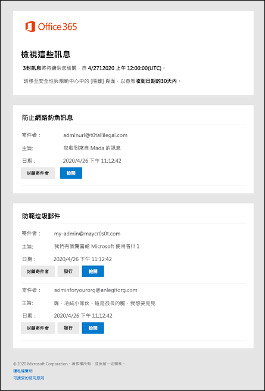

# Office 365 中的使用者垃圾郵件通知

在沒有 Exchange Online 信箱的 Exchange Online 或獨立 Exchange Online Protection （EOP）組織中，隔離區會在 Office 365 組織中包含可能有害或有害的郵件。 如需詳細資訊，請參閱[Office 365 中的隔離](quarantine-email-messages.md)。

根據預設，會停用反垃圾郵件原則中的使用者垃圾郵件通知。 當系統管理員[啟用使用者垃圾郵件通知](configure-your-spam-filter-policies.md)時，郵件收件者會收到有關其郵件的定期通知，其郵件是以垃圾郵件、大量電子郵件，或（截止至四月，2020）網路釣魚進行隔離。

> [!NOTE]
> 在10月2019，我們移除直接從使用者垃圾郵件通知來釋放隔離郵件的功能。 相反地，使用者現在可以移至 Office 365 的安全性 & 合規性中心，以釋放隔離的郵件（直接或透過按一下通知中的 [**複查**]）。 如需詳細資訊，請參閱 [以 Office 365 使用者身分尋找並釋出被隔離的郵件](find-and-release-quarantined-messages-as-a-user.md)。    以高可信度網路釣魚、惡意程式碼或郵件流程規則（也稱為傳輸規則）隔離的郵件只適用于系統管理員。 如需詳細資訊，請參閱[在 Office 365 中尋找及發行隔離的郵件為系統管理員](find-and-release-quarantined-messages-as-an-administrator.md)。

使用者垃圾郵件通知包含每個隔離郵件的下列資訊：

- **寄件者**：隔離郵件的傳送名稱和電子郵件地址。

- **Subject**：隔離郵件的主旨行文字。

- **日期**：郵件被隔離的日期和時間（UTC）。

- **封鎖寄件者**：按一下此連結可將寄件者新增至您的封鎖寄件者清單。

- **檢查**：按一下此連結以移至安全性 & 規範中心的隔離區，您可以在此發行、刪除或報告隔離的郵件。

