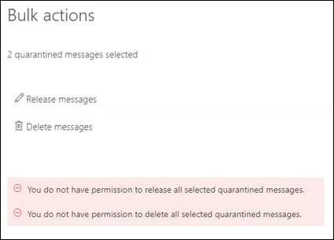

# <a name="view-and-release-quarantined-messages-from-shared-mailboxes"></a>從共用信箱中查看和發行隔離的郵件

> [!NOTE]
> 本文中所述的功能目前在預覽中，無法供所有人使用，而且可能會變更。

使用者可以管理被隔離的郵件，而這些郵件是以 [EOP 中的使用者身分發現和發行隔離郵件](find-and-release-quarantined-messages-as-a-user.md)所述的其中一位收件者。 不過，如果使用者擁有信箱的「完整存取」和「代理傳送」或「代理傳送者」許可權（如 [Exchange Online 中的共用信箱](https://docs.microsoft.com/exchange/collaboration-exo/shared-mailboxes)所述），共用信箱又該如何做呢？

先前，使用者能夠管理傳送至共用信箱的隔離郵件時，系統管理員可以將自動對應啟用，以供系統管理員在使用者存取另一個信箱) 時，預設會啟用該共用 (信箱。 不過，視使用者有權存取的信箱大小和數目而定，當 Outlooks 嘗試開啟使用者可以存取的 *所有* 信箱時，效能會受到影響。 基於這個理由，許多系統管理員會選擇 [移除共用信箱的自動對應](https://docs.microsoft.com/outlook/troubleshoot/profiles-and-accounts/remove-automapping-for-shared-mailbox)。

現在，使用者不再需要自動對應來管理傳送至共用信箱的隔離郵件。 它只適用于運作。 有兩種不同的方法可以存取已傳送至共用信箱的隔離郵件：

- 如果系統管理員已在反垃圾郵件原則中 [啟用使用者垃圾郵件通知](https://docs.microsoft.com/microsoft-365/security/office-365-security/configure-your-spam-filter-policies) ，則可以存取共用信箱中使用者垃圾郵件通知的任何使用者，都可以按一下通知中的 [ **檢查** ] 按鈕，以移至安全性 & 規範中心內的隔離。 請注意，此方法只允許使用者管理傳送至共用信箱的隔離郵件。 使用者無法在此內容中管理自己的隔離訊息。

- 使用者可以 [前往安全性 & 規範中心內的隔離](find-and-release-quarantined-messages-as-a-user.md)。 根據預設，只會顯示傳送給使用者的郵件。 不過，使用者可以變更「**郵件識別碼」按鈕** 的 **排序結果** () **收件者的電子郵件地址**、輸入共用信箱的電子郵件地址，然後 **按一下 [** 重新整理]，以查看已傳送至共用信箱的隔離郵件。

  

不論方法為何，使用者都可以加入隔離郵件的 **收件** 者欄，以避免混淆。 顯示的最大欄數是7，因此使用者需要按一下 [ **修改欄**]，移除現有的欄 (例如 [ **原則類型**) ]，選取 [ **收件** 者]，然後按一下 [ **儲存** ] 或 [ **另存為預設值**]。

  ![移除 [原則類型] 欄，並將 [收件者] 欄新增至隔離區。](../../media/quarantine-add-recipient-column.png)

## <a name="things-to-keep-in-mind"></a>必須記住的事項

- 第一個作用於隔離郵件的使用者，會決定所有使用共用信箱之使用者的郵件 fate。 例如，如果有10位使用者存取共用信箱，而且使用者決定刪除隔離郵件，則會刪除所有10位使用者的郵件。 同樣地，如果使用者決定要放開郵件，該郵件就會發佈至共用信箱，並可供共用信箱的其他所有使用者存取。

- 目前，如果使用者選取多個已傳送至共用信箱的隔離郵件，當使用者按一下 [**大量動作**] 浮出視窗中的 [**放開郵件**] 或 [**刪除郵件**] 時，就會傳回下列誤導性錯誤：

  > 您沒有釋放所有選取隔離郵件的許可權。
  >
  > 您沒有刪除所有選取隔離郵件的許可權。

  不論錯誤為何，都會對郵件採取動作，而且可以忽略此錯誤。

  

- 目前已傳送至共用信箱的隔離郵件，[**詳細資料**] 浮出器中無法使用 [**封鎖寄件者**] 按鈕。

- 若要管理 [Exchange Online](https://docs.microsoft.com/powershell/exchange/connect-to-exchange-online-powershell)中共用信箱的隔離郵件 PowerShell，使用者必須使用 [Get-QuarantineMessage](https://docs.microsoft.com/powershell/module/exchange/get-quarantinemessage) Cmdlet 與共享信箱電子郵件 _RecipientAddress_ 位址，以識別郵件。 例如：

  ```powershell
  Get-QuarantinedMessage -RecipientAddress officeparty@contoso.com
  ```

  然後，使用者可以從清單中選取隔離的郵件，以查看或採取動作。

  在這個範例中，會顯示所有已傳送至共用信箱的隔離郵件，然後從隔離區發行清單中的第一封郵件， (清單中的第一個郵件是0，第二個是1，) 依此類推。

  ```powershell
  $SharedMessages = Get-QuarantinedMessage -RecipientAddress officeparty@contoso.com | select -ExpandProperty Identity
  $SharedMessages
  Release-QuarantinedMessage -Identity $SharedMessages[0]
  ```

  如需詳細的語法及參數資訊，請參閱下列主題：

  - [Get-QuarantineMessage](https://docs.microsoft.com/powershell/module/exchange/get-quarantinemessage)
  - [Get-QuarantineMessageHeader](https://docs.microsoft.com/powershell/module/exchange/get-quarantinemessageheader)
  - [預覽-Get-quarantinemessage](https://docs.microsoft.com/powershell/module/exchange/preview-quarantinemessage)
  - [Release-QuarantineMessage](https://docs.microsoft.com/powershell/module/exchange/release-quarantinemessage)
