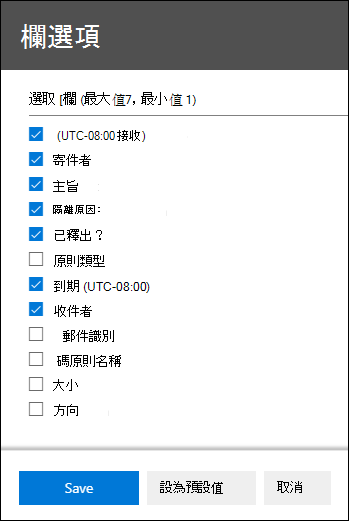

# <a name="view-and-release-quarantined-messages-from-shared-mailboxes"></a><span data-ttu-id="fc2e7-103">從共用信箱中查看和釋出隔離的郵件</span><span class="sxs-lookup"><span data-stu-id="fc2e7-103">View and release quarantined messages from shared mailboxes</span></span>

> [!NOTE]
> <span data-ttu-id="fc2e7-104">本文所述的功能目前為預覽版，並不提供所有人使用，且可能會有所變更。</span><span class="sxs-lookup"><span data-stu-id="fc2e7-104">The features that are described in this article are currently in Preview, aren't available to everyone, and are subject to change.</span></span>

<span data-ttu-id="fc2e7-105">使用者可以管理隔離的郵件，其中它們是其中一個收件者，如 [EOP](find-and-release-quarantined-messages-as-a-user.md)中的使用者一樣尋找和釋出隔離的郵件。</span><span class="sxs-lookup"><span data-stu-id="fc2e7-105">Users can manage quarantined messages where they are one of the recipients as described in [Find and release quarantined messages as a user in EOP](find-and-release-quarantined-messages-as-a-user.md).</span></span> <span data-ttu-id="fc2e7-106">但是，如果使用者擁有信箱的完全存取和傳送為或代理傳送者許可權，那麼共用信箱呢？這如 [Exchange Online](https://docs.microsoft.com/exchange/collaboration-exo/shared-mailboxes)中的共用信箱所述？</span><span class="sxs-lookup"><span data-stu-id="fc2e7-106">But what about shared mailboxes where the user has Full Access and Send As or Send on Behalf permissions to the mailbox as described in [Shared mailboxes in Exchange Online](https://docs.microsoft.com/exchange/collaboration-exo/shared-mailboxes)?</span></span>

<span data-ttu-id="fc2e7-107">之前，若要讓使用者管理送往共用信箱的隔離郵件，系統管理員必須讓共用信箱的自動對數保持啟用 (當系統管理員將另一個信箱的存取權授予使用者時，系統預設會啟用此) 。</span><span class="sxs-lookup"><span data-stu-id="fc2e7-107">Previously, the ability for users to manage quarantined messages sent to a shared mailbox required admins to leave automapping enabled for the shared mailbox (it's enabled by default when an admin gives a user access to another mailbox).</span></span> <span data-ttu-id="fc2e7-108">不過，根據使用者能夠存取的信箱大小和數量，Outlook 嘗試開啟使用者具有存取權的所有信箱時，可能會影響效果。 </span><span class="sxs-lookup"><span data-stu-id="fc2e7-108">However, depending on the size and number of mailboxes that the user has access to, performance can suffer as Outlooks tries to open *all* mailboxes that the user has access to.</span></span> <span data-ttu-id="fc2e7-109">因此，許多系統管理員選擇移除共用信箱 [的自動對數](https://docs.microsoft.com/outlook/troubleshoot/profiles-and-accounts/remove-automapping-for-shared-mailbox)。</span><span class="sxs-lookup"><span data-stu-id="fc2e7-109">For this reason, many admins choose to [remove automapping for shared mailboxes](https://docs.microsoft.com/outlook/troubleshoot/profiles-and-accounts/remove-automapping-for-shared-mailbox).</span></span>

<span data-ttu-id="fc2e7-110">現在，使用者不再需要自動對數來管理已送往共用信箱的隔離郵件。</span><span class="sxs-lookup"><span data-stu-id="fc2e7-110">Now, automapping is no longer required for users to manage quarantined messages that were sent to shared mailboxes.</span></span> <span data-ttu-id="fc2e7-111">這樣才有效。</span><span class="sxs-lookup"><span data-stu-id="fc2e7-111">It just works.</span></span> <span data-ttu-id="fc2e7-112">有兩種不同的方法可以存取已送往共用信箱的隔離郵件：</span><span class="sxs-lookup"><span data-stu-id="fc2e7-112">There are two different methods to access quarantined messages that were sent to a shared mailbox:</span></span>

- <span data-ttu-id="fc2e7-113">如果系統管理員已啟用反[](https://docs.microsoft.com/microsoft-365/security/office-365-security/configure-your-spam-filter-policies)垃圾郵件策略中的使用者垃圾郵件通知，任何能夠存取共用信箱中使用者垃圾郵件通知的使用者，都可以按一下通知中的 [檢閱> 按鈕，在安全性&合規性中心隔離。</span><span class="sxs-lookup"><span data-stu-id="fc2e7-113">If the admin has [enabled end-user spam notifications](https://docs.microsoft.com/microsoft-365/security/office-365-security/configure-your-spam-filter-policies) in anti-spam policies, any user that has access to the end-user spam notifications in the shared mailbox can click the **Review** button in the notification to go to quarantine in the Security & Compliance Center.</span></span> <span data-ttu-id="fc2e7-114">請注意，這個方法只能讓使用者管理已隔離並寄到共用信箱的郵件。</span><span class="sxs-lookup"><span data-stu-id="fc2e7-114">Note that this method only allows users to manage quarantined messages that were sent to the shared mailbox.</span></span> <span data-ttu-id="fc2e7-115">使用者在此情境中無法管理自己的隔離郵件。</span><span class="sxs-lookup"><span data-stu-id="fc2e7-115">Users can't manage their own quarantine messages in this context.</span></span>

- <span data-ttu-id="fc2e7-116">使用者可以前往 [安全性與合規性中心的隔離&隔離](find-and-release-quarantined-messages-as-a-user.md)。</span><span class="sxs-lookup"><span data-stu-id="fc2e7-116">The user can [go to the quarantine in the Security & Compliance Center](find-and-release-quarantined-messages-as-a-user.md).</span></span> <span data-ttu-id="fc2e7-117">根據預設，只會顯示已給使用者的郵件。</span><span class="sxs-lookup"><span data-stu-id="fc2e7-117">By default, only messages that were sent to the user are shown.</span></span> <span data-ttu-id="fc2e7-118">不過，使用者可以變更 [郵件識別碼 (預設為) 收件者電子郵件地址、輸入共用信箱電子郵件地址，然後按一下 [重新整理， 查看已隔離的郵件已送到共用信箱中。</span><span class="sxs-lookup"><span data-stu-id="fc2e7-118">However, the user can change the **Sort results** (the **Message ID button** by default) to **Recipient email address**, enter the shared mailbox email address, and then click **Refresh** to see the quarantined messages that were sent to the shared mailbox.</span></span>

  

<span data-ttu-id="fc2e7-120">不論使用哪種方法，使用者都可以在隔離郵件中包含收件者 **欄以避免混淆** 。</span><span class="sxs-lookup"><span data-stu-id="fc2e7-120">Regardless of the method, users can avoid confusion by including the **Recipient** column for quarantined messages.</span></span> <span data-ttu-id="fc2e7-121">要顯示的欄數上限為 7，因此使用者必須按一下 [修改欄、移除現有的欄 (例如，[政策類型) ;選取收件者，然後按一下 [儲存或儲存為預設值。  </span><span class="sxs-lookup"><span data-stu-id="fc2e7-121">The maximum number of columns to display is 7, so the user will need to click **Modify columns**, remove an existing column (for example, **Policy type**), select **Recipient**, and then click **Save** or **Save as default**.</span></span>

  

## <a name="things-to-keep-in-mind"></a><span data-ttu-id="fc2e7-123">必須記住的事項</span><span class="sxs-lookup"><span data-stu-id="fc2e7-123">Things to keep in mind</span></span>

- <span data-ttu-id="fc2e7-124">第一個針對隔離郵件採取行動的使用者，會決定該郵件的接收物件是使用共用信箱的每個人。</span><span class="sxs-lookup"><span data-stu-id="fc2e7-124">The first user to act on the quarantined message decides the fate of the message for everyone who uses the shared mailbox.</span></span> <span data-ttu-id="fc2e7-125">例如，如果有 10 個使用者存取共用信箱，而使用者決定刪除隔離郵件，這 10 個使用者將會刪除該郵件。</span><span class="sxs-lookup"><span data-stu-id="fc2e7-125">For example, if a shared mailbox is accessed by 10 users, and a user decides to delete the quarantine message, the message is deleted for all 10 users.</span></span> <span data-ttu-id="fc2e7-126">同樣地，如果使用者決定釋出郵件，該郵件會釋出至共用信箱，且共用信箱的其他使用者都可以進行共用。</span><span class="sxs-lookup"><span data-stu-id="fc2e7-126">Likewise, if a user decides to release the message, it's released to the shared mailbox and is accessible by all other users of the shared mailbox.</span></span>

- <span data-ttu-id="fc2e7-127">目前 **，針對已** 送往共用信箱的隔離郵件，在詳細資料飛出區中無法使用封鎖寄件者按鈕。</span><span class="sxs-lookup"><span data-stu-id="fc2e7-127">Currently, the **Block sender** button is not available in the **Details** flyout for quarantined messages that were sent to the shared mailbox.</span></span>

- <span data-ttu-id="fc2e7-128">若要在 [Exchange Online PowerShell](https://docs.microsoft.com/powershell/exchange/connect-to-exchange-online-powershell)中管理共用信箱的隔離郵件，使用者需要以共用信箱電子郵件地址使用 [Get-QuarantineMessage](https://docs.microsoft.com/powershell/module/exchange/get-quarantinemessage) Cmdlet 做為 _RecipientAddress_ 參數的值來識別郵件。</span><span class="sxs-lookup"><span data-stu-id="fc2e7-128">To manage quarantined messages for the shared mailbox in [Exchange Online PowerShell](https://docs.microsoft.com/powershell/exchange/connect-to-exchange-online-powershell), the end-user will need to use the [Get-QuarantineMessage](https://docs.microsoft.com/powershell/module/exchange/get-quarantinemessage) cmdlet with shared mailbox email address for the value of the _RecipientAddress_ parameter to identify the messages.</span></span> <span data-ttu-id="fc2e7-129">例如：</span><span class="sxs-lookup"><span data-stu-id="fc2e7-129">For example:</span></span>

  ```powershell
  Get-QuarantinedMessage -RecipientAddress officeparty@contoso.com
  ```

  <span data-ttu-id="fc2e7-130">然後，使用者可以從清單中選取隔離郵件來查看或採取動作。</span><span class="sxs-lookup"><span data-stu-id="fc2e7-130">Then, the end-user can select a quarantined message from the list to view or take action on.</span></span>

  <span data-ttu-id="fc2e7-131">此範例顯示所有已送往共用信箱的隔離郵件，然後從隔離中釋出列表中的第一封郵件 (清單中的第一封郵件是 0，第二封郵件是 1，以) 此類比。</span><span class="sxs-lookup"><span data-stu-id="fc2e7-131">This example shows all of the quarantined messages that were sent to the shared mailbox, and then releases the first message in the list from quarantine (the first message in the list is 0, the second is 1, and so on).</span></span>

  ```powershell
  $SharedMessages = Get-QuarantinedMessage -RecipientAddress officeparty@contoso.com | select -ExpandProperty Identity
  $SharedMessages
  Release-QuarantinedMessage -Identity $SharedMessages[0]
  ```

  <span data-ttu-id="fc2e7-132">如需詳細的語法及參數資訊，請參閱下列主題：</span><span class="sxs-lookup"><span data-stu-id="fc2e7-132">For detailed syntax and parameter information, see the following topics:</span></span>

  - [<span data-ttu-id="fc2e7-133">Get-QuarantineMessage</span><span class="sxs-lookup"><span data-stu-id="fc2e7-133">Get-QuarantineMessage</span></span>](https://docs.microsoft.com/powershell/module/exchange/get-quarantinemessage)
  - [<span data-ttu-id="fc2e7-134">Get-QuarantineMessageHeader</span><span class="sxs-lookup"><span data-stu-id="fc2e7-134">Get-QuarantineMessageHeader</span></span>](https://docs.microsoft.com/powershell/module/exchange/get-quarantinemessageheader)
  - [<span data-ttu-id="fc2e7-135">Preview-QuarantineMessage</span><span class="sxs-lookup"><span data-stu-id="fc2e7-135">Preview-QuarantineMessage</span></span>](https://docs.microsoft.com/powershell/module/exchange/preview-quarantinemessage)
  - [<span data-ttu-id="fc2e7-136">Release-QuarantineMessage</span><span class="sxs-lookup"><span data-stu-id="fc2e7-136">Release-QuarantineMessage</span></span>](https://docs.microsoft.com/powershell/module/exchange/release-quarantinemessage)
