# 在 Microsoft 365 Defender 入口網站中查看電子郵件安全性報告

[!INCLUDE [Microsoft 365 Defender rebranding](../includes/microsoft-defender-for-office.md)]

**適用於**
- [Exchange Online Protection](exchange-online-protection-overview.md)
- [適用於 Office 365 的 Microsoft Defender 方案 1 和方案 2](defender-for-office-365.md)
- [Microsoft 365 Defender](../defender/microsoft-365-defender.md)

Microsoft 365 Defender 入口網站提供各種報告 <https://security.microsoft.com> ，可協助您觀察電子郵件安全性功能（例如 Microsoft 365 中的反垃圾郵件、反惡意程式碼和加密功能）如何保護您的組織。 如果您有 [必要的許可權](#what-permissions-are-needed-to-view-these-reports)，您可以在 Microsoft 365 Defender 入口網站中查看這些報告，方式是要 **報告** \> **電子郵件 &** 共同作業 & 共同作業 \> **報告**。 若要直接移至 [ **電子郵件 &** 共同作業報告] 頁面上，開啟 <https://security.microsoft.com/emailandcollabreport> 。

![Microsoft 365 Defender 入口網站中的電子郵件 & 共同作業報告] 頁面](../../media/email-collaboration-reports.png)

> [!NOTE]
>
> [ **電子郵件 & 協同報告** ] 頁面上的某些報告需要 Microsoft Defender for Office 365。 如需這些報告的詳細資訊，請參閱 [在 Microsoft 365 Defender 入口網站中查看 Office 365 報告的 Defender](view-reports-for-mdo.md)。
>
> 與郵件流程相關的報告現在位於 Exchange 系統管理中心 (EAC) 。 如需這些報告的詳細資訊，請參閱 [新 Exchange 系統管理中心的郵件流程報告](/exchange/monitoring/mail-flow-reports/mail-flow-reports)。

## 已遭破壞的使用者報告

> [!NOTE]
> 這份報告可在 Microsoft 365 組織中使用 Exchange Online 信箱。 在獨立 Exchange Online Protection (EOP) 組織中無法使用此功能。

「已 **遭破壞的使用者** 報告」顯示顯示過去7天內已標示為 **可疑** 或 **限制** 的使用者帳戶數目。 在上述任一狀態的帳戶都有問題或甚至遭到破壞。 在經常使用的情況下，您可以使用報表來找出峰值，甚至是趨勢，也就是可疑或受限制的帳戶。 如需遭到破壞之使用者的詳細資訊，請參閱 [回應遭到破壞的電子郵件帳戶](responding-to-a-compromised-email-account.md)。

匯總視圖會顯示過去90天的資料，詳細資料檢視會顯示過去30天的資料。

若要在 Microsoft 365 Defender 入口網站中查看報告，請移至 **Reports** \> **email & 協同** \> **電子郵件 &** 共同作業報告。 在 [ **電子郵件 &** 共同作業報告] 頁面上，尋找 **遭破壞的使用者** ，然後按一下 [ **查看詳細資料**]。 若要直接前往報表，請開啟 <https://security.microsoft.com/reports/CompromisedUsers> 。

在 [已 **遭破壞的使用者** ] 頁面上，您可以按一下 [ **篩選** ]，然後在出現的飛出視窗中，選取下列一或多個值，以篩選圖表和詳細資料表格：

- **日期 (UTC)**： **開始日期** 和 **結束日期**。
- **活動**：
  - **可疑**：使用者帳戶已傳送可疑的電子郵件，而且受到限制傳送電子郵件的風險。
  - **限制**：由於高度可疑的模式，使用者帳戶已限制傳送電子郵件。

當您完成設定篩選 **時，請按一下 [** 套用]、[ **取消**] 或 [ **清除篩選**]。

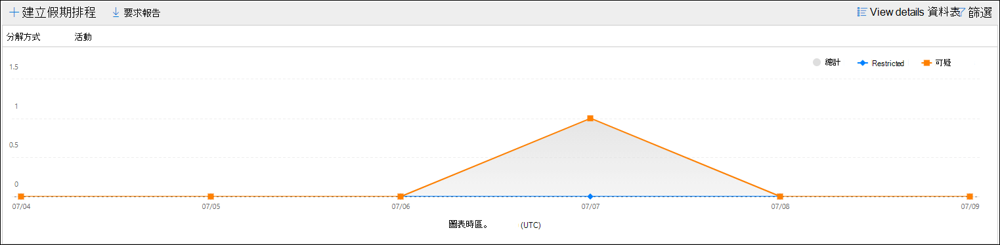

在圖形下方的 [詳細資料] 表格中，您可以看到下列詳細資料：

- **建立時間**
- **User ID**
- **Action**

## Exchange transport rule 報告

**Exchange transport rule** report 會顯示郵件流程規則 (也稱為傳輸規則) 組織中內送和外寄郵件的效果。

若要在 Microsoft 365 Defender 入口網站中查看報告，請移至 **Reports** \> **email & 協同** \> **電子郵件 &** 共同作業報告。 在 [ **電子郵件 &** 共同作業報告] 頁面上，尋找 [ **Exchange transport rule** ]，然後按一下 [ **查看詳細資料**]。 若要直接前往報表，請開啟 <https://security.microsoft.com/reports/ETRRuleReport> 。

在 [ **Exchange transport rule 報告** ] 頁面上，下列各節將說明可用的圖表和資料。

### 依方向的圖表分解

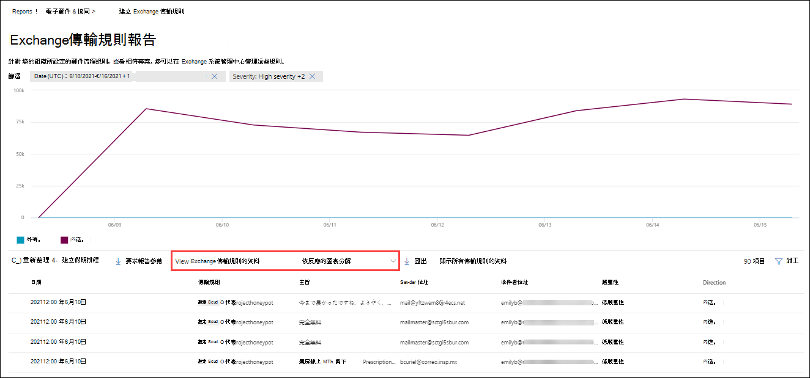

如果您 **依方向選取 [圖表分解**]，可使用下列圖表：

- 透過 **Exchange 傳輸規則來查看資料**：受郵件流程規則影響的 **輸入** 和 **輸出** 郵件數目。
- **以 DLP Exchange 傳輸規則來查看資料**：受資料遺失防護 (DLP) 郵件流程規則所影響的 **輸入** 和 **輸出** 郵件數目。

下列資訊會顯示在圖形下方的詳細資料表格中：

- **Date**
- **Dlp 原則** (只 **依 dlp Exchange Transport rules 來查看資料**) 
- **傳輸規則**
- **主旨**
- **寄件者位址**
- **收件者位址**
- **嚴重性**
- **方向**

您可以在出現的浮出控制項中按一下 [ **篩選** ] 並選取下列其中一個或多個值，以篩選圖表和詳細資料表格：

- **日期 (UTC)** **開始日期** 和 **結束日期**
- **方向**： **輸出** 和 **輸入**
- **嚴重性**： **高嚴重性**、 **中低嚴重性** 和 **低嚴重性**

當您完成設定篩選 **時，請按一下 [** 套用]、[ **取消**] 或 [ **清除篩選**]。

### 依嚴重性的圖表細目

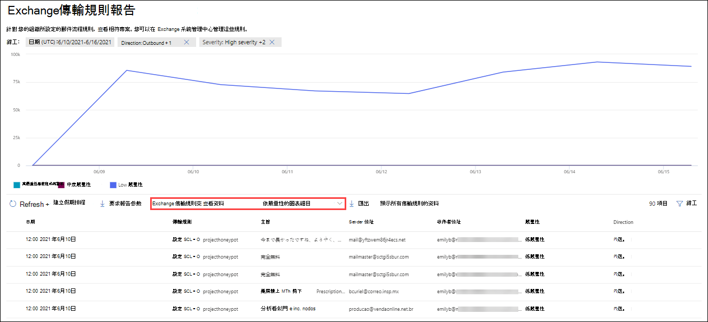

如果您 **依嚴重性選取 [圖表分解**]，可使用下列圖表：

- 透過 **Exchange 傳輸規則來查看資料**：**高嚴重性**、**中嚴重性** 和 **低嚴重性** 郵件的數目。 您可以將嚴重性層級設定為規則 ([ **以嚴重性層級** 或 _SetAuditSeverity_) 審核此規則] 中的動作。 如需詳細資訊，請參閱 [Exchange Online 中的郵件流程規則動作](/Exchange/security-and-compliance/mail-flow-rules/mail-flow-rule-actions)。

- **按 Dlp Exchange transport rules 來查看資料**：受 dlp 郵件流程規則影響的 **高嚴重性**、 **中嚴重性** 和 **低嚴重性** 郵件數目。

下列資訊會顯示在圖形下方的詳細資料表格中：

- **Date**
- **Dlp 原則** (只 **依 dlp Exchange Transport rules 來查看資料**) 
- **傳輸規則**
- **主旨**
- **寄件者位址**
- **收件者位址**
- **嚴重性**
- **方向**

您可以在出現的浮出控制項中按一下 [ **篩選** ] 並選取下列其中一個或多個值，以篩選圖表和詳細資料表格：

- **日期 (UTC)** **開始日期** 和 **結束日期**
- **方向**： **輸出** 和 **輸入**
- **嚴重性**： **高嚴重性**、 **中低嚴重性** 和 **低嚴重性**

當您完成設定篩選 **時，請按一下 [** 套用]、[ **取消**] 或 [ **清除篩選**]。

## 轉接報告

> [!NOTE]
> 您現在可以在 EAC 中使用轉寄 **報告** 。 如需詳細資訊，請參閱 [新 EAC 中的自動轉寄郵件報告](/exchange/monitoring/mail-flow-reports/mfr-auto-forwarded-messages-report)。

## 郵件流程狀態報表

**郵件流程狀態報表** 是一個智慧報告，顯示傳入和傳出電子郵件、垃圾郵件偵測、惡意程式碼、識別為「良好」之電子郵件的相關資訊，以及有關允許或封鎖在 edge 上之電子郵件的資訊。 這是唯一包含 edge protection 資訊的報告，它會顯示在 Exchange Online Protection (EOP) 中，允許在評估之前封鎖多少封電子郵件。 請務必瞭解，如果郵件傳送給五位收件者，我們會將其統計為五個不同的郵件，而不是一封郵件。

若要在 Microsoft 365 Defender 入口網站中查看報告，請移至 **Reports** \> **email & 協同** \> **電子郵件 &** 共同作業報告。 在 [ **電子郵件 &** 共同作業報告] 頁面上，尋找 **郵件流程狀態摘要** ，然後按一下 [ **查看詳細資料**]。 若要直接前往報表，請開啟 <https://security.microsoft.com/reports/mailflowStatusReport> 。

![[電子郵件 & 共同作業報告] 頁面上的 [郵件流程狀態摘要] 小工具](../../media/mail-flow-status-report-widget.png)

### 郵件流程狀態報表的類型視圖

在 [ **郵件流程狀態報表** ] 頁面上，預設會選取 [ **類型** ] 索引標籤。 根據預設，此視圖包含的圖表和詳細資料表格已設定為下列篩選：

- **日期 (UTC)** 過去7天。
- **郵件方向**：
  - **入境**
  - **出境**
  - **組織內**：此計數是針對承租人中的郵件，亦即 寄件者 abc@domain.com 會傳送至收件者 xyz@domain.com (與 **輸入** 和 **輸出**) 分開計數
- **類型**：
  - **良好的郵件**
  - **惡意程式碼**
  - **垃圾郵件**
  - **Edge protection**
  - **規則訊息**
  - **網路釣魚電子郵件**
- **網域**： **全部**

圖表是依 **類型** 值進行組織。

您可以按一下 [ **篩選**] 以變更這些篩選。

下列資訊會顯示在圖形下方的詳細資料表格中：

- **方向**
- **類型**
- **24 小時**
- **3天**
- **7 天**
- **15 天**
- **30天**

如果您按一下 **[選擇類別] 以取得詳細資料**，您可以選取下列值：

- **網路釣魚電子郵件**：這項選擇會帶您前往「 [威脅防護狀態」報告](view-email-security-reports.md#threat-protection-status-report)。
- **電子郵件中的惡意** 代碼：這項選擇會帶您前往 [威脅防護狀態報表](view-email-security-reports.md#threat-protection-status-report)。
- **垃圾郵件** 偵測：這項選擇會帶您前往 [垃圾郵件偵測報告](view-email-security-reports.md#spam-detections-report)。
- **Edge 封鎖的垃圾郵件**：這項選擇會帶您前往 [垃圾郵件偵測報告](view-email-security-reports.md#spam-detections-report)。

#### 從類型視圖匯出

在 [詳細資料] 視圖中，您只能匯出一天的資料。 因此，如果您想要匯出資料7天，您必須做7種不同的匯出動作。

每個匯出的 .csv 檔會限制為150000列。 如果該天的資料包含超過150000列，則會建立多個 .csv 檔案。

### 郵件流程狀態報表的方向視圖

如果您按一下 [ **方向** ] 索引標籤，則會使用 [ **類型** ] 視圖中的相同預設篩選器。

圖表是依 **方向** 值進行組織。

您可以按一下 [ **篩選**] 以變更這些篩選。 會使用 [ **類型** ] 視圖中的相同篩選器。

詳細資料表格包含的資訊來自 **類型** view。

[ **選擇類別** ] 如需詳細資料，可用的選取專案和行為與「 **類型** 」視圖相同。

#### 從方向視圖匯出

在 [詳細資料] 視圖中，您只能匯出一天的資料。 因此，如果您想要匯出資料7天，您必須做7種不同的匯出動作。

每個匯出的 .csv 檔會限制為150000列。 如果該天的資料包含超過150000列，則會建立多個 .csv 檔案。

### 郵件流程狀態報表的漏斗視圖

**漏斗** 視圖顯示 Microsoft 的電子郵件威脅防護功能如何篩選組織中的內送和外寄電子郵件。 它提供有關電子郵件總數的詳細資訊，以及設定的威脅防護功能（包括 edge protection、反惡意程式碼、反網路釣魚、反垃圾郵件和反欺詐）對此計數的影響。

如果您按一下 [ **漏斗** ] 索引標籤，此 view 預設會包含 [圖表] 和 [詳細資料] 表格設定為下列篩選：

- **日期**：過去7天。

- **方向**：
  - **入境**
  - **出境**
  - **組織內**：此計數是針對在租使用者中傳送的郵件進行計數;亦即，寄件者 abc@domain.com 會傳送給收件者 xyz@domain.com (與輸入和外寄) 分開計數。

匯總視圖和詳細資料表格視圖允許90天的篩選。

您可以按一下 [ **篩選**] 以變更這些篩選。 會使用 [ **類型** ] 視圖中的相同篩選器。

此圖顯示按下列方式組織的電子郵件計數：

- **電子郵件總數**
- **Edge protection 之後的電子郵件**
- **傳輸規則** (郵件流程規則之後的電子郵件) 
- **反惡意程式碼、檔信譽、檔案類型封鎖後的電子郵件**
- **反網路釣魚、URL 信譽、品牌模擬、反欺騙功能之後的電子郵件**
- **反垃圾郵件、大宗郵件篩選後的電子郵件**
- **使用者和網域模擬後的電子郵件**\*
- **檔案及 URL 引爆後的電子郵件**\*
- **在傳遞投遞後保護後，電子郵件偵測為良性 (URL 按一下時間保護)**

\*僅限 Office 365 的 Defender

若要個別查看以 EOP 或 Defender 為 Office 365 篩選的電子郵件，請按一下 [圖表圖例] 中的值。

[詳細資料] 表格包含下列資訊（以遞減的日期順序顯示）：

- **Date**
- **電子郵件總數**
- **Edge protection**
- **反惡意程式碼、檔信譽、檔案類型封鎖**：
  - **檔信譽**：由於其他 Microsoft 客戶附加的檔案識別，因此篩選郵件。
  - **檔案類型封鎖**：由於郵件中識別的惡意檔案類型，篩選郵件。
- **反網路釣魚、URL 信譽、品牌模仿、反欺騙**：
  - **URL 信譽**：由於其他 Microsoft 客戶的 url 身分識別而篩選的郵件。
  - **品牌** 模擬：因為郵件是由眾所周知的品牌類比寄件者所過濾，所以會加以篩選。
  - **反欺騙**：因為郵件企圖哄騙收件者所屬的網域，或是郵件寄件者不會擁有的網域，所以篩選掉郵件。
- **反垃圾郵件，大宗郵件篩選**：
  - **大宗郵件篩選**：在反垃圾郵件原則中依據大量抱怨層級 (BCL) 臨界值篩選的郵件。
- **Office 365) 的使用者和網域模擬 (Defender**：
  - **使用者** 模擬：郵件因嘗試模擬使用者 (郵件寄件者) （已在反網路釣魚原則的類比保護設定中所定義）而篩選。
  - **網域** 模擬：郵件因嘗試模擬防網路釣魚原則之類比保護設定中所定義的網域而篩選出來。
- 檔案 **及 URL 引爆 (Defender for Office 365)**：
  - 檔案 **引爆**：以 Safe 附件原則篩選的郵件。
  - **URL 引爆**：透過 Safe 連結原則篩選的郵件。
- **投遞後保護和 zap (ATP) 或 zap (EOP)**：零小時自動清除 (針對惡意程式碼、垃圾郵件和網路釣魚的 ZAP) 。

如果您選取 [詳細資料] 表格中的列，則會在飛入的電子郵件計數中顯示進一步細分。

#### 從漏斗視圖匯出

在 [**選項**] 下按一下 [**匯出**] 後，您可以選取下列其中一個值：

- **資料摘要 (，最多) 過去90天的資料**
- **詳細資料 (過去30天的資料，最多)**

在 [ **日期**] 下，選擇範圍，然後 **按一下 [** 套用]。 目前篩選的資料會匯出至 .csv 檔案。

每個匯出的 .csv 檔會限制為150000列。 如果資料包含超過150000列，則會建立多個 .csv 檔案。

### 郵件流程狀態報表的技術視圖

**技術視圖** 類似 **漏斗** 圖模式，可提供設定威脅防護功能的更細微細節。 您可以從圖表中查看郵件如何在威脅防護的不同階段進行分類。

如果您按一下 [ **技術視圖** ] 索引標籤，此視圖預設會包含 [圖表] 和 [詳細資料] 表格設定為下列篩選：

- **日期**：過去7天。

- **方向**：
  - **入境**
  - **出境**
  - **組織內**：此計數是針對承租人中的郵件，亦即 寄件者 abc@domain.com 會傳送至收件者 xyz@domain.com (與輸入和輸出) 分開計數

匯總視圖和詳細資料表格視圖允許90天的篩選。

您可以按一下 [ **篩選**] 以變更這些篩選。 會使用 [ **類型** ] 視圖中的相同篩選器。

此圖顯示組織成下列類別的郵件：

- **電子郵件總數**
- **Edge 允許** 和 **edge 篩選**
- 已篩選的 **傳輸規則允許** 和 **傳輸規則** (郵件流程規則) 
- **非惡意** 代碼、 **Safe 附件偵測** \* 和 **反惡意程式碼引擎偵測**
- **不是網路釣魚詐騙**、 **DMARC 失敗**、**模仿偵測** \* 、**欺騙偵測** 和 **網路釣魚偵測**
- **沒有偵測 URL 引爆** 及 **url 引爆偵測**\*
- **非垃圾郵件** 和  **垃圾郵件**
- **非惡意的電子郵件**、 **Safe 連結偵測** \* 和 **ZAP**

\*Office 365 的 Defender

當您將游標移到圖表中的某個類別時，您可以看到該類別中的郵件數目。

[詳細資料] 表格包含下列資訊（以遞減的日期順序顯示）：

- **日期 (UTC)**
- **電子郵件總數**
- **已篩選 Edge**
- **規則郵件**：由於郵件流程規則而篩選的郵件 (也稱為傳輸規則) 。
- **反惡意程式碼引擎**， **Safe 附件** \* ：
- **DMARC，類比** \* ，**欺騙**，**網路釣魚篩選**：
  - **DMARC**：由於郵件失敗的 DMARC 驗證檢查而篩選的郵件。
- **URL 引爆偵測**\*
- **已篩選的反垃圾郵件**
- **移除的 ZAP**
- **Safe 連結偵測**\*

\*Office 365 的 Defender

如果您選取 [詳細資料] 表格中的列，則會在飛入的電子郵件計數中顯示進一步細分。

#### 從技術視圖匯出

在按一下 [ **匯出**] 的 [ **選項** ] 底下，您可以選取下列其中一個值：

- **資料摘要 (，最多) 過去90天的資料**
- **詳細資料 (過去30天的資料，最多)**

在 [ **日期**] 下，選擇範圍，然後 **按一下 [** 套用]。 目前篩選的資料會匯出至 .csv 檔案。

每個匯出的 .csv 檔會限制為150000列。 如果資料包含超過150000列，則會建立多個 .csv 檔案。

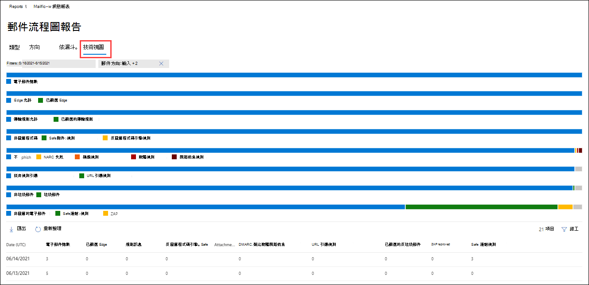

## 惡意程式碼檢測報告

**惡意軟體偵測報告** 會顯示 Exchange Online Protection 或 EOP) 所偵測到的內送和外寄電子郵件， (惡意軟體偵測的相關資訊。 如需 EOP 中惡意程式碼保護的詳細資訊，請參閱 [EOP 中的反惡意程式碼保護](anti-malware-protection.md)。

匯總 view 篩選允許90天，而 [詳細資料表格篩選] 只允許10天。

若要在 Microsoft 365 Defender 入口網站中查看報告，請移至 **Reports** \> **email & 協同** \> **電子郵件 &** 共同作業報告。 在 [**電子郵件 &** 共同作業報告] 頁面上，尋找 [**在電子郵件中偵測到惡意** 代碼]，然後按一下 [ **View** 若要直接前往報表，請開啟 <https://security.microsoft.com/reports/MalwareDetections> 。

![電子郵件 & 協同報告] 頁面上電子郵件小工具中的惡意程式碼偵測](../../media/malware-detections-widget.png)

在 [ **惡意** 代碼偵測報告] 頁面上，您可以按一下 [ **篩選** ] 並選取下列其中一個值，以篩選圖表和詳細資料表格：

- **日期 (UTC)** **開始日期** 和 **結束日期**
- **方向**： **輸入** 和 **輸出**

在圖形下方的 [詳細資料] 表格中，您可以看到下列詳細資料：

- **Date**
- **寄件者位址**
- **收件者位址**
- **郵件識別碼**：郵件頭的 **Message-ID** 標頭欄位中可用，且應該是唯一的。 範例值 `<08f1e0f6806a47b4ac103961109ae6ef@server.domain>` (記下角括弧) 。
- **主旨**
- **Filename**
- **惡意軟體名稱**

## 郵件延遲報告

Office 365 的「中的 **郵件延遲報告**] 包含組織內的郵件傳遞和引爆延遲的資訊。 如需詳細資訊，請參閱 [郵件延遲報告](view-reports-for-mdo.md#mail-latency-report)。

## 垃圾郵件偵測報告

> [!NOTE]
> **垃圾郵件偵測報告** 會最後移出。 「 [威脅防護狀態」報告](#threat-protection-status-report)中提供相同的資訊。

## 欺騙偵測報告

> [!NOTE]
> 本文中所述的 [已改進的欺騙偵測報告] 是預覽中所述，視情況而變更，並非所有組織都提供這些報告。 較舊的報表版本只會顯示 **良好的郵件** ，而且會被 **視為垃圾** 郵件。

**欺騙** 偵測報告會顯示因欺騙性而封鎖或允許的郵件相關資訊。 如需有關電子欺騙的詳細資訊，請參閱 [EOP 中的反欺騙防護](anti-spoofing-protection.md)。

報表的匯總視圖允許45天的篩選 \* ，而詳細資料檢視只允許10天的篩選。

\* 最後，您將可以使用超過90天的篩選。

若要在 Microsoft 365 Defender 入口網站中查看報告，請移至 **Reports** \> **email & 協同** \> **電子郵件 &** 共同作業報告。 在 [ **電子郵件 &** 共同作業報告] 頁面上，找出 **欺騙** 偵測，然後按一下 [ **查看詳細資料**]。 若要直接前往報表，請開啟 <https://security.microsoft.com/reports/SpoofMailReportV2> 。

![電子郵件 & 協同報告] 頁面上的欺騙偵測小工具](../../media/spoof-detections-widget.png)

此圖表顯示下列資訊：

- **通過**
- **失敗**
- **SoftPass**
- **無**
- **其他**

當您將滑鼠停留在圖表中的某一天 (資料點) 時，您可以看到偵測到的冒牌郵件數目及原因。

在 [ **偽造郵件報告** ] 頁面上，您可以按一下 [ **篩選** ]，然後選取下列其中一個或多個值，以篩選圖表和詳細資料表格：

- **日期 (UTC)** **開始日期** 和 **結束日期**
- **結果**：
  - **通過**
  - **失敗**
  - **SoftPass**
  - **無**
  - **其他**
- **哄騙類型**： **Internal** 和 **External**

![Microsoft 365 Defender 入口網站中的 [偽造郵件報告] 頁面](../../media/spoof-detections-report-page.png)

在圖形下方的 [詳細資料] 表格中，您可以看到下列詳細資料：

- **Date**
- **偽裝的使用者**
- **傳送基礎結構**
- **哄騙類型**
- **結果**
- **結果代碼**
- **SPF**
- **DKIM**
- **DMARC**
- **訊息計數**

如需複合驗證結果代碼的詳細資訊，請參閱[反垃圾郵件郵件頭 in Microsoft 365](anti-spam-message-headers.md)。

## 提交報告

**提交** 報告會顯示系統管理員針對分析報告之專案的相關資訊。 如需詳細資訊，請參閱 [使用系統管理員提交將可疑的垃圾郵件、網路釣魚、URLs 和檔案提交給 Microsoft](admin-submission.md)。

若要在 Microsoft 365 Defender 入口網站中查看報告，請移至 **Reports** \> **email & 協同** \> **電子郵件 &** 共同作業報告。 在 [ **電子郵件 &** 共同作業報告] 頁面上，找到 [ **提交** ]，然後按一下 [ **查看詳細資料**]。 若要直接前往報表，請開啟 <https://security.microsoft.com/adminSubmissionReport> 。 若要移至 [Microsoft 365 Defender 入口網站中的系統管理提交](admin-submission.md)，按一下 [**移至提交**]。

![電子郵件 & 協同報告] 頁面上的提交小工具](../../media/submissions-report-widget.png)

此圖表顯示下列資訊：

- **等待**
- **已完成**

在 [ **提交** ] 頁面上，您可以按一下 [ **篩選** ]，然後選取下列其中一個或多個值，以篩選圖表和詳細資料表格：

- **報告日期**： **開始時間** 和 **結束時間**
- **提交類型**：
  - **電子郵件**
  - **URL**
  - **檔案**
- **提交識別碼**
- **網路消息識別碼**
- **Sender**
- **名稱**
- **提交者**
- **提交原因**：
  - **非垃圾郵件**
  - **網路釣魚**
  - **惡意程式碼**
  - **垃圾郵件**
- **重新掃描狀態**：
  - **等待**
  - **已完成**

圖表下方的 [詳細資料] 表格會顯示相同的資訊，並具有相同的 **群組** 或 **自訂欄** 選項，與在 **電子郵件 &** 共同作業報送中 **提交的 [分析**] 索引標籤 \> ****。 如需詳細資訊，請參閱 [View admin 報送 To Microsoft](admin-submission.md#view-admin-submissions-to-microsoft)。

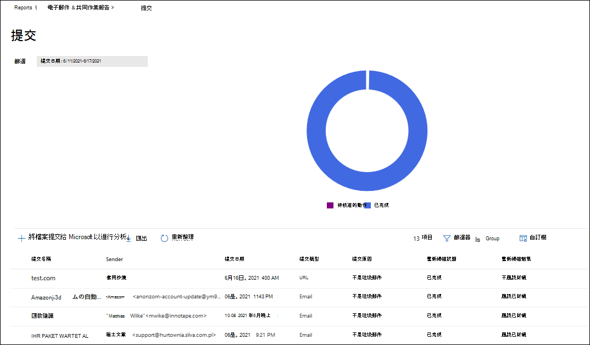

## 威脅防護狀態報告

「**威脅防護狀態**」報告適用于 EOP 和 Defender Office 365;不過，報告包含不同的資料。 例如，EOP 客戶可以查看在電子郵件中偵測到惡意程式碼的相關資訊，但不會[Safe SharePoint、OneDrive 及 Microsoft Teams 的附件](mdo-for-spo-odb-and-teams.md)所偵測到之惡意檔案的相關資訊。

該報告提供包含惡意內容的電子郵件統計，例如檔案或網站位址 (URLs 反惡意程式碼引擎封鎖的) 、[零小時的自動清除 (ZAP) ](zero-hour-auto-purge.md)，以及[在反網路釣魚原則中](set-up-anti-phishing-policies.md#exclusive-settings-in-anti-phishing-policies-in-microsoft-defender-for-office-365)Office 365[連結](safe-links.md)、 [Safe 附件](safe-attachments.md)和模擬保護功能等 Safe 功能。 您可以使用此資訊來識別趨勢，或判斷組織原則是否需要調整。

**附注：請** 務必瞭解，如果郵件傳送給五位收件者，我們會將其統計為五個不同的郵件，而不是一封郵件。

若要在 Microsoft 365 Defender 入口網站中查看報告，請移至 **Reports** \> **email & 協同** \> **電子郵件 &** 共同作業報告。 在 [ **電子郵件 & 協同報告** ] 頁面上，找出 **威脅防護狀態** ，然後按一下 [ **查看詳細資料**]。 若要直接前往報告，請開啟下列其中一個 URLs：

- Office 365 的 Defender：<https://security.microsoft.com/reports/TPSAggregateReportATP>
- EOP <https://security.microsoft.com/reports/TPSAggregateReport>

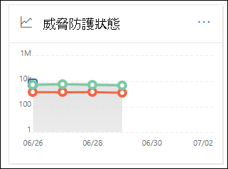

根據預設，圖表會顯示過去7天的資料。 如果您按一下 [**威脅防護狀態報表**] 頁面上的 [**篩選**]，您可以選取90天的日期範圍 (試用訂閱可能限制為30天) 。 [詳細資料] 表格允許篩選30天。

下列各節將說明可用的視圖。

### 依概覽查看資料

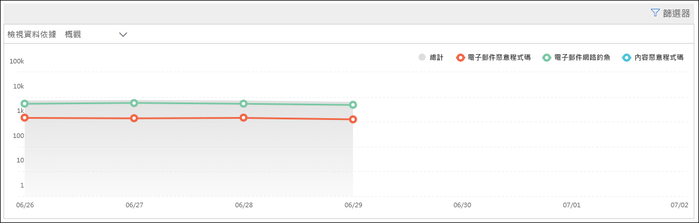

在 [ **依一覽查看資料** ] 視圖中，下列偵測資訊會顯示在圖表中：

- **電子郵件惡意程式碼**
- **電子郵件網路釣魚**
- **內容惡意程式碼**

圖表下沒有詳細資料表格可用。

如果您按一下 [ **篩選**]，則可以使用下列篩選器：

- **日期 (UTC)** **開始日期** 和 **結束日期**
- **偵測**：**電子郵件惡意** 代碼、**電子郵件網路釣魚** 或 **內容惡意** 代碼
- **受保護**： **MDO** (Office 365) 或 **EOP** 的 Defender
- **標記**：依已套用指定使用者標記的使用者或群組來篩選結果 (包含優先順序帳戶) 。 如需使用者標記的相關資訊，請參閱 [user tags](user-tags.md)。
- **方向**
- **網域**
- **原則類型**

當您完成設定篩選 **時，請按一下 [** 套用]、[ **取消**] 或 [ **清除篩選**]。

### 透過偵測技術透過電子郵件 \> 網路釣魚和圖表細目來查看資料

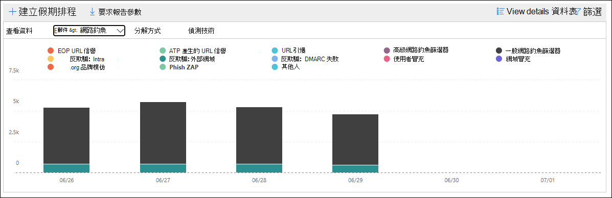

在 [透過 **電子郵件 \> 網路釣魚詐騙** ] 和 [ **依偵測方式顯示圖表明細] 技術** 視圖中，下列資訊會顯示在圖表中：

- **URL 惡意信譽** \* ：從其他 Microsoft 365 客戶的 Office 365 detonations 中的 Defender 產生惡意 URL 信譽。
- **Advanced filter**：以機器學習為基礎的網路釣魚信號。
- **一般篩選**：根據分析規則的網路釣魚信號。
- **組織內的欺騙**：寄件者嘗試欺騙收件者網域。
- **欺騙外部網域**：寄件者正嘗試哄騙其他一些網域。
- **哄騙 DMARC**：郵件上的 DMARC 驗證失敗。
- 模擬 **商標**：模擬以寄件者為基礎的知名品牌。
- **混合式分析偵測**
- **檔信譽**
- **指紋比對**
- **URL 引爆信譽**\*
- **URL 引爆**\*
- **類比使用者**\*
- **類比網域** \* ：模仿客戶擁有或定義的網域。
- **信箱智慧** 模擬 \* ：由系統管理員定義或透過信箱智慧學出的使用者類比。
- **檔引爆**\*
- **運動**\*

在圖表下方的 [詳細資料] 表格中，可使用下列資訊：

- **Date**
- **主旨**
- **Sender**
- **收件者**
- **偵測到**
- **傳遞狀態**
- **受損來源**
- **標記**

如果您按一下 [ **篩選**]，則可以使用下列篩選器：

- **日期 (UTC)** **開始日期** 和 **結束日期**
- **偵測**
- **受保護**： **MDO** (Office 365) 或 **EOP** 的 Defender
- **方向**
- **標記**：依已套用指定使用者標記的使用者或群組來篩選結果 (包含優先順序帳戶) 。 如需使用者標記的相關資訊，請參閱 [user tags](user-tags.md)。
- **網域**
- **原則類型**
- **原則名稱** (詳細資料] 表格) 
- **收件者**

當您完成設定篩選 **時，請按一下 [** 套用]、[ **取消**] 或 [ **清除篩選**]。

### 透過電子郵件 \> 惡意程式碼和偵測技術的圖表細目來查看資料

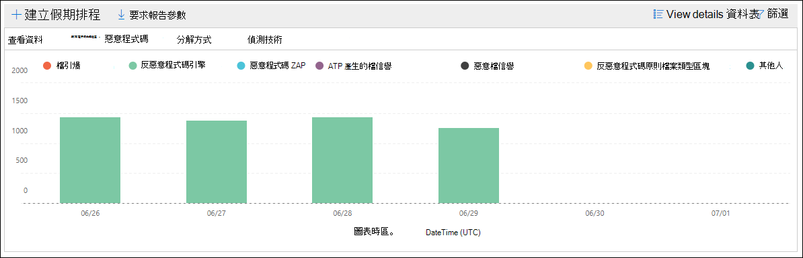

在 [透過 **電子郵件 \> 惡意** 代碼和 **依偵測方式顯示圖表的** 資料] 技術視圖中，下列資訊會顯示在圖表中：

- 檔案 **引爆** \* ： Safe 附件的偵測。
- 檔案 **引爆信譽** \* ：所有由 Defender 為 Office 365 detonations 所產生的惡意檔信譽。
- **檔信譽**
- **反惡意程式碼引擎** \* ：從反惡意程式碼引擎偵測。
- **反惡意程式碼原則檔案類型封鎖**：由於郵件中所識別的惡意檔案類型，郵件會篩選掉這些電子郵件。
- **URL 惡意信譽**
- **URL 引爆**
- **URL 引爆信譽**
- **行銷活動**

在圖表下方的 [詳細資料] 表格中，可使用下列資訊：

- **Date**
- **主旨**
- **Sender**
- **收件者**
- **偵測到**
- **傳遞狀態**
- **受損來源**
- **標記**

如果您按一下 [ **篩選**]，則可以使用下列篩選器：

- **日期 (UTC)** **開始日期** 和 **結束日期**
- **偵測**
- **受保護**： **MDO** (Office 365) 或 **EOP** 的 Defender
- **方向**
- **標記**：依已套用指定使用者標記的使用者或群組來篩選結果 (包含優先順序帳戶) 。 如需使用者標記的相關資訊，請參閱 [user tags](user-tags.md)。
- **網域**
- **原則類型**
- **原則名稱** (詳細資料] 表格) 
- **收件者**

當您完成設定篩選 **時，請按一下 [** 套用]、[ **取消**] 或 [ **清除篩選**]。

### 依電子郵件 \> 網路釣魚或透過電子郵件惡意程式碼查看資料的方式，依原則類型分類的圖表 \>

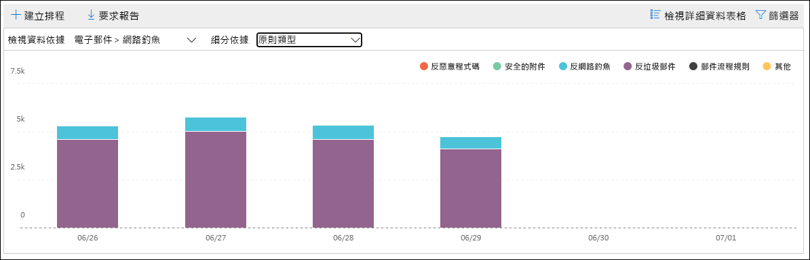

在 [ **依原則類型的圖表分解** ] 和 [透過電子郵件惡意程式碼 **查看資料 \>** ] 或 [透過 **電子郵件 \> 惡意程式碼查看資料** ] 視圖中，圖表會顯示下列資訊：

- **反惡意程式碼**
- **Safe附件**\*
- **反網路釣魚**
- **反垃圾郵件**
- **郵件流程規則** (也稱為傳輸規則) 
- **別人**

在圖表下方的 [詳細資料] 表格中，可使用下列資訊：

- **Date**
- **主旨**
- **Sender**
- **收件者**
- **偵測到**
- **傳遞狀態**
- **受損來源**
- **標記**

如果您按一下 [ **篩選**]，則可以使用下列篩選器：

- **日期 (UTC)** **開始日期** 和 **結束日期**
- **偵測**
- **受保護**： **MDO** (Office 365) 或 **EOP** 的 Defender
- **方向**
- **標記**：依已套用指定使用者標記的使用者或群組來篩選結果 (包含優先順序帳戶) 。 如需使用者標記的相關資訊，請參閱 [user tags](user-tags.md)。
- **網域**
- **原則類型**
- **原則名稱** (詳細資料] 表格) 
- **收件者**

當您完成設定篩選 **時，請按一下 [** 套用]、[ **取消**] 或 [ **清除篩選**]。

### 透過電子郵件 \> 網路釣魚或透過電子郵件惡意程式碼查看資料，依傳遞狀態與查看資料的圖表細目 \>

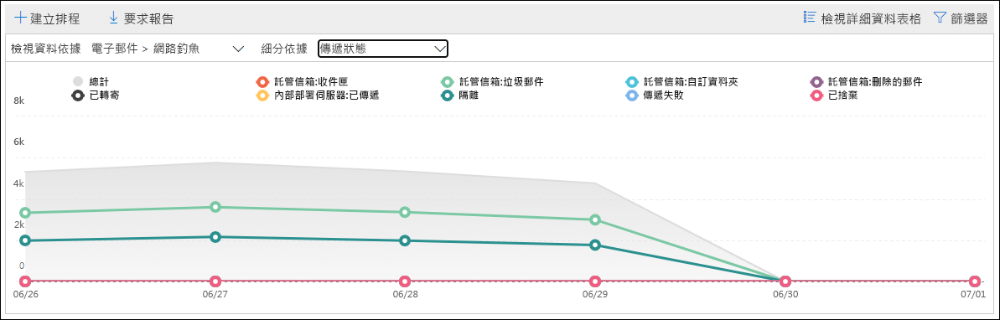

在 **圖表** 中透過 **電子郵件 \> 網路釣魚** 或透過電子郵件 **\> 惡意** 代碼查看資料來查看資料，圖表會顯示下列資訊：

- **主控信箱：收件匣**
- **主控信箱：垃圾郵件**
- **主控信箱：自訂資料夾**
- **主控信箱：刪除的郵件**
- **轉發**
- **內部部署伺服器：已傳送**
- **隔離區**
- **傳遞失敗**
- **下降**

在圖表下方的 [詳細資料] 表格中，可使用下列資訊：

- **Date**
- **主旨**
- **Sender**
- **收件者**
- **偵測到**
- **傳遞狀態**
- **受損來源**
- **標記**

如果您按一下 [ **篩選**]，則可以使用下列篩選器：

- **日期 (UTC)** **開始日期** 和 **結束日期**
- **偵測**
- **受保護**： **MDO** (Office 365) 或 **EOP** 的 Defender
- **方向**
- **標記**：依已套用指定使用者標記的使用者或群組來篩選結果 (包含優先順序帳戶) 。 如需使用者標記的相關資訊，請參閱 [user tags](user-tags.md)。
- **網域**
- **原則類型**
- **原則名稱** (詳細資料] 表格) 
- **收件者**

當您完成設定篩選 **時，請按一下 [** 套用]、[ **取消**] 或 [ **清除篩選**]。

### 依惡意程式碼查看資料 \>

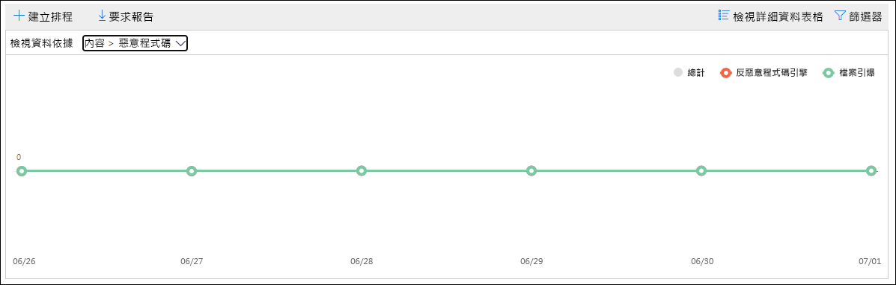

在 [**依內容 \> 惡意** 代碼查看資料] 視圖中，下列資訊會顯示在適用于 Office 365 組織的 Microsoft Defender 圖表中：

- **反惡意程式碼引擎**： [Microsoft 365 中內建的病毒偵測](virus-detection-in-spo.md)，在 Sharepoint、OneDrive 及 Microsoft Teams 中偵測到惡意檔案。
- 檔案 **引爆**： [Safe SharePoint、OneDrive 及 Microsoft Teams 的附件](mdo-for-spo-odb-and-teams.md)所偵測到的惡意檔案。

在圖表下方的 [詳細資料] 表格中，可使用下列資訊：

- **日期 (UTC)** **開始日期** 和 **結束日期**
- **位置**
- **偵測到**
- **惡意軟體名稱**

如果您按一下 [ **篩選**]，則可以使用下列篩選器：

- **日期 (UTC)** **開始日期** 和 **結束日期**
- **偵測**： **反惡意程式碼引擎** 或 **檔引爆**

當您完成設定篩選 **時，請按一下 [** 套用]、[ **取消**] 或 [ **清除篩選**]。

### 依系統覆寫查看資料

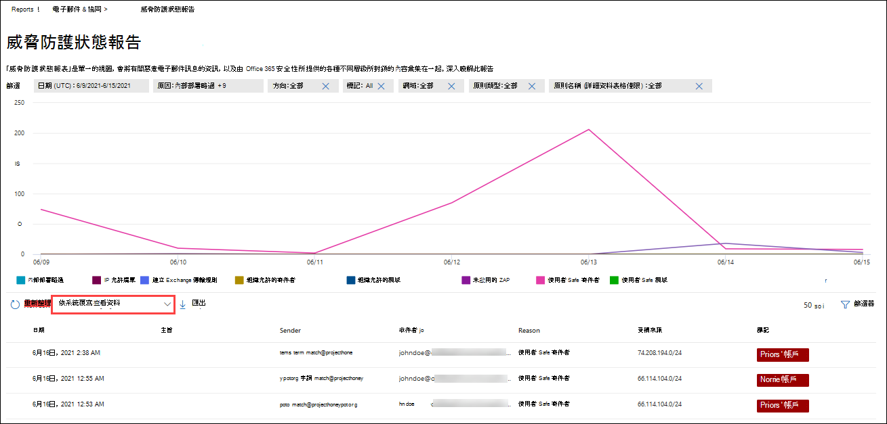

在 [ **依系統覆寫查看資料** ] 視圖中，下列的覆寫原因資訊會顯示在圖表中：

- **內部部署略過**
- **IP 允許**
- **Exchange 郵件傳輸規則** (郵件流程規則) 
- **組織允許的寄件者**
- **組織允許的網域**
- **未啟用的 ZAP**
- **未啟用垃圾郵件資料夾**
- **使用者 Safe 寄件者**
- **使用者 Safe 網域**

在圖表下方的 [詳細資料] 表格中，可使用下列資訊：

- **Date**
- **主旨**
- **Sender**
- **收件者**
- **偵測到**
- **傳遞狀態**
- **受損來源**
- **標記**

如果您按一下 [ **篩選**]，則可以使用下列篩選器：

- **日期 (UTC)** **開始日期** 和 **結束日期**
- **偵測**
- **受保護**： **MDO** (Office 365) 或 **EOP** 的 Defender
- **方向**
- **標記**：依已套用指定使用者標記的使用者或群組來篩選結果 (包含優先順序帳戶) 。 如需使用者標記的相關資訊，請參閱 [user tags](user-tags.md)。
- **網域**
- **原則類型**
- **原則名稱** (詳細資料] 表格) 
- **收件者**

當您完成設定篩選 **時，請按一下 [** 套用]、[ **取消**] 或 [ **清除篩選**]。

\*僅限 Office 365 的 Defender

## 主要惡意程式碼報告

**主要惡意** 代碼報告會顯示 [EOP 中的反惡意程式碼防護](anti-malware-protection.md)所偵測到的各種惡意程式碼。

若要在 Microsoft 365 Defender 入口網站中查看報告，請移至 **Reports** \> **email & 協同** \> **電子郵件 &** 共同作業報告。 在 [ **電子郵件 &** 共同作業報告] 頁面上，尋找 [ **主要惡意** 代碼]，然後按一下 [ **詳細資料**]。 若要直接前往報表，請開啟 <https://security.microsoft.com/reports/TopMalware> 。

當您將游標移到圓形圖中的楔形上方時，您可以看到惡意程式碼類型的名稱，以及偵測到該惡意程式碼的郵件數目。

在「 **主要惡意程式碼報告** 」頁面上，報表頁面上會顯示較大的餅版本圖表。圖表下方的 [詳細資料] 表格會顯示下列資訊：

- **主要惡意程式碼**
- **Count**

如果您按一下 [ **篩選**]，您可以指定具有 **開始日期** 和 **結束日期** 的日期範圍。

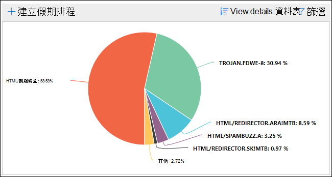

## URL 威脅防護報告

**URL 威脅防護報告** 只適用于 Office 365 的 Microsoft Defender。 如需詳細資訊，請參閱 [URL 威脅防護報告](view-reports-for-mdo.md#url-threat-protection-report)。

## 使用者報告的訊息報告

> [!IMPORTANT]
> 為了讓 **使用者報告的訊息** 報告正確運作，必須為您的 Microsoft 365 環境 **開啟審核記錄**。 這項工作通常是由在 Exchange Online 中獲派稽核記錄角色的人員完成。 如需詳細資訊，請參閱[開啟或關閉 Microsoft 365 審核記錄搜尋](../../compliance/turn-audit-log-search-on-or-off.md)。

「 **使用者報告的訊息** 報告」顯示使用者已使用 [報告郵件增益集](enable-the-report-message-add-in.md) 或 [報告網路釣魚增益集](enable-the-report-phish-add-in.md)舉報為垃圾郵件、網路釣魚企圖或良好郵件的相關資訊。

若要在 Microsoft 365 Defender 入口網站中查看報告，請移至 **Reports** \> **email & 協同** \> **電子郵件 &** 共同作業報告。 在 [ **電子郵件 &** 共同作業報告] 頁面上，找出 **使用者報告的訊息** ，然後按一下 [ **查看詳細資料**]。 若要直接前往報表，請開啟 <https://security.microsoft.com/reports/userSubmissionReport> 。 若要移至 [Microsoft 365 Defender 入口網站中的系統管理提交](admin-submission.md)，按一下 [**移至提交**]。

在 [ **使用者報告的郵件** ] 頁面上，您可以按一下 [ **篩選** ]，然後在出現的浮出控制項中，選取下列一或多個值，以篩選圖表和詳細資料表格：

- **報告日期**： **開始時間** 和 **結束時間**
- **報告者**
- **電子郵件主旨**
- **訊息報告識別碼**
- **網路消息識別碼**
- **Sender**
- **報告原因**
  - **非垃圾郵件**
  - **網路釣魚**
  - **垃圾郵件**
- **網路釣魚模擬**： **是** 或 **否**

當您完成設定篩選 **時，請按一下 [** 套用]、[ **取消**] 或 [ **清除篩選**]。

若要群組專案，請按一下 [ **群組** ]，然後從下拉式清單中選取下列其中一個值：

- **無**
- **原因**
- **Sender**
- **報告者**
- **重新掃描結果**
- **網路釣魚模擬模擬**

在圖形下方的 [詳細資料] 表格中，您可以看到下列詳細資料：

- **電子郵件主旨**
- **報告者**
- **報告日期**
- **Sender**
- **報告原因**
- **重新掃描結果**
- **標記**

若要將郵件提交給 Microsoft 進行分析，請選取表格中的訊息項目，按一下 [ **提交給 Microsoft 進行分析** ]，然後從下拉式清單中選取下列其中一個值：

- **報告清理**
- **報告網路釣魚**
- **報告惡意程式碼**
- **報告垃圾郵件**'
- Office 365) 的 **觸發調查** (Defender

## 查看這些報表所需的許可權為何？

為了查看和使用本文所述的報表，您必須是 Microsoft 365 Defender 入口網站中下列其中一個角色群組的成員：

- **組織管理**
- **安全性系統管理員**
- **安全性讀取者**
- **全域讀取器**

如需詳細資訊，請參閱[Microsoft 365 Defender 入口網站中的許可權](permissions-in-the-security-and-compliance-center.md)。

**附注**：將使用者新增至 Microsoft 365 系統管理中心中對應的 Azure Active Directory 角色，可為使用者提供 Microsoft 365 Defender 入口網站中的必要許可權 _，以及_ Microsoft 365 中其他功能的許可權。 如需詳細資訊，請參閱[關於系統管理員角色](../../admin/add-users/about-admin-roles.md)。

## 如果報告未顯示資料，該怎麼辦？

如果您未看到報表中的資料，請仔細檢查您的原則設定是否正確。 若要深入瞭解，請參閱 [防禦威脅](protect-against-threats.md)。

## 相關主題

[EOP 中的反垃圾郵件和反惡意程式碼保護](anti-spam-and-anti-malware-protection.md)

[Microsoft 365 Defender 入口網站中的智慧報告和洞察力](reports-and-insights-in-security-and-compliance.md)

[在 Microsoft 365 Defender 入口網站中查看郵件流程報告](view-mail-flow-reports.md)

[View Office 365 的 Defender 報告](view-reports-for-mdo.md)
