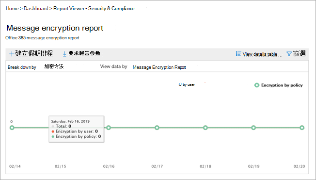
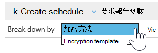
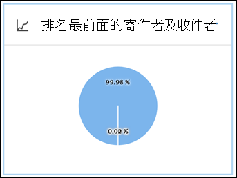

# 檢視安全性與合規性中心內的電子郵件安全性報告

[安全性 & 合規性中心](https://protection.office.com)提供各種報告，可協助您觀察電子郵件安全性功能（例如，反垃圾郵件、反惡意程式碼，以及 Microsoft 365 中的加密功能）如何保護您的組織。 如果您有[必要的許可權](#what-permissions-are-needed-to-view-these-reports)，您可以移至 [**報表** \> ]**儀表板**，在安全性 & 規範中心中查看這些報告。

您的電子郵件安全性報告包含下列專案：

- [URL 威脅防護報告](#url-threat-protection-report-new)（**新！**）
- [已遭破壞的使用者報告](#compromised-users-report)
- [加密報告](#encryption-report)
- [威脅防護狀態報告](#threat-protection-status-report)
- [惡意程式碼檢測報告](#malware-detections-report)
- [主要惡意程式碼報告](#top-malware-report)
- [主要寄件者和收件者報表](#top-senders-and-recipients-report)
- [欺騙偵測報告](#spoof-detections-report)
- [垃圾郵件偵測報告](#spam-detections-report)
- [傳送和接收的電子郵件報告](#sent-and-received-email-report)
- [使用者報告的訊息報告](#user-reported-messages-report)

## URL 威脅防護報告（**新！**）

具有下列專案的任何人都可以使用 URL 威脅防護報告：

- Exchange Online Protection*和*高級威脅防護附加元件（方案 1*或*計畫2）
- Microsoft 365 E5 訂閱

這是以「按一下中心」的報表，具有兩個匯總的視圖。

1. 第一個視圖是透過*url 按一下保護動作*，其重點是顯示使用者在租使用者中的 URL 按一下數目，以及按一下的結果。 A 按下會指出使用者已透過封鎖頁面按一下至惡意網站（這可以由系統管理員在安全連結原則中停用）。

2. 第二個 view 是*由應用程式按一下 URL*，它會顯示在目前支援安全連結的不同應用程式中，例如在電子郵件客戶程式或 Microsoft Word 中，URLs 按一下的數目。 兩個匯總視圖中的資料都會每4小時重新整理一次。

「URL 威脅防護」報告的詳細資料表格可提供租使用者內所有按一下作業的近乎即時的視圖，其中包含諸如使用者*名稱*、 *URL*、*網路訊息識別碼*（如果 URL 已按一下電子郵件）的調查資訊，以及其他重要資訊，以供調查和分析使用。

根據預設，報告只會顯示由安全連結所封鎖 URLs 所按一下的資料，但也可以查看所有 URL 按一下的資訊，在篩選器中選取 [*允許的 URLs* ] 核取方塊。

如果已套用安全連結原則的使用者已選取 [*不追蹤使用者點擊*] 選項，則此報告將不會有按一下的資料。

## 已遭破壞的使用者報告

這份報告可供任何使用 Exchange Online Protection 的使用者，顯示標示為可疑或受限制使用者的使用者帳戶數目，當帳戶進入指出使用者帳戶可能有問題或甚至遭到破壞的狀態時，資料特別有用。 在經常使用的情況下，已遭破壞的使用者報告可以發現具有可疑或限制狀態之帳戶中的波峰峰值，甚至是趨勢，也就是您租使用者的安全性和 wellness 可能會發生問題。

## 加密報告

**加密報告**會顯示已加密之電子郵件的相關資訊，不論是透過您組織的原則或透過使用者控制項。 組織的安全小組可以使用此報告中的資訊來識別模式，並主動套用或調整敏感電子郵件訊息的原則。

若要查看此報告，請在安全性 & 合規性中心，移至 [**報告** \> **] 儀表板** \> **加密報告**。

當報表第一次開啟時，您會看到過去七（7）天內，電子郵件所使用之加密方法的資料。 您可以按一下螢幕右上角的 [**篩選器**]，以變更日期範圍及顯示在報告中的詳細資料。

您也可以使用 [**分解者**] 功能表，透過加密範本（或方法）來查看資料。

而且，您可以使用 [ **view data by** ] 功能表，將 view 改為查看前5位收件者網域的加密郵件計數。

使用新加密報告的彈性，您可以查看趨勢並採取適當的動作。 例如，如果您看到大量的電子郵件是由使用者加密，您可能會想要新增加密原則，以自動化某些使用案例的加密。 （若要取得此相關說明，請參閱[定義郵件流程規則，以加密 Microsoft 365 中的電子郵件](../../compliance/define-mail-flow-rules-to-encrypt-email.md)。）在另一個範例中，如果您有許多可供使用的加密範本，但沒有人正在使用這些範本，則可以考察使用者是否需要對該功能進行訓練。

使用此報告可讓貴組織的安全性與合規性小組監視郵件加密的使用方式，以及是否需要進一步的動作。 若要深入瞭解加密，請參閱[Microsoft 365 中的電子郵件加密](../../compliance/email-encryption.md)。

## 威脅防護狀態報告

「**威脅防護狀態**報告」是一個智慧報告，顯示 Exchange Online Protection 偵測到並封鎖的惡意電子郵件。 此報告可用於查看識別為惡意程式碼的電子郵件，或一段時間內的網路釣魚企圖（最多90天），並可讓安全性管理員識別趨勢或判斷是否需要調整原則。

> [!NOTE]
> 具有[Office 365 ATP](https://docs.microsoft.com/microsoft-365/security/office-365-security/office-365-atp)或[Exchange Online Protection](https://docs.microsoft.com/microsoft-365/security/office-365-security/what-is-eop) （EOP）的客戶可以使用威脅防護狀態報表;不過，針對 ATP 客戶顯示在威脅防護狀態報表中的資訊，其可能會包含與客戶可能看到的 EOP 不同的資料。 例如，EOP 客戶可以查看在電子郵件中偵測到惡意程式碼的相關資訊，但不是[在 SharePoint Online、OneDrive 或 Microsoft 小組中偵測到的惡意](https://docs.microsoft.com/microsoft-365/security/office-365-security/atp-for-spo-odb-and-teams)檔案資訊，也就是 ATP 特有的功能。 （[深入瞭解 ATP 報告](https://docs.microsoft.com/microsoft-365/security/office-365-security/view-reports-for-atp)。）

若要查看此報告，請在[安全性 & 合規性中心](https://protection.office.com)，移至 [**報告** \> ]**儀表板** \> **威脅防護狀態**。

當您第一次開啟威脅防護狀態報表時，報告預設會顯示過去7天的資料。不過，您可以按一下 [**篩選**]，然後在 [最多90天] 的 [詳細資料] 中變更日期範圍。 （如果您是使用試用訂閱，則可能會限制為30天的資料。）

此報告可用於查看組織的[Exchange Online Protection 功能](https://docs.microsoft.com/microsoft-365/security/office-365-security/eop-features)和長期趨勢分析的效能與影響。

您也可以選擇是否要針對識別為惡意的電子郵件、識別為網路釣魚企圖的電子郵件，或是識別為包含惡意程式碼的電子郵件，來查看資料。

## 惡意程式碼檢測報告

**惡意軟體**偵測報告會顯示偵測到包含組織之惡意程式碼的傳入和傳出郵件數目。

若要查看此報告，請在 [[安全性 & 規範中心](https://protection.office.com)] 中，移至 [**報告** \> **] 儀表板** \> **惡意**代碼偵測。

與其他報告類似于「[威脅防護狀態」報告](#threat-protection-status-report)，報表預設會顯示過去7天的資料。 不過，您可以選擇 [**篩選**] 以變更日期範圍。

## 主要惡意程式碼報告

**主要惡意**代碼報告會顯示[Exchange Online](https://docs.microsoft.com/microsoft-365/security/office-365-security/eop-features)偵測到的各種惡意程式碼。

若要查看此報告，請在[安全性 & 合規性中心](https://protection.office.com)，移至 [**報告** \> ]**儀表板** \>的**主要惡意**代碼。

當您將游標移到圓形圖中的楔形上方時，您可以看到惡意程式碼類型的名稱，以及偵測到該惡意程式碼的郵件數目。

按一下（或點擊）報表，以在新的瀏覽器視窗中開啟它，您可以在其中取得更詳細的報表檢視。

在圖表下方，您會看到偵測到的惡意程式碼，以及偵測到該惡意程式碼的郵件數目。

## 主要寄件者和收件者報表

「**主要寄件者與收件**者」報告是顯示您主要電子郵件寄件者的餅形圖。

若要查看此報告，請在 [[安全性 & 規範中心](https://protection.office.com)] 中，移至 [**報告** \> **] 儀表板** \>的**頁首和收件**者。

當您將游標移到圓形圖中的楔形上方時，您可以看到所傳送或接收的郵件計數。

按一下（或點擊）報表，以在新的瀏覽器視窗中開啟它，您可以在其中取得更詳細的報表檢視。

使用 [**顯示資料**] 清單，選擇是否要查看主要寄件者、接收器、垃圾郵件收件者和惡意程式碼收件者的資料。 您也可以查看[Exchange Online Protection](https://docs.microsoft.com/microsoft-365/security/office-365-security/what-is-eop)已偵測到的惡意程式碼。

![使用 [顯示資料] 清單查看特定資訊](../../media/bd91449f-7d42-4749-8666-7b44044049b8.png)

在圖表下方，您會看到最上層的電子郵件寄件者或收件者，以及指定時間週期內傳送或接收的郵件數目。

## 欺騙偵測報告

「**欺騙**偵測報告」會顯示偵測到的電子郵件訊息數量，以及那些被視為「良好」（由於正當商務理由而完成的電子郵件）。

若要查看此報告，請在[安全性 & 合規性中心](https://protection.office.com)，移至 [**報告** \> ]**儀表板** \> **冒名郵件**。

![在安全性 & 規範中心內，移至 [ \>報告\> ] 儀表板冒名郵件](../../media/0427e85c-9e40-4225-a0f0-e21a4e8b0e44.png)

當您將游標移到圖表中的某一天時，您可以看到有多少偽造的電子郵件訊息。

按一下（或點擊）報表，以在新的瀏覽器視窗中開啟它，您可以在其中取得更詳細的報表檢視。 若要深入瞭解反欺騙保護，請參閱[Microsoft 365 中的反欺騙保護](anti-spoofing-protection.md)。

## 垃圾郵件偵測報告

**垃圾郵件**偵測報告會顯示 Exchange Online 所封鎖的所有垃圾郵件內容。 郵件會依每封郵件計算，而非每個收件者。 例如，如果電子郵件訊息傳送至您組織中的100收件者，則會將它計為一封郵件。

若要查看此報告，請在 [[安全性 & 規範中心](https://protection.office.com)] 中，移至 [**報告** \> **] 儀表板** \> **垃圾郵件**偵測。

![若要查看此報告，請在安全性 & 合規性中心，移\>至\> [報告] 儀表板 EOP 垃圾郵件偵測](../../media/028cff3c-79ce-4ec0-8f0f-ec32ac28243a.png)

當您將游標移到圖表中的某一天時，您可以查看該天已封鎖的專案數，以及這些專案的分類方式。 例如，您可以查看已篩選的垃圾郵件數目，以及來自封鎖的網際網路通訊協定（IP）位址的專案數目。

按一下（或點擊）報表，以在新的瀏覽器視窗中開啟它，您可以在其中取得更詳細的報表檢視。

在圖表下方，您會看到偵測到的垃圾郵件專案清單。 選取專案以查看其他資訊，例如垃圾郵件專案為輸入或輸出、郵件識別碼及收件者。 若要深入瞭解反垃圾郵件保護，請參閱[Office 365 電子郵件反垃圾郵件保護](https://docs.microsoft.com/microsoft-365/security/office-365-security/anti-spam-and-anti-malware-protection)。

## 傳送和接收的電子郵件報告

「**傳送及接收的電子郵件**報告」是一個智慧報告，顯示傳入和傳出電子郵件的相關資訊，包括垃圾郵件偵測、惡意程式碼，以及識別為「良好」的電子郵件。

若要查看此報告，請在[安全性 & 合規性中心](https://protection.office.com)，移至 [**報告** \> ]**儀表板** \> **傳送和接收的電子郵件**。

![若要查看此報告，請在安全性 & 合規性中心，移\>至\> [報告] 儀表板傳送和接收的電子郵件](../../media/0e710ed0-1b0e-4dac-8796-94a01a710f3a.png)

當您將游標移到圖表中的某一天時，您就可以看到已有多少封郵件，以及這些郵件的分類方式。 例如，您可以查看偵測到包含惡意程式碼的郵件數目，以及識別為垃圾郵件的數目。

按一下（或點擊）報表，以在新的瀏覽器視窗中開啟它，您可以在其中取得更詳細的報表檢視。

您可以使用 [**分解依據**] 清單，依類型或依方向（內送和外送）來查看資訊。

![使用 [分解依據] 清單，依類型或方向查看資訊](../../media/a5b30c94-d75f-4bfc-851a-cb155685b177.png)

在圖表下方，您會看到一個電子郵件類別清單，例如 [ **GoodMail**]、[ **SpamContentFiltered**] 等等。 選取類別以查看其他資訊，例如針對惡意程式碼採取的動作，以及電子郵件是傳入或傳出。

若要深入瞭解電子郵件智慧，請參閱[郵件流程智慧中的 Microsoft 365](https://docs.microsoft.com/microsoft-365/security/office-365-security/mail-flow-intelligence-in-office-365)。

## 使用者報告的訊息報告

「**使用者報告的訊息**報告」顯示使用者已使用[報告郵件增益集](https://docs.microsoft.com/microsoft-365/security/office-365-security/enable-the-report-message-add-in)舉報為垃圾郵件、網路釣魚企圖或良好郵件的電子郵件資訊。

詳細資料可用於每封郵件，包括傳遞原因、為您的組織設定的垃圾郵件原則例外狀況或郵件流程規則。 若要查看詳細資料，請選取 [使用者報告] 清單中的專案，然後查看 [**摘要**] 和 [**詳細資料**] 索引標籤上的資訊。

若要查看此報告，請在 [[安全性 & 規範中心](https://protection.office.com)] 中，執行下列其中一項操作：

- 移至**威脅管理** \> **儀表板** \> **使用者報告的郵件**。

- 移至**威脅管理** \> **檢查** \> **使用者報告的郵件**。

![在 [安全性 & 規範中心] 中，選擇\> [ \>威脅管理] [使用者報告的郵件]](../../media/e372c57c-1414-4616-957b-bc933b8c8711.png)

> [!IMPORTANT]
> 為了讓使用者報告的郵件報告正確運作，您必須為您的 Office 365 環境**開啟審核記錄**。 這項工作通常是由在 Exchange Online 中獲派稽核記錄角色的人員完成。 如需詳細資訊，請參閱[開啟或關閉 Microsoft 365 審核記錄搜尋](https://docs.microsoft.com/microsoft-365/compliance/turn-audit-log-search-on-or-off)。

## 查看這些報表所需的許可權為何？

若要查看和使用本文所述的報表，**您必須同時為安全性 & 規範中心和 Exchange 系統管理中心指派適當的角色**。

- 針對安全性 & 合規性中心，您必須已指派下列角色之一：

  -組織管理-安全性系統管理員（可以在 Azure Active Directory 系統管理中心中指派[https://aad.portal.azure.com](https://aad.portal.azure.com)）-安全性讀取器

- 針對 Exchange Online，您必須在 Exchange 系統管理中心 ([https://outlook.office365.com/ecp](https://outlook.office365.com/ecp)) 或 PowerShell Cmdlet (請參閱 [Exchange Online PowerShell](https://docs.microsoft.com/powershell/exchange/exchange-online/exchange-online-powershell?view=exchange-ps)) 受指派下列其中一個角色：

  -組織管理-僅限查看組織管理-View-Only 收件者角色相容性管理

若要深入了解，請參閱下列資源：

- [安全性與合規性中心的權限](https://docs.microsoft.com/microsoft-365/security/office-365-security/permissions-in-the-security-and-compliance-center)
 
- [Exchange Online 中的功能權限](https://docs.microsoft.com/exchange/permissions-exo/feature-permissions)

## 如果報告未顯示資料，該怎麼辦？

如果您未看到報表中的資料，請仔細檢查您的原則設定是否正確。 若要深入瞭解，請參閱[防範 Microsoft 365 中的威脅](https://docs.microsoft.com/microsoft-365/security/office-365-security/protect-against-threats)。

## 相關主題

[Microsoft 365 電子郵件 Anti-Spam 保護](https://docs.microsoft.com/microsoft-365/security/office-365-security/anti-spam-and-anti-malware-protection)

[安全性 & 規範中心內的報告和洞察力](https://docs.microsoft.com/microsoft-365/security/office-365-security/reports-and-insights-in-security-and-compliance)

[在安全性 & 規範中心建立報表的排程](https://docs.microsoft.com/microsoft-365/security/office-365-security/create-a-schedule-for-a-report)

[在安全性 & 規範中心內設定及下載自訂報告](https://docs.microsoft.com/microsoft-365/security/office-365-security/set-up-and-download-a-custom-report)