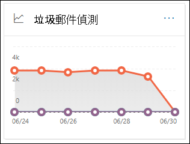

# 檢視安全性與合規性中心內的電子郵件安全性報告

[安全性 & 合規性中心](https://protection.office.com)提供各種報告，可協助您觀察電子郵件安全性功能（例如，反垃圾郵件、反惡意程式碼，以及 Microsoft 365 中的加密功能）如何保護您的組織。 如果您有[必要的許可權](#what-permissions-are-needed-to-view-these-reports)，您可以移至 [**報表**] \> **儀表板**，在安全性 & 規範中心中查看這些報告。 若要直接移至 [報告] 儀表板，請開啟] <https://protection.office.com/insightdashboard> 。

## 已遭破壞的使用者報告

> [!NOTE]
> 這份報告可在 Microsoft 365 組織中使用 Exchange Online 信箱。 在沒有 Exchange Online 信箱的獨立 Exchange Online Protection （EOP）組織中無法使用此功能。

「已**遭破壞的使用者**報告」顯示顯示過去7天內已標示為**可疑**或**限制**的使用者帳戶數目。 在上述任一狀態的帳戶都有問題或甚至遭到破壞。 在經常使用的情況下，您可以使用報表來找出峰值，甚至是趨勢，也就是可疑或受限制的帳戶。 如需遭到破壞之使用者的詳細資訊，請參閱[回應遭到破壞的電子郵件帳戶](responding-to-a-compromised-email-account.md)。

匯總視圖會顯示過去90天的資料，詳細資料檢視會顯示過去30天的資料。

若要查看報告，請開啟[安全性 & 規範中心](https://protection.office.com)，移至 [**報告**] \> **儀表板**，然後選取 [已**遭破壞的使用者**]。 若要直接前往報表，請開啟 <https://protection.office.com/reportv2?id=CompromisedUsers> 。

您可以按一下 [**篩選**] 並選取下列其中一個或多個值，以篩選圖表和詳細資料表格：

- **開始日期**和**結束日期**

- **可疑**：使用者帳戶已傳送可疑的電子郵件，而且受到限制傳送電子郵件的風險。

- **限制**：由於高度可疑的模式，使用者帳戶已限制傳送電子郵件。

如果您按一下 [**查看詳細資料] 表格**，您可以看到下列詳細資料：

- **建立時間**
- **User ID**
- **Action**

若要回到報表檢視，請按一下 [**查看報告**]。

## 加密報告

**加密報告**可用於 EOP （不含 exchange online 信箱的 exchange online 或獨立 EOP 中的訂閱）。 組織的安全小組可以使用此報告中的資訊來識別模式，並主動套用或調整敏感電子郵件訊息的原則。 例如：

- 如果您看到大量的電子郵件是由使用者加密，您可能會想要新增加密原則，以自動化某些使用案例的加密。 如需詳細資訊，請參閱[定義郵件流程規則，以加密 Microsoft 365 中的電子郵件訊息](../../compliance/define-mail-flow-rules-to-encrypt-email.md)。

- 如果您有許多可供使用的加密範本，但沒有人正在使用這些範本，您可能會探索使用者是否需要功能訓練。

匯總視圖允許篩選過去90天，而詳細資料檢視允許篩選10天。

若要查看報告，請開啟[安全性 & 規範中心](https://protection.office.com)，移至 [**報告**] \> **儀表板**，然後選取 [**加密報告**]。 若要直接前往報表，請開啟 <https://protection.office.com/reportv2?id=EncryptionReport> 。

若要深入瞭解加密，請參閱[Microsoft 365 中的電子郵件加密](../../compliance/email-encryption.md)。

### 加密報告的報表檢視

您可以在圖表上使用下列篩選：

- **查看資料：郵件加密報告**和**分解方式：加密方法**：下列為可用的加密方法：

  - **使用者加密**
  - **依原則加密**

  如果您按一下 [**篩選**]，您可以使用下列篩選器修改此圖表：

  - **開始日期**和**結束日期**
  - 加密方法。
  - 加密範本。

- **查看資料：郵件加密報告**和**分解方式：加密範本**：下列為可供使用的加密方法：

  - **請勿轉寄**
  - **只加密**
  - **OME 先前版本**
  - **自訂**

  如果您按一下 [**篩選**]，您可以使用下列篩選器修改此圖表：

  - **開始日期**和**結束日期**
  - 加密方法
  - 加密範本

- **查看資料：前5位收件者網域**：此視圖會顯示圓形圖，其中包含前5位收件者網域的已傳送郵件計數。

  如果您按一下 [**篩選**]，您可以選取 [**開始日期**] 和 [**結束日期**]。

### 加密報告的詳細資料表格視圖

如果您按一下 [**查看詳細資料] 表格**，顯示的資訊將取決於您所查看的圖表：

- **逐項換行：** 加密**範本：加密範本**：下列會顯示下列資訊：

  - **Date**
  - **寄件者位址**
  - **加密範本**
  - **加密方法**
  - **收件者位址**
  - **主旨**

- **資料查看依據：前5位收件者網域**：

  - **Date**
  - **收件者網域**
  - **訊息計數**
  
如果您按一下 [詳細資料] 表格視圖中的 [**篩選**]，您可以使用下列篩選器修改結果：

- **開始日期**和**結束日期**
- 加密方法
- 加密範本

若要回到報表檢視，請按一下 [**查看報告**]。

## 郵件流程狀態報表

**郵件流程狀態報表**包含惡意程式碼、垃圾郵件、網路釣魚和 edge 封鎖郵件的相關資訊。 如需詳細資訊，請參閱[郵件流程 status report](view-mail-flow-reports.md#mailflow-status-report)。

## 電子郵件中的惡意程式碼偵測報告

[**電子郵件中的惡意**代碼偵測] 報告會顯示傳入和傳出電子郵件（Exchange Online PROTECTION 或 EOP 偵測到的惡意程式碼）中的惡意程式碼偵測的相關資訊。 如需 EOP 中惡意程式碼保護的詳細資訊，請參閱[EOP 中的反惡意程式碼保護](anti-malware-protection.md)。

 匯總 view 篩選允許90天，而 [詳細資料表格篩選] 只允許10天。

若要查看報告，請開啟[安全性 & 規範中心](https://protection.office.com)，移至 [**報告**] \> **儀表板**，然後**在電子郵件中選取惡意**代碼偵測。 若要直接前往報表，請開啟 <https://protection.office.com/reportv2?id=MalwareDetections> 。

![在 [報告] 儀表板的電子郵件小工具中偵測惡意程式碼](../../media/malware-detections-widget.png)

您可以按一下 [**篩選**] 並選取 [篩選]，以篩選圖表和詳細資料表格：

- **開始日期**和**結束日期**
- **入境**
- **出境**

如果您按一下 [**查看詳細資料] 表格**，您可以看到下列詳細資料：

- **Date**
- **寄件者位址**
- **收件者位址**
- **郵件識別碼**
- **主旨**
- **Filename**
- **惡意軟體名稱**

若要回到報表檢視，請按一下 [**查看報告**]。

## 傳送和接收的電子郵件報告

**傳送和接收的電子郵件**報告包含惡意程式碼、垃圾郵件、郵件流程規則（也稱為傳輸規則）的相關資訊，以及電子郵件進入服務後的高級惡意軟體偵測。 如需詳細資訊，請參閱[送出和接收的電子郵件報告](view-mail-flow-reports.md#sent-and-received-email-report)。

## 垃圾郵件偵測報告

**垃圾郵件**偵測報告會顯示由 EOP 封鎖的垃圾電子郵件。 郵件會個別計算，而不是每個收件者。 例如，如果相同的垃圾郵件已傳送給組織中的100收件者，則會算作一封郵件。

匯總視圖允許90天篩選，而詳細資料表格允許10天的篩選。

若要查看報告，請開啟[安全性 & 規範中心](https://protection.office.com)，移至 [**報告**] \> **儀表板**，然後選取 [**垃圾郵件**偵測]。 若要直接前往報表，請開啟 <https://protection.office.com/reportv2?id=SpamDetections> 。

如需反垃圾郵件保護的詳細資訊，請參閱[EOP 中的反垃圾郵件保護](anti-spam-protection.md)。

### 垃圾郵件偵測報告的報表檢視

報表檢視提供下列圖表：

- **分解方式：動作**：會顯示下列事件種類：

  - **篩選的垃圾郵件內容**
  - **垃圾郵件 IP 封鎖**
  - **垃圾郵件信封封鎖**
  - **垃圾郵件 DBEB 篩選**：以目錄為基礎的邊緣封鎖（DBEB）

  當您將游標移到圖表中的某一天（資料點）時，您可以查看該天已封鎖的專案數，以及這些專案的分類方式。

  

- **分解方式：方向**：下列方向如下：

  - **入境**
  - **出境**

  

如果您按一下報表檢視中的**篩選器**，您可以使用下列篩選器修改結果：

- **開始日期**和**結束日期**
- 方向值
- 事件種類值

### 垃圾郵件偵測報告的詳細資料表格視圖

如果您按一下任何報表檢視中的 [**查看詳細資料] 表格**，會顯示下列資訊：

- **Date**
- **寄件者位址**
- **收件者位址**
- **事件類型**
- **Action**
- **主旨**

如果您按一下 [詳細資料] 表格中的 [**篩選**]，您可以使用下列篩選器修改結果：

- **開始日期**和**結束日期**
- 方向值
- 事件種類值

若要回到報表檢視，請按一下 [**查看報告**]。

## 欺騙偵測報告

「**欺騙**偵測報告」會顯示偵測到的電子郵件訊息數量，以及那些被視為「良好」（由於正當商務理由而完成的電子郵件）。 如需有關電子欺騙的詳細資訊，請參閱[EOP 中的反欺騙防護](anti-spoofing-protection.md)。

報表的匯總視圖允許90天的篩選，而詳細資料檢視只允許10天的篩選。

若要查看報告，請開啟[安全性 & 規範中心](https://protection.office.com)，移至 [**報告**] \> **儀表板**，然後選取 [**偽造**偵測]。 若要直接前往報表，請開啟 <https://protection.office.com/reportv2?id=SpoofMailReport> 。

當您將游標移到圖表中的某一天（資料點）時，您可以看到有多少偽造的電子郵件訊息。

您可以按一下 [**篩選**] 並選取下列其中一個或多個值，以篩選圖表和詳細資料表格：

- **開始日期**和**結束日期**

- **良好的郵件**

- **視為垃圾郵件**

如果您按一下 [**查看詳細資料] 表格**，您可以看到下列詳細資料：

- **Date**
- **欺騙寄件者**
- **True 寄件者**
- **寄件者 IP**
- **Action**
- **訊息計數**

若要回到報表檢視，請按一下 [**查看報告**]。

## 威脅防護狀態報表

「**威脅防護狀態**」報告可用於 EOP 和 OFFICE 365 ATP;不過，報告包含不同的資料。 例如，EOP 客戶可以查看在電子郵件中偵測到惡意程式碼的相關資訊，但不會[發現 SharePoint 線上、OneDrive 或 Microsoft 小組中偵測到之惡意](atp-for-spo-odb-and-teams.md)檔案的相關資訊。 如需有關 Office 365 ATP 報告的詳細資訊，請參閱[View reports For office 365 Advanced 威脅 Protection](view-reports-for-atp.md)。

這是一個智慧報告，顯示偵測到並封鎖的惡意電子郵件，並可讓安全性管理員識別趨勢或判斷組織原則是否需要調整。

若要查看報告，請開啟[安全性 & 合規性中心](https://protection.office.com)，移至 [**報告**] \> **儀表板**，然後選取 [**威脅防護狀態**]。 若要直接前往報表，請開啟 <https://protection.office.com/reportv2?id=ATPV2AggregateReport> 。

根據預設，圖表會顯示過去7天的資料。 如果您按一下 [**篩選**]，您可以選取90天的日期範圍（試用訂閱可能限制為30天）。 [詳細資料] 表格視圖允許篩選30天。

### 威脅防護狀態報表的報表檢視

可供使用的視圖如下：

- **資料查看方式：概述**：以下是顯示的偵測資訊：

  - **電子郵件惡意程式碼**
  - **電子郵件網路釣魚**
  - **內容惡意程式碼**

  

- **資料查看方式：內容 \>惡意軟體**1：針對 Office 365 ATP 組織顯示下列資訊：

  - **反惡意程式碼引擎**
  - **檔引爆**

  

- **分解方式：偵測技術**和**查看資料：電子郵件網路釣魚：電子郵件 \> 網路釣魚**：下列資訊會顯示：

  - **ATP-產生的 URL 信譽**1
  - **高級網路釣魚篩選器**
  - **反欺騙： DMARC 失敗**
  - **反欺騙：組織內**
  - **反欺騙：外部網域**
  - **品牌模仿**
  - **網域**模擬1
  - **EOP URL 信譽**
  - **一般網路釣魚篩選器**
  - **別人**
  - **網路釣魚 ZAP**2
  - **URL 引爆**1
  - **使用者**模擬1

  

- **分解方式：偵測技術**和**View Data：電子郵件 \> 惡意**代碼：會顯示下列資訊：

  - **ATP-產生的檔信譽**1
  - **反惡意程式碼引擎**1
  - **反惡意程式碼原則檔案類型區塊**
  - **File 引爆**1
  - **惡意檔信譽**
  - **惡意程式碼 ZAP**2
  - **別人**

  

- **分解方式：原則類型**和**view data \> ** by：電子郵件惡意程式碼：**電子郵件 \> 惡意**代碼：下列是顯示下列資訊：

  - **反惡意程式碼**
  - **安全附件**1
  - **反網路釣魚**
  - **反垃圾郵件**
  - **郵件流程規則**（也稱為傳輸規則）
  - **別人**

  

- **分解方式：傳遞狀態**和查看資料：電子郵件的** \> 網路釣魚詐騙**或**view data：電子郵件 \> 惡意**代碼：會顯示下列資訊：

  - **傳遞失敗**
  - **下降**
  - **轉發**
  - **主控信箱：自訂資料夾**
  - **主控信箱：刪除的郵件**
  - **主控信箱：收件匣**
  - **主控信箱：垃圾郵件**
  - **內部部署伺服器：已傳送**
  - **隔離區**

  

僅限1個 OFFICE 365 ATP

2個零小時自動清除（ZAP）在獨立 EOP 中無法使用（它只適用于 Exchange Online 信箱）。

如果您按一下 [**篩選**]，您可以使用下列篩選器修改報告：

- **開始日期**和**結束日期**
- 偵測值
- **受保護者**（僅限 OFFICE 365 ATP）： **ATP**或**EOP**。 請注意，View 資料中無法使用這種可篩選的屬性 **：內容 \> 惡意程式碼**。

### 威脅防護狀態報表的詳細資料表格視圖

如果您按一下 [**查看詳細資料] 表格**，顯示的資訊將取決於您所查看的圖表：

- **資料查看方式：內容 \>惡意**代碼：

  - **Date**
  - **位置**
  - **導向者**
  - **惡意軟體名稱**

- **資料查看方式：一覽**：沒有可用的**視圖詳細資料表格**按鈕。

- 所有其他圖表：

  - **Date**
  - **主旨**
  - **Sender**
  - **收件者**
  - **偵測到**
  - **傳遞狀態**
  - **受損來源**

如果您按一下 [**篩選**]，您可以使用下列篩選器修改報告：

- **開始日期**和**結束日期**
- 偵測值
- **受保護者**（僅限 OFFICE 365 ATP）： **ATP**或**EOP**。 請注意，View 資料中無法使用這種可篩選的屬性 **：內容 \> 惡意程式碼**。

## 主要惡意程式碼報告

**主要惡意**代碼報告會顯示[EOP 中的反惡意程式碼防護](anti-malware-protection.md)所偵測到的各種惡意程式碼。

若要查看報告，請開啟[安全性 & 規範中心](https://protection.office.com)，移至 [**報告**] \> **儀表板**，然後選取 [**主要惡意**代碼]。 若要直接前往報表，請開啟 <https://protection.office.com/reportv2?id=TopMalware> 。

當您將游標移到圓形圖中的楔形上方時，您可以看到惡意程式碼類型的名稱，以及偵測到該惡意程式碼的郵件數目。

如果您按一下 [**查看詳細資料] 表格**，您可以看到下列詳細資料：

- **主要惡意程式碼**
- **Count**

如果您按一下 [報表檢視] 或 [詳細資料表格] 視圖中的 [**篩選**]，您可以指定具有**開始日期**和**結束日期**的日期範圍。

## URL 威脅防護報告

> [!NOTE]
> 這個報告只適用于 Office 365 高級威脅防護（ATP）。 例如，Microsoft 365 E5 訂閱，或 ATP Plan 1 或 ATP Plan 2 附加元件。

**Url 威脅防護報告**可提供偵測威脅的摘要和趨勢視圖，以及在 URL 按一下上進行的動作，做為[ATP 安全連結](atp-safe-links.md)的一部分。 若已套用安全連結原則的使用者沒有選取 [不**追蹤使用者點擊**] 選項，則此報告將不會有按一下其資料的使用者。

若要查看報告，請開啟[安全性 & 規範中心](https://protection.office.com)，移至 [**報告**] \> **儀表板**，然後選取 [ **URL 保護**]。 若要直接前往報表，請開啟 <https://protection.office.com/reportv2?id=URLProtectionActionReport> 。

### URL 威脅防護報告的報表檢視

**URL 威脅防護**報告有兩個匯總的視圖，每四個小時都會重新整理一次，以顯示過去90天的資料：

- **URL 按一下保護動作**：顯示組織中的使用者按下 URL 按一下數目及按一下的結果：

  - **已封鎖**
  - **封鎖並按一下**
  - **在掃描期間按一下**

  按一下表示使用者已透過封鎖頁面透過惡意網站按一下（系統管理員可以停用 [安全連結原則] 中的 [按一下]）。

  如果您按一下 [**篩選**]，您可以使用下列篩選器修改報告：

  - **開始日期**和**結束日期**
  - 可供按一下的 [保護動作]，加上**允許**查看所有 URL 點擊資訊的值（不只是封鎖的按一下）。

  

- **依應用程式按一下 url**：會顯示支援 OFFICE 365 ATP 安全連結之應用程式的 url 按一下數目。

  - **電子郵件用戶端**
  - **PowerPoint**
  - **Word**
  - **Excel**
  - **OneNote**
  - **Visio**
  - **Teams**
  - **其他**

  如果您按一下 [**篩選**]，您可以使用下列篩選器修改報告：

  - **開始日期**和**結束日期**
  - 可用的應用程式。

### 威脅防護報告的詳細資料表格視圖

如果您按一下 [**查看詳細資料] 表格**，則報告會提供最近7天內組織內所有按一下動作的近乎即時視圖，其詳細資料如下：

- **按一下 [時間]**
- **使用者**
- [URL]****
- **Action**
- **App**

如果您按一下 [詳細資料] 表格視圖中的 [**篩選器**]，可以篩選與報表檢視中相同的準則，**以及以逗號分隔的****網域**或收件者。

若要回到 [報表] 視圖，請按一下 [ **view report**]。

## 使用者報告的訊息報告

「**使用者報告的訊息**報告」顯示使用者已使用[報告郵件增益集](https://docs.microsoft.com/microsoft-365/security/office-365-security/enable-the-report-message-add-in)舉報為垃圾郵件、網路釣魚企圖或良好郵件的電子郵件資訊。

詳細資料可用於每封郵件，包括傳遞原因、為您的組織設定的垃圾郵件原則例外狀況或郵件流程規則。 若要查看詳細資料，請選取 [使用者報告] 清單中的專案，然後查看 [**摘要**] 和 [**詳細資料**] 索引標籤上的資訊。

若要查看此報告，請在 [[安全性 & 規範中心](https://protection.office.com)] 中，執行下列其中一項操作：

- 移至**威脅管理** \> **儀表板** \> **使用者報告的郵件**。

- 移至**威脅管理** \> **檢查** \> **使用者報告的郵件**。

![在 [安全性 & 規範中心] 中，選擇 [威脅管理] [ \> \> 使用者報告的郵件]](../../media/e372c57c-1414-4616-957b-bc933b8c8711.png)

> [!IMPORTANT]
> 為了讓使用者報告的郵件報告正確運作，您必須為您的 Office 365 環境**開啟審核記錄**。 這項工作通常是由在 Exchange Online 中獲派稽核記錄角色的人員完成。 如需詳細資訊，請參閱[開啟或關閉 Microsoft 365 審核記錄搜尋](https://docs.microsoft.com/microsoft-365/compliance/turn-audit-log-search-on-or-off)。

## 查看這些報表所需的許可權為何？

若要查看和使用報表，您必須是在安全性 & 規範中心**和**Exchange Online 中所指定角色群組的成員。

- 在安全性 & 規範中心，您必須是下列其中一個角色群組的成員：

  -組織管理-安全性管理員（您也可以在[Azure Active Directory 系統管理中心](https://aad.portal.azure.com)進行此作業-安全性讀取器

  如需詳細資訊，請參閱[安全性與合規性中心中的權限](https://docs.microsoft.com/microsoft-365/security/office-365-security/permissions-in-the-security-and-compliance-center)。

- 在 Exchange Online 中，您必須是下列其中一個角色群組的成員：

  -組織管理-僅限查看組織管理-View-Only 收件者-合規性管理

如需詳細資訊，請參閱 exchange online 中的[許可權](https://docs.microsoft.com/Exchange/permissions-exo/permissions-exo)和[exchange Online 中的管理角色群組](https://docs.microsoft.com/Exchange/permissions-exo/role-groups)。

## 如果報告未顯示資料，該怎麼辦？

如果您未看到報表中的資料，請仔細檢查您的原則設定是否正確。 若要深入瞭解，請參閱[防禦威脅](protect-against-threats.md)。

## 相關主題

[EOP 中的反垃圾郵件和反惡意程式碼保護](anti-spam-and-anti-malware-protection.md)

[安全性與合規性中心內的智慧型報表和深入解析](reports-and-insights-in-security-and-compliance.md)
