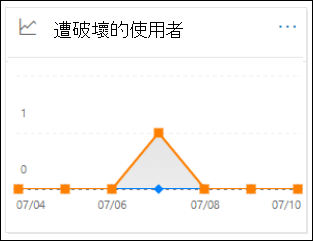

# 檢視安全性與合規性中心內的電子郵件安全性報告View email security reports in the Security & Compliance Center

[!INCLUDE [Microsoft 365 Defender rebranding](../includes/microsoft-defender-for-office.md)]

**適用於****Applies to**
- [Exchange Online ProtectionExchange Online Protection](exchange-online-protection-overview.md)
- [適用於 Office 365 的 Microsoft Defender 方案 1 和方案 2Microsoft Defender for Office 365 plan 1 and plan 2](defender-for-office-365.md)
- [Microsoft 365 DefenderMicrosoft 365 Defender](../defender/microsoft-365-defender.md)

[安全性 & 合規性中心](https://protection.office.com)提供各種報告，可協助您在保護組織時，看到 Microsoft 365 中的電子郵件安全性功能（例如，反垃圾郵件、反惡意程式碼和加密功能）。A variety of reports are available in the [Security & Compliance Center](https://protection.office.com) to help you see how email security features, such as anti-spam, anti-malware, and encryption features in Microsoft 365 are protecting your organization. 如果您有 [必要的許可權](#what-permissions-are-needed-to-view-these-reports)，您可以移至 [ **報表**] \> **儀表板**，在安全性 & 規範中心中查看這些報告。If you have the [necessary permissions](#what-permissions-are-needed-to-view-these-reports), you can view these reports in the Security & Compliance Center by going to **Reports** \> **Dashboard**. 若要直接移至 [報告] 儀表板，請開啟] <https://protection.office.com/insightdashboard> 。To go directly to the Reports dashboard, open <https://protection.office.com/insightdashboard>.

## 已遭破壞的使用者報告Compromised users report

> [!NOTE]
> 使用 Exchange Online 信箱的 Microsoft 365 組織可取得此報告。This report is available in Microsoft 365 organizations with Exchange Online mailboxes. 無法在獨立 Exchange Online Protection (EOP) 組織中使用。It's not available in standalone Exchange Online Protection (EOP) organizations.

「已 **遭破壞的使用者** 報告」顯示顯示過去7天內已標示為 **可疑** 或 **限制** 的使用者帳戶數目。The **Compromised users** report shows shows the number of user accounts that were marked as **Suspicious** or **Restricted** within the last 7 days. 在上述任一狀態的帳戶都有問題或甚至遭到破壞。Accounts in either of these states are problematic or even compromised. 在經常使用的情況下，您可以使用報表來找出峰值，甚至是趨勢，也就是可疑或受限制的帳戶。With frequent use, you can use the report to spot spikes, and even trends, in suspicious or restricted accounts. 如需遭到破壞之使用者的詳細資訊，請參閱 [回應遭到破壞的電子郵件帳戶](responding-to-a-compromised-email-account.md)。For more information about compromised users, see [Responding to a compromised email account](responding-to-a-compromised-email-account.md).

匯總視圖會顯示過去90天的資料，詳細資料檢視會顯示過去30天的資料。The aggregate view shows data for the last 90 days and the detail view shows data for the last 30 days.

若要查看報告，請開啟 [安全性 & 規範中心](https://protection.office.com)，移至 [ **報告**] \> **儀表板** ，然後選取 [已 **遭破壞的使用者**]。To view the report, open the [Security & Compliance Center](https://protection.office.com), go to **Reports** \> **Dashboard** and select **Compromised users**. 若要直接前往報表，請開啟 <https://protection.office.com/reportv2?id=CompromisedUsers> 。To go directly to the report, open <https://protection.office.com/reportv2?id=CompromisedUsers>.

您可以按一下 [ **篩選** ] 並選取下列其中一個或多個值，以篩選圖表和詳細資料表格：You can filter both the chart and the details table by clicking **Filters** and selecting one or more of the following values:

- **開始日期** 和 **結束日期****Start date** and **End date**

- **可疑**：使用者帳戶已傳送可疑的電子郵件，而且受到限制傳送電子郵件的風險。**Suspicious**: The user account has sent suspicious email and is at risk of being restricted from sending email.

- **限制**：由於高度可疑的模式，使用者帳戶已限制傳送電子郵件。**Restricted**: The user account has been restricted from sending email due to highly suspicious patterns.

如果您按一下 [ **查看詳細資料] 表格**，您可以看到下列詳細資料：If you click **View details table**, you can see the following details:

- **建立時間****Creation time**
- **User ID****User ID**
- **Action****Action**

若要回到報表檢視，請按一下 [ **查看報告**]。To go back to the report view, click **View report**.

## 加密報告Encryption report

您可以在 EOP (訂閱中使用 Exchange Online 或獨立 EOP 中的信箱，但沒有 Exchange Online 信箱) 的 **加密報告**。The **Encryption report** is available in EOP (subscriptions with mailboxes in Exchange Online or standalone EOP without Exchange Online mailboxes). 組織的安全小組可以使用此報告中的資訊來識別模式，並主動套用或調整敏感電子郵件訊息的原則。Your organization's security team can use information in this report to identify patterns and proactively apply or adjust policies for sensitive email messages. 例如：For example:

- 如果您看到大量的電子郵件是由使用者加密，您可能會想要新增加密原則，以自動化某些使用案例的加密。If you see a high number of email messages encrypted by users, you might want to add an encryption policy to automate encryption for certain use cases. 如需詳細資訊，請參閱[定義郵件流程規則，以在 Microsoft 365 中加密電子郵件訊息](../../compliance/define-mail-flow-rules-to-encrypt-email.md)。For more information, see [Define mail flow rules to encrypt email messages in Microsoft 365](../../compliance/define-mail-flow-rules-to-encrypt-email.md).

- 如果您有許多可供使用的加密範本，但沒有人正在使用這些範本，您可能會探索使用者是否需要功能訓練。If you have a number of encryption templates available but no one is using them, you might explore whether users need feature training.

匯總視圖允許篩選過去90天，而詳細資料檢視允許篩選10天。The aggregate view allows filtering for the last 90 days, while the detail view allows filtering for 10 days.

若要查看報告，請開啟 [安全性 & 規範中心](https://protection.office.com)，移至 [ **報告**] \> **儀表板** ，然後選取 [ **加密報告**]。To view the report, open the [Security & Compliance Center](https://protection.office.com), go to **Reports** \> **Dashboard** and select **Encryption report**. 若要直接前往報表，請開啟 <https://protection.office.com/reportv2?id=EncryptionReport> 。To go directly to the report, open <https://protection.office.com/reportv2?id=EncryptionReport>.

若要深入瞭解加密，請參閱[Microsoft 365 中的電子郵件加密](../../compliance/email-encryption.md)。To learn more about encryption, see [Email encryption in Microsoft 365](../../compliance/email-encryption.md).

### 加密報告的報表檢視Report view for the Encryption report

您可以在圖表上使用下列篩選：You can use the following filters on the chart:

- **查看資料：郵件加密報告** 和 **分解方式：加密方法**：下列為可用的加密方法：**View data by: Message Encryption Report** and **Break down by: Encryption method**: The following encryption methods are available:

  - **使用者加密****Encryption by user**
  - **依原則加密****Encryption by policy**

  如果您按一下 [ **篩選**]，您可以使用下列篩選器修改此圖表：If you click **Filters**, you can modify the chart with the following filters:

  - **開始日期** 和 **結束日期****Start date** and **End date**
  - 加密方法。Encryption method.
  - 加密範本。Encryption template.

- **查看資料：郵件加密報告** 和 **分解方式：加密範本**：下列為可供使用的加密方法：**View data by: Message Encryption Report** and **Break down by: Encryption template**: The following encryption methods are available:

  - **請勿轉寄****Do not forward**
  - **只加密****Encrypt only**
  - **OME 先前版本****OME previous**
  - **自訂****Custom**

  如果您按一下 [ **篩選**]，您可以使用下列篩選器修改此圖表：If you click **Filters**, you can modify the chart with the following filters:

  - **開始日期** 和 **結束日期****Start date** and **End date**
  - 加密方法Encryption method
  - 加密範本Encryption template

- **查看資料：前5位收件者網域**：此視圖會顯示圓形圖，其中包含前5位收件者網域的已傳送郵件計數。**View data by: Top 5 recipient domains**: This view shows a pie chart with sent message counts for the top 5 recipient domains.

  如果您按一下 [ **篩選**]，您可以選取 [ **開始日期** ] 和 [ **結束日期**]。If you click **Filters**, you can select a **Start date** and **End date**.

### 加密報告的詳細資料表格視圖Details table view for the Encryption report

如果您按一下 [ **查看詳細資料] 表格**，顯示的資訊將取決於您所查看的圖表：If you click **View details table**, the information that's shown depends on the chart you were looking at:

- **逐項換行：** 加密 **範本：加密範本**：下列會顯示下列資訊：**Break down by: Encryption method** or **Break down by: Encryption template**: The following information is shown:

  - **Date****Date**
  - **寄件者位址****Sender address**
  - **加密範本****Encryption template**
  - **加密方法****Encryption method**
  - **收件者位址****Recipient address**
  - **主旨****Subject**

- **資料查看依據：前5位收件者網域**：**View data by: Top 5 recipient domains**:

  - **Date****Date**
  - **收件者網域****Recipient domain**
  - **訊息計數****Message count**

如果您按一下 [詳細資料] 表格視圖中的 [ **篩選** ]，您可以使用下列篩選器修改結果：If you click **Filters** in a details table view, you can modify the results with the following filters:

- **開始日期** 和 **結束日期****Start date** and **End date**
- 加密方法Encryption method
- 加密範本Encryption template

若要回到報表檢視，請按一下 [ **查看報告**]。To go back to the report view, click **View report**.

## 郵件流程狀態報表Mailflow status report

**郵件流程狀態報表** 包含惡意程式碼、垃圾郵件、網路釣魚和 edge 封鎖郵件的相關資訊。The **Mailflow status report** contains information about malware, spam, phishing and edge blocked messages. 如需詳細資訊，請參閱 [郵件流程 status report](view-mail-flow-reports.md#mailflow-status-report)。For more details, see [Mailflow status report](view-mail-flow-reports.md#mailflow-status-report).

## 電子郵件報告中的惡意程式碼偵測Malware detections in email report

[**電子郵件中的惡意** 代碼偵測] 報告會顯示在 Exchange Online Protection 或 EOP) 所偵測到的內送和外寄電子 (郵件中，惡意程式碼偵測的相關資訊。The **Malware detections in email** report shows information about malware detections in incoming and outgoing email messages (malware detected by Exchange Online Protection or EOP). 如需 EOP 中惡意程式碼保護的詳細資訊，請參閱 [EOP 中的反惡意程式碼保護](anti-malware-protection.md)。For more information about malware protection in EOP, see [Anti-malware protection in EOP](anti-malware-protection.md).

 匯總 view 篩選允許90天，而 [詳細資料表格篩選] 只允許10天。The aggregate view filter allows for 90 days, while the details table filter only allows for 10 days.

若要查看報告，請開啟 [安全性 & 規範中心](https://protection.office.com)，移至 [ **報告**] \> **儀表板** ，然後 **在電子郵件中選取惡意** 代碼偵測。To view the report, open the [Security & Compliance Center](https://protection.office.com), go to **Reports** \> **Dashboard** and select **Malware detections in email**. 若要直接前往報表，請開啟 <https://protection.office.com/reportv2?id=MalwareDetections> 。To go directly to the report, open <https://protection.office.com/reportv2?id=MalwareDetections>.

![在 [報告] 儀表板的電子郵件小工具中偵測惡意程式碼](../../media/malware-detections-widget.png)

您可以按一下 [ **篩選** ] 並選取 [篩選]，以篩選圖表和詳細資料表格：You can filter both the chart and the details table by clicking **Filters** and selecting:

- **開始日期** 和 **結束日期****Start date** and **End date**
- **入境****Inbound**
- **出境****Outbound**

如果您按一下 [ **查看詳細資料] 表格**，您可以看到下列詳細資料：If you click **View details table**, you can see the following details:

- **Date****Date**
- **寄件者位址****Sender address**
- **收件者位址****Recipient address**
- **郵件識別碼**：郵件頭的 **Message-ID** 標頭欄位中可用，且應該是唯一的。**Message ID**: Available in the **Message-ID** header field in the message header and should be unique. 範例值 `<08f1e0f6806a47b4ac103961109ae6ef@server.domain>` (記下角括弧) 。An example value is `<08f1e0f6806a47b4ac103961109ae6ef@server.domain>` (note the angle brackets).
- **主旨****Subject**
- **Filename****Filename**
- **惡意軟體名稱****Malware name**

若要回到報表檢視，請按一下 [ **查看報告**]。To go back to the report view, click **View report**.

## 郵件延遲報告Mail latency report

**郵件延遲報告** 包含組織內的郵件傳遞和引爆延遲的資訊。The **Mail latency report** contains information on the mail delivery and detonation latency experienced within your organization. 如需詳細資訊，請參閱 [郵件延遲報告](view-reports-for-mdo.md#mail-latency-report)。For more information, see [Mail latency report](view-reports-for-mdo.md#mail-latency-report).

## 傳送和接收的電子郵件報告Sent and received email report

**傳送和接收的電子郵件** 報告包含惡意程式碼、垃圾郵件、郵件流程規則 (（也稱為傳輸規則) ）的相關資訊，以及電子郵件進入服務後的高級惡意軟體偵測。The **Sent and received email** report contains information about malware, spam, mail flow rules (also known as transport rules), and advanced malware detections after email enters the service. 如需詳細資訊，請參閱 [送出和接收的電子郵件報告](view-mail-flow-reports.md#sent-and-received-email-report)。For more information, see [Sent and received email report](view-mail-flow-reports.md#sent-and-received-email-report).

## 垃圾郵件偵測報告Spam detections report

**垃圾郵件** 偵測報告會顯示由 EOP 封鎖的垃圾電子郵件。The **Spam detections** report shows spam email messages that were blocked by EOP. 郵件會個別計算，而不是每個收件者。Messages are counted individually, not per recipient. 例如，如果相同的垃圾郵件已傳送給組織中的100收件者，則會算作一封郵件。For example, if the same spam message was sent to 100 recipients in your organization, it counts as one message.

匯總視圖允許90天篩選，而詳細資料表格允許10天的篩選。The aggregate view allows for 90 days filtering, while the details table allows for 10 days filtering.

若要查看報告，請開啟 [安全性 & 規範中心](https://protection.office.com)，移至 [ **報告**] \> **儀表板** ，然後選取 [ **垃圾郵件** 偵測]。To view the report, open the [Security & Compliance Center](https://protection.office.com), go to **Reports** \> **Dashboard** and select **Spam detections**. 若要直接前往報表，請開啟 <https://protection.office.com/reportv2?id=SpamDetections> 。To go directly to the report, open <https://protection.office.com/reportv2?id=SpamDetections>.

如需反垃圾郵件保護的詳細資訊，請參閱 [EOP 中的反垃圾郵件保護](anti-spam-protection.md)。For more information about anti-spam protection, see [Anti-spam protection in EOP](anti-spam-protection.md).

### 垃圾郵件偵測報告的報表檢視Report view for the Spam detections report

報表檢視提供下列圖表：The following charts are available in the report view:

- **分解方式：動作**：會顯示下列事件種類：**Break down by: Action**: The following event types are shown:

  - **篩選的垃圾郵件內容****Spam content filtered**
  - **垃圾郵件 IP 封鎖****Spam IP block**
  - **垃圾郵件信封封鎖****Spam envelope block**
  - **垃圾郵件 DBEB 篩選器**：以目錄為基礎的 edge 封鎖 (DBEB) **Spam DBEB filter**: Directory based edge blocking (DBEB)

  當您將滑鼠停留在圖表中的某一天 (資料點) 時，您可以看到該天已封鎖的專案數，以及這些專案的分類方式。When you hover over a day (data point) in the chart, you can see how many items were blocked that day, as well as how those items are categorized.

  

- **分解方式：方向**：下列方向如下：**Break down by: Direction**: The following directions are shown:

  - **入境****Inbound**
  - **出境****Outbound**

  

如果您按一下報表檢視中的 **篩選器** ，您可以使用下列篩選器修改結果：If you click **Filters** in a report view, you can modify the results with the following filters:

- **開始日期** 和 **結束日期****Start date** and **End date**
- 方向值Direction values
- 事件種類值Event type values

### 垃圾郵件偵測報告的詳細資料表格視圖Details table view for the Spam detections report

如果您按一下任何報表檢視中的 [ **查看詳細資料] 表格** ，會顯示下列資訊：If you click **View details table** in any report view, the following information is shown:

- **Date****Date**
- **寄件者位址****Sender address**
- **收件者位址****Recipient address**
- **事件類型****Event type**
- **Action****Action**
- **主旨****Subject**

如果您按一下 [詳細資料] 表格中的 [ **篩選** ]，您可以使用下列篩選器修改結果：If you click **Filters** in a details table, you can modify the results with the following filters:

- **開始日期** 和 **結束日期****Start date** and **End date**
- 方向值Direction values
- 事件種類值Event type values

若要回到報表檢視，請按一下 [ **查看報告**]。To go back to the report view, click **View report**.

## 欺騙偵測報告Spoof detections report

> [!NOTE]
> 本文中所述的 [已改進的欺騙偵測報告] 是預覽中所述，視情況而變更，並非所有組織都提供這些報告。The improved Spoof detections report as described in this article is in Preview, is subject to change, and is not available in all organizations. 舊的報表版本只會顯示出 **良好的郵件** ，並 **視為垃圾** 郵件。The older version of the report showed only **Good mail** and **Caught as spam**.

**欺騙** 偵測報告會顯示因欺騙性而封鎖或允許的郵件相關資訊。The **Spoof detections** report shows information about messages that were blocked or allowed due to spoofing. 如需有關電子欺騙的詳細資訊，請參閱 [EOP 中的反欺騙防護](anti-spoofing-protection.md)。For more information about spoofing, see [Anti-spoofing protection in EOP](anti-spoofing-protection.md).

報表的匯總視圖允許45天的篩選 \* ，而詳細資料檢視只允許10天的篩選。The aggregate view of the report allows for 45 days of filtering\*, while the detail view only allows for ten days of filtering.

\* 最後，您將可以使用超過90天的篩選。\* Eventually, you'll be able to use up to 90 days of filtering.

若要查看報告，請開啟 [安全性 & 規範中心](https://protection.office.com)，移至 [ **報告**] \> **儀表板** ，然後選取 [ **偽造** 偵測]。To view the report, open the [Security & Compliance Center](https://protection.office.com), go to **Reports** \> **Dashboard** and select **Spoof detections**. 若要直接前往報表，請開啟 <https://protection.office.com/reportv2?id=SpoofMailReport> 。To go directly to the report, open <https://protection.office.com/reportv2?id=SpoofMailReport>.

當您將滑鼠停留在圖表中的某一天 (資料點) 時，您可以看到偵測到的冒牌郵件數目及原因。When you hover over a day (data point) in the chart, you can see how many spoofed messages were detected and why.

您可以按一下 [ **篩選** ] 並選取下列其中一個或多個值，以篩選圖表和詳細資料表格：You can filter both the chart and the details table by clicking **Filters** and selecting one or more of the following values:

- **開始日期** 和 **結束日期****Start date** and **End date**

- **結果****Result**
  - **通過****Pass**
  - **失敗****Fail**
  - **SoftPass****SoftPass**
  - **無****None**
  - **其他****Other**

- **哄騙類型**： **Internal** 和 **External****Spoof type**: **Internal** and **External**

如果您按一下 [ **查看詳細資料] 表格**，您可以看到下列詳細資料：If you click **View details table**, you can see the following details:

- **Date****Date**
- **偽裝的使用者****Spoofed user**
- **傳送基礎結構****Sending infrastructure**
- **哄騙類型****Spoof type**
- **結果****Result**
- **結果代碼****Result code**
- **SPF****SPF**
- **DKIM****DKIM**
- **DMARC****DMARC**
- **訊息計數****Message count**

若要回到報表檢視，請按一下 [ **查看報告**]。To go back to the report view, click **View report**.

如需複合驗證結果代碼的詳細資訊，請參閱[反垃圾郵件郵件頭 in Microsoft 365](anti-spam-message-headers.md)。For more information about composite authentication result codes, see [Anti-spam message headers in Microsoft 365](anti-spam-message-headers.md).

## 威脅防護狀態報告Threat protection status report

「**威脅防護狀態**」報告可用於 EOP 和 Microsoft Defender for Office 365。不過，報告包含不同的資料。The **Threat protection status** report is available in both EOP and Microsoft Defender for Office 365; however, the reports contain different data. 例如，EOP 客戶可以查看在電子郵件中偵測到惡意程式碼的相關資訊，但不是[SharePoint、OneDrive 及 Microsoft Teams 的安全附件](mdo-for-spo-odb-and-teams.md)所偵測到之惡意檔案的相關資訊。For example, EOP customers can view information about malware detected in email, but not information about malicious files detected by [Safe Attachments for SharePoint, OneDrive, and Microsoft Teams](mdo-for-spo-odb-and-teams.md).

該報告提供包含惡意內容的電子郵件統計，例如檔案或網站位址 (URLs 反惡意程式碼引擎封鎖的) 、[零小時自動清除 (ZAP) ](zero-hour-auto-purge.md)，以及用於 Office 365 功能（如[安全連結](safe-links.md)、[安全附件](safe-attachments.md)和[反網路釣魚](set-up-anti-phishing-policies.md)）的 Defender。The report provides the count of email messages with malicious content, such as files or website addresses (URLs) that were blocked by the anti-malware engine, [zero-hour auto purge (ZAP)](zero-hour-auto-purge.md), and Defender for Office 365 features like [Safe Links](safe-links.md), [Safe Attachments](safe-attachments.md), and [Anti-phishing](set-up-anti-phishing-policies.md). 您可以使用此資訊來識別趨勢，或判斷組織原則是否需要調整。You can use this information to identify trends or determine whether organization policies need adjustment.

**附注：請** 務必瞭解，如果郵件傳送給五位收件者，我們會將其統計為五個不同的郵件，而不是一封郵件。**Note**: It's important to understand that if a message is sent to five recipients we count it as five different messages and not one message.

若要查看報告，請開啟 [安全性 & 合規性中心](https://protection.office.com)，移至 [ **報告**] \> **儀表板** ，然後選取 [ **威脅防護狀態**]。To view the report, open the [Security & Compliance Center](https://protection.office.com), go to **Reports** \> **Dashboard** and select **Threat protection status**. 若要直接前往報告，請開啟下列其中一個 URLs：To go directly to the report, open one of the following URLs:

- Microsoft Defender Office 365：<https://protection.office.com/reportv2?id=TPSAggregateReportATP>Microsoft Defender for Office 365: <https://protection.office.com/reportv2?id=TPSAggregateReportATP>
- EOP <https://protection.office.com/reportv2?id=TPSAggregateReport>EOP: <https://protection.office.com/reportv2?id=TPSAggregateReport>

根據預設，圖表會顯示過去7天的資料。By default, the chart shows data for the past 7 days. 如果您按一下 [ **篩選**]，可以選取90天的日期範圍 (試用訂閱可能限制為30天) 。If you click **Filters**, you can select a 90 day date range (trial subscriptions might be limited to 30 days). [詳細資料] 表格視圖允許篩選30天。The details table view allows filtering for 30 days.

### 威脅防護狀態報表的報表檢視Report view for the Threat protection status report

您可使用下列檢視：The following views are available:

- **資料查看方式：概述**：以下是顯示的偵測資訊：**View data by: Overview**: The following detection information is shown:

  - **電子郵件惡意程式碼****Email malware**
  - **電子郵件網路釣魚****Email phish**
  - **內容惡意程式碼****Content malware**

  

- **資料查看方式：內容 \>惡意軟體**1：對 Office 365 組織的 Microsoft Defender 顯示下列資訊：**View data by: Content \> Malware**1: The following information is shown for Microsoft Defender for Office 365 organizations:

  - **反惡意程式碼引擎**： [Microsoft 365 中內建的病毒偵測](virus-detection-in-spo.md)，在 Sharepoint、OneDrive 及 Microsoft Teams 中偵測到惡意檔案。**Anti-malware engine**: Malicious files detected in Sharepoint, OneDrive, and Microsoft Teams by the [built-in virus detection in Microsoft 365](virus-detection-in-spo.md).
  - 檔案 **引爆**： [SharePoint、OneDrive 及 Microsoft Teams 的安全附件](mdo-for-spo-odb-and-teams.md)所偵測到的惡意檔案。**File detonation**: Malicious files detected by [Safe Attachments for SharePoint, OneDrive, and Microsoft Teams](mdo-for-spo-odb-and-teams.md).

  

- **查看資料：郵件覆寫**：下列的覆寫原因資訊如下：**View data by: Message Override**: The following override reason information is shown:

  - **內部部署略過****On-premises skip**
  - **IP 允許****IP Allow**
  - **郵件流程規則****Mail flow rule**
  - **寄件者允許****Sender allow**
  - **網域允許****Domain allow**
  - **未啟用的 ZAP****ZAP not enabled**
  - **未啟用垃圾郵件資料夾****Junk Mail folder not enabled**
  - **使用者安全寄件者****User Safe Sender**
  - **使用者安全網域****User Safe Domain**

  

- **分解方式：偵測技術** 和 **查看資料：電子郵件網路釣魚：電子郵件 \> 網路釣魚**：下列資訊會顯示：**Break down by: Detection technology** and **View data by: Email \> Phish**: The following information is shown:

  - **ATP 產生的 url 信譽**1：在其他 Microsoft 365 客戶的 Office 365 detonations 中，從 Defender 產生惡意 URL 信譽。**ATP-generated URL reputation**1: Malicious URL reputation generated from Defender for Office 365 detonations in other Microsoft 365 customers.
  - **高級網路釣魚篩選**：以機器學習為基礎的網路釣魚信號。**Advanced phish filter**: Phishing signals based on machine learning.
  - **反欺騙-DMARC 失敗**：郵件上的 DMARC 驗證失敗。**Anti-spoof - DMARC failure**: DMARC authentication failure on messages.
  - **反欺騙-組織內**：寄件者正嘗試哄騙收件者網域。**Anti-spoof - intra-org**: Sender is trying to spoof the recipient domain.
  - **反欺騙-外部網域**：寄件者正嘗試哄騙其他一些網域。**Anti-spoof - external domain**: Sender is trying to spoof some other domain.
  - **品牌** 模擬：模擬以寄件者為基礎的知名品牌。**Brand impersonation**: Impersonation of well-known brands based on senders.
  - **網域** 模擬 1：模仿客戶擁有或定義的網域。**Domain impersonation**1: Impersonation of domains that the customer owns or defines.
  - **EOP url 信譽**：惡意 url 信譽。**EOP URL reputation**: Malicious URL reputation.
  - **一般網路釣魚篩選器**：根據分析規則的網路釣魚信號。**General phish filter**: Phishing signals based on analyst rules.
  - **別人****Others**
  - **網路釣魚 ZAP**2：零小時自動清除網路釣魚郵件。**Phish ZAP**2: Zero hour auto purge of phishing messages.
  - **URL 引爆**1**URL detonation**1
  - **使用者** 模擬 1：模擬由系統管理員定義或透過信箱智慧學出的使用者。**User impersonation**1: Impersonation of users defined by admin or learned through mailbox intelligence.

  

- **分解方式：偵測技術** 和 **View Data：電子郵件 \> 惡意** 代碼：會顯示下列資訊：**Break down by: Detection technology** and **View data by: Email \> Malware**: The following information is shown:

  - **ATP 產生的檔案信譽**1： Office 365 detonations 之 Defender 所產生的所有惡意檔信譽。**ATP-generated file reputation**1: All malicious file reputation generated by Defender for Office 365 detonations.
  - **反惡意程式碼引擎**1：偵測到反惡意程式碼引擎。**Anti-malware engine**1: Detection from anti-malware engines.
  - **反惡意程式碼原則檔案類型封鎖**：由於郵件中所識別的惡意檔案類型，郵件會篩選掉這些電子郵件。**Anti-malware policy file type block**: These are email messages filtered out due to the type of malicious file identified in the message.
  - **檔引爆**1：由安全附件偵測。**File detonation**1: Detection by Safe Attachments.
  - **惡意檔信譽****Malicious file reputation**
  - **惡意程式碼 ZAP**2**Malware ZAP**2
  - **別人****Others**

  

- **分解方式：原則類型** 和 **view data \>** by：電子郵件惡意程式碼： **電子郵件 \> 惡意** 代碼：下列是顯示下列資訊：**Break down by: Policy type** and **View data by: Email \> Phish** or **View data by: Email \> Malware**: The following information is shown:

  - **反惡意程式碼****Anti-malware**
  - **安全附件**1**Safe Attachments**1
  - **反網路釣魚****Anti-phish**
  - **反垃圾郵件****Anti-spam**
  - **郵件流程規則** (也稱為傳輸規則) **Mail flow rule** (also known as a transport rule)
  - **別人****Others**

  

- **分解方式：傳遞狀態** 和查看資料：電子郵件的 **\> 網路釣魚詐騙** 或 **view data：電子郵件 \> 惡意** 代碼：會顯示下列資訊：**Break down by: Delivery status** and **View data by: Email \> Phish** or **View data by: Email \> Malware**: The following information is shown:

  - **傳遞失敗****Delivery failed**
  - **下降****Dropped**
  - **轉發****Forwarded**
  - **主控信箱：自訂資料夾****Hosted mailbox: Custom folder**
  - **主控信箱：刪除的郵件****Hosted mailbox: Deleted items**
  - **主控信箱：收件匣****Hosted mailbox: Inbox**
  - **主控信箱：垃圾郵件****Hosted mailbox: Junk**
  - **內部部署伺服器：已傳送****On-premises server: Delivered**
  - **隔離區****Quarantine**

  

1僅限 Office 365 的 Defender1 Defender for Office 365 only

兩個零小時自動清除 (ZAP) 不可用於獨立 EOP 中 (它只適用于 Exchange Online 信箱) 。2 Zero-hour auto purge (ZAP) isn't available in standalone EOP (it only works in Exchange Online mailboxes).

如果您按一下 [ **篩選**]，可用的篩選取決於您所查看的圖表：If you click **Filters**, the filters available depends on the chart you were looking at:

- 如需 **查看資料：內容 \> 惡意程式碼**，您可以依 **開始日期** 和 **結束日期** 以及 **偵測** 值，修改報告。For **View data by: Content \> Malware**, you can modify the report by **Start date** and **End date**, and the **Detection** value.

- 如需 **查看資料：郵件覆寫**，您可以使用下列篩選器修改報告：For **View data by: Message Override**, you can modify the report with the following filters:

  - **開始日期** 和 **結束日期****Start date** and **End date**
  - **覆寫原因****Override Reason**
  - **標記**：依已套用指定使用者標記的使用者或群組來篩選結果 (包含優先順序帳戶) 。**Tag**: Filter the results by users or groups that have had the specified user tag applied (including priority accounts). 如需使用者標記的相關資訊，請參閱 [user tags](user-tags.md)。For more information about user tags, see [User tags](user-tags.md).
  - **網域****Domain**

- 對於所有其他視圖，您可以使用下列篩選器修改報告：For all other views, you can modify the report with the following filters:

  - **開始日期** 和 **結束日期****Start date** and **End date**
  - **偵測****Detection**
  - **保護者**： **ATP** 或 **EOP****Protected by**: **ATP** or **EOP**
  - **標記**：依已套用指定使用者標記的使用者或群組來篩選結果 (包含優先順序帳戶) 。**Tag**: Filter the results by users or groups that have had the specified user tag applied (including priority accounts). 如需使用者標記的相關資訊，請參閱 [user tags](user-tags.md)。For more information about user tags, see [User tags](user-tags.md).
  - **網域****Domain**

### 威脅防護狀態報表的詳細資料表格視圖Details table view for the Threat protection status report

如果您按一下 [ **查看詳細資料] 表格**，顯示的資訊將取決於您所查看的圖表：If you click **View details table**, the information that's shown depends on the chart you were looking at:

- **資料查看方式：一覽**：沒有可用的 **視圖詳細資料表格** 按鈕。**View data by: Overview**: No **View details table** button is available.

- **資料查看方式：內容 \> 惡意** 代碼：**View data by: Content \> Malware**:

  - **Date****Date**
  - **位置****Location**
  - **導向者****Directed by**
  - **惡意軟體名稱****Malware name**

  如果您按一下此視圖中的 [ **篩選器** ]，您可以依 **開始日期** 和 **結束日期** 以及 **偵測** 值，修改報告。If you click **Filters** in this view, you can modify the report by **Start date** and **End date**, and the **Detection** value.

- **查看資料：郵件覆寫**：**View data by: Message Override**:

  - **Date****Date**
  - **主旨****Subject**
  - **Sender****Sender**
  - **收件者****Recipients**
  - **偵測到****Detected by**
  - **覆寫原因****Override Reason**
  - **受損來源****Source of Compromise**
  - **標記****Tags**

  如果您按一下此視圖中的 **篩選器** ，您可以使用下列篩選器修改報告：If you click **Filters** in this view, you can modify the report with the following filters:

  - **開始日期** 和 **結束日期****Start date** and **End date**
  - **覆寫原因****Override Reason**
  - **標記**：依已套用指定使用者標記的使用者或群組來篩選結果 (包含優先順序帳戶) 。**Tag**: Filter the results by users or groups that have had the specified user tag applied (including priority accounts). 如需使用者標記的相關資訊，請參閱 [user tags](user-tags.md)。For more information about user tags, see [User tags](user-tags.md).
  - **網域****Domain**
  - 收件 **者 (請** 注意，[詳細資料] 表格視圖中只提供此可篩選的屬性) **Recipients** (Note that this filterable property is only available in the details table view)

- 所有其他圖表：All other charts:

  - **Date****Date**
  - **主旨****Subject**
  - **Sender****Sender**
  - **收件者****Recipients**
  - **偵測到****Detected by**
  - **傳遞狀態****Delivery Status**
  - **受損來源****Source of Compromise**
  - **標記****Tags**

  如果您按一下 [ **篩選**]，您可以使用下列篩選器修改報告：If you click **Filters**, you can modify the report with the following filters:

  - **開始日期** 和 **結束日期****Start date** and **End date**
  - **偵測****Detection**
  - **受保護**： Office 365 或 **EOP** **的 Defender****Protected by**: **Defender for Office 365** or **EOP**
  - **標記**：依已套用指定使用者標記的使用者或群組來篩選結果 (包含優先順序帳戶) 。**Tag**: Filter the results by users or groups that have had the specified user tag applied (including priority accounts). 如需使用者標記的相關資訊，請參閱 [user tags](user-tags.md)。For more information about user tags, see [User tags](user-tags.md).
  - **網域****Domain**
  - 收件 **者 (請** 注意，[詳細資料] 表格視圖中只提供此可篩選的屬性) **Recipients** (Note that this filterable property is only available in the details table view)

## 主要惡意程式碼報告Top malware report

**主要惡意** 代碼報告會顯示 [EOP 中的反惡意程式碼防護](anti-malware-protection.md)所偵測到的各種惡意程式碼。The **Top malware** report shows the various kinds of malware that was detected by [anti-malware protection in EOP](anti-malware-protection.md).

若要查看報告，請開啟 [安全性 & 規範中心](https://protection.office.com)，移至 [ **報告**] \> **儀表板** ，然後選取 [ **主要惡意** 代碼]。To view the report, open the [Security & Compliance Center](https://protection.office.com), go to **Reports** \> **Dashboard** and select **Top malware**. 若要直接前往報表，請開啟 <https://protection.office.com/reportv2?id=TopMalware> 。To go directly to the report, open <https://protection.office.com/reportv2?id=TopMalware>.

當您將游標移到圓形圖中的楔形上方時，您可以看到惡意程式碼類型的名稱，以及偵測到該惡意程式碼的郵件數目。When you hover over a wedge in the pie chart, you can see the name of a kind of malware and how many messages were detected as having that malware.

如果您按一下 [ **查看詳細資料] 表格**，您可以看到下列詳細資料：If you click **View details table**, you can see the following details:

- **主要惡意程式碼****Top malware**
- **Count****Count**

如果您按一下 [報表檢視] 或 [詳細資料表格] 視圖中的 [ **篩選** ]，您可以指定具有 **開始日期** 和 **結束日期** 的日期範圍。If you click **Filters** in the report view or details table view, you can specify a date range with **Start date** and **End date**.

## URL 威脅防護報告URL threat protection report

Office 365 的「 **URL 威脅防護」報告** 可用於的 Microsoft Defender。The **URL threat protection report** is available in Microsoft Defender for Office 365. 如需詳細資訊，請參閱 [URL 威脅防護報告](view-reports-for-mdo.md#url-threat-protection-report)。For more information, see [URL threat protection report](view-reports-for-mdo.md#url-threat-protection-report).

## 使用者報告的訊息報告User-reported messages report

「 **使用者報告的訊息** 報告」顯示使用者已使用 [報告郵件增益集](enable-the-report-message-add-in.md) 或 [報告網路釣魚增益集](enable-the-report-phish-add-in.md)舉報為垃圾郵件、網路釣魚企圖或良好郵件的相關資訊。The **User-reported messages** report shows information about email messages that users have reported as junk, phishing attempts, or good mail by using the [Report Message add-in](enable-the-report-message-add-in.md) or [The Report Phishing add-in](enable-the-report-phish-add-in.md).

詳細資料可用於每封郵件，包括傳遞原因、為您的組織設定的垃圾郵件原則例外狀況或郵件流程規則。Details are available for each message, including the delivery reason, such a spam policy exception or mail flow rule configured for your organization. 若要查看詳細資料，請選取 [使用者報告] 清單中的專案，然後查看 [ **摘要** ] 和 [ **詳細資料** ] 索引標籤上的資訊。To view details, select an item in the user-reports list, and then view the information on the **Summary** and **Details** tabs.

若要查看此報告，請在 [ [安全性 & 規範中心](https://protection.office.com)] 中，執行下列其中一項操作：To view this report, in the [Security & Compliance Center](https://protection.office.com), do one of the following:

- 移至 **威脅管理** \> **儀表板** \> **使用者報告的郵件**。Go to **Threat management** \> **Dashboard** \> **User-reported messages**.

- 移至 **威脅管理** \> **檢查** \> **使用者報告的郵件**。Go to **Threat management** \> **Review** \> **User-reported messages**.

![在 [安全性 & 規範中心] 中，選擇 [威脅管理] [ \> \> 使用者報告的郵件]](../../media/e372c57c-1414-4616-957b-bc933b8c8711.png)

> [!IMPORTANT]
> 為了讓使用者報告的郵件報告正確運作，必須為您的 Office 365 環境 **開啟審計記錄**。In order for the User-reported messages report to work correctly, **audit logging must be turned on** for your Office 365 environment. 這項工作通常是由在 Exchange Online 中獲派稽核記錄角色的人員完成。This is typically done by someone who has the Audit Logs role assigned in Exchange Online. 如需詳細資訊，請參閱[開啟或關閉 Microsoft 365 審核記錄搜尋](../../compliance/turn-audit-log-search-on-or-off.md)。For more information, see [Turn Microsoft 365 audit log search on or off](../../compliance/turn-audit-log-search-on-or-off.md).

## 查看這些報表所需的許可權為何？What permissions are needed to view these reports?

為了查看和使用本文所述的報表，您必須是安全性 & 合規性中心之一的下列其中一個角色群組的成員：In order to view and use the reports described in this article, you need to be a member of one of the following role groups in the Security & Compliance Center:

- **組織管理****Organization Management**
- **安全性系統管理員****Security Administrator**
- **安全性讀取者****Security Reader**
- **全域讀取者****Global Reader**

如需詳細資訊，請參閱[安全性與合規性中心中的權限](permissions-in-the-security-and-compliance-center.md)。For more information, see [Permissions in the Security & Compliance Center](permissions-in-the-security-and-compliance-center.md).

**附注**：將使用者新增至 Microsoft 365 系統管理中心中對應的 Azure Active Directory 角色，可為使用者提供 Microsoft 365 的安全性 & 合規性中心 _和_ 許可權中所需的許可權。**Note**: Adding users to the corresponding Azure Active Directory role in the Microsoft 365 admin center gives users the required permissions in the Security & Compliance Center _and_ permissions for other features in Microsoft 365. 如需詳細資訊，請參閱[關於系統管理員角色](../../admin/add-users/about-admin-roles.md)。For more information, see [About admin roles](../../admin/add-users/about-admin-roles.md).

## 如果報告未顯示資料，該怎麼辦？What if the reports aren't showing data?

如果您未看到報表中的資料，請仔細檢查您的原則設定是否正確。If you are not seeing data in your reports, double-check that your policies are set up correctly. 若要深入瞭解，請參閱 [防禦威脅](protect-against-threats.md)。To learn more, see [Protect against threats](protect-against-threats.md).

## 相關主題Related topics

[EOP 中的反垃圾郵件和反惡意程式碼保護Anti-spam and anti-malware protection in EOP](anti-spam-and-anti-malware-protection.md)

[安全性與合規性中心內的智慧型報表和深入解析Smart reports and insights in the Security & Compliance Center](reports-and-insights-in-security-and-compliance.md)

[在安全性 & 規範中心內，查看郵件流程報告View mail flow reports in the Security & Compliance Center](view-mail-flow-reports.md)

[View Office 365 的 Defender 報告View reports for Defender for Office 365](view-reports-for-mdo.md)
