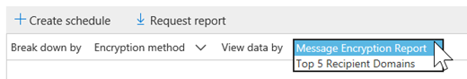
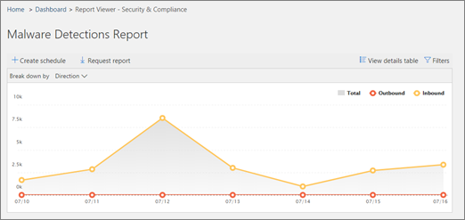
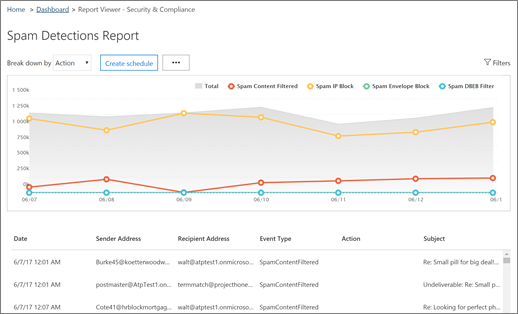

# 檢視安全性與合規性中心內的電子郵件安全性報告View email security reports in the Security &amp; Compliance Center

[安全性&amp;與合規性中心](https://protection.office.com)提供各種報告，可協助您瞭解 Office 365 中的電子郵件安全性功能（例如，反垃圾郵件、反惡意程式碼和加密功能）是如何保護您的組織。A variety of reports are available in the [Security &amp; Compliance Center](https://protection.office.com) to help you see how email security features, such as anti-spam, anti-malware, and encryption features in Office 365 are protecting your organization. 如果您有[必要的許可權](#what-permissions-are-needed-to-view-these-reports)，您可以移至 [**報告** \> ]**儀表板**，以在安全性&amp;與合規性中心中查看這些報告。If you have the [necessary permissions](#what-permissions-are-needed-to-view-these-reports), you can view these reports in the Security &amp; Compliance Center by going to **Reports** \> **Dashboard**.
  

  
您的電子郵件安全性報告包含下列專案：Your email security reports include the following:
- [URL 威脅防護報告](#url-threat-protection-report-new)（**新！**）[URL Threat Protection report](#url-threat-protection-report-new) (**NEW!**)
- [已遭破壞的使用者報告Compromised Users report](#compromised-users-report)
- [加密報告Encryption report](#encryption-report)
- [威脅防護狀態報告Threat Protection Status report](#threat-protection-status-report) 
- [惡意程式碼檢測報告Malware Detections report](#malware-detections-report) 
- [主要惡意程式碼報告Top Malware report](#top-malware-report)
- [主要寄件者和收件者報表Top Senders and Recipients report](#top-senders-and-recipients-report)
- [欺騙偵測報告Spoof Detections report](#spoof-detections-report)
- [垃圾郵件偵測報告Spam Detections report](#spam-detections-report)
- [傳送和接收的電子郵件報告Sent and received email report](#sent-and-received-email-report)
- [使用者報告的訊息報告User-reported messages report](#user-reported-messages-report)

## URL 威脅防護報告（**新！**）URL Threat Protection report (**NEW!**)

具有下列專案的任何人都可以使用 URL 威脅防護報告：The URL Threat Protection report is available to anyone with:

- Exchange Online Protection*和*高級威脅防護附加元件（方案 1*或*計畫2）An Exchange Online Protection, *and* Advanced Threat Protection add-on (Plan 1 *or* Plan 2) 
- Microsoft 365 E5 訂閱A Microsoft 365 E5 subscription

這是以「按一下中心」的報表，具有兩個匯總的視圖。This is a 'click-centric' report that has two aggregated views.
 
1. 第一個視圖是透過*url 按一下保護動作*，其重點是顯示使用者在租使用者中的 URL 按一下數目，以及按一下的結果。The first view is by *URL click-protection action*, which is focused on showing the number of URL clicks by users within the tenant, and the result of the click. A 按下會指出使用者已透過封鎖頁面按一下至惡意網站（這可以由系統管理員在安全連結原則中停用）。A click here indicates that the user has clicked through the block page to the malicious website (this can be disabled by the administrator within a Safe Links policy).
 
2. 第二個 view 是*由應用程式按一下 URL*，它會顯示在目前支援安全連結的不同應用程式中，例如在電子郵件客戶程式或 Microsoft Word 中，URLs 按一下的數目。The second view is *URL click by applications*, which shows the number of URLs click in different applications that support Safe Links today, such as in an email client or in Microsoft Word. 兩個匯總視圖中的資料都會每4小時重新整理一次。Data in both aggregated views are refreshed once every 4 hours.

「URL 威脅防護」報告的詳細資料表格可提供租使用者內所有按一下作業的近乎即時的視圖，其中包含諸如使用者*名稱*、 *URL*、*網路訊息識別碼*（如果 URL 已按一下電子郵件）的調查資訊，以及其他重要資訊，以供調查和分析使用。The details table of the URL Threat Protection report provides a near-real-time view of all clicks that happen within the tenant, and it includes investigative information such as *username*, *URL*, the *network message ID* (if the URL was clicked from an email), and other valuable pieces of information useful for investigations and analyses.  

根據預設，報告只會顯示由安全連結所封鎖 URLs 所按一下的資料，但也可以查看所有 URL 按一下的資訊，在篩選器中選取 [*允許的 URLs* ] 核取方塊。By default, the report only shows data on clicks from URLs that were blocked by Safe Links, but it is also possible to see information for all URL clicks through selecting *Allowed URLs* checkbox in the filters.  

如果已套用安全連結原則的使用者已選取 [*不追蹤使用者點擊*] 選項，則此報告將不會有按一下的資料。This report will not have data of clicks from users where the Safe Links policy applied has the *Do not track user clicks* option selected.

## 已遭破壞的使用者報告Compromised Users report 

這份報告可供任何使用 Exchange Online Protection 的使用者，顯示標示為可疑或受限制使用者的使用者帳戶數目，當帳戶進入指出使用者帳戶可能有問題或甚至遭到破壞的狀態時，資料特別有用。This report, available to anyone with Exchange Online Protection, shows the number of user accounts marked as Suspicious or Restricted users, data particularly useful as accounts enter either of the states that indicate the user account may be problematic, or even compromised. 在經常使用的情況下，已遭破壞的使用者報告可以發現具有可疑或限制狀態之帳戶中的波峰峰值，甚至是趨勢，也就是您租使用者的安全性和 wellness 可能會發生問題。With frequent use, the Compromised User report can spot spikes, and even trends, in accounts marked in suspicious or restricted states, giving evidence there could be an issue with security and the wellness of your tenant.

## 加密報告Encryption report

**加密報告**會顯示已加密之電子郵件的相關資訊，不論是透過您組織的原則或透過使用者控制項。The **Encryption report** shows information about email messages that were encrypted, either through your organization's policies, or through end-user controls. 組織的安全小組可以使用此報告中的資訊來識別模式，並主動套用或調整敏感電子郵件訊息的原則。Your organization's security team can use information in this report to identify patterns and proactively apply or adjust policies for sensitive email messages.

若要查看此報告，請在安全性 & 合規性中心，移至 [**報告** \> **] 儀表板** \> **加密報告**。To view this report, in the Security & Compliance Center, go to **Reports** \> **Dashboard** \> **Encryption report**.

 

當報表第一次開啟時，您會看到過去七（7）天內，電子郵件所使用之加密方法的資料。When the report first opens, you'll see data about encryption methods used on email messages for the past seven (7) days. 您可以按一下螢幕右上角的 [**篩選器**]，以變更日期範圍及顯示在報告中的詳細資料。You can change the date range and the details that are displayed in the report by clicking **Filters** in the upper right corner of the screen.

   

您也可以使用 [**分解者**] 功能表，透過加密範本（或方法）來查看資料。You can also use the **Break down by** menu to view data by encryption template (or method).

而且，您可以使用 [ **view data by** ] 功能表，將 view 改為查看前5位收件者網域的加密郵件計數。And, you can use the **View data by** menu to change the view to see counts of encrypted messages to the top five recipient domains.

使用新加密報告的彈性，您可以查看趨勢並採取適當的動作。With the flexibility of the new Encryption report, you can view trends and take appropriate actions. 例如，如果您看到大量的電子郵件是由使用者加密，您可能會想要新增加密原則，以自動化某些使用案例的加密。For example, if you see a high number of email messages encrypted by users, you might want to add an encryption policy to automate encryption for certain use cases. （若要取得此相關說明，請參閱[定義郵件流程規則以在 Office 365 中加密電子郵件訊息](../../compliance/define-mail-flow-rules-to-encrypt-email.md)。）在另一個範例中，如果您有許多可供使用的加密範本，但沒有人正在使用這些範本，則可以考察使用者是否需要對該功能進行訓練。(To get help with that, see [Define mail flow rules to encrypt email messages in Office 365](../../compliance/define-mail-flow-rules-to-encrypt-email.md).) As another example, if you have a number of encryption templates available but no one is using them, you might explore whether users need training for that feature. 

使用此報告可讓貴組織的安全性與合規性小組監視郵件加密的使用方式，以及是否需要進一步的動作。Use this report enables your organization's security and compliance team to monitor how message encryption is being used, and whether further actions are needed. 若要深入瞭解加密，請參閱[Office 365 中的電子郵件加密](../../compliance/email-encryption.md)。To learn more about encryption, see [Email encryption in Office 365](../../compliance/email-encryption.md).

## 威脅防護狀態報告Threat Protection Status report

「**威脅防護狀態**報告」是一個智慧報告，顯示 Exchange Online Protection 偵測到並封鎖的惡意電子郵件。The **Threat Protection Status** report is a smart report that shows malicious email that was detected and blocked by Exchange Online Protection. 此報告可用於查看識別為惡意程式碼的電子郵件，或一段時間內的網路釣魚企圖（最多90天），並可讓安全性管理員識別趨勢或判斷是否需要調整原則。This report is useful for viewing email identified as malware or a phishing attempt over time (up to 90 days), and it enables security administrators to identify trends or determine whether policies need adjustments.

> [!NOTE]
> 具有[Office 365 ATP](https://docs.microsoft.com/microsoft-365/security/office-365-security/office-365-atp)或[Exchange Online Protection](https://docs.microsoft.com/microsoft-365/security/office-365-security/what-is-eop) （EOP）的客戶可以使用威脅防護狀態報表;不過，針對 ATP 客戶顯示在威脅防護狀態報表中的資訊，其可能會包含與客戶可能看到的 EOP 不同的資料。A Threat Protection Status report is available to customers who have either [Office 365 ATP](https://docs.microsoft.com/microsoft-365/security/office-365-security/office-365-atp) or [Exchange Online Protection](https://docs.microsoft.com/microsoft-365/security/office-365-security/what-is-eop) (EOP); however, the information that is displayed in the Threat Protection Status report for ATP customers will likely contain different data than what EOP customers might see. 例如，EOP 客戶可以查看在電子郵件中偵測到惡意程式碼的相關資訊，但不是[在 SharePoint Online、OneDrive 或 Microsoft 小組中偵測到的惡意](https://docs.microsoft.com/microsoft-365/security/office-365-security/atp-for-spo-odb-and-teams)檔案資訊，也就是 ATP 特有的功能。For example, EOP customers can view information about malware detected in email, but not information about [malicious files detected in SharePoint Online, OneDrive, or Microsoft Teams](https://docs.microsoft.com/microsoft-365/security/office-365-security/atp-for-spo-odb-and-teams), an ATP-specific capability. （[深入瞭解 ATP 報告](https://docs.microsoft.com/microsoft-365/security/office-365-security/view-reports-for-atp)。）([Learn more about ATP reports](https://docs.microsoft.com/microsoft-365/security/office-365-security/view-reports-for-atp).)
  
若要在[安全性&amp;與合規性中心](https://protection.office.com)中查看此報告，請移至 [**報告** \> **] 儀表板** \> **威脅防護狀態**。To view this report, in the [Security &amp; Compliance Center](https://protection.office.com), go to **Reports** \> **Dashboard** \> **Threat Protection Status**.
  

  
當您第一次開啟威脅防護狀態報表時，報告預設會顯示過去7天的資料。不過，您可以按一下 [**篩選**]，然後在 [最多90天] 的 [詳細資料] 中變更日期範圍。When you first open the Threat Protection Status report, the report shows data for the past seven days by default; however, you can click **Filters** and change the date range for up to 90 days of detail. （如果您是使用試用訂閱，則可能會限制為30天的資料。）(If you are using a trial subscription, you might be limited to 30 days' of data.)

此報告可用於查看組織的[Exchange Online Protection 功能](https://docs.microsoft.com/microsoft-365/security/office-365-security/eop-features)和長期趨勢分析的效能與影響。This report is useful for viewing the effectiveness and impact of your organization's [Exchange Online Protection features](https://docs.microsoft.com/microsoft-365/security/office-365-security/eop-features), and for longer-term trending. 
  

  
您也可以選擇是否要針對識別為惡意的電子郵件、識別為網路釣魚企圖的電子郵件，或是識別為包含惡意程式碼的電子郵件，來查看資料。You can also choose whether to view data for email identified as malicious, email identified as a phishing attempts, or email identified as containing malware.
  

  
## 惡意程式碼檢測報告Malware Detections report

**惡意軟體**偵測報告會顯示偵測到包含組織之惡意程式碼的傳入和傳出郵件數目。The **Malware Detections** report shows how many incoming and outgoing messages were detected as containing malware for your organization. 
  
若要查看此報告，請[在&amp;安全性與合規性中心](https://protection.office.com)，移至 [**報告** \> ]**儀表板** \> **惡意程式碼檢測**。To view this report, in the [Security &amp; Compliance Center](https://protection.office.com), go to **Reports** \> **Dashboard** \> **Malware Detections**.
  

  
與其他報告類似于「[威脅防護狀態」報告](#threat-protection-status-report)，報表預設會顯示過去7天的資料。Similar to other reports, like the [Threat Protection Status report](#threat-protection-status-report), the report displays data for the past seven days by default. 不過，您可以選擇 [**篩選**] 以變更日期範圍。However, you can choose **Filters** to change the date range. 
  
## 主要惡意程式碼報告Top Malware report

**主要惡意**代碼報告會顯示[Exchange Online](https://docs.microsoft.com/microsoft-365/security/office-365-security/eop-features)偵測到的各種惡意程式碼。The **Top Malware** report shows the various kinds of malware that was detected by [Exchange Online](https://docs.microsoft.com/microsoft-365/security/office-365-security/eop-features). 
  
若要查看此報告，請[在&amp;安全性與合規性中心](https://protection.office.com)，移至 [**報告** \> ]**儀表板** \>的**主要惡意**代碼。To view this report, in the [Security &amp; Compliance Center](https://protection.office.com), go to **Reports** \> **Dashboard** \> **Top Malware**.
  

  
當您將游標移到圓形圖中的楔形上方時，您可以看到惡意程式碼類型的名稱，以及偵測到該惡意程式碼的郵件數目。When you hover over a wedge in the pie chart, you can see the name of a kind of malware and how many messages were detected as having that malware.
  
按一下（或點擊）報表，以在新的瀏覽器視窗中開啟它，您可以在其中取得更詳細的報表檢視。Click (or tap) the report to open it in a new browser window, where you can get a more detailed view of the report.
  

  
在圖表下方，您會看到偵測到的惡意程式碼，以及偵測到該惡意程式碼的郵件數目。Below the chart, you'll see a list of detected malware and how many messages were detected as having that malware.
  
## 主要寄件者和收件者報表Top Senders and Recipients report

「**主要寄件者與收件**者」報告是顯示您主要電子郵件寄件者的餅形圖。The **Top Senders and Recipients** report is a pie chart showing your top email senders. 
  
若要查看此報告，請[在&amp;安全性與合規性中心](https://protection.office.com)，移至 [**報告** \> ]**儀表板** \>的**頁首和收件**者。To view this report, in the [Security &amp; Compliance Center](https://protection.office.com), go to **Reports** \> **Dashboard** \> **Top Senders and Recipients**.
  
![若要查看此報告，請在&amp;安全性與合規性中心， \>移\>至 [報告] 儀表板的頁首和收件者](../../media/b5506b5c-2420-4a5a-9ea3-d654294ac838.png)
  
當您將游標移到圓形圖中的楔形上方時，您可以看到所傳送或接收的郵件計數。When you hover over a wedge in the pie chart, you can see a count of messages sent or received.
  
按一下（或點擊）報表，以在新的瀏覽器視窗中開啟它，您可以在其中取得更詳細的報表檢視。Click (or tap) the report to open it in a new browser window, where you can get a more detailed view of the report.
  
使用 [**顯示資料**] 清單，選擇是否要查看主要寄件者、接收器、垃圾郵件收件者和惡意程式碼收件者的資料。Use the **Show data for** list to choose whether to view data for top senders, receivers, spam recipients, and malware recipients. 您也可以查看[Exchange Online Protection](https://docs.microsoft.com/microsoft-365/security/office-365-security/what-is-eop)已偵測到的惡意程式碼。You can also see who received malware that was detected by [Exchange Online Protection](https://docs.microsoft.com/microsoft-365/security/office-365-security/what-is-eop). 
  
![使用 [顯示資料] 清單查看特定資訊](../../media/bd91449f-7d42-4749-8666-7b44044049b8.png)
  
在圖表下方，您會看到最上層的電子郵件寄件者或收件者，以及指定時間週期內傳送或接收的郵件數目。Below the chart, you'll see who the top email senders or recipients were, along with a count of messages sent or received for the given time period.
  
## 欺騙偵測報告Spoof Detections report

「**欺騙**偵測報告」會顯示偵測到的電子郵件訊息數量，以及那些被視為「良好」（由於正當商務理由而完成的電子郵件）。The **Spoof Detections** report shows how many spoof mail messages were detected, and of those, which ones were considered "good" (spoof mail done for legitimate business reasons). 
  
若要查看此報告，請[在&amp;安全性與合規性中心](https://protection.office.com)，移至 [**報告** \> ]**儀表板** \> **冒名郵件**。To view this report, in the [Security &amp; Compliance Center](https://protection.office.com), go to **Reports** \> **Dashboard** \> **Spoof Mail**.
  
![在安全性&amp;與合規性中心，移至\> [ \>報告] 儀表板冒名郵件](../../media/0427e85c-9e40-4225-a0f0-e21a4e8b0e44.png)
  
當您將游標移到圖表中的某一天時，您可以看到有多少偽造的電子郵件訊息。When you hover over a day in the chart, you can see how many spoof mail messages came through.
  
按一下（或點擊）報表，以在新的瀏覽器視窗中開啟它，您可以在其中取得更詳細的報表檢視。Click (or tap) the report to open it in a new browser window, where you can get a more detailed view of the report. 若要深入瞭解反欺騙防護，請參閱[Office 365 中的反欺騙保護](https://docs.microsoft.com/microsoft-365/security/office-365-security/anti-spoofing-protection)。To learn more about anti-spoof protection, see [Anti-spoofing protection in Office 365](https://docs.microsoft.com/microsoft-365/security/office-365-security/anti-spoofing-protection).
  
## 垃圾郵件偵測報告Spam Detections report

**垃圾郵件**偵測報告會顯示 Exchange Online 所封鎖的所有垃圾郵件內容。The **Spam Detections** report shows all the spam content blocked by Exchange Online. 郵件會依每封郵件計算，而非每個收件者。Messages are counted per message, and not per recipient. 例如，如果電子郵件訊息傳送至您組織中的100收件者，則會將它計為一封郵件。For example, if an email message was sent to 100 recipients in your organization, it is counted as one message.
  
若要查看此報告，請[在&amp;安全性與合規性中心](https://protection.office.com)，移至 [**報告** \> ]**儀表板** \> **垃圾郵件**偵測。To view this report, in the [Security &amp; Compliance Center](https://protection.office.com), go to **Reports** \> **Dashboard** \> **Spam Detections**.
  
![若要查看此報告，請在&amp;安全性與合規性中心， \>移\>至 [報告] 儀表板 EOP 垃圾郵件偵測](../../media/028cff3c-79ce-4ec0-8f0f-ec32ac28243a.png)
  
當您將游標移到圖表中的某一天時，您可以查看該天已封鎖的專案數，以及這些專案的分類方式。When you hover over a day in the chart, you can see how many items were blocked that day, as well as how those items are categorized. 例如，您可以查看已篩選的垃圾郵件數目，以及來自封鎖的網際網路通訊協定（IP）位址的專案數目。For example, you can see how many spam messages were filtered, and how many items came from a blocked Internet Protocol (IP) address.
  
按一下（或點擊）報表，以在新的瀏覽器視窗中開啟它，您可以在其中取得更詳細的報表檢視。Click (or tap) the report to open it in a new browser window, where you can get a more detailed view of the report.
  

  
在圖表下方，您會看到偵測到的垃圾郵件專案清單。Below the chart, you'll see a list of spam items that were detected. 選取專案以查看其他資訊，例如垃圾郵件專案為輸入或輸出、郵件識別碼及收件者。Select an item to view additional information, such as whether the spam item was inbound or outbound, its message ID, and its recipient. 若要深入瞭解反垃圾郵件保護，請參閱[Office 365 電子郵件反垃圾郵件保護](https://docs.microsoft.com/microsoft-365/security/office-365-security/anti-spam-and-anti-malware-protection)。To learn more about anti-spam protection, see [Office 365 email anti-spam protection](https://docs.microsoft.com/microsoft-365/security/office-365-security/anti-spam-and-anti-malware-protection).
  
## 傳送和接收的電子郵件報告Sent and received email report

「**傳送及接收的電子郵件**報告」是一個智慧報告，顯示傳入和傳出電子郵件的相關資訊，包括垃圾郵件偵測、惡意程式碼，以及識別為「良好」的電子郵件。The **Sent and received email** report is a smart report that shows information about incoming and outgoing email, including spam detections, malware, and email identified as "good." 
  
若要查看此報告，請[在&amp;安全性與合規性中心](https://protection.office.com)，移至 [**報告** \> ]**儀表板** \> **傳送和接收的電子郵件**。To view this report, in the [Security &amp; Compliance Center](https://protection.office.com), go to **Reports** \> **Dashboard** \> **Sent and received email**.
  
![若要查看此報告，請在&amp;安全性與合規性中心， \>移\>至 [報告] 儀表板傳送和接收的電子郵件](../../media/0e710ed0-1b0e-4dac-8796-94a01a710f3a.png)
  
當您將游標移到圖表中的某一天時，您就可以看到已有多少封郵件，以及這些郵件的分類方式。When you hover over a day in the chart, you can see how many messages came in, and how those messages are categorized. 例如，您可以查看偵測到包含惡意程式碼的郵件數目，以及識別為垃圾郵件的數目。For example, you can see how many messages were detected as containing malware, and how many were identified as spam.
  
按一下（或點擊）報表，以在新的瀏覽器視窗中開啟它，您可以在其中取得更詳細的報表檢視。Click (or tap) the report to open it in a new browser window, where you can get a more detailed view of the report.
  
您可以使用 [**分解依據**] 清單，依類型或依方向（內送和外送）來查看資訊。You can use the **Break down by** list to view information by type or by direction (incoming and outgoing). 
  
![使用 [分解依據] 清單，依類型或方向查看資訊](../../media/a5b30c94-d75f-4bfc-851a-cb155685b177.png)
  
在圖表下方，您會看到一個電子郵件類別清單，例如 [ **GoodMail**]、[ **SpamContentFiltered**] 等等。Below the chart, you'll see a list of email categories, such as **GoodMail**, **SpamContentFiltered**, and so on. 選取類別以查看其他資訊，例如針對惡意程式碼採取的動作，以及電子郵件是傳入或傳出。Select a category to view additional information, such as actions that were taken for malware, and whether email was incoming or outgoing.
  

若要深入瞭解電子郵件智慧，請參閱[Office 365 中的郵件流程智慧](https://docs.microsoft.com/microsoft-365/security/office-365-security/mail-flow-intelligence-in-office-365)。To learn more about email intelligence, see [Mail flow intelligence in Office 365](https://docs.microsoft.com/microsoft-365/security/office-365-security/mail-flow-intelligence-in-office-365).
  
## 使用者報告的訊息報告User-reported messages report

「**使用者報告的訊息**報告」顯示使用者已使用[報告郵件增益集](https://docs.microsoft.com/microsoft-365/security/office-365-security/enable-the-report-message-add-in)舉報為垃圾郵件、網路釣魚企圖或良好郵件的電子郵件資訊。The **User-reported messages** report shows information about email messages that users have reported as junk, phishing attempts, or good mail by using the [Report Message add-in](https://docs.microsoft.com/microsoft-365/security/office-365-security/enable-the-report-message-add-in).
  
詳細資料可用於每封郵件，包括傳遞原因、為您的組織設定的垃圾郵件原則例外狀況或郵件流程規則。Details are available for each message, including the delivery reason, such a spam policy exception or mail flow rule configured for your organization. 若要查看詳細資料，請選取 [使用者報告] 清單中的專案，然後查看 [**摘要**] 和 [**詳細資料**] 索引標籤上的資訊。To view details, select an item in the user-reports list, and then view the information on the **Summary** and **Details** tabs. 
  

  
若要查看此報告，請[在&amp;安全性與合規性中心](https://protection.office.com)執行下列其中一項操作：To view this report, in the [Security &amp; Compliance Center](https://protection.office.com), do one of the following:
  
- 移至**威脅管理** \> **儀表板** \> **使用者報告的郵件**。Go to **Threat management** \> **Dashboard** \> **User-reported messages**.
    
- 移至**威脅管理** \> **檢查** \> **使用者報告的郵件**。Go to **Threat management** \> **Review** \> **User-reported messages**.
    
![在 [安全性&amp;與合規性中心] 中\> ， \>選擇 [威脅管理] 複查使用者報告的訊息](../../media/e372c57c-1414-4616-957b-bc933b8c8711.png)
  
> [!IMPORTANT]
> 為了讓使用者報告的郵件報告正確運作，您必須為您的 Office 365 環境**開啟審核記錄**。In order for the User-reported messages report to work correctly, **audit logging must be turned on** for your Office 365 environment. 這項工作通常是由在 Exchange Online 中獲派稽核記錄角色的人員完成。This is typically done by someone who has the Audit Logs role assigned in Exchange Online. 如需詳細資訊，請參閱[開啟或關閉 Office 365 稽核記錄搜尋](https://docs.microsoft.com/microsoft-365/compliance/turn-audit-log-search-on-or-off)。For more information, see [Turn Office 365 audit log search on or off](https://docs.microsoft.com/microsoft-365/compliance/turn-audit-log-search-on-or-off). 
  
## 查看這些報表所需的許可權為何？What permissions are needed to view these reports?

為了查看和使用本文所述的報告，**您必須為安全性&amp;與合規性中心和 Exchange 系統管理中心指派適當的角色**。In order to view and use the reports described in this article, **you must have an appropriate role assigned for both the Security &amp; Compliance Center and the Exchange admin center**.

- 針對「安全性與合規性中心」，您必須受指派下列其中一個角色：For the Security &amp; Compliance Center, you must have one of the following roles assigned:
    - 組織管理Organization Management
    - 安全性管理員（可以在 Azure Active Directory 系統管理中心中指派[https://aad.portal.azure.com](https://aad.portal.azure.com)）Security Administrator (this can be assigned in the Azure Active Directory admin center ([https://aad.portal.azure.com](https://aad.portal.azure.com))
    - 安全性讀取者Security Reader

- 針對 Exchange Online，您必須在 Exchange 系統管理中心 ([https://outlook.office365.com/ecp](https://outlook.office365.com/ecp)) 或 PowerShell Cmdlet (請參閱 [Exchange Online PowerShell](https://docs.microsoft.com/powershell/exchange/exchange-online/exchange-online-powershell?view=exchange-ps)) 受指派下列其中一個角色：For Exchange Online, you must have one of the following roles assigned in either the Exchange admin center ([https://outlook.office365.com/ecp](https://outlook.office365.com/ecp)) or with PowerShell cmdlets (See [Exchange Online PowerShell](https://docs.microsoft.com/powershell/exchange/exchange-online/exchange-online-powershell?view=exchange-ps)):
    - 組織管理Organization Management
    - 僅檢視組織管理View-only Organization Management
    - 僅檢視收件者角色View-Only Recipients role
    - 合規性管理Compliance Management

若要深入了解，請參閱下列資源：To learn more, see the following resources:

- [Office 365 安全性與合規性中心權限Permissions in the Office 365 Security &amp; Compliance Center](https://docs.microsoft.com/microsoft-365/security/office-365-security/permissions-in-the-security-and-compliance-center)

- [Exchange Online 中的功能權限Feature permissions in Exchange Online](https://docs.microsoft.com/exchange/permissions-exo/feature-permissions)
   
   
## 如果報告未顯示資料，該怎麼辦？What if the reports aren't showing data?

如果您未看到報表中的資料，請仔細檢查您的原則設定是否正確。If you are not seeing data in your reports, double-check that your policies are set up correctly. 若要深入了解，請參閱[防範 Office 365 中的威脅](https://docs.microsoft.com/microsoft-365/security/office-365-security/protect-against-threats)。To learn more, see [Protect against threats in Office 365](https://docs.microsoft.com/microsoft-365/security/office-365-security/protect-against-threats).
  
## 相關主題Related topics

[Office 365 電子郵件的反垃圾郵件保護Office 365 Email Anti-Spam Protection](https://docs.microsoft.com/microsoft-365/security/office-365-security/anti-spam-and-anti-malware-protection)
  
[Office 365 安全性&amp;與合規性中心內的報告與深入瞭解Reports and insights in the Office 365 Security &amp; Compliance Center](https://docs.microsoft.com/microsoft-365/security/office-365-security/reports-and-insights-in-security-and-compliance)
  
[在安全性&amp;與合規性中心建立報表的排程Create a schedule for a report in the Security &amp; Compliance Center](https://docs.microsoft.com/microsoft-365/security/office-365-security/create-a-schedule-for-a-report)
  
[在安全性&amp;與合規性中心內設定及下載自訂報告Set up and download a custom report in the Security &amp; Compliance Center](https://docs.microsoft.com/microsoft-365/security/office-365-security/set-up-and-download-a-custom-report)
  

