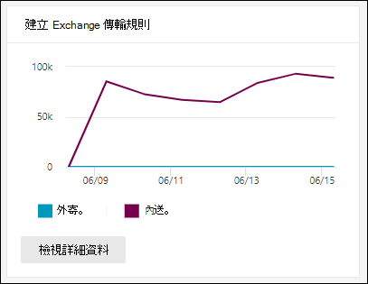
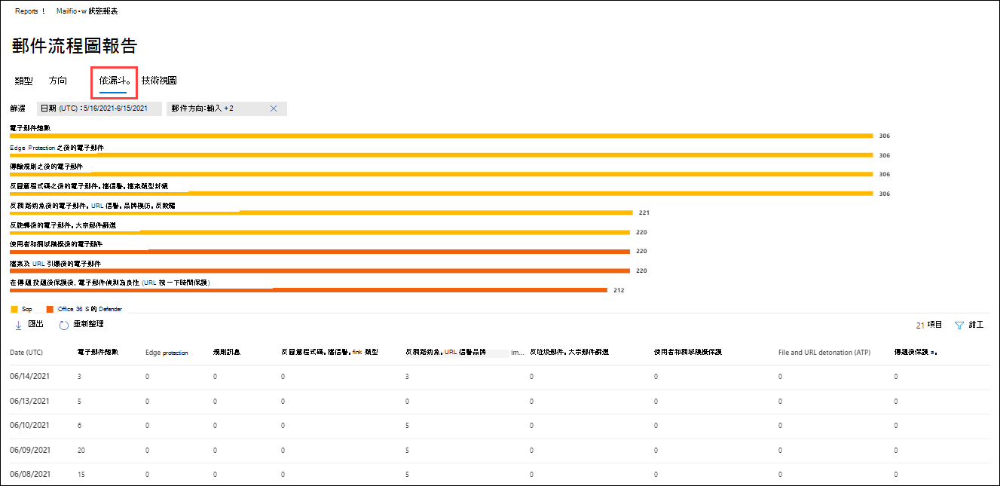
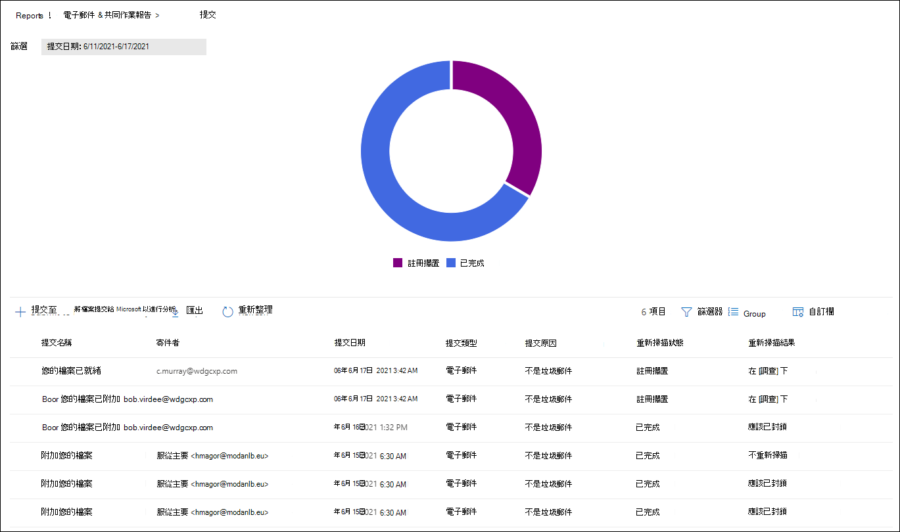

# 在 Microsoft 365 Defender 入口網站中查看電子郵件安全性報告View email security reports in the Microsoft 365 Defender portal

[!INCLUDE [Microsoft 365 Defender rebranding](../includes/microsoft-defender-for-office.md)]

**適用於****Applies to**
- [Exchange Online ProtectionExchange Online Protection](exchange-online-protection-overview.md)
- [適用於 Office 365 的 Microsoft Defender 方案 1 和方案 2Microsoft Defender for Office 365 plan 1 and plan 2](defender-for-office-365.md)
- [Microsoft 365 DefenderMicrosoft 365 Defender](../defender/microsoft-365-defender.md)

Microsoft 365 Defender 入口網站提供各種報告 <https://security.microsoft.com> ，可協助您觀察電子郵件安全性功能（例如 Microsoft 365 中的反垃圾郵件、反惡意程式碼和加密功能）如何保護您的組織。A variety of reports are available in the Microsoft 365 Defender portal at <https://security.microsoft.com> to help you see how email security features, such as anti-spam, anti-malware, and encryption features in Microsoft 365 are protecting your organization. 如果您有 [必要的許可權](#what-permissions-are-needed-to-view-these-reports)，您可以在 Microsoft 365 Defender 入口網站中查看這些報告，方式是要 **報告** \> **電子郵件 &** 共同作業 & 共同作業 \> **報告**。If you have the [necessary permissions](#what-permissions-are-needed-to-view-these-reports), you can view these reports in the Microsoft 365 Defender portal by going to **Reports** \> **Email & collaboration** \> **Email & collaboration reports**. 若要直接移至 [ **電子郵件 &** 共同作業報告] 頁面上，開啟 <https://security.microsoft.com/emailandcollabreport> 。To go directly to the **Email & collaboration reports** page, open <https://security.microsoft.com/emailandcollabreport>.

![Microsoft 365 Defender 入口網站中的電子郵件 & 共同作業報告] 頁面](../../media/email-collaboration-reports.png)

> [!NOTE]
>
> [ **電子郵件 & 協同報告** ] 頁面上的某些報告需要 Microsoft Defender for Office 365。Some of the reports on the **Email & collaboration reports** page require Microsoft Defender for Office 365. 如需這些報告的詳細資訊，請參閱 [在 Microsoft 365 Defender 入口網站中查看 Office 365 報告的 Defender](view-reports-for-mdo.md)。For information about these reports, see [View Defender for Office 365 reports in the Microsoft 365 Defender portal](view-reports-for-mdo.md).
>
> 與郵件流程相關的報告現在位於 Exchange 系統管理中心 (EAC) 。Reports that are related to mail flow are now in the Exchange admin center (EAC). 如需這些報告的詳細資訊，請參閱 [新 Exchange 系統管理中心的郵件流程報告](/exchange/monitoring/mail-flow-reports/mail-flow-reports)。For more information about these reports, see [Mail flow reports in the new Exchange admin center](/exchange/monitoring/mail-flow-reports/mail-flow-reports).

## 已遭破壞的使用者報告Compromised users report

> [!NOTE]
> 這份報告可在 Microsoft 365 組織中使用 Exchange Online 信箱。This report is available in Microsoft 365 organizations with Exchange Online mailboxes. 在獨立 Exchange Online Protection (EOP) 組織中無法使用此功能。It's not available in standalone Exchange Online Protection (EOP) organizations.

「已 **遭破壞的使用者** 報告」顯示顯示過去7天內已標示為 **可疑** 或 **限制** 的使用者帳戶數目。The **Compromised users** report shows shows the number of user accounts that were marked as **Suspicious** or **Restricted** within the last 7 days. 在上述任一狀態的帳戶都有問題或甚至遭到破壞。Accounts in either of these states are problematic or even compromised. 在經常使用的情況下，您可以使用報表來找出峰值，甚至是趨勢，也就是可疑或受限制的帳戶。With frequent use, you can use the report to spot spikes, and even trends, in suspicious or restricted accounts. 如需遭到破壞之使用者的詳細資訊，請參閱 [回應遭到破壞的電子郵件帳戶](responding-to-a-compromised-email-account.md)。For more information about compromised users, see [Responding to a compromised email account](responding-to-a-compromised-email-account.md).

匯總視圖會顯示過去90天的資料，詳細資料檢視會顯示過去30天的資料。The aggregate view shows data for the last 90 days and the detail view shows data for the last 30 days.

若要在 Microsoft 365 Defender 入口網站中查看報告，請移至 **Reports** \> **email & 協同** \> **電子郵件 &** 共同作業報告。To view the report in the Microsoft 365 Defender portal, go to **Reports** \> **Email & collaboration** \> **Email & collaboration reports**. 在 [ **電子郵件 &** 共同作業報告] 頁面上，尋找 **遭破壞的使用者** ，然後按一下 [ **查看詳細資料**]。On the **Email & collaboration reports** page, find **Compromised users** and then click **View details**. 若要直接前往報表，請開啟 <https://security.microsoft.com/reports/CompromisedUsers> 。To go directly to the report, open <https://security.microsoft.com/reports/CompromisedUsers>.

在 [已 **遭破壞的使用者** ] 頁面上，您可以按一下 [ **篩選** ]，然後在出現的飛出視窗中，選取下列一或多個值，以篩選圖表和詳細資料表格：On the **Compromised users** page, you can filter both the chart and the details table by clicking **Filter** and selecting one or more of the following values in the flyout that appears:

- **日期 (UTC)**： **開始日期** 和 **結束日期**。**Date (UTC)**: **Start date** and **End date**.
- **活動**：**Activity**:
  - **可疑**：使用者帳戶已傳送可疑的電子郵件，而且受到限制傳送電子郵件的風險。**Suspicious**: The user account has sent suspicious email and is at risk of being restricted from sending email.
  - **限制**：由於高度可疑的模式，使用者帳戶已限制傳送電子郵件。**Restricted**: The user account has been restricted from sending email due to highly suspicious patterns.

當您完成設定篩選 **時，請按一下 [** 套用]、[ **取消**] 或 [ **清除篩選**]。When you're finished configuring the filters, click **Apply**, **Cancel**, or **Clear filters**.

在圖形下方的 [詳細資料] 表格中，您可以看到下列詳細資料：In the details table below the graph, you can see the following details:

- **建立時間****Creation time**
- **User ID****User ID**
- **Action****Action**

## Exchange transport rule 報告Exchange transport rule report

**Exchange transport rule** report 會顯示郵件流程規則 (也稱為傳輸規則) 組織中內送和外寄郵件的效果。The **Exchange transport rule** report shows the effect of mail flow rules (also known as transport rules) on incoming and outgoing messages in your organization.

若要在 Microsoft 365 Defender 入口網站中查看報告，請移至 **Reports** \> **email & 協同** \> **電子郵件 &** 共同作業報告。To view the report in the Microsoft 365 Defender portal, go to **Reports** \> **Email & collaboration** \> **Email & collaboration reports**. 在 [ **電子郵件 &** 共同作業報告] 頁面上，尋找 [ **Exchange transport rule** ]，然後按一下 [ **查看詳細資料**]。On the **Email & collaboration reports** page, find **Exchange transport rule** and then click **View details**. 若要直接前往報表，請開啟 <https://security.microsoft.com/reports/ETRRuleReport> 。To go directly to the report, open <https://security.microsoft.com/reports/ETRRuleReport>.

在 [ **Exchange transport rule 報告** ] 頁面上，下列各節將說明可用的圖表和資料。On the **Exchange transport rule report** page, the available charts and data are described in the following sections.

### 依方向的圖表分解Chart breakdown by Direction

如果您 **依方向選取 [圖表分解**]，可使用下列圖表：If you select **Chart breakdown by Direction**, the follow charts are available:

- 透過 **Exchange 傳輸規則來查看資料**：受郵件流程規則影響的 **輸入** 和 **輸出** 郵件數目。**View data by Exchange transport rules**: The number of **Inbound** and **Outbound** messages that were affected by mail flow rules.
- **以 DLP Exchange 傳輸規則來查看資料**：受資料遺失防護 (DLP) 郵件流程規則所影響的 **輸入** 和 **輸出** 郵件數目。**View data by DLP Exchange transport rules**: The number of **Inbound** and **Outbound** messages that were affected by data loss prevention (DLP) mail flow rules.

下列資訊會顯示在圖形下方的詳細資料表格中：The following information is shown in the details table below the graph:

- **Date****Date**
- **Dlp 原則** (只 **依 dlp Exchange Transport rules 來查看資料**) **DLP policy** (**View data by DLP Exchange transport rules** only)
- **傳輸規則****Transport rule**
- **主旨****Subject**
- **寄件者位址****Sender address**
- **收件者位址****Recipient address**
- **嚴重性****Severity**
- **方向****Direction**

您可以在出現的浮出控制項中按一下 [ **篩選** ] 並選取下列其中一個或多個值，以篩選圖表和詳細資料表格：You can filter both the chart and the details table by clicking **Filter** and selecting one or more of the following values in the flyout that appears:

- **日期 (UTC)** **開始日期** 和 **結束日期****Date (UTC)** **Start date** and **End date**
- **方向**： **輸出** 和 **輸入****Direction**: **Outbound** and **Inbound**
- **嚴重性**： **高嚴重性**、 **中低嚴重性** 和 **低嚴重性****Severity**: **High severity**, **Medium severity**, and **Low severity**

當您完成設定篩選 **時，請按一下 [** 套用]、[ **取消**] 或 [ **清除篩選**]。When you're finished configuring the filters, click **Apply**, **Cancel**, or **Clear filters**.

### 依嚴重性的圖表細目Chart breakdown by Severity

如果您 **依嚴重性選取 [圖表分解**]，可使用下列圖表：If you select **Chart breakdown by Severity**, the follow charts are available:

- 透過 **Exchange 傳輸規則來查看資料**：**高嚴重性**、**中嚴重性** 和 **低嚴重性** 郵件的數目。**View data by Exchange transport rules**: The number of **High severity**, **Medium severity**, and **Low severity** messages. 您可以將嚴重性層級設定為規則 ([ **以嚴重性層級** 或 _SetAuditSeverity_) 審核此規則] 中的動作。You set the severity level as an action in the rule (**Audit this rule with severity level** or _SetAuditSeverity_). 如需詳細資訊，請參閱 [Exchange Online 中的郵件流程規則動作](/Exchange/security-and-compliance/mail-flow-rules/mail-flow-rule-actions)。For more information, see [Mail flow rule actions in Exchange Online](/Exchange/security-and-compliance/mail-flow-rules/mail-flow-rule-actions).

- **按 Dlp Exchange transport rules 來查看資料**：受 dlp 郵件流程規則影響的 **高嚴重性**、 **中嚴重性** 和 **低嚴重性** 郵件數目。**View data by DLP Exchange transport rules**: The number of **High severity**, **Medium severity**, and **Low severity** messages that were affected by DLP mail flow rules.

下列資訊會顯示在圖形下方的詳細資料表格中：The following information is shown in the details table below the graph:

- **Date****Date**
- **Dlp 原則** (只 **依 dlp Exchange Transport rules 來查看資料**) **DLP policy** (**View data by DLP Exchange transport rules** only)
- **傳輸規則****Transport rule**
- **主旨****Subject**
- **寄件者位址****Sender address**
- **收件者位址****Recipient address**
- **嚴重性****Severity**
- **方向****Direction**

您可以在出現的浮出控制項中按一下 [ **篩選** ] 並選取下列其中一個或多個值，以篩選圖表和詳細資料表格：You can filter both the chart and the details table by clicking **Filter** and selecting one or more of the following values in the flyout that appears:

- **日期 (UTC)** **開始日期** 和 **結束日期****Date (UTC)** **Start date** and **End date**
- **方向**： **輸出** 和 **輸入****Direction**: **Outbound** and **Inbound**
- **嚴重性**： **高嚴重性**、 **中低嚴重性** 和 **低嚴重性****Severity**: **High severity**, **Medium severity**, and **Low severity**

當您完成設定篩選 **時，請按一下 [** 套用]、[ **取消**] 或 [ **清除篩選**]。When you're finished configuring the filters, click **Apply**, **Cancel**, or **Clear filters**.

## 轉接報告Forwarding report

> [!NOTE]
> 您現在可以在 EAC 中使用轉寄 **報告** 。The **Forwarding report** is now available in the EAC. 如需詳細資訊，請參閱 [新 EAC 中的自動轉寄郵件報告](/exchange/monitoring/mail-flow-reports/mfr-auto-forwarded-messages-report)。For more information, see [Auto forwarded messages report in the new EAC](/exchange/monitoring/mail-flow-reports/mfr-auto-forwarded-messages-report).

## 郵件流程狀態報表Mailflow status report

**郵件流程狀態報表** 是一個智慧報告，顯示傳入和傳出電子郵件、垃圾郵件偵測、惡意程式碼、識別為「良好」之電子郵件的相關資訊，以及有關允許或封鎖在 edge 上之電子郵件的資訊。The **Mailflow status report** is a smart report that shows information about incoming and outgoing email, spam detections, malware, email identified as "good", and information about email allowed or blocked on the edge. 這是唯一包含 edge protection 資訊的報告，它會顯示在 Exchange Online Protection (EOP) 中，允許在評估之前封鎖多少封電子郵件。This is the only report that contains edge protection information, and shows just how much email is blocked before being allowed into the service for evaluation by Exchange Online Protection (EOP). 請務必瞭解，如果郵件傳送給五位收件者，我們會將其統計為五個不同的郵件，而不是一封郵件。It's important to understand that if a message is sent to five recipients we count it as five different messages and not one message.

若要在 Microsoft 365 Defender 入口網站中查看報告，請移至 **Reports** \> **email & 協同** \> **電子郵件 &** 共同作業報告。To view the report in the Microsoft 365 Defender portal, go to **Reports** \> **Email & collaboration** \> **Email & collaboration reports**. 在 [ **電子郵件 &** 共同作業報告] 頁面上，尋找 **郵件流程狀態摘要** ，然後按一下 [ **查看詳細資料**]。On the **Email & collaboration reports** page, find **Mailflow status summary** and then click **View details**. 若要直接前往報表，請開啟 <https://security.microsoft.com/reports/mailflowStatusReport> 。To go directly to the report, open <https://security.microsoft.com/reports/mailflowStatusReport>.

![[電子郵件 & 共同作業報告] 頁面上的 [郵件流程狀態摘要] 小工具](../../media/mail-flow-status-report-widget.png)

### 郵件流程狀態報表的類型視圖Type view for the Mailflow status report

當您開啟報表時，預設會選取 [ **類型** ] 索引標籤。When you open the report, the **Type** tab is selected by default. 根據預設，此視圖包含的圖表和詳細資料表格已設定為下列篩選：By default, this view contains a chart and a details table that's configured with the following filters:

- **日期 (UTC)** 過去7天。**Date (UTC)** The last 7 days.
- **郵件方向**：**Mail direction**:
  - **入境****Inbound**
  - **出境****Outbound**
  - **組織內**：此計數是針對承租人中的郵件，亦即**Intra-org**: this count is for messages within a tenant i.e 寄件者 abc@domain.com 會傳送至收件者 xyz@domain.com (與 **輸入** 和 **輸出**) 分開計數sender abc@domain.com sends to recipient xyz@domain.com  (counted separately from **Inbound** and **Outbound**)
- **類型**：**Type**:
  - **良好的郵件****Good mail**
  - **惡意程式碼****Malware**
  - **垃圾郵件****Spam**
  - **Edge protection****Edge protection**
  - **規則訊息****Rule messages**
  - **網路釣魚電子郵件****Phishing email**
- **網域**： **全部****Domain**: **All**

圖表是依 **類型** 值進行組織。The chart is organized by the **Type** values.

您可以按一下 [ **篩選器** ] 或按一下 [圖表圖例] 中的值來變更這些篩選。You can change these filters by clicking **Filter** or by clicking a value in the chart legend.

下列資訊會顯示在圖形下方的詳細資料表格中：The following information is shown in the details table below the graph:

- **方向****Direction**
- **類型****Type**
- **24 小時****24 hours**
- **3天****3 days**
- **7 天****7 days**
- **15 天****15 days**
- **30天****30 days**

如果您按一下 **[選擇類別] 以取得詳細資料**，您可以選取下列值：If you click **Choose a category for more details**, you can select from the following values:

- **網路釣魚電子郵件**：這項選擇會帶您前往「 [威脅防護狀態」報告](view-email-security-reports.md#threat-protection-status-report)。**Phishing email**: This selection takes you to the [Threat protection status report](view-email-security-reports.md#threat-protection-status-report).
- **電子郵件中的惡意** 代碼：這項選擇會帶您前往 [威脅防護狀態報表](view-email-security-reports.md#threat-protection-status-report)。**Malware in email**: This selection takes you to the [Threat protection status report](view-email-security-reports.md#threat-protection-status-report).
- **垃圾郵件** 偵測：這項選擇會帶您前往 [垃圾郵件偵測報告](view-email-security-reports.md#spam-detections-report)。**Spam detections**: This selection takes you to the [Spam Detections report](view-email-security-reports.md#spam-detections-report).
- **Edge 封鎖的垃圾郵件**：這項選擇會帶您前往 [垃圾郵件偵測報告](view-email-security-reports.md#spam-detections-report)。**Edge blocked spam**: This selection takes you to the [Spam Detections report](view-email-security-reports.md#spam-detections-report).

#### 從類型視圖匯出Export from Type view

在 [詳細資料] 視圖中，您只能匯出一天的資料。For the detail view, you can only export data for one day. 因此，如果您想要匯出資料7天，您必須做7種不同的匯出動作。So, if you want to export data for 7 days, you need to do 7 different export actions.

每個匯出的 .csv 檔會限制為150000列。Each exported .csv file is limited to 150,000 rows. 如果該天的資料包含超過150000列，則會建立多個 .csv 檔案。If the data for that day contains more than 150,000 rows, then multiple .csv files will be created.

### 郵件流程狀態報表的方向視圖Direction view for the Mailflow status report

如果您按一下 [ **方向** ] 索引標籤，則會使用 [ **類型** ] 視圖中的相同預設篩選器。If you click the **Direction** tab, the same default filters from the **Type** view are used.

圖表是依 **方向** 值進行組織。The chart is organized by **Direction** values.

您可以按一下 [ **篩選**] 以變更這些篩選。You can change these filters by clicking **Filter**. 會使用 [ **類型** ] 視圖中的相同篩選器。The same filters from the **Type** view are used.

詳細資料表格包含的資訊來自 **類型** view。The details table contains same information from the **Type** view.

[ **選擇類別** ] 如需詳細資料，可用的選取專案和行為與「 **類型** 」視圖相同。The **Choose a category for more details** available selections and behavior are the same as the **Type** view.

#### 從方向視圖匯出Export from Direction view

在 [詳細資料] 視圖中，您只能匯出一天的資料。For the detail view, you can only export data for one day. 因此，如果您想要匯出資料7天，您必須做7種不同的匯出動作。So, if you want to export data for 7 days, you need to do 7 different export actions.

每個匯出的 .csv 檔會限制為150000列。Each exported .csv file is limited to 150,000 rows. 如果該天的資料包含超過150000列，則會建立多個 .csv 檔案。If the data for that day contains more than 150,000 rows, then multiple .csv files will be created.

### 郵件流程狀態報表的漏斗視圖Funnel view for the Mailflow status report

**漏斗** 視圖顯示 Microsoft 的電子郵件威脅防護功能如何篩選組織中的內送和外寄電子郵件。The **Funnel** view shows you how Microsoft's email threat protection features filter incoming and outgoing email in your organization. 它提供有關電子郵件總數的詳細資訊，以及設定的威脅防護功能（包括 edge protection、反惡意程式碼、反網路釣魚、反垃圾郵件和反欺詐）對此計數的影響。It provides details on the total email count, and how the configured threat protection features, including edge protection, anti-malware, anti-phishing, anti-spam, and anti-spoofing affect this count.

如果您按一下 [ **漏斗** ] 索引標籤，此 view 預設會包含 [圖表] 和 [詳細資料] 表格設定為下列篩選：If you click the **Funnel** tab, by default, this view contains a chart and a details table that's configured with the following filters:

- **日期**：過去7天。**Date**: The last 7 days.

- **方向**：**Direction**:
  - **入境****Inbound**
  - **出境****Outbound**
  - **組織內**：此計數是針對在租使用者中傳送的郵件進行計數;亦即，寄件者 abc@domain.com 會傳送給收件者 xyz@domain.com (與輸入和外寄) 分開計數。**Intra-org**: This count is for messages sent within a tenant; i.e, sender abc@domain.com sends to recipient xyz@domain.com (counted separately from Inbound and Outbound).

匯總視圖和詳細資料表格視圖允許90天的篩選。The aggregate view and details table view allow for 90 days of filtering.

您可以按一下 [ **篩選**] 以變更這些篩選。You can change these filters by clicking **Filter**. 會使用 [ **類型** ] 視圖中的相同篩選器。The same filters from the **Type** view are used.

此圖顯示按下列方式組織的電子郵件計數：This chart shows the email count organized by:

- **電子郵件總數****Total email**
- **Edge protection 之後的電子郵件****Email after edge protection**
- **傳輸規則** (郵件流程規則之後的電子郵件) **Email after transport rule** (mail flow rule)
- **反惡意程式碼、檔信譽、檔案類型封鎖後的電子郵件****Email after anti-malware, file reputation, file type block**
- **反網路釣魚、URL 信譽、品牌模擬、反欺騙功能之後的電子郵件****Email after anti-phish, URL reputation, brand impersonation, anti-spoof**
- **反垃圾郵件、大宗郵件篩選後的電子郵件****Email after anti-spam, bulk mail filtering**
- **使用者和網域模擬後的電子郵件**\***Email after user and domain impersonation**\*
- **檔案及 URL 引爆後的電子郵件**\***Email after file and URL detonation**\*
- **在傳遞投遞後保護後，電子郵件偵測為良性 (URL 按一下時間保護)****Email detected as benign after post-delivery protection (URL click time protection)**

\*僅限 Office 365 的 Defender\* Defender for Office 365 only

若要個別查看以 EOP 或 Defender 為 Office 365 篩選的電子郵件，請按一下 [圖表圖例] 中的值。To view the email filtered by EOP or Defender for Office 365 separately, click on the value in the chart legend.

[詳細資料] 表格包含下列資訊（以遞減的日期順序顯示）：The details table contains the following information, shown in descending date order:

- **Date****Date**
- **電子郵件總數****Total email**
- **Edge protection****Edge protection**
- **反惡意程式碼、檔信譽、檔案類型封鎖**：**Anti-malware, file reputation, file type block**:
  - **檔信譽**：由於其他 Microsoft 客戶附加的檔案識別，因此篩選郵件。**File reputation**: Messages filtered due to identification of an attached file by other Microsoft customers.
  - **檔案類型封鎖**：由於郵件中識別的惡意檔案類型，篩選郵件。**File type block**: Messages filtered due to the type of malicious file identified in the message.
- **反網路釣魚、URL 信譽、品牌模仿、反欺騙**：**Anti-phish, URL reputation, Brand impersonation, anti-spoof**:
  - **URL 信譽**：由於其他 Microsoft 客戶的 url 身分識別而篩選的郵件。**URL reputation**: Messages filtered due to the identification of the URL by other Microsoft customers.
  - **品牌** 模擬：因為郵件是由眾所周知的品牌類比寄件者所過濾，所以會加以篩選。**Brand impersonation**: Messages filtered due to the message coming from well-known brand impersonating senders.
  - **反欺騙**：因為郵件企圖哄騙收件者所屬的網域，或是郵件寄件者不會擁有的網域，所以篩選掉郵件。**Anti-spoof**: Messages filtered due to the message attempting to spoof a domain that the recipient belongs to, or a domain that the message sender doesn't own.
- **反垃圾郵件，大宗郵件篩選**：**Anti-spam, bulk mail filtering**:
  - **大宗郵件篩選**：在反垃圾郵件原則中依據大量抱怨層級 (BCL) 臨界值篩選的郵件。**Bulk mail filtering**: Messages filtered based on the bulk complain level (BCL) threshold in an anti-spam policy.
- **Office 365) 的使用者和網域模擬 (Defender**：**User and domain impersonation (Defender for Office 365)**:
  - **使用者** 模擬：郵件因嘗試模擬使用者 (郵件寄件者) （已在反網路釣魚原則的類比保護設定中所定義）而篩選。**User impersonation**: Messages filtered due to an attempt to impersonate a user (message sender) that's defined in the impersonation protection settings of an anti-phishing policy.
  - **網域** 模擬：郵件因嘗試模擬防網路釣魚原則之類比保護設定中所定義的網域而篩選出來。**Domain impersonation**: Messages filtered due to an attempt to impersonate a domain that's defined in the impersonation protection settings of an anti-phishing policy.
- 檔案 **及 URL 引爆 (Defender for Office 365)**：**File and URL detonation (Defender for Office 365)**:
  - 檔案 **引爆**：以 Safe 附件原則篩選的郵件。**File detonation**: Messages filtered by a Safe Attachments policy.
  - **URL 引爆**：透過 Safe 連結原則篩選的郵件。**URL detonation**: Message filtered by a Safe Links policy.
- **投遞後保護和 zap (ATP) 或 zap (EOP)**：零小時自動清除 (針對惡意程式碼、垃圾郵件和網路釣魚的 ZAP) 。**Post-delivery protection and ZAP (ATP), or ZAP (EOP)**: Zero-hour auto purge (ZAP) for malware, spam, and phishing.

如果您選取 [詳細資料] 表格中的列，則會在飛入的電子郵件計數中顯示進一步細分。If you select a row in the details table, a further breakdown of the email counts are shown in the flyout.

#### 從漏斗視圖匯出Export from Funnel view

在 [**選項**] 下按一下 [**匯出**] 後，您可以選取下列其中一個值：After you click **Export** under **Options**, you can select one of the following values:

- **資料摘要 (，最多) 過去90天的資料****Summary (with data for last 90 days at most)**
- **詳細資料 (過去30天的資料，最多)****Details (with data for last 30 days at most)**

在 [ **日期**] 下，選擇範圍，然後 **按一下 [** 套用]。Under **Date**, choose a range, and then click **Apply**. 目前篩選的資料會匯出至 .csv 檔案。Data for the current filters will be exported to a .csv file.

每個匯出的 .csv 檔會限制為150000列。Each exported .csv file is limited to 150,000 rows. 如果資料包含超過150000列，則會建立多個 .csv 檔案。If the data contains more than 150,000 rows, then multiple .csv files will be created.

### 郵件流程狀態報表的技術視圖Tech view for the Mailflow status report

**技術視圖** 類似 **漏斗** 圖模式，可提供設定威脅防護功能的更細微細節。The **Tech view** is similar to the **Funnel** view, providing more granular details for the configured threat protections features. 您可以從圖表中查看郵件如何在威脅防護的不同階段進行分類。From the chart, you can see how messages are categorized at the different stages of threat protection.

如果您按一下 [ **技術視圖** ] 索引標籤，此視圖預設會包含 [圖表] 和 [詳細資料] 表格設定為下列篩選：If you click the **Tech view** tab, by default, this view contains a chart and a details table that's configured with the following filters:

- **日期**：過去7天。**Date**: The last 7 days.

- **方向**：**Direction**:
  - **入境****Inbound**
  - **出境****Outbound**
  - **組織內**：此計數是針對承租人中的郵件，亦即**Intra-org**: this count is for messages within a tenant i.e 寄件者 abc@domain.com 會傳送至收件者 xyz@domain.com (與輸入和輸出) 分開計數sender abc@domain.com sends to recipient xyz@domain.com (counted separately from Inbound and Outbound)

匯總視圖和詳細資料表格視圖允許90天的篩選。The aggregate view and details table view allow for 90 days of filtering.

您可以按一下 [ **篩選**] 以變更這些篩選。You can change these filters by clicking **Filter**. 會使用 [ **類型** ] 視圖中的相同篩選器。The same filters from the **Type** view are used.

此圖顯示組織成下列類別的郵件：This chart shows messages organized into the following categories:

- **電子郵件總數****Total email**
- **Edge 允許** 和 **edge 篩選****Edge allow** and **Edge filtered**
- 已篩選的 **傳輸規則允許** 和 **傳輸規則** (郵件流程規則) **Transport rule allow** and **Transport rule filtered** (mail flow rules)
- **非惡意** 代碼、 **Safe 附件偵測** \* 和 **反惡意程式碼引擎偵測****Not malware**, **Safe Attachments detection**\*, and **Anti-malware engine detection**
- **不是網路釣魚詐騙**、 **DMARC 失敗**、**模仿偵測** \* 、**欺騙偵測** 和 **網路釣魚偵測****Not phish**, **DMARC failure**, **Impersonation detection**\*, **Spoof detection**, and **Phish detection**
- **沒有偵測 URL 引爆** 及 **url 引爆偵測**\***No detection with URL detonation** and **URL detonation detection**\*
- **非垃圾郵件** 和  **垃圾郵件****Not spam** and  **Spam**
- **非惡意的電子郵件**、 **Safe 連結偵測** \* 和 **ZAP****Non-malicious email**, **Safe Links detection**\*, and **ZAP**

\*Office 365 的 Defender\* Defender for Office 365

當您將游標移到圖表中的某個類別時，您可以看到該類別中的郵件數目。When you hover over a category in the chart, you can see the number of messages in that category.

[詳細資料] 表格包含下列資訊（以遞減的日期順序顯示）：The details table contains the following information, shown in descending date order:

- **日期 (UTC)****Date (UTC)**
- **電子郵件總數****Total email**
- **已篩選 Edge****Edge filtered**
- **規則郵件**：由於郵件流程規則而篩選的郵件 (也稱為傳輸規則) 。**Rule messages**: Messages filtered due to  mail flow rules (also known as transport rules).
- **反惡意程式碼引擎**， **Safe 附件** \* ：**Anti-malware engine**, **Safe Attachments**\*:
- **DMARC，類比** \* ，**欺騙**，**網路釣魚篩選**：**DMARC, impersonation**\*, **spoof**, **phish filtered**:
  - **DMARC**：由於郵件失敗的 DMARC 驗證檢查而篩選的郵件。**DMARC**: Messages filtered due to the message failing its DMARC authentication check.
- **URL 引爆偵測**\***URL detonation detection**\*
- **已篩選的反垃圾郵件****Anti-spam filtered**
- **移除的 ZAP****ZAP removed**
- **Safe 連結偵測**\***Detection by Safe Links**\*

\*Office 365 的 Defender\* Defender for Office 365

如果您選取 [詳細資料] 表格中的列，則會在飛入的電子郵件計數中顯示進一步細分。If you select a row in the details table, a further breakdown of the email counts are shown in the flyout.

#### 從技術視圖匯出Export from Tech view

在按一下 [ **匯出**] 的 [ **選項** ] 底下，您可以選取下列其中一個值：On clicking **Export**, under **Options** you can select one of the following values:

- **資料摘要 (，最多) 過去90天的資料****Summary (with data for last 90 days at most)**
- **詳細資料 (過去30天的資料，最多)****Details (with data for last 30 days at most)**

在 [ **日期**] 下，選擇範圍，然後 **按一下 [** 套用]。Under **Date**, choose a range, and then click **Apply**. 目前篩選的資料會匯出至 .csv 檔案。Data for the current filters will be exported to a .csv file.

每個匯出的 .csv 檔會限制為150000列。Each exported .csv file is limited to 150,000 rows. 如果資料包含超過150000列，則會建立多個 .csv 檔案。If the data contains more than 150,000 rows, then multiple .csv files will be created.

## 惡意程式碼檢測報告Malware detections report

**惡意軟體偵測報告** 會顯示 Exchange Online Protection 或 EOP) 所偵測到的內送和外寄電子郵件， (惡意軟體偵測的相關資訊。The **Malware detections report** report shows information about malware detections in incoming and outgoing email messages (malware detected by Exchange Online Protection or EOP). 如需 EOP 中惡意程式碼保護的詳細資訊，請參閱 [EOP 中的反惡意程式碼保護](anti-malware-protection.md)。For more information about malware protection in EOP, see [Anti-malware protection in EOP](anti-malware-protection.md).

匯總 view 篩選允許90天，而 [詳細資料表格篩選] 只允許10天。The aggregate view filter allows for 90 days, while the details table filter only allows for 10 days.

若要在 Microsoft 365 Defender 入口網站中查看報告，請移至 **Reports** \> **email & 協同** \> **電子郵件 &** 共同作業報告。To view the report in the Microsoft 365 Defender portal, go to **Reports** \> **Email & collaboration** \> **Email & collaboration reports**. 在 [**電子郵件 &** 共同作業報告] 頁面上，尋找 [**在電子郵件中偵測到惡意** 代碼]，然後按一下 [ **View**On the **Email & collaboration reports** page, find **Malware detected in email** and then click **View details**. 若要直接前往報表，請開啟 <https://security.microsoft.com/reports/MalwareDetections> 。To go directly to the report, open <https://security.microsoft.com/reports/MalwareDetections>.

![電子郵件 & 協同報告] 頁面上電子郵件小工具中的惡意程式碼偵測](../../media/malware-detections-widget.png)

在 [ **惡意** 代碼偵測報告] 頁面上，您可以按一下 [ **篩選** ] 並選取下列其中一個值，以篩選圖表和詳細資料表格：On the **Malware detections report** page, you can filter both the chart and the details table by clicking **Filter** and selecting one of the following values:

- **日期 (UTC)** **開始日期** 和 **結束日期****Date (UTC)** **Start date** and **End date**
- **方向**： **輸入** 和 **輸出****Direction**: **Inbound** and **Outbound**

在圖形下方的 [詳細資料] 表格中，您可以看到下列詳細資料：In the details table below the graph, you can see the following details:

- **Date****Date**
- **寄件者位址****Sender address**
- **收件者位址****Recipient address**
- **郵件識別碼**：郵件頭的 **Message-ID** 標頭欄位中可用，且應該是唯一的。**Message ID**: Available in the **Message-ID** header field in the message header and should be unique. 範例值 `<08f1e0f6806a47b4ac103961109ae6ef@server.domain>` (記下角括弧) 。An example value is `<08f1e0f6806a47b4ac103961109ae6ef@server.domain>` (note the angle brackets).
- **主旨****Subject**
- **Filename****Filename**
- **惡意軟體名稱****Malware name**

## 郵件延遲報告Mail latency report

Office 365 的「中的 **郵件延遲報告**] 包含組織內的郵件傳遞和引爆延遲的資訊。The **Mail latency report** in Defender for Office 365 contains information on the mail delivery and detonation latency experienced within your organization. 如需詳細資訊，請參閱 [郵件延遲報告](view-reports-for-mdo.md#mail-latency-report)。For more information, see [Mail latency report](view-reports-for-mdo.md#mail-latency-report).

## 垃圾郵件偵測報告Spam detections report

> [!NOTE]
> **垃圾郵件偵測報告** 會最後移出。The **Spam detections report** will eventually go away. 「 [威脅防護狀態」報告](#threat-protection-status-report)中提供相同的資訊。The same information is available in the [Threat protection status report](#threat-protection-status-report).

## 欺騙偵測報告Spoof detections report

> [!NOTE]
> 本文中所述的 [已改進的欺騙偵測報告] 是預覽中所述，視情況而變更，並非所有組織都提供這些報告。The improved Spoof detections report as described in this article is in Preview, is subject to change, and is not available in all organizations. 較舊的報表版本只會顯示 **良好的郵件** ，而且會被 **視為垃圾** 郵件。The older version of the report shows only **Good mail** and **Caught as spam**.

**欺騙** 偵測報告會顯示因欺騙性而封鎖或允許的郵件相關資訊。The **Spoof detections** report shows information about messages that were blocked or allowed due to spoofing. 如需有關電子欺騙的詳細資訊，請參閱 [EOP 中的反欺騙防護](anti-spoofing-protection.md)。For more information about spoofing, see [Anti-spoofing protection in EOP](anti-spoofing-protection.md).

報表的匯總視圖允許45天的篩選 \* ，而詳細資料檢視只允許10天的篩選。The aggregate view of the report allows for 45 days of filtering\*, while the detail view only allows for ten days of filtering.

\* 最後，您將可以使用超過90天的篩選。\* Eventually, you'll be able to use up to 90 days of filtering.

若要在 Microsoft 365 Defender 入口網站中查看報告，請移至 **Reports** \> **email & 協同** \> **電子郵件 &** 共同作業報告。To view the report in the Microsoft 365 Defender portal, go to **Reports** \> **Email & collaboration** \> **Email & collaboration reports**. 在 [ **電子郵件 &** 共同作業報告] 頁面上，找出 **欺騙** 偵測，然後按一下 [ **查看詳細資料**]。On the **Email & collaboration reports** page, find **Spoof detections** and then click **View details**. 若要直接前往報表，請開啟 <https://security.microsoft.com/reports/SpoofMailReportV2> 。To go directly to the report, open <https://security.microsoft.com/reports/SpoofMailReportV2>.

![電子郵件 & 協同報告] 頁面上的欺騙偵測小工具](../../media/spoof-detections-widget.png)

此圖表顯示下列資訊：The chart shows the following information:

- **通過****Pass**
- **失敗****Fail**
- **SoftPass****SoftPass**
- **無****None**
- **其他****Other**

當您將滑鼠停留在圖表中的某一天 (資料點) 時，您可以看到偵測到的冒牌郵件數目及原因。When you hover over a day (data point) in the chart, you can see how many spoofed messages were detected and why.

在 [ **偽造郵件報告** ] 頁面上，您可以按一下 [ **篩選** ]，然後選取下列其中一個或多個值，以篩選圖表和詳細資料表格：On the **Spoof mail report** page, you can filter both the chart and the details table by clicking **Filter** and selecting one or more of the following values:

- **日期 (UTC)** **開始日期** 和 **結束日期****Date (UTC)** **Start date** and **End date**
- **結果**：**Result**:
  - **通過****Pass**
  - **失敗****Fail**
  - **SoftPass****SoftPass**
  - **無****None**
  - **其他****Other**
- **哄騙類型**： **Internal** 和 **External****Spoof type**: **Internal** and **External**

![Microsoft 365 Defender 入口網站中的 [偽造郵件報告] 頁面](../../media/spoof-detections-report-page.png)

在圖形下方的 [詳細資料] 表格中，您可以看到下列詳細資料：In the details table below the graph, you can see the following details:

- **Date****Date**
- **偽裝的使用者****Spoofed user**
- **傳送基礎結構****Sending infrastructure**
- **哄騙類型****Spoof type**
- **結果****Result**
- **結果代碼****Result code**
- **SPF****SPF**
- **DKIM****DKIM**
- **DMARC****DMARC**
- **訊息計數****Message count**

如需複合驗證結果代碼的詳細資訊，請參閱[反垃圾郵件郵件頭 in Microsoft 365](anti-spam-message-headers.md)。For more information about composite authentication result codes, see [Anti-spam message headers in Microsoft 365](anti-spam-message-headers.md).

## 提交報告Submissions report

**提交** 報告會顯示系統管理員針對分析報告之專案的相關資訊。The **Submissions** report shows information about items that admins have reported to Microsoft for analysis. 如需詳細資訊，請參閱 [使用系統管理員提交將可疑的垃圾郵件、網路釣魚、URLs 和檔案提交給 Microsoft](admin-submission.md)。For more information, see [Use Admin Submission to submit suspected spam, phish, URLs, and files to Microsoft](admin-submission.md).

若要在 Microsoft 365 Defender 入口網站中查看報告，請移至 **Reports** \> **email & 協同** \> **電子郵件 &** 共同作業報告。To view the report in the Microsoft 365 Defender portal, go to **Reports** \> **Email & collaboration** \> **Email & collaboration reports**. 在 [ **電子郵件 &** 共同作業報告] 頁面上，找到 [ **提交** ]，然後按一下 [ **查看詳細資料**]。On the **Email & collaboration reports** page, find **Submissions** and then click **View details**. 若要直接前往報表，請開啟 <https://security.microsoft.com/adminSubmissionReport> 。To go directly to the report, open <https://security.microsoft.com/adminSubmissionReport>. 若要移至 [Microsoft 365 Defender 入口網站中的系統管理提交](admin-submission.md)，按一下 [**移至提交**]。To go to [admin submissions in the Microsoft 365 Defender portal](admin-submission.md), click **Go to Submissions**.

![電子郵件 & 協同報告] 頁面上的提交小工具](../../media/submissions-report-widget.png)

此圖表顯示下列資訊：The chart shows the following information:

- **等待****Pending**
- **已完成****Completed**

在 [ **提交** ] 頁面上，您可以按一下 [ **篩選** ]，然後選取下列其中一個或多個值，以篩選圖表和詳細資料表格：On the **Submissions** page, you can filter both the chart and the details table by clicking **Filter** and selecting one or more of the following values:

- **報告日期**： **開始時間** 和 **結束時間****Date reported**: **Start time** and **End time**
- **提交類型**： **電子郵件**、 **URL** 或 **檔案****Submission type**: **Email**, **URL**, or **File**
- **提交識別碼****Submission ID**
- **網路消息識別碼****Network Message ID**
- **Sender****Sender**
- **名稱****Name**
- **提交者****Submitted by**
- **提交原因**： **非垃圾郵件**、 **網路釣魚詐騙**、 **惡意** 代碼或 **垃圾郵件****Reason for submitting**: **Not junk**, **Phish**, **Malware**, or **Spam**
- **重新掃描狀態**： **擱置** 或 **已完成****Rescan status**: **Pending** or **Completed**

圖表下方的 [詳細資料] 表格會顯示相同的資訊，並具有相同的 **群組** 或 **自訂欄** 選項，與在 **電子郵件 &** 共同作業報送中 **提交的 [分析**] 索引標籤 \> \*\*\*\*。The details table below the graph shows the same information and has the same **Group** or **Customize columns** options as on the **Submitted for analysis** tab at **Email & collaboration** \> **Submissions**. 如需詳細資訊，請參閱 [View admin 報送 To Microsoft](admin-submission.md#view-admin-submissions-to-microsoft)。For more information, see [View admin submissions to Microsoft](admin-submission.md#view-admin-submissions-to-microsoft).

## 威脅防護狀態報告Threat protection status report

「**威脅防護狀態**」報告適用于 EOP 和 Defender Office 365;不過，報告包含不同的資料。The **Threat protection status** report is available in both EOP and Defender for Office 365; however, the reports contain different data. 例如，EOP 客戶可以查看在電子郵件中偵測到惡意程式碼的相關資訊，但不會[Safe SharePoint、OneDrive 及 Microsoft Teams 的附件](mdo-for-spo-odb-and-teams.md)所偵測到之惡意檔案的相關資訊。For example, EOP customers can view information about malware detected in email, but not information about malicious files detected by [Safe Attachments for SharePoint, OneDrive, and Microsoft Teams](mdo-for-spo-odb-and-teams.md).

該報告提供包含惡意內容的電子郵件統計，例如檔案或網站位址 (URLs 反惡意程式碼引擎封鎖的) 、[零小時的自動清除 (ZAP) ](zero-hour-auto-purge.md)，以及[在反網路釣魚原則中](set-up-anti-phishing-policies.md#exclusive-settings-in-anti-phishing-policies-in-microsoft-defender-for-office-365)Office 365[連結](safe-links.md)、 [Safe 附件](safe-attachments.md)和模擬保護功能等 Safe 功能。The report provides the count of email messages with malicious content, such as files or website addresses (URLs) that were blocked by the anti-malware engine, [zero-hour auto purge (ZAP)](zero-hour-auto-purge.md), and Defender for Office 365 features like [Safe Links](safe-links.md), [Safe Attachments](safe-attachments.md), and [impersonation protection features in anti-phishing policies](set-up-anti-phishing-policies.md#exclusive-settings-in-anti-phishing-policies-in-microsoft-defender-for-office-365). 您可以使用此資訊來識別趨勢，或判斷組織原則是否需要調整。You can use this information to identify trends or determine whether organization policies need adjustment.

**附注：請** 務必瞭解，如果郵件傳送給五位收件者，我們會將其統計為五個不同的郵件，而不是一封郵件。**Note**: It's important to understand that if a message is sent to five recipients we count it as five different messages and not one message.

若要在 Microsoft 365 Defender 入口網站中查看報告，請移至 **Reports** \> **email & 協同** \> **電子郵件 &** 共同作業報告。To view the report in the Microsoft 365 Defender portal, go to **Reports** \> **Email & collaboration** \> **Email & collaboration reports**. 在 [ **電子郵件 & 協同報告** ] 頁面上，找出 **威脅防護狀態** ，然後按一下 [ **查看詳細資料**]。On the **Email & collaboration reports** page, find **Threat protection status** and then click **View details**. 若要直接前往報告，請開啟下列其中一個 URLs：To go directly to the report, open one of the following URLs:

- Office 365 的 Defender：<https://security.microsoft.com/reports/TPSAggregateReportATP>Defender for Office 365: <https://security.microsoft.com/reports/TPSAggregateReportATP>
- EOP <https://security.microsoft.com/reports/TPSAggregateReport>EOP: <https://security.microsoft.com/reports/TPSAggregateReport>

根據預設，圖表會顯示過去7天的資料。By default, the chart shows data for the past 7 days. 如果您按一下 [**威脅防護狀態報表**] 頁面上的 [**篩選**]，您可以選取90天的日期範圍 (試用訂閱可能限制為30天) 。If you click **Filter** on the **Threat protection status report** page, you can select a 90 day date range (trial subscriptions might be limited to 30 days). [詳細資料] 表格允許篩選30天。The details table allows filtering for 30 days.

下列各節將說明可用的視圖。The available views are described in the following sections.

### 依概覽查看資料View data by Overview

在 [ **依一覽查看資料** ] 視圖中，下列偵測資訊會顯示在圖表中：In the **View data by Overview** view, the following detection information is shown in the chart:

- **電子郵件惡意程式碼****Email malware**
- **電子郵件網路釣魚****Email phish**
- **內容惡意程式碼****Content malware**

圖表下沒有詳細資料表格可用。No details table is available below the chart.

如果您按一下 [ **篩選**]，則可以使用下列篩選器：If you click **Filter**, the following filters are available:

- **日期 (UTC)** **開始日期** 和 **結束日期****Date (UTC)** **Start date** and **End date**
- **偵測**：**電子郵件惡意** 代碼、**電子郵件網路釣魚** 或 **內容惡意** 代碼**Detection**: **Email malware**, **Email phish**, or **Content malware**
- **受保護**： **MDO** (Office 365) 或 **EOP** 的 Defender**Protected by**: **MDO** (Defender for Office 365) or **EOP**
- **標記**：依已套用指定使用者標記的使用者或群組來篩選結果 (包含優先順序帳戶) 。**Tag**: Filter the results by users or groups that have had the specified user tag applied (including priority accounts). 如需使用者標記的相關資訊，請參閱 [user tags](user-tags.md)。For more information about user tags, see [User tags](user-tags.md).
- **方向****Direction**
- **網域****Domain**
- **原則類型****Policy type**

當您完成設定篩選 **時，請按一下 [** 套用]、[ **取消**] 或 [ **清除篩選**]。When you're finished configuring the filters, click **Apply**, **Cancel**, or **Clear filters**.

### 透過偵測技術透過電子郵件 \> 網路釣魚和圖表細目來查看資料View data by Email \> Phish and Chart breakdown by Detection Technology

在 [透過 **電子郵件 \> 網路釣魚詐騙** ] 和 [ **依偵測方式顯示圖表明細] 技術** 視圖中，下列資訊會顯示在圖表中：In the **View data by Email \> Phish** and **Chart breakdown by Detection Technology** view, the following information is shown in the chart:

- **URL 惡意信譽** \* ：從其他 Microsoft 365 客戶的 Office 365 detonations 中的 Defender 產生惡意 URL 信譽。**URL malicious reputation**\*: Malicious URL reputation generated from Defender for Office 365 detonations in other Microsoft 365 customers.
- **Advanced filter**：以機器學習為基礎的網路釣魚信號。**Advanced filter**: Phishing signals based on machine learning.
- **一般篩選**：根據分析規則的網路釣魚信號。**General filter**: Phishing signals based on analyst rules.
- **組織內的欺騙**：寄件者嘗試欺騙收件者網域。**Spoof intra-org**: Sender is trying to spoof the recipient domain.
- **欺騙外部網域**：寄件者正嘗試哄騙其他一些網域。**Spoof external domain**: Sender is trying to spoof some other domain.
- **哄騙 DMARC**：郵件上的 DMARC 驗證失敗。**Spoof DMARC**: DMARC authentication failure on messages.
- 模擬 **商標**：模擬以寄件者為基礎的知名品牌。**Impersonation brand**: Impersonation of well-known brands based on senders.
- **混合式分析偵測****Mixed analysis detection**
- **檔信譽****File reputation**
- **指紋比對****Fingerprint matching**
- **URL 引爆信譽**\***URL detonation reputation**\*
- **URL 引爆**\***URL detonation**\*
- **類比使用者**\***Impersonation user**\*
- **類比網域** \* ：模仿客戶擁有或定義的網域。**Impersonation domain**\*: Impersonation of domains that the customer owns or defines.
- **信箱智慧** 模擬 \* ：由系統管理員定義或透過信箱智慧學出的使用者類比。**Mailbox intelligence impersonation**\*: Impersonation of users defined by admin or learned through mailbox intelligence.
- **檔引爆**\***File detonation**\*
- **運動**\***Campaign**\*

在圖表下方的 [詳細資料] 表格中，可使用下列資訊：In the details table below the chart, the following information is available:

- **Date****Date**
- **主旨****Subject**
- **Sender****Sender**
- **收件者****Recipients**
- **偵測到****Detected by**
- **傳遞狀態****Delivery Status**
- **受損來源****Source of Compromise**
- **標記****Tags**

如果您按一下 [ **篩選**]，則可以使用下列篩選器：If you click **Filter**, the following filters are available:

- **日期 (UTC)** **開始日期** 和 **結束日期****Date (UTC)** **Start date** and **End date**
- **偵測****Detection**
- **受保護**： **MDO** (Office 365) 或 **EOP** 的 Defender**Protected by**: **MDO** (Defender for Office 365) or **EOP**
- **方向****Direction**
- **標記**：依已套用指定使用者標記的使用者或群組來篩選結果 (包含優先順序帳戶) 。**Tag**: Filter the results by users or groups that have had the specified user tag applied (including priority accounts). 如需使用者標記的相關資訊，請參閱 [user tags](user-tags.md)。For more information about user tags, see [User tags](user-tags.md).
- **網域****Domain**
- **原則類型****Policy type**
- **原則名稱** (詳細資料] 表格) **Policy name** (details table only)
- **收件者****Recipients**

當您完成設定篩選 **時，請按一下 [** 套用]、[ **取消**] 或 [ **清除篩選**]。When you're finished configuring the filters, click **Apply**, **Cancel**, or **Clear filters**.

### 透過電子郵件 \> 惡意程式碼和偵測技術的圖表細目來查看資料View data by Email \> Malware and Chart breakdown by Detection Technology

在 [透過 **電子郵件 \> 惡意** 代碼和 **依偵測方式顯示圖表的** 資料] 技術視圖中，下列資訊會顯示在圖表中：In the **View data by Email \> Malware** and **Chart breakdown by Detection Technology** view, the following information is shown in the chart:

- 檔案 **引爆** \* ： Safe 附件的偵測。**File detonation**\*: Detection by Safe Attachments.
- 檔案 **引爆信譽** \* ：所有由 Defender 為 Office 365 detonations 所產生的惡意檔信譽。**File detonation reputation**\*: All malicious file reputation generated by Defender for Office 365 detonations.
- **檔信譽****File reputation**
- **反惡意程式碼引擎** \* ：從反惡意程式碼引擎偵測。**Anti-malware engine**\*: Detection from anti-malware engines.
- **反惡意程式碼原則檔案類型封鎖**：由於郵件中所識別的惡意檔案類型，郵件會篩選掉這些電子郵件。**Anti-malware policy file type block**: These are email messages filtered out due to the type of malicious file identified in the message.
- **URL 惡意信譽****URL malicious reputation**
- **URL 引爆****URL detonation**
- **URL 引爆信譽****URL detonation reputation**
- **行銷活動****Campaign**

在圖表下方的 [詳細資料] 表格中，可使用下列資訊：In the details table below the chart, the following information is available:

- **Date****Date**
- **主旨****Subject**
- **Sender****Sender**
- **收件者****Recipients**
- **偵測到****Detected by**
- **傳遞狀態****Delivery Status**
- **受損來源****Source of Compromise**
- **標記****Tags**

如果您按一下 [ **篩選**]，則可以使用下列篩選器：If you click **Filter**, the following filters are available:

- **日期 (UTC)** **開始日期** 和 **結束日期****Date (UTC)** **Start date** and **End date**
- **偵測****Detection**
- **受保護**： **MDO** (Office 365) 或 **EOP** 的 Defender**Protected by**: **MDO** (Defender for Office 365) or **EOP**
- **方向****Direction**
- **標記**：依已套用指定使用者標記的使用者或群組來篩選結果 (包含優先順序帳戶) 。**Tag**: Filter the results by users or groups that have had the specified user tag applied (including priority accounts). 如需使用者標記的相關資訊，請參閱 [user tags](user-tags.md)。For more information about user tags, see [User tags](user-tags.md).
- **網域****Domain**
- **原則類型****Policy type**
- **原則名稱** (詳細資料] 表格) **Policy name** (details table only)
- **收件者****Recipients**

當您完成設定篩選 **時，請按一下 [** 套用]、[ **取消**] 或 [ **清除篩選**]。When you're finished configuring the filters, click **Apply**, **Cancel**, or **Clear filters**.

### 依電子郵件 \> 網路釣魚或透過電子郵件惡意程式碼查看資料的方式，依原則類型分類的圖表 \>Chart breakdown by Policy type and View data by Email \> Phish or View data by Email \> Malware

在 [ **依原則類型的圖表分解** ] 和 [透過電子郵件惡意程式碼 **查看資料 \>** ] 或 [透過 **電子郵件 \> 惡意程式碼查看資料** ] 視圖中，圖表會顯示下列資訊：In the **Chart breakdown by Policy type** and **View data by Email \> Phish** or **View data by Email \> Malware** views, the following information is shown in the charts:

- **反惡意程式碼****Anti-malware**
- **Safe附件**\***Safe Attachments**\*
- **反網路釣魚****Anti-phish**
- **反垃圾郵件****Anti-spam**
- **郵件流程規則** (也稱為傳輸規則) **Mail flow rule** (also known as a transport rule)
- **別人****Others**

在圖表下方的 [詳細資料] 表格中，可使用下列資訊：In the details table below the chart, the following information is available:

- **Date****Date**
- **主旨****Subject**
- **Sender****Sender**
- **收件者****Recipients**
- **偵測到****Detected by**
- **傳遞狀態****Delivery Status**
- **受損來源****Source of Compromise**
- **標記****Tags**

如果您按一下 [ **篩選**]，則可以使用下列篩選器：If you click **Filter**, the following filters are available:

- **日期 (UTC)** **開始日期** 和 **結束日期****Date (UTC)** **Start date** and **End date**
- **偵測****Detection**
- **受保護**： **MDO** (Office 365) 或 **EOP** 的 Defender**Protected by**: **MDO** (Defender for Office 365) or **EOP**
- **方向****Direction**
- **標記**：依已套用指定使用者標記的使用者或群組來篩選結果 (包含優先順序帳戶) 。**Tag**: Filter the results by users or groups that have had the specified user tag applied (including priority accounts). 如需使用者標記的相關資訊，請參閱 [user tags](user-tags.md)。For more information about user tags, see [User tags](user-tags.md).
- **網域****Domain**
- **原則類型****Policy type**
- **原則名稱** (詳細資料] 表格) **Policy name** (details table only)
- **收件者****Recipients**

當您完成設定篩選 **時，請按一下 [** 套用]、[ **取消**] 或 [ **清除篩選**]。When you're finished configuring the filters, click **Apply**, **Cancel**, or **Clear filters**.

### 透過電子郵件 \> 網路釣魚或透過電子郵件惡意程式碼查看資料，依傳遞狀態與查看資料的圖表細目 \>Chart breakdown by Delivery status and View data by Email \> Phish or View data by Email \> Malware

在 **圖表** 中透過 **電子郵件 \> 網路釣魚** 或透過電子郵件 **\> 惡意** 代碼查看資料來查看資料，圖表會顯示下列資訊：In the **Chart breakdown by Delivery status** and **View data by Email \> Phish** or **View data by Email \> Malware** views, the following information is shown in the charts:

- **主控信箱：收件匣****Hosted mailbox: Inbox**
- **主控信箱：垃圾郵件****Hosted mailbox: Junk**
- **主控信箱：自訂資料夾****Hosted mailbox: Custom folder**
- **主控信箱：刪除的郵件****Hosted mailbox: Deleted items**
- **轉發****Forwarded**
- **內部部署伺服器：已傳送****On-premises server: Delivered**
- **隔離區****Quarantine**
- **傳遞失敗****Delivery failed**
- **下降****Dropped**

在圖表下方的 [詳細資料] 表格中，可使用下列資訊：In the details table below the chart, the following information is available:

- **Date****Date**
- **主旨****Subject**
- **Sender****Sender**
- **收件者****Recipients**
- **偵測到****Detected by**
- **傳遞狀態****Delivery Status**
- **受損來源****Source of Compromise**
- **標記****Tags**

如果您按一下 [ **篩選**]，則可以使用下列篩選器：If you click **Filter**, the following filters are available:

- **日期 (UTC)** **開始日期** 和 **結束日期****Date (UTC)** **Start date** and **End date**
- **偵測****Detection**
- **受保護**： **MDO** (Office 365) 或 **EOP** 的 Defender**Protected by**: **MDO** (Defender for Office 365) or **EOP**
- **方向****Direction**
- **標記**：依已套用指定使用者標記的使用者或群組來篩選結果 (包含優先順序帳戶) 。**Tag**: Filter the results by users or groups that have had the specified user tag applied (including priority accounts). 如需使用者標記的相關資訊，請參閱 [user tags](user-tags.md)。For more information about user tags, see [User tags](user-tags.md).
- **網域****Domain**
- **原則類型****Policy type**
- **原則名稱** (詳細資料] 表格) **Policy name** (details table only)
- **收件者****Recipients**

當您完成設定篩選 **時，請按一下 [** 套用]、[ **取消**] 或 [ **清除篩選**]。When you're finished configuring the filters, click **Apply**, **Cancel**, or **Clear filters**.

### 依惡意程式碼查看資料 \>View data by Content \> Malware

在 [**依內容 \> 惡意** 代碼查看資料] 視圖中，下列資訊會顯示在適用于 Office 365 組織的 Microsoft Defender 圖表中：In the **View data by Content \> Malware** view, the following information is shown in the chart for Microsoft Defender for Office 365 organizations:

- **反惡意程式碼引擎**： [Microsoft 365 中內建的病毒偵測](virus-detection-in-spo.md)，在 Sharepoint、OneDrive 及 Microsoft Teams 中偵測到惡意檔案。**Anti-malware engine**: Malicious files detected in Sharepoint, OneDrive, and Microsoft Teams by the [built-in virus detection in Microsoft 365](virus-detection-in-spo.md).
- 檔案 **引爆**： [Safe SharePoint、OneDrive 及 Microsoft Teams 的附件](mdo-for-spo-odb-and-teams.md)所偵測到的惡意檔案。**File detonation**: Malicious files detected by [Safe Attachments for SharePoint, OneDrive, and Microsoft Teams](mdo-for-spo-odb-and-teams.md).

在圖表下方的 [詳細資料] 表格中，可使用下列資訊：In the details table below the chart, the following information is available:

- **日期 (UTC)** **開始日期** 和 **結束日期****Date (UTC)** **Start date** and **End date**
- **位置****Location**
- **偵測到****Detected by**
- **惡意軟體名稱****Malware name**

如果您按一下 [ **篩選**]，則可以使用下列篩選器：If you click **Filter**, the following filters are available:

- **日期 (UTC)** **開始日期** 和 **結束日期****Date (UTC)** **Start date** and **End date**
- **偵測**： **反惡意程式碼引擎** 或 **檔引爆****Detection**: **Anti-malware engine** or **File detonation**

當您完成設定篩選 **時，請按一下 [** 套用]、[ **取消**] 或 [ **清除篩選**]。When you're finished configuring the filters, click **Apply**, **Cancel**, or **Clear filters**.

### 依系統覆寫查看資料View data by System override

在 [ **依系統覆寫查看資料** ] 視圖中，下列的覆寫原因資訊會顯示在圖表中：In the **View data by System override** view, the following override reason information is shown in the chart:

- **內部部署略過****On-premises skip**
- **IP 允許****IP allow**
- **Exchange 郵件傳輸規則** (郵件流程規則) **Exchange mail transport rule** (mail flow rule)
- **組織允許的寄件者****Organization allowed senders**
- **組織允許的網域****Organization allowed domains**
- **未啟用的 ZAP****ZAP not enabled**
- **未啟用垃圾郵件資料夾****Junk Mail folder not enabled**
- **使用者 Safe 寄件者****User Safe Sender**
- **使用者 Safe 網域****User Safe Domain**

在圖表下方的 [詳細資料] 表格中，可使用下列資訊：In the details table below the chart, the following information is available:

- **Date****Date**
- **主旨****Subject**
- **Sender****Sender**
- **收件者****Recipients**
- **偵測到****Detected by**
- **傳遞狀態****Delivery Status**
- **受損來源****Source of Compromise**
- **標記****Tags**

如果您按一下 [ **篩選**]，則可以使用下列篩選器：If you click **Filter**, the following filters are available:

- **日期 (UTC)** **開始日期** 和 **結束日期****Date (UTC)** **Start date** and **End date**
- **偵測****Detection**
- **受保護**： **MDO** (Office 365) 或 **EOP** 的 Defender**Protected by**: **MDO** (Defender for Office 365) or **EOP**
- **方向****Direction**
- **標記**：依已套用指定使用者標記的使用者或群組來篩選結果 (包含優先順序帳戶) 。**Tag**: Filter the results by users or groups that have had the specified user tag applied (including priority accounts). 如需使用者標記的相關資訊，請參閱 [user tags](user-tags.md)。For more information about user tags, see [User tags](user-tags.md).
- **網域****Domain**
- **原則類型****Policy type**
- **原則名稱** (詳細資料] 表格) **Policy name** (details table only)
- **收件者****Recipients**

當您完成設定篩選 **時，請按一下 [** 套用]、[ **取消**] 或 [ **清除篩選**]。When you're finished configuring the filters, click **Apply**, **Cancel**, or **Clear filters**.

\*僅限 Office 365 的 Defender\* Defender for Office 365 only

## 主要惡意程式碼報告Top malware report

**主要惡意** 代碼報告會顯示 [EOP 中的反惡意程式碼防護](anti-malware-protection.md)所偵測到的各種惡意程式碼。The **Top malware** report shows the various kinds of malware that was detected by [anti-malware protection in EOP](anti-malware-protection.md).

若要在 Microsoft 365 Defender 入口網站中查看報告，請移至 **Reports** \> **email & 協同** \> **電子郵件 &** 共同作業報告。To view the report in the Microsoft 365 Defender portal, go to **Reports** \> **Email & collaboration** \> **Email & collaboration reports**. 在 [ **電子郵件 &** 共同作業報告] 頁面上，尋找 [ **主要惡意** 代碼]，然後按一下 [ **詳細資料**]。On the **Email & collaboration reports** page, find **Top malware** and then click **View details**. 若要直接前往報表，請開啟 <https://security.microsoft.com/reports/TopMalware> 。To go directly to the report, open <https://security.microsoft.com/reports/TopMalware>.

當您將游標移到圓形圖中的楔形上方時，您可以看到惡意程式碼類型的名稱，以及偵測到該惡意程式碼的郵件數目。When you hover over a wedge in the pie chart, you can see the name of a kind of malware and how many messages were detected as having that malware.

在「 **主要惡意程式碼報告** 」頁面上，報表頁面上會顯示較大的餅版本圖表。圖表下方的 [詳細資料] 表格會顯示下列資訊：On the **Top malware report** page, a larger version of the pie chart is displayed on the report page.The details table below the chart shows the following information:

- **主要惡意程式碼****Top malware**
- **Count****Count**

如果您按一下 [ **篩選**]，您可以指定具有 **開始日期** 和 **結束日期** 的日期範圍。If you click **Filter**, you can specify a date range with **Start date** and **End date**.

## URL 威脅防護報告URL threat protection report

Office 365 的「 **URL 威脅防護」報告** 可用於的 Microsoft Defender。The **URL threat protection report** is available in Microsoft Defender for Office 365. 如需詳細資訊，請參閱 [URL 威脅防護報告](view-reports-for-mdo.md#url-threat-protection-report)。For more information, see [URL threat protection report](view-reports-for-mdo.md#url-threat-protection-report).

## 使用者報告的訊息報告User reported messages report

> [!IMPORTANT]
> 為了讓 **使用者報告的訊息** 報告正確運作，必須為您的 Microsoft 365 環境 **開啟審核記錄**。In order for the **User reported messages** report to work correctly, **audit logging must be turned on** for your Microsoft 365 environment. 這項工作通常是由在 Exchange Online 中獲派稽核記錄角色的人員完成。This is typically done by someone who has the Audit Logs role assigned in Exchange Online. 如需詳細資訊，請參閱[開啟或關閉 Microsoft 365 審核記錄搜尋](../../compliance/turn-audit-log-search-on-or-off.md)。For more information, see [Turn Microsoft 365 audit log search on or off](../../compliance/turn-audit-log-search-on-or-off.md).

「 **使用者報告的訊息** 報告」顯示使用者已使用 [報告郵件增益集](enable-the-report-message-add-in.md) 或 [報告網路釣魚增益集](enable-the-report-phish-add-in.md)舉報為垃圾郵件、網路釣魚企圖或良好郵件的相關資訊。The **User reported messages** report shows information about email messages that users have reported as junk, phishing attempts, or good mail by using the [Report Message add-in](enable-the-report-message-add-in.md) or the [Report Phishing add-in](enable-the-report-phish-add-in.md).

若要在 Microsoft 365 Defender 入口網站中查看報告，請移至 **Reports** \> **email & 協同** \> **電子郵件 &** 共同作業報告。To view the report in the Microsoft 365 Defender portal, go to **Reports** \> **Email & collaboration** \> **Email & collaboration reports**. 在 [ **電子郵件 &** 共同作業報告] 頁面上，找出 **使用者報告的訊息** ，然後按一下 [ **查看詳細資料**]。On the **Email & collaboration reports** page, find **User reported messages** and then click **View details**. 若要直接前往報表，請開啟 <https://security.microsoft.com/reports/userSubmissionReport> 。To go directly to the report, open <https://security.microsoft.com/reports/userSubmissionReport>. 若要移至 [Microsoft 365 Defender 入口網站中的系統管理提交](admin-submission.md)，按一下 [**移至提交**]。To go to [admin submissions in the Microsoft 365 Defender portal](admin-submission.md), click **Go to Submissions**.

在 [ **使用者報告的郵件** ] 頁面上，您可以按一下 [ **篩選** ]，然後在出現的浮出控制項中，選取下列一或多個值，以篩選圖表和詳細資料表格：On the **User reported messages** page, you can filter both the chart and the details table by clicking **Filter** and selecting one or more of the following values in the flyout that appears:

- **報告日期**： **開始時間** 和 **結束時間****Date reported**: **Start time** and **End time**
- **報告者****Reported by**
- **電子郵件主旨****Email subject**
- **訊息報告識別碼****Message reported ID**
- **網路消息識別碼****Network Message ID**
- **Sender****Sender**
- **報告原因****Reported reason**
  - **非垃圾郵件****Not junk**
  - **網路釣魚****Phish**
  - **垃圾郵件****Spam**
- **網路釣魚模擬**： **是** 或 **否****Phish simulation**: **Yes** or **No**

當您完成設定篩選 **時，請按一下 [** 套用]、[ **取消**] 或 [ **清除篩選**]。When you're finished configuring the filters, click **Apply**, **Cancel**, or **Clear filters**.

若要群組專案，請按一下 [ **群組** ]，然後從下拉式清單中選取下列其中一個值：To group the entries, click **Group** and select one of the following values from the drop down list:

- **無****None**
- **原因****Reason**
- **Sender****Sender**
- **報告者****Reported by**
- **重新掃描結果****Rescan result**
- **網路釣魚模擬模擬****Phish simulation**

在圖形下方的 [詳細資料] 表格中，您可以看到下列詳細資料：In the details table below the graph, you can see the following details:

- **電子郵件主旨****Email subject**
- **報告者****Reported by**
- **報告日期****Date reported**
- **Sender****Sender**
- **報告原因****Reported reason**
- **重新掃描結果****Rescan result**
- **標記****Tags**

若要將郵件提交給 Microsoft 進行分析，請選取表格中的訊息項目，按一下 [ **提交給 Microsoft 進行分析** ]，然後從下拉式清單中選取下列其中一個值：To submit a message to Microsoft for analysis, select the message entry from the table, click **Submit to Microsoft for analysis** and then select one of the following values from the drop down list:

- **報告清理****Report clean**
- **報告網路釣魚****Report phishing**
- **報告惡意程式碼****Report malware**
- **報告垃圾郵件**'**Report spam**'
- Office 365) 的 **觸發調查** (Defender**Trigger investigation** (Defender for Office 365)

## 查看這些報表所需的許可權為何？What permissions are needed to view these reports?

為了查看和使用本文所述的報表，您必須是 Microsoft 365 Defender 入口網站中下列其中一個角色群組的成員：In order to view and use the reports described in this article, you need to be a member of one of the following role groups in the Microsoft 365 Defender portal:

- **組織管理****Organization Management**
- **安全性系統管理員****Security Administrator**
- **安全性讀取者****Security Reader**
- **全域讀取器****Global Reader**

如需詳細資訊，請參閱[Microsoft 365 Defender 入口網站中的許可權](permissions-in-the-security-and-compliance-center.md)。For more information, see [Permissions in the Microsoft 365 Defender portal](permissions-in-the-security-and-compliance-center.md).

**附注**：將使用者新增至 Microsoft 365 系統管理中心中對應的 Azure Active Directory 角色，可為使用者提供 Microsoft 365 Defender 入口網站中的必要許可權 _，以及_ Microsoft 365 中其他功能的許可權。**Note**: Adding users to the corresponding Azure Active Directory role in the Microsoft 365 admin center gives users the required permissions in the Microsoft 365 Defender portal _and_ permissions for other features in Microsoft 365. 如需詳細資訊，請參閱[關於系統管理員角色](../../admin/add-users/about-admin-roles.md)。For more information, see [About admin roles](../../admin/add-users/about-admin-roles.md).

## 如果報告未顯示資料，該怎麼辦？What if the reports aren't showing data?

如果您未看到報表中的資料，請仔細檢查您的原則設定是否正確。If you are not seeing data in your reports, double-check that your policies are set up correctly. 若要深入瞭解，請參閱 [防禦威脅](protect-against-threats.md)。To learn more, see [Protect against threats](protect-against-threats.md).

## 相關主題Related topics

[EOP 中的反垃圾郵件和反惡意程式碼保護Anti-spam and anti-malware protection in EOP](anti-spam-and-anti-malware-protection.md)

[Microsoft 365 Defender 入口網站中的智慧報告和洞察力Smart reports and insights in the Microsoft 365 Defender portal](reports-and-insights-in-security-and-compliance.md)

[在 Microsoft 365 Defender 入口網站中查看郵件流程報告View mail flow reports in the Microsoft 365 Defender portal](view-mail-flow-reports.md)

[View Office 365 的 Defender 報告View reports for Defender for Office 365](view-reports-for-mdo.md)
