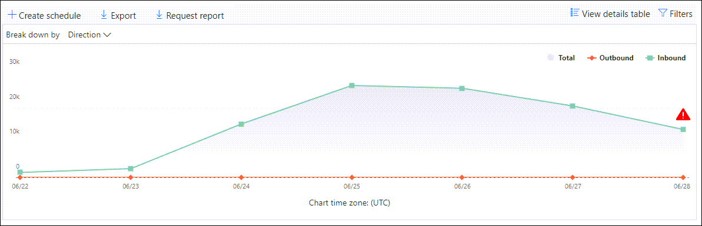

# 檢視安全性與合規性中心內的電子郵件安全性報告View email security reports in the Security & Compliance Center

[安全性 & 合規性中心](https://protection.office.com)提供各種報告，可協助您觀察電子郵件安全性功能（例如，反垃圾郵件、反惡意程式碼，以及 Microsoft 365 中的加密功能）如何保護您的組織。A variety of reports are available in the [Security & Compliance Center](https://protection.office.com) to help you see how email security features, such as anti-spam, anti-malware, and encryption features in Microsoft 365 are protecting your organization. 如果您有[必要的許可權](#what-permissions-are-needed-to-view-these-reports)，您可以移至 [**報表**] \> **儀表板**，在安全性 & 規範中心中查看這些報告。If you have the [necessary permissions](#what-permissions-are-needed-to-view-these-reports), you can view these reports in the Security & Compliance Center by going to **Reports** \> **Dashboard**. 若要直接移至 [報告] 儀表板，請開啟] <https://protection.office.com/insightdashboard> 。To go directly to the reports dashboard, open <https://protection.office.com/insightdashboard>.

## 已遭破壞的使用者報告Compromised users report

「已**遭破壞的使用者**報告」顯示顯示過去7天內已標示為**可疑**或**限制**的使用者帳戶數目。The **Compromised users** report shows shows the number of user accounts that were marked as **Suspicious** or **Restricted** within the last 7 days. 在上述任一狀態的帳戶都有問題或甚至遭到破壞。Accounts in either of these states are problematic or even compromised. 在經常使用的情況下，您可以使用報表來找出峰值，甚至是趨勢，也就是可疑或受限制的帳戶。With frequent use, you can use the report to spot spikes, and even trends, in suspicious or restricted accounts. 如需遭到破壞之使用者的詳細資訊，請參閱[回應遭到破壞的電子郵件帳戶](responding-to-a-compromised-email-account.md)。For more information about compromised users, see [Responding to a compromised email account](responding-to-a-compromised-email-account.md).

匯總視圖會顯示過去90天的資料，詳細資料檢視會顯示過去30天的資料。The aggregate view shows data for the last 90 days and the detail view shows data for the last 30 days.

若要查看報告，請開啟[安全性 & 規範中心](https://protection.office.com)，移至 [**報告**] \> **儀表板**，然後選取 [已**遭破壞的使用者**]。To view the report, open the [Security & Compliance Center](https://protection.office.com), go to **Reports** \> **Dashboard** and select **Compromised users**. 若要直接前往報表，請開啟 <https://protection.office.com/reportv2?id=CompromisedUsers> 。To go directly to the report, open <https://protection.office.com/reportv2?id=CompromisedUsers>.

您可以按一下 [**篩選**] 並選取下列其中一個或多個值，以篩選圖表和詳細資料表格：You can filter both the chart and the details table by clicking **Filters** and selecting one or more of the following values:

- **開始日期**和**結束日期****Start date** and **End date**

- **可疑**：使用者帳戶已傳送可疑的電子郵件，而且受到限制傳送電子郵件的風險。**Suspicious**: The user account has sent suspicious email and is at risk of being restricted from sending email.

- **限制**：由於高度可疑的模式，使用者帳戶已限制傳送電子郵件。**Restricted**: The user account has been restricted from sending email due to highly suspicious patterns.

如果您按一下 [**查看詳細資料] 表格**，您可以看到下列詳細資料：If you click **View details table**, you can see the following details:

- **建立時間****Creation time**
- **User ID****User ID**
- **Action****Action**

若要回到報表檢視，請按一下 [**查看報告**]。To go back to the report view, click **View report**.

## 加密報告Encryption report

**加密報告**可用於 EOP （不含 exchange online 信箱的 exchange online 或獨立 EOP 中的訂閱）。The **Encryption report** is available in EOP (subscriptions with mailboxes in Exchange Online or standalone EOP without Exchange Online mailboxes). 組織的安全小組可以使用此報告中的資訊來識別模式，並主動套用或調整敏感電子郵件訊息的原則。Your organization's security team can use information in this report to identify patterns and proactively apply or adjust policies for sensitive email messages. 例如：For example:

- 如果您看到大量的電子郵件是由使用者加密，您可能會想要新增加密原則，以自動化某些使用案例的加密。If you see a high number of email messages encrypted by users, you might want to add an encryption policy to automate encryption for certain use cases. 如需詳細資訊，請參閱[定義郵件流程規則，以加密 Microsoft 365 中的電子郵件訊息](../../compliance/define-mail-flow-rules-to-encrypt-email.md)。For more information, see [Define mail flow rules to encrypt email messages in Microsoft 365](../../compliance/define-mail-flow-rules-to-encrypt-email.md).

- 如果您有許多可供使用的加密範本，但沒有人正在使用這些範本，您可能會探索使用者是否需要功能訓練。If you have a number of encryption templates available but no one is using them, you might explore whether users need feature training.

匯總視圖允許篩選過去90天，而詳細資料檢視允許篩選10天。The aggregate view allows filtering for the last 90 days, while the detail view allows filtering for 10 days.

若要查看報告，請開啟[安全性 & 規範中心](https://protection.office.com)，移至 [**報告**] \> **儀表板**，然後選取 [**加密報告**]。To view the report, open the [Security & Compliance Center](https://protection.office.com), go to **Reports** \> **Dashboard** and select **Encryption report**. 若要直接前往報表，請開啟 <https://protection.office.com/reportv2?id=EncryptionReport> 。To go directly to the report, open <https://protection.office.com/reportv2?id=EncryptionReport>.

若要深入瞭解加密，請參閱[Microsoft 365 中的電子郵件加密](../../compliance/email-encryption.md)。To learn more about encryption, see [Email encryption in Microsoft 365](../../compliance/email-encryption.md).

### 加密報告的報表檢視Report view for the Encryption report

您可以在圖表上使用下列篩選：You can use the following filters on the chart:

- **查看資料：郵件加密報告**和**分解方式：加密方法**：下列為可用的加密方法：**View data by: Message Encryption Report** and **Break down by: Encryption method**: The following encryption methods are available:

  - **使用者加密****Encryption by user**
  - **依原則加密****Encryption by policy**

  如果您按一下 [**篩選**]，您可以使用下列篩選器修改此圖表：If you click **Filters**, you can modify the chart with the following filters:

  - **開始日期**和**結束日期****Start date** and **End date**
  - 加密方法。Encryption method.
  - 加密範本。Encryption template.

- **查看資料：郵件加密報告**和**分解方式：加密範本**：下列為可供使用的加密方法：**View data by: Message Encryption Report** and **Break down by: Encryption template**: The following encryption methods are available:

  - **請勿轉寄****Do not forward**
  - **只加密****Encrypt only**
  - **OME 先前版本****OME previous**
  - **自訂****Custom**

  如果您按一下 [**篩選**]，您可以使用下列篩選器修改此圖表：If you click **Filters**, you can modify the chart with the following filters:

  - **開始日期**和**結束日期****Start date** and **End date**
  - 加密方法Encryption method
  - 加密範本Encryption template

- **查看資料：前5位收件者網域**：此視圖會顯示圓形圖，其中包含前5位收件者網域的已傳送郵件計數。**View data by: Top 5 recipient domains**: This view shows a pie chart with sent message counts for the top 5 recipient domains.

  如果您按一下 [**篩選**]，您可以選取 [**開始日期**] 和 [**結束日期**]。If you click **Filters**, you can select a **Start date** and **End date**.

### 加密報告的詳細資料表格視圖Details table view for the Encryption report

如果您按一下 [**查看詳細資料] 表格**，顯示的資訊將取決於您所查看的圖表：If you click **View details table**, the information that's shown depends on the chart you were looking at:

- **逐項換行：** 加密**範本：加密範本**：下列會顯示下列資訊：**Break down by: Encryption method** or **Break down by: Encryption template**: The following information is shown:

  - **Date****Date**
  - **寄件者位址****Sender address**
  - **加密範本****Encryption template**
  - **加密方法****Encryption method**
  - **收件者位址****Recipient address**
  - **主旨****Subject**

- **資料查看依據：前5位收件者網域**：**View data by: Top 5 recipient domains**:

  - **Date****Date**
  - **收件者網域****Recipient domain**
  - **訊息計數****Message count**
  
如果您按一下 [詳細資料] 表格視圖中的 [**篩選**]，您可以使用下列篩選器修改結果：If you click **Filters** in a details table view, you can modify the results with the following filters:

- **開始日期**和**結束日期****Start date** and **End date**
- 加密方法Encryption method
- 加密範本Encryption template

若要回到報表檢視，請按一下 [**查看報告**]。To go back to the report view, click **View report**.

## 郵件流程狀態報表Mailflow status report

**郵件流程狀態報表**包含惡意程式碼、垃圾郵件、網路釣魚和 edge 封鎖郵件的相關資訊。The **Mailflow status report** contains information about malware, spam, phishing and edge blocked messages. 如需詳細資訊，請參閱[郵件流程 status report](view-mail-flow-reports.md#mailflow-status-report)。For more details, see [Mailflow status report](view-mail-flow-reports.md#mailflow-status-report).

## 電子郵件中的惡意程式碼偵測報告Malware detection in email report

[**電子郵件中的惡意**代碼偵測] 報告會顯示傳入和傳出電子郵件（Exchange Online PROTECTION 或 EOP 偵測到的惡意程式碼）中的惡意程式碼偵測的相關資訊。The **Malware detections in email** report shows information about malware detections in incoming and outgoing email messages (malware detected by Exchange Online Protection or EOP). 如需 EOP 中惡意程式碼保護的詳細資訊，請參閱[EOP 中的反惡意程式碼保護](anti-malware-protection.md)。For more information about malware protection in EOP, see [Anti-malware protection in EOP](anti-malware-protection.md).

 匯總 view 篩選允許90天，而 [詳細資料表格篩選] 只允許10天。The aggregate view filter allows for 90 days, while the details table filter only allows for 10 days.

若要查看報告，請開啟[安全性 & 規範中心](https://protection.office.com)，移至 [**報告**] \> **儀表板**，然後**在電子郵件中選取惡意**代碼偵測。To view the report, open the [Security & Compliance Center](https://protection.office.com), go to **Reports** \> **Dashboard** and select **Malware detections in email**. 若要直接前往報表，請開啟 <https://protection.office.com/reportv2?id=MalwareDetections> 。To go directly to the report, open <https://protection.office.com/reportv2?id=MalwareDetections>.

![在 [報告] 儀表板的電子郵件小工具中偵測惡意程式碼](../../media/malware-detections-widget.png)

您可以按一下 [**篩選**] 並選取 [篩選]，以篩選圖表和詳細資料表格：You can filter both the chart and the details table by clicking **Filters** and selecting:

- **開始日期**和**結束日期****Start date** and **End date**
- **入境****Inbound**
- **出境****Outbound**

如果您按一下 [**查看詳細資料] 表格**，您可以看到下列詳細資料：If you click **View details table**, you can see the following details:

- **Date****Date**
- **寄件者位址****Sender address**
- **收件者位址****Recipient address**
- **郵件識別碼****Message ID**
- **主旨****Subject**
- **Filename****Filename**
- **惡意軟體名稱****Malware name**

若要回到報表檢視，請按一下 [**查看報告**]。To go back to the report view, click **View report**.

## 傳送和接收的電子郵件報告Sent and received email report

**傳送和接收的電子郵件**報告包含惡意程式碼、垃圾郵件、郵件流程規則（也稱為傳輸規則）的相關資訊，以及電子郵件進入服務後的高級惡意軟體偵測。The **Sent and received email** report contains information about malware, spam, mail flow rules (also known as transport rules), and advanced malware detections after email enters the service. 如需詳細資訊，請參閱[送出和接收的電子郵件報告](view-mail-flow-reports.md#sent-and-received-email-report)。For more information, see [Sent and received email report](view-mail-flow-reports.md#sent-and-received-email-report).

## 垃圾郵件偵測報告Spam detections report

**垃圾郵件**偵測報告會顯示由 EOP 封鎖的垃圾電子郵件。The **Spam detections** report shows spam email messages that were blocked by EOP. 郵件會個別計算，而不是每個收件者。Messages are counted individually, not per recipient. 例如，如果相同的垃圾郵件已傳送給組織中的100收件者，則會算作一封郵件。For example, if the same spam message was sent to 100 recipients in your organization, it counts as one message.

匯總視圖允許90天篩選，而詳細資料表格允許10天的篩選。The aggregate view allows for 90 days filtering, while the details table allows for 10 days filtering.

若要查看報告，請開啟[安全性 & 規範中心](https://protection.office.com)，移至 [**報告**] \> **儀表板**，然後選取 [**垃圾郵件**偵測]。To view the report, open the [Security & Compliance Center](https://protection.office.com), go to **Reports** \> **Dashboard** and select **Spam detections**. 若要直接前往報表，請開啟 <https://protection.office.com/reportv2?id=SpamDetections> 。To go directly to the report, open <https://protection.office.com/reportv2?id=SpamDetections>.

如需反垃圾郵件保護的詳細資訊，請參閱[EOP 中的反垃圾郵件保護](anti-spam-protection.md)。For more information about anti-spam protection, see [Anti-spam protection in EOP](anti-spam-protection.md).

### 垃圾郵件偵測報告的報表檢視Report view for the Spam detections report

報表檢視提供下列圖表：The following charts are available in the report view:

- **分解方式：動作**：會顯示下列事件種類：**Break down by: Action**: The following event types are shown:

  - **篩選的垃圾郵件內容****Spam content filtered**
  - **垃圾郵件 IP 封鎖****Spam IP block**
  - **垃圾郵件信封封鎖****Spam envelope block**
  - **垃圾郵件 DBEB 篩選**：以目錄為基礎的邊緣封鎖（DBEB）**Spam DBEB filter**: Directory based edge blocking (DBEB)

  當您將游標移到圖表中的某一天（資料點）時，您可以查看該天已封鎖的專案數，以及這些專案的分類方式。When you hover over a day (data point) in the chart, you can see how many items were blocked that day, as well as how those items are categorized.

  

- **分解方式：方向**：下列方向如下：**Break down by:Direction**: The following directions are shown:

  - **入境****Inbound**
  - **出境****Outbound**

如果您按一下報表檢視中的**篩選器**，您可以使用下列篩選器修改結果：If you click **Filters** in a report view, you can modify the results with the following filters:

- **開始日期**和**結束日期****Start date** and **End date**
- 方向值Direction values
- 事件種類值Event type values

### 垃圾郵件偵測報告的詳細資料表格視圖Details table view for the Spam detections report

如果您按一下任何報表檢視中的 [**查看詳細資料] 表格**，會顯示下列資訊：If you click **View details table** in any report view, the following information is shown:

- **Date****Date**
- **寄件者位址****Sender address**
- **收件者位址****Recipient address**
- **事件類型****Event type**
- **Action****Action**
- **主旨****Subject**

如果您按一下 [詳細資料] 表格中的 [**篩選**]，您可以使用下列篩選器修改結果：If you click **Filters** in a details table, you can modify the results with the following filters:

- **開始日期**和**結束日期****Start date** and **End date**
- 方向值Direction values
- 事件種類值Event type values

若要回到報表檢視，請按一下 [**查看報告**]。To go back to the report view, click **View report**.

## 欺騙偵測報告Spoof detections report

「**欺騙**偵測報告」會顯示偵測到的電子郵件訊息數量，以及那些被視為「良好」（由於正當商務理由而完成的電子郵件）。The **Spoof detections** report shows how many spoof mail messages were detected, and of those, which ones were considered "good" (spoof mail done for legitimate business reasons). 如需有關電子欺騙的詳細資訊，請參閱[EOP 中的反欺騙防護](anti-spoofing-protection.md)。For more information about spoofing, see [Anti-spoofing protection in EOP](anti-spoofing-protection.md).

報表的匯總視圖允許90天的篩選，而詳細資料檢視只允許10天的篩選。The aggregate view of the report allows for 90 days of filtering, while the detail view only allows for ten days of filtering.

若要查看報告，請開啟[安全性 & 規範中心](https://protection.office.com)，移至 [**報告**] \> **儀表板**，然後選取 [**偽造**偵測]。To view the report, open the [Security & Compliance Center](https://protection.office.com), go to **Reports** \> **Dashboard** and select **Spoof detections**. 若要直接前往報表，請開啟 <https://protection.office.com/reportv2?id=SpoofMailReport> 。To go directly to the report, open <https://protection.office.com/reportv2?id=SpoofMailReport>.

當您將游標移到圖表中的某一天（資料點）時，您可以看到有多少偽造的電子郵件訊息。When you hover over a day (data point) in the chart, you can see how many spoof mail messages came through.

您可以按一下 [**篩選**] 並選取下列其中一個或多個值，以篩選圖表和詳細資料表格：You can filter both the chart and the details table by clicking **Filters** and selecting one or more of the following values:

- **開始日期**和**結束日期****Start date** and **End date**

- **良好的郵件****Good mail**

- **視為垃圾郵件****Caught as spam**

如果您按一下 [**查看詳細資料] 表格**，您可以看到下列詳細資料：If you click **View details table**, you can see the following details:

- **Date****Date**
- **欺騙寄件者****Spoofed sender**
- **True 寄件者****True sender**
- **寄件者 IP****Sender IP**
- **Action****Action**
- **訊息計數****Message count**

若要回到報表檢視，請按一下 [**查看報告**]。To go back to the report view, click **View report**.

## 威脅防護狀態報表Threat protection status report

「**威脅防護狀態**」報告可用於 EOP 和 OFFICE 365 ATP;不過，報告包含不同的資料。The **Threat protection status** report is available in both EOP and Office 365 ATP; however, the reports contain different data. 例如，EOP 客戶可以查看在電子郵件中偵測到惡意程式碼的相關資訊，但不會[發現 SharePoint 線上、OneDrive 或 Microsoft 小組中偵測到之惡意](atp-for-spo-odb-and-teams.md)檔案的相關資訊。For example, EOP customers can view information about malware detected in email, but not information about [malicious files detected in SharePoint Online, OneDrive, or Microsoft Teams](atp-for-spo-odb-and-teams.md). 如需有關 Office 365 ATP 報告的詳細資訊，請參閱[View reports For office 365 Advanced 威脅 Protection](view-reports-for-atp.md)。For more information about Office 365 ATP reports, see [View reports for Office 365 Advanced Threat Protection](view-reports-for-atp.md).

這是一個智慧報告，顯示偵測到並封鎖的惡意電子郵件，並可讓安全性管理員識別趨勢或判斷組織原則是否需要調整。This is a smart report that shows malicious email that was detected and blocked, and it enables security admins to identify trends or determine whether organization policies need adjustment.

若要查看報告，請開啟[安全性 & 合規性中心](https://protection.office.com)，移至 [**報告**] \> **儀表板**，然後選取 [**威脅防護狀態**]。To view the report, open the [Security & Compliance Center](https://protection.office.com), go to **Reports** \> **Dashboard** and select **Threat protection status**. 若要直接前往報表，請開啟 <https://protection.office.com/reportv2?id=ATPV2AggregateReport> 。To go directly to the report, open <https://protection.office.com/reportv2?id=ATPV2AggregateReport>.

根據預設，圖表會顯示過去7天的資料。By default, the chart shows data for the past 7 days. 如果您按一下 [**篩選**]，您可以選取90天的日期範圍（試用訂閱可能限制為30天）。If you click **Filters**, you can select a 90 day date range (trial subscriptions might be limited to 30 days). [詳細資料] 表格視圖允許篩選30天。The details table view allows filtering for 30 days.

### 威脅防護狀態報表的報表檢視Report view for the Threat protection status report

可供使用的視圖如下：The following views are available:

- **資料查看方式：概述**：以下是顯示的偵測資訊：**View data by: Overview**: The following detection information is shown:

  - **電子郵件惡意程式碼****Email malware**
  - **電子郵件網路釣魚****Email phish**
  - **內容惡意程式碼****Content malware**

- **資料查看方式：內容 \>惡意**代碼：顯示下列資訊：**View data by: Content \> Malware**: The following information is shown:

  - **反惡意程式碼引擎****Anti-malware engine**
  - **檔引爆****File detonation**

- **分解方式：偵測技術**和**查看資料：電子郵件網路釣魚：電子郵件 \> 網路釣魚**：下列資訊會顯示：**Break down by: Detection technology** and **View data by: Email \> Phish**: The following information is shown:

  - **ATP 產生的 URL 信譽**\***ATP-generated URL reputation**\*
  - **高級網路釣魚篩選器**\***Advanced phish filter**\*
  - **反欺騙： DMARC 失敗****Anti-spoof: DMARC failure**
  - **反欺騙：組織內****Anti-spoof: Intra-org**
  - **反欺騙：外部網域****Anti-spoof: external domain**
  - **品牌模仿**\***Brand impersonation**\*
  - **網域模仿**\***Domain impersonation**\*
  - **EOP URL 信譽****EOP URL reputation**
  - **一般網路釣魚篩選器****General phish filter**
  - **別人****Others**
  - **網路釣魚 ZAP**\*\***Phish ZAP**\*\*
  - **URL 引爆**\*\***URL detonation**\*\*
  - **使用者類比**\***User Impersonation**\*

- **分解方式：偵測技術**和**View Data：電子郵件 \> 惡意**代碼：會顯示下列資訊：**Break down by: Detection technology** and **View data by: Email \> Malware**: The following information is shown:

  - **ATP 產生的檔信譽**\*\***ATP-generated file reputation**\*\*
  - **反惡意程式碼引擎****Anti-malware engine**
  - **反惡意程式碼原則檔案類型區塊****Anti-malware policy file type block**
  - **檔引爆**\*\***File detonation**\*\*
  - **惡意檔信譽****Malicious file reputation**
  - \* \* 惡意程式碼 ZAP \* \* \* \*\*\*\*\*Malware ZAP\*\*\*\*\*\*
  - **別人****Others**

- **分解方式：原則類型**和**view data \> \*\* by：電子郵件惡意程式碼：**電子郵件 \> 惡意\*\*代碼：下列是顯示下列資訊：**Break down by: Policy type** and **View data by: Email \> Phish** or **View data by: Email \> Malware**: The following information is shown:

  - **反惡意程式碼**\*\***Anti-malware**\*\*
  - **安全附件**\*\***Safe Attachment**\*\*
  - **反網路釣魚****Anti-phish**
  - **反垃圾郵件****Anti-spam**
  - **郵件流程規則**（也稱為傳輸規則）**Mail flow rule** (also known as a transport rule)
  - **別人****Others**

- **分解方式：傳遞狀態**和查看資料：電子郵件的\*\* \> 網路釣魚詐騙**或**view data：電子郵件 \> 惡意\*\*代碼：會顯示下列資訊：**Break down by: Delivery status** and **View data by: Email \> Phish** or **View data by: Email \> Malware**: The following information is shown:

  - **傳遞失敗****Delivery failed**
  - **下降****Dropped**
  - **轉發****Forwarded**
  - **主控信箱：自訂資料夾****Hosted mailbox: Custom folder**
  - **主控信箱：刪除的郵件****Hosted mailbox: Deleted items**
  - **主控信箱：收件匣****Hosted mailbox: Inbox**
  - **主控信箱：垃圾郵件****Hosted mailbox: Junk**
  - **內部部署伺服器：已傳送****On-premises server: Delivered**
  - **隔離區****Quarantine**

\*僅限 Office 365 ATP\* Office 365 ATP only

\*\*在獨立 EOP 中無法使用零小時自動清除（ZAP）（它只適用于 Exchange Online 信箱）。\*\*Zero-hour auto purge (ZAP) isn't available in standalone EOP (it only works in Exchange Online mailboxes).

如果您按一下 [**篩選**]，您可以使用下列篩選器修改報告：If you click **Filters**, you can modify the report with the following filters:

- **開始日期**和**結束日期****Start date** and **End date**
- 偵測值Detection value
- **受保護者**（僅限 OFFICE 365 ATP）： **ATP**或**EOP**。**Protected by** (Office 365 ATP only): **ATP** or **EOP**. 請注意，View 資料中無法使用這種可篩選的屬性 **：內容 \> 惡意程式碼**。Note that this filterable property isn't available in **View data by: Content \> Malware**.

### 威脅防護狀態報表的詳細資料表格視圖Details table view for the Threat protection status report

如果您按一下 [**查看詳細資料] 表格**，顯示的資訊將取決於您所查看的圖表：If you click **View details table**, the information that's shown depends on the chart you were looking at:

- **資料查看方式：內容 \>惡意**代碼：**View data by: Content \> Malware**:

- **Date****Date**
- **位置****Location**
- **導向者****Directed by**
- **惡意軟體名稱****Malware name**

- **資料查看方式：一覽**：沒有可用的**視圖詳細資料表格**按鈕。**View data by: Overview**: No **View details table** button is available.

- 所有其他圖表：All other charts:

  - **Date****Date**
  - **主旨****Subject**
  - **Sender****Sender**
  - **收件者****Recipients**
  - **導向者****Directed by**
  - **傳遞狀態****Delivery status**
  - **受損來源****Source of compromise**

如果您按一下 [**篩選**]，您可以使用下列篩選器修改報告：If you click **Filters**, you can modify the report with the following filters:

- **開始日期**和**結束日期****Start date** and **End date**
- 偵測值Detection value
- **受保護者**（僅限 OFFICE 365 ATP）： **ATP**或**EOP**。**Protected by** (Office 365 ATP only): **ATP** or **EOP**. 請注意，View 資料中無法使用這種可篩選的屬性 **：內容 \> 惡意程式碼**。Note that this filterable property isn't available in **View data by: Content \> Malware**.

## 主要惡意程式碼報告Top malware report

**主要惡意**代碼報告會顯示[EOP](eop-features.md)偵測到的各種惡意程式碼。The **Top Malware** report shows the various kinds of malware that was detected by [EOP](eop-features.md).

若要查看報告，請開啟[安全性 & 規範中心](https://protection.office.com)，移至 [**報告**] \> **儀表板**，然後選取 [**主要惡意**代碼]。To view the report, open the [Security & Compliance Center](https://protection.office.com), go to **Reports** \> **Dashboard** and select **Top malware**. 若要直接前往報表，請開啟 <https://protection.office.com/reportv2?id=TopMalwaret> 。To go directly to the report, open <https://protection.office.com/reportv2?id=TopMalwaret>.

當您將游標移到圓形圖中的楔形上方時，您可以看到惡意程式碼類型的名稱，以及偵測到該惡意程式碼的郵件數目。When you hover over a wedge in the pie chart, you can see the name of a kind of malware and how many messages were detected as having that malware.

按一下（或點擊）報表，以在新的瀏覽器視窗中開啟它，您可以在其中取得更詳細的報表檢視。Click (or tap) the report to open it in a new browser window, where you can get a more detailed view of the report.

在圖表下方，您會看到偵測到的惡意程式碼，以及偵測到該惡意程式碼的郵件數目。Below the chart, you'll see a list of detected malware and how many messages were detected as having that malware. 請注意，匯總視圖只允許90天的篩選。Note that the aggregate view only allows for 90 days filtering.

## URL 威脅防護報告URL threat protection report

在 [報告] 儀表板上，此報告的小工具命名為**URL 保護報告**，而且只有 Office 365 Advanced 威脅防護（ATP）才能使用。The widget for this report is named **URL protection report** on the reports dashboard, and is only available in Office 365 Advanced Threat Protection (ATP). 特別是：Specifically:

- Microsoft 365 E5 訂閱。A Microsoft 365 E5 subscription.
- 對任何包含 Exchange Online Protection （EOP）之其他訂閱的高級威脅防護附加元件（方案 1*或*方案2）。An Advanced Threat Protection add-on (Plan 1 *or* Plan 2) to any other subscription that includes Exchange Online Protection (EOP).

若要直接移至 [ **URL 威脅防護**] 報告，請開啟] <https://protection.office.com/reportv2?id=URLProtectionActionReport> 。To go directly to the **URL threat protection** report, open <https://protection.office.com/reportv2?id=URLProtectionActionReport>.

> [!NOTE]
> 若已套用安全連結原則的使用者沒有選取 [不**追蹤使用者點擊**] 選項，則此報告將不會有按一下其資料的使用者。This report will not have click data from users where the Safe Links policy applied has the **Do not track user clicks** option selected.

### URL 威脅防護報告的報表檢視Report view for the URL threat protection report

**URL 威脅防護**報告有兩個匯總的視圖，每四個小時都會重新整理一次，以顯示過去90天的資料：The **URL threat protection** report has two aggregated views that are refreshed once every four hours that shows data for the last 90 days:

- **URL 按一下保護動作**：顯示組織中的使用者按下 URL 按一下數目及按一下的結果：**URL click protection action**: Shows the number of URL clicks by users in the organization and the results of the click:

  - **已封鎖****Blocked**
  - **封鎖並按一下****Blocked and clicked through**
  - **在掃描期間按一下****Clicked through during scan**

  按一下表示使用者已透過封鎖頁面透過惡意網站按一下（系統管理員可以停用 [安全連結原則] 中的 [按一下]）。A click indicates that the user has clicked through the block page to the malicious website (admins can disable click through in Safe Links policies).

  如果您按一下 [**篩選**]，您可以使用下列篩選器修改報告：If you click **Filters**, you can modify the report with the following filters:

  - **開始日期**和**結束日期****Start date** and **End date**
  - 可供按一下的 [保護動作]，加上**允許**查看所有 URL 點擊資訊的值（不只是封鎖的按一下）。The available click protection actions, plus  the value **Allowed** to see information for all URL clicks (not just blocked clicks).

- **依應用程式按一下 url**：會顯示支援 OFFICE 365 ATP 安全連結之應用程式的 url 按一下數目。**URL click by application**: Shows the number of URL clicks by applications that support Office 365 ATP Safe Links:

  - **電子郵件用戶端****Email client**
  - **PowerPoint****PowerPoint**
  - **Word****Word**
  - **Excel****Excel**
  - **OneNote****OneNote**
  - **Visio****Visio**
  - **Teams****Teams**
  - **其他****Other**

  如果您按一下 [**篩選**]，您可以使用下列篩選器修改報告：If you click **Filters**, you can modify the report with the following filters:

  - **開始日期**和**結束日期****Start date** and **End date**
  - 可用的應用程式。The available applications.

### 威脅防護報告的詳細資料表格視圖Details table view for the threat protection report

如果您按一下 [**查看詳細資料] 表格**，則報告會提供最近7天內組織內所有按一下動作的近乎即時視圖，其詳細資料如下：If you click **View details table**, the report provides a near-real-time view of all clicks that happen within the organization for the last 7 days with the following details:

- **按一下 [時間]****Click time**
- **使用者****User**
- [URL]\*\*\*\***URL**
- **Action****Action**
- **App****App**

如果您按一下 [詳細資料] 表格視圖中的 [**篩選器**]，可以篩選與報表檢視中相同的準則，**以及以逗號分隔的\*\*\*\*網域**或收件者。If you click **Filters** in the details table view, you can filter by the same criteria as in the report view, and also by **Domains** or **Recipients** separated by commas.

若要回到 [報表] 視圖，請按一下 [ **view report**]。To get back to the reports view, click **View report**.

## 使用者報告的訊息報告User-reported messages report

「**使用者報告的訊息**報告」顯示使用者已使用[報告郵件增益集](https://docs.microsoft.com/microsoft-365/security/office-365-security/enable-the-report-message-add-in)舉報為垃圾郵件、網路釣魚企圖或良好郵件的電子郵件資訊。The **User-reported messages** report shows information about email messages that users have reported as junk, phishing attempts, or good mail by using the [Report Message add-in](https://docs.microsoft.com/microsoft-365/security/office-365-security/enable-the-report-message-add-in).

詳細資料可用於每封郵件，包括傳遞原因、為您的組織設定的垃圾郵件原則例外狀況或郵件流程規則。Details are available for each message, including the delivery reason, such a spam policy exception or mail flow rule configured for your organization. 若要查看詳細資料，請選取 [使用者報告] 清單中的專案，然後查看 [**摘要**] 和 [**詳細資料**] 索引標籤上的資訊。To view details, select an item in the user-reports list, and then view the information on the **Summary** and **Details** tabs.

若要查看此報告，請在 [[安全性 & 規範中心](https://protection.office.com)] 中，執行下列其中一項操作：To view this report, in the [Security & Compliance Center](https://protection.office.com), do one of the following:

- 移至**威脅管理** \> **儀表板** \> **使用者報告的郵件**。Go to **Threat management** \> **Dashboard** \> **User-reported messages**.

- 移至**威脅管理** \> **檢查** \> **使用者報告的郵件**。Go to **Threat management** \> **Review** \> **User-reported messages**.

![在 [安全性 & 規範中心] 中，選擇 [威脅管理] [ \> \> 使用者報告的郵件]](../../media/e372c57c-1414-4616-957b-bc933b8c8711.png)

> [!IMPORTANT]
> 為了讓使用者報告的郵件報告正確運作，您必須為您的 Office 365 環境**開啟審核記錄**。In order for the User-reported messages report to work correctly, **audit logging must be turned on** for your Office 365 environment. 這項工作通常是由在 Exchange Online 中獲派稽核記錄角色的人員完成。This is typically done by someone who has the Audit Logs role assigned in Exchange Online. 如需詳細資訊，請參閱[開啟或關閉 Microsoft 365 審核記錄搜尋](https://docs.microsoft.com/microsoft-365/compliance/turn-audit-log-search-on-or-off)。For more information, see [Turn Microsoft 365 audit log search on or off](https://docs.microsoft.com/microsoft-365/compliance/turn-audit-log-search-on-or-off).

## 查看這些報表所需的許可權為何？What permissions are needed to view these reports?

若要查看和使用報表，您必須是在安全性 & 規範中心**和**Exchange Online 中所指定角色群組的成員。To view and use the reports, you need to be a member of the specified role group in the Security & Compliance Center **and** in Exchange Online.

- 在安全性 & 規範中心，您必須是下列其中一個角色群組的成員：In the Security & Compliance Center, you need to be a member of one of the following role groups:

  -組織管理-安全性管理員（您也可以在[Azure Active Directory 系統管理中心](https://aad.portal.azure.com)進行此作業-安全性讀取器-Organization Management -Security Administrator (you can also do this in the [Azure Active Directory admin center](https://aad.portal.azure.com) -Security Reader

  如需詳細資訊，請參閱[安全性與合規性中心中的權限](https://docs.microsoft.com/microsoft-365/security/office-365-security/permissions-in-the-security-and-compliance-center)。For more information, see [Permissions in the Security & Compliance Center](https://docs.microsoft.com/microsoft-365/security/office-365-security/permissions-in-the-security-and-compliance-center).

- 在 Exchange Online 中，您必須是下列其中一個角色群組的成員：In Exchange Online, you need to be a member of one of the following role groups:

  -組織管理-僅限查看組織管理-View-Only 收件者-合規性管理-Organization Management -View-only Organization Management -View-Only Recipients -Compliance Management

如需詳細資訊，請參閱 exchange online 中的[許可權](https://docs.microsoft.com/Exchange/permissions-exo/permissions-exo)和[exchange Online 中的管理角色群組](https://docs.microsoft.com/Exchange/permissions-exo/role-groups)。For more information, see [Permissions in Exchange Online](https://docs.microsoft.com/Exchange/permissions-exo/permissions-exo) and [Manage role groups in Exchange Online](https://docs.microsoft.com/Exchange/permissions-exo/role-groups).

## 如果報告未顯示資料，該怎麼辦？What if the reports aren't showing data?

如果您未看到報表中的資料，請仔細檢查您的原則設定是否正確。If you are not seeing data in your reports, double-check that your policies are set up correctly. 若要深入瞭解，請參閱[防禦威脅](protect-against-threats.md)。To learn more, see [Protect against threats](protect-against-threats.md).

## 相關主題Related topics

[EOP 中的反垃圾郵件和反惡意程式碼保護Anti-spam and anti-malware protection in EOP](anti-spam-and-anti-malware-protection.md)

[安全性與合規性中心內的智慧型報表和深入解析Smart reports and insights in the Security & Compliance Center](reports-and-insights-in-security-and-compliance.md)
