# 在安全性 & 規範中心的報表儀表板中查看郵件流程報告

[!INCLUDE [Microsoft 365 Defender rebranding](../includes/microsoft-defender-for-office.md)]

除了安全性 & 合規性中心的 [郵件流程儀表板](mail-flow-insights-v2.md) 中所提供的郵件流程報告之外，「報告」儀表板還提供各種額外的郵件流程報告，可協助您監視 Microsoft 365 組織。

如果您有 [必要的許可權](#what-permissions-are-needed-to-view-these-reports)，您可以移至 [ **報表** ] 儀表板，在 [安全性 & 規範中心](https://office.protection.com)中查看這些報告 \> **** 。 若要直接移至 [報告] 儀表板，請開啟] <https://protection.office.com/insightdashboard> 。

## 連接器報告

**連接器報告** 會顯示為您的組織設定之 [輸入和輸出連接器](https://docs.microsoft.com/Exchange/mail-flow-best-practices/use-connectors-to-configure-mail-flow/use-connectors-to-configure-mail-flow)上的郵件流程活動。

若要查看報告，請開啟 [安全性 & 規範中心](https://protection.office.com)，移至 [ **報告** ] \> **儀表板** ，然後選取 [ **連接器報告** ]。 若要直接前往報表，請開啟 <https://protection.office.com/reportv2?id=ConnectorReport> 。

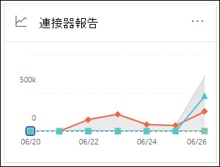

### 連接器報表的報表檢視

報表檢視提供下列圖表：

- **依下列方式查看資料：郵件流程** ：此圖顯示輸入的輸入和輸出郵件數目：

  - **Total**
  - **從沒有連接器的網際網路**
  - **沒有連接器的網際網路**
  - 您已設定的特定連接器。

  若要隔離圖表中的資料，請使用 [顯示控制項的 **資料** ] 選取其中一個選項或 **所有郵件流程** 。

  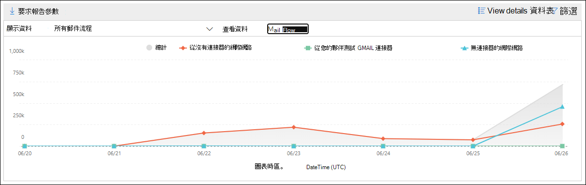

- **資料查看依據： tls 使用狀況** ：此圖顯示郵件流程的傳輸層安全性 (TLS) 版本用法的百分比。

  若要隔離圖表中的資料，請使用 [顯示控制項的 **資料** ] 選取下列其中一個選項：

  - **所有郵件流程**
  - **從沒有連接器的網際網路**
  - **沒有連接器的網際網路**
  - 您已設定的特定連接器。

  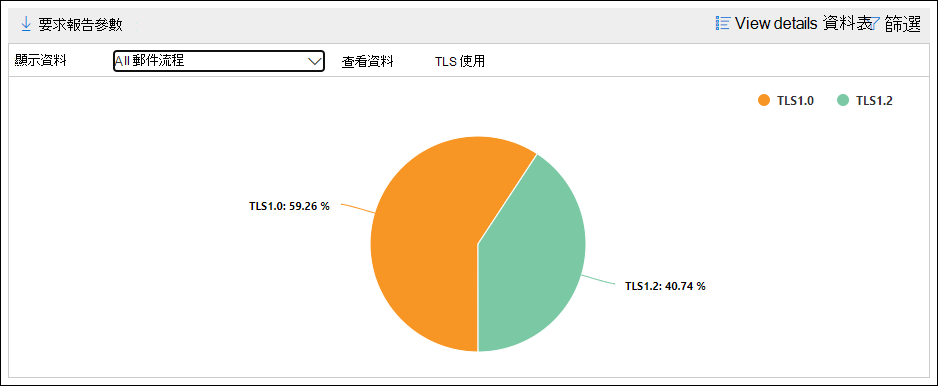

如果您按一下報表檢視中的 [ **篩選器** ]，您可以指定具有 **開始日期** 和 **結束日期** 的日期範圍。

### 連接器報表的詳細資料表格視圖

如果您按一下報表檢視中的 [ **查看詳細資料] 表格** ，會顯示下列資訊：

- **Date**
- **連接器的方向和名稱**
- **連接器類型**
- **強制 TLS？** ：值 **True** 或 **False** 。
- **沒有 TLS** (百分比) 
- **TLS 1.0** (百分比) 
- **TLS 1.1** (百分比) 
- **TLS 1.2** (百分比) 
- **磁片** 區：郵件數目。

如果您按一下 [詳細資料] 表格視圖中的 [ **篩選** ]，您可以指定具有 **開始日期** 和 **結束日期** 的日期範圍。

若要回到報表檢視，請按一下 [ **查看報告** ]。

## Exchange transport rule 報告

**Exchange transport rule report** 會顯示郵件流程規則 (也稱為傳輸規則) 組織中內送和外寄郵件的效果。

若要查看報告，請開啟 [安全性 & 合規性中心](https://protection.office.com)，移至 [ **報告** ] \> **儀表板** ，然後選取 [ **Exchange Transport rule** ]。 若要直接前往報表，請開啟 <https://protection.office.com/reportv2?id=ETRRuleReport> 。

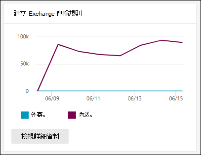

### Exchange transport rule 報告的報表檢視

報表檢視提供下列圖表：

- **資料查看依據： Exchange 傳輸規則** \>**分解方式：方向** ：此圖顯示受傳輸規則影響的 **輸入** 和 **輸出** 郵件數目。

- **資料查看依據： Exchange 傳輸規則** \>**分解方式：嚴重性** ：此圖表顯示 **高嚴重性** 和 **中低嚴重性** 的數目，以及 **低嚴重性** 郵件。 您可以將嚴重性層級設定為規則 ([ **以嚴重性層級** 或 _SetAuditSeverity_ ) 審核此規則] 中的動作。 如需詳細資訊，請參閱 [Exchange Online 中的郵件流程規則動作](https://docs.microsoft.com//Exchange/security-and-compliance/mail-flow-rules/mail-flow-rule-actions)。

- **依下列方式查看資料： DLP Exchange transport rules** \>**分解方式：方向** ：此圖顯示受資料遺失防護 (DLP) 傳輸規則所影響的 **輸入** 和 **輸出** 郵件數目。 您可以選取下列選項來進一步精煉圖表：

  - **顯示資料：所有 DLP transport rules**
  - **顯示下列專案的資料：已遭破壞的使用者**
  - **顯示資料：偵測到的內容量下限美國愛國法案**

- **依下列方式查看資料： DLP Exchange transport rules** \>**分解方式：方向** ：此 View 顯示 **高嚴重性** 和 **中低嚴重性** 的數目，以及受 DLP transport rules 影響的 **低嚴重性** 郵件。 您可以選取下列選項來進一步精煉圖表：

  - **顯示資料：所有 DLP transport rules**
  - **顯示下列專案的資料：已遭破壞的使用者**
  - **顯示資料：偵測到的內容量下限美國愛國法案**

如果您按一下報表檢視中的 **篩選器** ，您可以使用下列篩選器修改結果：

- **開始日期** 和 **結束日期**
- 方向值
- 嚴重性值

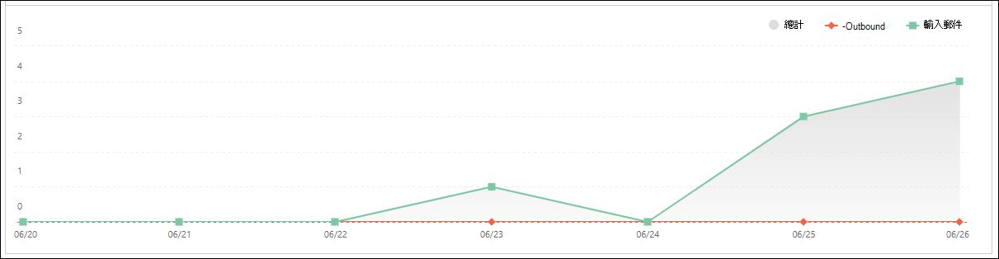

### Exchange transport rule 報告的詳細資料表格視圖

如果您按一下 [ **查看詳細資料] 表格** ，顯示的資訊將取決於您所查看的圖表：

- **依下列方式查看資料： Exchange Transport rules** ：

  - **Date**
  - **傳輸規則**
  - **主旨**
  - **寄件者位址**
  - **收件者位址**
  - **嚴重性**
  - **方向**

- 透過 **下列方式查看資料： DLP Exchange transport rules** ：

  - **Date**
  - **DLP 原則**
  - **傳輸規則**
  - **主旨**
  - **寄件者位址**
  - **收件者位址**
  - **嚴重性**
  - **方向**

如果您按一下 [詳細資料] 表格視圖中的 [ **篩選** ]，您可以使用下列篩選器修改結果：

- **開始日期** 和 **結束日期**
- 方向值
- 嚴重性值

若要回到報表檢視，請按一下 [ **查看報告** ]。

## 轉接報告

轉寄 **報告** 顯示組織自動轉寄給來自 Exchange Online 信箱的外部網域的郵件。 轉寄的郵件可能會造成安全性或規範風險，而且可能會指出已遭破壞的帳戶。

若要查看報告，請開啟 [安全性 & 規範中心](https://protection.office.com)，移至 [ **報告** ] \> **儀表板** ，然後選取 [ **轉接報告** ]。 若要直接前往報表，請開啟 <https://protection.office.com/reportv2?id=MailFlowForwarding> 。

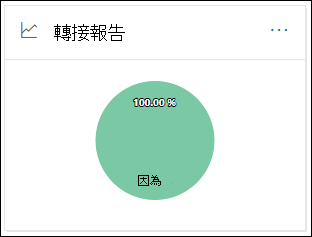

### 轉送報告的報表檢視

報表檢視提供下列圖表：

- **顯示資料：轉寄方法** ：會顯示下列方法：

  - **傳輸規則** ：也稱為「 [郵件流程規則](https://docs.microsoft.com/Exchange/security-and-compliance/mail-flow-rules/mail-flow-rules)」。
  - **信箱規則** ：也稱為 [收件匣規則](https://support.microsoft.com/office/c24f5dea-9465-4df4-ad17-a50704d66c59)。

  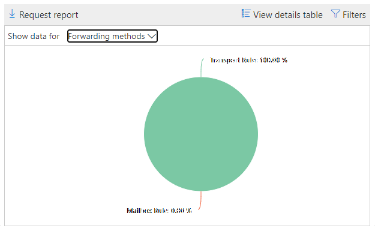

- **顯示下列專案的資料：轉寄網域** ：此視圖顯示是轉寄目的地的收件者網域。

  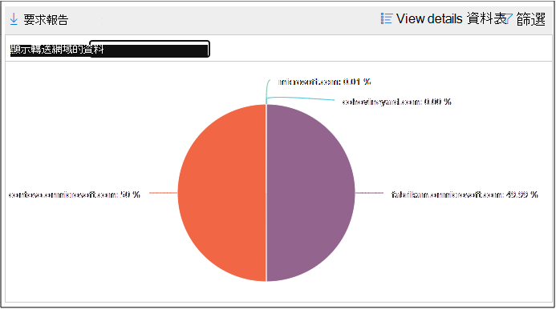

- 顯示下列專案的 **資料：轉寄站** ：下列是顯示的轉寄站：

  - **傳輸規則**
  - 包含轉寄收件匣規則的信箱。

  

如果您按一下報表檢視中的 [ **篩選器** ]，您可以指定具有 **開始日期** 和 **結束日期** 的日期範圍。

### 轉接報告的詳細資料表格視圖

如果您按一下報表檢視中的 [ **查看詳細資料] 表格** ，會顯示下列資訊：

- 轉送 **器** ：值 **傳輸規則** 或包含轉寄收件匣規則的信箱。
- **轉送類型** ：值 **信箱規則** 或 **傳輸規則** 。
- **收件者名稱**
- **收件者網域**
- **詳細資料** ：這是郵件流程規則的 GUID 值，或收件匣規則的 RuleIdentity 值。
- **Count**
- **第一個轉寄日期**

如果您按一下 [詳細資料] 表格視圖中的 [ **篩選** ]，您可以指定具有 **開始日期** 和 **結束日期** 的日期範圍。

若要回到 [報告] 視圖，請按一下 [ **查看報告** ]。

## 郵件流程狀態報表

**郵件流程狀態報表** 類似于 [已傳送及已接收的電子郵件報告](#sent-and-received-email-report)，包含有關在 edge 上允許或封鎖之電子郵件的詳細資訊。 這是唯一包含 edge protection 資訊的報告，它會顯示在 Exchange Online Protection (EOP) 中，允許在評估之前封鎖多少封電子郵件。 請務必瞭解，如果郵件傳送給五位收件者，我們會將其統計為五個不同的郵件，而不是一封郵件。
若要查看報告，請開啟 [安全性 & 合規性中心](https://protection.office.com)，移至 [ **報表** ] \> **儀表板** ，然後選取 [ **郵件流程狀態報表** ]。 若要直接移至 [ **郵件流程] 狀態報表** ，請開啟] <https://protection.office.com/mailflowStatusReport> 。

### 郵件流程狀態報表的類型視圖

當您開啟報表時，預設會選取 [ **類型** ] 索引標籤。 根據預設，此視圖包含的圖表和使用下列篩選器設定的資料表：

- **日期** ：過去7天。
- **方向** ：

  - **入境**
  - **出境**
  - **組織內** ：此計數是針對承租人中的郵件，亦即 寄件者 abc@domain.com 會傳送至收件者 xyz@domain.com (與 **輸入** 和 **輸出** ) 分開計數

- **類型** ：

  - **良好的郵件**
  - **惡意程式碼**
  - **垃圾郵件**
  - **Edge protection**
  - **規則訊息**
  - **網路釣魚電子郵件**

圖表是依 **類型** 值進行組織。

您可以按一下 [ **篩選器** ] 或按一下 [圖表圖例] 中的值來變更這些篩選。

此資料表包含下列資訊：

- **方向**
- **Type**
- **24 小時**
- **3天**
- **7 天**
- **15 天**
- **30 天**

如果您按一下 **[選擇類別] 以取得詳細資料** ，您可以選取下列值：

- **網路釣魚電子郵件** ：這項選擇會帶您前往「 [威脅防護狀態」報告](view-email-security-reports.md#threat-protection-status-report)。
- **電子郵件中的惡意** 代碼：這項選擇會帶您前往 [威脅防護狀態報表](view-email-security-reports.md#threat-protection-status-report)。
- **垃圾郵件** 偵測：這項選擇會帶您前往 [垃圾郵件偵測報告](view-email-security-reports.md#spam-detections-report)。
- **Edge 封鎖的垃圾郵件** ：這項選擇會帶您前往 [垃圾郵件偵測報告](view-email-security-reports.md#spam-detections-report)。

**匯出** ：

在 [詳細資料] 視圖中，您只能匯出一天的資料。 因此，如果您想要匯出資料7天，您必須做7種不同的匯出動作。

每個匯出的 .csv 檔案限制為150000列。 如果該天的資料包含超過150000列，則會建立多個 .csv 檔案。

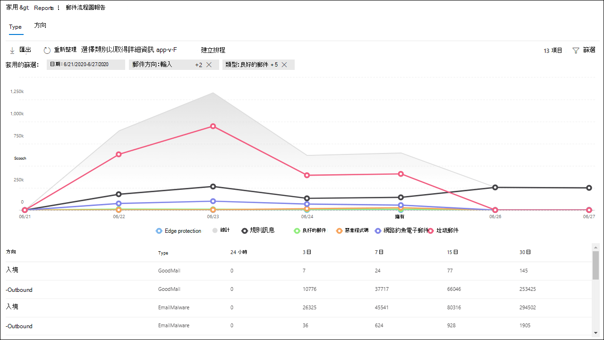

### 郵件流程狀態報表的方向視圖

如果您按一下 [ **方向** ] 索引標籤，則會使用 [ **類型** ] 視圖中的相同預設篩選器。

圖表是依 **方向** 值進行組織。

您可以按一下 [ **篩選器** ] 或按一下 [圖表圖例] 中的值來變更這些篩選。 會使用 [ **類型** ] 視圖中的相同篩選器。

資料表格包含的資訊來自 **類型** view。

[ **選擇類別** ] 如需詳細資料，可用的選取專案和行為與「 **類型** 」視圖相同。

**匯出** ：

在 [詳細資料] 視圖中，您只能匯出一天的資料。 因此，如果您想要匯出資料7天，您必須做7種不同的匯出動作。

每個匯出的 .csv 檔案限制為150000列。 如果該天的資料包含超過150000列，則會建立多個 .csv 檔案。

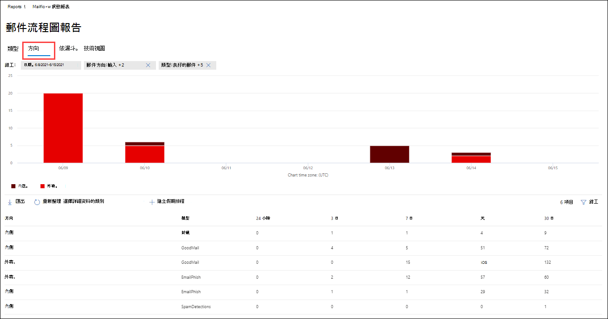

### 郵件流程狀態報表的漏斗視圖

**漏斗** 視圖顯示 Microsoft 的電子郵件威脅防護功能如何篩選組織中的內送和外寄電子郵件。 它提供有關電子郵件總數的詳細資訊，以及設定的威脅防護功能（包括 edge protection、反惡意程式碼、反網路釣魚、反垃圾郵件和反欺詐）對此計數的影響。

如果您按一下 [ **漏斗** ] 索引標籤，此 view 預設會包含圖表和使用下列篩選設定的資料表：

- **日期** ：過去7天。

- **方向** ：

  - **入境**
  - **出境**
  - **組織內** ：此計數是針對在租使用者中傳送的郵件進行計數;亦即，寄件者 abc@domain.com 會傳送給收件者 xyz@domain.com (與輸入和外寄) 分開計數。

匯總 view 和 data table view 允許90天的篩選。

如果您按一下 [ **篩選** ]，則可以篩選圖表和資料表格。

此圖顯示按下列方式組織的電子郵件計數：

- **電子郵件總數**
- **Edge protection 之後的電子郵件**
- **反惡意程式碼、檔信譽、檔案類型封鎖後的電子郵件**
- **反網路釣魚、URL 信譽、品牌模擬、反欺騙功能之後的電子郵件**
- **反垃圾郵件、大宗郵件篩選後的電子郵件**
- **使用者和網域模擬1之後的電子郵件**
- 檔案 **及 URL 引爆1後的電子郵件**
- **在傳遞投遞後保護後，電子郵件偵測為良性 (URL 按一下時間保護)**

僅限1 Defender for Office 365

若要分別查看以 EOP 或 Defender for Office 365 篩選的電子郵件，請按一下 [圖表圖例] 中的值。

此資料表包含下列資訊（以遞減的日期順序顯示）：

- **Date**
- **電子郵件總數**
- **Edge protection** 
- **反惡意程式碼、檔信譽、檔案類型封鎖** ：
  - **檔信譽** ：由於其他 Microsoft 客戶附加的檔案識別，因此篩選郵件。
  - **檔案類型封鎖** ：由於郵件中識別的惡意檔案類型，篩選郵件。      
- **反網路釣魚、URL 信譽、品牌模仿、反欺騙** ：
  - **URL 信譽** ：由於其他 Microsoft 客戶的 url 身分識別而篩選的郵件。
  - **品牌** 模擬：因為郵件是由眾所周知的品牌類比寄件者所過濾，所以會加以篩選。
  - **反欺騙** ：因為郵件企圖哄騙收件者所屬的網域，或是郵件寄件者不會擁有的網域，所以篩選掉郵件。  
- **反垃圾郵件，大宗郵件篩選** ：
  - **大宗郵件篩選** ：郵件因嘗試將大宗郵件傳遞給其收件者而加以篩選。 
- **適用于 Office 365 (Defender 的使用者和網域模擬)** ：
  - **使用者** 模擬：郵件因嘗試模擬使用者 (郵件寄件者) （已在反網路釣魚原則的類比保護設定中所定義）而篩選。
  - **網域** 模擬：郵件因嘗試模擬防網路釣魚原則之類比保護設定中所定義的網域而篩選出來。 
- 檔案 **與 URL 引爆 (Office 365 的 Defender)** ：
  - **檔引爆** ：以安全附件原則篩選的郵件。
  - **URL 引爆** ：以安全連結原則篩選的郵件。  
- **投遞後保護和 zap (ATP) 或 zap (EOP)** ： zap 表示自動清除零小時。

如果您選取資料表格中的資料列，則會在飛入的電子郵件計數中顯示進一步細分。

**匯出** ：

在 [ **選項** ] 下按一下 [ **匯出** ] 後，您可以選取下列其中一個值：

- **資料摘要 (，最多) 過去90天的資料**
- **詳細資料 (過去30天的資料，最多)**

在 [ **日期** ] 下，選擇範圍，然後 **按一下 [** 套用]。 目前篩選的資料會匯出至 .csv 檔案。

每個匯出的 .csv 檔案限制為150000列。 如果資料包含超過150000列，則會建立多個 .csv 檔案。

 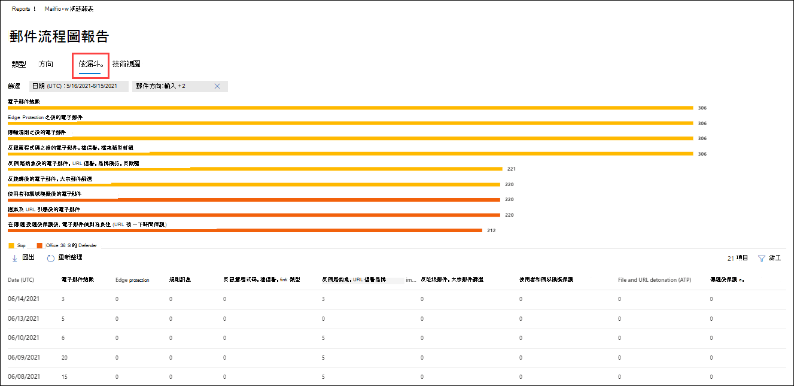

### 郵件流程狀態報表的技術視圖

**技術視圖** 類似 **漏斗** 圖模式，可提供設定威脅防護功能的更細微細節。 您可以從圖表中查看郵件如何在威脅防護的不同階段進行分類。

如果您按一下 [ **技術視圖** ] 索引標籤，此視圖預設會包含圖表和使用下列篩選所設定的資料表：

- **日期** ：過去7天。

- **方向** ：

  - **入境**
  - **出境**
  - **組織內** ：此計數是針對承租人中的郵件，亦即 寄件者 abc@domain.com 會傳送至收件者 xyz@domain.com (與輸入和輸出) 分開計數

匯總 view 和 data table view 允許90天的篩選。

如果您按一下 [ **篩選** ]，則可以篩選圖表和資料表格。

此圖顯示組織成下列類別的郵件：

- **電子郵件總數**
- **Edge 允許，已篩選 edge**
- **不是惡意程式碼、安全附件偵測 (Defender for Office 365) ，反惡意程式碼引擎偵測，規則區塊**
- **不是網路釣魚詐騙、DMARC 失敗、模仿偵測、欺騙偵測、網路釣魚偵測偵測**
- **沒有偵測使用 URL 引爆，URL 引爆偵測 (Defender for Office 365)**
- **非垃圾郵件、垃圾郵件**
- **非惡意的電子郵件、安全連結偵測 (Defender for Office 365) ，ZAP**

當您將游標移到圖表中的某個類別時，您可以看到該類別中的郵件數目。

此資料表包含下列資訊（以遞減的日期順序顯示）：

- **Date**
- **電子郵件總數**
- **已篩選 Edge**
- **反惡意程式碼引擎、安全附件、已篩選的規則** 。。
  - 已 **篩選的規則** ：由於郵件流程規則而篩選的郵件 (也稱為傳輸規則) 。
- **DMARC，類比，欺騙，網路釣魚篩選** ：
  - **DMARC** ：由於郵件失敗的 DMARC 驗證檢查而篩選的郵件。 
- **URL 引爆偵測**
- **已篩選的反垃圾郵件**
- **移除的 ZAP**
- **安全連結偵測**

如果您選取資料表格中的資料列，則會在飛入的電子郵件計數中顯示進一步細分。

**匯出** ：

在按一下 [ **匯出** ] 的 [ **選項** ] 底下，您可以選取下列其中一個值：

- **資料摘要 (，最多) 過去90天的資料**
- **詳細資料 (過去30天的資料，最多)**

在 [ **日期** ] 下，選擇範圍，然後 **按一下 [** 套用]。 目前篩選的資料會匯出至 .csv 檔案。

每個匯出的 .csv 檔案限制為150000列。 如果資料包含超過150000列，則會建立多個 .csv 檔案。

 

## 傳送和接收的電子郵件報告

「 **傳送及接收的電子郵件** 報告」是一個智慧報告，顯示傳入和傳出電子郵件的相關資訊，包括垃圾郵件偵測、惡意程式碼，以及識別為「良好」的電子郵件。 此報告與 [郵件流程狀態報表](#mailflow-status-report) 之間的差異為：此報告不包含 edge protection 所封鎖之郵件的相關資料。請務必瞭解，如果郵件傳送給五位收件者，我們會將其統計為一封郵件。

報表的匯總視圖和詳細資料檢視允許90天的篩選。

若要查看報告，請開啟 [安全性 & 規範中心](https://protection.office.com)，移至 [ **報告** ] \> **儀表板** ，然後選取 [ **已傳送及已接收的電子郵件** ]。 若要直接前往報表，請開啟 <https://protection.office.com/reportv2?id=SentAndReceivedMailATP> 。

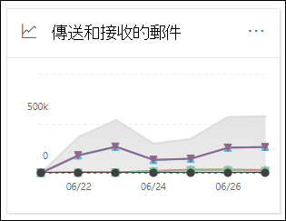

### 傳送和接收的電子郵件報告的報表檢視

報表檢視提供下列圖表：

- **分解方式：類型** ：圖表會顯示所有可用的類別：

  - **Total**
  - **良好的郵件**
  - **惡意程式碼 (反惡意程式碼)** (EOP) 
  - **垃圾郵件偵測**
  - **規則訊息**
  - Microsoft Defender for Office 365 的 **高級惡意** 代碼 () 

  當您將滑鼠停留在圖表中的某一天 (資料點) 時，您就可以查看該天的詳細資料。

  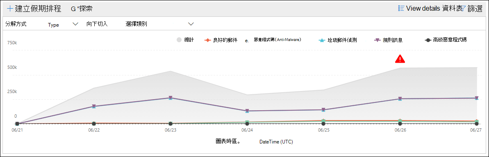

- **分解方式：方向** ：圖表會顯示 **總計** 、 **輸入** 和 **輸出** 資料。 當您將滑鼠停留在圖表中的某一天 (資料點) 時，您就可以查看該天的詳細資料。

  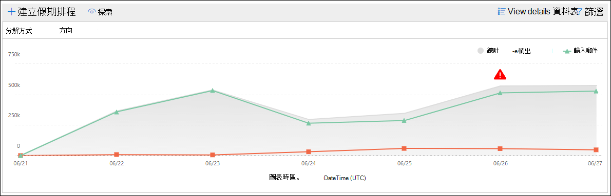

- **向下** \> 鑽取 **惡意軟體 (反惡意程式碼)** ：這項選擇會帶您前往 [電子郵件報告中的惡意](view-email-security-reports.md#malware-detections-in-email-report)代碼偵測。

- **向下** \> 鑽取 **垃圾郵件偵測)** ：這項選擇會帶您前往 [垃圾郵件偵測報告](view-email-security-reports.md#spam-detections-report)。

如果您按一下報表檢視中的 **篩選器** ，您可以使用下列篩選器修改結果：

- **開始日期** 和 **結束日期**
- 方向值
- 類型值

若要回到報表檢視，請按一下 [ **查看報告** ]。

### 傳送及接收的電子郵件報告的詳細資料表格視圖

如果您按一下 [按下列方式] 中的 [ **View details table** **：方向** ] 或 [ **分解方式** ]： [方向] 視圖，會顯示下列資訊：

- **日期 (UTC)**
- **Type**
- **方向**
- **訊息計數**

如果您按一下 [詳細資料] 表格視圖中的 [ **篩選** ]，您可以使用下列篩選器修改結果：

- **開始日期** 和 **結束日期**
- 方向值
- 類型值

若要回到報表檢視，請按一下 [ **查看報告** ]。

## 主要寄件者和收件者報表

[ **主要寄件者與收件** 者] 報告為圓形圖，顯示您的電子郵件寄件者和收件者。

若要查看報告，請開啟 [安全性 & 規範中心](https://protection.office.com)，移至 [ **報告** ] \> **儀表板** ，然後選取 [ **主要寄件者和收件** 者]。 若要直接前往報表，請開啟 <https://protection.office.com/reportv2?id=TopSenderRecipientsATP> 。

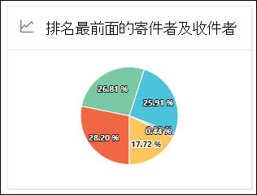

### 主要寄件者和收件者報表的報表檢視

報表檢視提供下列圖表：

- **顯示 \> 主要郵件寄件者的資料**
- **顯示 \> 主要郵件收件者的資料**
- **顯示 \> 主要垃圾郵件收件者的資料**
- **顯示資料 \> 主要惡意** 代碼收件者 (EOP) 
- **顯示主要惡意程式碼收件者的資料 \> (Defender For Office 365)** 

圓形圖的組成會根據這些選取範圍變更。

當您將游標移到圓形圖中的楔形上方時，您可以看到所傳送或接收的郵件計數。

如果您按一下報表檢視中的 [ **篩選器** ]，您可以指定具有 **開始日期** 和 **結束日期** 的日期範圍。

![在 [主要寄件者和收件者] 報告中的報表檢視中的圓形圖表](../../media/top-senders-and-recipients-report-view.png)

### 主要寄件者和收件者報告的詳細資料表格視圖

如果您按一下 [ **查看詳細資料] 表格** ，顯示的資訊將取決於您所查看的圖表：

- **顯示 \> 主要郵件寄件者的資料**

  - **主要郵件寄件者**
  - **Count**

- **顯示 \> 主要郵件收件者的資料**

  - **主要郵件收件者**
  - **Count**

- **顯示 \> 主要垃圾郵件收件者的資料**

  - **主要垃圾郵件收件者**
  - **Count**

- **顯示資料 \> 主要惡意** 代碼收件者 (EOP) 

  - **主要惡意程式碼收件者**
  - **Count**

- **顯示主要惡意程式碼收件者的資料 \> (Defender For Office 365)** 

  - **Office 365 (Defender 的主要惡意程式碼收件者)**
  - **Count**

如果您按一下 [詳細資料] 表格視圖中的 [ **篩選** ]，您可以指定具有 **開始日期** 和 **結束日期** 的日期範圍。

若要回到報表檢視，請按一下 [ **查看報告** ]。

## 查看這些報表所需的許可權為何？

若要查看和使用報表，您必須是在安全性 & 規範中心 **和** Exchange Online 中所指定角色群組的成員。

- 在安全性 & 規範中心，您必須是下列其中一個角色群組的成員：

  -組織管理-安全性管理員 (您也可以在 [Azure Active Directory 系統管理中心](https://aad.portal.azure.com) 進行此作業-安全性讀取器

  如需詳細資訊，請參閱[安全性與合規性中心中的權限](https://docs.microsoft.com/microsoft-365/security/office-365-security/permissions-in-the-security-and-compliance-center)。

- 在 Exchange Online 中，您必須是下列其中一個角色群組的成員：

  -組織管理-僅限查看組織管理-View-Only 收件者-合規性管理

如需詳細資訊，請參閱 exchange online 中的 [許可權](https://docs.microsoft.com/Exchange/permissions-exo/permissions-exo) 和 [exchange Online 中的管理角色群組](https://docs.microsoft.com/Exchange/permissions-exo/role-groups)。

## 相關主題

[安全性與合規性中心內的智慧型報表和深入解析](reports-and-insights-in-security-and-compliance.md)

[安全性與合規性中心內的郵件流程深入解析](mail-flow-insights-v2.md)

[檢視安全性與合規性中心內的電子郵件安全性報告](view-email-security-reports.md)

[查看 Microsoft Defender for Office 365 的報告](view-reports-for-atp.md)
