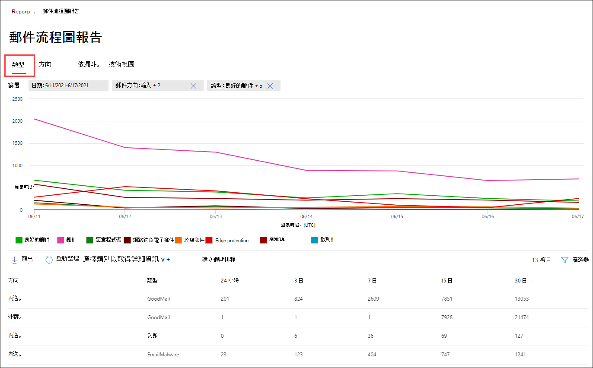

# 在安全性 & 規範中心的報表儀表板中查看郵件流程報告View mail flow reports in the Reports dashboard in Security & Compliance Center

[!INCLUDE [Microsoft 365 Defender rebranding](../includes/microsoft-defender-for-office.md)]

除了安全性 & 合規性中心的 [郵件流程儀表板](mail-flow-insights-v2.md) 中所提供的郵件流程報告之外，「報告」儀表板還提供各種額外的郵件流程報告，可協助您監視 Microsoft 365 組織。In addition to the mail flow reports that are available in the [Mail flow dashboard](mail-flow-insights-v2.md) in the Security & Compliance Center, a variety of additional mail flow reports are available in the Reports dashboard to help you monitor your Microsoft 365 organization.

如果您有[必要的許可權](#what-permissions-are-needed-to-view-these-reports)，您可以移至 [**報表**] 儀表板，在[安全性 & 規範中心](https://office.protection.com)中查看這些報告 \> \*\* \*\*。If you have the [necessary permissions](#what-permissions-are-needed-to-view-these-reports), you can view these reports in the [Security & Compliance Center](https://office.protection.com) by going to **Reports** \> **Dashboard**. 若要直接移至 [報告] 儀表板，請開啟] <https://protection.office.com/insightdashboard> 。To go directly to the Reports dashboard, open <https://protection.office.com/insightdashboard>.

## 連接器報告Connector report

**連接器報告**會顯示為您的組織設定之[輸入和輸出連接器](https://docs.microsoft.com/Exchange/mail-flow-best-practices/use-connectors-to-configure-mail-flow/use-connectors-to-configure-mail-flow)上的郵件流程活動。The **Connector report** shows mail flow activity on the [inbound and outbound connectors](https://docs.microsoft.com/Exchange/mail-flow-best-practices/use-connectors-to-configure-mail-flow/use-connectors-to-configure-mail-flow) that are configured for your organization.

若要查看報告，請開啟 [安全性 & 規範中心](https://protection.office.com)，移至 [ **報告**] \> **儀表板** ，然後選取 [ **連接器報告**]。To view the report, open the [Security & Compliance Center](https://protection.office.com), go to **Reports** \> **Dashboard** and select **Connector report**. 若要直接前往報表，請開啟 <https://protection.office.com/reportv2?id=ConnectorReport> 。To go directly to the report, open <https://protection.office.com/reportv2?id=ConnectorReport>.

### 連接器報表的報表檢視Report view for the Connector report

報表檢視提供下列圖表：The following charts are available in report view:

- **依下列方式查看資料：郵件流程**：此圖顯示輸入的輸入和輸出郵件數目：**View data by: Mail flow**: This chart shows the number of inbound and outbound messages organized by:

  - **Total****Total**
  - **從沒有連接器的網際網路****From the internet without a connector**
  - **沒有連接器的網際網路****To the internet without a connector**
  - 您已設定的特定連接器。A specific connector that you've configured.

  若要隔離圖表中的資料，請使用 [顯示控制項的 **資料** ] 選取其中一個選項或 **所有郵件流程**。To isolate the data in the chart, use the **Show data for** control to select one of these options or **All mail flow**.

  

- **資料查看依據： tls 使用狀況**：此圖顯示郵件流程的傳輸層安全性 (TLS) 版本用法的百分比。**View data by: TLS usage**: This chart shows the percentage of Transport Layer Security (TLS) version usage for mail flow.

  若要隔離圖表中的資料，請使用 [顯示控制項的 **資料** ] 選取下列其中一個選項：To isolate the data in the chart, use the **Show data for** control to select one of the following options:

  - **所有郵件流程****All mail flow**
  - **從沒有連接器的網際網路****From the internet without a connector**
  - **沒有連接器的網際網路****To the internet without a connector**
  - 您已設定的特定連接器。A specific connector that you've configured.

  

如果您按一下報表檢視中的 [ **篩選器** ]，您可以指定具有 **開始日期** 和 **結束日期**的日期範圍。If you click **Filters** in a report view, you can specify a date range with **Start date** and **End date**.

### 連接器報表的詳細資料表格視圖Details table view for the Connector report

如果您按一下報表檢視中的 [ **查看詳細資料] 表格** ，會顯示下列資訊：If you click **View details table** in a report view, the following information is shown:

- **Date****Date**
- **連接器的方向和名稱****Connector direction and name**
- **連接器類型****Connector type**
- **強制 TLS？**：值 **True** 或 **False**。**Forced TLS?**: The value **True** or **False**.
- **沒有 TLS** (百分比) **No TLS** (percentage)
- **TLS 1.0** (百分比) **TLS 1.0** (percentage)
- **TLS 1.1** (百分比) **TLS 1.1** (percentage)
- **TLS 1.2** (百分比) **TLS 1.2** (percentage)
- **磁片**區：郵件數目。**Volume**: The number of messages.

如果您按一下 [詳細資料] 表格視圖中的 [ **篩選** ]，您可以指定具有 **開始日期** 和 **結束日期**的日期範圍。If you click **Filters** in a details table view, you can specify a date range with **Start date** and **End date**.

若要回到報表檢視，請按一下 [ **查看報告**]。To go back to the report view, click **View report**.

## Exchange transport rule 報告Exchange transport rule report

**Exchange transport rule report**會顯示郵件流程規則 (也稱為傳輸規則) 組織中內送和外寄郵件的效果。The **Exchange transport rule report** shows the effect of mail flow rules (also known as transport rules) on incoming and outgoing messages in your organization.

若要查看報告，請開啟 [安全性 & 合規性中心](https://protection.office.com)，移至 [ **報告**] \> **儀表板** ，然後選取 [ **Exchange Transport rule**]。To view the report, open the [Security & Compliance Center](https://protection.office.com), go to **Reports** \> **Dashboard** and select **Exchange Transport rule**. 若要直接前往報表，請開啟 <https://protection.office.com/reportv2?id=ETRRuleReport> 。To go directly to the report, open <https://protection.office.com/reportv2?id=ETRRuleReport>.

### Exchange transport rule 報告的報表檢視Report view for the Exchange transport rule report

報表檢視提供下列圖表：The following charts are available in report view:

- **資料查看依據： Exchange 傳輸規則** \>**分解方式：方向**：此圖顯示受傳輸規則影響的**輸入**和**輸出**郵件數目。**View data by: Exchange transport rules** \> **Break down by: Direction**: This chart shows the number of **Inbound** and **Outbound** messages that were affected by transport rules.

- **資料查看依據： Exchange 傳輸規則** \>**分解方式：嚴重性**：此圖表顯示**高嚴重性**和**中低嚴重性**的數目，以及**低嚴重性**郵件。**View data by: Exchange transport rules** \> **Break down by: Severity**: This chart shows the number of **High severity** and **Medium severity**, and **Low severity** messages. 您可以將嚴重性層級設定為規則 ([ **以嚴重性層級** 或 _SetAuditSeverity_) 審核此規則] 中的動作。You set the severity level as an action in the rule (**Audit this rule with severity level** or _SetAuditSeverity_). 如需詳細資訊，請參閱 [Exchange Online 中的郵件流程規則動作](https://docs.microsoft.com//Exchange/security-and-compliance/mail-flow-rules/mail-flow-rule-actions)。For more information, see [Mail flow rule actions in Exchange Online](https://docs.microsoft.com//Exchange/security-and-compliance/mail-flow-rules/mail-flow-rule-actions).

- **依下列方式查看資料： DLP Exchange transport rules** \>**分解方式：方向**：此圖顯示受資料遺失防護 (DLP) 傳輸規則所影響的**輸入**和**輸出**郵件數目。**View data by: DLP Exchange transport rules** \> **Break down by: Direction**: This chart shows the number of **Inbound** and **Outbound** messages that were affected by data loss prevention (DLP) transport rules. 您可以選取下列選項來進一步精煉圖表：You can further refine the chart by selecting on of the following options:

  - **顯示資料：所有 DLP transport rules****Show data for: All DLP transport rules**
  - **顯示下列專案的資料：已遭破壞的使用者****Show data for: Compromised users**
  - **顯示資料：偵測到的內容量下限美國愛國法案****Show data for: Low volume of content detected U.S. Patriot Act**

- **依下列方式查看資料： DLP Exchange transport rules** \>**分解方式：方向**：此 View 顯示**高嚴重性**和**中低嚴重性**的數目，以及受 DLP transport rules 影響的**低嚴重性**郵件。**View data by: DLP Exchange transport rules** \> **Break down by: Direction**: This view shows the number of **High severity** and **Medium severity**, and **Low severity** messages that were affected by DLP transport rules. 您可以選取下列選項來進一步精煉圖表：You can further refine the chart by selecting on of the following options:

  - **顯示資料：所有 DLP transport rules****Show data for: All DLP transport rules**
  - **顯示下列專案的資料：已遭破壞的使用者****Show data for: Compromised users**
  - **顯示資料：偵測到的內容量下限美國愛國法案****Show data for: Low volume of content detected U.S. Patriot Act**

如果您按一下報表檢視中的 **篩選器** ，您可以使用下列篩選器修改結果：If you click **Filters** in a report view, you can modify the results with the following filters::

- **開始日期** 和 **結束日期****Start date** and **End date**
- 方向值Direction values
- 嚴重性值Severity values

### Exchange transport rule 報告的詳細資料表格視圖Details table view for the Exchange transport rule report

如果您按一下 [ **查看詳細資料] 表格**，顯示的資訊將取決於您所查看的圖表：If you click **View details table**, the information that's shown depends on the chart you were looking at:

- **依下列方式查看資料： Exchange Transport rules**：**View data by: Exchange Transport rules**:

  - **Date****Date**
  - **傳輸規則****Transport rule**
  - **Subject****Subject**
  - **寄件者位址****Sender address**
  - **收件者位址****Recipient address**
  - **嚴重性****Severity**
  - **Direction****Direction**

- 透過**下列方式查看資料： DLP Exchange transport rules**：**View data by: DLP Exchange transport rules**:

  - **Date****Date**
  - **DLP 原則****DLP policy**
  - **傳輸規則****Transport rule**
  - **Subject****Subject**
  - **寄件者位址****Sender address**
  - **收件者位址****Recipient address**
  - **嚴重性****Severity**
  - **Direction****Direction**

如果您按一下 [詳細資料] 表格視圖中的 [ **篩選** ]，您可以使用下列篩選器修改結果：If you click **Filters** in a details table view, you can modify the results with the following filters:

- **開始日期** 和 **結束日期****Start date** and **End date**
- 方向值Direction values
- 嚴重性值Severity values

若要回到報表檢視，請按一下 [ **查看報告**]。To go back to the report view, click **View report**.

## 轉接報告Forwarding report

轉寄 **報告** 顯示組織自動轉寄給來自 Exchange Online 信箱的外部網域的郵件。The **Forwarding report** shows your organization's automatically forwarded messages to external domains from Exchange Online mailboxes. 轉寄的郵件可能會造成安全性或規範風險，而且可能會指出已遭破壞的帳戶。Forwarded messages can pose a security or compliance risk, and might indicate a compromised account.

若要查看報告，請開啟 [安全性 & 規範中心](https://protection.office.com)，移至 [ **報告**] \> **儀表板** ，然後選取 [ **轉接報告**]。To view the report, open the [Security & Compliance Center](https://protection.office.com), go to **Reports** \> **Dashboard** and select **Forwarding report**. 若要直接前往報表，請開啟 <https://protection.office.com/reportv2?id=MailFlowForwarding> 。To go directly to the report, open <https://protection.office.com/reportv2?id=MailFlowForwarding>.

### 轉送報告的報表檢視Report view for the Forwarding report

報表檢視提供下列圖表：The following charts are available in the report view:

- **顯示資料：轉寄方法**：會顯示下列方法：**Show data for: Forwarding methods**: The following methods are shown:

  - **傳輸規則**：也稱為「 [郵件流程規則](https://docs.microsoft.com/Exchange/security-and-compliance/mail-flow-rules/mail-flow-rules)」。**Transport rule**: Also known as [mail flow rules](https://docs.microsoft.com/Exchange/security-and-compliance/mail-flow-rules/mail-flow-rules).
  - **信箱規則**：也稱為 [收件匣規則](https://support.microsoft.com/office/c24f5dea-9465-4df4-ad17-a50704d66c59)。**Mailbox rule**: Also known as [Inbox rules](https://support.microsoft.com/office/c24f5dea-9465-4df4-ad17-a50704d66c59).

  

- **顯示下列專案的資料：轉寄網域**：此視圖顯示是轉寄目的地的收件者網域。**Show data for: Forwarding domains**: This view shows the recipient domains that are the destinations for forwarding.

  

- 顯示下列專案的**資料：轉寄站**：下列是顯示的轉寄站：**Show data for: Forwarders**: The following forwarders are shown:

  - **傳輸規則****Transport rule**
  - 包含轉寄收件匣規則的信箱。The mailbox that contains the forwarding Inbox rule.

  

如果您按一下報表檢視中的 [ **篩選器** ]，您可以指定具有 **開始日期** 和 **結束日期**的日期範圍。If you click **Filters** in a report view, you can specify a date range with **Start date** and **End date**.

### 轉接報告的詳細資料表格視圖Details table view for the Forwarding report

如果您按一下報表檢視中的 [ **查看詳細資料] 表格** ，會顯示下列資訊：If you click **View details table** in a report view, the following information is shown:

- 轉送**器**：值**傳輸規則**或包含轉寄收件匣規則的信箱。**Forwarders**: The value **Transport rule** or the mailbox that contains the forwarding Inbox rule.
- **轉送類型**：值 **信箱規則** 或 **傳輸規則**。**Forwarding type**: The value **Mailbox rule** or **Transport rule**.
- **收件者名稱****Recipient name**
- **收件者網域****Recipient domain**
- **詳細資料**：這是郵件流程規則的 GUID 值，或收件匣規則的 RuleIdentity 值。**Details**: This is the GUID value of the mail flow rule, or the RuleIdentity value of the Inbox rule.
- **Count****Count**
- **第一個轉寄日期****First forward date**

如果您按一下 [詳細資料] 表格視圖中的 [ **篩選** ]，您可以指定具有 **開始日期** 和 **結束日期**的日期範圍。If you click **Filters** in a details table view, you can specify a date range with **Start date** and **End date**.

若要回到 [報告] 視圖，請按一下 [ **查看報告**]。To go back to the reports view, click **View report**.

## 郵件流程狀態報表Mailflow status report

**郵件流程狀態報表**類似于[已傳送及已接收的電子郵件報告](#sent-and-received-email-report)，包含有關在 edge 上允許或封鎖之電子郵件的詳細資訊。The **Mailflow status report** is similar to the [Sent and received email report](#sent-and-received-email-report), with additional information about email allowed or blocked on the edge. 這是唯一包含 edge protection 資訊的報告，它會顯示在 Exchange Online Protection (EOP) 中，允許在評估之前封鎖多少封電子郵件。This is the only report that contains edge protection information, and shows just how much email is blocked before being allowed into the service for evaluation by Exchange Online Protection (EOP). 請務必瞭解，如果郵件傳送給五位收件者，我們會將其統計為五個不同的郵件，而不是一封郵件。It's important to understand that if a message is sent to five recipients we count it as five different messages and not one message.
若要查看報告，請開啟 [安全性 & 合規性中心](https://protection.office.com)，移至 [ **報表**] \> **儀表板** ，然後選取 [ **郵件流程狀態報表**]。To view the report, open the [Security & Compliance Center](https://protection.office.com), go to **Reports** \> **Dashboard** and select **Mailflow status report**. 若要直接移至 [ **郵件流程] 狀態報表**，請開啟] <https://protection.office.com/mailflowStatusReport> 。To go directly to the **Mail flow status report**, open <https://protection.office.com/mailflowStatusReport>.

### 郵件流程狀態報表的類型視圖Type view for the Mailflow status report

當您開啟報表時，預設會選取 [ **類型** ] 索引標籤。When you open the report, the **Type** tab is selected by default. 根據預設，此視圖包含的圖表和使用下列篩選器設定的資料表：By default, this view contains a chart and a data table that's configured with the following filters:

- **日期**：過去7天。**Date**: The last 7 days.
- **方向**：**Direction**:

  - **入境****Inbound**
  - **出境****Outbound**
  - **組織內**：此計數是針對承租人中的郵件，亦即**Intra-org**: this count is for messages within a tenant i.e 寄件者 abc@domain.com 會傳送至收件者 xyz@domain.com (與 **輸入** 和 **輸出**) 分開計數sender abc@domain.com sends to recipient xyz@domain.com  (counted separately from **Inbound** and **Outbound**)

- **類型**：**Type**:

  - **良好的郵件****Good mail**
  - **惡意程式碼****Malware**
  - **垃圾郵件****Spam**
  - **Edge protection****Edge protection**
  - **規則訊息****Rule messages**
  - **網路釣魚電子郵件****Phishing email**

圖表是依 **類型** 值進行組織。The chart is organized by the **Type** values.

您可以按一下 [ **篩選器** ] 或按一下 [圖表圖例] 中的值來變更這些篩選。You can change these filters by clicking **Filter** or by clicking a value in the chart legend.

此資料表包含下列資訊：The data table contains the following information:

- **Direction****Direction**
- **Type****Type**
- **24 小時****24 hours**
- **3天****3 days**
- **7 天****7 days**
- **15 天****15 days**
- **30 天****30 days**

如果您按一下 **[選擇類別] 以取得詳細資料**，您可以選取下列值：If you click **Choose a category for more details**, you can select from the following values:

- **網路釣魚電子郵件**：這項選擇會帶您前往「 [威脅防護狀態」報告](view-email-security-reports.md#threat-protection-status-report)。**Phishing email**: This selection takes you to the [Threat protection status report](view-email-security-reports.md#threat-protection-status-report).
- **電子郵件中的惡意**代碼：這項選擇會帶您前往 [威脅防護狀態報表](view-email-security-reports.md#threat-protection-status-report)。**Malware in email**: This selection takes you to the [Threat protection status report](view-email-security-reports.md#threat-protection-status-report).
- **垃圾郵件**偵測：這項選擇會帶您前往 [垃圾郵件偵測報告](view-email-security-reports.md#spam-detections-report)。**Spam detections**: This selection takes you to the [Spam Detections report](view-email-security-reports.md#spam-detections-report).
- **Edge 封鎖的垃圾郵件**：這項選擇會帶您前往 [垃圾郵件偵測報告](view-email-security-reports.md#spam-detections-report)。**Edge blocked spam**: This selection takes you to the [Spam Detections report](view-email-security-reports.md#spam-detections-report).

**匯出**：**Export**:

在 [詳細資料] 視圖中，您只能匯出一天的資料。For the detail view, you can only export data for one day. 因此，如果您想要匯出資料7天，您必須做7種不同的匯出動作。So, if you want to export data for 7 days, you need to do 7 different export actions.

每個匯出的 .csv 檔案限制為150000列。Each exported .csv file is limited to 150,000 rows. 如果該天的資料包含超過150000列，則會建立多個 .csv 檔案。If the data for that day contains more than 150,000 rows, then multiple .csv files will be created.

### 郵件流程狀態報表的方向視圖Direction view for the Mailflow status report

如果您按一下 [ **方向** ] 索引標籤，則會使用 [ **類型** ] 視圖中的相同預設篩選器。If you click the **Direction** tab, the same default filters from the **Type** view are used.

圖表是依 **方向** 值進行組織。The chart is organized by **Direction** values.

您可以按一下 [ **篩選器** ] 或按一下 [圖表圖例] 中的值來變更這些篩選。You can change these filters by clicking **Filter** or by clicking a value in the chart legend. 會使用 [ **類型** ] 視圖中的相同篩選器。The same filters from the **Type** view are used.

資料表格包含的資訊來自 **類型** view。The data table contains same information from the **Type** view.

[ **選擇類別** ] 如需詳細資料，可用的選取專案和行為與「 **類型** 」視圖相同。The **Choose a category for more details** available selections and behavior are the same as the **Type** view.

**匯出**：**Export**:

在 [詳細資料] 視圖中，您只能匯出一天的資料。For the detail view, you can only export data for one day. 因此，如果您想要匯出資料7天，您必須做7種不同的匯出動作。So, if you want to export data for 7 days, you need to do 7 different export actions.

每個匯出的 .csv 檔案限制為150000列。Each exported .csv file is limited to 150,000 rows. 如果該天的資料包含超過150000列，則會建立多個 .csv 檔案。If the data for that day contains more than 150,000 rows, then multiple .csv files will be created.

### 郵件流程狀態報表的漏斗視圖Funnel view for the Mailflow status report

**漏斗**視圖顯示 Microsoft 的電子郵件威脅防護功能如何篩選組織中的內送和外寄電子郵件。The **Funnel** view shows you how Microsoft's email threat protection features filter incoming and outgoing email in your organization. 它提供有關電子郵件總數的詳細資訊，以及設定的威脅防護功能（包括 edge protection、反惡意程式碼、反網路釣魚、反垃圾郵件和反欺詐）對此計數的影響。It provides details on the total email count, and how the configured threat protection features, including edge protection, anti-malware, anti-phishing, anti-spam, and anti-spoofing affect this count.

如果您按一下 [ **漏斗** ] 索引標籤，此 view 預設會包含圖表和使用下列篩選設定的資料表：If you click the **Funnel** tab, by default, this view contains a chart and a data table that's configured with the following filters:

- **日期**：過去7天。**Date**: The last 7 days.

- **方向**：**Direction**:

  - **入境****Inbound**
  - **出境****Outbound**
  - **組織內**：此計數是針對在租使用者中傳送的郵件進行計數;亦即，寄件者 abc@domain.com 會傳送給收件者 xyz@domain.com (與輸入和外寄) 分開計數。**Intra-org**: This count is for messages sent within a tenant; i.e, sender abc@domain.com sends to recipient xyz@domain.com (counted separately from Inbound and Outbound).

匯總 view 和 data table view 允許90天的篩選。The aggregate view and data table view allow for 90 days of filtering.

如果您按一下 [ **篩選**]，則可以篩選圖表和資料表格。If you click **Filter**, you can filter both the chart and the data table.

此圖顯示按下列方式組織的電子郵件計數：This chart shows the email count organized by:

- **電子郵件總數****Total email**
- **Edge protection 之後的電子郵件****Email after edge protection**
- **反惡意程式碼、檔信譽、檔案類型封鎖後的電子郵件****Email after anti-malware, file reputation, file type block**
- **反網路釣魚、URL 信譽、品牌模擬、反欺騙功能之後的電子郵件****Email after anti-phish, URL reputation, brand impersonation, anti-spoof**
- **反垃圾郵件、大宗郵件篩選後的電子郵件****Email after anti-spam, bulk mail filtering**
- **使用者和網域模擬1之後的電子郵件** **Email after user and domain impersonation**1
- 檔案**及 URL 引爆1後的電子郵件** **Email after file and URL detonation**1
- \*\*在傳遞投遞後保護後，電子郵件偵測為良性 (URL 按一下時間保護) \*\***Email detected as benign after post-delivery protection (URL click time protection)**

僅限1個 OFFICE 365 ATP1 Office 365 ATP only

若要分別查看以 EOP 或 ATP 篩選的電子郵件，請按一下 [圖表圖例] 中的值。To view the email filtered by EOP or ATP separately, click on the value in the chart legend.

此資料表包含下列資訊（以遞減的日期順序顯示）：The data table contains the following information, shown in descending date order:

- **Date****Date**
- **電子郵件總數****Total email**
- **Edge protection****Edge protection**
- **反惡意程式碼、檔信譽、檔案類型封鎖****Anti-malware, file reputation, file type block**
- **反網路釣魚、URL 信譽、品牌模仿、反欺騙****Anti-phish, URL reputation, Brand impersonation, anti-spoof**
- **反垃圾郵件、大宗郵件篩選****Anti-spam, bulk mail filtering**
- \*\* (ATP) 的使用者和網域類比 \*\***User and domain impersonation (ATP)**
- \*\*檔案與 URL 引爆 (ATP) \*\***File and URL detonation (ATP)**
- \*\*後續傳遞保護和 ZAP (ATP) 或 ZAP (EOP) \*\***Post-delivery protection and ZAP (ATP), or ZAP (EOP)**

如果您選取資料表格中的資料列，則會在飛入的電子郵件計數中顯示進一步細分。If you select a row in the data table, a further breakdown of the email counts are shown in the flyout.

**匯出**：**Export**:

在 [**選項**] 下按一下 [**匯出**] 後，您可以選取下列其中一個值：After you click **Export** under **Options**, you can select one of the following values:

- \*\*資料摘要 (，最多) 過去90天的資料 \*\***Summary (with data for last 90 days at most)**
- \*\*詳細資料 (過去30天的資料，最多) \*\***Details (with data for last 30 days at most)**

在 [ **日期**] 下，選擇範圍，然後 **按一下 [** 套用]。Under **Date**, choose a range, and then click **Apply**. 目前篩選的資料會匯出至 .csv 檔案。Data for the current filters will be exported to a .csv file.

每個匯出的 .csv 檔案限制為150000列。Each exported .csv file is limited to 150,000 rows. 如果資料包含超過150000列，則會建立多個 .csv 檔案。If the data contains more than 150,000 rows, then multiple .csv files will be created.

 

### 郵件流程狀態報表的技術視圖Tech view for the Mailflow status report

**技術視圖**類似**漏斗**圖模式，可提供設定威脅防護功能的更細微細節。The **Tech view** is similar to the **Funnel** view, providing more granular details for the configured threat protections features. 您可以從圖表中查看郵件如何在威脅防護的不同階段進行分類。From the chart, you can see how messages are categorized at the different stages of threat protection.

如果您按一下 [ **技術視圖** ] 索引標籤，此視圖預設會包含圖表和使用下列篩選所設定的資料表：If you click the **Tech view** tab, by default, this view contains a chart and a data table that's configured with the following filters:

- **日期**：過去7天。**Date**: The last 7 days.

- **方向**：**Direction**:

  - **入境****Inbound**
  - **出境****Outbound**
  - **組織內**：此計數是針對承租人中的郵件，亦即**Intra-org**: this count is for messages within a tenant i.e 寄件者 abc@domain.com 會傳送至收件者 xyz@domain.com (與輸入和輸出) 分開計數sender abc@domain.com sends to recipient xyz@domain.com (counted separately from Inbound and Outbound)

匯總 view 和 data table view 允許90天的篩選。The aggregate view and data table view allow for 90 days of filtering.

如果您按一下 [ **篩選**]，則可以篩選圖表和資料表格。If you click **Filter**, you can filter both the chart and the data table.

此圖顯示組織成下列類別的郵件：This chart shows messages organized into the following categories:

- **電子郵件總數****Total email**
- **Edge 允許，已篩選 edge****Edge allow, edge filtered**
- **非惡意程式碼、安全附件偵測 (ATP) 、反惡意程式碼引擎偵測、規則區塊****Not malware, Safe attachments detection (ATP), Anti-malware engine detection, rule block**
- **不是網路釣魚詐騙、DMARC 失敗、模仿偵測、欺騙偵測、網路釣魚偵測偵測****Not phish, DMARC failure, impersonation detection, spoof detection, phish detection**
- \*\*沒有偵測 URL 引爆，URL 引爆偵測 (ATP) \*\***No detection with URL detonation, URL detonation detection (ATP)**
- **非垃圾郵件、垃圾郵件****Not spam, spam**
- **非惡意的電子郵件、安全連結偵測 (ATP) 、ZAP****Non-malicious email, safe links detection (ATP), ZAP**

當您將游標移到圖表中的某個類別時，您可以看到該類別中的郵件數目。When you hover over a category in the chart, you can see the number of messages in that category.

此資料表包含下列資訊（以遞減的日期順序顯示）：The data table contains the following information, shown in descending date order:

- **Date****Date**
- **電子郵件總數****Total email**
- **已篩選 Edge****Edge filtered**
- **反惡意程式碼引擎、安全附件、已篩選的規則****Anti-malware engine, safe attachments, rule filtered**
- **DMARC，模擬，欺騙，網路釣魚篩選****DMARC, impersonation, spoof, phish filtered**
- **URL 引爆偵測****URL detonation detection**
- **已篩選的反垃圾郵件****Anti-spam filtered**
- **移除的 ZAP****ZAP removed**
- **安全連結偵測****Detection by safe links**

如果您選取資料表格中的資料列，則會在飛入的電子郵件計數中顯示進一步細分。If you select a row in the data table, a further breakdown of the email counts are shown in the flyout.

**匯出**：**Export**:

在按一下 [ **匯出**] 的 [ **選項** ] 底下，您可以選取下列其中一個值：On clicking **Export**, under **Options** you can select one of the following values:

- \*\*資料摘要 (，最多) 過去90天的資料 \*\***Summary (with data for last 90 days at most)**
- \*\*詳細資料 (過去30天的資料，最多) \*\***Details (with data for last 30 days at most)**

在 [ **日期**] 下，選擇範圍，然後 **按一下 [** 套用]。Under **Date**, choose a range, and then click **Apply**. 目前篩選的資料會匯出至 .csv 檔案。Data for the current filters will be exported to a .csv file.

每個匯出的 .csv 檔案限制為150000列。Each exported .csv file is limited to 150,000 rows. 如果資料包含超過150000列，則會建立多個 .csv 檔案。If the data contains more than 150,000 rows, then multiple .csv files will be created.

 

## 傳送和接收的電子郵件報告Sent and received email report

「 **傳送及接收的電子郵件** 報告」是一個智慧報告，顯示傳入和傳出電子郵件的相關資訊，包括垃圾郵件偵測、惡意程式碼，以及識別為「良好」的電子郵件。The **Sent and received email** report is a smart report that shows information about incoming and outgoing email, including spam detections, malware, and email identified as "good." 此報告與 [郵件流程狀態報表](#mailflow-status-report) 之間的差異為：此報告不包含 edge protection 所封鎖之郵件的相關資料。請務必瞭解，如果郵件傳送給五位收件者，我們會將其統計為一封郵件。The difference between this report and the [Mailflow status report](#mailflow-status-report) is: this report doesn't include data about messages blocked by edge protection.It's important to understand that if a message is sent to five recipients we count it as one message.

報表的匯總視圖和詳細資料檢視允許90天的篩選。The aggregate view and the detail view of the report allow for 90 days of filtering.

若要查看報告，請開啟 [安全性 & 規範中心](https://protection.office.com)，移至 [ **報告**] \> **儀表板** ，然後選取 [ **已傳送及已接收的電子郵件**]。To view the report, open the [Security & Compliance Center](https://protection.office.com), go to **Reports** \> **Dashboard** and select **Sent and received email**. 若要直接前往報表，請開啟 <https://protection.office.com/reportv2?id=SentAndReceivedMailATP> 。To go directly to the report, open <https://protection.office.com/reportv2?id=SentAndReceivedMailATP>.

### 傳送和接收的電子郵件報告的報表檢視Report view for the Sent and received email report

報表檢視提供下列圖表：The following charts are available in the report view:

- **分解方式：類型**：圖表會顯示所有可用的類別：**Break down by: Type**: The chart shows all available categories:

  - **Total****Total**
  - **良好的郵件****Good mail**
  - \*\*惡意程式碼 (反惡意程式碼) \*\* (EOP) **Malware (anti-malware)** (EOP)
  - **垃圾郵件偵測****Spam detections**
  - **規則訊息****Rule messages**
  -  (Office 365 ATP) 的**高級惡意**代碼**Advanced malware** (Office 365 ATP)

  當您將滑鼠停留在圖表中的某一天 (資料點) 時，您就可以查看該天的詳細資料。When you hover over a day (data point) in the chart, you can see details for that day.

  

- **分解方式：方向**：圖表會顯示 **總計**、 **輸入**和 **輸出** 資料。**Break down by: Direction**: The chart shows **Total**, **Inbound**, and **Outbound** data. 當您將滑鼠停留在圖表中的某一天 (資料點) 時，您就可以查看該天的詳細資料。When you hover over a day (data point) in the chart, you can see details for that day.

  

- **向下** \> 鑽取 \*\*惡意軟體 (反惡意程式碼) \*\*：這項選擇會帶您前往 [電子郵件報告中的惡意](view-email-security-reports.md#malware-detections-in-email-report)代碼偵測。**Drill down by** \> **Malware (anti-malware)**: This selection takes you to the [Malware detections in email report](view-email-security-reports.md#malware-detections-in-email-report).

- **向下** \> 鑽取 \*\*垃圾郵件偵測) \*\*：這項選擇會帶您前往 [垃圾郵件偵測報告](view-email-security-reports.md#spam-detections-report)。**Drill down by** \> **Spam detections)**: This selection takes you to the [Spam Detections report](view-email-security-reports.md#spam-detections-report).

如果您按一下報表檢視中的 **篩選器** ，您可以使用下列篩選器修改結果：If you click **Filters** in a report view, you can modify the results with the following filters:

- **開始日期** 和 **結束日期****Start date** and **End date**
- 方向值Direction values
- 類型值Type values

若要回到報表檢視，請按一下 [ **查看報告**]。To go back to the report view, click **View report**.

### 傳送及接收的電子郵件報告的詳細資料表格視圖Details table view for the Sent and received email report

如果您按一下 [按下列方式] 中的 [ **View details table** **：方向** ] 或 [ **分解方式** ]： [方向] 視圖，會顯示下列資訊：If you click **View details table** in the **Break down by: Direction** or **Break down by: Direction** view, the following information is shown:

- \*\*日期 (UTC) \*\***Date (UTC)**
- **Type****Type**
- **Direction****Direction**
- **訊息計數****Message count**

如果您按一下 [詳細資料] 表格視圖中的 [ **篩選** ]，您可以使用下列篩選器修改結果：If you click **Filters** in a details table view, you can modify the results with the following filters:

- **開始日期** 和 **結束日期****Start date** and **End date**
- 方向值Direction values
- 類型值Type values

若要回到報表檢視，請按一下 [ **查看報告**]。To go back to the report view, click **View report**.

## 主要寄件者和收件者報表Top senders and recipients report

[ **主要寄件者與收件** 者] 報告為圓形圖，顯示您的電子郵件寄件者和收件者。The **Top senders and recipients** report is a pie chart showing your top email senders and recipients.

若要查看報告，請開啟 [安全性 & 規範中心](https://protection.office.com)，移至 [ **報告**] \> **儀表板** ，然後選取 [ **主要寄件者和收件**者]。To view the report, open the [Security & Compliance Center](https://protection.office.com), go to **Reports** \> **Dashboard** and select **Top senders and recipients**. 若要直接前往報表，請開啟 <https://protection.office.com/reportv2?id=TopSenderRecipientsATP> 。To go directly to the report, open <https://protection.office.com/reportv2?id=TopSenderRecipientsATP>.

### 主要寄件者和收件者報表的報表檢視Report view for the Top senders and recipient report

報表檢視提供下列圖表：The following charts are available in the report view:

- **顯示 \> 主要郵件寄件者的資料****Show data for \> Top mail senders**
- **顯示 \> 主要郵件收件者的資料****Show data for \> Top mail recipients**
- **顯示 \> 主要垃圾郵件收件者的資料****Show data for \> Top spam recipients**
- **顯示資料 \> 主要惡意** 代碼收件者 (EOP) **Show data for \> Top malware recipients** (EOP)
- \*\*顯示資料 \> 主要惡意 \*\* 代碼收件者 (atp)  (Office 365 ATP) **Show data for \> Top malware recipients (ATP)** (Office 365 ATP)

圓形圖的組成會根據這些選取範圍變更。The composition of the pie chart changes based on these selections.

當您將游標移到圓形圖中的楔形上方時，您可以看到所傳送或接收的郵件計數。When you hover over a wedge in the pie chart, you can see a count of messages sent or received.

如果您按一下報表檢視中的 [ **篩選器** ]，您可以指定具有 **開始日期** 和 **結束日期**的日期範圍。If you click **Filters** in a report view, you can specify a date range with **Start date** and **End date**.

![在 [主要寄件者和收件者] 報告中的報表檢視中的圓形圖表](../../media/top-senders-and-recipients-report-view.png)

### 主要寄件者和收件者報告的詳細資料表格視圖Details table view for the Top senders and recipient report

如果您按一下 [ **查看詳細資料] 表格**，顯示的資訊將取決於您所查看的圖表：If you click **View details table**, the information that's shown depends on the chart you were looking at:

- **顯示 \> 主要郵件寄件者的資料****Show data for \> Top mail senders**

  - **主要郵件寄件者****Top mail senders**
  - **Count****Count**

- **顯示 \> 主要郵件收件者的資料****Show data for \> Top mail recipients**

  - **主要郵件收件者****Top mail recipients**
  - **Count****Count**

- **顯示 \> 主要垃圾郵件收件者的資料****Show data for \> Top spam recipients**

  - **主要垃圾郵件收件者****Top spam recipients**
  - **Count****Count**

- **顯示資料 \> 主要惡意** 代碼收件者 (EOP) **Show data for \> Top malware recipients** (EOP)

  - **主要惡意程式碼收件者****Top malware recipients**
  - **Count****Count**

- \*\*顯示資料 \> 主要惡意 \*\* 代碼收件者 (atp)  (Office 365 ATP) **Show data for \> Top malware recipients (ATP)** (Office 365 ATP)

  - \*\*主要惡意程式碼收件者 (ATP) \*\***Top malware recipients (ATP)**
  - **Count****Count**

如果您按一下 [詳細資料] 表格視圖中的 [ **篩選** ]，您可以指定具有 **開始日期** 和 **結束日期**的日期範圍。If you click **Filters** in a details table view, you can specify a date range with **Start date** and **End date**.

若要回到報表檢視，請按一下 [ **查看報告**]。To go back to the report view, click **View report**.

## 查看這些報表所需的許可權為何？What permissions are needed to view these reports?

若要查看和使用報表，您必須是在安全性 & 規範中心 **和** Exchange Online 中所指定角色群組的成員。To view and use the reports, you need to be a member of the specified role group in the Security & Compliance Center **and** in Exchange Online.

- 在安全性 & 規範中心，您必須是下列其中一個角色群組的成員：In the Security & Compliance Center, you need to be a member of one of the following role groups:

  -組織管理-安全性管理員 (您也可以在 [Azure Active Directory 系統管理中心](https://aad.portal.azure.com) 進行此作業-安全性讀取器-Organization Management -Security Administrator (you can also do this in the [Azure Active Directory admin center](https://aad.portal.azure.com) -Security Reader

  如需詳細資訊，請參閱[安全性與合規性中心中的權限](https://docs.microsoft.com/microsoft-365/security/office-365-security/permissions-in-the-security-and-compliance-center)。For more information, see [Permissions in the Security & Compliance Center](https://docs.microsoft.com/microsoft-365/security/office-365-security/permissions-in-the-security-and-compliance-center).

- 在 Exchange Online 中，您必須是下列其中一個角色群組的成員：In Exchange Online, you need to be a member of one of the following role groups:

  -組織管理-僅限查看組織管理-View-Only 收件者-合規性管理-Organization Management -View-only Organization Management -View-Only Recipients -Compliance Management

如需詳細資訊，請參閱 exchange online 中的 [許可權](https://docs.microsoft.com/Exchange/permissions-exo/permissions-exo) 和 [exchange Online 中的管理角色群組](https://docs.microsoft.com/Exchange/permissions-exo/role-groups)。For more information, see [Permissions in Exchange Online](https://docs.microsoft.com/Exchange/permissions-exo/permissions-exo) and [Manage role groups in Exchange Online](https://docs.microsoft.com/Exchange/permissions-exo/role-groups).

## 相關主題Related topics

[安全性與合規性中心內的智慧型報表和深入解析Smart reports and insights in the Security & Compliance Center](reports-and-insights-in-security-and-compliance.md)

[安全性與合規性中心內的郵件流程深入解析Mail flow insights in the Security & Compliance Center](mail-flow-insights-v2.md)

[檢視安全性與合規性中心內的電子郵件安全性報告View email security reports in the Security & Compliance Center](view-email-security-reports.md)

[檢視 Office 365 進階威脅防護的報告View reports for Office 365 Advanced Threat Protection](view-reports-for-atp.md)
