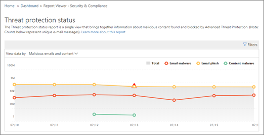

# 檢視 Office 365 進階威脅防護的報告View reports for Office 365 Advanced Threat Protection

如果您的組織有[Office 365 高級威脅防護](office-365-atp.md)（ATP），而且您有[必要的許可權](#what-permissions-are-needed-to-view-the-atp-reports)，您可以在安全性&amp;與合規性中心使用數個 ATP 報告。If your organization has [Office 365 Advanced Threat Protection](office-365-atp.md) (ATP) and you have the [necessary permissions](#what-permissions-are-needed-to-view-the-atp-reports), you can use several ATP reports in the Security &amp; Compliance Center. （移至 [**報表** \> ]**儀表板**）。(Go to **Reports** \> **Dashboard**.)

ATP 報告包含下列專案：ATP reports include the following:

- [威脅防護狀態報告Threat Protection Status report](#threat-protection-status-report)
- [ATP 檔案類型報告ATP File Types report](#atp-file-types-report)
- [ATP 郵件處置報告ATP Message Disposition report](#atp-message-disposition-report)
- [即時偵測或 Explorer](threat-explorer.md) （取決於您是否有 OFFICE 365 ATP 方案1或2）either [real-time detections or Explorer](threat-explorer.md) (depending on whether you have Office 365 ATP Plan 1 or 2)
- ...[等等](#additional-reports-to-view)。... [and more](#additional-reports-to-view).

請閱讀本文，以取得 ATP 報表及其用法的概覽。Read this article to get an overview of ATP reports and how to use them.

## 威脅防護狀態報告Threat Protection Status report

「**威脅防護狀態**報告」是單一的視圖，可彙集[Exchange Online Protection](exchange-online-protection-overview.md) （EOP）和[Office 365 ATP](office-365-atp.md)所偵測到和封鎖的惡意內容和惡意電子郵件資訊。The **Threat Protection Status** report is a single view that brings together information about malicious content and malicious email detected and blocked by [Exchange Online Protection](exchange-online-protection-overview.md) (EOP) and [Office 365 ATP](office-365-atp.md). 此報告可用於查看一段時間內的偵測（最多90天），並可讓安全性管理員識別趨勢或判斷是否需要調整原則。This report is useful for viewing detections over time (up to 90 days), and it enables security administrators to identify trends or determine whether policies need adjustments.

該報告提供包含惡意內容的獨特電子郵件的匯總計數，例如檔案或網站位址（URLs），該惡意內容已封鎖反惡意程式碼引擎、[零小時的自動清除（ZAP）](zero-hour-auto-purge.md)和 atp 功能（如[atp 安全連結](atp-safe-links.md)、 [atp 安全附件](atp-safe-attachments.md)及[atp 反網路釣魚](set-up-anti-phishing-policies.md)）。The report provides an aggregated count of unique email messages with malicious content, such as files or website addresses (URLs) that were blocked by the anti-malware engine, [zero-hour auto purge (ZAP)](zero-hour-auto-purge.md), and ATP features like [ATP Safe Links](atp-safe-links.md), [ATP Safe Attachments](atp-safe-attachments.md), and [ATP anti-phishing](set-up-anti-phishing-policies.md).

資訊的篩選和細分可讓您在此報告中進一步細化資訊的類別。Filters and breakdowns of the information allow for more granular categorizations of the information in this report. 具體而言，**電子郵件** \> **網路釣魚**和**電子郵件** \> **惡意程式碼視圖**中也會包含「細分者」功能表。Specifically, there is a 'break down by' menu included for **Email** \> **Phish** and **Email** \> **Malware views**. 它會將資料分解成：It will break down the data into:

|||
|---|---|
|依偵測類型By detection type|哪些原則會協助捕捉這些威脅？What policy helped catch these threats?|
|依偵測技術By detection technology|哪些基本的 Microsoft 技術會陷入威脅？What underlying Microsoft technology caught the threat?|
|依傳遞狀態By delivery status|電子郵件被偵測為威脅時會發生什麼事？What happened to the email messages detected as threats?|
|

> [!TIP]
> 電子郵件 > 網路釣魚 |惡意程式碼視圖對顯示的偵測技術有細微的損害，其類別如*ATP 產生的檔案信譽*、檔案*引爆*、 *URL 引爆*、*反欺騙性： DMARC 失敗*，例如，明確確切指出您的組織攔截威脅的確切功能 led。Both the Email > Phish | Malware views have granular breakdowns for the detection technologies shown, with categories like *ATP-generated file reputation*, *File detonation*, *URL detonation*, *Anti-spoof: DMARC failure*, for example, helpful in pinpointing exactly which feature led your organization to catch threats.

![[威脅防護狀態報表] 下拉式清單顯示「中斷者」。](../../media/tp-threatProtectStatRpt-BreakDownBy.png)

這些視圖可讓您透過按鈕按一下（在電子郵件 > 網路釣魚詐騙、電子郵件 > 惡意程式碼和內容 > 惡意程式碼視圖）中匯出選項。These views give you the option to export, via a button click (in Email > Phish, Email > Malware, and Content > Malware views). 匯出至電腦的匯總資料可以在 Excel 中開啟。The aggregated data exported to your computer can be opened in Excel.

「一覽」和「電子郵件」視圖會在處理時間內（而不是24小時）顯示資訊（要求重新）。The Overview and Emails views will display information within hours of processing rather than in 24 hours (demand re. 增加的速度是清晰的信號）！increased speeds here has been a clear signal)!

> [!NOTE]
> 具有[Office 365 ATP](office-365-atp.md)或[Exchange Online Protection](exchange-online-protection-eop.md) （EOP）的客戶可以使用威脅防護狀態報表;不過，針對 ATP 客戶顯示在威脅防護狀態報表中的資訊，其可能會包含與客戶可能看到的 EOP 不同的資料。A Threat Protection Status report is available to customers who have either [Office 365 ATP](office-365-atp.md) or [Exchange Online Protection](exchange-online-protection-eop.md) (EOP); however, the information that is displayed in the Threat Protection Status report for ATP customers will likely contain different data than what EOP customers might see. 例如，ATP 客戶的「威脅防護狀態報表」會包含[SharePoint 線上、OneDrive 或 Microsoft 小組中偵測到之惡意](atp-for-spo-odb-and-teams.md)檔案的相關資訊。For example, the Threat Protection Status report for ATP customers will contain information about [malicious files detected in SharePoint Online, OneDrive, or Microsoft Teams](atp-for-spo-odb-and-teams.md). 這類資訊專用於 ATP，所以具有 EOP 但不是 ATP 的客戶將無法在威脅防護狀態報表中看到這些詳細資料。Such information is specific to ATP, so customers who have EOP but not ATP will not see those details in their Threat Protection Status report.

若要查看「威脅防護狀態」報告，請在[安全性&amp;與合規性中心](https://protection.office.com)，移至 [**報告** \> ]**儀表板** \> **威脅防護狀態**。To view the Threat Protection Status report, in the [Security &amp; Compliance Center](https://protection.office.com), go to **Reports** \> **Dashboard** \> **Threat Protection Status**.

若要取得一天的詳細狀態，請將游標懸停在圖形上方。To get detailed status for a day, hover over the graph.

「威脅防護狀態」報告預設會顯示過去7天的資料。By default, the Threat Protection Status report shows data for the past seven days. 不過，您可以選擇 [**篩選**] 並變更日期範圍，以查看最多90天的資料。However, you can choose **Filters** and change the date range to view data for up to 90 days. （如果您是使用試用訂閱，則可能會限制為30天的資料。）(If you are using a trial subscription, you might be limited to 30 days' of data.)

您也可以使用 [ **View data by** ] 功能表來變更報表中所顯示的資訊。You can also use the **View data by** menu to change what information is displayed in the report.

## URL 保護狀態報表URL Protection Status report

這份報告是以每次按一下來收集的資料，以及偵測到的威脅（而大多數其他電子郵件威脅相關的報告為每一封郵件資料）。This report is based data collected, and threats detected, per click (whereas most other email threat related reports are per message data). 此報告的設計目的是顯示來自電子郵件和檔中每次按一下的超連結的威脅。This report is designed to show threats that come from hyperlinks in email messages and documents, per click. 有兩種觀點：There are two views:

|||
|---|---|
|URL 按一下保護動作URL click protection action|查看封鎖的 URLs 數目、封鎖但以使用者的按一下權覆寫，使用者會以點擊和允許的方式覆寫。See the number of URLs blocked, blocked but overridden with a click-through by a user, overridden with a click-through by a user, and allowed.|
|依應用程式按一下 URLURL click by application|請參閱已按一下 URL 的應用程式。See the application from which the URL was clicked.|
|

在 [詳細資料] 表格中，您將可以看到有關按一下時間和使用者資訊的詳細資訊。In the details table, you'll be able to see more information regarding click time and user information. 最後，請記住 URL 保護狀態報表顯示來自 ATP 安全連結功能的保護，所以只有已啟用 ATP 安全連結的客戶才能看到此報告上會反映的資料。Finally, keep in mind the URL Protection Status report shows the protection from ATP Safe Links feature, so only customers who have enabled ATP Safe Links will see data reflected on this report.

> [!NOTE]
> 這是一項*保護趨勢報告*，表示資料代表較大資料集的趨勢。This is a *protection trend report*, meaning data represents trends in a larger dataset. 報告無法在這裡即時提供。Reporting isn't available in real time here. 若為即時 URL，請按一下 [資料]，然後繼續使用 URL 追蹤。For real time URL click data, please continue to use URL Trace.

## ATP 檔案類型報告ATP File Types report

**Atp 檔案類型**報告會顯示由[ATP 安全附件](atp-safe-attachments.md)偵測為惡意的檔案類型。The **ATP File Types** report shows you the type of files detected as malicious by [ATP Safe Attachments](atp-safe-attachments.md).

若要查看此報告，請[在&amp;安全性與合規性中心](https://protection.office.com)，移至 [**報告** \> ]**儀表板** \> **ATP 檔案類型**。To view this report, in the [Security &amp; Compliance Center](https://protection.office.com), go to **Reports** \> **Dashboard** \> **ATP File Types**.

當您將游標移到某一天時，您可以在 Office 365 中看到由[ATP 安全附件](atp-safe-attachments.md)和[ &amp;反垃圾郵件反惡意程式碼保護](anti-spam-and-anti-malware-protection.md)所偵測到之惡意檔案類型的細目。When you hover over a particular day, you can see the breakdown of types of malicious files that were detected by [ATP Safe Attachments](atp-safe-attachments.md) and [anti-spam &amp; anti-malware protection in Office 365](anti-spam-and-anti-malware-protection.md).

## ATP 郵件處置報告ATP Message Disposition report

**ATP 郵件**處理報告會顯示偵測到有惡意內容的電子郵件所採取的動作。The **ATP Message Disposition** report shows you the actions that were taken for email messages that were detected as having malicious content.

若要查看此報告，請[在&amp;安全性與合規性中心](https://protection.office.com)，移至 [**報告** \> ]**儀表板** \> **ATP 郵件部署**。To view this report, in the [Security &amp; Compliance Center](https://protection.office.com), go to **Reports** \> **Dashboard** \> **ATP Message Disposition**.

當您將游標移到圖表中的某個列上方時，您就會看到針對該天所偵測到的電子郵件所採取的動作。When you hover over a bar in the chart, you can see what actions were taken for detected email for that day.

## 要查看的其他報告Additional reports to view

除了本文所述的 ATP 報告之外，還有其他幾個報告可供使用，如下表所述：In addition to the ATP reports described in this article, several other reports are available, as described in the following table:

|||
|---|---|
|**報告****Report(s)**|**詳細資料****Details**|
|**瀏覽器**或**即時**偵測：（Office 365 ATP Plan 2 客戶具有 Explorer;Office 365 ATP Plan 1 客戶具備即時偵測。**Explorer** or **real-time detections**: (Office 365 ATP Plan 2 customers have Explorer; Office 365 ATP Plan 1 customers have real-time detections.)|[威脅總管 (及即時偵測)Threat Explorer (and real-time detections)](threat-explorer.md)|
|**電子郵件安全性報告**，例如主要寄件者和收件者報告、冒名郵件報告和垃圾郵件偵測報告。**Email security reports**, such as a Top Senders and Recipients report, a Spoof Mail report, and a Spam Detections report.|[檢視安全性與合規性中心內的電子郵件安全性報告View email security reports in the Security &amp; Compliance Center](view-email-security-reports.md)|
|**ATP 安全連結 URL 追蹤**：（這是您使用 PowerShell 所產生的報表）。此報告顯示在過去七（7）天內 ATP 安全連結動作的結果。**ATP Safe Links URL trace**: (This is a report you generate by using PowerShell.) This report shows the results of ATP Safe Links actions over the past seven (7) days.|[Get-UrlTrace Cmdlet 參考Get-UrlTrace cmdlet reference](https://docs.microsoft.com/powershell/module/exchange/advanced-threat-protection/get-urltrace)|
|**EOP 和 ATP 結果**：（這是您使用 PowerShell 所產生的自訂報告）。**EOP and ATP results**: (This is a custom report you generate by using PowerShell). 此報告包含資訊，例如網域、日期、事件種類、方向、動作和郵件數目。This report contains information, such as Domain, Date, Event Type, Direction, Action, and Message Count.|[MailTrafficATPReport Cmdlet 參考Get-MailTrafficATPReport cmdlet reference](https://docs.microsoft.com/powershell/module/exchange/advanced-threat-protection/get-mailtrafficatpreport)|
|**EOP 和 ATP**偵測：（這是您使用 PowerShell 所產生的自訂報告）。**EOP and ATP detections**: (This is a custom report you generate by using PowerShell). 此報告包含有關電子郵件或檔案中惡意檔案或 URLs、網路釣魚企圖、模仿及其他潛在威脅的詳細資料。This report contains details about malicious files or URLs, phishing attempts, impersonation, and other potential threats in email or files.|[MailDetailATPReport Cmdlet 參考Get-MailDetailATPReport cmdlet reference](https://docs.microsoft.com/powershell/module/exchange/advanced-threat-protection/get-maildetailatpreport)|
|

## 查看 ATP 報表所需的許可權為何？What permissions are needed to view the ATP reports?

為了查看和使用本文所述的報告，**您必須為安全性&amp;與合規性中心和 Exchange 系統管理中心指派適當的角色**。In order to view and use the reports described in this article, **you must have an appropriate role assigned for both the Security &amp; Compliance Center and the Exchange admin center**.

- 針對「安全性與合規性中心」，您必須受指派下列其中一個角色：For the Security &amp; Compliance Center, you must have one of the following roles assigned:

  - 組織管理Organization Management
  - 安全性系統管理員 (這可以在 Azure Active Directory 系統管理中心指派 ([https://aad.portal.azure.com](https://aad.portal.azure.com)))Security Administrator (this can be assigned in the Azure Active Directory admin center ([https://aad.portal.azure.com](https://aad.portal.azure.com)))
  - 安全操作員（可以在 Azure Active Directory 系統管理中心[https://aad.portal.azure.com](https://aad.portal.azure.com)內指派）Security Operator (this can be assigned in the Azure Active Directory admin center ([https://aad.portal.azure.com](https://aad.portal.azure.com)))
  - 安全性讀取者Security Reader

- 針對 Exchange Online，您必須在 Exchange 系統管理中心 ([https://outlook.office365.com/ecp](https://outlook.office365.com/ecp)) 或 PowerShell Cmdlet (請參閱 [Exchange Online PowerShell](https://docs.microsoft.com/powershell/exchange/exchange-online/exchange-online-powershell)) 受指派下列其中一個角色：For Exchange Online, you must have one of the following roles assigned in either the Exchange admin center ([https://outlook.office365.com/ecp](https://outlook.office365.com/ecp)) or with PowerShell cmdlets (See [Exchange Online PowerShell](https://docs.microsoft.com/powershell/exchange/exchange-online/exchange-online-powershell)):

  - 組織管理Organization Management
  - 僅檢視組織管理View-only Organization Management
  - 僅檢視收件者角色View-Only Recipients role
  - 合規性管理Compliance Management

若要深入了解，請參閱下列資源：To learn more, see the following resources:

- [Office 365 安全性與合規性中心權限Permissions in the Office 365 Security &amp; Compliance Center](permissions-in-the-security-and-compliance-center.md)

- [Exchange Online 中的功能權限Feature permissions in Exchange Online](https://docs.microsoft.com/exchange/permissions-exo/feature-permissions)

## 如果報告未顯示資料，該怎麼辦？What if the reports aren't showing data?

如果您未看到 ATP 報告中的資料，請仔細檢查您的原則設定是否正確。If you are not seeing data in your ATP reports, double-check that your policies are set up correctly. 您的組織必須已定義[Atp 安全連結原則](set-up-atp-safe-links-policies.md)和[atp 安全附件原則](set-up-atp-safe-attachments-policies.md)，才能進行 atp 保護。Your organization must have [ATP Safe Links policies](set-up-atp-safe-links-policies.md) and [ATP Safe Attachments policies](set-up-atp-safe-attachments-policies.md) defined in order for ATP protection to be in place. 另請參閱[Office 365 中的反垃圾郵件和反惡意程式碼保護](anti-spam-and-anti-malware-protection.md)。Also see [Anti-spam and anti-malware protection in Office 365](anti-spam-and-anti-malware-protection.md).

## 相關主題Related topics

[Office 365 安全性&amp;與合規性中心內的報告與深入瞭解Reports and insights in the Office 365 Security &amp; Compliance Center](reports-and-insights-in-security-and-compliance.md)

[在安全性&amp;與合規性中心建立報表的排程Create a schedule for a report in the Security &amp; Compliance Center](create-a-schedule-for-a-report.md)

[在安全性&amp;與合規性中心內設定及下載自訂報告Set up and download a custom report in the Security &amp; Compliance Center](set-up-and-download-a-custom-report.md)

[角色許可權（Azure Active DirectoryRole permissions (Azure Active Directory](https://docs.microsoft.com/azure/active-directory/users-groups-roles/directory-assign-admin-roles#role-permissions)
