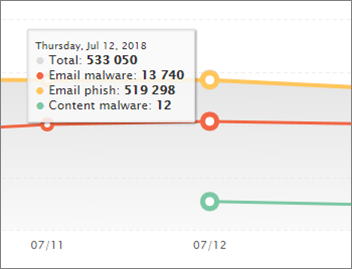

# 檢視 Office 365 進階威脅防護的報告View reports for Office 365 Advanced Threat Protection

如果您的組織有[Office 365 進階威脅防護](office-365-atp.md)(ATP)，而且您具有[必要權限](#what-permissions-are-needed-to-view-the-atp-reports)，您可以使用數個 ATP 報告中的安全性&amp;合規性中心。If your organization has [Office 365 Advanced Threat Protection](office-365-atp.md) (ATP) and you have the [necessary permissions](#what-permissions-are-needed-to-view-the-atp-reports), you can use several ATP reports in the Security &amp; Compliance Center. (前往**報告** \> **儀表板**。)(Go to **Reports** \> **Dashboard**.)
  

  
ATP 報告包含下列：ATP reports include the following:
- [威脅防護狀態報告Threat Protection Status report](#threat-protection-status-report)
- [ATP 檔案類型報告ATP File Types report](#atp-file-types-report)
- [ATP 郵件處置報告ATP Message Disposition report](#atp-message-disposition-report)
- [即時偵測或檔案總管]](threat-explorer.md) （視您是否具有 Office 365 ATP 方案 1 或 2）either [real-time detections or Explorer](threat-explorer.md) (depending on whether you have Office 365 ATP Plan 1 or 2)
- ...[以及更多](#additional-reports-to-view)。... [and more](#additional-reports-to-view). 

閱讀本篇文章以取得 ATP 報告概觀，以及如何使用它們。Read this article to get an overview of ATP reports and how to use them.
  
## 威脅防護狀態報告Threat Protection Status report

**威脅保護狀態**報表是整合在一起惡意內容和惡意電子郵件偵測並封鎖由[Exchange Online Protection](exchange-online-protection-overview.md) (EOP) 和[Office 365 ATP](office-365-atp.md)的相關資訊的單一檢視。The **Threat Protection Status** report is a single view that brings together information about malicious content and malicious email detected and blocked by [Exchange Online Protection](exchange-online-protection-overview.md) (EOP) and [Office 365 ATP](office-365-atp.md). 這份報告可以用來檢視偵測一段時間 （最多為 90 天），並可讓安全性系統管理員識別趨勢或判斷原則是否需要調整。This report is useful for viewing detections over time (up to 90 days), and it enables security administrators to identify trends or determine whether policies need adjustments. 

報表會提供唯一的電子郵件與惡意內容，例如檔案或網站位址 (Url) 已封鎖的反惡意程式碼引擎、[零時差自動清除 (ZAP)](zero-hour-auto-purge.md)，和 ATP 功能，例如[ATP 安全連結](atp-safe-links.md)， [ATP 安全附件](atp-safe-attachments.md)， [ATP 防網路釣魚功能](atp-anti-phishing.md)彙總的計數。The report provides an aggregated count of unique email messages with malicious content, such as files or website addresses (URLs) that were blocked by the anti-malware engine, [zero-hour auto purge (ZAP)](zero-hour-auto-purge.md), and ATP features like [ATP Safe Links](atp-safe-links.md), [ATP Safe Attachments](atp-safe-attachments.md), and [ATP anti-phishing capabilities](atp-anti-phishing.md). 

篩選並掌握資訊的允許更細微的分類，這份報告中的資訊。Filters and breakdowns of the information allow for more granular categorizations of the information in this report. 具體而言，是包含*電子郵件 > 釣魚程式*和*電子郵件 > 惡意程式碼檢視*'細分由' 功能表。Specifically, there is a 'break down by' menu included for *Email > Phish* and *Email > Malware views*. 它會細分資料匯入：It will break down the data into:

| |  |
|---------|---------|
|依偵測類型By detection type    | 哪些原則有助於捕捉這些威脅？What policy helped catch these threats?         |
|偵測技術By detection technology     | 查看基礎 Microsoft 技術攔截威脅？What underlying Microsoft technology caught the threat?        |
|依傳遞狀態By delivery status     | 偵測潛在威脅為電子郵件發生了什麼事？What happened to the email messages detected as threats?         |
| | |

> [!TIP]
> 電子郵件 > Phish |惡意程式碼檢視有顯示，如*ATP 產生檔案信譽*、*檔案爆炸*、 *URL 引爆*、 類別與偵測技術的細微掌握*反詐騙： DMARC 失敗*，例如，指出哪一個功能完全 led 來捕捉威脅組織很有幫助。Both the Email > Phish | Malware views have granular breakdowns for the detection technologies shown, with categories like *ATP-generated file reputation*, *File detonation*, *URL detonation*, *Anti-spoof: DMARC failure*, for example, helpful in pinpointing exactly which feature led your organization to catch threats.

![威脅保護狀態報告] 下拉式清單顯示 '細分由'。](../media/tp-threatProtectStatRpt-BreakDownBy.png)

這些檢視提供您選項來匯出，透過按一下按鈕 （在電子郵件 > 釣魚程式、 電子郵件 > 惡意程式碼、 和內容 > 惡意程式碼檢視）。These views give you the option to export, via a button click (in Email > Phish, Email > Malware, and Content > Malware views). 彙總的資料匯出到您的電腦可以在 Excel 中開啟。The aggregated data exported to your computer can be opened in Excel.

![此圖形顯示匯出為惡意程式碼的右之間建立排程] 及 [要求報表檢視] 功能表中的選項。](../media/tp-threatProtectStatRpt-BreakDownByExport.png)

[概觀] 和 [電子郵件檢視會顯示小時內的資訊的處理，而不是在 24 小時 （re 需求。The Overview and Emails views will display information within hours of processing rather than in 24 hours (demand re. 增加的速度已清除的訊號） ！increased speeds here has been a clear signal)!

> [!NOTE]
> 威脅保護狀態報表是適用於擁有[Office 365 ATP](office-365-atp.md)或[Exchange Online Protection](exchange-online-protection-eop.md) (EOP); 客戶然而，ATP 客戶威脅保護狀態報表中顯示的資訊可能會包含不同資料比 EOP 客戶可能會看到的內容。A Threat Protection Status report is available to customers who have either [Office 365 ATP](office-365-atp.md) or [Exchange Online Protection](exchange-online-protection-eop.md) (EOP); however, the information that is displayed in the Threat Protection Status report for ATP customers will likely contain different data than what EOP customers might see. 例如，ATP 客戶威脅保護狀態報表將包含[SharePoint Online、 OneDrive 或 Microsoft Teams 中偵測到惡意檔案](atp-for-spo-odb-and-teams.md)的相關資訊。For example, the Threat Protection Status report for ATP customers will contain information about [malicious files detected in SharePoint Online, OneDrive, or Microsoft Teams](atp-for-spo-odb-and-teams.md). 這類資訊是專屬於 ATP，，因此 EOP，但不是 ATP 的客戶將不會看到其威脅保護狀態報表中的這些詳細資料。Such information is specific to ATP, so customers who have EOP but not ATP will not see those details in their Threat Protection Status report.
  
若要檢視中的威脅保護狀態報表，[安全性&amp;合規性中心](https://protection.office.com)，請移至**報表** \> **儀表板** \> **威脅保護狀態**。To view the Threat Protection Status report, in the [Security &amp; Compliance Center](https://protection.office.com), go to **Reports** \> **Dashboard** \> **Threat Protection Status**.
  

  
若要取得一天的詳細的狀態，將游標置於上方圖形。To get detailed status for a day, hover over the graph.
  

  
根據預設，威脅保護狀態報告顯示過去 7 天的資料。By default, the Threat Protection Status report shows data for the past seven days. 不過，您可以選擇 [**篩選器**，並變更日期範圍，以檢視最多為 90 天的資料。However, you can choose **Filters** and change the date range to view data for up to 90 days. （如果您使用試用訂閱，您可能會受限於的 30 天的資料。）(If you are using a trial subscription, you might be limited to 30 days' of data.)
  

  
您也可以使用 [**檢視資料**] 功能表來變更報表中顯示的資訊。You can also use the **View data by** menu to change what information is displayed in the report. 
  

## URL 保護狀態報表URL Protection Status report

這個報告是根據的資料收集，並偵測到威脅，按一下 [每 （而最其他電子郵件威脅相關報告是每個郵件資料）。This report is based data collected, and threats detected, per click (whereas most other email threat related reports are per message data). 這份報告被設計來顯示來自中電子郵件和文件，每次按一下超連結的威脅。This report is designed to show threats that come from hyperlinks in email messages and documents, per click. 有兩種檢視：There are two views:

|  |  |
|---------|---------|
|按一下 [URL 保護巨集指令URL click protection action   | 請參閱 Url 封鎖、 封鎖，但由使用者覆寫點選中的使用者，並允許覆寫點選中的數目。See the number of URLs blocked, blocked but overridden with a click-through by a user, overridden with a click-through by a user, and allowed.        |
|URL 按一下 [應用程式URL click by application     | 請參閱從中 URL 已按下的應用程式。See the application from which the URL was clicked.        |
|  |  |

在詳細資料表格中，您可以查看更多關於按一下 [時間與使用者資訊。In the details table, you'll be able to see more information regarding click time and user information. 最後，請記住 URL 保護狀態報告 」 可顯示從 ATP 安全連結功能的保護，只讓已啟用 ATP 安全連結的客戶會看到的資料會反映在這份報告。Finally, keep in mind the URL Protection Status report shows the protection from ATP Safe Links feature, so only customers who have enabled ATP Safe Links will see data reflected on this report.

> [!NOTE]
> 這是*保護趨勢報告*、 意義的資料代表較大的資料集的趨勢。This is a *protection trend report*, meaning data represents trends in a larger dataset. 報告中不提供以下即時。Reporting isn't available in real time here. 按一下 [URL 的即時的資料，請繼續使用 URL 追蹤。For real time URL click data, please continue to use URL Trace.

## ATP 檔案類型報告ATP File Types report

**ATP 檔案類型**的報告顯示[ATP 安全附件](atp-safe-attachments.md)所偵測到視為惡意的檔案的類型。The **ATP File Types** report shows you the type of files detected as malicious by [ATP Safe Attachments](atp-safe-attachments.md).
  
若要檢視此報告中，在[安全性&amp;合規性中心](https://protection.office.com)，請移至**報表** \> **儀表板** \> **ATP 檔案類型**。To view this report, in the [Security &amp; Compliance Center](https://protection.office.com), go to **Reports** \> **Dashboard** \> **ATP File Types**.
  

  
當您將游標的特定一天時，您可以看到分解為由[ATP 安全附件](atp-safe-attachments.md)所偵測到的惡意檔案的類型和[反垃圾郵件&amp;Office 365 中的反惡意程式碼保護](anti-spam-and-anti-malware-protection.md)。When you hover over a particular day, you can see the breakdown of types of malicious files that were detected by [ATP Safe Attachments](atp-safe-attachments.md) and [anti-spam &amp; anti-malware protection in Office 365](anti-spam-and-anti-malware-protection.md).
  

  
## ATP 郵件處置報告ATP Message Disposition report

**ATP 郵件處理**報告會顯示您針對已偵測到具有惡意內容的電子郵件所採取的動作。The **ATP Message Disposition** report shows you the actions that were taken for email messages that were detected as having malicious content. 
  
若要檢視此報告中，在[安全性&amp;合規性中心](https://protection.office.com)，請移至**報表** \> **儀表板** \> **ATP 郵件處理**。To view this report, in the [Security &amp; Compliance Center](https://protection.office.com), go to **Reports** \> **Dashboard** \> **ATP Message Disposition**.
  

  
當您將滑鼠停留在圖表中的列時，您可以看到哪些動作是偵測到的電子郵件的那一天。When you hover over a bar in the chart, you can see what actions were taken for detected email for that day.
  

  
## 若要檢視其他報告Additional reports to view

除了本文所述的 ATP 報告下, 表所述，都可以使用、 數個其他報告：In addition to the ATP reports described in this article, several other reports are available, as described in the following table:

|報告Report(s)  |詳細資料Details  |
|---------|---------|
|**檔案總管**] 或 [**即時偵測**（Office 365 ATP 計劃 2 的客戶會有瀏覽器;Office 365 ATP 計劃 1 客戶擁有即時偵測的資訊）。**Explorer** or **real-time detections** (Office 365 ATP Plan 2 customers have Explorer; Office 365 ATP Plan 1 customers have real-time detections.)| [威脅總管 (及即時偵測)Threat Explorer (and real-time detections)](threat-explorer.md)       |
|**電子郵件安全性報告**，例如頂端寄件者和收件者報告、 詐騙郵件] 報告和垃圾郵件偵測] 報告。**Email security reports**, such as a Top Senders and Recipients report, a Spoof Mail report, and a Spam Detections report. | [檢視安全性與合規性中心內的電子郵件安全性報告View email security reports in the Security &amp; Compliance Center](view-email-security-reports.md)        |
|**ATP 安全連結 URL 追蹤**（這是您藉由使用 PowerShell 產生報表）。這份報告顯示過去七 （7） 天 ATP 安全連結動作的結果。**ATP Safe Links URL trace** (This is a report you generate by using PowerShell.) This report shows the results of ATP Safe Links actions over the past seven (7) days. |[Get-urltrace cmdlet 參照Get-UrlTrace cmdlet reference](https://docs.microsoft.com/powershell/module/exchange/advanced-threat-protection/get-urltrace) |
|（這是您藉由使用 PowerShell 產生自訂報告）**透過 EOP 和 ATP 的結果**。**EOP and ATP results** (This is a custom report you generate by using PowerShell). 此報告中包含的資訊，例如網域、 日期、 事件類型、 方向、 巨集指令，以及訊息計數。This report contains information, such as Domain, Date, Event Type, Direction, Action, and Message Count.  | [取得 MailTrafficATPReport cmdlet 參照Get-MailTrafficATPReport cmdlet reference](https://docs.microsoft.com/powershell/module/exchange/advanced-threat-protection/get-mailtrafficatpreport) |
|**EOP 和 ATP 偵測**（這是您藉由使用 PowerShell 產生自訂報告）。**EOP and ATP detections** (This is a custom report you generate by using PowerShell). 這份報告包含詳細惡意檔案或 Url、 網路釣魚嘗試、 模擬，以及其他電子郵件或檔案中的潛在威脅。This report contains details about malicious files or URLs, phishing attempts, impersonation, and other potential threats in email or files.   | [取得 MailDetailATPReport cmdlet 參照Get-MailDetailATPReport cmdlet reference](https://docs.microsoft.com/powershell/module/exchange/advanced-threat-protection/get-maildetailatpreport)        |

  
## 若要檢視 ATP 報告需要哪些權限？What permissions are needed to view the ATP reports?

若要檢視及使用本文中所述的報告**您必須具有適當的角色指派給這兩種安全性&amp;規範中心和 Exchange 系統管理中心**。In order to view and use the reports described in this article, **you must have an appropriate role assigned for both the Security &amp; Compliance Center and the Exchange admin center**.

- 針對「安全性與合規性中心」，您必須受指派下列其中一個角色：For the Security &amp; Compliance Center, you must have one of the following roles assigned:
    - 組織管理Organization Management
    - 安全性系統管理員 (這可以在 Azure Active Directory 系統管理中心指派 ([https://aad.portal.azure.com](https://aad.portal.azure.com)))Security Administrator (this can be assigned in the Azure Active Directory admin center ([https://aad.portal.azure.com](https://aad.portal.azure.com)))
    - 安全性運算子 (這可以在 Azure Active Directory 系統管理中心中指派 ([https://aad.portal.azure.com](https://aad.portal.azure.com)))Security Operator (this can be assigned in the Azure Active Directory admin center ([https://aad.portal.azure.com](https://aad.portal.azure.com)))
    - 安全性讀取者Security Reader

- 針對 Exchange Online，您必須在 Exchange 系統管理中心 ([https://outlook.office365.com/ecp](https://outlook.office365.com/ecp)) 或 PowerShell Cmdlet (請參閱 [Exchange Online PowerShell](https://docs.microsoft.com/powershell/exchange/exchange-online/exchange-online-powershell)) 受指派下列其中一個角色：For Exchange Online, you must have one of the following roles assigned in either the Exchange admin center ([https://outlook.office365.com/ecp](https://outlook.office365.com/ecp)) or with PowerShell cmdlets (See [Exchange Online PowerShell](https://docs.microsoft.com/powershell/exchange/exchange-online/exchange-online-powershell)):
    - 組織管理Organization Management
    - 僅檢視組織管理View-only Organization Management
    - 僅檢視收件者角色View-Only Recipients role
    - 合規性管理Compliance Management

若要深入了解，請參閱下列資源：To learn more, see the following resources:

- [Office 365 安全性與合規性中心權限Permissions in the Office 365 Security &amp; Compliance Center](permissions-in-the-security-and-compliance-center.md)

- [Exchange Online 中的功能權限Feature permissions in Exchange Online](https://docs.microsoft.com/exchange/permissions-exo/feature-permissions)
   
## 如果報表不顯示資料？What if the reports aren't showing data?

如果您不 ATP 報告中看到的資料，請仔細檢查您的原則已正確設定。If you are not seeing data in your ATP reports, double-check that your policies are set up correctly. 您的組織必須有[ATP 安全連結原則](set-up-atp-safe-links-policies.md)，並定義 ATP 保護的順序中的[ATP 安全附件原則](set-up-atp-safe-attachments-policies.md)就地。Your organization must have [ATP Safe Links policies](set-up-atp-safe-links-policies.md) and [ATP Safe Attachments policies](set-up-atp-safe-attachments-policies.md) defined in order for ATP protection to be in place. 請參閱[在 Office 365 中的反垃圾郵件和反惡意程式碼保護](anti-spam-and-anti-malware-protection.md)。Also see [Anti-spam and anti-malware protection in Office 365](anti-spam-and-anti-malware-protection.md).
  
## 相關主題Related topics

[報告和 Office 365 安全性的深入解析&amp;合規性中心Reports and insights in the Office 365 Security &amp; Compliance Center](reports-and-insights-in-security-and-compliance.md)
  
[建立報表排程安全性&amp;合規性中心Create a schedule for a report in the Security &amp; Compliance Center](create-a-schedule-for-a-report.md)
  
[設定及下載自訂報告中的安全性&amp;合規性中心Set up and download a custom report in the Security &amp; Compliance Center](set-up-and-download-a-custom-report.md)

[角色權限 (Azure Active DirectoryRole permissions (Azure Active Directory](https://docs.microsoft.com/azure/active-directory/users-groups-roles/directory-assign-admin-roles#role-permissions)
  

