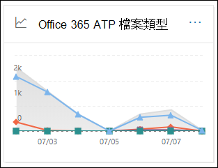
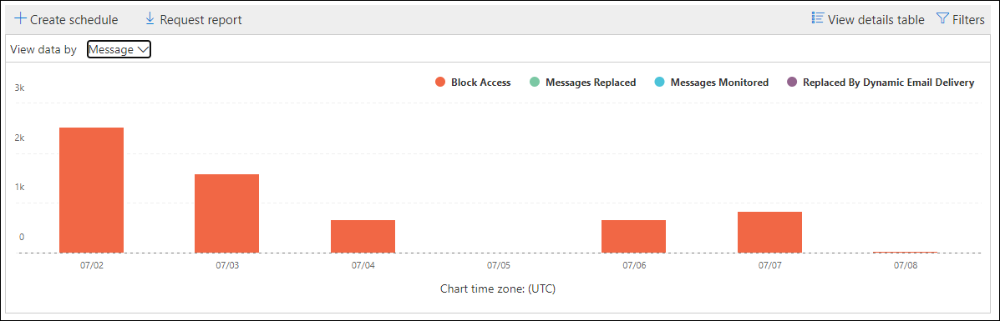
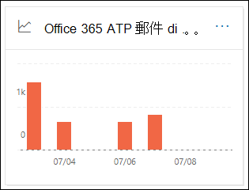
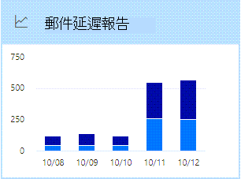
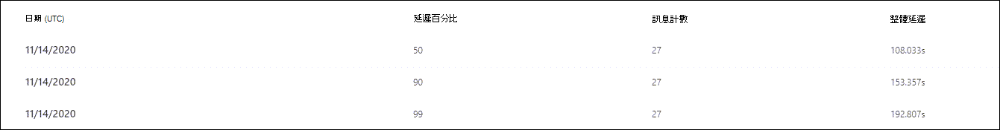
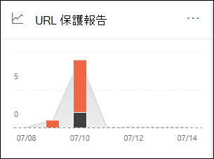
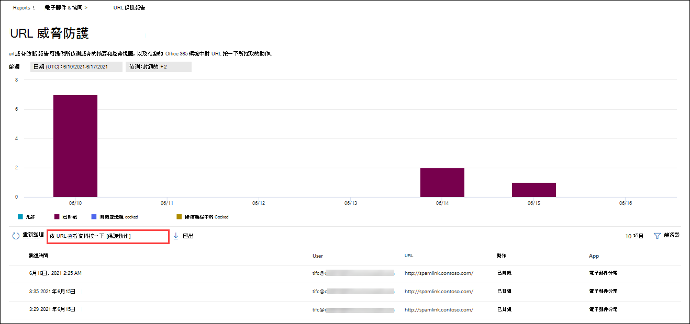

# 在安全性 & 規範中心的報表儀表板中，查看 Office 365 報表的 DefenderView Defender for Office 365 reports in the Reports dashboard in the Security & Compliance Center

[!INCLUDE [Microsoft 365 Defender rebranding](../includes/microsoft-defender-for-office.md)]

**適用於****Applies to**
- [適用於 Office 365 的 Microsoft Defender 方案 1 和方案 2Microsoft Defender for Office 365 plan 1 and plan 2](office-365-atp.md)
- [Microsoft 365 DefenderMicrosoft 365 Defender](../mtp/microsoft-threat-protection.md)

Microsoft Defender for Office 365 組織 (例如，Microsoft 365 E5 訂閱或 Microsoft Defender for Office 365 Plan 1 或 Microsoft Defender for Office 365 方案2增益集) 包含各種安全性相關的報告。Microsoft Defender for Office 365 organizations (for example, Microsoft 365 E5 subscriptions or Microsoft Defender for Office 365 Plan 1 or Microsoft Defender for Office 365 Plan 2 add-ons) contain a variety of security-related reports. 如果您有 [必要的許可權](#what-permissions-are-needed-to-view-the-defender-for-office-365-reports)，您可以移至 [ **報表**] \> **儀表板**，在安全性 & 規範中心中查看這些報告。If you have the [necessary permissions](#what-permissions-are-needed-to-view-the-defender-for-office-365-reports), you can view these reports in the Security & Compliance Center by going to **Reports** \> **Dashboard**. 若要直接移至 [報告] 儀表板，請開啟] <https://protection.office.com/insightdashboard> 。To go directly to the Reports dashboard, open <https://protection.office.com/insightdashboard>.

## 適用於 Office 365 的 Defender 檔案類型報告Defender for Office 365 file types report

[ **Office 365 的 Defender] 檔案類型報告** 報告會顯示偵測為 [安全附件](atp-safe-attachments.md)的檔案類型。The **Defender for Office 365 file types report** report shows you the type of files detected as malicious by [Safe Attachments](atp-safe-attachments.md).

 報表的匯總視圖允許90天的篩選，而詳細資料檢視只允許10天的篩選。The aggregate view of the report allows for 90 days of filtering, while the detail view only allows for 10 days of filtering.

若要查看報告，請開啟 [安全性 & 規範中心](https://protection.office.com)，移至 [ **報告**] \> **儀表板** ，然後選取 [ **Office 365 檔案類型的 Defender**]。To view the report, open the [Security & Compliance Center](https://protection.office.com), go to **Reports** \> **Dashboard** and select **Defender for Office 365 file types**. 若要直接前往報表，請開啟 <https://protection.office.com/reportv2?id=ATPFileReport> 。To go directly to the report, open <https://protection.office.com/reportv2?id=ATPFileReport>.

> [!NOTE]
> 您也可以在 [Office 365 的 [Defender For Office 郵件](#defender-for-office-365-message-disposition-report)處理] 報告中取得此報告中的資訊。The information in this report is also available in the [Defender for Office 365 message disposition report](#defender-for-office-365-message-disposition-report).

### 適用于 Office 365 檔案類型的報表檢視報告Report view for the Defender for Office 365 file types report

可供使用的視圖如下：The following views are available:

- **資料查看依據：** 檔案：此圖表包含下列資訊：**View data by: File**: The chart contains the following information:

  - **惡意 Excel 附件****Malicious Excel attachments**
  - **惡意的 Flash 附件****Malicious Flash attachments**
  - **惡意的 PDF 附件****Malicious PDF attachments**
  - **惡意 PowerPoint 附件****Malicious PowerPoint attachments**
  - **惡意 URLs****Malicious URLs**
  - **惡意的 Word 附件****Malicious Word attachments**
  - **惡意可執行附件****Malicious executable attachments**
  - **別人****Others**

  當您將滑鼠停留在特定日期 (資料點) 時，您可以看到 EOP 中 [安全附件](atp-safe-attachments.md) 和 [反惡意程式碼保護](anti-malware-protection.md)偵測到的惡意檔案類型細目。When you hover over a particular day (data point), you can see the breakdown of types of malicious files that were detected by [Safe Attachments](atp-safe-attachments.md) and [anti-malware protection in EOP](anti-malware-protection.md).

  

  如果您按一下 [ **篩選**]，您可以使用下列篩選器修改報告：If you click **Filters**, you can modify the report with the following filters:

  - **開始日期** 和 **結束日期****Start date** and **End date**
  - 圖表中顯示的相同檔案類型值。The same file type values that are visible in the chart.

- **資料查看方式：訊息**：此圖表包含下列資訊：**View data by: Message**: The chart contains the following information:

  - **封鎖存取****Block access**
  - **取代郵件****Messages replaced**
  - **監控的郵件****Messages monitored**
  - 以 **動態電子郵件傳遞取代**：如需詳細資訊，請參閱 [在安全附件原則中傳遞](atp-safe-attachments.md#dynamic-delivery-in-safe-attachments-policies)。**Replaced by Dynamic Email Delivery**: For more information, see [Dynamic Delivery in Safe Attachments policies](atp-safe-attachments.md#dynamic-delivery-in-safe-attachments-policies).

  

  如果您按一下 [ **篩選**]，您可以使用下列篩選器修改報告：If you click **Filters**, you can modify the report with the following filters:

  - **開始日期** 和 **結束日期****Start date** and **End date**
  - 圖表中可用的相同郵件處置值，以及已傳遞的其他 **郵件** 值。The same message disposition values that are available in the chart, and the additional **Messages passed** value.

### Defender for Office 365 檔案類型報告的詳細資料表格視圖Details table view for the Defender for Office 365 file types report

如果您按一下 [ **查看詳細資料] 表格**，此報告可提供最近10天內所有按一下動作的近乎即時視圖。If you click **View details table**, the report provides a near-real-time view of all clicks that happen within the organization for the last 10 days. 顯示的資訊取決於您所看到的圖表：The information that's shown depends on the chart you were looking at:

- **資料查看依據：** 檔案：**View data by: File**:

  - **Date****Date**
  - **收件者位址****Recipient address**
  - **寄件者位址****Sender address**
  - **郵件識別碼**：郵件頭的 **Message-ID** 標頭欄位中可用，且應該是唯一的。**Message ID**: Available in the **Message-ID** header field in the message header and should be unique. 範例值 `<08f1e0f6806a47b4ac103961109ae6ef@server.domain>` (記下角括弧) 。An example value is `<08f1e0f6806a47b4ac103961109ae6ef@server.domain>` (note the angle brackets).
  - **File****File**

  如果您按一下 [ **篩選**]，您可以使用下列篩選器修改報告：If you click **Filters**, you can modify the report with the following filters:

  - **開始日期** 和 **結束日期****Start date** and **End date**
  - 圖表中顯示的相同檔案類型值。The same file type values that are visible in the chart.

- **資料查看依據：訊息**：**View data by: Message**:

  - **Date****Date**
  - **收件者位址****Recipient address**
  - **寄件者位址****Sender address**
  - **郵件識別碼****Message ID**
  - **File****File**
  - **主旨****Subject**

  如果您按一下 [ **篩選**]，您可以使用下列篩選器修改結果：If you click **Filters**, you can modify the results with the following filters:

  - **開始日期** 和 **結束日期****Start date** and **End date**
  - 圖表中可用的相同郵件處置值，以及已傳遞的其他 **郵件** 值。The same message disposition values that are available in the chart, and the additional **Messages passed** value.

若要回到 [報表] 視圖，請按一下 [ **view report**]。To get back to the reports view, click **View report**.

## 適用於 Office 365 的 Defender 郵件處置報告Defender for Office 365 message disposition report

**ATP 郵件** 處理報告會顯示偵測到有惡意內容的電子郵件所採取的動作。The **ATP Message Disposition** report shows you the actions that were taken for email messages that were detected as having malicious content.

若要查看報告，請開啟 [安全性 & 合規性中心](https://protection.office.com)，移至 [ **報告**] \> **儀表板** ，然後選取 [ **Office 365 的 Defender] 進行郵件** 處理。To view the report, open the [Security & Compliance Center](https://protection.office.com), go to **Reports** \> **Dashboard** and select **Defender for Office 365 message disposition**. 若要直接前往報表，請開啟 <https://protection.office.com/reportv2?id=ATPMessageReport> 。To go directly to the report, open <https://protection.office.com/reportv2?id=ATPMessageReport>.

> [!NOTE]
> 您也可以在 [Office 365 檔案類型報告](#defender-for-office-365-file-types-report)中使用此報告中的資訊。The information in this report is also available in the [Defender for Office 365 file types report](#defender-for-office-365-file-types-report).

### 適用于 Office 365 的 Defender for Office 郵件處理報告Report view for the Defender for Office 365 message disposition report

可供使用的視圖如下：The following views are available:

- **資料查看方式：訊息**：此圖表包含下列資訊：**View data by: Message**: The chart contains the following information:

  - **封鎖存取****Block access**
  - **取代郵件****Messages replaced**
  - **監控的郵件****Messages monitored**
  - 以 **動態電子郵件傳遞取代**：如需詳細資訊，請參閱 [在安全附件原則中傳遞](atp-safe-attachments.md#dynamic-delivery-in-safe-attachments-policies)。**Replaced by Dynamic Email Delivery**: For more information, see [Dynamic Delivery in Safe Attachments policies](atp-safe-attachments.md#dynamic-delivery-in-safe-attachments-policies).

  

  如果您按一下 [ **篩選**]，您可以使用下列篩選器修改報告：If you click **Filters**, you can modify the report with the following filters:

  - **開始日期** 和 **結束日期****Start date** and **End date**
  - 圖表中可用的相同郵件處置值，以及已傳遞的其他 **郵件** 值。The same message disposition values that are available in the chart, and the additional **Messages passed** value.

- **資料查看依據：** 檔案：此圖表包含下列資訊：**View data by: File**: The chart contains the following information:

  - **惡意 Excel 附件****Malicious Excel attachments**
  - **惡意的 Flash 附件****Malicious Flash attachments**
  - **惡意的 PDF 附件****Malicious PDF attachments**
  - **惡意 PowerPoint 附件****Malicious PowerPoint attachments**
  - **惡意 URLs****Malicious URLs**
  - **惡意的 Word 附件****Malicious Word attachments**
  - **惡意可執行附件****Malicious executable attachments**
  - **別人****Others**

  當您將滑鼠停留在特定日期 (資料點) 時，您可以看到 EOP 中 [安全附件](atp-safe-attachments.md) 和 [反惡意程式碼保護](anti-malware-protection.md)偵測到的惡意檔案類型細目。When you hover over a particular day (data point), you can see the breakdown of types of malicious files that were detected by [Safe Attachments](atp-safe-attachments.md) and [anti-malware protection in EOP](anti-malware-protection.md).

  

  如果您按一下 [ **篩選**]，您可以使用下列篩選器修改報告：If you click **Filters**, you can modify the report with the following filters:

  - **開始日期** 和 **結束日期****Start date** and **End date**
  - 圖表中顯示的相同檔案類型值。The same file type values that are visible in the chart.

### Defender for Office 365 郵件處理報告的詳細資料表格視圖Details table view for the Defender for Office 365 message disposition report

如果您按一下 [ **查看詳細資料] 表格**，此報告可提供最近10天內所有按一下動作的近乎即時視圖。If you click **View details table**, the report provides a near-real-time view of all clicks that happen within the organization for the last 10 days. 顯示的資訊取決於您所看到的圖表：The information that's shown depends on the chart you were looking at:

- **資料查看依據：訊息**：**View data by: Message**:

  - **Date****Date**
  - **收件者位址****Recipient address**
  - **寄件者位址****Sender address**
  - **郵件識別碼****Message ID**
  - **File****File**
  - **主旨****Subject**

  如果您按一下 [ **篩選**]，您可以使用下列篩選器修改結果：If you click **Filters**, you can modify the results with the following filters:

  - **開始日期** 和 **結束日期****Start date** and **End date**
  - 圖表中可用的相同郵件處置值，以及已傳遞的其他 **郵件** 值。The same message disposition values that are available in the chart, and the additional **Messages passed** value.

- **資料查看依據：** 檔案：**View data by: File**:

  - **Date****Date**
  - **收件者位址****Recipient address**
  - **寄件者位址****Sender address**
  - **郵件識別碼****Message ID**
  - **File****File**

  如果您按一下 [ **篩選**]，您可以使用下列篩選器修改報告：If you click **Filters**, you can modify the report with the following filters:

  - **開始日期** 和 **結束日期****Start date** and **End date**
  - 圖表中顯示的相同檔案類型值。The same file type values that are visible in the chart.

若要回到 [報表] 視圖，請按一下 [ **view report**]。To get back to the reports view, click **View report**.

## 郵件延遲報告Mail latency report

**郵件延遲報告** 會向您顯示組織內的郵件傳遞和引爆延遲的匯總視圖。The **Mail latency report** shows you an aggregate view of the mail delivery and detonation latency experienced within your organization. 服務中的郵件傳遞時間受到多種因素的影響，而且絕對傳遞時間（秒）通常不是成功或問題的明確指示。Mail delivery times in the service are affected by a number of factors, and the absolute delivery time in seconds is often not a good indicator of success or a problem. 在一天內的傳遞時間可能會被視為另一天的平均傳遞時間，或反過來。A slow delivery time on one day might be considered an average delivery time on another day, or vice-versa. **郵件延遲報告** 會嘗試根據觀察到的其他郵件傳遞時間的統計資料，以限定郵件傳遞：The **Mail latency report** tries to qualify message delivery based on statistical data about the observed delivery times of other messages:

- 第 **50 個百分點**：這是郵件傳遞時間的中間部分。**50th percentile**: This is the middle for message delivery times. 您可以將此值視為平均傳遞時間。You can consider this value as an average delivery time.
- **90%**：這表示郵件傳遞的高延遲。**90th percentile**: This indicates a high latency for message delivery. 只有10% 的郵件花費的時間超過此值才能傳遞。Only 10% of messages took longer than this value to deliver.
- **99th 百分點**：這表示郵件傳遞的最高延遲。**99th percentile**: This indicates the highest latency for message delivery.

不包括用戶端和網路延遲。Client side and network latency are not included.

若要查看報告，請開啟 [安全性 & 合規性中心](https://protection.office.com)，移至 [ **報告**] \> **儀表板** ，然後選取 [ **郵件延遲報告**]。To view the report, open the [Security & Compliance Center](https://protection.office.com), go to **Reports** \> **Dashboard** and select **Mail latency report**. 若要直接前往報表，請開啟 <https://protection.office.com/mailLatencyReport?viewid=P50> 。To go directly to the report, open <https://protection.office.com/mailLatencyReport?viewid=P50>.

### 郵件延遲報告的報表檢視Report view for the Mail latency report

當您開啟報表時，預設會選取 [ **50 百分位數** ] 索引標籤。When you open the report, the **50th percentiles** tab is selected by default.

此視圖預設會包含以下列篩選設定的圖表：By default, this view contains a chart that's configured with the following filters:

- **日期**：過去7天**Date**: The last 7 days
- **郵件視圖**：**Message View**:
  - 引爆郵件Detonated messages

此圖顯示組織成下列類別的郵件：This chart shows messages organized into the following categories:

- **郵件傳遞延遲****Mail delivery latency**
- **引爆延遲****Detonation latency**

當您將游標移到圖表中的某個類別時，您可以查看每個類別中的延遲明細。When you hover over a category in the chart, you can see a breakdown of the latency in each category.

如果您按一下報表檢視中的 [ **篩選** ]，您可以使用下列篩選器修改結果：If you click **Filter** in the report view, you can modify the results with the following filters:

- 所有郵件All messages
- 包含附件或 URLs 的郵件Messages that contain attachments or URLs

如果您按一下 [ **90 百分位數** ] 索引標籤或 [ **99th 百分位數** ] 索引標籤，則會使用第 **50 個百分位數** 視圖中的相同預設篩選器。If you click the **90th percentiles** tab or the **99th percentiles** tab, the same default filters from the **50th percentiles** view are used.

### 郵件延遲報告的詳細資料表格視圖Details table view for the Mail latency report

[詳細資料] 表格視圖會顯示下列資訊：The following information is shown in the details table view:

- **Date****Date**
- **百分位數****Percentiles**
- **訊息計數****Message count**
- **整體延遲****Overall latency**

上述顯示于11月14日，所有傳遞和引爆的郵件所經歷的平均延遲為 **108.033** 秒。The above shows that on November 14 the average latency experienced for all messages delivered and detonated was **108.033** seconds.

[詳細資料] 表格包含每個索引標籤上的相同資訊。The details table contains the same information on each tab.

## 威脅防護狀態報告Threat protection status report

「 **威脅防護狀態** 報告」是一種單一的視圖，可透過 [Exchange ONLINE protection](exchange-online-protection-overview.md) (EOP) 和 Microsoft Defender for Office 365，彙集惡意內容和惡意電子郵件的相關資訊。The **Threat protection status** report is a single view that brings together information about malicious content and malicious email detected and blocked by [Exchange Online Protection](exchange-online-protection-overview.md) (EOP) and Microsoft Defender for Office 365. 如需詳細資訊，請參閱 [威脅防護狀態報表](view-email-security-reports.md#threat-protection-status-report)。For more information, see [Threat protection status report](view-email-security-reports.md#threat-protection-status-report).

## URL 威脅防護報告URL threat protection report

**Url 威脅防護報告** 可提供偵測到之威脅的摘要和趨勢視圖，以及在 URL 按一下上做為 [安全連結](atp-safe-links.md)的一部分所採取的動作。The **URL threat protection report** provides summary and trend views for threats detected and actions taken on URL clicks as part of [Safe Links](atp-safe-links.md). 若已套用安全連結原則的使用者沒有選取 [不 **追蹤使用者點擊** ] 選項，則此報告將不會有按一下其資料的使用者。This report will not have click data from users where the Safe Links policy applied has the **Do not track user clicks** option selected.

若要查看報告，請開啟 [安全性 & 合規性中心](https://protection.office.com)，移至 [ **報告**] \> **儀表板** ，然後選取 [ **URL 保護報告**]。To view the report, open the [Security & Compliance Center](https://protection.office.com), go to **Reports** \> **Dashboard** and select **URL protection report**. 若要直接前往報表，請開啟 <https://protection.office.com/reportv2?id=URLProtectionActionReport> 。To go directly to the report, open <https://protection.office.com/reportv2?id=URLProtectionActionReport>.

> [!NOTE]
> 這是一項 *保護趨勢報告*，表示資料代表較大資料集的趨勢。This is a *protection trend report*, meaning data represents trends in a larger dataset. 因此，在這種情況下，不會即時提供匯總視圖中的資料，但 [詳細資料] 表格視圖中的資料則是如此，您可能會看到這兩種視圖之間稍有差異。As a result, the data in the aggregate view is not available in real time here, but the data in the details table view is, so you may see a slight discrepancy between the two views.

### URL 威脅防護報告的報表檢視Report view for the URL threat protection report

**URL 威脅防護** 報告有兩個匯總的視圖，每四個小時都會重新整理一次，以顯示過去90天的資料：The **URL threat protection** report has two aggregated views that are refreshed once every four hours that shows data for the last 90 days:

- **URL 按一下保護動作**：顯示組織中的使用者按下 URL 按一下數目及按一下的結果：**URL click protection action**: Shows the number of URL clicks by users in the organization and the results of the click:

  - **封鎖** (禁止使用者流覽至 URL) **Blocked** (the user was blocked from navigating to the URL)
  - **封鎖並按一下****Blocked and clicked through**
  - **在掃描期間按一下****Clicked through during scan**

  按一下表示使用者已透過封鎖頁面按一下至惡意網站 (系統管理員可以停用 [安全連結) 原則] 中的 click。A click indicates that the user has clicked through the block page to the malicious website (admins can disable click through in Safe Links policies).

  如果您按一下 [ **篩選**]，您可以使用下列篩選器修改報告：If you click **Filters**, you can modify the report with the following filters:

  - **開始日期** 和 **結束日期****Start date** and **End date**
  - 可使用的 [保護動作]，加上 **允許 (使用者** 流覽至 URL) 的值。The available click protection actions, plus the value **Allowed** (the user was allowed to navigate to the URL).

  

- **依應用程式按一下 url**：會顯示支援安全連結之應用程式的 url 按一下數目：**URL click by application**: Shows the number of URL clicks by applications that support Safe Links:

  - **電子郵件用戶端****Email client**
  - **PowerPoint****PowerPoint**
  - **Word****Word**
  - **Excel****Excel**
  - **OneNote****OneNote**
  - **Visio****Visio**
  - **Teams****Teams**
  - **其他****Other**

  如果您按一下 [ **篩選**]，您可以使用下列篩選器修改報告：If you click **Filters**, you can modify the report with the following filters:

  - **開始日期** 和 **結束日期****Start date** and **End date**
  - 可用的應用程式。The available applications.

### URL 威脅防護報告的詳細資料表格視圖Details table view for the URL threat protection report

如果您按一下 [ **查看詳細資料] 表格**，則報告會提供最近7天內組織內所有按一下動作的近乎即時視圖，其詳細資料如下：If you click **View details table**, the report provides a near-real-time view of all clicks that happen within the organization for the last 7 days with the following details:

- **按一下 [時間]****Click time**
- **使用者****User**
- **URL****URL**
- **動作****Action**
- **App****App**

如果您按一下 [詳細資料] 表格視圖中的 [**篩選器**]，可以篩選與報表檢視中相同的準則，**以及以逗號分隔的\*\*\*\*網域** 或收件者。If you click **Filters** in the details table view, you can filter by the same criteria as in the report view, and also by **Domains** or **Recipients** separated by commas.

> [!NOTE]
> **網域** 篩選器是指報告結果中所列的 URL 網域。The **Domains** filter refers to the URL domain listed in the report results. 

若要回到 [報表] 視圖，請按一下 [ **view report**]。To get back to the reports view, click **View report**.

## 要查看的其他報告Additional reports to view

除了本文所述的報告之外，還有其他幾個報告可供使用，如下表所述：In addition to the reports described in this article, several other reports are available, as described in the following table:

****

|報告Report|主題Topic|
|---|---|
|**Explorer** (microsoft Defender for Office 365 plan 2) 或 **即時** 偵測， (Microsoft Defender for office 365 plan 1) **Explorer** (Microsoft Defender for Office 365 Plan 2) or **real-time detections** (Microsoft Defender for Office 365 Plan 1)|[威脅總管 (及即時偵測)Threat Explorer (and real-time detections)](threat-explorer.md)|
|**電子郵件安全性報告**，例如主要寄件者和收件者報告、冒名郵件報告和垃圾郵件偵測報告。**Email security reports**, such as the Top senders and recipients report, the Spoof mail report, and the Spam detections report.|[檢視安全性與合規性中心內的電子郵件安全性報告View email security reports in the Security & Compliance Center](view-email-security-reports.md)|
|**郵件流程報告**，例如轉寄報告、郵件流程狀態報表，以及主要寄件者和收件者報告。**Mail flow reports**, such as the Forwarding report, the Mailflow status report, and the Top senders and recipients report.|[在安全性 & 規範中心內，查看郵件流程報告View mail flow reports in the Security & Compliance Center](view-mail-flow-reports.md)|
|**安全連結的 URL 追蹤** (僅 PowerShell) 。**URL trace for Safe Links** (PowerShell only). 此 Cmdlet 的輸出會顯示過去7天中安全連結動作的結果。The output of this cmdlet shows you the results of Safe Links actions over the past seven days.|[Get-UrlTraceGet-UrlTrace](/powershell/module/exchange/get-urltrace)|
|**EOP 和 Microsoft Defender For Office 365 (的郵件流量結果，** 只 PowerShell) 。**Mail traffic results for EOP and Microsoft Defender for Office 365** (PowerShell only). 此 Cmdlet 的輸出包含網域、日期、事件種類、方向、動作和郵件數目的相關資訊。The output of this cmdlet contains information about Domain, Date, Event Type, Direction, Action, and Message Count.|[MailTrafficATPReportGet-MailTrafficATPReport](/powershell/module/exchange/get-mailtrafficatpreport)|
|**EOP 和 Defender For Office 365 偵測的郵件詳細資料包告** (僅 PowerShell) 。**Mail detail reports for EOP and Defender for Office 365 detections** (PowerShell only). 此 Cmdlet 的輸出包含有關電子郵件或檔案中惡意檔案或 URLs、網路釣魚企圖、模仿及其他潛在威脅的詳細資料。The output of this cmdlet contains details about malicious files or URLs, phishing attempts, impersonation, and other potential threats in email or files.|[MailDetailATPReportGet-MailDetailATPReport](/powershell/module/exchange/get-maildetailatpreport)|
|

## 查看 Office 365 的 Defender 時，需要哪些許可權？What permissions are needed to view the Defender for Office 365 reports?

為了查看和使用本文所述的報表，您必須是安全性 & 合規性中心之一的下列其中一個角色群組的成員：In order to view and use the reports described in this article, you need to be a member of one of the following role groups in the Security & Compliance Center:

- **組織管理****Organization Management**
- **安全性系統管理員****Security Administrator**
- **安全性讀取者****Security Reader**
- **全域讀取者****Global Reader**

如需詳細資訊，請參閱[安全性與合規性中心中的權限](permissions-in-the-security-and-compliance-center.md)。For more information, see [Permissions in the Security & Compliance Center](permissions-in-the-security-and-compliance-center.md).

**附注**：將使用者新增至 microsoft 365 系統管理中心的對應 Azure Active Directory 角色，可讓使用者具備安全性 & 合規性中心的許可權 _，以及_ Microsoft 365 中其他功能的許可權。**Note**: Adding users to the corresponding Azure Active Directory role in the Microsoft 365 admin center gives users the required permissions in the Security & Compliance Center _and_ permissions for other features in Microsoft 365. 如需詳細資訊，請參閱[關於系統管理員角色](../../admin/add-users/about-admin-roles.md)。For more information, see [About admin roles](../../admin/add-users/about-admin-roles.md).

## 如果報告未顯示資料，該怎麼辦？What if the reports aren't showing data?

如果您未看到您的 Office 365 報告中的資料，請仔細檢查您的原則設定是否正確。If you are not seeing data in your Defender for Office 365 reports, double-check that your policies are set up correctly. 您的組織必須已定義 [安全連結原則](set-up-atp-safe-links-policies.md) 及 [安全附件原則](set-up-atp-safe-attachments-policies.md) ，Office 365 防護功能才能就地使用。Your organization must have [Safe Links policies](set-up-atp-safe-links-policies.md) and [Safe Attachments policies](set-up-atp-safe-attachments-policies.md) defined in order for Defender for Office 365 protection to be in place. 另請參閱 [反垃圾郵件和反惡意程式碼保護](anti-spam-and-anti-malware-protection.md)。Also see [Anti-spam and anti-malware protection](anti-spam-and-anti-malware-protection.md).

## 相關主題Related topics

[安全性與合規性中心內的智慧型報表和深入解析Smart reports and insights in the Security & Compliance Center](reports-and-insights-in-security-and-compliance.md)

[ (Azure Active Directory 的角色許可權Role permissions (Azure Active Directory](/azure/active-directory/users-groups-roles/directory-assign-admin-roles#role-permissions)