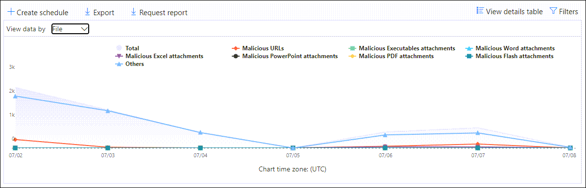
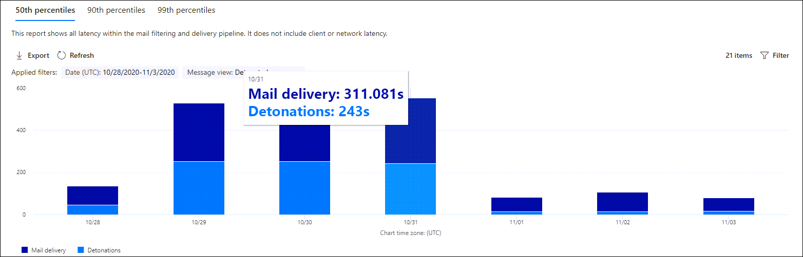

# 在安全性 & 規範中心的報表儀表板中，查看 Office 365 報表的 Defender

[!INCLUDE [Microsoft 365 Defender rebranding](../includes/microsoft-defender-for-office.md)]

Microsoft Defender for Office 365 組織 (例如，Microsoft 365 E5 訂閱或 Microsoft Defender for Office 365 Plan 1 或 Microsoft Defender for Office 365 方案2增益集) 包含各種安全性相關的報告。 如果您有 [必要的許可權](#what-permissions-are-needed-to-view-the-defender-for-office-365-reports)，您可以移至 [ **報表**] \> **儀表板**，在安全性 & 規範中心中查看這些報告。 若要直接移至 [報告] 儀表板，請開啟] <https://protection.office.com/insightdashboard> 。

## 適用於 Office 365 的 Defender 檔案類型報告

[ **Office 365 的 Defender] 檔案類型報告** 報告會顯示偵測為 [安全附件](atp-safe-attachments.md)的檔案類型。

 報表的匯總視圖允許90天的篩選，而詳細資料檢視只允許10天的篩選。

若要查看報告，請開啟 [安全性 & 規範中心](https://protection.office.com)，移至 [ **報告**] \> **儀表板** ，然後選取 [ **Office 365 檔案類型的 Defender**]。 若要直接前往報表，請開啟 <https://protection.office.com/reportv2?id=ATPFileReport> 。

> [!NOTE]
> 您也可以在 [Office 365 的 [Defender For Office 郵件](#defender-for-office-365-message-disposition-report)處理] 報告中取得此報告中的資訊。

### 適用于 Office 365 檔案類型的報表檢視報告

可供使用的視圖如下：

- **資料查看依據：** 檔案：此圖表包含下列資訊：

  - **惡意 Excel 附件**
  - **惡意的 Flash 附件**
  - **惡意的 PDF 附件**
  - **惡意 PowerPoint 附件**
  - **惡意 URLs**
  - **惡意的 Word 附件**
  - **惡意可執行附件**
  - **別人**

  當您將滑鼠停留在特定日期 (資料點) 時，您可以看到 EOP 中 [安全附件](atp-safe-attachments.md) 和 [反惡意程式碼保護](anti-malware-protection.md)偵測到的惡意檔案類型細目。

  

  如果您按一下 [ **篩選**]，您可以使用下列篩選器修改報告：

  - **開始日期** 和 **結束日期**
  - 圖表中顯示的相同檔案類型值。

- **資料查看方式：訊息**：此圖表包含下列資訊：

  - **封鎖存取**
  - **取代郵件**
  - **監控的郵件**
  - 以 **動態電子郵件傳遞取代**：如需詳細資訊，請參閱 [在安全附件原則中傳遞](atp-safe-attachments.md#dynamic-delivery-in-safe-attachments-policies)。

  

  如果您按一下 [ **篩選**]，您可以使用下列篩選器修改報告：

  - **開始日期** 和 **結束日期**
  - 圖表中可用的相同郵件處置值，以及已傳遞的其他 **郵件** 值。

### Defender for Office 365 檔案類型報告的詳細資料表格視圖

如果您按一下 [ **查看詳細資料] 表格**，此報告可提供最近10天內所有按一下動作的近乎即時視圖。 顯示的資訊取決於您所看到的圖表：

- **資料查看依據：** 檔案：

  - **Date**
  - **收件者位址**
  - **寄件者位址**
  - **郵件識別碼**：郵件頭的 **Message-ID** 標頭欄位中可用，且應該是唯一的。 範例值 `<08f1e0f6806a47b4ac103961109ae6ef@server.domain>` (記下角括弧) 。
  - **File**

  如果您按一下 [ **篩選**]，您可以使用下列篩選器修改報告：

  - **開始日期** 和 **結束日期**
  - 圖表中顯示的相同檔案類型值。

- **資料查看依據：訊息**：

  - **Date**
  - **收件者位址**
  - **寄件者位址**
  - **郵件識別碼**
  - **File**
  - **主旨**

  如果您按一下 [ **篩選**]，您可以使用下列篩選器修改結果：

  - **開始日期** 和 **結束日期**
  - 圖表中可用的相同郵件處置值，以及已傳遞的其他 **郵件** 值。

若要回到 [報表] 視圖，請按一下 [ **view report**]。

## 適用於 Office 365 的 Defender 郵件處置報告

**ATP 郵件** 處理報告會顯示偵測到有惡意內容的電子郵件所採取的動作。

若要查看報告，請開啟 [安全性 & 合規性中心](https://protection.office.com)，移至 [ **報告**] \> **儀表板** ，然後選取 [ **Office 365 的 Defender] 進行郵件** 處理。 若要直接前往報表，請開啟 <https://protection.office.com/reportv2?id=ATPMessageReport> 。

> [!NOTE]
> 您也可以在 [Office 365 檔案類型報告](#defender-for-office-365-file-types-report)中使用此報告中的資訊。

### 適用于 Office 365 的 Defender for Office 郵件處理報告

可供使用的視圖如下：

- **資料查看方式：訊息**：此圖表包含下列資訊：

  - **封鎖存取**
  - **取代郵件**
  - **監控的郵件**
  - 以 **動態電子郵件傳遞取代**：如需詳細資訊，請參閱 [在安全附件原則中傳遞](atp-safe-attachments.md#dynamic-delivery-in-safe-attachments-policies)。

  

  如果您按一下 [ **篩選**]，您可以使用下列篩選器修改報告：

  - **開始日期** 和 **結束日期**
  - 圖表中可用的相同郵件處置值，以及已傳遞的其他 **郵件** 值。

- **資料查看依據：** 檔案：此圖表包含下列資訊：

  - **惡意 Excel 附件**
  - **惡意的 Flash 附件**
  - **惡意的 PDF 附件**
  - **惡意 PowerPoint 附件**
  - **惡意 URLs**
  - **惡意的 Word 附件**
  - **惡意可執行附件**
  - **別人**

  當您將滑鼠停留在特定日期 (資料點) 時，您可以看到 EOP 中 [安全附件](atp-safe-attachments.md) 和 [反惡意程式碼保護](anti-malware-protection.md)偵測到的惡意檔案類型細目。

  

  如果您按一下 [ **篩選**]，您可以使用下列篩選器修改報告：

  - **開始日期** 和 **結束日期**
  - 圖表中顯示的相同檔案類型值。

### Defender for Office 365 郵件處理報告的詳細資料表格視圖

如果您按一下 [ **查看詳細資料] 表格**，此報告可提供最近10天內所有按一下動作的近乎即時視圖。 顯示的資訊取決於您所看到的圖表：

- **資料查看依據：訊息**：

  - **Date**
  - **收件者位址**
  - **寄件者位址**
  - **郵件識別碼**
  - **File**
  - **主旨**

  如果您按一下 [ **篩選**]，您可以使用下列篩選器修改結果：

  - **開始日期** 和 **結束日期**
  - 圖表中可用的相同郵件處置值，以及已傳遞的其他 **郵件** 值。

- **資料查看依據：** 檔案：

  - **Date**
  - **收件者位址**
  - **寄件者位址**
  - **郵件識別碼**
  - **File**

  如果您按一下 [ **篩選**]，您可以使用下列篩選器修改報告：

  - **開始日期** 和 **結束日期**
  - 圖表中顯示的相同檔案類型值。

若要回到 [報表] 視圖，請按一下 [ **view report**]。

## 郵件延遲報告

**郵件延遲報告** 會向您顯示組織內的郵件傳遞和引爆延遲的匯總視圖。 服務中的郵件傳遞時間受到多種因素的影響，而且絕對傳遞時間（秒）通常不是成功或問題的明確指示。 在一天內的傳遞時間可能會被視為另一天的平均傳遞時間，或反過來。 **郵件延遲報告** 會嘗試根據觀察到的其他郵件傳遞時間的統計資料，以限定郵件傳遞：

- 第 **50 個百分點**：這是郵件傳遞時間的中間部分。 您可以將此值視為平均傳遞時間。
- **90%**：這表示郵件傳遞的高延遲。 只有10% 的郵件花費的時間超過此值才能傳遞。
- **99th 百分點**：這表示郵件傳遞的最高延遲。

不包括用戶端和網路延遲。

若要查看報告，請開啟 [安全性 & 合規性中心](https://protection.office.com)，移至 [ **報告**] \> **儀表板** ，然後選取 [ **郵件延遲報告**]。 若要直接前往報表，請開啟 <https://protection.office.com/mailLatencyReport?viewid=P50> 。

### 郵件延遲報告的報表檢視

當您開啟報表時，預設會選取 [ **50 百分位數** ] 索引標籤。

此視圖預設會包含以下列篩選設定的圖表：

- **日期**：過去7天
- **郵件視圖**：
  - 引爆郵件

此圖顯示組織成下列類別的郵件：

- **郵件傳遞延遲**
- **引爆延遲**

當您將游標移到圖表中的某個類別時，您可以查看每個類別中的延遲明細。

如果您按一下報表檢視中的 [ **篩選** ]，您可以使用下列篩選器修改結果：

- 所有郵件
- 包含附件或 URLs 的郵件

如果您按一下 [ **90 百分位數** ] 索引標籤或 [ **99th 百分位數** ] 索引標籤，則會使用第 **50 個百分位數** 視圖中的相同預設篩選器。

### 郵件延遲報告的詳細資料表格視圖

[詳細資料] 表格視圖會顯示下列資訊：

- **Date**
- **百分位數**
- **訊息計數**
- **整體延遲**

上述顯示于11月14日，所有傳遞和引爆的郵件所經歷的平均延遲為 **108.033** 秒。

[詳細資料] 表格包含每個索引標籤上的相同資訊。

## 威脅防護狀態報告

「 **威脅防護狀態** 報告」是一種單一的視圖，可透過 [Exchange ONLINE protection](exchange-online-protection-overview.md) (EOP) 和 Microsoft Defender for Office 365，彙集惡意內容和惡意電子郵件的相關資訊。 如需詳細資訊，請參閱 [威脅防護狀態報表](view-email-security-reports.md#threat-protection-status-report)。

## URL 威脅防護報告

**Url 威脅防護報告** 可提供偵測到之威脅的摘要和趨勢視圖，以及在 URL 按一下上做為 [安全連結](atp-safe-links.md)的一部分所採取的動作。 若已套用安全連結原則的使用者沒有選取 [不 **追蹤使用者點擊** ] 選項，則此報告將不會有按一下其資料的使用者。

若要查看報告，請開啟 [安全性 & 合規性中心](https://protection.office.com)，移至 [ **報告**] \> **儀表板** ，然後選取 [ **URL 保護報告**]。 若要直接前往報表，請開啟 <https://protection.office.com/reportv2?id=URLProtectionActionReport> 。

> [!NOTE]
> 這是一項 *保護趨勢報告*，表示資料代表較大資料集的趨勢。 因此，在這種情況下，不會即時提供匯總視圖中的資料，但 [詳細資料] 表格視圖中的資料則是如此，您可能會看到這兩種視圖之間稍有差異。

### URL 威脅防護報告的報表檢視

**URL 威脅防護** 報告有兩個匯總的視圖，每四個小時都會重新整理一次，以顯示過去90天的資料：

- **URL 按一下保護動作**：顯示組織中的使用者按下 URL 按一下數目及按一下的結果：

  - **封鎖** (禁止使用者流覽至 URL) 
  - **封鎖並按一下**
  - **在掃描期間按一下**

  按一下表示使用者已透過封鎖頁面按一下至惡意網站 (系統管理員可以停用 [安全連結) 原則] 中的 click。

  如果您按一下 [ **篩選**]，您可以使用下列篩選器修改報告：

  - **開始日期** 和 **結束日期**
  - 可使用的 [保護動作]，加上 **允許 (使用者** 流覽至 URL) 的值。

  

- **依應用程式按一下 url**：會顯示支援安全連結之應用程式的 url 按一下數目：

  - **電子郵件用戶端**
  - **PowerPoint**
  - **Word**
  - **Excel**
  - **OneNote**
  - **Visio**
  - **Teams**
  - **其他**

  如果您按一下 [ **篩選**]，您可以使用下列篩選器修改報告：

  - **開始日期** 和 **結束日期**
  - 可用的應用程式。

### URL 威脅防護報告的詳細資料表格視圖

如果您按一下 [ **查看詳細資料] 表格**，則報告會提供最近7天內組織內所有按一下動作的近乎即時視圖，其詳細資料如下：

- **按一下 [時間]**
- **使用者**
- **URL**
- **Action**
- **App**

如果您按一下 [詳細資料] 表格視圖中的 [**篩選器**]，可以篩選與報表檢視中相同的準則，**以及以逗號分隔的****網域** 或收件者。

若要回到 [報表] 視圖，請按一下 [ **view report**]。

## 要查看的其他報告

除了本文所述的報告之外，還有其他幾個報告可供使用，如下表所述：

****

|報告|主題|
|---|---|
|**Explorer** (microsoft Defender for Office 365 plan 2) 或 **即時** 偵測， (Microsoft Defender for office 365 plan 1) |[威脅總管 (及即時偵測)](threat-explorer.md)|
|**電子郵件安全性報告**，例如主要寄件者和收件者報告、冒名郵件報告和垃圾郵件偵測報告。|[檢視安全性與合規性中心內的電子郵件安全性報告](view-email-security-reports.md)|
|**郵件流程報告**，例如轉寄報告、郵件流程狀態報表，以及主要寄件者和收件者報告。|[在安全性 & 規範中心內，查看郵件流程報告](view-mail-flow-reports.md)|
|**安全連結的 URL 追蹤** (僅 PowerShell) 。 此 Cmdlet 的輸出會顯示過去7天中安全連結動作的結果。|[Get-UrlTrace](https://docs.microsoft.com/powershell/module/exchange/get-urltrace)|
|**EOP 和 Microsoft Defender For Office 365 (的郵件流量結果，** 只 PowerShell) 。 此 Cmdlet 的輸出包含網域、日期、事件種類、方向、動作和郵件數目的相關資訊。|[MailTrafficATPReport](https://docs.microsoft.com/powershell/module/exchange/get-mailtrafficatpreport)|
|**EOP 和 Defender For Office 365 偵測的郵件詳細資料包告** (僅 PowerShell) 。 此 Cmdlet 的輸出包含有關電子郵件或檔案中惡意檔案或 URLs、網路釣魚企圖、模仿及其他潛在威脅的詳細資料。|[MailDetailATPReport](https://docs.microsoft.com/powershell/module/exchange/get-maildetailatpreport)|
|

## 查看 Office 365 的 Defender 時，需要哪些許可權？

為了查看和使用本文所述的報表，您必須是安全性 & 合規性中心之一的下列其中一個角色群組的成員：

- **組織管理**
- **安全性系統管理員**
- **安全性讀取者**
- **全域讀取器**

如需詳細資訊，請參閱[安全性與合規性中心中的權限](permissions-in-the-security-and-compliance-center.md)。

**附注**：將使用者新增至 microsoft 365 系統管理中心的對應 Azure Active Directory 角色，可讓使用者具備安全性 & 合規性中心的許可權 _，以及_ Microsoft 365 中其他功能的許可權。 如需詳細資訊，請參閱[關於系統管理員角色](https://docs.microsoft.com/microsoft-365/admin/add-users/about-admin-roles)。

## 如果報告未顯示資料，該怎麼辦？

如果您未看到您的 Office 365 報告中的資料，請仔細檢查您的原則設定是否正確。 您的組織必須已定義 [安全連結原則](set-up-atp-safe-links-policies.md) 及 [安全附件原則](set-up-atp-safe-attachments-policies.md) ，Office 365 防護功能才能就地使用。 另請參閱 [反垃圾郵件和反惡意程式碼保護](anti-spam-and-anti-malware-protection.md)。

## 相關主題

[安全性與合規性中心內的智慧型報表和深入解析](reports-and-insights-in-security-and-compliance.md)

[ (Azure Active Directory 的角色許可權](https://docs.microsoft.com/azure/active-directory/users-groups-roles/directory-assign-admin-roles#role-permissions)
