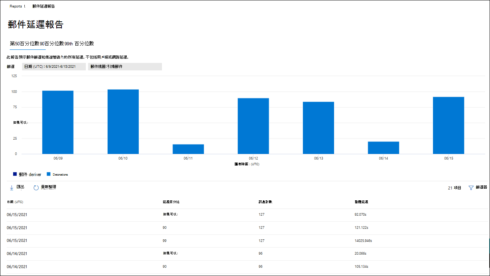

# 在 Microsoft 365 Defender 入口網站中查看 Office 365 報表的 DefenderView Defender for Office 365 reports in the Microsoft 365 Defender portal

[!INCLUDE [Microsoft 365 Defender rebranding](../includes/microsoft-defender-for-office.md)]

**適用於****Applies to**
- [適用於 Office 365 的 Microsoft Defender 方案 1 和方案 2Microsoft Defender for Office 365 plan 1 and plan 2](defender-for-office-365.md)
- [Microsoft 365 DefenderMicrosoft 365 Defender](../defender/microsoft-365-defender.md)

適用于 Office 365 組織的 Microsoft Defender (例如，Microsoft 365 E5 訂閱或 microsoft defender for Office 365 plan 1 或 microsoft defender for Office 365 plan 2 附加元件) 包含各種安全性相關的報表。Microsoft Defender for Office 365 organizations (for example, Microsoft 365 E5 subscriptions or Microsoft Defender for Office 365 Plan 1 or Microsoft Defender for Office 365 Plan 2 add-ons) contain a variety of security-related reports. 如果您有 [必要的許可權](#what-permissions-are-needed-to-view-the-defender-for-office-365-reports)，您可以在 Microsoft 365 Defender 入口網站中透過 **報告** \> **&** 共同作業 \> **電子郵件 &** 共同作業報告來查看這些報告。If you have the [necessary permissions](#what-permissions-are-needed-to-view-the-defender-for-office-365-reports), you can view these reports in the Microsoft 365 Defender portal by going to **Reports** \> **Email & collaboration** \> **Email & collaboration reports**. 若要直接移至 [ **電子郵件 &** 共同作業報告] 頁面上，開啟 <https://security.microsoft.com/emailandcollabreport> 。To go directly to the **Email & collaboration reports** page, open <https://security.microsoft.com/emailandcollabreport>.

![Microsoft 365 Defender 入口網站中的電子郵件 & 共同作業報告] 頁面](../../media/email-collaboration-reports.png)

> [!NOTE]
>
> 不需要 Office 365 Defender 的電子郵件安全性報告會在[Microsoft 365 Defender 入口網站中的「查看電子郵件安全性報告](view-email-security-reports.md)」中說明加以說明。Email security reports that don't require Defender for Office 365 are described in [View email security reports in the Microsoft 365 Defender portal](view-email-security-reports.md).
>
> 與郵件流程相關的報告現在位於 Exchange 系統管理中心 (EAC) 。Reports that are related to mail flow are now in the Exchange admin center (EAC). 如需這些報告的詳細資訊，請參閱[新 Exchange 系統管理中心的郵件流程報告](/exchange/monitoring/mail-flow-reports/mail-flow-reports)。For more information about these reports, see [Mail flow reports in the new Exchange admin center](/exchange/monitoring/mail-flow-reports/mail-flow-reports).

## 保管庫附件檔案類型報告Safe Attachments file types report

> [!NOTE]
> **保管庫附件檔案類型報告** 會最終消失。The **Safe Attachments file types report** will eventually go away. 「 [威脅防護狀態」報告](#threat-protection-status-report)中提供相同的資訊。The same information is available in the [Threat protection status report](#threat-protection-status-report).

## 保管庫附件郵件處理報告Safe Attachments message disposition report

> [!NOTE]
> **保管庫附件郵件處理報告** 會最後消失。The **Safe Attachments message disposition report** will eventually go away. 「 [威脅防護狀態」報告](#threat-protection-status-report)中提供相同的資訊。The same information is available in the [Threat protection status report](#threat-protection-status-report).

## 郵件延遲報告Mail latency report

**郵件延遲報告** 會向您顯示組織內的郵件傳遞和引爆延遲的匯總視圖。The **Mail latency report** shows you an aggregate view of the mail delivery and detonation latency experienced within your organization. 服務中的郵件傳遞時間受到多種因素的影響，而且絕對傳遞時間（秒）通常不是成功或問題的明確指示。Mail delivery times in the service are affected by a number of factors, and the absolute delivery time in seconds is often not a good indicator of success or a problem. 在一天內的傳遞時間可能會被視為另一天的平均傳遞時間，或反過來。A slow delivery time on one day might be considered an average delivery time on another day, or vice-versa. 這會嘗試根據對其他郵件的觀察傳遞時間的統計資料來傳遞郵件。This tries to qualify message delivery based on statistical data about the observed delivery times of other messages.

不包括用戶端和網路延遲。Client side and network latency are not included.

若要查看報告，請開啟 [Microsoft 365 Defender 入口網站](https://security.microsoft.com)，然後移至 [**報告** \> **電子郵件 &** 共同作業 \> **電子郵件 &** 共同作業報告]。To view the report, open the [Microsoft 365 Defender portal](https://security.microsoft.com), go to **Reports** \> **Email & collaboration** \> **Email & collaboration reports**. 在 [ **電子郵件 &** 共同作業報告] 頁面上，尋找 [ **郵件延遲報告** ]，然後按一下 [ **查看詳細資料**]。On the **Email & collaboration reports** page, find **Mail latency report** and then click **View details**. 若要直接前往報表，請開啟 <https://security.microsoft.com/mailLatencyReport> 。To go directly to the report, open <https://security.microsoft.com/mailLatencyReport>.

在 [ **郵件延遲報告** ] 頁面上，[ **郵件延遲報告** ] 頁面上提供下列索引標籤：On the **Mail latency report** page, the following tabs are available on the **Mail latency report** page:

- 第 **50 個百分點**：這是郵件傳遞時間的中間部分。**50th percentile**: This is the middle for message delivery times. 您可以將此值視為平均傳遞時間。You can consider this value as an average delivery time. 預設會選取此索引標籤。This tab is selected by default.
- **90%**：這表示郵件傳遞的高延遲。**90th percentile**: This indicates a high latency for message delivery. 只有10% 的郵件花費的時間超過此值才能傳遞。Only 10% of messages took longer than this value to deliver.
- **99th 百分點**：這表示郵件傳遞的最高延遲。**99th percentile**: This indicates the highest latency for message delivery.

不論選取的索引標籤為何，圖表都會顯示組織成下列類別的郵件：Regardless of the tab you select, the chart shows messages organized into the following categories:

- **郵件傳遞延遲****Mail delivery latency**
- **Detonations****Detonations**

當您將游標移到圖表中的某個類別時，您可以查看每個類別中的延遲明細。When you hover over a category in the chart, you can see a breakdown of the latency in each category.

如果您按一下 [ **篩選**]，您可以透過下列值來篩選圖表和詳細資料表格：If you click **Filter**, you can filter both the chart and the details table by the following values:

- **日期 (UTC)**： **開始日期** 和 **結束日期****Date (UTC)**: **Start date** and **End date**
- **郵件視圖**：下列其中一個值：**Message view**: One of the following values:
  - **所有郵件****All messages**
  - **包含附件或 URLs 的郵件****Messages that contain attachments or URLs**
  - **引爆郵件****Detonated messages**

當您完成設定篩選 **時，請按一下 [** 套用]、[ **取消**] 或 [ **清除篩選**]。When you're finished configuring the filters, click **Apply**, **Cancel**, or **Clear filters**.

在圖表下方的 [詳細資料] 表格中，可使用下列資訊：In the details table below the chart, the following information is available:

- **日期 (UTC)****Date (UTC)**
- **百分位數**： **50**、 **90** 或 **99****Percentiles**: **50**, **90**, or **99**
- **訊息計數****Message count**
- **整體延遲****Overall latency**

## 威脅防護狀態報告Threat protection status report

「**威脅防護狀態** 報告」是單一的視圖，可透過 [Exchange Online Protection](exchange-online-protection-overview.md) (EOP) 和 Microsoft Defender for Office 365，彙集惡意內容和惡意電子郵件的相關資訊。The **Threat protection status** report is a single view that brings together information about malicious content and malicious email detected and blocked by [Exchange Online Protection](exchange-online-protection-overview.md) (EOP) and Microsoft Defender for Office 365. 如需詳細資訊，請參閱 [威脅防護狀態報表](view-email-security-reports.md#threat-protection-status-report)。For more information, see [Threat protection status report](view-email-security-reports.md#threat-protection-status-report).

## URL 威脅防護報告URL threat protection report

**url 威脅防護報告** 可提供偵測到之威脅的摘要和趨勢視圖，以及在 URL 按一下上做為 [保管庫連結](safe-links.md)的一部分所採取的動作。The **URL threat protection report** provides summary and trend views for threats detected and actions taken on URL clicks as part of [Safe Links](safe-links.md). 在套用保管庫連結原則的使用者上，按一下 [不 **追蹤使用者點擊**] 選項時，此報告不會有按一下資料。This report will not have click data from users where the Safe Links policy applied has the **Do not track user clicks** option selected.

若要查看報告，請開啟 [Microsoft 365 Defender 入口網站](https://security.microsoft.com)，然後移至 [**報告** \> **電子郵件 &** 共同作業 \> **電子郵件 &** 共同作業報告]。To view the report, open the [Microsoft 365 Defender portal](https://security.microsoft.com), go to **Reports** \> **Email & collaboration** \> **Email & collaboration reports**. 在 [ **電子郵件 &** 共同作業報告] 頁面上，找到 [ **URL 保護] 頁面** ，然後按一下 [ **查看詳細資料**]。On the **Email & collaboration reports** page, find **URL protection page** and then click **View details**. 若要直接前往報表，請開啟 <https://security.microsoft.com/reports/URLProtectionActionReport> 。To go directly to the report, open <https://security.microsoft.com/reports/URLProtectionActionReport>.

![電子郵件 & 協同報告] 頁面上的 URL 保護報告構件](../../media/url-protection-report-widget.png)

下列各節將說明 [ **URL 威脅防護** 報告] 頁面上可用的視圖。The available views on the **URL threat protection** report page are described in the following sections.

> [!NOTE]
> 這是一項 *保護趨勢報告*，表示資料代表較大資料集的趨勢。This is a *protection trend report*, meaning data represents trends in a larger dataset. 因此，在這種情況下，圖表中的資料並不是即時的，但是 [詳細資料] 表格中的資料是，因此您可能會看到兩者之間的差異稍有不同。As a result, the data in the charts is not available in real time here, but the data in the details table is, so you may see a slight discrepancy between the two. 圖表每四小時重新整理一次，並包含過去90天的資料。The charts are refreshed once every four hours and contain data for the last 90 days.

### 依 URL 查看資料按一下 [保護動作]View data by URL click protection action

**依 URL 的查看資料按一下 [保護動作**] 視圖，會顯示組織中使用者的 URL 按一下數目，以及按一下的結果。The **View data by URL click protection action** view shows the number of URL clicks by users in the organization and the results of the click:

- **允許**：允許使用者流覽至 URL。**Allowed**: The user was allowed to navigate to the URL.
- 已 **封鎖**：已封鎖使用者流覽至 URL。**Blocked**: The user was blocked from navigating to the URL.
- **封鎖並按一下透過**：使用者已選擇繼續導覽 URL。**Blocked and clicked through**: The user has chosen to continue navigating to the URL.
- 在 **掃描期間按一下流覽**：使用者已在掃描完成之前按一下連結。**Clicked through during scan**: The user has clicked on the link before the scan was complete.

按一下表示使用者已透過封鎖頁面按一下至惡意網站 (系統管理員可以停用保管庫連結原則) 中的按一下。A click indicates that the user has clicked through the block page to the malicious website (admins can disable click through in Safe Links policies).

如果您按一下 [ **篩選**]，您可以在出現的浮出控制項中選取下列一或多個值，以修改報告和詳細資料表格：If you click **Filters**, you can modify the report and the details table by selecting one or more of the following values in the flyout that appears:

- **日期 (UTC)**： **開始日期** 和 **結束日期****Date (UTC)**: **Start date** and **End date**
- **偵測**：**Detection**:
  - **允許****Allowed**
  - **封鎖****Blocked**
  - **封鎖並按一下****Blocked and clicked through**
  - **在掃描期間按一下****Clicked through during scan**
- **網域**：報告結果中列出的 URL 網域。**Domains**: The URL domains listed in the report results.
- **收件者****Recipients**

當您完成設定篩選 **時，請按一下 [** 套用]、[ **取消**] 或 [ **清除篩選**]。When you're finished configuring the filters, click **Apply**, **Cancel**, or **Clear filters**.

圖表下方的 [詳細資料] 表格提供下列最近7天內所有按一下動作的近乎即時視圖：The details table below the chart provides the following near-real-time view of all clicks that happened within the organization for the last 7 days:

- **按一下 [時間]****Click time**
- **使用者****User**
- **URL****URL**
- **Action****Action**
- **應用程式****App**

### 依 URL 查看資料依應用程式按一下View data by URL click by application

![URL 威脅防護報告中的 [依應用程式視圖按一下 URL]](../../media/url-threat-protection-report-url-click-by-application-view.png)

**依 URL 的 View data 依序按一下 [應用程式** 視圖]，會顯示支援保管庫連結的應用程式的 URL 按一下數目：The **View data by URL click by application** view shows the number of URL clicks by apps that support Safe Links:

- **電子郵件用戶端****Email client**
- **PowerPoint****PowerPoint**
- **Word****Word**
- **Excel****Excel**
- **OneNote****OneNote**
- **Visio****Visio**
- **Teams****Teams**
- **別人****Others**

如果您按一下 [ **篩選**]，您可以在出現的浮出控制項中選取下列一或多個值，以修改報告和詳細資料表格：If you click **Filters**, you can modify the report and the details table by selecting one or more of the following values in the flyout that appears:

- **日期 (UTC)**： **開始日期** 和 **結束日期****Date (UTC)**: **Start date** and **End date**
- **偵測**：圖表中可用的應用程式。**Detection**: Available apps from the chart.
- **網域**：報告結果中列出的 URL 網域。**Domains**: The URL domains listed in the report results.
- **收件者****Recipients**

當您完成設定篩選 **時，請按一下 [** 套用]、[ **取消**] 或 [ **清除篩選**]。When you're finished configuring the filters, click **Apply**, **Cancel**, or **Clear filters**.

圖表下方的 [詳細資料] 表格提供下列最近7天內所有按一下動作的近乎即時視圖：The details table below the chart provides the following near-real-time view of all clicks that happened within the organization for the last 7 days:

- **按一下 [時間]****Click time**
- **使用者****User**
- **URL****URL**
- **Action****Action**
- **應用程式****App**

## 要查看的其他報告Additional reports to view

除了本文所述的報告之外，還有其他幾個報告可供使用，如下表所述：In addition to the reports described in this article, several other reports are available, as described in the following table:

 

****

|報告Report|主題Topic|
|---|---|
|**Explorer** (microsoft defender for Office 365 plan 2) 或 **即時** 偵測 (Microsoft defender for Office 365 Plan 1) **Explorer** (Microsoft Defender for Office 365 Plan 2) or **real-time detections** (Microsoft Defender for Office 365 Plan 1)|[威脅總管 (及即時偵測)Threat Explorer (and real-time detections)](threat-explorer.md)|
|**電子郵件安全性報告**，例如主要寄件者和收件者報告、冒名郵件報告和垃圾郵件偵測報告。**Email security reports**, such as the Top senders and recipients report, the Spoof mail report, and the Spam detections report.|[在 Microsoft 365 Defender 入口網站中查看電子郵件安全性報告View email security reports in the Microsoft 365 Defender portal](view-email-security-reports.md)|
|**郵件流程報告**，例如轉寄報告、郵件流程狀態報表，以及主要寄件者和收件者報告。**Mail flow reports**, such as the Forwarding report, the Mailflow status report, and the Top senders and recipients report.|[新 Exchange 系統管理中心的郵件流程報告Mail flow reports in the new Exchange admin center](/exchange/monitoring/mail-flow-reports/mail-flow-reports)|
|**保管庫連結的 URL 追蹤** (僅 PowerShell) 。**URL trace for Safe Links** (PowerShell only). 此 Cmdlet 的輸出會顯示在過去7天中保管庫連結動作的結果。The output of this cmdlet shows you the results of Safe Links actions over the past seven days.|[Get-UrlTraceGet-UrlTrace](/powershell/module/exchange/get-urltrace)|
|僅 PowerShell) ， **EOP 和 Microsoft Defender for Office 365 (的郵件流量結果**。**Mail traffic results for EOP and Microsoft Defender for Office 365** (PowerShell only). 此 Cmdlet 的輸出包含網域、日期、事件種類、方向、動作和郵件數目的相關資訊。The output of this cmdlet contains information about Domain, Date, Event Type, Direction, Action, and Message Count.|[MailTrafficATPReportGet-MailTrafficATPReport](/powershell/module/exchange/get-mailtrafficatpreport)|
|**EOP 和 Defender Office 365 偵測的郵件詳細資料包告** (僅 PowerShell) 。**Mail detail reports for EOP and Defender for Office 365 detections** (PowerShell only). 此 Cmdlet 的輸出包含有關電子郵件或檔案中惡意檔案或 URLs、網路釣魚企圖、模仿及其他潛在威脅的詳細資料。The output of this cmdlet contains details about malicious files or URLs, phishing attempts, impersonation, and other potential threats in email or files.|[MailDetailATPReportGet-MailDetailATPReport](/powershell/module/exchange/get-maildetailatpreport)|
|

## 流覽 Office 365 報表的 Defender 時，需要哪些許可權？What permissions are needed to view the Defender for Office 365 reports?

為了查看和使用本文所述的報表，您必須是 Microsoft 365 Defender 入口網站中下列其中一個角色群組的成員：In order to view and use the reports described in this article, you need to be a member of one of the following role groups in the Microsoft 365 Defender portal:

- **組織管理****Organization Management**
- **安全性系統管理員****Security Administrator**
- **安全性讀取者****Security Reader**
- **全域讀取器****Global Reader**

如需詳細資訊，請參閱 [Microsoft 365 Defender 入口網站中的權限](permissions-microsoft-365-security-center.md)。For more information, see [Permissions in the Microsoft 365 Defender portal](permissions-microsoft-365-security-center.md).

**附注**：將使用者新增至 Microsoft 365 系統管理中心中對應的 Azure Active Directory 角色，可為使用者提供 Microsoft 365 Defender 入口網站中的必要許可權 _，以及_ Microsoft 365 中其他功能的許可權。**Note**: Adding users to the corresponding Azure Active Directory role in the Microsoft 365 admin center gives users the required permissions in the Microsoft 365 Defender portal _and_ permissions for other features in Microsoft 365. 如需詳細資訊，請參閱[關於系統管理員角色](../../admin/add-users/about-admin-roles.md)。For more information, see [About admin roles](../../admin/add-users/about-admin-roles.md).

## 如果報告未顯示資料，該怎麼辦？What if the reports aren't showing data?

如果您未在 Office 365 報告中看到您的 Defender 資料，請仔細檢查您的原則設定是否正確。If you are not seeing data in your Defender for Office 365 reports, double-check that your policies are set up correctly. 您的組織必須已定義[保管庫連結原則](set-up-safe-links-policies.md)及[保管庫附件原則](set-up-safe-attachments-policies.md)，才能使用 Defender，Office 365 保護功能即就地。Your organization must have [Safe Links policies](set-up-safe-links-policies.md) and [Safe Attachments policies](set-up-safe-attachments-policies.md) defined in order for Defender for Office 365 protection to be in place. 另請參閱 [反垃圾郵件和反惡意程式碼保護](anti-spam-and-anti-malware-protection.md)。Also see [Anti-spam and anti-malware protection](anti-spam-and-anti-malware-protection.md).

## 相關主題Related topics

[Microsoft 365 Defender 入口網站中的智慧報告和洞察力Smart reports and insights in the Microsoft 365 Defender portal](reports-and-insights-in-security-and-compliance.md)

[角色許可權 (Azure Active DirectoryRole permissions (Azure Active Directory](/azure/active-directory/users-groups-roles/directory-assign-admin-roles#role-permissions)
