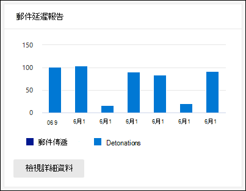

# 在 Microsoft 365 Defender 入口網站的報表儀表板中查看 Office 365 報表的 DefenderView Defender for Office 365 reports in the Reports dashboard in the Microsoft 365 Defender portal

[!INCLUDE [Microsoft 365 Defender rebranding](../includes/microsoft-defender-for-office.md)]

**適用於****Applies to**
- [適用於 Office 365 的 Microsoft Defender 方案 1 和方案 2Microsoft Defender for Office 365 plan 1 and plan 2](defender-for-office-365.md)
- [Microsoft 365 DefenderMicrosoft 365 Defender](../defender/microsoft-365-defender.md)

適用于 Office 365 組織的 Microsoft Defender (例如，Microsoft 365 E5 訂閱或 microsoft defender for Office 365 plan 1 或 microsoft defender for Office 365 plan 2 附加元件) 包含各種安全性相關的報表。Microsoft Defender for Office 365 organizations (for example, Microsoft 365 E5 subscriptions or Microsoft Defender for Office 365 Plan 1 or Microsoft Defender for Office 365 Plan 2 add-ons) contain a variety of security-related reports. 如果您有 [必要的許可權](#what-permissions-are-needed-to-view-the-defender-for-office-365-reports)，可以前往 **報告** \> **電子郵件** 共同作業的電子郵件共同作業 \> **報告**，以在 Microsoft 365 Defender 入口網站中查看這些報告。If you have the [necessary permissions](#what-permissions-are-needed-to-view-the-defender-for-office-365-reports), you can view these reports in the Microsoft 365 Defender portal by going to **Reports** \> **Email collaboration** \> **Email collaboration reports**. 若要直接移至 [報告] 儀表板，請開啟] <https://security.microsoft.com/emailandcollabreport> 。To go directly to the Reports dashboard, open <https://security.microsoft.com/emailandcollabreport>.

## 適用於 Office 365 的 Defender 檔案類型報告Defender for Office 365 file types report

**Office 365 檔案類型的 Defender 報告** 報告會向您顯示以 [安全附件](safe-attachments.md)方式偵測為惡意的檔案類型。The **Defender for Office 365 file types report** report shows you the type of files detected as malicious by [Safe Attachments](safe-attachments.md).

 報表的匯總視圖允許90天的篩選，而詳細資料檢視只允許10天的篩選。The aggregate view of the report allows for 90 days of filtering, while the detail view only allows for 10 days of filtering.

若要查看報告，請開啟 [Microsoft 365 的 Defender 入口網站](https://security.microsoft.com)，移至 [**報告**] \> **儀表板**，然後選取 [ **Office 365 檔案類型的 Defender**]。To view the report, open the [Microsoft 365 Defender portal](https://security.microsoft.com), go to **Reports** \> **Dashboard** and select **Defender for Office 365 file types**. 若要直接前往報表，請開啟 <https://protection.office.com/reportv2?id=ATPFileReport> 。To go directly to the report, open <https://protection.office.com/reportv2?id=ATPFileReport>.

> [!NOTE]
> 您也可以在[Office 365 郵件處理報告的 Defender](#defender-for-office-365-message-disposition-report)中使用此報告中的資訊。The information in this report is also available in the [Defender for Office 365 message disposition report](#defender-for-office-365-message-disposition-report).

### Office 365 檔案類型的 Defender 報表檢視報告Report view for the Defender for Office 365 file types report

您可使用下列檢視：The following views are available:

- **資料查看依據：** 檔案：此圖表包含下列資訊：**View data by: File**: The chart contains the following information:

  - **惡意 Excel 附件****Malicious Excel attachments**
  - **惡意的 Flash 附件****Malicious Flash attachments**
  - **惡意的 PDF 附件****Malicious PDF attachments**
  - **惡意 PowerPoint 附件****Malicious PowerPoint attachments**
  - **惡意 URLs****Malicious URLs**
  - **惡意的 Word 附件****Malicious Word attachments**
  - **惡意可執行附件****Malicious executable attachments**
  - **別人****Others**

  當您將滑鼠停留在特定日期 (資料點) 時，您可以看到 EOP 中 [安全附件](safe-attachments.md) 和 [反惡意程式碼保護](anti-malware-protection.md)偵測到的惡意檔案類型細目。When you hover over a particular day (data point), you can see the breakdown of types of malicious files that were detected by [Safe Attachments](safe-attachments.md) and [anti-malware protection in EOP](anti-malware-protection.md).

  

  如果您按一下 [ **篩選**]，您可以使用下列篩選器修改報告：If you click **Filters**, you can modify the report with the following filters:

  - **開始日期** 和 **結束日期****Start date** and **End date**
  - 圖表中顯示的相同檔案類型值。The same file type values that are visible in the chart.

- **資料查看方式：訊息**：此圖表包含下列資訊：**View data by: Message**: The chart contains the following information:

  - **封鎖存取****Block access**
  - **取代郵件****Messages replaced**
  - **監控的郵件****Messages monitored**
  - 以 **動態電子郵件傳遞取代**：如需詳細資訊，請參閱 [在安全附件原則中傳遞](safe-attachments.md#dynamic-delivery-in-safe-attachments-policies)。**Replaced by Dynamic Email Delivery**: For more information, see [Dynamic Delivery in Safe Attachments policies](safe-attachments.md#dynamic-delivery-in-safe-attachments-policies).

  

  如果您按一下 [ **篩選**]，您可以使用下列篩選器修改報告：If you click **Filters**, you can modify the report with the following filters:

  - **開始日期** 和 **結束日期****Start date** and **End date**
  - 圖表中可用的相同郵件處置值，以及已傳遞的其他 **郵件** 值。The same message disposition values that are available in the chart, and the additional **Messages passed** value.

### Office 365 檔案類型的 Defender 的詳細資料表格視圖報告Details table view for the Defender for Office 365 file types report

如果您按一下 [ **查看詳細資料] 表格**，此報告可提供最近10天內所有按一下動作的近乎即時視圖。If you click **View details table**, the report provides a near-real-time view of all clicks that happen within the organization for the last 10 days. 顯示的資訊取決於您所看到的圖表：The information that's shown depends on the chart you were looking at:

- **資料查看依據：** 檔案：**View data by: File**:

  - **Date****Date**
  - **收件者位址****Recipient address**
  - **寄件者位址****Sender address**
  - **郵件識別碼**：郵件頭的 **Message-ID** 標頭欄位中可用，且應該是唯一的。**Message ID**: Available in the **Message-ID** header field in the message header and should be unique. 範例值 `<08f1e0f6806a47b4ac103961109ae6ef@server.domain>` (記下角括弧) 。An example value is `<08f1e0f6806a47b4ac103961109ae6ef@server.domain>` (note the angle brackets).
  - **檔案****File**

  如果您按一下 [ **篩選**]，您可以使用下列篩選器修改報告：If you click **Filters**, you can modify the report with the following filters:

  - **開始日期** 和 **結束日期****Start date** and **End date**
  - 圖表中顯示的相同檔案類型值。The same file type values that are visible in the chart.

- **資料查看依據：訊息**：**View data by: Message**:

  - **Date****Date**
  - **收件者位址****Recipient address**
  - **寄件者位址****Sender address**
  - **郵件識別碼****Message ID**
  - **檔案****File**
  - **主旨****Subject**

  如果您按一下 [ **篩選**]，您可以使用下列篩選器修改結果：If you click **Filters**, you can modify the results with the following filters:

  - **開始日期** 和 **結束日期****Start date** and **End date**
  - 圖表中可用的相同郵件處置值，以及已傳遞的其他 **郵件** 值。The same message disposition values that are available in the chart, and the additional **Messages passed** value.

若要回到 [報表] 視圖，請按一下 [ **view report**]。To get back to the reports view, click **View report**.

## 適用於 Office 365 的 Defender 郵件處置報告Defender for Office 365 message disposition report

**ATP 郵件** 處理報告會顯示偵測到有惡意內容的電子郵件所採取的動作。The **ATP Message Disposition** report shows you the actions that were taken for email messages that were detected as having malicious content.

若要查看報告，請開啟 [Microsoft 365 Defender 入口網站](https://security.microsoft.com)，然後移至 [**報告** \> **電子郵件 &** 共同作業 \> **電子郵件 &** 共同作業報告]，然後選取 [ **Office 365 郵件處理的 Defender**]。To view the report, open the [Microsoft 365 Defender portal](https://security.microsoft.com), go to **Reports** \> **Email & collaboration** \> **Email & collaboration reports** and select **Defender for Office 365 message disposition**. 若要直接前往報表，請開啟 <https://protection.office.com/reportv2?id=ATPMessageReport> 。To go directly to the report, open <https://protection.office.com/reportv2?id=ATPMessageReport>.

> [!NOTE]
> 您也可以在[Office 365 檔案類型報告的 Defender](#defender-for-office-365-file-types-report)中使用此報告中的資訊。The information in this report is also available in the [Defender for Office 365 file types report](#defender-for-office-365-file-types-report).

### Office 365 郵件處理報告的 Defender 報表檢視Report view for the Defender for Office 365 message disposition report

您可使用下列檢視：The following views are available:

- **資料查看方式：訊息**：此圖表包含下列資訊：**View data by: Message**: The chart contains the following information:

  - **封鎖存取****Block access**
  - **取代郵件****Messages replaced**
  - **監控的郵件****Messages monitored**
  - 以 **動態電子郵件傳遞取代**：如需詳細資訊，請參閱 [在安全附件原則中傳遞](safe-attachments.md#dynamic-delivery-in-safe-attachments-policies)。**Replaced by Dynamic Email Delivery**: For more information, see [Dynamic Delivery in Safe Attachments policies](safe-attachments.md#dynamic-delivery-in-safe-attachments-policies).

  

  如果您按一下 [ **篩選**]，您可以使用下列篩選器修改報告：If you click **Filters**, you can modify the report with the following filters:

  - **開始日期** 和 **結束日期****Start date** and **End date**
  - 圖表中可用的相同郵件處置值，以及已傳遞的其他 **郵件** 值。The same message disposition values that are available in the chart, and the additional **Messages passed** value.

- **資料查看依據：** 檔案：此圖表包含下列資訊：**View data by: File**: The chart contains the following information:

  - **惡意 Excel 附件****Malicious Excel attachments**
  - **惡意的 Flash 附件****Malicious Flash attachments**
  - **惡意的 PDF 附件****Malicious PDF attachments**
  - **惡意 PowerPoint 附件****Malicious PowerPoint attachments**
  - **惡意 URLs****Malicious URLs**
  - **惡意的 Word 附件****Malicious Word attachments**
  - **惡意可執行附件****Malicious executable attachments**
  - **別人****Others**

  當您將滑鼠停留在特定日期 (資料點) 時，您可以看到 EOP 中 [安全附件](safe-attachments.md) 和 [反惡意程式碼保護](anti-malware-protection.md)偵測到的惡意檔案類型細目。When you hover over a particular day (data point), you can see the breakdown of types of malicious files that were detected by [Safe Attachments](safe-attachments.md) and [anti-malware protection in EOP](anti-malware-protection.md).

  

  如果您按一下 [ **篩選**]，您可以使用下列篩選器修改報告：If you click **Filters**, you can modify the report with the following filters:

  - **開始日期** 和 **結束日期****Start date** and **End date**
  - 圖表中顯示的相同檔案類型值。The same file type values that are visible in the chart.

### Office 365 郵件處理報告的 Defender 的詳細資料表格視圖Details table view for the Defender for Office 365 message disposition report

如果您按一下 [ **查看詳細資料] 表格**，此報告可提供最近10天內所有按一下動作的近乎即時視圖。If you click **View details table**, the report provides a near-real-time view of all clicks that happen within the organization for the last 10 days. 顯示的資訊取決於您所看到的圖表：The information that's shown depends on the chart you were looking at:

- **資料查看依據：訊息**：**View data by: Message**:

  - **Date****Date**
  - **收件者位址****Recipient address**
  - **寄件者位址****Sender address**
  - **郵件識別碼****Message ID**
  - **檔案****File**
  - **主旨****Subject**

  如果您按一下 [ **篩選**]，您可以使用下列篩選器修改結果：If you click **Filters**, you can modify the results with the following filters:

  - **開始日期** 和 **結束日期****Start date** and **End date**
  - 圖表中可用的相同郵件處置值，以及已傳遞的其他 **郵件** 值。The same message disposition values that are available in the chart, and the additional **Messages passed** value.

- **資料查看依據：** 檔案：**View data by: File**:

  - **Date****Date**
  - **收件者位址****Recipient address**
  - **寄件者位址****Sender address**
  - **郵件識別碼****Message ID**
  - **檔案****File**

  如果您按一下 [ **篩選**]，您可以使用下列篩選器修改報告：If you click **Filters**, you can modify the report with the following filters:

  - **開始日期** 和 **結束日期****Start date** and **End date**
  - 圖表中顯示的相同檔案類型值。The same file type values that are visible in the chart.

若要回到 [報表] 視圖，請按一下 [ **view report**]。To get back to the reports view, click **View report**.

## 郵件延遲報告Mail latency report

**郵件延遲報告** 會向您顯示組織內的郵件傳遞和引爆延遲的匯總視圖。The **Mail latency report** shows you an aggregate view of the mail delivery and detonation latency experienced within your organization. 服務中的郵件傳遞時間受到多種因素的影響，而且絕對傳遞時間（秒）通常不是成功或問題的明確指示。Mail delivery times in the service are affected by a number of factors, and the absolute delivery time in seconds is often not a good indicator of success or a problem. 在一天內的傳遞時間可能會被視為另一天的平均傳遞時間，或反過來。A slow delivery time on one day might be considered an average delivery time on another day, or vice-versa. **郵件延遲報告** 會嘗試根據觀察到的其他郵件傳遞時間的統計資料，以限定郵件傳遞：The **Mail latency report** tries to qualify message delivery based on statistical data about the observed delivery times of other messages:

- 第 **50 個百分點**：這是郵件傳遞時間的中間部分。**50th percentile**: This is the middle for message delivery times. 您可以將此值視為平均傳遞時間。You can consider this value as an average delivery time.
- **90%**：這表示郵件傳遞的高延遲。**90th percentile**: This indicates a high latency for message delivery. 只有10% 的郵件花費的時間超過此值才能傳遞。Only 10% of messages took longer than this value to deliver.
- **99th 百分點**：這表示郵件傳遞的最高延遲。**99th percentile**: This indicates the highest latency for message delivery.

不包括用戶端和網路延遲。Client side and network latency are not included.

若要查看報告，請開啟 [Microsoft 365 Defender 入口網站](https://security.microsoft.com)，移至 [**報告** \> **電子郵件 &** 共同作業 \> **電子郵件 & 共同報告**]，然後按一下 [**郵件延遲報告**] 底下的 [**詳細資料**]。To view the report, open the [Microsoft 365 Defender portal](https://security.microsoft.com), go to **Reports** \> **Email & collaboration** \> **Email & collaboration reports** and click **View details** under **Mail latency report**. 若要直接前往報表，請開啟 <https://security.microsoft.com/mailLatencyReport> 。To go directly to the report, open <https://security.microsoft.com/mailLatencyReport>.

### 郵件延遲報告的報表檢視Report view for the Mail latency report

當您開啟報表時，預設會選取 [ **50 百分位數** ] 索引標籤。When you open the report, the **50th percentiles** tab is selected by default.

此視圖預設會包含以下列篩選設定的圖表：By default, this view contains a chart that's configured with the following filters:

- **日期**：過去7天**Date**: The last 7 days
- **郵件視圖**：**Message View**:
  - 引爆郵件Detonated messages

此圖顯示組織成下列類別的郵件：This chart shows messages organized into the following categories:

- **郵件傳遞延遲****Mail delivery latency**
- **引爆延遲****Detonation latency**

當您將游標移到圖表中的某個類別時，您可以查看每個類別中的延遲明細。When you hover over a category in the chart, you can see a breakdown of the latency in each category.

如果您按一下報表檢視中的 [ **篩選** ]，您可以使用下列篩選器修改結果：If you click **Filter** in the report view, you can modify the results with the following filters:

- 所有郵件All messages
- 包含附件或 URLs 的郵件Messages that contain attachments or URLs

如果您按一下 [ **90 百分位數** ] 索引標籤或 [ **99th 百分位數** ] 索引標籤，則會使用第 **50 個百分位數** 視圖中的相同預設篩選器。If you click the **90th percentiles** tab or the **99th percentiles** tab, the same default filters from the **50th percentiles** view are used.

### 郵件延遲報告的詳細資料表格視圖Details table view for the Mail latency report

[詳細資料] 表格視圖會顯示下列資訊：The following information is shown in the details table view:

- **Date****Date**
- **百分位數****Percentiles**
- **訊息計數****Message count**
- **整體延遲****Overall latency**

上述顯示于11月14日，所有傳遞和引爆的郵件所經歷的平均延遲為 **108.033** 秒。The above shows that on November 14 the average latency experienced for all messages delivered and detonated was **108.033** seconds.

[詳細資料] 表格包含每個索引標籤上的相同資訊。The details table contains the same information on each tab.

## 威脅防護狀態報告Threat protection status report

「**威脅防護狀態** 報告」是單一的視圖，可透過 [Exchange Online Protection](exchange-online-protection-overview.md) (EOP) 和 Microsoft Defender for Office 365，彙集惡意內容和惡意電子郵件的相關資訊。The **Threat protection status** report is a single view that brings together information about malicious content and malicious email detected and blocked by [Exchange Online Protection](exchange-online-protection-overview.md) (EOP) and Microsoft Defender for Office 365. 如需詳細資訊，請參閱 [威脅防護狀態報表](view-email-security-reports.md#threat-protection-status-report)。For more information, see [Threat protection status report](view-email-security-reports.md#threat-protection-status-report).

## URL 威脅防護報告URL threat protection report

**Url 威脅防護報告** 可提供偵測到之威脅的摘要和趨勢視圖，以及在 URL 按一下上做為 [安全連結](safe-links.md)的一部分所採取的動作。The **URL threat protection report** provides summary and trend views for threats detected and actions taken on URL clicks as part of [Safe Links](safe-links.md). 若已套用安全連結原則的使用者沒有選取 [不 **追蹤使用者點擊** ] 選項，則此報告將不會有按一下其資料的使用者。This report will not have click data from users where the Safe Links policy applied has the **Do not track user clicks** option selected.

若要查看報告，請開啟 [Microsoft 365 Defender 入口網站](https://security.microsoft.com)，移至 [**報告** \> **電子郵件 &** 共同作業 \> **電子郵件 & 共同報告**]，然後按一下 [ **URL 保護報告**] 底下的 [**查看詳細資料**]To view the report, open the [Microsoft 365 Defender portal](https://security.microsoft.com), go to **Reports** \> **Email & collaboration** \> **Email & collaboration reports** and click **View details** under **URL protection report**. 若要直接前往報表，請開啟 <https://security.microsoft.com/reports/URLProtectionActionReport> 。To go directly to the report, open <https://security.microsoft.com/reports/URLProtectionActionReport>.

> [!NOTE]
> 這是一項 *保護趨勢報告*，表示資料代表較大資料集的趨勢。This is a *protection trend report*, meaning data represents trends in a larger dataset. 因此，在這種情況下，不會即時提供匯總視圖中的資料，但 [詳細資料] 表格視圖中的資料則是如此，您可能會看到這兩種視圖之間稍有差異。As a result, the data in the aggregate view is not available in real time here, but the data in the details table view is, so you may see a slight discrepancy between the two views.

### URL 威脅防護報告的報表檢視Report view for the URL threat protection report

**URL 威脅防護** 報告有兩個匯總的視圖，每四個小時都會重新整理一次，以顯示過去90天的資料：The **URL threat protection** report has two aggregated views that are refreshed once every four hours that shows data for the last 90 days:

- **URL 按一下保護動作**：顯示組織中的使用者按下 URL 按一下數目及按一下的結果：**URL click protection action**: Shows the number of URL clicks by users in the organization and the results of the click:

  - **封鎖** (禁止使用者流覽至 URL) **Blocked** (the user was blocked from navigating to the URL)
  - 在使用者選擇繼續導覽 URL 的 (**封鎖和點擊**) **Blocked and clicked through** (the user has chosen to continue navigating to the URL)
  - 在 **掃描期間按一下流覽** (使用者已在掃描完成之前按一下連結) **Clicked through during scan** (the user has clicked on the link before the scan was complete)

  按一下表示使用者已透過封鎖頁面按一下至惡意網站 (系統管理員可以停用 [安全連結) 原則] 中的 click。A click indicates that the user has clicked through the block page to the malicious website (admins can disable click through in Safe Links policies).

  如果您按一下 [ **篩選**]，您可以使用下列篩選器修改報告：If you click **Filters**, you can modify the report with the following filters:

  - **開始日期** 和 **結束日期****Start date** and **End date**
  - 可使用的 [保護動作]，加上 **允許 (使用者** 流覽至 URL) 的值。The available click protection actions, plus the value **Allowed** (the user was allowed to navigate to the URL).

  

- **依應用程式按一下 url**：會顯示支援安全連結之應用程式的 url 按一下數目：**URL click by application**: Shows the number of URL clicks by applications that support Safe Links:

  - **電子郵件用戶端****Email client**
  - **PowerPoint****PowerPoint**
  - **Word****Word**
  - **Excel****Excel**
  - **OneNote****OneNote**
  - **Visio****Visio**
  - **Teams****Teams**
  - **其他****Other**

  如果您按一下 [ **篩選**]，您可以使用下列篩選器修改報告：If you click **Filters**, you can modify the report with the following filters:

  - **開始日期** 和 **結束日期****Start date** and **End date**
  - 可用的應用程式。The available applications.

### URL 威脅防護報告的詳細資料表格視圖Details table view for the URL threat protection report

如果您按一下 [ **查看詳細資料] 表格**，則報告會提供最近7天內組織內所有按一下動作的近乎即時視圖，其詳細資料如下：If you click **View details table**, the report provides a near-real-time view of all clicks that happen within the organization for the last 7 days with the following details:

- **按一下 [時間]****Click time**
- **使用者****User**
- **URL****URL**
- **Action****Action**
- **應用程式****App**

如果您按一下 [詳細資料] 表格視圖中的 [**篩選器**]，可以篩選與報表檢視中相同的準則，**以及以逗號分隔的\*\*\*\*網域** 或收件者。If you click **Filters** in the details table view, you can filter by the same criteria as in the report view, and also by **Domains** or **Recipients** separated by commas.

> [!NOTE]
> **網域** 篩選器是指報告結果中所列的 URL 網域。The **Domains** filter refers to the URL domain listed in the report results. 

若要回到 [報表] 視圖，請按一下 [ **view report**]。To get back to the reports view, click **View report**.

## 要查看的其他報告Additional reports to view

除了本文所述的報告之外，還有其他幾個報告可供使用，如下表所述：In addition to the reports described in this article, several other reports are available, as described in the following table:

****

|報告Report|主題Topic|
|---|---|
|**Explorer** (microsoft defender for Office 365 plan 2) 或 **即時** 偵測 (Microsoft defender for Office 365 Plan 1) **Explorer** (Microsoft Defender for Office 365 Plan 2) or **real-time detections** (Microsoft Defender for Office 365 Plan 1)|[威脅總管 (及即時偵測)Threat Explorer (and real-time detections)](threat-explorer.md)|
|**電子郵件安全性報告**，例如主要寄件者和收件者報告、冒名郵件報告和垃圾郵件偵測報告。**Email security reports**, such as the Top senders and recipients report, the Spoof mail report, and the Spam detections report.|[在 Microsoft 365 Defender 入口網站中查看電子郵件安全性報告View email security reports in the Microsoft 365 Defender portal](view-email-security-reports.md)|
|**郵件流程報告**，例如轉寄報告、郵件流程狀態報表，以及主要寄件者和收件者報告。**Mail flow reports**, such as the Forwarding report, the Mailflow status report, and the Top senders and recipients report.|[在 Microsoft 365 Defender 入口網站中查看郵件流程報告View mail flow reports in the Microsoft 365 Defender portal](view-mail-flow-reports.md)|
|**安全連結的 URL 追蹤** (僅 PowerShell) 。**URL trace for Safe Links** (PowerShell only). 此 Cmdlet 的輸出會顯示過去7天中安全連結動作的結果。The output of this cmdlet shows you the results of Safe Links actions over the past seven days.|[Get-UrlTraceGet-UrlTrace](/powershell/module/exchange/get-urltrace)|
|僅 PowerShell) ， **EOP 和 Microsoft Defender for Office 365 (的郵件流量結果**。**Mail traffic results for EOP and Microsoft Defender for Office 365** (PowerShell only). 此 Cmdlet 的輸出包含網域、日期、事件種類、方向、動作和郵件數目的相關資訊。The output of this cmdlet contains information about Domain, Date, Event Type, Direction, Action, and Message Count.|[MailTrafficATPReportGet-MailTrafficATPReport](/powershell/module/exchange/get-mailtrafficatpreport)|
|**EOP 和 Defender Office 365 偵測的郵件詳細資料包告** (僅 PowerShell) 。**Mail detail reports for EOP and Defender for Office 365 detections** (PowerShell only). 此 Cmdlet 的輸出包含有關電子郵件或檔案中惡意檔案或 URLs、網路釣魚企圖、模仿及其他潛在威脅的詳細資料。The output of this cmdlet contains details about malicious files or URLs, phishing attempts, impersonation, and other potential threats in email or files.|[MailDetailATPReportGet-MailDetailATPReport](/powershell/module/exchange/get-maildetailatpreport)|
|

## 流覽 Office 365 報表的 Defender 時，需要哪些許可權？What permissions are needed to view the Defender for Office 365 reports?

為了查看和使用本文所述的報表，您必須是 Microsoft 365 Defender 入口網站中下列其中一個角色群組的成員：In order to view and use the reports described in this article, you need to be a member of one of the following role groups in the Microsoft 365 Defender portal:

- **組織管理****Organization Management**
- **安全性系統管理員****Security Administrator**
- **安全性讀取者****Security Reader**
- **全域讀取器****Global Reader**

如需詳細資訊，請參閱[Microsoft 365 Defender 入口網站中的許可權](permissions-in-the-security-and-compliance-center.md)。For more information, see [Permissions in the Microsoft 365 Defender portal](permissions-in-the-security-and-compliance-center.md).

**附注**：將使用者新增至 Microsoft 365 系統管理中心中對應的 Azure Active Directory 角色，可為使用者提供 Microsoft 365 Defender 入口網站中的必要許可權 _，以及_ Microsoft 365 中其他功能的許可權。**Note**: Adding users to the corresponding Azure Active Directory role in the Microsoft 365 admin center gives users the required permissions in the Microsoft 365 Defender portal _and_ permissions for other features in Microsoft 365. 如需詳細資訊，請參閱[關於系統管理員角色](../../admin/add-users/about-admin-roles.md)。For more information, see [About admin roles](../../admin/add-users/about-admin-roles.md).

## 如果報告未顯示資料，該怎麼辦？What if the reports aren't showing data?

如果您未在 Office 365 報告中看到您的 Defender 資料，請仔細檢查您的原則設定是否正確。If you are not seeing data in your Defender for Office 365 reports, double-check that your policies are set up correctly. 您的組織必須定義[安全連結原則](set-up-safe-links-policies.md)及[安全附件原則](set-up-safe-attachments-policies.md)，Office 365 防護功能才能進行。Your organization must have [Safe Links policies](set-up-safe-links-policies.md) and [Safe Attachments policies](set-up-safe-attachments-policies.md) defined in order for Defender for Office 365 protection to be in place. 另請參閱 [反垃圾郵件和反惡意程式碼保護](anti-spam-and-anti-malware-protection.md)。Also see [Anti-spam and anti-malware protection](anti-spam-and-anti-malware-protection.md).

## 相關主題Related topics

[Microsoft 365 Defender 入口網站中的智慧報告和洞察力Smart reports and insights in the Microsoft 365 Defender portal](reports-and-insights-in-security-and-compliance.md)

[角色許可權 (Azure Active DirectoryRole permissions (Azure Active Directory](/azure/active-directory/users-groups-roles/directory-assign-admin-roles#role-permissions)
