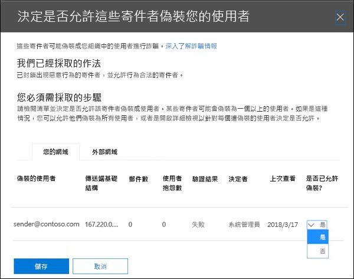
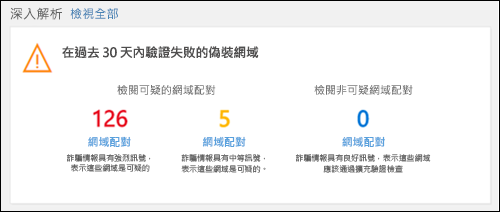
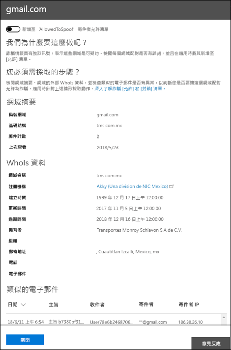

# <a name="manage-spoofed-senders-using-the-spoof-intelligence-policy-and-spoof-intelligence-insight-in-eop"></a><span data-ttu-id="eaf65-103">使用哄騙智慧原則和 EOP 中的欺騙智慧洞察力來管理冒牌寄件者</span><span class="sxs-lookup"><span data-stu-id="eaf65-103">Manage spoofed senders using the spoof intelligence policy and spoof intelligence insight in EOP</span></span>

[!INCLUDE [Microsoft 365 Defender rebranding](../includes/microsoft-defender-for-office.md)]

<span data-ttu-id="eaf65-104">**適用於**</span><span class="sxs-lookup"><span data-stu-id="eaf65-104">**Applies to**</span></span>
- [<span data-ttu-id="eaf65-105">適用於 Office 365 的 Microsoft Defender 方案 1 和方案 2</span><span class="sxs-lookup"><span data-stu-id="eaf65-105">Microsoft Defender for Office 365 plan 1 and plan 2</span></span>](defender-for-office-365.md)
- [<span data-ttu-id="eaf65-106">Microsoft 365 Defender</span><span class="sxs-lookup"><span data-stu-id="eaf65-106">Microsoft 365 Defender</span></span>](../defender/microsoft-365-defender.md)

> [!NOTE]
> <span data-ttu-id="eaf65-107">本文說明所取代的老式欺騙寄件者管理體驗。</span><span class="sxs-lookup"><span data-stu-id="eaf65-107">This article describes the older spoofed sender management experience that's being replaced.</span></span> <span data-ttu-id="eaf65-108">如需更多有關全新體驗的資訊，請參閱 [EOP 中的欺騙智慧洞察力](learn-about-spoof-intelligence.md)</span><span class="sxs-lookup"><span data-stu-id="eaf65-108">For more information about the new experience, see [Spoof intelligence insight in EOP](learn-about-spoof-intelligence.md)</span></span>

<span data-ttu-id="eaf65-109">在 Microsoft 365 具有 Exchange Online 或獨立 Exchange Online Protection 中信箱的組織 (EOP) 組織沒有 Exchange Online 信箱，輸入的電子郵件會在2018年10月時自動受到 EOP 的欺騙。</span><span class="sxs-lookup"><span data-stu-id="eaf65-109">In Microsoft 365 organizations with mailboxes in Exchange Online or standalone Exchange Online Protection (EOP) organizations without Exchange Online mailboxes, inbound email messages are automatically protected against spoofing by EOP as of October 2018.</span></span> <span data-ttu-id="eaf65-110">EOP 會使用 **哄騙情報** 做為組織對網路釣魚的整體防護的一部分。</span><span class="sxs-lookup"><span data-stu-id="eaf65-110">EOP uses **spoof intelligence** as part of your organization's overall defense against phishing.</span></span> <span data-ttu-id="eaf65-111">如需詳細資訊，請參閱 [EOP 中的反欺詐防護](anti-spoofing-protection.md)。</span><span class="sxs-lookup"><span data-stu-id="eaf65-111">For more information, see [Anti-spoofing protection in EOP](anti-spoofing-protection.md).</span></span>

<span data-ttu-id="eaf65-112">預設 (且只有) 欺詐 **智慧原則** ，可協助確保合法寄件者所傳送的欺騙電子郵件不會陷入 EOP 垃圾郵件篩選器中，同時也會保護您的使用者免受垃圾郵件或網路釣魚攻擊。</span><span class="sxs-lookup"><span data-stu-id="eaf65-112">The default (and only) **spoof intelligence policy** helps ensure that the spoofed email sent by legitimate senders doesn't get caught up in EOP spam filters while protecting your users from spam or phishing attacks.</span></span> <span data-ttu-id="eaf65-113">您也可以使用「 **欺騙性智慧洞察力** 」，快速判斷哪些外部寄件者可合法傳送您未驗證的電子郵件 (來自未透過 SPF、DKIM 或 DMARC 檢查) 的網域的郵件。</span><span class="sxs-lookup"><span data-stu-id="eaf65-113">You can also use the **Spoof intelligence insight** to quickly determine which external senders are legitimately sending you unauthenticated email (messages from domains that don't pass SPF, DKIM, or DMARC checks).</span></span>

<span data-ttu-id="eaf65-114">您可以在安全性 & 合規性中心或 PowerShell (Exchange Online PowerShell 中管理使用 Microsoft 365 信箱的 Exchange Online 組織的欺騙情報;組織的獨立 EOP PowerShell，不 Exchange Online 信箱) 。</span><span class="sxs-lookup"><span data-stu-id="eaf65-114">You can manage spoof intelligence in the Security & Compliance Center, or in PowerShell (Exchange Online PowerShell for Microsoft 365 organizations with mailboxes in Exchange Online; standalone EOP PowerShell for organizations without Exchange Online mailboxes).</span></span>

## <a name="what-do-you-need-to-know-before-you-begin"></a><span data-ttu-id="eaf65-115">開始之前有哪些須知？</span><span class="sxs-lookup"><span data-stu-id="eaf65-115">What do you need to know before you begin?</span></span>

- <span data-ttu-id="eaf65-116">您要在 <https://protection.office.com/> 開啟安全性與合規性中心。</span><span class="sxs-lookup"><span data-stu-id="eaf65-116">You open the Security & Compliance Center at <https://protection.office.com/>.</span></span>
  - <span data-ttu-id="eaf65-117">若要直接移至欺騙智慧原則的 **反垃圾郵件設定** 頁面，請使用 <https://protection.office.com/antispam> 。</span><span class="sxs-lookup"><span data-stu-id="eaf65-117">To go directly to the **Anti-spam settings** page for the spoof intelligence policy, use <https://protection.office.com/antispam>.</span></span>
  - <span data-ttu-id="eaf65-118">若要直接移至 **安全性儀表板** 頁面以取得欺騙性智慧洞察力，請使用 <https://protection.office.com/searchandinvestigation/dashboard> 。</span><span class="sxs-lookup"><span data-stu-id="eaf65-118">To go directly to the **Security dashboard** page for the spoof intelligence insight, use <https://protection.office.com/searchandinvestigation/dashboard>.</span></span>

- <span data-ttu-id="eaf65-119">若要連線至 Exchange Online PowerShell，請參閱[連線至 Exchange Online PowerShell](/powershell/exchange/connect-to-exchange-online-powershell)。</span><span class="sxs-lookup"><span data-stu-id="eaf65-119">To connect to Exchange Online PowerShell, see [Connect to Exchange Online PowerShell](/powershell/exchange/connect-to-exchange-online-powershell).</span></span> <span data-ttu-id="eaf65-120">若要連接至獨立版 EOP PowerShell，請參閱[連線到 Exchange Online Protection PowerShell](/powershell/exchange/connect-to-exchange-online-protection-powershell)。</span><span class="sxs-lookup"><span data-stu-id="eaf65-120">To connect to standalone EOP PowerShell, see [Connect to Exchange Online Protection PowerShell](/powershell/exchange/connect-to-exchange-online-protection-powershell).</span></span>

- <span data-ttu-id="eaf65-121">您必須已在 **Exchange Online** 中獲派權限，才能執行此文章中的程序：</span><span class="sxs-lookup"><span data-stu-id="eaf65-121">You need to be assigned permissions in **Exchange Online** before you can do the procedures in this article:</span></span>
  - <span data-ttu-id="eaf65-122">若要修改欺騙性智慧原則或啟用或停用欺騙智慧，您必須是「 **組織管理** 」或「 **安全性管理員** 」角色群組的成員。</span><span class="sxs-lookup"><span data-stu-id="eaf65-122">To modify the spoof intelligence policy or enable or disable spoof intelligence, you need to be a member of the **Organization Management** or **Security Administrator** role groups.</span></span>
  - <span data-ttu-id="eaf65-123">若要唯讀的訪問欺騙性智慧原則，您必須是 **全域讀取** 者或 **安全性讀取器** 角色群組的成員。</span><span class="sxs-lookup"><span data-stu-id="eaf65-123">For read-only access to the spoof intelligence policy, you need to be a member of the **Global Reader** or **Security Reader** role groups.</span></span>

  <span data-ttu-id="eaf65-124">如需詳細資訊，請參閱 [Exchange Online 中的權限](/exchange/permissions-exo/permissions-exo)。</span><span class="sxs-lookup"><span data-stu-id="eaf65-124">For more information, see [Permissions in Exchange Online](/exchange/permissions-exo/permissions-exo).</span></span>

  <span data-ttu-id="eaf65-125">**附註**：</span><span class="sxs-lookup"><span data-stu-id="eaf65-125">**Notes**:</span></span>

  - <span data-ttu-id="eaf65-126">在 Microsoft 365 系統管理中心中，將使用者新增至對應的 Azure Active Directory 角色可為使用者提供所需的權限 _和_ Microsoft 365 中其他功能的權限。</span><span class="sxs-lookup"><span data-stu-id="eaf65-126">Adding users to the corresponding Azure Active Directory role in the Microsoft 365 admin center gives users the required permissions _and_ permissions for other features in Microsoft 365.</span></span> <span data-ttu-id="eaf65-127">如需詳細資訊，請參閱[關於系統管理員角色](../../admin/add-users/about-admin-roles.md)。</span><span class="sxs-lookup"><span data-stu-id="eaf65-127">For more information, see [About admin roles](../../admin/add-users/about-admin-roles.md).</span></span>
  - <span data-ttu-id="eaf65-128">[Exchange Online](/Exchange/permissions-exo/permissions-exo#role-groups) 中的 **僅限檢視組織管理** 角色群組也會提供功能的唯讀存取權。</span><span class="sxs-lookup"><span data-stu-id="eaf65-128">The **View-Only Organization Management** role group in [Exchange Online](/Exchange/permissions-exo/permissions-exo#role-groups) also gives read-only access to the feature.</span></span>

- <span data-ttu-id="eaf65-129">欺騙性情報的選項會在 [反網路釣魚原則中的欺騙設定](set-up-anti-phishing-policies.md#spoof-settings)中說明。</span><span class="sxs-lookup"><span data-stu-id="eaf65-129">The options for spoof intelligence are described in [Spoof settings in anti-phishing policies](set-up-anti-phishing-policies.md#spoof-settings).</span></span>

- <span data-ttu-id="eaf65-130">您可以啟用、停用及設定反網路釣魚原則中的欺騙智慧設定。</span><span class="sxs-lookup"><span data-stu-id="eaf65-130">You can enable, disable, and configure the spoof intelligence settings in anti-phishing policies.</span></span> <span data-ttu-id="eaf65-131">如需根據您訂閱的指示，請參閱下列其中一個主題：</span><span class="sxs-lookup"><span data-stu-id="eaf65-131">For instructions based on your subscription, see one of the following topics:</span></span>

  - <span data-ttu-id="eaf65-132">[在 EOP 中設定反網路釣魚原則](configure-anti-phishing-policies-eop.md)。</span><span class="sxs-lookup"><span data-stu-id="eaf65-132">[Configure anti-phishing policies in EOP](configure-anti-phishing-policies-eop.md).</span></span>
  - <span data-ttu-id="eaf65-133">[設定 Microsoft Defender 中 Office 365 的反網路釣魚原則](configure-mdo-anti-phishing-policies.md)。</span><span class="sxs-lookup"><span data-stu-id="eaf65-133">[Configure anti-phishing policies in Microsoft Defender for Office 365](configure-mdo-anti-phishing-policies.md).</span></span>

- <span data-ttu-id="eaf65-134">如需適用于哄騙情報的建議設定，請參閱 [EOP 反網路釣魚原則設定](recommended-settings-for-eop-and-office365.md#eop-anti-phishing-policy-settings)。</span><span class="sxs-lookup"><span data-stu-id="eaf65-134">For our recommended settings for spoof intelligence, see [EOP anti-phishing policy settings](recommended-settings-for-eop-and-office365.md#eop-anti-phishing-policy-settings).</span></span>

## <a name="manage-spoofed-senders"></a><span data-ttu-id="eaf65-135">管理欺騙寄件者</span><span class="sxs-lookup"><span data-stu-id="eaf65-135">Manage spoofed senders</span></span>

<span data-ttu-id="eaf65-136">有兩種方式可以允許和封鎖欺騙寄件者：</span><span class="sxs-lookup"><span data-stu-id="eaf65-136">There are two ways to allow and block spoofed senders:</span></span>

- [<span data-ttu-id="eaf65-137">使用哄騙智慧原則</span><span class="sxs-lookup"><span data-stu-id="eaf65-137">Use the spoof intelligence policy</span></span>](#manage-spoofed-senders-in-the-spoof-intelligence-policy)
- [<span data-ttu-id="eaf65-138">使用哄騙情報洞察力</span><span class="sxs-lookup"><span data-stu-id="eaf65-138">Use the spoof intelligence insight</span></span>](#manage-spoofed-senders-in-the-spoof-intelligence-insight)

### <a name="manage-spoofed-senders-in-the-spoof-intelligence-policy"></a><span data-ttu-id="eaf65-139">管理欺騙性智慧原則中的欺騙寄件者</span><span class="sxs-lookup"><span data-stu-id="eaf65-139">Manage spoofed senders in the spoof intelligence policy</span></span>

1. <span data-ttu-id="eaf65-140">在安全性與合規性中心，移至 [威脅管理] \> [原則] \> [反垃圾郵件]。</span><span class="sxs-lookup"><span data-stu-id="eaf65-140">In the Security & Compliance Center, go to **Threat management** \> **Policy** \> **Anti-spam**.</span></span>

2. <span data-ttu-id="eaf65-141">在 [ **反垃圾郵件設定** ] 頁面上，按一下 [ ![ 展開圖示] ](../../media/scc-expand-icon.png) 以展開 [ **欺騙智慧原則**]。</span><span class="sxs-lookup"><span data-stu-id="eaf65-141">On the **Anti-spam settings** page, click  to expand **Spoof intelligence policy**.</span></span>

   

3. <span data-ttu-id="eaf65-143">進行下列其中一項選擇：</span><span class="sxs-lookup"><span data-stu-id="eaf65-143">Make one of the following selections:</span></span>

   - <span data-ttu-id="eaf65-144">**審閱新寄件者**</span><span class="sxs-lookup"><span data-stu-id="eaf65-144">**Review new senders**</span></span>
   - <span data-ttu-id="eaf65-145">**顯示已經過審閱的寄件者**</span><span class="sxs-lookup"><span data-stu-id="eaf65-145">**Show me senders I already reviewed**</span></span>

4. <span data-ttu-id="eaf65-146">在 [ **決定是否允許這些寄件者哄騙您** 顯示的使用者] 浮出項目時，選取下列其中一個索引標籤：</span><span class="sxs-lookup"><span data-stu-id="eaf65-146">In the **Decide if these senders are allowed to spoof your users** flyout that appears, select one of the following tabs:</span></span>

   - <span data-ttu-id="eaf65-147">**您的網域**：寄件者哄騙您內部網域中的使用者。</span><span class="sxs-lookup"><span data-stu-id="eaf65-147">**Your Domains**: Senders spoofing users in your internal domains.</span></span>
   - <span data-ttu-id="eaf65-148">**外部網域**：寄件者哄騙外部網域中的使用者。</span><span class="sxs-lookup"><span data-stu-id="eaf65-148">**External Domains**: Senders spoofing users in external domains.</span></span>

5. <span data-ttu-id="eaf65-149">按一下  [ **允許欺騙？** ] 欄中的展開圖示。</span><span class="sxs-lookup"><span data-stu-id="eaf65-149">Click  in the **Allowed to spoof?** column.</span></span> <span data-ttu-id="eaf65-150">選擇 **[是]** 允許冒牌寄件者，或選擇 [ **否** ] 將郵件標示為欺騙。</span><span class="sxs-lookup"><span data-stu-id="eaf65-150">Choose **Yes** to allow the spoofed sender, or choose **No** to mark the message as spoofed.</span></span> <span data-ttu-id="eaf65-151">此巨集指令是由預設的反網路釣魚原則或自訂的反網路釣魚原則所控制 (預設值會將 **郵件移至 [垃圾郵件] 資料夾**) 。</span><span class="sxs-lookup"><span data-stu-id="eaf65-151">The action is controlled by the default anti-phishing policy or custom anti-phishing policies (the default value is **Move message to Junk Email folder**).</span></span> <span data-ttu-id="eaf65-152">如需詳細資訊，請參閱[防網路釣魚原則中的詐騙](set-up-anti-phishing-policies.md#spoof-settings)。</span><span class="sxs-lookup"><span data-stu-id="eaf65-152">For more information, see [Spoof settings in anti-phishing policies](set-up-anti-phishing-policies.md#spoof-settings).</span></span>

   

   <span data-ttu-id="eaf65-154">下列清單說明您所看到的欄和值：</span><span class="sxs-lookup"><span data-stu-id="eaf65-154">The columns and values that you see are explained in the following list:</span></span>

   - <span data-ttu-id="eaf65-155">**欺騙使用者**：已欺騙的使用者帳戶。</span><span class="sxs-lookup"><span data-stu-id="eaf65-155">**Spoofed user**: The user account that's being spoofed.</span></span> <span data-ttu-id="eaf65-156">這是寄件者位址 (中的郵件寄件者，也稱為 `5322.From` 電子郵件客戶程式中顯示的位址) 。</span><span class="sxs-lookup"><span data-stu-id="eaf65-156">This is the message sender in the From address (also known as the `5322.From` address) that's shown in email clients.</span></span> <span data-ttu-id="eaf65-157">SPF 不會檢查此位址的有效性。</span><span class="sxs-lookup"><span data-stu-id="eaf65-157">The validity of this address is not checked by SPF.</span></span>
     - <span data-ttu-id="eaf65-158">在 [ **您的網域** ] 索引標籤上，此值會包含單一電子郵件地址，或如果來源電子郵件伺服器是哄騙多個使用者帳戶，它會包含 **一個以上** 的使用者帳戶。</span><span class="sxs-lookup"><span data-stu-id="eaf65-158">On the **Your Domains** tab, the value contains a single email address, or if the source email server is spoofing multiple user accounts, it contains **More than one**.</span></span>
     - <span data-ttu-id="eaf65-159">在 [ **外部網域** ] 索引標籤上，此值包含欺騙使用者的網域，而非完整的電子郵件地址。</span><span class="sxs-lookup"><span data-stu-id="eaf65-159">On the **External Domains** tab, the value contains the domain of the spoofed user, not the full email address.</span></span>

   - <span data-ttu-id="eaf65-160">傳送 **基礎結構**：) 來源電子郵件伺服器的 IP 位址的反向 DNS 查閱 (PTR 記錄中找到的網域。</span><span class="sxs-lookup"><span data-stu-id="eaf65-160">**Sending Infrastructure**: The domain found in a reverse DNS lookup (PTR record) of the source email server's IP address.</span></span> <span data-ttu-id="eaf65-161">如果來源 IP 位址沒有 PTR 記錄，則會將傳送基礎結構識別為 \<source IP\> /24 (例如，192.168.100.100/24) 。</span><span class="sxs-lookup"><span data-stu-id="eaf65-161">If the source IP address has no PTR record, then the sending infrastructure is identified as \<source IP\>/24 (for example, 192.168.100.100/24).</span></span>

     <span data-ttu-id="eaf65-162">如需郵件來源和郵件寄件者的詳細資訊，請參閱 [電子郵件標準的概述](how-office-365-validates-the-from-address.md#an-overview-of-email-message-standards)。</span><span class="sxs-lookup"><span data-stu-id="eaf65-162">For more information about message sources and message senders, see [An overview of email message standards](how-office-365-validates-the-from-address.md#an-overview-of-email-message-standards).</span></span>

   - <span data-ttu-id="eaf65-163">**郵件** 數目：在過去30天內，來自組織的傳送基礎結構中包含指定的欺騙寄件者或寄件者的郵件數目。</span><span class="sxs-lookup"><span data-stu-id="eaf65-163">**# of messages**: The number of messages from the sending infrastructure to your organization that contain the specified spoofed sender or senders within the last 30 days.</span></span>

   - <span data-ttu-id="eaf65-164">**使用者抱怨**：過去30天內，使用者對此寄件者所進行的投訴。</span><span class="sxs-lookup"><span data-stu-id="eaf65-164">**# of user complaints**: Complaints filed by your users against this sender within the last 30 days.</span></span> <span data-ttu-id="eaf65-165">抱怨的形式通常為對 Microsoft 的垃圾郵件提交。</span><span class="sxs-lookup"><span data-stu-id="eaf65-165">Complaints are usually in the form of junk submissions to Microsoft.</span></span>

   - <span data-ttu-id="eaf65-166">**驗證結果**：下列其中一個值：</span><span class="sxs-lookup"><span data-stu-id="eaf65-166">**Authentication result**: One of the following values:</span></span>
      - <span data-ttu-id="eaf65-167">**傳遞**：寄件者傳送寄件者電子郵件驗證檢查 (SPF 或 DKIM) 。</span><span class="sxs-lookup"><span data-stu-id="eaf65-167">**Passed**: The sender passed sender email authentication checks (SPF or DKIM).</span></span>
      - <span data-ttu-id="eaf65-168">**失敗**：寄件者失敗 EOP 寄件者驗證檢查。</span><span class="sxs-lookup"><span data-stu-id="eaf65-168">**Failed**: The sender failed EOP sender authentication checks.</span></span>
      - <span data-ttu-id="eaf65-169">**未知**：這些檢查的結果是未知的。</span><span class="sxs-lookup"><span data-stu-id="eaf65-169">**Unknown**: The result of these checks isn't known.</span></span>

   - <span data-ttu-id="eaf65-170">**決策設定依據**：顯示誰決定了傳送基礎結構是否允許哄騙使用者：</span><span class="sxs-lookup"><span data-stu-id="eaf65-170">**Decision set by**: Shows who determined if the sending infrastructure is allowed to spoof the user:</span></span>
       - <span data-ttu-id="eaf65-171">**欺騙性智慧原則** (自動) </span><span class="sxs-lookup"><span data-stu-id="eaf65-171">**Spoof intelligence policy** (automatic)</span></span>
       - <span data-ttu-id="eaf65-172">**Admin** (手動) </span><span class="sxs-lookup"><span data-stu-id="eaf65-172">**Admin** (manual)</span></span>

   - <span data-ttu-id="eaf65-173">**上次看到**：從包含欺騙使用者之傳送基礎結構接收郵件的最後日期。</span><span class="sxs-lookup"><span data-stu-id="eaf65-173">**Last seen**: The last date when a message was received from the sending infrastructure that contains the spoofed user.</span></span>

   - <span data-ttu-id="eaf65-174">是否 **允許哄騙？**：您在這裡看到的值包括：</span><span class="sxs-lookup"><span data-stu-id="eaf65-174">**Allowed to spoof?**: The values that you see here are:</span></span>
     - <span data-ttu-id="eaf65-175">**Yes**：允許虛假使用者和傳送基礎結構組合的郵件，也不會被視為欺騙電子郵件。</span><span class="sxs-lookup"><span data-stu-id="eaf65-175">**Yes**: Messages from the combination of spoofed user and sending infrastructure are allowed and not treated as spoofed email.</span></span>
     - <span data-ttu-id="eaf65-176">**No**：來自欺騙使用者和傳送基礎結構的郵件會標示為欺騙。</span><span class="sxs-lookup"><span data-stu-id="eaf65-176">**No**: Messages from the combination of spoofed user and sending infrastructure are marked as spoofed.</span></span> <span data-ttu-id="eaf65-177">此巨集指令是由預設的反網路釣魚原則或自訂的反網路釣魚原則所控制 (預設值會將 **郵件移至 [垃圾郵件] 資料夾**) 。</span><span class="sxs-lookup"><span data-stu-id="eaf65-177">The action is controlled by the default anti-phishing policy or custom anti-phishing policies (the default value is **Move message to Junk Email folder**).</span></span> <span data-ttu-id="eaf65-178">如需詳細資訊，請參閱下一節。</span><span class="sxs-lookup"><span data-stu-id="eaf65-178">See the next section for more information.</span></span>

     - <span data-ttu-id="eaf65-179">**有些使用者** (**您的網域** ] 索引標籤只) ：傳送基礎結構是哄騙多個使用者，而某些欺騙使用者則是允許的，有些則不是。</span><span class="sxs-lookup"><span data-stu-id="eaf65-179">**Some users** (**Your Domains** tab only): A sending infrastructure is spoofing multiple users, where some spoofed users are allowed and others are not.</span></span> <span data-ttu-id="eaf65-180">使用 [詳細] 索引標籤來查看特定地址。</span><span class="sxs-lookup"><span data-stu-id="eaf65-180">Use the **Detailed** tab to see the specific addresses.</span></span>

6. <span data-ttu-id="eaf65-181">在頁面底部，按一下 [ **儲存**]。</span><span class="sxs-lookup"><span data-stu-id="eaf65-181">At the bottom of the page, click **Save**.</span></span>

#### <a name="use-powershell-to-manage-spoofed-senders"></a><span data-ttu-id="eaf65-182">使用 PowerShell 管理欺騙寄件者</span><span class="sxs-lookup"><span data-stu-id="eaf65-182">Use PowerShell to manage spoofed senders</span></span>

<span data-ttu-id="eaf65-183">若要在哄騙情報中查看允許和封鎖的寄件者，請使用下列語法：</span><span class="sxs-lookup"><span data-stu-id="eaf65-183">To view allowed and blocked senders in spoof intelligence, use the following syntax:</span></span>

```powershell
Get-PhishFilterPolicy [-AllowedToSpoof <Yes | No | Partial>] [-ConfidenceLevel <Low | High>] [-DecisionBy <Admin | SpoofProtection>] [-Detailed] [-SpoofType <Internal | External>]
```

<span data-ttu-id="eaf65-184">此範例會傳回所有允許哄騙您網域中使用者之寄件者的詳細資訊。</span><span class="sxs-lookup"><span data-stu-id="eaf65-184">This example returns detailed information about all senders that are allowed to spoof users in your domains.</span></span>

```powershell
Get-PhishFilterPolicy -AllowedToSpoof Yes -Detailed -SpoofType Internal
```

<span data-ttu-id="eaf65-185">如需詳細的語法及參數資訊，請參閱 [Get-PhishFilterPolicy](/powershell/module/exchange/get-phishfilterpolicy)。</span><span class="sxs-lookup"><span data-stu-id="eaf65-185">For detailed syntax and parameter information, see [Get-PhishFilterPolicy](/powershell/module/exchange/get-phishfilterpolicy).</span></span>

<span data-ttu-id="eaf65-186">若要在欺騙智慧中設定允許和封鎖的寄件者，請遵循下列步驟：</span><span class="sxs-lookup"><span data-stu-id="eaf65-186">To configure allowed and blocked senders in spoof intelligence, follow these steps:</span></span>

1. <span data-ttu-id="eaf65-187">透過執行下列命令，將 **Get-PhishFilterPolicy** Cmdlet 的輸出寫入 CSV 檔案，以捕獲目前偵測到之寄件者的清單：</span><span class="sxs-lookup"><span data-stu-id="eaf65-187">Capture the current list of detected spoofed senders by writing the output of the **Get-PhishFilterPolicy** cmdlet to a CSV file by running the following command:</span></span>

   ```powershell
   Get-PhishFilterPolicy -Detailed | Export-CSV "C:\My Documents\Spoofed Senders.csv"
   ```

2. <span data-ttu-id="eaf65-188">編輯 CSV 檔案，以新增或修改下列值：</span><span class="sxs-lookup"><span data-stu-id="eaf65-188">Edit the CSV file to add or modify the following values:</span></span>
   - <span data-ttu-id="eaf65-189">來源伺服器的 PTR 記錄或 IP/24 位址) 中的 **寄件者** (網域</span><span class="sxs-lookup"><span data-stu-id="eaf65-189">**Sender** (domain in source server's PTR record or IP/24 address)</span></span>
   - <span data-ttu-id="eaf65-190">**SpoofedUser**：下列其中一個值：</span><span class="sxs-lookup"><span data-stu-id="eaf65-190">**SpoofedUser**: One of the following values:</span></span>
     - <span data-ttu-id="eaf65-191">內部使用者的電子郵件地址。</span><span class="sxs-lookup"><span data-stu-id="eaf65-191">The internal user's email address.</span></span>
     - <span data-ttu-id="eaf65-192">外部使用者的電子郵件網域。</span><span class="sxs-lookup"><span data-stu-id="eaf65-192">The external user's email domain.</span></span>
     - <span data-ttu-id="eaf65-193">空白值，表示您想要封鎖或允許來自指定之 **寄件者** 的任何和所有冒牌郵件，而不論欺騙的電子郵件地址。</span><span class="sxs-lookup"><span data-stu-id="eaf65-193">A blank value that indicates you want to block or allow any and all spoofed messages from the specified **Sender**, regardless of the spoofed email address.</span></span>
   - <span data-ttu-id="eaf65-194">**AllowedToSpoof** (是或否) </span><span class="sxs-lookup"><span data-stu-id="eaf65-194">**AllowedToSpoof** (Yes or No)</span></span>
   - <span data-ttu-id="eaf65-195">**SpoofType** (內部或外部) </span><span class="sxs-lookup"><span data-stu-id="eaf65-195">**SpoofType** (Internal or External)</span></span>

   <span data-ttu-id="eaf65-196">透過執行下列命令，儲存檔、讀取檔案，並將內容儲存為名為的變數 `$UpdateSpoofedSenders` ：</span><span class="sxs-lookup"><span data-stu-id="eaf65-196">Save the file, read the file, and store the contents as a variable named `$UpdateSpoofedSenders` by running the following command:</span></span>

   ```powershell
   $UpdateSpoofedSenders = Get-Content -Raw "C:\My Documents\Spoofed Senders.csv"
   ```

3. <span data-ttu-id="eaf65-197">透過 `$UpdateSpoofedSenders` 執行下列命令，使用變數來設定欺騙智慧原則：</span><span class="sxs-lookup"><span data-stu-id="eaf65-197">Use the `$UpdateSpoofedSenders` variable to configure the spoof intelligence policy by running the following command:</span></span>

   ```powershell
   Set-PhishFilterPolicy -Identity Default -SpoofAllowBlockList $UpdateSpoofedSenders
   ```

<span data-ttu-id="eaf65-198">如需詳細的語法及參數資訊，請參閱 [Set-PhishFilterPolicy](/powershell/module/exchange/set-phishfilterpolicy)。</span><span class="sxs-lookup"><span data-stu-id="eaf65-198">For detailed syntax and parameter information, see [Set-PhishFilterPolicy](/powershell/module/exchange/set-phishfilterpolicy).</span></span>

### <a name="manage-spoofed-senders-in-the-spoof-intelligence-insight"></a><span data-ttu-id="eaf65-199">在欺騙智慧洞察力中管理欺騙性寄件者</span><span class="sxs-lookup"><span data-stu-id="eaf65-199">Manage spoofed senders in the spoof intelligence insight</span></span>

1. <span data-ttu-id="eaf65-200">在 [安全性 & 規範中心] 中，移至 [ **威脅管理**] \> **儀表板**。</span><span class="sxs-lookup"><span data-stu-id="eaf65-200">In the Security & Compliance Center, go to **Threat Management** \> **Dashboard**.</span></span>

2. <span data-ttu-id="eaf65-201">在 [ **Insights** ] 列中，尋找下列其中一個專案：</span><span class="sxs-lookup"><span data-stu-id="eaf65-201">In the **Insights** row, look for one of the following items:</span></span>

   - <span data-ttu-id="eaf65-202">**過去七天內可能會出現的欺騙網域**：此認知表示已啟用欺騙情報 (預設會啟用該功能) 。</span><span class="sxs-lookup"><span data-stu-id="eaf65-202">**Likely spoofed domains over the past seven days**: This insight indicates that spoof intelligence is enabled (it's enabled by default).</span></span>
   - <span data-ttu-id="eaf65-203">**啟用欺騙保護**：此真知灼見表示已停用欺騙智慧，按一下洞察力可讓您啟用欺騙智慧。</span><span class="sxs-lookup"><span data-stu-id="eaf65-203">**Enable Spoof Protection**: This insight indicates that spoof intelligence is disabled, and clicking on the insight allows you to enable spoof intelligence.</span></span>

3. <span data-ttu-id="eaf65-204">儀表板上的洞察力顯示如下資訊：</span><span class="sxs-lookup"><span data-stu-id="eaf65-204">The insight on the dashboard shows you information like this:</span></span>

   

   <span data-ttu-id="eaf65-206">這兩種洞察力分為兩種模式：</span><span class="sxs-lookup"><span data-stu-id="eaf65-206">This insight has two modes:</span></span>

   - <span data-ttu-id="eaf65-207">**深入瞭解模式**：如果已啟用欺騙智慧，則洞察力會顯示過去7天的欺騙智慧功能會影響的郵件數目。</span><span class="sxs-lookup"><span data-stu-id="eaf65-207">**Insight mode**: If spoof intelligence is enabled, the insight shows you how many messages were impacted by our spoof intelligence capabilities over the past seven days.</span></span>
   - <span data-ttu-id="eaf65-208">**假設模式**：如果已停用欺騙智慧，則洞察力會顯示過去7天的欺騙智慧功能 *會* 影響的郵件數目。</span><span class="sxs-lookup"><span data-stu-id="eaf65-208">**What if mode**: If spoof intelligence is disabled, then the insight shows you how many messages *would* have been impacted by our spoof intelligence capabilities over the past seven days.</span></span>

   <span data-ttu-id="eaf65-209">無論是哪種方式，顯示在真知灼見中的欺騙性網域都會分為兩類： **可疑的網域** 和 **非可疑的網域**。</span><span class="sxs-lookup"><span data-stu-id="eaf65-209">Either way, the spoofed domains displayed in the insight are separated into two categories: **Suspicious domains** and **Non-suspicious domains**.</span></span>

   - <span data-ttu-id="eaf65-210">**可疑網域**：</span><span class="sxs-lookup"><span data-stu-id="eaf65-210">**Suspicious domains**:</span></span>
     - <span data-ttu-id="eaf65-211">**高度信賴性哄騙**：根據電子郵件傳送模式和網域的信譽分數，我們強烈相信網域是哄騙的，而來自這些網域的郵件更可能是惡意的。</span><span class="sxs-lookup"><span data-stu-id="eaf65-211">**High-confidence spoof**: Based on the historical sending patterns and the reputation score of the domains, we're highly confident that the domains are spoofing, and messages from these domains are more likely to be malicious.</span></span>
     - <span data-ttu-id="eaf65-212">**適中** 的信譽哄騙：根據歷史傳送模式和網域的信譽分數，我們適度相信網域是哄騙的，而從這些網域傳送的郵件是合法的。</span><span class="sxs-lookup"><span data-stu-id="eaf65-212">**Moderate confidence spoof**: Based on historical sending patterns and the reputation score of the domains, we're moderately confident that the domains are spoofing, and that messages sent from these domains are legitimate.</span></span> <span data-ttu-id="eaf65-213">在此類別中，誤報很可能超出高可信度的欺騙。</span><span class="sxs-lookup"><span data-stu-id="eaf65-213">False positives are more likely in this category than high-confidence spoof.</span></span>
   - <span data-ttu-id="eaf65-214">**非可疑網域**：網域失敗明確的電子郵件驗證檢查 [SPF](how-office-365-uses-spf-to-prevent-spoofing.md)、 [DKIM](use-dkim-to-validate-outbound-email.md)及 [DMARC](use-dmarc-to-validate-email.md)) 。</span><span class="sxs-lookup"><span data-stu-id="eaf65-214">**Non-suspicious domains**: The domain failed explicit email authentication checks [SPF](how-office-365-uses-spf-to-prevent-spoofing.md), [DKIM](use-dkim-to-validate-outbound-email.md), and [DMARC](use-dmarc-to-validate-email.md)).</span></span> <span data-ttu-id="eaf65-215">不過，網域已通過我們的隱含電子郵件驗證檢查 ([複合驗證](email-validation-and-authentication.md#composite-authentication)) 。</span><span class="sxs-lookup"><span data-stu-id="eaf65-215">However, the domain passed our implicit email authentication checks ([composite authentication](email-validation-and-authentication.md#composite-authentication)).</span></span> <span data-ttu-id="eaf65-216">因此，不會對郵件採取任何反欺詐動作。</span><span class="sxs-lookup"><span data-stu-id="eaf65-216">As a result, no anti-spoofing action was taken on the message.</span></span>

#### <a name="view-detailed-information-about-suspicious-and-nonsuspicious-domains"></a><span data-ttu-id="eaf65-217">查看可疑和 nonsuspicious 網域的詳細資訊</span><span class="sxs-lookup"><span data-stu-id="eaf65-217">View detailed information about suspicious and nonsuspicious domains</span></span>

1. <span data-ttu-id="eaf65-218">在 [偽造智慧洞察力] 中，按一下 [ **可疑的網域** 或 **非可疑的網域** ]，以移至 [ **偽造智慧洞察力** ] 頁面。</span><span class="sxs-lookup"><span data-stu-id="eaf65-218">On the Spoof intelligence insight, click **Suspicious domains** or **Non-suspicious domains** to go to the **Spoof intelligence insight** page.</span></span> <span data-ttu-id="eaf65-219">「 **欺騙性智慧洞察力** 」頁面包含下列資訊：</span><span class="sxs-lookup"><span data-stu-id="eaf65-219">The **Spoof Intelligence insight** page contains the following information:</span></span>

   - <span data-ttu-id="eaf65-220">**冒牌網域**：電子郵件客戶程式的 [ **寄件者** ] 方塊中顯示的欺騙使用者網域。</span><span class="sxs-lookup"><span data-stu-id="eaf65-220">**Spoofed domain**: The domain of the spoofed user that's displayed in the **From** box in email clients.</span></span> <span data-ttu-id="eaf65-221">此位址也稱為 `5322.From` 位址。</span><span class="sxs-lookup"><span data-stu-id="eaf65-221">This address is also known as the `5322.From` address.</span></span>
   - <span data-ttu-id="eaf65-222">**基礎結構**：也稱為傳送 _基礎結構_。</span><span class="sxs-lookup"><span data-stu-id="eaf65-222">**Infrastructure**: Also known as the _sending infrastructure_.</span></span> <span data-ttu-id="eaf65-223">) 來源電子郵件伺服器的 IP 位址的反向 DNS 查閱 (PTR 記錄中找到的網域。</span><span class="sxs-lookup"><span data-stu-id="eaf65-223">The domain found in a reverse DNS lookup (PTR record) of the source email server's IP address.</span></span> <span data-ttu-id="eaf65-224">如果來源 IP 位址沒有 PTR 記錄，則會將傳送基礎結構識別為 \<source IP\> /24 (例如，192.168.100.100/24) 。</span><span class="sxs-lookup"><span data-stu-id="eaf65-224">If the source IP address has no PTR record, then the sending infrastructure is identified as \<source IP\>/24 (for example, 192.168.100.100/24).</span></span>
   - <span data-ttu-id="eaf65-225">**郵件數目**：傳送基礎結構至您的組織中，在過去7天內包含指定的冒牌網域的郵件數目。</span><span class="sxs-lookup"><span data-stu-id="eaf65-225">**Message count**: The number of messages from the sending infrastructure to your organization that contain the specified spoofed domain within the last 7 days.</span></span>
   - <span data-ttu-id="eaf65-226">**上次看到**：從包含欺騙網域之傳送基礎結構接收郵件的最後日期。</span><span class="sxs-lookup"><span data-stu-id="eaf65-226">**Last seen**: The last date when a message was received from the sending infrastructure that contains the spoofed domain.</span></span>
   - <span data-ttu-id="eaf65-227">**哄騙類型**：此值為 **External**。</span><span class="sxs-lookup"><span data-stu-id="eaf65-227">**Spoof type**: This value is **External**.</span></span>
   - <span data-ttu-id="eaf65-228">是否 **允許哄騙？**：您在這裡看到的值包括：</span><span class="sxs-lookup"><span data-stu-id="eaf65-228">**Allowed to spoof?**: The values that you see here are:</span></span>
     - <span data-ttu-id="eaf65-229">**Yes**：來自欺騙使用者網域和傳送基礎結構的電子郵件會被允許，未被視為欺騙電子郵件。</span><span class="sxs-lookup"><span data-stu-id="eaf65-229">**Yes**: Messages from the combination of spoofed user's domain and sending infrastructure are allowed and not treated as spoofed email.</span></span>
     - <span data-ttu-id="eaf65-230">**No**：來自欺騙使用者網域及傳送基礎結構的郵件會標示為欺騙。</span><span class="sxs-lookup"><span data-stu-id="eaf65-230">**No**: Messages from the combination of spoofed user's domain and sending infrastructure are marked as spoofed.</span></span> <span data-ttu-id="eaf65-231">此巨集指令是由預設的反網路釣魚原則或自訂的反網路釣魚原則所控制 (預設值會將 **郵件移至 [垃圾郵件] 資料夾**) 。</span><span class="sxs-lookup"><span data-stu-id="eaf65-231">The action is controlled by the default anti-phishing policy or custom anti-phishing policies (the default value is **Move message to Junk Email folder**).</span></span>

2. <span data-ttu-id="eaf65-232">選取清單中的專案，以查看快顯視窗中網域/傳送基礎結構對的詳細資料。</span><span class="sxs-lookup"><span data-stu-id="eaf65-232">Select an item in the list to view details about the domain/sending infrastructure pair in a flyout.</span></span> <span data-ttu-id="eaf65-233">此資訊包含：</span><span class="sxs-lookup"><span data-stu-id="eaf65-233">The information includes:</span></span>
   - <span data-ttu-id="eaf65-234">我們為何會發現這種情況。</span><span class="sxs-lookup"><span data-stu-id="eaf65-234">Why we caught this.</span></span>
   - <span data-ttu-id="eaf65-235">您需要執行的工作。</span><span class="sxs-lookup"><span data-stu-id="eaf65-235">What you need to do.</span></span>
   - <span data-ttu-id="eaf65-236">網域摘要。</span><span class="sxs-lookup"><span data-stu-id="eaf65-236">A domain summary.</span></span>
   - <span data-ttu-id="eaf65-237">WhoIs 寄件者的相關資料。</span><span class="sxs-lookup"><span data-stu-id="eaf65-237">WhoIs data about the sender.</span></span>
   - <span data-ttu-id="eaf65-238">來自相同寄件者的您租使用者中所看到的類似訊息。</span><span class="sxs-lookup"><span data-stu-id="eaf65-238">Similar messages we have seen in your tenant from the same sender.</span></span>

   <span data-ttu-id="eaf65-239">在這裡，您也可以選擇從 **允許欺騙** 寄件者允許清單中，新增或移除網域/傳送基礎結構對。</span><span class="sxs-lookup"><span data-stu-id="eaf65-239">From here, you can also choose to add or remove the domain/sending infrastructure pair from the **Allowed to spoof** sender allow list.</span></span> <span data-ttu-id="eaf65-240">只會據此設定切換。</span><span class="sxs-lookup"><span data-stu-id="eaf65-240">Simply set the toggle accordingly.</span></span>

   

## <a name="how-do-you-know-these-procedures-worked"></a><span data-ttu-id="eaf65-242">如何知道這些程序是否正常運作？</span><span class="sxs-lookup"><span data-stu-id="eaf65-242">How do you know these procedures worked?</span></span>

<span data-ttu-id="eaf65-243">若要確認您是否已設定欺騙性智慧與允許和不允許哄騙的寄件者，請使用下列任何一項步驟：</span><span class="sxs-lookup"><span data-stu-id="eaf65-243">To verify that you've configured spoof intelligence with senders who are allowed and not allowed to spoof, use any of the following steps:</span></span>

- <span data-ttu-id="eaf65-244">在安全性 & 規範中心內，移至 **威脅管理** \> **原則** \> **反垃圾郵件** \> 展開 **欺騙性智慧原則** \> 選取 [ **顯示我已複查的寄件者** \> ] 選取 [ **您的網域** ] 或 [ **外部網域** ] 索引標籤，然後確認寄件者的 [ **允許欺騙？** ] 值。</span><span class="sxs-lookup"><span data-stu-id="eaf65-244">In the Security & Compliance Center, go to **Threat management** \> **Policy** \> **Anti-spam** \> expand **Spoof intelligence policy** \> select **Show me senders I already reviewed** \> select the **Your Domains** or **External Domains** tab, and verify the **Allowed to spoof?** value for the sender.</span></span>

- <span data-ttu-id="eaf65-245">在 PowerShell 中，執行下列命令，以查看允許和不允許哄騙的寄件者：</span><span class="sxs-lookup"><span data-stu-id="eaf65-245">In PowerShell, run the following commands to view the senders who are allowed and not allowed to spoof:</span></span>

  ```powershell
  Get-PhishFilterPolicy -AllowedToSpoof Yes -SpoofType Internal
  Get-PhishFilterPolicy -AllowedToSpoof No -SpoofType Internal
  Get-PhishFilterPolicy -AllowedToSpoof Yes -SpoofType External
  Get-PhishFilterPolicy -AllowedToSpoof No -SpoofType External
  ```

- <span data-ttu-id="eaf65-246">在 PowerShell 中，執行下列命令，將所有冒牌寄件者的清單匯出至 CSV 檔案：</span><span class="sxs-lookup"><span data-stu-id="eaf65-246">In PowerShell, run the following command to export the list of all spoofed senders to a CSV file:</span></span>

   ```powershell
   Get-PhishFilterPolicy -Detailed | Export-CSV "C:\My Documents\Spoofed Senders.csv"
   ```
