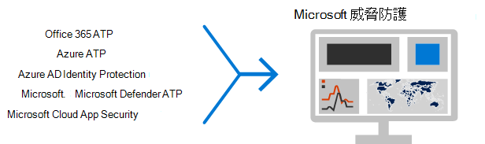

# 最常見的12個任務，可供安全性小組用來支援在家運作Top 12 tasks for security teams to support working from home

如果您喜歡[Microsoft](https://www.microsoft.com/microsoft-365/blog/2020/03/10/staying-productive-while-working-remotely-with-microsoft-teams/) ，並突然找到您一開始支援主要的工作力員工，我們需要協助您確保您的組織盡可能安全地運作。If you are like [Microsoft](https://www.microsoft.com/microsoft-365/blog/2020/03/10/staying-productive-while-working-remotely-with-microsoft-teams/) and suddenly find yourself supporting a primarily home-based workforce, we want to help you ensure your organization is working as securely as possible. 這篇文章會將工作加以劃分，以協助安全小組盡可能快地執行最重要的安全性功能。This article prioritizes tasks to help security teams implement the most important security capabilities as quickly as possible. 

如果您是使用 Microsoft 商務版方案中的小型組織或大中型組織，請參閱下列資源：If you are a small or medium-size organization using one of Microsoft's business plans, see these resources instead:
- [保護 Office 365 和 Microsoft 365 for business 方案的前10種方式Top 10 ways to secure Office 365 and Microsoft 365 for business plans](../admin/security-and-compliance/secure-your-business-data.md) 
- [市場活動的 Microsoft 365](https://docs.microsoft.com/microsoft-365/campaigns/?view=o365-worldwide) （包括 Microsoft 365 Business 的建議安全性設定）[Microsoft 365 for Campaigns](https://docs.microsoft.com/microsoft-365/campaigns/?view=o365-worldwide) (includes a recommended security configuration for Microsoft 365 Business)

  
針對使用我們企業方案的客戶，Microsoft 建議您完成下表中所列的工作，以套用至您的服務方案。For customers using our enterprise plans, Microsoft recommends you complete the tasks listed in the following table that apply to your service plan. 如果您要將訂閱組合在一起，而不是購買 Microsoft 365 企業版計畫，請注意下列事項：If, instead of purchasing a Microsoft 365 enterprise plan, you are combining subscriptions, note the following:
- Microsoft 365 E3 包含 Enterprise 可移動性 + Security （EMS） E3 和 Azure AD P1Microsoft 365 E3 includes Enterprise Mobility + Security (EMS) E3 and Azure AD P1
- Microsoft 365 E5 包含 EMS E5 和 Azure AD P2Microsoft 365 E5 includes EMS E5 and Azure AD P2
  
||**工作****Task**| 所有 Office 365 企業版方案All Office 365 Enterprise plans|**Microsoft 365 E3****Microsoft 365 E3** |**Microsoft 365 E5****Microsoft 365 E5**|
|:-----|:-----|:-----|:-----|:-----|
|1 1      |[啟用 Azure Multi-Factor 驗證（MFA）Enable Azure Multi-Factor Authentication (MFA)](#1-enable-azure-multi-factor-authentication-mfa)   |     |   |       | 
|第2     | [防範威脅Protect against threats](#2-protect-against-threats) | |         |        | 
|3 3      |  [設定 Office 365 的高級威脅防護Configure Office 365 Advanced Threat Protection](#3-configure-office-365-advanced-threat-protection)  |   |      |       | 
|4 4      | [設定 Azure 高級威脅防護（ATP）Configure Azure Advanced Threat Protection (ATP)](#4-configure-azure-advanced-threat-protection)   |   |      |       | 
|5 5     |   [開啟 Microsoft 高級威脅防護Turn on Microsoft Advanced Threat Protection](#5-turn-on-microsoft-advanced-threat-protection)  |  |      |       | 
|6 6      | [設定電話和平板電腦的 Intune 行動裝置應用程式保護Configure Intune mobile app protection for phones and tablets](#6-configure-intune-mobile-app-protection-for-phones-and-tablets) |    |         |         | 
|7 7     | [設定來賓的 MFA 和條件式存取（包括 Intune 應用程式保護）Configure MFA and conditional access for guests, including Intune app protection](#7-configure-mfa-and-conditional-access-for-guests-including-intune-mobile-app-protection)  |    |       |       | 
|8 8      |  [將電腦登記到裝置管理並要求相容的電腦Enroll PCs into device management and require compliant PCs](#8-enroll-pcs-into-device-management-and-require-compliant-pcs)   |  |         |         | 
|9 9      | [針對 cloud connectivity 優化網路Optimize your network for cloud connectivity](#9-optimize-your-network-for-cloud-connectivity)  |   |      |        | 
|10 10   | [訓練使用者Train users](#10-train-users) |     |      |      | 
|11 11 |[開始使用 Microsoft Cloud App SecurityGet started with Microsoft Cloud App Security](#11-get-started-with-microsoft-cloud-app-security) |   |   |   |
|12 12 |[監視威脅並採取動作Monitor for threats and take action](#12-monitor-for-threats-and-take-action) |   |  |  |
| | | |

   
開始之前，請先在 Microsoft 365 安全性中心檢查您的[microsoft 365 安全分數](https://docs.microsoft.com/microsoft-365/security/mtp/microsoft-secure-score)。Before you begin, check your [Microsoft 365 Secure Score](https://docs.microsoft.com/microsoft-365/security/mtp/microsoft-secure-score) in the Microsoft 365 security center. 您可以從集中式儀表板，監視及提高 Microsoft 365 身分識別、資料、應用程式、裝置和基礎結構的安全性。From a centralized dashboard, you can monitor and improve the security for your Microsoft 365 identities, data, apps, devices, and infrastructure. 您可以在設定建議的安全性功能、執行安全性相關工作（如查看報告），或使用協力廠商應用程式或軟體來處理建議的情況下，取得點數。You are given points for configuring recommended security features, performing security-related tasks (such as viewing reports), or addressing recommendations with a third-party application or software. 本文中的建議工作將會提升您的分數。The recommended tasks in this article will raise your score.
  

  
## 1：啟用 Azure Multi-Factor 驗證（MFA）1: Enable Azure Multi-Factor Authentication (MFA)
您可以採取哪一項最佳做法，以提升在家運作的員工安全性，以開啟 MFA。The single best thing you can do to improve security for employees working from home is to turn on MFA. 如果您還沒有適當的處理常式，請將此視為緊急試驗，並確定您有支援人員準備好協助員工停滯。If you don't already have processes in place, treat this as an emergency pilot and make sure you have support folks ready to help employees who get stuck. 如您可能無法散佈硬體安全裝置，請使用 Windows Hello 生物識別和 smartphone 驗證應用程式（如 Microsoft 驗證者）。As you probably can't distribute hardware security devices, use Windows Hello biometrics and smartphone authentication apps like Microsoft Authenticator.

一般情況下，Microsoft 建議您在要求 MFA 之前，為使用者提供14天的時間來註冊其裝置以進行 Multi-Factor 驗證。Normally, Microsoft recommends you give users 14 days to register their device for Multi-Factor Authentication before requiring MFA. 不過，如果您的員工突然從家裡運作，請繼續進行，並將 MFA 視為安全性優先順序，並準備好協助需要該員工的使用者。However, if your workforce is suddenly working from home, go ahead and require MFA as a security priority and be prepared to help users who need it. 

套用這些原則只需要數分鐘，但準備好在今後數天內為您的使用者提供支援。Applying these policies will take only a few minutes, but be prepared to support your users over the next several days.  

|方案Plan  |建議Recommendation  |
|---------|---------|
|Microsoft 365 方案（沒有 Azure AD P1 或 P2）Microsoft 365 plans (without Azure AD P1 or P2)     |[啟用 AZURE AD 中的安全性預設值](https://docs.microsoft.com/azure/active-directory/fundamentals/concept-fundamentals-security-defaults)。[Enable Security defaults in Azure AD](https://docs.microsoft.com/azure/active-directory/fundamentals/concept-fundamentals-security-defaults). Azure AD 中的安全性預設值包括針對使用者和系統管理員的 MFA。Security defaults in Azure AD include MFA for users and administrators.   |
|Microsoft 365 E3 （搭配 Azure AD P1）Microsoft 365 E3 (with Azure AD P1)     | 使用[一般條件式存取原則](https://docs.microsoft.com/azure/active-directory/conditional-access/concept-conditional-access-policy-common)來設定下列原則：Use [Common Conditional Access policies](https://docs.microsoft.com/azure/active-directory/conditional-access/concept-conditional-access-policy-common) to configure the following policies:  - [需要對系統管理員進行 MFA](https://docs.microsoft.com/azure/active-directory/conditional-access/howto-conditional-access-policy-admin-mfa)- [Require MFA for administrators](https://docs.microsoft.com/azure/active-directory/conditional-access/howto-conditional-access-policy-admin-mfa)  - [需要對所有使用者進行 MFA](https://docs.microsoft.com/azure/active-directory/conditional-access/howto-conditional-access-policy-all-users-mfa)- [Require MFA for all users](https://docs.microsoft.com/azure/active-directory/conditional-access/howto-conditional-access-policy-all-users-mfa)   - [封鎖舊版驗證](https://docs.microsoft.com/azure/active-directory/conditional-access/howto-conditional-access-policy-block-legacy)- [Block legacy authentication](https://docs.microsoft.com/azure/active-directory/conditional-access/howto-conditional-access-policy-block-legacy)       |
|Microsoft 365 E5 （包含 Azure AD P2）Microsoft 365 E5 (with Azure AD P2)     | 使用 Azure AD 身分識別保護，請先建立下列兩個原則，以執行 Microsoft[建議的條件式存取和相關原則的組合](../enterprise/identity-access-policies.md)：Taking advantage of Azure AD Identity Protection, begin to implement Microsoft's [recommended set of conditional access and related policies](../enterprise/identity-access-policies.md) by creating these two policies:  - [當登入風險為中或高時，需要 MFA](../enterprise/identity-access-policies.md#require-mfa-based-on-sign-in-risk)- [Require MFA when sign-in risk is medium or high](../enterprise/identity-access-policies.md#require-mfa-based-on-sign-in-risk)  - [封鎖不支援新式驗證的用戶端](../enterprise/identity-access-policies.md#block-clients-that-dont-support-modern-authentication)- [Block clients that don't support modern authentication](../enterprise/identity-access-policies.md#block-clients-that-dont-support-modern-authentication) - [高風險使用者必須變更密碼](../enterprise/identity-access-policies.md#high-risk-users-must-change-password)- [High risk users must change password](../enterprise/identity-access-policies.md#high-risk-users-must-change-password)       |
| | |

  
## 2：防禦威脅2: Protect against threats

所有 Microsoft 365 方案包含各種威脅防護功能。All Microsoft 365 plans include a variety of threat protection features. Bumping 這些功能的保護只需要數分鐘的時間。Bumping up protection for these features takes just a few minutes.
- 反惡意程式碼保護Anti-malware protection
- 保護惡意 URLs 和檔案Protection from malicious URLs and files
- 防網路釣魚保護Anti-phishing protection
- 反垃圾郵件保護Anti-spam protection

請參閱[防禦 Office 365 中的威脅](office-365-security/protect-against-threats.md)以取得您可以做為起點的指導方針。See [Protect against threats in Office 365](office-365-security/protect-against-threats.md) for guidance you can use as a starting point.
    

## 3：設定 Office 365 的高級威脅防護3: Configure Office 365 Advanced Threat Protection

Office 365 Advanced 威脅防護（ATP），隨附于 Microsoft 365 E5 和 Office 365 E5，會保護您的組織免受電子郵件訊息、連結（URLs）和共同作業工具所帶來的惡意威脅。Office 365 Advanced Threat Protection (ATP), included with Microsoft 365 E5 and Office 365 E5, safeguards your organization against malicious threats posed by email messages, links (URLs) and collaboration tools. 這可能需要數小時才能完成設定。This can take several hours to configure.

Office 365 ATP：Office 365 ATP:
- 使用可檢查附件和惡意內容連結的智慧系統，即時保護您的組織免受未知電子郵件威脅。Protects your organization from unknown email threats in real-time by using intelligent systems that inspect attachments and links for malicious content. 這些自動化的系統包括強健的引爆平臺、啟發式和機器學習模型。These automated systems include a robust detonation platform, heuristics, and machine learning models. 
- 透過識別及封鎖小組網站和文件庫中的惡意檔案，在使用者共同作業及共用檔案時，保護您的組織。Protects your organization when users collaborate and share files, by identifying and blocking malicious files in team sites and document libraries. 
- 套用機器學習模型和高級模擬偵測演算法，以防止網路釣魚攻擊。Applies machine learning models and advanced impersonation-detection algorithms to avert phishing attacks. 

如需概要，包含計畫的摘要，請參閱[Office 365 Advanced 威脅防護](office-365-security/office-365-atp.md)。For an overview, including a summary of plans, see [Office 365 Advanced Threat Protection](office-365-security/office-365-atp.md).

您的全域系統管理員可以設定下列保護：Your Global Administrator can configure these protections:
- [設定 ATP 安全連結Set up ATP Safe Links](office-365-security/set-up-atp-safe-links-policies.md)
- [設定 ATP 安全附件原則Set up ATP Safe Attachments policies](office-365-security/set-up-atp-safe-attachments-policies.md)
- [設定自訂「不要重寫」URL 清單Set up a custom "do not rewrite" URLs list](office-365-security/set-up-a-custom-do-not-rewrite-urls-list-with-atp.md)
- [設定自訂封鎖 URL 清單Set up a custom blocked URLs list](office-365-security/set-up-a-custom-blocked-urls-list-wtih-atp.md)

您必須與 Exchange Online 系統管理員和 SharePoint Online 系統管理員合作，才能設定下列工作負載的 ATP：You'll need to work with your Exchange Online administrator and SharePoint Online administrator to configure ATP for these workloads:
- [開啟適用於 SharePoint、OneDrive 及 Microsoft Teams 的 ATPTurn on ATP for SharePoint, OneDrive, and Microsoft Teams](office-365-security/turn-on-atp-for-spo-odb-and-teams.md)

## 4：設定 Azure 高級威脅防護4: Configure Azure Advanced Threat Protection

[Azure 高級威脅防護](https://docs.microsoft.com/azure-advanced-threat-protection/what-is-atp)（azure ATP）是雲端式的安全性解決方案，可利用您的內部部署 Active Directory 信號來識別、偵測和調查您組織中的高級威脅、已遭破壞的身分識別和惡意有問必答動作。[Azure Advanced Threat Protection](https://docs.microsoft.com/azure-advanced-threat-protection/what-is-atp) (Azure ATP) is a cloud-based security solution that leverages your on-premises Active Directory signals to identify, detect, and investigate advanced threats, compromised identities, and malicious insider actions directed at your organization. 請將重點放在下一個，因為它會保護您的部署和雲端基礎結構、沒有相依性或必要條件，而且可提供立即的益處。Focus on this next because it protects your on-prem and your cloud infrastructure, has no dependencies or prerequisites, and can provide immediate benefit.

- 請參閱[AZURE ATP 快速入門](https://docs.microsoft.com/azure-advanced-threat-protection/install-atp-step1)以快速取得安裝程式See [Azure ATP Quickstarts](https://docs.microsoft.com/azure-advanced-threat-protection/install-atp-step1) to get setup quickly 
- 觀賞[影片： AZURE ATP 簡介](https://www.youtube.com/watch?reload=9&v=EGY2m8yU_KE)Watch [Video: Introduction to Azure ATP](https://www.youtube.com/watch?reload=9&v=EGY2m8yU_KE)
- 檢查[AZURE ATP 部署的三個階段](https://docs.microsoft.com/azure-advanced-threat-protection/what-is-atp#whats-next)Review the [three phases of Azure ATP deployment](https://docs.microsoft.com/azure-advanced-threat-protection/what-is-atp#whats-next)

## 5：開啟 Microsoft 高級威脅防護5: Turn on Microsoft Advanced Threat Protection

現在，您已設定 Office 365 ATP 和 Azure ATP，您可以在一個儀表板中查看這些功能的合併信號。Now that you have Office 365 ATP and Azure ATP configured, you can view the combined signals from these capabilities in one dashboard. [Microsoft 威脅防護](https://docs.microsoft.com/microsoft-365/security/mtp/microsoft-threat-protection)（MTP）彙集了警示、事件、自動化調查和回應，以及跨工作負載（Azure ATP、OFFICE 365 Atp、MICROSOFT Defender ATP 和 Microsoft Cloud App Security）的高級搜尋，放入單一窗格的[security.microsoft.com](https://security.microsoft.com)。[Microsoft Threat Protection](https://docs.microsoft.com/microsoft-365/security/mtp/microsoft-threat-protection) (MTP) brings together alerts, incidents, automated investigation and response, and advanced hunting across workloads (Azure ATP, Office 365 ATP, Microsoft Defender ATP, and Microsoft Cloud App Security) into a single pane at [security.microsoft.com](https://security.microsoft.com). 
 

  
在您設定一或多個高級威脅防護服務後，開啟 MTP。After you have configured one or more of your advanced threat protection services, turn on MTP. 新功能會持續新增至 MTP;請考慮改為接收預覽功能。New features are added continually to MTP; consider opting in to receive preview features.

- [深入瞭解 MTPLearn more about MTP](https://docs.microsoft.com/microsoft-365/security/mtp/microsoft-threat-protection?view=o365-worldwide)
- [開啟 MTPTurn on MTP](https://docs.microsoft.com/microsoft-365/security/mtp/mtp-enable?view=o365-worldwide)
- [加入宣告預覽功能Opt in for preview features](https://docs.microsoft.com/microsoft-365/security/mtp/preview?view=o365-worldwide)

## 6：設定電話和平板電腦的 Intune 行動裝置應用程式保護6: Configure Intune mobile app protection for phones and tablets

Microsoft Intune 行動應用程式管理（MAM）可讓您在不管理這些裝置的情況下，管理和保護您組織的手機和平板電腦上的資料。Microsoft Intune Mobile Application Management (MAM) allows you to manage and protect your organization's data on phones and tablets without managing these devices. 以下為運作方式：Here's how it works:
- 您可以建立應用程式保護原則（應用程式），以決定裝置上的哪些應用程式受管理，以及允許哪些行為（例如，防止將受管理的應用程式的資料複製到非管理的應用程式）。You create an App Protection Policy (APP) that determines which apps on a device are managed and what behaviors are allowed (such as preventing data from a managed app from being copied to an unmanaged app). 您為每個 platorm （iOS，Android）建立一個原則。You create one policy for each platorm (iOS, Android).
- 建立應用程式保護原則之後，您可以在 Azure AD 中建立條件式存取規則，以要求核准的應用程式和應用程式資料保護，以強制執行這些原則。After creating the app protection policies, you enforce these by creating a conditional access rule in Azure AD to require approved apps and APP data protection.

應用程式保護原則包含許多設定。APP protection policies include many settings. 幸運的是，您不需要深入瞭解每個設定並權衡選項。Fortunately, you don't need to learn about every setting and weigh the options. Microsoft 可讓您輕鬆地透過建議起始點來套用設定的設定。Microsoft makes it easy to apply a configuration of settings by recommending starting points. [使用應用程式保護原則的資料保護架構](https://docs.microsoft.com/mem/intune/apps/app-protection-framework)包含三個您可以選擇的層級。The [Data protection framework using app protection policies](https://docs.microsoft.com/mem/intune/apps/app-protection-framework) includes three levels you can choose from. 

更好的是，Microsoft 會以一組條件式存取和相關原則協調此應用程式保護框架。我們建議所有組織都使用做為開始點。Even better, Microsoft coordinates this app protection framework with a set of conditional access and related policies we recommend all organizations use as a starting point. 如果您已使用本文中的指導方針實施 MFA，您會有這麼的做法！If you've implemented MFA using the guidance in this article, you're half way there!

若要設定行動應用程式保護，請使用[常見身分識別和裝置存取](../enterprise/identity-access-policies.md)原則中的指導方針：To configure mobile app protection, use the guidance in [Common identity and device access policies](../enterprise/identity-access-policies.md):
 1. 使用 [套用[應用程式資料保護](../enterprise/identity-access-policies.md#apply-app-data-protection-policies)原則] 指導方針為 IOS 和 Android 建立原則。Use the [Apply APP data protection policies](../enterprise/identity-access-policies.md#apply-app-data-protection-policies) guidance to create policies for iOS and Android. 建議使用第2級（增強型資料保護）進行基準保護。Level 2 (enhanced data protection) is recommended for baseline protection. 
 2. 建立條件式存取規則，以[要求核准的應用程式和應用程式保護](../enterprise/identity-access-policies.md#require-approved-apps-and-app-protection)。Create a conditional access rule to [Require approved apps and APP protection](../enterprise/identity-access-policies.md#require-approved-apps-and-app-protection). 

## 7：設定來賓的 MFA 和條件式存取（包括 Intune 行動應用程式保護）7: Configure MFA and conditional access for guests, including Intune mobile app protection

接下來，讓我們確定您可以繼續共同作業和使用客人。Next, let's ensure you can continue to collaborate and work with guests. 如果您使用的是 Microsoft 365 E3 計畫，且您為所有使用者都實施了 MFA，您就會設定。If you're using the Microsoft 365 E3 plan and you implemented MFA for all users, you're set. 

如果您使用的是 Microsoft 365 E5 計畫，而且您已利用 Azure 身分識別保護以進行風險型 MFA，您需要進行一些調整（因為 Azure AD 身分識別保護未擴充至來賓）：If you're using the Microsoft 365 E5 plan and you're taking advantage of Azure Identity Protection for risk-based MFA, you need to make a couple of adjustments (because Azure AD Identity protection doesn't extend to guests):
- 建立新的條件式存取規則，以要求對來賓和外部使用者進行 MFA。Create a new conditional access rule to require MFA always for guests and external users.
- 更新以排除來賓和外部使用者為基礎之風險的 MFA 條件式存取規則。Update the risk-based MFA conditional access rule to exclude guests and external users.

使用更新共同原則的指導方針，[允許和保護來賓和外部存取](../enterprise/identity-access-policies-guest-access.md)，以瞭解來賓存取如何與 Azure AD 搭配運作，以及如何更新受影響的原則。Use the guidance in [Updating the common policies to allow and protect guest and external access](../enterprise/identity-access-policies-guest-access.md) to understand how guest access works with Azure AD and to update the affected policies. 

您建立的 Intune 行動裝置應用程式保護原則，以及要求核准的應用程式和應用程式保護的條件式存取規則，都可以套用到來賓帳戶，並協助保護您的組織資料。The Intune mobile app protection policies you created, together with the conditional access rule to require approved apps and APP protection, apply to guests accounts and will help protect your organization data. 

**附注**：如果您已將電腦簽入裝置管理以要求相容的電腦，您也需要從強制執行裝置規範的條件式存取規則中排除來賓帳戶。**Note**: If you've already enrolled PCs into device management to require compliant PCs, you'll also need to exclude guest accounts from the conditional access rule that enforces device compliance. 

## 8：將電腦登記到裝置管理並要求相容的電腦8: Enroll PCs into device management and require compliant PCs

有幾種方法可以註冊工作力的裝置。There are several methods to enroll your workforce's devices. 每個方法都取決於裝置的擁有權 (個人或公司)、裝置類型 (iOS、Windows、Android) 及管理需求 (重設、同質、鎖定)。Each method depends on the device's ownership (personal or corporate), device type (iOS, Windows, Android), and management requirements (resets, affinity, locking). 這可能需要一些時間才能完成排序。請參閱：[在 Microsoft Intune 中註冊裝置](https://docs.microsoft.com/mem/intune/enrollment/)。This can take a bit of time to sort out. See: [Enroll devices in Microsoft Intune](https://docs.microsoft.com/mem/intune/enrollment/). 

最快速的方式是[設定 Windows 10 裝置的自動註冊](https://docs.microsoft.com/mem/intune/enrollment/quickstart-setup-auto-enrollment)。The quickest way to get going is to [Set up automatic enrollment for Windows 10 devices](https://docs.microsoft.com/mem/intune/enrollment/quickstart-setup-auto-enrollment). 

您也可以利用下列教程：You can also take advantage of these tutorials:
- [使用 Autopilot 在 Intune 中註冊 Windows 裝置Use Autopilot to enroll Windows devices in Intune](https://docs.microsoft.com/mem/intune/enrollment/tutorial-use-autopilot-enroll-devices)
- [使用 apple Business Manager （ABM）中的 Apple 公司裝置註冊功能，在 Intune 中登記 iOS/iPadOS 裝置Use Apple's Corporate Device Enrollment features in Apple Business Manager (ABM) to enroll iOS/iPadOS devices in Intune](https://docs.microsoft.com/mem/intune/enrollment/tutorial-use-device-enrollment-program-enroll-ios)

註冊裝置後，請使用一般身分[識別和裝置存取原則](../enterprise/identity-access-policies.md)中的指導方針來建立下列原則：After enrolling devices, use the guidance in [Common identity and device access policies](../enterprise/identity-access-policies.md) to create these policies:
- [定義裝置相容性原則](../enterprise/identity-access-policies.md#define-device-compliance-policies)-Windows 10 的建議設定包括要求病毒防護。[Define device-compliance policies](../enterprise/identity-access-policies.md#define-device-compliance-policies) — The recommended settings for Windows 10 include requiring antivirus protection. 如果您有 Microsoft 365 E5，請使用 Microsoft Defender 高級威脅防護來監視員工裝置的健康情況。If you have Microsoft 365 E5, use Microsoft Defender Advanced Threat Protection to monitor the health of employee devices. 請確定其他作業系統的相容性原則包括防防毒保護和端點保護軟體。Be sure compliance policies for other operating systems include antivirus protection and end-point protection software. 
- [需要相容的電腦](../enterprise/identity-access-policies.md#require-compliant-pcs-but-not-compliant-phones-and-tablets)-這是 Azure AD 中強制執行裝置合規性原則的條件式存取規則。[Require compliant PCs](../enterprise/identity-access-policies.md#require-compliant-pcs-but-not-compliant-phones-and-tablets) — This is the conditional access rule in Azure AD that enforces the device compliance policies.

只有一個組織可以管理裝置，因此請務必從 Azure AD 中的條件式存取規則中排除來賓帳戶。Only one organization can manage a device, so be sure to exclude guest accounts from the conditional access rule in Azure AD. 如果您未從需要裝置規範的原則中排除來賓和外部使用者，這些原則將會封鎖這些使用者。If you don't exclude guest and external users from policies that require device compliance, these policies will block these users. 如需詳細資訊，請參閱[更新共同原則以允許及保護來賓和外部存取](../enterprise/identity-access-policies-guest-access.md)。For more information, see [Updating the common policies to allow and protect guest and external access](../enterprise/identity-access-policies-guest-access.md).

## 9：針對 cloud connectivity 優化您的網路9: Optimize your network for cloud connectivity

如果您要快速讓員工大量員工運作，這種突然的連線模式交換器可能會對公司網路基礎結構產生重大影響。If you are rapidly enabling the bulk of your employees to work from from home, this sudden switch of connectivity patterns can have a significant impact on the corporate network infrastructure. 在採用雲端服務之前，許多網路都已經過縮放及設計。Many networks were scaled and designed before cloud services were adopted. 在許多情況下，網路可容忍遠端工作者，但未設計為同時供所有使用者遠端使用。In many cases, networks are tolerant of remote workers, but were not designed to be used remotely by all users simultaneously.

網路元素（如 VPN 集中式、中央網路出口裝置（例如 proxy 和資料遺失防護裝置）、中央網際網路頻寬、backhaul MPLS 電路、NAT 功能等等，突然因使用它們的整個商務負載而受到大量的壓力影響。Network elements such as VPN concentrators, central network egress equipment (such as proxies and data loss prevention devices), central internet bandwidth, backhaul MPLS circuits, NAT capability and so on are suddenly put under enormous strain due to the load of the entire business using them. 最終結果是不良效能和生產力，以及對在家工作進行調整的使用者不佳的使用者經驗。The end result is poor performance and productivity coupled with a poor user experience for users who are adapting to working from home.

使用者所存取的雲端應用程式會提供傳統中透過公司網路傳送流量的某些保護。Some of the protections that have traditionally been provided by routing traffic back through a corporate network are provided by the cloud apps your users are accessing. 如果您已在本文中達成這項步驟，您已針對 Microsoft 365 服務和資料執行一組複雜的雲端安全性控制。If you've reached this step in this article, you've implemented a set of sophisticated cloud security controls for Microsoft 365 services and data. 使用這些控制措施後，您可以準備將遠端使用者的流量直接路由傳送至 Office 365。With these controls in place, you may be ready to route remote users' traffic directly to Office 365. 如果您仍需要 VPN 連結才能存取其他應用程式，您可以執行分割隧道，以大幅改善效能和使用者體驗。If you still require a VPN link for access to other applications, you can greatly improve your performance and user experience by implementing split tunneling. 當您在 oganization 中達成合約後，就能在一天內由適當的網路小組完成。Once you achieve agreement in your oganization, this can be accomplished within a day by a well-coordinated network team.

如需詳細資訊，請參閱這些檔上的資源：See these resources on Docs for more information:
- [概述：使用 VPN 分割隧道為遠端使用者優化連線能力Overview: Optimize connectivity for remote users using VPN split tunnelling](https://docs.microsoft.com/Office365/Enterprise/office-365-vpn-split-tunnel)
- [實作 Office 365 的 VPN 分割通道Implementing VPN split tunnelling for Office 365](https://docs.microsoft.com/Office365/Enterprise/office-365-vpn-implement-split-tunnel)

本主題最近的博客文章：Recent blog articles on this topic:
- [如何快速優化遠端員工的流量 & 減少基礎結構的負載How to quickly optimize traffic for remote staff & reduce the load on your infrastructure](https://techcommunity.microsoft.com/t5/office-365-blog/how-to-quickly-optimize-office-365-traffic-for-remote-staff-amp/ba-p/1214571#)
- [安全性專業人員的替代方法，可在當今獨特的遠端工作案例中取得新式的安全性控制措施Alternative ways for security professionals and IT to achieve modern security controls in today's unique remote work scenarios](https://www.microsoft.com/security/blog/2020/03/26/alternative-security-professionals-it-achieve-modern-security-controls-todays-unique-remote-work-scenarios/)

## 10：訓練使用者10: Train users

訓練使用者可將您的使用者與安全性作業小組儲存大量的時間和不滿。Training users can save your users and security operations team a lot of time and frustration. 聰明的使用者不太可能開啟附件或按一下可疑電子郵件訊息中的連結，也很可能避免可疑的網站。Savvy users are less likely to open attachments or click links in questionable email messages, and they are more likely to avoid suspicious websites. 

Harvard 甘迺迪 School [Cybersecurity 活動手冊](https://go.microsoft.com/fwlink/?linkid=2015598&amp;clcid=0x409)提供好的指導方針，可為組織內的安全性感知建立強大的文化，包括訓練使用者來識別網路釣魚攻擊。The Harvard Kennedy School [Cybersecurity Campaign Handbook](https://go.microsoft.com/fwlink/?linkid=2015598&amp;clcid=0x409) provides excellent guidance on establishing a strong culture of security awareness within your organization, including training users to identify phishing attacks. 

Microsoft 365 提供下列資源，協助您在組織中告知使用者：Microsoft 365 provides the following resources to help inform users in your organization:

|概念Concept  |資源Resources  |
|---------|---------|
|Microsoft 365Microsoft 365     |[可自訂的教學路徑Customizable learning pathways](https://docs.microsoft.com/office365/customlearning/) 
這些資源可協助您將組織中使用者的訓練放在一起These resources can help you put together training for end users in your organization        |
|Microsoft 365 安全性Microsoft 365 security |[學習模組：使用 Microsoft 365 內建的智慧安全性保護您的組織Learning module: Secure your organization with built-in, intelligent security from Microsoft 365](https://docs.microsoft.com/learn/modules/security-with-microsoft-365) 
此模組可讓您描述 Microsoft 365 安全性功能如何協同運作，並闡明這些安全性功能的優點。This module enables you to describe how Microsoft 365 security features work together and to articulate the benefits of these security features. |
|多重要素驗證Multi-factor authentication     | [雙步驟驗證：其他驗證頁面為何？Two-step verification: What is the additional verification page?](https://docs.microsoft.com/azure/active-directory/user-help/multi-factor-authentication-end-user-first-time) 
本文可協助使用者瞭解哪些多重要素驗證，以及如何在您的組織中使用它。This article helps end users understand what multi-factor authentication is and why it's being used at your organization.    |
| | |

除了這項指導之外，Microsoft 也建議您的使用者採取本文所述的動作：[保護您的帳戶和裝置免受駭客和惡意](https://support.office.com/article/066d6216-a56b-4f90-9af3-b3a1e9a327d6.aspx)代碼的攻擊。In addition to this guidance, Microsoft recommends that your users take the actions described in this article: [Protect your account and devices from hackers and malware](https://support.office.com/article/066d6216-a56b-4f90-9af3-b3a1e9a327d6.aspx). 這些動作包括：These actions include:
  
- 使用強式密碼Using strong passwords
    
- 保護裝置Protecting devices 
    
- 啟用 Windows 10 和 Mac 電腦上的安全性功能（適用于非管理裝置）Enabling security features on Windows 10 and Mac PCs (for unmanaged devices)
    
Microsoft 也建議您採取下列文章中建議的動作來保護其個人電子郵件帳戶：Microsoft also recommends that users protect their personal email accounts by taking the actions recommended in the following articles:
  
- [協助保護您的 Outlook.com 電子郵件帳戶Help protect your Outlook.com email account](https://support.office.com/article/a4f20fc5-4307-4ece-8231-6d4d4bd8a9ba.aspx)
    
- [使用2步驟驗證保護您的 Gmail 帳戶Protect your Gmail account with 2-step verification](https://go.microsoft.com/fwlink/?linkid=2015688&amp;clcid=0x409)

## 11：開始使用 Microsoft Cloud App Security11: Get started with Microsoft Cloud App Security

[Microsoft Cloud App Security](https://docs.microsoft.com/cloud-app-security)提供豐富的知名度、控制資料旅行和完善的分析，以在所有雲端服務之間識別及打擊 cyberthreats。[Microsoft Cloud App Security](https://docs.microsoft.com/cloud-app-security) provides rich visibility, control over data travel, and sophisticated analytics to identify and combat cyberthreats across all your cloud services. 開始使用 Cloud App Security 後，系統會自動啟用反常狀況偵測原則，但雲端 App 安全性會有七天的初始學習週期，但不會引發所有的異常狀況偵測警示。Once you get started with Cloud App Security, anomaly detection policies are automatically enabled, but Cloud App Security has an initial learning period of seven days during which not all anomaly detection alerts are raised.

立即開始使用 Cloud App Security。Get started with Cloud App Security now. 稍後您可以設定更複雜的監控和控制項。Later you can set up more sophisticated monitoring and controls.

- [快速入門：開始使用 Cloud App SecurityQuickstart: Get started with Cloud App Security](https://docs.microsoft.com/cloud-app-security/getting-started-with-cloud-app-security)
- [取得暫態的行為分析和反常狀況偵測Get instantaneous behavioral analytics and anomaly detection](https://docs.microsoft.com/cloud-app-security/anomaly-detection-policy)
- [深入瞭解 Microsoft Cloud App SecurityLearn more about Microsoft Cloud App Security](https://docs.microsoft.com/cloud-app-security/what-is-cloud-app-security)
- [查看新的功能與功能Review new features and capabilities](https://docs.microsoft.com/cloud-app-security/release-notes)
- [請參閱基本設定指示See basic setup instructions](https://docs.microsoft.com/cloud-app-security/general-setup)

## 12：監控威脅並採取動作12: Monitor for threats and take action

Microsoft 365 包含數種監視狀態和採取適當動作的方式。Microsoft 365 includes several ways to monitor status and take appropriate actions. 您最好的起點是 Microsoft 365 的安全性中心（[https://security.microsoft.com](https://security.microsoft.com)），您可以在其中查看組織的[Microsoft 安全分數](https://docs.microsoft.com/microsoft-365/security/mtp/microsoft-secure-score?view=o365-worldwide)，以及需要您注意的任何警示或實體。Your best starting point is the Microsoft 365 security center ([https://security.microsoft.com](https://security.microsoft.com)), where you can view your organization's [Microsoft Secure Score](https://docs.microsoft.com/microsoft-365/security/mtp/microsoft-secure-score?view=o365-worldwide), and any alerts or entities that require your attention.

- [開始使用 Microsoft 365 安全中心Get started with the Microsoft 365 security center](https://docs.microsoft.com/microsoft-365/security/mtp/overview-security-center?view=o365-worldwide)
- [監視及檢視報告Monitor and view reports](https://docs.microsoft.com/microsoft-365/security/mtp/monitoring-and-reporting?view=o365-worldwide)
- [請參閱 Microsoft 365 中的安全性入口網站See the security portals in Microsoft 365](https://docs.microsoft.com/microsoft-365/security/mtp/portals)

## 後續步驟Next steps

恭喜！Congratulations! 您很快就會執行一些最重要的安全性保護，而且您的組織會有更安全的安全性。You have quickly implemented some of the most important security protections and your organization is much more secure. 現在，您已準備好繼續進行威脅防護功能（包括 Microsoft Defender 高級威脅防護）、資料分類及保護功能，以及保護系統管理帳戶。Now you're ready to go even further with threat protection capabilities (including Microsoft Defender Advanced Threat Protection), data classification and protection capabilities, and securing administrative accounts. 如需 Microsoft 365 的更深層安全建議，請參閱[microsoft 365 security For Business 決策者（bdm）](Microsoft-365-security-for-bdm.md)。For a deeper, methodical set of security recommendations for Microsoft 365, see [Microsoft 365 Security for Business Decision Makers (BDMs)](Microsoft-365-security-for-bdm.md). 

另外，請[docs.microsoft.com/security](https://docs.microsoft.com/security)中的 Microsoft 新的安全性中心。Also visit Microsoft's new security center on [docs.microsoft.com/security](https://docs.microsoft.com/security). 
