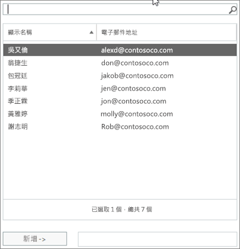

# 允許成員傳送為或代表群組傳送Allow members to send as or send on behalf of a group

已授與「**代理傳送**」或「**代理傳送** 者」許可權的 Microsoft 365 群組成員可以傳送電子郵件給群組，或代表群組傳送電子郵件。A member of a Microsoft 365 group who has been granted **Send as** or **Send on behalf** permissions can send email as the group, or on behalf of the group. 無法將許可權授與群組中的 (訪客。 ) (Guests in the group cannot be granted these permissions.)

本文說明全域管理員或 Exchange 管理員可如何設定這些許可權。This article explains how a global or Exchange administrator can set these permissions.
  
例如，如果 Megan Bowen 是 **訓練** Microsoft 365 群組的一部分，且具有群組的 [以該群組 **傳送**] 許可權，則當她傳送電子郵件做為群組時，它看起來就像是 **訓練** 群組傳送電子郵件。For example, if Megan Bowen is part of the **Training** Microsoft 365 group, and has **Send as** permissions on the group, if she sends an email as the group, it will look like the **Training** group sent the email. 
  
「**代理傳送** 者」許可權可讓使用者代表 Microsoft 365 群組傳送電子郵件。The **Send on Behalf** permission lets a user send email on behalf of a Microsoft 365 group. 例如，如果 Alex Wilber 是「**行銷** Microsoft 365 群組的一部分，且具有「**代理傳送** 者」許可權，並傳送電子郵件做為群組，則電子郵件看起來就像是由 **Alex Wilber 代表 Marketing** 所傳送。For example, if Alex Wilber is a part of the **Marketing** Microsoft 365 group, and has **Send on Behalf** permissions and sends an email as the group, the email looks like it was sent by **Alex Wilber on behalf of Marketing**.

> [!IMPORTANT]
> 您可以為特定使用者設定「 **傳送為** 」或「 **傳送代理** 」，但不能同時為這兩者。You can configure **Send as** or **Send on behalf** for a given user, but not both. 如果您同時設定兩者，則預設會 **傳送為**。If you configure both, it will default to **Send as**.

> [!TIP]
> 請參閱[代表 Microsoft 365 群組傳送電子郵件](https://support.microsoft.com/office/0f4964af-aec6-484b-a65c-0434df8cdb6b)，以瞭解如何使用網頁上的 Outlook 和 Outlook 從群組傳送電子郵件。See [Send email from or on behalf of a Microsoft 365 group](https://support.microsoft.com/office/0f4964af-aec6-484b-a65c-0434df8cdb6b) to learn how to use Outlook and Outlook on the Web to send email from a group.
    
## 允許成員以群組形式傳送電子郵件Allow members to send email as a group

本節說明如何允許使用者以[Exchange 系統管理中心](https://go.microsoft.com/fwlink/p/?linkid=2059104)的群組 (EAC) Exchange Online 中傳送電子郵件。This section explains how to allow users to send email as a group in the [Exchange admin center](https://go.microsoft.com/fwlink/p/?linkid=2059104) (EAC) in Exchange Online.
  
1. 在 <a href="https://go.microsoft.com/fwlink/p/?linkid=2059104" target="_blank">Exchange 系統管理中心</a>，**移至 [** 收件者 \> **群組**]。In the <a href="https://go.microsoft.com/fwlink/p/?linkid=2059104" target="_blank">Exchange admin center</a>, go to **Recipients** \> **Groups**.
    
2. 在  您要允許使用者傳送的群組上，選取 [編輯編輯群組圖示]。  Select **Edit**   on the group that you want to allow users to send as. 
    
3. 選取 [ **群組委派**]。Select **group delegation**.
    
4. 在 [ **傳送方式** ] 區段中，選取要 **+** 新增為群組傳送之使用者的符號。In the **Send As** section, select the **+** sign to add the users that you want to send as the Group. 
    
    ![[傳送為] 對話方塊的螢幕擷取畫面](../media/1df167f6-1eff-4f98-9ecd-4230fab46557.png)
  
5. 若要從清單中搜尋或挑選使用者的類型。Type to search or pick a user from the list. 選取 **[確定]** 並 **儲存**。Select **OK** and **Save**.
    
    
  
## 允許成員代表群組傳送電子郵件Allow members to send email on behalf of a group

本節說明如何允許使用者代表 Exchange 系統管理中心的群組 (EAC) Exchange Online 中的群組傳送電子郵件。This section explains how to allow users to send email on behalf of a group in the Exchange admin center (EAC) in Exchange Online.
  
1. 在 <a href="https://go.microsoft.com/fwlink/p/?linkid=2059104" target="_blank">Exchange 系統管理中心</a>，**移至 [** 收件者 \> **群組**]。In the <a href="https://go.microsoft.com/fwlink/p/?linkid=2059104" target="_blank">Exchange admin center</a>, go to **Recipients** \> **Groups**.
    
2. 在  您要允許使用者傳送的群組上，選取 [編輯編輯群組圖示]。Select **Edit**  on the group that you want to allow users to send as. 
    
3. 選取 [ **群組委派**]。Select **group delegation**.
    
4. 在 [代理傳送者] 區段中，選取要 **+** 新增為群組傳送之使用者的符號。In the Send on Behalf section, select the **+** sign to add the users that you want to send as the Group. 
    
    ![[代理傳送者] 對話方塊的螢幕擷取畫面](../media/2bae0579-8907-4d6b-8920-ddd6555897b4.png)
  
5. 若要從清單中搜尋或挑選使用者的類型。Type to search or pick a user from the list. 選取 **[確定]** 並 **儲存**。Select **OK** and **Save**.
    
    

## 相關文章Related articles

[共同作業管理規劃逐步Collaboration governance planning step-by-step](collaboration-governance-overview.md#collaboration-governance-planning-step-by-step)

[建立共同作業管理計畫Create your collaboration governance plan](collaboration-governance-first.md)

[深入瞭解 Microsoft 365 群組Learn more about Microsoft 365 groups](https://support.microsoft.com/office/b565caa1-5c40-40ef-9915-60fdb2d97fa2)

[Add-RecipientPermissionAdd-RecipientPermission](/powershell/module/exchange/add-recipientpermission)

[Set-UnifiedGroupSet-UnifiedGroup](/powershell/module/exchange/set-unifiedgroup)