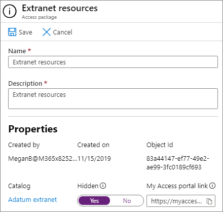

# 使用受管理來賓建立 B2B 外部網路

您可以使用[Azure Active Directory 的權利管理](https://docs.microsoft.com/azure/active-directory/governance/entitlement-management-overview)建立 B2B 外部網路，以與使用 Azure Active Directory 的夥伴組織共同作業。 這可讓使用者在外部網路網站或小組中自我註冊，並透過核准工作流程接收存取權。

透過這種共用資源進行共同作業，合作夥伴組織可以協助使用者在其端維護和核准來賓使用者，減少 IT 部門的負擔，並讓您能夠熟悉共同作業合約，以管理使用者存取。

本文將逐步逐步建立可透過自助存取註冊模型與夥伴組織共用的資源套件（此案例中為網站或小組）。 

開始之前，請先建立您想要與夥伴組織共用的網站或小組，並為其啟用來賓共用。 請參閱[與網站中的客人共同](collaborate-in-site.md)作業，或[與小組的客人共同合作](collaborate-as-team.md)以取得詳細資訊。 我們也建議您複查[建立安全來賓共用環境](create-secure-guest-sharing-environment.md)，以取得安全性與合規性功能的相關資訊，以協助您在與來賓合作時維持您的管理原則。

## 影片示範

這段影片會示範本文所述的程式。

> [!VIDEO https://www.microsoft.com/videoplayer/embed/RE4wKUj?autoplay=false]

## 連接夥伴組織

為了從夥伴組織邀請來賓，您必須將該夥伴的網域新增為 Azure Active Directory 中的連線組織。

新增連線的組織
1. 在 [ [Azure Active Directory](https://aad.portal.azure.com)] 中，按一下 [身分**識別管理**]。
2. 按一下 [**連線的組織**]。
4. 按一下 [**新增連線的組織**]。
5. 輸入組織的名稱和描述，然後按 **[下一步：目錄 + 網域]**。
6. 按一下 [**新增目錄 + 網域**]。
7. 輸入您要連線之組織的網域，然後按一下 [**新增**]。
8. 按一下 **[連線]**，然後按 **[下一步：主辦方**]。
9. 從您的組織或您要連線的組織，新增您要用來核准來賓使用者存取權的組織或組織中的人員。
10. 按 **[下一步：審閱 + 建立**]。
11. 檢查您所選擇的設定，然後按一下 [**建立**]。

    

## 選擇要共用的資源

選取要與夥伴組織共用之資源的第一個步驟是建立包含這些資源的目錄。

建立目錄
1. 在 [ [Azure Active Directory](https://aad.portal.azure.com)] 中，按一下 [身分**識別管理**]。
2. 按一下 [**目錄**]。
3. 按一下 [**新增目錄**]。
4. 輸入目錄的名稱和描述，並確定**外部使用者**的**Enabled**及 enabled 皆已設定為 **[是]**。
5. 按一下 [建立]****。

   

建立目錄之後，您可以新增您要與夥伴組織共用的 SharePoint 網站或團隊。

將資源新增至目錄
1. 在 [Azure AD 身分識別管理] 中，按一下 [**目錄**]，然後按一下您要新增資源的目錄。
2. 按一下 [**資源**]，然後按一下 [**新增資源**]。
3. 選取您要包含在外部網路的小組或 SharePoint 網站，然後按一下 [**新增**]。

   

在您定義要共用的資源之後，下一步是建立訪問套件，該套件會定義授與夥伴使用者的存取類型，以及要求存取之新夥伴使用者的核准程式。

建立 access 套件
1. 在 [Azure AD 身分識別管理] 中，按一下 [**目錄**]，然後按一下您要建立訪問套件的目錄。
2. 按一下 [ **Access 套裝**]，然後按一下 [**新的 access 套件**]。
3. 輸入 access 套件的名稱和描述，然後按一下 **[下一步：資源角色]**。
4. 選擇您要用於外部網路的目錄中的資源。
5. 針對每個資源，在 [**角色**] 欄中，選擇您想要授與使用外部網路之來賓使用者的使用者角色。
6. 按 **[下一步：要求]**。
7. 在 [**可要求存取權的使用者**] 底下，選擇 [**不在您的目錄中的使用者**]。
8. 確定已選取 [**特定連接的組織**] 選項，然後按一下 [**新增目錄**]。
9. 選擇您先前新增的連線組織，然後按一下 [**選取**]
10. 在 [**核准**] 底下，選擇 **[是]** 以 [**要求核准**]。
11. 在 [**第一位核准者**] 底下，選擇您先前新增的其中一個主辦方，或選擇特定使用者。
12. 按一下 [**新增回退**]，然後選取一個回退核准者。
13. 在 [**啟用**] 下，選擇 **[是]**。
14. 按 **[下一步：生命週期]**。
15. 選擇您要使用的 [到期] 和 [存取權複查] 設定，然後按 **[下一步]： [審閱 + 建立]**。
16. 請複查您的設定，然後按一下 [**建立**]。

    

如果您與大型組織合作，您可能想要隱藏存取套件。 如果已隱藏此套件，則夥伴組織中的使用者將不會在其「*我的存取*入口網站」上看到此套件。 相反地，必須傳送直接連結才能註冊套件。 隱藏存取封裝可以減少不適當的存取要求數目，也有助於保留夥伴組織入口網站中可用的訪問套件組織。

若要將訪問套件設定為隱藏
1. 在 [Azure AD 身分識別管理] 中，按一下 [ **access 套裝**]，然後按一下您的 Access 套件。
2. 在 [**概覽**] 頁面上，按一下 [**編輯**]。
3. 在 [**屬性**] 底下，選擇 [**隱藏**]，然後按一下 [**儲存** **]** 。

   

## 邀請夥伴使用者

如果您將訪問套件設定為隱藏，您必須將直接連結傳送至夥伴組織，以便他們可以要求網站或小組的存取權。

尋找存取入口網站連結
1. 在 [Azure AD 身分識別管理] 中，按一下 [ **access 套裝**]，然後按一下您的 Access 套件。
2. 在 [**概述**] 頁面上，按一下 [**我的 Access 入口網站] 連結**的 [**複製到剪貼簿**] 連結。

   

複製連結後，您就可以在夥伴組織中與連絡人共用，也可以將它傳送給其共同作業小組的使用者。

## 另請參閱

[建立安全的來賓共用環境](create-secure-guest-sharing-environment.md)

