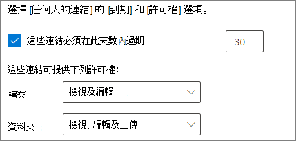

# 與未驗證使用者共用檔案和資料夾的最佳做法Best practices for sharing files and folders with unauthenticated users

未驗證共用 (*任何人* 連結) 在許多案例下都相當方便。Unauthenticated sharing (*Anyone* links) can be convenient and is useful in various scenarios. *任何人* 連結為共用最簡單的方式：人員可以不經驗證就開啟連結，且可隨意將它傳送給其他人。*Anyone* links are the easiest way to share: people can open the link without authentication and are free to pass it on to others.

一般來說，並非組織中的所有內容都適合進行未驗證共用。Usually, not all content in an organization is appropriate for unauthenticated sharing. 本文涵蓋可協助您建立一個環境的選項，您的使用者能夠在該環境中未驗證共用檔案和資料夾，但在其中有一些既有措施可協助保護組織內容的安全。This article covers the options available to help you create an environment where your users can use unauthenticated sharing of files and folders, but where there are safeguards in place to help protect your organization's content.

> [!NOTE]
> 若要讓未驗證共用運作，您必須為組織以及您將使用的個別網站或小組啟用該功能。For unauthenticated sharing to work, you must enable it for your organization and for the individual site or team that you'll be using. 如需您要啟用的案例，請參閱[與組織外部人員共同作業](collaborate-with-people-outside-your-organization.md)。See [Collaborating with people outside your organization](collaborate-with-people-outside-your-organization.md) for the scenario that you want to enable.

## 設定任何人連結的到期日Set an expiration date for Anyone links

檔案通常會長時間儲存在網站、群組和小組。Files are often stored in sites, groups, and teams for long periods of time. 有時候，有一些資料保留原則會要求將檔案保留數年。Occasionally there are data retention policies that require files to be retained for years. 如果將這類檔案與未驗證的人員共用，可能導致未來非預期地存取和變更這些檔案。If such files are shared with unauthenticated people, this could lead to unexpected access and changes to files in the future. 若要降低此可能性，您可以為 *任何人* 連結設定到期時間。To mitigate this possibility, you can configure an expiration time for *Anyone* links.

*任何人* 連結到期後，就無法再用來存取內容。Once an *Anyone* link expires, it can no longer be used to access content.

設定組織中任何人的連結到期日。To set an expiration date for Anyone links across the organization

1. 開啟 [SharePoint 系統管理中心](https://admin.microsoft.com/sharepoint)。Open the [SharePoint admin center](https://admin.microsoft.com/sharepoint).
2. 在左側導覽窗格中，按一下 [共用]。In the left navigation, click **Sharing**.
3. 在 **[為任何人連結選擇過期和授權選項]** 下，選取 **[這些連結必須在此天數內過期]** 核取方塊。Under **Choose expiration and permissions options for Anyone links**, select the **These links must expire within this many days** check box. 
   
4. 在方塊中輸入天數，然後按一下 [儲存]。Type a number of days in the box, and then click **Save**.

在特定網站上，設定任何人連結的到期日To set an expiration date for Anyone links on a specific site

1. 開啟 [SharePoint 系統管理中心](https://admin.microsoft.com/sharepoint)。Open the [SharePoint admin center](https://admin.microsoft.com/sharepoint).
2. 在左側瀏覽窗格中，展開 **[網站]**，然後按一下 **[作用中網站]**。In the left navigation, expand **Sites**, and then click **Active sites**.
3. 選取要變更的網站，然後按一下 **[共用]**。Select the site you want to change, and then click **Sharing**.
4. 在 **[任何人連結的進階設定]** 的 **[任何人連結到期日]** 底下，清除 **[與組織層級相同設定]** 核取方塊。Under **Advanced settings for Anyone links**, under **Expiration of Anyone links**, clear the **Same as organization-level setting** check box. 
   
5. 選取 **[這些連結必須在此天數內過期]** 選項，然後在方塊中輸入天數。Select the **These links must expire within this many days** option, and type a number of days in the box.
6. 按一下 **[儲存]**。Click **Save**.

請注意，*任何人* 連結到期之後，就可以使用新的 *任何人* 連結重新共用檔案或資料夾。Note that once an *Anyone* link expires, the file or folder can be re-shared with a new *Anyone* link.

您可以使用 [Set-SPOSite](/powershell/module/sharepoint-online/set-sposite)，為特定 OneDrive 設定 *任何人* 連結到期日。You can set *Anyone* link expiration for a specific OneDrive by using [Set-SPOSite](/powershell/module/sharepoint-online/set-sposite).

## 設定連結權限Set link permissions

根據預設，檔案的 *任何人* 連結會允許人員編輯檔案，而資料夾的 *任何人* 連結則會允許人員編輯和檢視檔案，以及上傳新檔案到資料夾。By default, *Anyone* links for a file allow people to edit the file, and *Anyone* links for a folder allow people to edit and view files, and upload new files to the folder. 您可以獨立將檔案和資料夾的這些權限變更為僅供檢視。You can change these permissions for files and for folders independently to view-only.

如果您想要允許未驗證共用，但擔心未驗證的人員修改組織的內容，請考慮將檔案和資料夾權限設定為 [檢視]。If you want to allow unauthenticated sharing, but are concerned about unauthenticated people modifying your organization's content, consider setting the file and folder permissions to **View**.

設定組織中任何人連結的權限。To set permissions for Anyone links across the organization

1. 開啟 [SharePoint 系統管理中心](https://admin.microsoft.com/sharepoint)。Open the [SharePoint admin center](https://admin.microsoft.com/sharepoint).
2. 在左側導覽窗格中，按一下 [共用]。In the left navigation, click **Sharing**.
3. 在 [「任何人」連結的進階設定] 底下，選取您要使用的檔案和資料夾權限。Under **Advanced settings for "Anyone" links**, select the file and folder permissions that you want to use. 
   

將 *任何人* 連結設為 [檢視] 時，使用者仍然可以與來賓共用檔案和資料夾，並使用 *特定人員* 連結提供編輯權限。With *Anyone* links set to **View**, users can still share files and folders with guests and give them edit permissions by using *Specific people* links. 這些連結要求組織外的人員驗證為來賓身分，而您可以追蹤和稽核使用這些連結共用的檔案和資料夾上的來賓活動。These links require people outside your organization to authenticate as guests, and you can track and audit guest activity on files and folders shared with these links.

## 將預設連結類型設定為僅適用組織中的人員Set default link type to only work for people in your organization

為組織啟用 *任何人* 共用時，預設的共用連結一般會設定為 **任何人**。When *Anyone* sharing is enabled for your organization, the default sharing link is normally set to **Anyone**. 雖然這對使用者而言很方便，但可能會增加無意間未驗證共用的風險。While this can be convenient for users, it can increase the risk of unintentional unauthenticated sharing. 如果使用者在共用機密文件時忘記變更連結類型，他們可能會意外建立不需要驗證的共用連結。If a user forgets to change the link type while sharing a sensitive document, they might accidentally create a sharing link that doesn't require authentication.

您可以透過將預設連結設定變更為僅適用組織內部人員的連結，來降低此風險。You can mitigate this risk by changing the default link setting to a link that only works for people inside your organization. 這麼一來，想要進行未驗證共用的使用者，必須特別選取該選項。Users who want to share with unauthenticated people would then have to specifically select that option.

為組織設定預設的檔案和資料夾共用連結To set the default file and folder sharing link for the organization
1. 開啟 [SharePoint 系統管理中心](https://admin.microsoft.com/sharepoint)。Open the [SharePoint admin center](https://admin.microsoft.com/sharepoint).
2. 在左側導覽窗格中，按一下 **[共用]**。In the left navigation, click **Sharing**.
3. 在 **[檔案與資料夾連結]** 下，選取 **[只有貴組織中的人員]**。Under **File and folder links**, select **Only people in your organization**.

   

4. 按一下 **[儲存]**Click **Save**

為特定網站設定預設的檔案和資料夾共用連結To set the default file and folder sharing link for a specific site
1. 開啟 [SharePoint 系統管理中心](https://admin.microsoft.com/sharepoint)。Open the [SharePoint admin center](https://admin.microsoft.com/sharepoint).
2. 在左側瀏覽窗格中，展開 **[網站]**，然後按一下 **[作用中網站]**。In the left navigation, expand **Sites**, and then click **Active sites**.
3. 選取要變更的網站，然後按一下 **[共用]**。Select the site you want to change, and then click **Sharing**.
4. 在 **[預設的共用連結類型]** 底下，清除 **[與組織層級設定相同]** 核取方塊。Under **Default sharing link type**,  clear the **Same as organization-level setting** check box.

   

5. 選取 **[只有貴組織的人員]** 選項，然後按一下 **[儲存]**。Select the **Only people in your organization** option and click **Save**.

## 防止未經驗證的敏感性內容共用Prevent unauthenticated sharing of sensitive content

您可以使用 [資料外洩防護 (DLP)](../compliance/data-loss-prevention-policies.md) 以防止未經驗證的敏感性內容共用。You can use [data loss prevention (DLP)](../compliance/data-loss-prevention-policies.md) to prevent unauthenticated sharing of sensitive content. 資料外洩防護可根據檔案的敏感度標籤、保留標籤或檔案本身的敏感性資訊採取行動。Data loss prevention can take action based on a file's sensitivity label, retention label, or sensitive information in the file itself.

建立 DLP 規則To create a DLP rule
1. 在 Microsoft 365 合規性系統管理中心中，移至 [資料外外洩防護頁面](https://compliance.microsoft.com/datalossprevention)。In the Microsoft 365 compliance admin center, go to the [Data loss prevention page](https://compliance.microsoft.com/datalossprevention).
2. 按一下 **[建立原則]**。Click **Create policy**.
3. 選擇 **[自訂]** ，然後按一下 **[下一步]**。Choose **Custom** and click **Next**.
4. 輸入原則的名稱，並按 **[下一步]**。Type a name for the policy and click **Next**.
5. 在 **[套用原則的位置]** 頁面上，關閉 **SharePoint 網站** 和 **OneDrive 帳戶** 以外的所有設定，然後按一下 **[下一步]**。On the **Locations to apply the policy** page turn off all settings except **SharePoint sites** and **OneDrive accounts**, and then click **Next**.
6. 在 **[定義原則設定]** 頁面上，按一下 **[下一步]**。On the **Define policy settings** page, click **Next**.
7. 在 **[自訂進階資料外洩防護規則]** 頁面上，按一下 **[建立規則]**，然後輸入規則的名稱。On the **Customize advanced DLP rules** page, click **Create rule** and type a name for the rule.
8. 在 [條件 **]** 底下，按一下 [新增條件 **]**，並選擇 [內容包含 **]**。Under **Conditions**, click **Add condition**, and choose **Content contains**.
9. 按一下 **[新增]**，然後選擇您想要防止未經授權共用的資訊類型。Click **Add** and choose the type of information for which you want to prevent unauthenticated sharing.

   

10. 在 [動作 **]** 底下，按一下 [新增動作 **]**，然後選擇 [限制存取或加密 Microsoft 365 位置中的內容 **]**。Under **Actions** click **Add an action** and choose **Restrict access or encrypt the content in Microsoft 365 locations**.
11. 選取 **[限制存取權或加密 Microsoft 365 位置中的內容]** 核取方塊，然後選擇 **[僅限透過「具有連結的任何人」 選項獲得存取內容的人員]** 選項。Select the **Restrict access or encrypt the content in Microsoft 365 locations** check box and then choose the **Only people who were given access to the content through the "Anyone withe the link" options** option.

      

12. 按一下 **[儲存]**，然後按 **[下一步]**。Click **Save** and then click **Next**.
13. 選擇您的測試選項，然後按一下 **[下一步]**。Choose your test options and click **Next**.
14. 按一下 [提交 **]**，然後按一下 [完成 **]**。Click **Submit**, and then click **Done**.

## 防範惡意檔案Protect against malicious files

允許匿名使用者上傳檔案時，可能會增加某人上傳惡意檔案的風險。When you allow anonymous users to upload files, you're at an increased risk of someone uploading a malicious file. 在 Microsoft 365 中，您可以使用適用於 Office 365 的 Defender 中的 *安全附件* 功能，自動掃描已上傳的檔案並隔離發現不安全的檔案。In Microsoft 365, you can use the *Safe Attachments* feature in Defender for Office 365 to automatically scan uploaded files and quarantine files that are found to be unsafe.

開啟安全附件To turn on safe attachments
1. 開啟 [安全性與合規性系統管理中心] 的 [[ATP 安全附件] 頁面](https://protection.office.com/safeattachmentv2)。Open the [ATP Safe Attachments page](https://protection.office.com/safeattachmentv2) in the Security and Compliance admin center.
2. 按一下 **[通用設定]**。Click **Global settings**.
3. 開啟適用於 SharePoint、OneDrive 與 Microsoft Teams 的 ATP。Turn on ATP for SharePoint, OneDrive, and Microsoft Teams.

   

4. 或者，也可以開啟 [安全文件]，然後按一下 **[儲存]**Optionally turn on Safe Documents as well, and then click **Save**

請參閱 [適用於 SharePoint、OneDrive 和 Microsoft Teams 的 ATP](../security/office-365-security/mdo-for-spo-odb-and-teams.md) ，並 [開啟適用於 SharePoint、OneDrive 和 Microsoft Teams 的 ATP](../security/office-365-security/turn-on-mdo-for-spo-odb-and-teams.md) 以取得更多指導方針。See [ATP for SharePoint, OneDrive, and Microsoft Teams](../security/office-365-security/mdo-for-spo-odb-and-teams.md) and [Turn on ATP for SharePoint, OneDrive, and Microsoft Teams](../security/office-365-security/turn-on-mdo-for-spo-odb-and-teams.md) for additional guidance.

## 新增著作權資訊至您的檔案Add copyright information to your files

如果您在 Microsoft 365 合規性系統管理中心使用敏感度標籤，即可以設定您的標籤，以自動新增浮水印或頁首或頁尾至組織的 Office 文件中。If you use sensitivity labels in the Microsoft 365 Compliance admin center, you can configure your labels to add a watermark or a header or footer automatically to your organization's Office documents. 這麼一來，您就可以確定共用的檔案包含著作權或其他擁有權資訊。In this way, you can make sure that shared files contain copyright or other ownership information.

新增頁尾至標籤的檔案To add a footer to a labeled file

1. 開啟 [Microsoft 365 合規性系統管理中心](https://compliance.microsoft.com)。Open the [Microsoft 365 compliance admin center](https://compliance.microsoft.com).
2. 在左側導覽窗格中的 **[解決方案]** 底下，按一下 **[資訊保護]**。In the left navigation, under **Solutions**, click **Information protection**.
3. 按一下您要新增頁尾的標籤，然後按一下 **[編輯標籤]**。Click the label that you want to have add a footer, and then click **Edit label**.
4. 按一下 **[下一步]** 以移至 **[內容標示]** 索引標籤，然後 **[開啟]** 內容標示。Click **Next** to reach the **Content marking** tab, and then turn **On** content marking.
5. 選取要新增的文字類型的核取方塊，然後按一下 [自訂文字]。Select the check box for the type of text you want to add, and then click **Customize text**.
6. 輸入要新增至文件的文字，選取需要的文字選項，然後按一下 [儲存]。Type the text that you want added to your documents, select the text options that you want, and then click **Save**. 
   
7. 按一下 **[下一步]** 以移至精靈結尾，然後按一下 **[儲存標籤]**。Click **Next** to reach the end of the wizard, and then click **Save label**.

為標籤啟用內容標示後，當使用者套用該標籤，您指定的文字就會新增至 Office 文件中。With content marking enabled for the label, the text you specified will be added to Office documents when a user applies that label.

## 另請參閱See Also

[敏感度標籤概觀Overview of sensitivity labels](/Office365/SecurityCompliance/sensitivity-labels)

[與來賓共用時限制意外暴露檔案Limit accidental exposure to files when sharing with guests](share-limit-accidental-exposure.md)

[建立安全的來賓共用環境Create a secure guest sharing environment](create-secure-guest-sharing-environment.md)