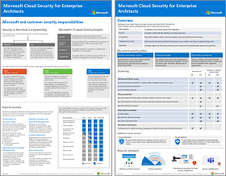

# Microsoft cloud for IT 架構設計人員圖例

這些雲端架構海報提供 Microsoft 雲端服務的相關資訊，包括 Microsoft 365、Azure Active Directory (Azure AD) 、Microsoft Intune、Microsoft Dynamics 365，以及混合式內部部署和雲端解決方案。 

IT 決策者和架構師可以使用這些資源來判斷其工作負載的理想方案，並決定核心基礎結構元件（例如網路、身分識別及安全性）。

### IT 架構師的 Microsoft 雲端身分識別

IT 結構設計師在使用 Microsoft 雲端服務和平台設計組織的身分識別時，需要了解的資訊。
  
|**項目**|**描述**|
|:-----|:-----|
|   [以 PDF 格式查看](../downloads/MSFT_cloud_architecture_identity.pdf) \|[以 PDF 格式下載](https://github.com/MicrosoftDocs/microsoft-365-docs/raw/public/microsoft-365/downloads/MSFT_cloud_architecture_identity.pdf) \|[下載成 Visio](https://github.com/MicrosoftDocs/microsoft-365-docs/raw/public/microsoft-365/downloads/MSFT_cloud_architecture_identity.vsdx)    2020年9月更新 | 此模型包含：  <ul> <li> 使用 Microsoft 雲端識別的簡介 </li><li> Azure AD 的 IDaaS 功能 </li><li> 整合內部部署 Active Directory 網域服務 (AD DS) 使用 Azure AD 的帳戶 </li><li> 在 Azure 中放置目錄元件 IaaS </li><li> Azure 中工作負載的 AD DS 選項 IaaS </li></ul>    |

### IT 架構設計的 Microsoft cloud security

IT 結構設計師在 Microsoft 雲端服務和平台中，需要瞭解哪些安全性資訊。
  
|**項目**|**描述**|
|:-----|:-----|
|.pdf)   [Pdf](https://download.microsoft.com/download/6/D/F/6DFD7614-BBCF-4572-A871-E446B8CF5D79/MSFT_cloud_architecture_security%20(1).pdf)  \|  2021年4月更新 | 此模型包含： <ul><li>Microsoft 和客戶安全性責任</li><li>身分識別與裝置存取</li><li>威脅防護</li><li>資訊保護 </ul> |
   

### IT 架構設計的 Microsoft 雲端網路

IT 結構設計師在使用 Microsoft 雲端服務和平台時，有關網路功能需要瞭解的資訊。
  
|**項目**|**描述**|
|:-----|:-----|
|    [以 PDF 格式查看](../downloads/MSFT_cloud_architecture_networking.pdf) \|[以 PDF 格式下載](https://github.com/MicrosoftDocs/microsoft-365-docs/raw/public/microsoft-365/downloads/MSFT_cloud_architecture_networking.pdf) \|[下載成 Visio](https://github.com/MicrosoftDocs/microsoft-365-docs/raw/public/microsoft-365/downloads/MSFT_cloud_architecture_networking.vsdx)    2020年8月更新 | 此模型包含： <ul><li> 將您的網路提升為雲端連線網路 </li><li> Microsoft 雲端連線的共同項目 </li><li> Microsoft 雲端連線的 ExpressRoute </li><li> 為 Microsoft SaaS、Azure PaaS 和 Azure 設計網路 IaaS </li></ul>    |

### IT 架構設計的 Microsoft 混合式雲端

IT 結構設計師在使用 Microsoft 服務和平台時，有關混合雲端需要瞭解的資訊。
  
|**項目**|**描述**|
|:-----|:-----|
|   [以 PDF 格式查看](../downloads/MSFT_cloud_architecture_hybrid.pdf) \|[以 PDF 格式下載](https://github.com/MicrosoftDocs/microsoft-365-docs/raw/public/microsoft-365/downloads/MSFT_cloud_architecture_hybrid.pdf) \|[下載成 Visio](https://github.com/MicrosoftDocs/microsoft-365-docs/raw/public/microsoft-365/downloads/MSFT_cloud_architecture_hybrid.vsdx)      2020年8月更新 | 此模型包含： <ul><li> Microsoft 的雲端產品 (SaaS、Azure PaaS 和 Azure IaaS) 及其共同元素 </li><li> Microsoft 雲端服務的混合式雲端架構 </li><li> Microsoft SaaS (Office 365)、Azure PaaS 和 Azure IaaS 的混合式雲端案例 </li></ul> |

### Microsoft Cloud 租用戶對租用戶移轉的架構方法 
此系列的主題說明針對合併、併購、分割和其他案例下，可能會導致您移轉到新雲端租用戶的數個架構方法。 下列主題提供企業資源規劃的起始點指導方針。 

|**項目**|**描述**|
|:-----|:-----|
|   [PDF](https://download.microsoft.com/download/b/a/1/ba19dfe7-96e2-4983-8783-4dcff9cebe7b/microsoft-365-tenant-to-tenant-migration.pdf) \| 2021年2月更新    |此模型包含： <ul><li>商務案例與架構方法的對應</li><li>設計考量</li><li>單一事件遷移流程範例</li><li>逐步遷移流程範例</li><li>承租人移動或分割流程範例</li></ul>|

### 常見攻擊和保護您組織的 Microsoft 功能
深入了解最常見的網路攻擊，以及 Microsoft 如何協助您的組織抵禦每個階段的攻擊。 

|**項目**|**描述**|
|:-----|:-----|
|   [PDF](https://download.microsoft.com/download/F/A/C/FACFC1E9-FA35-4DF1-943C-8D4237B4275B/MSFT_Cloud_architecture_security_commonattacks.pdf) \| [Visio](https://download.microsoft.com/download/F/A/C/FACFC1E9-FA35-4DF1-943C-8D4237B4275B/MSFT_Cloud_architecture_security_commonattacks.vsdx)   2017年8月更新 | 此海報說明常見的攻擊路徑，並描述哪些功能有助於在攻擊的每個階段阻止攻擊者。  |

