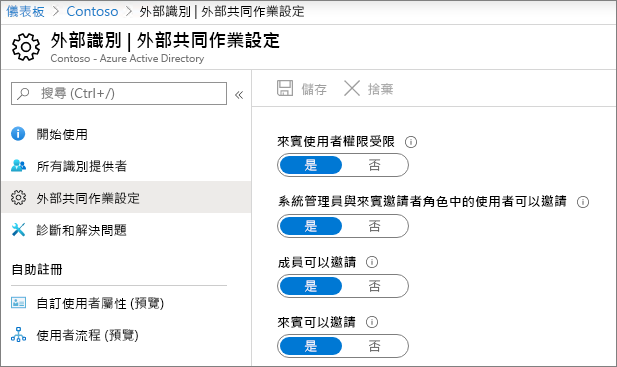
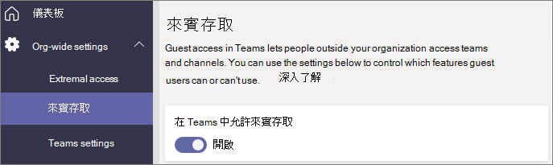
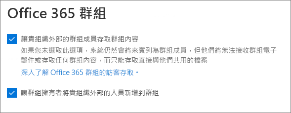
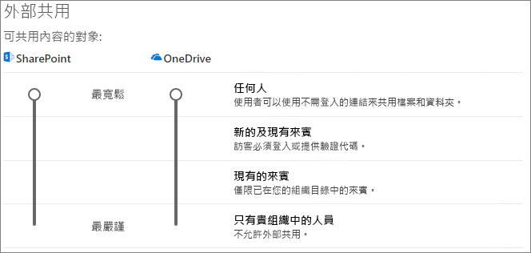
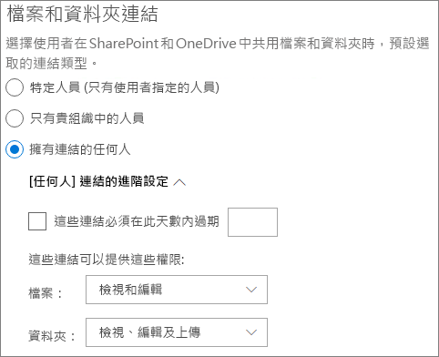
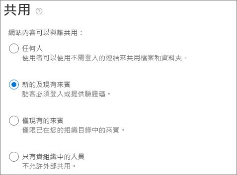

# 在小組中與來賓共同作業

如果您需要跨檔、工作和交談共同處理來賓，我們建議使用 Microsoft 團隊。 小組會提供 Office 和 SharePoint 中的所有共同作業功能，以及持續聊天的功能，以及可自訂且可擴展的共同作業工具集合，以整合的使用者體驗。

在本文中，我們將逐步完成設定小組以與來賓共同作業時，所需的 Microsoft 365 設定步驟。

## 影片示範

這段影片顯示本檔所述的設定步驟。 

> [!VIDEO https://www.microsoft.com/videoplayer/embed/RE44NTr?autoplay=false]

## Azure 組織關聯性設定

Microsoft 365 中的共用可透過 Azure Active Directory 中的組織關聯設定受到最高層級的制約。 如果 Azure AD 中已停用來賓共用或已限制來賓共用，這會覆寫您在 Microsoft 365 中設定的任何共用設定。

檢查 [組織關聯] 設定，以確保未封鎖與來賓共用。

設定組織關聯設定

1. 登入 Microsoft Azure，網址[https://portal.azure.com](https://portal.azure.com)為。
2. 在左側導覽中，按一下 [ **Azure Active Directory**]。
3. 在 [**一覽表**] 窗格中，按一下 [**組織關聯**性]。
4. 在 [**組織關聯**] 窗格中，按一下 [**設定**]。
5. 確定**guest 和 guest inviter role 中的系統管理員和使用者都可以邀請**和**成員可以邀請**皆設定為 **[是]**。
6. 如果您做了任何變更，請按一下 [儲存]****。

請記下 [**協同限制**] 區段中的設定。 確定您要與之來賓進行共同作業的網域不會遭到封鎖。

## 小組訪客存取設定

團隊具有來賓存取的主圖形參數和各種設定，可控制哪些來賓可以在小組中執行。 主要參數**允許小組中的來賓存取**必須**開啟**，以供來賓存取在小組中運作。

檢查以確保小組已啟用來賓存取，並根據您的業務需求對來賓設定進行任何調整。 請記住，這些設定會影響所有小組。

設定 Teams 來賓存取設定

1. 登入 [https://admin.microsoft.com](https://admin.microsoft.com) 的 Microsoft 365 系統管理中心。
2. 在左側導覽窗格中，按一下 [顯示全部]****。
3. 在 [系統管理中心]**** 底下，按一下 [Teams]****。
4. 在 Teams 系統管理中心的左側導覽中展開 [全組織設定]****，然後按一下 [來賓存取]****。
5. 確定 [在 Teams 中允許來賓存取]**** 已設定為 [開啟]****。
6. 對其他來賓設定進行所需的變更，然後按一下 [儲存]****。

> [!NOTE]
> Teams 來賓設定在開啟後，最慢可能需要 24 小時才會生效。

## Microsoft 365 群組來賓設定

小組會使用 Microsoft 365 群組做為小組成員資格。 為了讓小組中的來賓存取能夠運作，必須開啟 Microsoft 365 群組來賓設定。

設定 Microsoft 365 群組來賓設定

1. 在 Microsoft 365 系統管理中心的左側流覽窗格中，展開 [**設定**]。
2. 按一下 [**服務] & 增益集**。
3. 在清單中，按一下 [ **Microsoft 365 群組**]。
4. 確定 [**讓組織外部的成員存取群組內容**] 和 [**允許群組擁有者將組織外部人員新增至群組**] 核取方塊皆已勾選。
5. 如果您進行變更，請按一下 [**儲存變更**]。

## SharePoint 組織層級共用設定

小組內容（如檔案、資料夾和清單）全都儲存在 SharePoint。 為了讓來賓能夠存取小組中的這些專案，SharePoint 組織層級的共用設定必須允許與來賓共用。

組織層級設定會決定個別網站可使用的設定，包括與小組相關聯的網站。 網站設定不能超過組織層級設定的許可。

如果您想要允許檔案和資料夾與未驗證人員共用，請選擇 [**任何人**]。 如果您想要確保所有來賓都必須進行驗證，請選擇 [**新增] 和 [現有來賓**]。 選擇您的組織中的任何網站所需的功能最寬鬆設定。

設定 SharePoint 組織層級共用設定

1. 在 Microsoft 365 系統管理中心的左側導覽中，按一下 [系統**管理中心**] 底下的 [ **SharePoint**]。
2. 在 SharePoint 管理中心中，按一下左側導覽窗格中的 [共用]****。
3. 確定 SharePoint 的外部共用已設定為**任何人**或**新的和現有的客人**。
4. 如果您做了任何變更，請按一下 [儲存]****。

## SharePoint 組織層級的預設連結設定

預設的檔案和資料夾連結設定會決定使用者在共用檔案或資料夾時，預設會向使用者顯示的連結選項。 如有需要，使用者可以在共用之前將連結類型變更為其他選項之一。

請記住，此設定會影響組織中的所有小組和 SharePoint 網站。

選擇當使用者共用檔案和資料夾時，預設會選取的連結類型：

- **任何具有連結的使用者**-如果您想要對檔案和資料夾進行許多未驗證的共用，請選擇此選項。 如果您想要允許*任何人*的連結，但擔心意外的共用驗證，請將其中一個其他選項視為預設值。 只有在您已啟用**任何**共用時，才可使用此連結類型。
- **僅限貴組織中的人員**-如果您預期大多數的檔案和資料夾共用與組織內的人員有關，請選擇此選項。
- **特定人員**-如果您想要對來賓執行大量檔案和資料夾共用，請考慮此選項。 這種連結類型與來賓搭配使用，需要驗證。
 

設定 SharePoint 組織層級的預設連結設定

1. 流覽至 SharePoint 系統管理中心的 [共用] 頁面。
2. 在 [檔案**和資料夾連結**] 底下，選取您要使用的預設共用連結。
3. 如果您做了任何變更，請按一下 [儲存]****。

## 建立團隊

下一步是建立您計畫用以與客人合作的小組。

建立小組
1. 在 [小組] 的 [**小組**] 索引標籤上，按一下 [**加入] 或 [建立小組**] （位於左窗格的底部）。
2. 按一下 [**建立小組**]。
3. 按一下 [**從頭開始建立小組**]。
4. 選擇 [**私人**] 或 [**公用**]。
5. 輸入團隊的名稱和描述，然後按一下 [**建立**]。
6. 按一下 [**略過**]。

我們稍後會邀請使用者。 接下來，請務必檢查與小組相關聯之 SharePoint 網站的網站層級共用設定。

## 網站層級共用設定 SharePoint

檢查網站層級的共用設定，確定其允許此小組的訪問類型。 例如，如果您將組織層級設定設定為 [**任何人**]，但您希望所有來賓都對此小組進行驗證，請確定網站層級共用設定已設定為 [**新增] 和 [現有來賓**]。

設定網站層級共用設定
1. 在 SharePoint 管理中心中，在左側導覽窗格中展開 [網站]****，然後按一下 [使用中網站]****。
2. 為您剛建立的小組選取網站。
3. 在功能區中，按一下 [共用]****。
4. 確定 [共用] 設定為 [**任何人**] 或 [**現有來賓**]。
5. 如果您做了任何變更，請按一下 [儲存]****。

## 邀請使用者

現在已設定來賓共用設定，因此您可以開始將內部使用者和來賓新增至您的小組。 

邀請內部使用者加入小組
1. 在團隊中，按一下 [**更多選項**（）]，然後按一下 [**\*\*****新增成員**]。
2. 輸入您要邀請之人員的名稱。
3. Click **Add**, and then click **Close**.

邀請客人加入小組
1. 在團隊中，按一下 [**更多選項**（）]，然後按一下 [**\*\*****新增成員**]。
2. 輸入您要邀請之來賓的電子郵件地址。
3. 按一下 [**編輯來賓資訊**]。
4. 輸入來賓的完整名稱，然後按一下核取記號。
5. Click **Add**, and then click **Close**.

## 另請參閱

[與未驗證使用者共用檔案和資料夾的最佳做法](best-practices-anonymous-sharing.md)

[與來賓共用時限制意外暴露檔案](share-limit-accidental-exposure.md)

[建立安全的來賓共用環境](create-secure-guest-sharing-environment.md)

[使用受管理來賓建立 B2B 外部網路](b2b-extranet.md)
