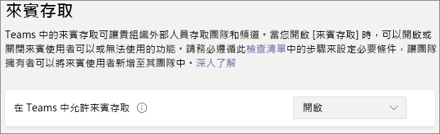

# 在小組中與來賓共同作業

如果您需要跨檔、工作和交談共同處理來賓，我們建議使用 Microsoft 團隊。 小組會提供 Office 和 SharePoint 中的所有共同作業功能，以及持續聊天的功能，以及可自訂且可擴展的共同作業工具集合，以整合的使用者體驗。

在本文中，我們將逐步完成設定小組以與來賓共同作業時，所需的 Microsoft 365 設定步驟。

## 影片示範

這段影片顯示本檔所述的設定步驟。 

> [!VIDEO https://www.microsoft.com/videoplayer/embed/RE44NTr?autoplay=false]

## Azure 外部協同作業設定

Microsoft 365 中的共用受 [Azure Active Directory 中的 B2B 外部](https://docs.microsoft.com/azure/active-directory/external-identities/delegate-invitations)共同作業設定的最高層級。 如果 Azure AD 中已停用或限制來賓共用，此設定會覆寫您在 Microsoft 365 中設定的任何共用設定。

檢查 B2B 外部協同設定設定，以確保不會封鎖與來賓共用。

設定外部協同作業設定

1. 登入 Azure Active Directory at [https://aad.portal.azure.com](https://aad.portal.azure.com) 。
2. 在左功能窗格中，按一下 [ **Azure Active Directory**]。
3. 按一下 [ **外部** 身分識別]。
4. 在 [ **快速入門** ] 畫面上，按一下左功能窗格中的 [ **外部協同作業設定**]。
5. 確定 **guest 和 guest inviter role 中的系統管理員和使用者都可以邀請** 和 **成員可以邀請** 皆設定為 **[是]**。
6. 如果您做了任何變更，請按一下 [儲存]。

請記下 [ **協同限制** ] 區段中的設定。 確定您要與之來賓進行共同作業的網域不會遭到封鎖。

如果您與多個組織的客人合作，您可能想要限制其存取目錄資料的能力。 這可防止使用者看到目錄中的客人。 若要執行此動作，請在 [ **來賓使用者訪問限制**] 底下，選取 [來賓使用者對內容的 **存取權受到限制** ]，或 **[來賓使用者存取許可權制于自身目錄物件的屬性和成員資格]** 設定。

## 小組訪客存取設定

團隊具有來賓存取的主圖形參數和各種設定，可控制哪些來賓可以在小組中執行。 主要參數 **允許小組中的來賓存取** 必須 **開啟** ，以供來賓存取在小組中運作。

檢查以確保小組已啟用來賓存取，並根據您的業務需求對來賓設定進行任何調整。 請記住，這些設定會影響所有小組。

設定 Teams 來賓存取設定

1. 登入 [https://admin.microsoft.com](https://admin.microsoft.com) 的 Microsoft 365 系統管理中心。
2. 在左功能窗格中，按一下 [ **全部顯示**]。
3. 在 [系統管理中心] 底下，按一下 [Teams]。
4. 在團隊系統管理中心的左功能窗格中，展開 [ **整個組織的設定** ]，然後按一下 [ **來賓存取**]。
5. 確定 [在 Teams 中允許來賓存取] 已設定為 [開啟]。
6. 對其他來賓設定進行所需的變更，然後按一下 [儲存]。

一旦開啟團隊使用者存取，您可以選擇性地使用敏感度標籤控制個別小組及其相關聯 SharePoint 網站的 guest 存取。 如需詳細資訊，請參閱 [[使用敏感度標籤來保護 Microsoft Teams、Microsoft 365 群組和 SharePoint 網站中的內容]](https://docs.microsoft.com/microsoft-365/compliance/sensitivity-labels-teams-groups-sites)。

> [!NOTE]
> 「小組訪客」設定在開啟後，可能需要長達24小時的時間才會變成作用中。

## Microsoft 365 群組來賓設定

小組會使用 Microsoft 365 群組做為小組成員資格。 為了讓小組中的來賓存取能夠運作，必須開啟 Microsoft 365 群組來賓設定。

設定 Microsoft 365 群組來賓設定

1. 在 Microsoft 365 系統管理中心的左功能窗格中，展開 [ **設定**]。
2. 按一下 [ **組織設定**]。
3. 在清單中，按一下 [ **Microsoft 365 群組**]。
4. 確定 **允許群組擁有者將組織外部的人員新增至 Microsoft 365 群組做為來賓** ，並 **讓 [允許來賓群組成員存取群組內容** ] 核取方塊皆已勾選。
5. 如果您進行變更，請按一下 [ **儲存變更**]。

## SharePoint 組織層級共用設定

小組內容（如檔案、資料夾和清單）全都儲存在 SharePoint。 為了讓來賓能夠存取小組中的這些專案，SharePoint 組織層級的共用設定必須允許與來賓共用。

組織層級設定會決定個別網站可使用的設定，包括與小組相關聯的網站。 網站設定不能超過組織層級設定的許可。

如果您想要允許檔案和資料夾與未驗證人員共用，請選擇 [ **任何人**]。 如果您想要確保所有來賓都必須進行驗證，請選擇 [ **新增] 和 [現有來賓**]。 選擇您的組織中的任何網站所需的功能最寬鬆設定。

設定 SharePoint 組織層級的共用設定

1. 在 Microsoft 365 系統管理中心的左功能窗格中，按一下 [系統 **管理中心**] 底下的 [ **SharePoint**]。
2. 在 [SharePoint 系統管理中心] 的左功能窗格中，展開 [ **原則** ]，然後按一下 [ **共用**]。
3. 確定 SharePoint 的外部共用已設定為 **任何人** 或 **新的和現有的客人**。
4. 如果您做了任何變更，請按一下 [儲存]。

## SharePoint 組織層級的預設連結設定

預設的檔案和資料夾連結設定會決定在使用者共用檔案或資料夾時，預設會向使用者顯示的連結選項。 如有需要，使用者可以在共用之前將連結類型變更為其他選項之一。

請記住，此設定會影響組織中的所有小組和 SharePoint 網站。

選擇下列任一連結類型：使用者共用檔案和資料夾時預設會選取下列其中一種連結類型：

- **任何具有連結的使用者** -如果您想要對檔案和資料夾進行許多未驗證的共用，請選擇此選項。 如果您想要允許 *任何人* 的連結，但擔心意外的共用驗證，請將其中一個其他選項視為預設值。 只有在您已啟用 **任何** 共用時，才可使用此連結類型。
- **僅限貴組織中的人員** -如果您預期大多數的檔案和資料夾共用與組織內的人員有關，請選擇此選項。
- **特定人員** -如果您想要對來賓執行大量檔案和資料夾共用，請考慮此選項。 這種連結類型與來賓搭配使用，需要驗證。
 

設定 SharePoint 組織層級的預設連結設定

1. 流覽至 SharePoint 系統管理中心的 [共用] 頁面。
2. 在 [檔案 **和資料夾連結**] 底下，選取您要使用的預設共用連結。
3. 如果您做了任何變更，請按一下 [儲存]。

## 建立小組

下一步是建立您計畫用以與客人合作的小組。

建立小組
1. 在 [小組] 的 [ **小組** ] 索引標籤上，按一下 [ **加入] 或 [建立小組** ] （位於左窗格的底部）。
2. 按一下 [ **建立小組**]。
3. 按一下 [ **從頭開始建立小組**]。
4. 選擇 [ **私人** ] 或 [ **公用**]。
5. 輸入團隊的名稱和描述，然後按一下 [ **建立**]。
6. 按一下 [ **略過**]。

我們稍後會邀請使用者。 接下來，請務必檢查與小組相關聯之 SharePoint 網站的網站層級共用設定。

## SharePoint 網站層級共用設定

檢查網站層級的共用設定，確定其允許此小組的訪問類型。 例如，如果您將組織層級設定設定為 [ **任何人**]，但您希望所有來賓都對此小組進行驗證，請確定網站層級共用設定已設定為 [ **新增] 和 [現有來賓**]。

設定網站層級共用設定
1. 在 SharePoint 系統管理中心的左功能窗格中，展開 [ **網站** ]，然後按一下 [作用中的 **網站**]。
2. 為您剛建立的小組選取網站。
3. 點擊。。。，然後選擇 [ **共用**]。
4. 確定 [共用] 設定為 [ **任何人** ] 或 [ **現有來賓**]。
5. 如果您做了任何變更，請按一下 [儲存]。

## 邀請使用者

現在已設定來賓共用設定，因此您可以開始將內部使用者和來賓新增至您的小組。 

邀請內部使用者加入小組
1. 在團隊中，按一下 [ **更多選項** ] (**\*\*\***) ]，然後按一下 [ **新增成員**]。
2. 輸入您要邀請之人員的名稱。
3. Click **Add**, and then click **Close**.

邀請客人加入小組
1. 在團隊中，按一下 [ **更多選項** ] (**\*\*\***) ]，然後按一下 [ **新增成員**]。
2. 輸入您要邀請之客人的電子郵件地址。
3. 按一下 [ **編輯來賓資訊**]。
4. 輸入來賓的完整名稱，然後按一下核取記號。
5. Click **Add**, and then click **Close**.

## 請參閱

[與未驗證使用者共用檔案和資料夾的最佳做法](best-practices-anonymous-sharing.md)

[與來賓共用時限制意外暴露檔案](share-limit-accidental-exposure.md)

[建立安全的來賓共用環境](create-secure-guest-sharing-environment.md)

[使用受管理來賓建立 B2B 外部網路](b2b-extranet.md)

[與 Azure AD B2B 的 SharePoint 和 OneDrive 整合](https://docs.microsoft.com/sharepoint/sharepoint-azureb2b-integration-preview)

[當您從 SharePoint 或 OneDrive 共用時，共用選項會變灰。](https://docs.microsoft.com/sharepoint/troubleshoot/administration/sharing-options-grayed-out-when-sharing-from-sharepoint-online-or-onedrive)
