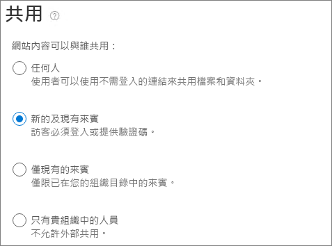

# 在網站中與來賓共同作業Collaborate with guests in a site

如果您需要跨檔、資料和清單共同處理來賓，您可以使用 SharePoint 網站。If you need to collaborate with guests across documents, data, and lists, you can use a SharePoint site. 新式 SharePoint 網站會連線至 Microsoft 365 群組，並可管理網站成員資格，並提供其他共同作業工具，例如共用信箱和行事曆。Modern SharePoint sites are connected to Microsoft 365 Groups and can manage the site membership and provide additional collaboration tools such as a shared mailbox and a calendar.

在本文中，我們將逐步完成設定 SharePoint 網站與來賓共同作業所需的 Microsoft 365 設定步驟。In this article, we'll walk through the Microsoft 365 configuration steps necessary to set up a SharePoint site for collaboration with guests.

## 影片示範Video demonstration

這段影片顯示本檔所述的設定步驟。This video shows the configuration steps described in this document. 

> [!VIDEO https://www.microsoft.com/videoplayer/embed/RE44Llg?autoplay=false]

## Azure 外部協同作業設定Azure external collaboration settings

Microsoft 365 中的共用可透過 [Azure Active Directory 中的組織關聯設定](https://docs.microsoft.com/azure/active-directory/external-identities/delegate-invitations)受到最高層級的制約。Sharing in Microsoft 365 is governed at its highest level by the [organizational relationships settings in Azure Active Directory](https://docs.microsoft.com/azure/active-directory/external-identities/delegate-invitations). 如果 Azure AD 中已停用或限制來賓共用，此設定會覆寫您在 Microsoft 365 中設定的任何共用設定。If guest sharing is disabled or restricted in Azure AD, this setting overrides any sharing settings that you configure in Microsoft 365.

檢查外部共同作業設定，以確保未封鎖與來賓共用。Check the external collaboration settings to ensure that sharing with guests is not blocked.

設定外部協同作業設定To set external collaboration settings

1. 登入 Azure Active Directory at [https://aad.portal.azure.com](https://aad.portal.azure.com) 。Log in to Azure Active Directory at [https://aad.portal.azure.com](https://aad.portal.azure.com).
2. 在左功能窗格中，按一下 [ **Azure Active Directory** ]。In the left navigation pane, click **Azure Active Directory**.
3. 按一下 [ **外部** 身分識別]。Click **External identities**.
4. 在 [ **快速入門** ] 畫面上，按一下左功能窗格中的 [ **外部協同作業設定** ]。On the **Get started** screen, in the left navigation pane, click **External collaboration settings**.
5. 確定 **guest 和 guest inviter role 中的系統管理員和使用者都可以邀請** 和 **成員可以邀請** 皆設定為 **[是]** 。Ensure that **Admins and users in the guest inviter role can invite** and **Members can invite** are both set to **Yes**.
6. 如果您做了任何變更，請按一下 [儲存]。If you made changes, click **Save**.

請記下 [ **協同限制** ] 區段中的設定。Note the settings in the **Collaboration restrictions** section. 確定您要與之來賓進行共同作業的網域不會遭到封鎖。Make sure that the domains of the guests that you want to collaborate with aren't blocked.

如果您與多個組織的客人合作，您可能想要限制其存取目錄資料的能力。If you work with guests from multiple organizations, you may want to restrict their ability to access directory data. 這可防止使用者看到目錄中的客人。This will prevent them from seeing who else is a guest in the directory. 若要執行此動作，請在 [ **來賓使用者訪問限制** ] 底下，選取 [來賓使用者對內容的 **存取權受到限制** ]，或 **[來賓使用者存取許可權制于自身目錄物件的屬性和成員資格]** 設定。To do this, under **Guest user access restrictions** , select **Guest users have limited access to properties and membership of directory objects settings** or **Guest user access is restricted to properties and memberships of their own directory objects**.

## Microsoft 365 群組來賓設定Microsoft 365 Groups guest settings

新式 SharePoint 網站使用 Microsoft 365 群組來控制網站存取。Modern SharePoint sites use Microsoft 365 Groups to control site access. 為了讓 SharePoint 網站中的來賓存取能夠運作，必須開啟 Microsoft 365 群組來賓設定。The Microsoft 365 Groups guest settings must be turned on in order for guest access in SharePoint sites to work.

設定 Microsoft 365 群組來賓設定To set Microsoft 365 Groups guest settings

1. 在 Microsoft 365 系統管理中心的左功能窗格中，展開 [ **設定** ]。In the Microsoft 365 admin center, in the left navigation pane, expand **Settings**.
2. 按一下 [ **組織設定** ]。Click **Org settings**.
3. 在清單中，按一下 [ **Microsoft 365 群組** ]。In the list, click **Microsoft 365 Groups**.
4. 確定 **允許群組擁有者將組織外部的人員新增至 Microsoft 365 群組做為來賓** ，並 **讓 [允許來賓群組成員存取群組內容** ] 核取方塊皆已勾選。Ensure that the **Let group owners add people outside your organization to Microsoft 365 Groups as guests** and **Let guest group members access group content** check boxes are both checked.
5. 如果您進行變更，請按一下 [ **儲存變更** ]。If you made changes, click **Save changes**.

## SharePoint 組織層級的共用設定SharePoint organization-level sharing settings

為了讓來賓能夠存取 SharePoint 網站，SharePoint 組織層級的共用設定必須允許與來賓共用。In order for guests to have access to SharePoint sites, the SharePoint organization-level sharing settings must allow for sharing with guests.

組織層級設定會決定可用於個別網站的設定。The organization-level settings determine the settings that will be available for individual sites. 網站設定不能超過組織層級設定的許可。Site settings cannot be more permissive than the organization-level settings.

如果您想要允許未驗證的檔案和資料夾共用，請選擇 [ **任何人** ]。If you want to allow unauthenticated file and folder sharing, choose **Anyone**. 若要確定您組織外部的人員必須進行驗證，請選擇 [ **新增] 和 [現有來賓** ]。If you want to ensure that all people outside your organization have to authenticate, choose **New and existing guests**. 選擇您的組織中的任何網站所需的功能最寬鬆設定。Choose the most permissive setting that will be needed by any site in your organization.

設定 SharePoint 組織層級的共用設定To set SharePoint organization-level sharing settings

1. 在 Microsoft 365 系統管理中心的左功能窗格中，按一下 [系統 **管理中心** ] 底下的 [ **SharePoint** ]。In the Microsoft 365 admin center, in the left navigation pane, under **Admin centers** , click **SharePoint**.
2. 在 [SharePoint 系統管理中心] 的左功能窗格中，按一下 [ **原則** ] 底下的 [ **共用** ]。In the SharePoint admin center, in the left navigation pane, under **Policies** , click **Sharing**.
3. 確定 SharePoint 的外部共用已設定為 **任何人** 或 **新的和現有的客人** 。Ensure that external sharing for SharePoint is set to **Anyone** or **New and existing guests**.
4. 如果您做了任何變更，請按一下 [儲存]。If you made changes, click **Save**.

## 建立網站Create a site

下一步是建立您計畫用以與來賓合作的網站。The next step is to create the site that you plan to use for collaborating with guests.

若要建立網站To create a site
1. 在 SharePoint 系統管理中心的 **[網站]** 底下，按一下 **[使用中網站]** 。In the SharePoint admin center, under **Sites** , click **Active sites**.
2. 按一下 **[建立]** 。Click **Create**.
3. 按一下 [ **小組網站** ]。Click **Team site**.
4. 輸入網站名稱，並為群組擁有者 (網站擁有者) 輸入名稱。Type a site name and enter a name for the Group owner (site owner).
5. 在 [ **高級設定** ] 底下，選擇您是否要將此網站設為公用或私人網站。Under **Advanced settings** , choose if you want this site to be a public or private one.
6. 按 [下一步]。Click **Next**.
7. 按一下 **[完成]** 。Click **Finish**.

我們稍後會邀請使用者。We'll invite users later. 接下來，請務必檢查此網站的網站層級共用設定。Next, it's important to check the site-level sharing settings for this site.

## SharePoint 網站層級共用設定SharePoint site-level sharing settings

請檢查網站層級的共用設定，以確定其允許您要用於此網站的訪問類型。Check the site-level sharing settings to make sure that they allow the type of access that you want for this site. 例如，如果您將組織層級設定設定為 [ **任何人** ]，但您希望所有來賓都對此網站進行驗證，請確定網站層級共用設定已設定為 [ **新增] 和 [現有來賓** ]。For example, if you set the organization-level settings to **Anyone** , but you want all guests to authenticate for this site, then make sure the site-level sharing settings are set to **New and existing guests**.

請注意，網站無法與未驗證的人員共用 ( **任何人** 設定) ，但是個別的檔案和資料夾可以。Note that the site cannot be shared with unauthenticated people ( **Anyone** setting), but individual files and folders can.

設定網站層級共用設定To set site-level sharing settings
1. 在 SharePoint 管理中心中，在左側導覽窗格中展開 [網站]，然後按一下 [使用中網站]。In the SharePoint admin center, in the left navigation, expand **Sites** and click **Active sites**.
2. 選取您要共用的網站。Select the site that you want to share.
3. 按一下 [...]，然後按一下 [ **共用** ]。Click ..., and click **Sharing**.
4. 確定 [共用] 設定為 [ **任何人** ] 或 [ **現有來賓** ]。Ensure that sharing is set to **Anyone** or **New and existing guests**.
5. 如果您做了任何變更，請按一下 [儲存]。If you made changes, click **Save**.

## 邀請使用者Invite users

現在已設定來賓共用設定，因此您可以開始將內部使用者和來賓新增至您的網站。Guest sharing settings are now configured, so you can start adding internal users and guests to your site. 網站存取是透過相關的 Microsoft 365 群組來控制，因此我們將會在那裡新增使用者。Site access is controlled through the associated Microsoft 365 Group, so we'll be adding users there.

邀請內部使用者加入群組To invite internal users to a group
1. 流覽至您要新增使用者的網站。Navigate to the site where you want to add users.
2. 按一下右上方的 [ **成員** ] 連結，表示成員計數。Click **Members** link in the upper right which denotes the member count.
3. 按一下 [新增成員]。Click **Add members**.
4. 輸入您要邀請加入網站之使用者的名稱或電子郵件地址，然後按一下 [ **儲存** ]。Type the names or email addresses of the users that you want to invite to the site, and then click **Save**.

無法從網站新增來賓使用者。Guest users can't be added from the site. 您必須使用 Outlook 網頁版來新增這些檔案。You need to add them using Outlook on the web. 因此，若要新增並邀請來賓至群組，請按一下 [ **url**  ] 欄中的網站 url，以流覽至網站特有的頁面。Therefore, as a prerequisite to add and invite guests to a group, click the URL of the site in the **URL**  column to navigate to the site-specific page. 在此頁面上，按一下 **應用程式啟動器** 圖示，然後選取 [ **Outlook** ]。From this page, click the **App launcher** icon and select **Outlook**. 您可以從該畫面邀請客人加入群組，其程式如下所述。This is the screen from which you can invite guests into a group, for which procedure is described below.

若要邀請客人加入群組To invite guests to a group
1. 在 [ **群組** ] 下，按一下您要邀請來賓的群組。Under **Groups** , click the group to which you want to invite guests.
2. 開啟群組連絡人卡片，按一下右上方的 [ **成員** ] 連結 (表示成員計數) 的連結。Open the group contact card, click **Members** link in the upper right (the link which denotes the member count).
3. 按一下 [ **新增成員** ]。click **Add members**.
4. 輸入您要邀請之來賓的電子郵件地址，然後按一下 [ **新增** ]。Type the email addresses of the guests that you want to invite, and then click **Add**.
5. 按一下 **[關閉]** 。Click **Close**.
請注意，只有當您不是群組的擁有者時，才需要按一下 [ **關閉** ]，因此不允許將來賓新增至群組。Note that you need to click **Close** only if you are not the owner of the group and as a result, you are not allowed to add the guest into the group. 在這種情況下，將來賓加入群組的要求會轉給群組擁有者以供核准。In such cases, the request to add the guest into the group is transferred to the group owner for approval.

## 另請參閱See also

[與未驗證使用者共用檔案和資料夾的最佳做法Best practices for sharing files and folders with unauthenticated users](best-practices-anonymous-sharing.md)

[與來賓共用時限制意外暴露檔案Limit accidental exposure to files when sharing with guests](share-limit-accidental-exposure.md)

[建立安全的來賓共用環境Create a secure guest sharing environment](create-secure-guest-sharing-environment.md)

[使用受管理來賓建立 B2B 外部網路Create a B2B extranet with managed guests](b2b-extranet.md)

[與 Azure AD B2B 的 SharePoint 和 OneDrive 整合SharePoint and OneDrive integration with Azure AD B2B](https://docs.microsoft.com/sharepoint/sharepoint-azureb2b-integration-preview)
