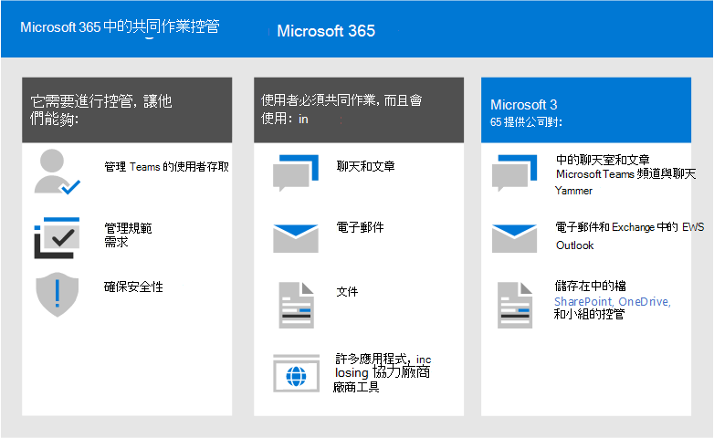
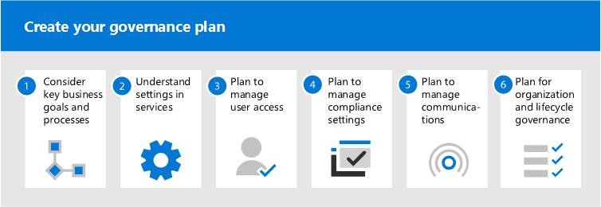

# 何謂共同作業管理？

共同作業控管是您如何管理使用者對資源的存取，遵循您的商務標準，並確保資料的安全性。

目前的組織使用不同的工具集。 使用團隊聊天的開發人員小組、主管電子郵件，以及透過企業社交的整個組織。 因為每個群組都是唯一的，且具有自身的功能需求和工作樣式，所以使用多個協同作業工具。 有些只會使用電子郵件，有些人會主要在聊天中生活。 

如果使用者感覺其所提供的工具不符合其需求，他們就可能會下載其最愛的使用者應用程式，以支援其案例。 雖然此程式可讓使用者快速開始，但在組織中有多個登入、難於共用，而且沒有任何單一位置可供查看內容時，可讓整個組織的使用者體驗變得令人沮喪。 這個概念稱為「陰影 IT」，並對組織帶來極大的風險。 它可減少統一管理使用者存取、確保安全性和服務合規性需求的能力。

Microsoft 365 群組、小組和 Yammer 等服務可讓使用者，並提供共同作業所需的工具，以降低陰影的風險。 Microsoft 365 有一套豐富的工具，可實施組織可能需要的任何控管功能。 

這系列的文章將協助您瞭解群組、小組和 SharePoint 設定如何相互作用、哪些管理功能可供使用，以及如何在 Microsoft 365 中建立及實施共同作業功能的控管計畫。

## 何謂 Microsoft 365 群組？

Microsoft 365 群組可讓您選擇您想要共同作業的一組人員，並輕鬆地設定要共用之人員的資源集合。 新增成員至群組時，會自動授與群組所提供之所有資產的必要許可權。 兩個小組和 Yammer 都使用 Microsoft 365 群組來管理其成員資格。

Microsoft 365 群組包含使用者可用於通訊和共同作業的連結資源套件。 群組永遠包括 SharePoint 網站、Planner、Power BI workspace、信箱和行事曆，以及資料流程。 視您建立群組的方式而定，您可以選擇性地新增其他服務，例如小組、Yammer 及專案。

|資源|描述|
|:------|:----------|
|[Calendar](https://support.office.com/article/schedule-a-meeting-on-a-group-calendar-in-outlook-0cf1ad68-1034-4306-b367-d75e9818376a)|有關群組相關事件的日程|
|[收件匣](https://support.office.com/article/have-a-group-conversation-in-outlook-a0482e24-a769-4e39-a5ba-a7c56e828b22)|群組成員之間的電子郵件交談。 此收件匣具有電子郵件地址，可以設定為接受來自群組以外的人員，甚至是組織外的郵件，與傳統的通訊群組清單非常類似。|
|[OneNote 筆記本](https://support.office.com/article/get-started-with-onenote-e768fafa-8f9b-4eac-8600-65aa10b2fe97)|收集創意、調查和資訊|
|[Planner](https://support.office.com/article/microsoft-planner-help-4a9a13c6-3adf-4a60-a6fc-15c0b15e16fc)|在群組成員之間指派及管理專案工作|
|[Power BI Workspace](https://docs.microsoft.com/power-bi/collaborate-share/service-new-workspaces)|含儀表板和報告的資料共同作業空間|
|[專案和藍圖](https://support.microsoft.com/project)|以 Web 為基礎的專案管理工具|
|[SharePoint 小組網站](https://support.office.com/article/what-is-a-sharepoint-team-site-75545757-36c3-46a7-beed-0aaa74f0401e)|中央存放庫，提供與群組相關的資訊、連結和內容|
|[Stream](https://support.microsoft.com/microsoft-stream)|影片傳送服務|
|[Teams](https://support.microsoft.com/teams)|Microsoft 365 中的研討型工作區|
|[Yammer 群組](https://support.office.com/article/Learn-about-Office-365-groups-b565caa1-5c40-40ef-9915-60fdb2d97fa2)|一個共同的位置可讓交談和共用資訊|

Microsoft 365 群組包含各種控管控制項，包括到期原則、命名慣例和封鎖的字詞原則，以協助您管理組織中的群組。 因為群組控制成員資格和存取此群組資源，所以管理群組是在 Microsoft 365 中管理共同作業的關鍵區段。

## 定義組織的共同作業策略

在 Microsoft 365 內有多個地方共同作業和進行交談。 瞭解使用者可以開始交談的位置，可協助您定義通訊策略。

Microsoft 365 支援三種主要通訊方法：

- Outlook：透過使用共用群組收件匣和行事曆的電子郵件進行協同作業
- Microsoft 小組：一種持續聊天的工作區，您可以在其中以特定子群組為基礎的各種主題，進行非正式、即時的交談
- Yammer：共同作業的企業社交體驗

- 小組：以聊天為基礎的工作區 (高速度共同作業) –內環
  - 專為您的使用者每日運作的人員進行共同作業
  - 以單一體驗將資訊放在使用者的手邊
  - 新增索引標籤、連接器和 bot
  - 即時聊天、音訊/視訊會議、記錄的會議

- Yammer：跨組織 (enterprise 社交) –外部迴圈
  - 業務部的社區，其共同共同感興趣或專業知識的人員跨職能群組，但不一定要在日常運作中協同運作。
  - 領導能力，學習社區，以角色為基礎的社區

- 信箱和行事曆 (電子郵件型共同作業) 
  - 用於與一群人員進行目標通訊
  - 與其他群組成員的會議共用行事曆
 
當您決定要如何在 Microsoft 365 中使用共同作業功能時，請考慮這些通訊方式，以及您的使用者在不同的情況下可能使用的方式。

> [!NOTE]
> 透過 Yammer 或小組建立新的 Office 365 群組時，群組不會出現在 Outlook 或通訊錄中，因為這些使用者之間的主要通訊會在各自的用戶端中發生。 Yammer 群組無法連線至團隊。

## 最佳做法

當您開始進行控管規劃過程時，請牢記下列最佳作法：

- **與您的使用者交談** -識別您的最大共同作業功能，並與他們共同瞭解他們的核心業務需求和使用案例案例。

- **平衡風險和效益** -回顧您的業務、法規、法律和法規遵從性需求，並規劃可優化所有結果的解決方案。

- **可用於不同組織和不同類型的內容與案例** -考慮不同群組或部門的不同需求，以及不同類型的內容，例如內部網路內容與使用者的 OneDrive 內容。

- 依 **業務優先順序對齊**-業務目標可協助您定義投資管理所需的時間和精力。

- **直接在您建立的解決方案中內嵌管理決策** -許多管理決定可以透過開啟或關閉 Microsoft 365 中的功能來實施。

- **使用** [microsoft 365 學習路徑](https://docs.microsoft.com/office365/customlearning) 等訓練-調整方案，以確保您的組織特有的預期會與 microsoft 所提供的訓練。

- **有策略可用於通訊組織中的控管原則和指導方針** -在 SharePoint 通迅網站中建立 Microsoft 365 採用中心，以交流原則與程式。

- **定義角色和責任** -識別您的控管核心小組，並透過先進行布建及命名與外部存取的主要管理決策來運作，然後再繼續進行其他決策。

- **在商務和技術變更時** 重新考慮您的決策-定期召開，以回顧新功能及新的商業期望。

若要深入瞭解這些做法，請閱讀 [建立共同作業管理計畫](collaboration-governance-first.md)。

## 使用者影響和變更管理

因為群組和小組可以以多種方式建立，所以建議您訓練您的使用者，以使用最適合貴組織的方法：

- 如果您的組織使用電子郵件進行大部分通訊，請指示您的使用者在 Outlook 中建立群組。
- 如果您的組織大量使用 SharePoint 或從內部部署 SharePoint 進行遷移，請指示您的使用者建立共同作業的 SharePoint 小組網站。
- 如果您的組織已部署小組，請指導您的使用者在需要共同作業空間時建立小組。

如果使用者不熟悉群組與其相關服務的關聯方式，這有助於避免混淆。 如需如何與使用者討論群組的詳細資訊，請參閱 [向您的使用者說明 Microsoft 365 群組](../admin/create-groups/explain-groups-knowledge-worker.md)。

## 主要管理功能和授權需求

Microsoft 365 中共同作業的控管功能包括 Microsoft 365、小組、SharePoint 和 Azure Active Directory 中的功能。

| 功能 | 描述 | 授權 |
|:----------------------|:------------|:----------|
|小組和網站共用|控制是否可以與組織外部的人員共用小組、群組和網站。|Microsoft 365 E5 或 E3|
|網域允許/封鎖|限制與組織外部人員共用來自特定網域的人員。|Microsoft 365 E5 或 E3|
|自助網站架設|允許或防止使用者建立自己的 SharePoint 網站。|Microsoft 365 E5 或 E3|
|受限制的網站與檔案共用|將網站、檔案及資料夾共用限制在特定安全性群組的成員。|Microsoft 365 E5 或 E3|
|限制群組建立|將小組和群組建立限制在特定安全性群組的成員。|Microsoft 365 E5 或 E3 搭配 Azure AD Premium 或 Azure AD Basic EDU 授權|
|群組命名原則|在群組和小組名稱上強制執行首碼或尾碼。|Microsoft 365 E5 或 E3 搭配 Azure AD Premium 或 Azure AD Basic EDU 授權|
|群組到期原則|設定非使用中的群組和小組到期，並在指定的一段時間後刪除。|使用 Azure AD Premium 授權的 Microsoft 365 E5 或 E3|
|每個群組的來賓存取權|以每個群組為基礎，允許或防止小組和群組與組織外部的人員共用。|Microsoft 365 E5 或 E3|

## 建立您的管理計畫

請遵循下列基本步驟來建立您的管理計畫：

1. 考慮重要的商業目標和流程- [建立您](collaboration-governance-first.md) 的控管計畫，以符合您的業務需求。
2. 瞭解服務中的設定- [群組中的設定和 SharePoint](groups-sharepoint-governance.md) 彼此互動，就像 [群組、SharePoint 和團隊](groups-sharepoint-teams-governance.md) 及 [其他服務](groups-services-interactions.md)中的設定。 在規劃控管策略時，請務必瞭解這些互動。
3. 規劃管理使用者存取-規劃 [您想要授與群組、SharePoint 及小組中使用者的存取層級](groups-teams-access-governance.md)。
4. 規劃管理規範設定-查看適用 [于 Microsoft 365 群組、小組和 SharePoint 共同作業的相容性選項](groups-teams-compliance-governance.md)。
5. 規劃管理通訊-回顧共同作業案例的可用 [通訊管理選項](groups-teams-communication-governance.md)。
6. 規劃組織及生命週期管理-選擇 [您想要用於群組及小組建立、命名、到期及](plan-organization-lifecycle-governance.md)封存的原則。 此外，瞭解 [群組、小組和 Yammer 的週期結束選項](end-life-cycle-groups-teams-sites-yammer.md)

## 系統管理員訓練

Microsoft 學習的這些訓練模組可協助您瞭解小組和 SharePoint 中的共同作業功能。

#### Teams

|培訓：|使用 Microsoft Teams 管理團隊共同作業|
|:---|:---|
||使用 Microsoft Teams 管理團隊共同作業會為您介紹 Microsoft Teams 的功能，Microsoft Teams 是 Microsoft 365 中的團隊共同作業中心。 您將了解如何使用 Teams 來促進組織內部和外部的團隊合作和溝通，包括從桌面、平板電腦和手機等各種設備，同時利用 Office 365 應用程式的所有豐富功能。 您將了解 Teams 如何提供全面且靈活的環境，以便在各個應用程式和裝置上共同作業。 這個學習路徑可協助您準備 Microsoft 365 認證：Teams 系統管理員關聯認證。  2個 hr 17 min-教學路徑-5 模組|

> [!div class="nextstepaction"]
> [開始 >](https://docs.microsoft.com/learn/modules/m365-teams-collab-prepare-deployment/introduction/)

#### SharePoint

|培訓：|在 Microsoft 365 中使用 SharePoint 共同作業|
|:---|:---|
||使用 Microsoft SharePoint 管理共用內容，為您提供 SharePoint 的各項功能，以及它如何與 Microsoft 365 搭配使用。 您將了解不同類型的 SharePoint 網站，包括中樞網站，以及資訊保護、報告及監視。 您也將了解如何使用 SharePoint 檔案和資料夾共用，以最佳化共同作業、如何在外部共用檔案，以及如何在 SharePoint 系統管理中心管理 SharePoint 網站。 這個學習路徑可協助您準備 Microsoft 365 認證：團隊工作系統管理員關聯認證。  1 hr 14 min-教學路徑-4 模組|

> [!div class="nextstepaction"]
> [開始 >](https://docs.microsoft.com/learn/modules/m365-teams-sharepoint-plan-sharepoint/introduction/)

## 適用於終端使用者的訓練

這些訓練模組可協助您的使用者使用團隊、群組和 SharePoint，以在 Microsoft 365 中共同作業。

|Teams|SharePoint|
|:---|:---|
| **[設定和自訂您的小組](https://support.microsoft.com/office/702a2977-e662-4038-bef5-bdf8ee47b17b)**| **[共用及同步處理](https://support.microsoft.com/office/98cb2ff2-c27e-42ea-b055-c2d895f8a5de)**|
| **[上傳及尋找檔案](https://support.microsoft.com/office/57b669db-678e-424e-b0a0-15d19215cb12)**||
| **[小組和頻道共同作業](https://support.microsoft.com/office/c3d63c10-77d5-4204-a566-53ddcf723b46)**|||

## 插圖

這些圖例可協助您瞭解群組和團隊如何與 Microsoft 365 中的其他服務互動，以及可協助您在組織中管理這些服務的控管和合規性功能。

### 適用於 IT 結構設計師的 Microsoft 365 中的群組
對於 Microsoft 365 中的群組，IT 結構設計師需要知道的事項

|**項目**|**描述**|
|:-----|:-----|
|   [PDF](https://github.com/MicrosoftDocs/microsoft-365-docs/raw/public/microsoft-365/downloads/msft-m365-groups.pdf) \| [Visio](https://github.com/MicrosoftDocs/OfficeDocs-Enterprise/raw/live/Enterprise/downloads/msft-m365-groups.vsdx)   更新日期：2019 年 6 月|這些圖例會詳細說明不同類型的群組、如何建立及管理群組，以及一些控管建議。|

### 適用於 IT 結構設計師的 Microsoft 365 中的Microsoft Teams 和相關生產力服務
使用 Microsoft Teams 領導，Microsoft 365 中生產力服務的邏輯架構。

|**項目**|**描述**|
|:-----|:-----|
|   [PDF](https://github.com/MicrosoftDocs/microsoft-365-docs/raw/public/microsoft-365/downloads/msft-m365-teams-logical-architecture.pdf) \| [Visio](https://github.com/MicrosoftDocs/OfficeDocs-Enterprise/raw/live/Enterprise/downloads/msft-m365-teams-logical-architecture.vsdx)   更新日期：2019 年 4 月   |Microsoft 提供一套生產力服務，共同合作來提供資料管理、安全性和法規遵循功能的共同作業體驗。    這系列的圖例可為企業結構設計師提供生產力服務邏輯架構使用 Microsoft Teams 引導的檢視。|

### Microsoft 365 資訊保護和合規性功能

Microsoft 365 包括一組廣泛的資訊保護和合規性功能。 這些功能搭配 Microsoft 的生產力工具，可協助組織即時協同合作，同時遵循嚴格的法規遵從性框架。 

這組插圖使用最受管制的行業（財務服務）之一，示範如何套用這些功能以滿足一般法規需求。 您可以隨意使用這些圖例，以供您自行使用。 

| 項目 | 描述 |
|:-----|:-----|
|   英文：[下載成 PDF 格式](https://download.microsoft.com/download/3/a/6/3a6ab1a3-feb0-4ee2-8e77-62415a772e53/m365-compliance-illustrations.pdf)的 \| [Visio 下載](https://download.microsoft.com/download/3/a/6/3a6ab1a3-feb0-4ee2-8e77-62415a772e53/m365-compliance-illustrations.vsdx)     日文：以[PDF 格式下載](https://download.microsoft.com/download/6/f/1/6f1a7d0e-dd8e-442e-b073-8e94327ae4f8/m365-compliance-illustrations.pdf)為 \| [Visio 下載](https://download.microsoft.com/download/6/f/1/6f1a7d0e-dd8e-442e-b073-8e94327ae4f8/m365-compliance-illustrations.vsdx)     2020年11月更新|包括： <ul><li>  Microsoft 資訊保護和資料遺失防護</li><li>保留原則和保留標籤 </li><li>資訊屏障</li><li>通訊合規性</li><li>內幕用風險</li><li>協力廠商資料攝取</li>|

## 會議會話

觀看這些會議會話，以深入瞭解 Microsoft 365 群組和小組的管理。

**基礎**

深入瞭解 Microsoft 365 群組中的基礎和新創新，包括規模的管理和控管，以及驅動使用狀況和採用方式的最佳作法，以及自助服務。

- [接納 Microsoft 365 群組](https://www.youtube.com/watch?v=dAamBF1gb7M)

**管理**

瞭解如何設定您的群組到期生命週期、命名原則、分類標籤、與外部來賓的共同作業，以及管理群組建立許可權。

- [使用 Office 365 群組轉換共同作業及抵制陰影](https://www.youtube.com/watch?v=Bhf_bKx3lAg)

**客戶範例**

請參閱幕後的範例，說明 Microsoft 365 群組、SharePoint、小組和 Yammer 如何共同運作，以提供全球協同作業平臺。

- [使用 Office 365 群組、SharePoint、小組和 Yammer 尋找共同作業的最擅長點](https://www.youtube.com/watch?v=Rx9eVwqXeQk)
