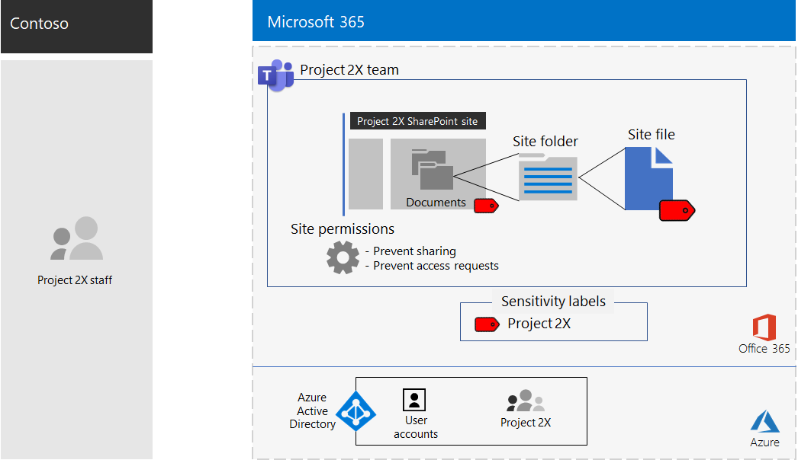

# Contoso Corporation 的最大機密專案的隔離團隊Isolated team for a top-secret project of the Contoso Corporation

在執行異地的執行中，Contoso 的 CEO 會定購一套新的產品和服務，並在今後五年中，讓 Contoso 的贏利翻倍。After an executive offsite, Contoso’s CEO ordered the development of a new suite of products and services that could double Contoso’s profits in the next five years. 開發商務、工程及市場計畫的重要專案是「**專案 2** 」和整個公司的主要人員都是 recruited。The top-secret project to develop the business, engineering, and market plan was named **Project 2X** and key staff across the company were recruited. 

調查和開發的時程表已緊密，這表示共同作業必須有效並提供安全的會議、進行中的交談及檔案儲存。The timelines for research and development were tight, which meant that collaboration had to be efficient and provide for secure meetings, ongoing conversations, and file storage.

專案2所產生的可傳送作業是商務計畫、產品及工程規格，以及 Word、Excel 及 PowerPoint 檔案形式的行銷材料和排程。The resulting deliverables for Project 2X were business plans, product and engineering specifications, and marketing materials and schedules in the form of Word, Excel, and PowerPoint files. 

由於其敏感性，對這些檔案的存取權如下：Due to their sensitive nature, access to these files were:

- 限制為 Project 2 小組成員。Restricted to Project 2X team members.
- 以只允許存取專案2小組成員的許可權進行加密及保護，即使這些檔案是在其安全資料夾以外的地方發佈也是一樣。Encrypted and protected with permissions to allow access only to Project 2X team members, even if the files were distributed outside of their secured folders.

Contoso IT 人員使用具有專案2的[安全性隔離的團隊](secure-teams-security-isolation.md)和這些步驟。Contoso IT staff used a [team with security isolation](secure-teams-security-isolation.md) for Project 2X and these steps.

## 步驟1：建立私人團隊Step 1: Created a private team

首先，為了保護小組的底層 SharePoint 網站的存取權，Contoso IT 管理員設定建議的[SharePoint 存取原則](../enterprise/sharepoint-file-access-policies.md)。First, to protect access to the underlying SharePoint site for the team, Contoso IT administrators configured the [recommended SharePoint access policies](../enterprise/sharepoint-file-access-policies.md).

接下來，Contoso IT 管理員建立一個名為 Project 2 的新私人團隊，並新增專案2個人的使用者帳戶為成員。Next, a Contoso IT administrator created a new private team named Project 2X and added the user accounts of Project 2X staff as members.

如需設定詳細資料，請參閱[建立私人團隊](secure-teams-security-isolation.md#create-a-private-team)。For the configuration details, see [Create a private team](secure-teams-security-isolation.md#create-a-private-team).

## 步驟2：為專案2小組建立敏感度標籤Step 2: Created a sensitivity label for the Project 2X team

Contoso admins 建立一個名為「**專案 2** 」的新敏感度標籤：Contoso admins created a new sensitivity label named **Project 2X** that:

- 需要加密。Requires encryption.
- 允許 Project 2X Microsoft 365 群組的共同撰寫許可權。Allows Co-Author permissions for the Project 2X Microsoft 365 group.

基礎專案 2 SharePoint 網站**的 [檔**] 區段中的檔案受到下列保護：Files in the **Documents** section of the underlying Project 2X SharePoint site were protected by:

- 網站許可權，只允許存取 Project 2 之專案 365 2 群組的成員。The site permissions, which only allow access to members of the Project 2X Microsoft 365 group.
- 專案2敏感度標籤，其會在移動或複製到網站時，與檔案一起旅行的加密和許可權。The Project 2X sensitivity label, with encryption and permissions that travel with the file if it is moved or copied from the site.

如需設定詳細資料，請參閱[建立靈敏度標籤](secure-teams-security-isolation.md#create-a-sensitivity-label)。For the configuration details, see [Create a sensitivity label](secure-teams-security-isolation.md#create-a-sensitivity-label).

## 步驟3：設定基礎 SharePoint 網站Step 3: Configured the underlying SharePoint site

首先，為了保護小組的底層 SharePoint 網站的存取權，Contoso IT 管理員設定建議的[SharePoint 存取原則](../enterprise/sharepoint-file-access-policies.md)。First, to protect access to the underlying SharePoint site for the team, Contoso IT administrators configured the [recommended SharePoint access policies](../enterprise/sharepoint-file-access-policies.md).

接下來，他們設定網站的其他許可權設定，以防止 Project 2 共用網站的存取權。Next, they configured additional permission settings for the site to prevent Project 2X from sharing access to the site. 如需設定詳細資料，請參閱[使用安全隔離的團隊 SharePoint 設定](secure-teams-security-isolation.md#sharepoint-settings)。For the configuration details, see [SharePoint settings for a team with security isolation](secure-teams-security-isolation.md#sharepoint-settings).

以下是專案2小組所產生的設定。Here is the resulting configuration of the Project 2X team.

 ## 步驟4：訓練有素的專案2小組成員Step 4: Trained Project 2X team members

Contoso 安全性人員會在必要課程中訓練專案2小組成員：Contoso security staff trained the Project 2X team members in a mandatory course that stepped them through:

- 如何存取新的 Project 2 小組、使用會議和聊天，以及如何在小組檔案上共同作業。How to access the new Project 2X team, use meetings and chats, and how to collaborate on team files.
- 如何在小組中建立新檔案，並上傳在本機建立的新檔案。How to create new files in the team and upload new files created locally.
- 有關 DLP 原則如何在外部共用檔案的示範。A demonstration of how the DLP policy blocks files from being shared externally.
- 如何使用專案2敏感度標籤來標示檔案。How to label files with the Project 2X sensitivity label.
- 示範 Project 2X 標籤如何保護檔案的示範，甚至是在離開小組時。A demonstration of how the Project 2X  label protects a file even when it leaves the team.

最終結果是一種安全的環境，在此環境中，Project 2 小組成員在安全的環境中共同合作，以進行聊天、會議及檔。The end result was a secure environment in which Project 2X team members collaborated in a secure environment for chats, meetings, and files.

以下是儲存在基礎專案2網站中的檔案範例，並指派 Project 2 敏感度標籤。Here is an example of a file stored in the underlying Project 2X site with the Project 2X sensitivity label assigned.

在幾個實例中，Project 2 小組成員會將專案2標籤所保護的檔案下載到本機磁片磁碟機，以供離線工作使用。In a couple of instances, Project 2X team members downloaded files protected by the Project 2X label to a local drive for offline work. 不過，當您開啟認證時出現要求時，使用者已意識到其錯誤並加以刪除。However, after being prompted for credentials when opening them, they realized their mistake and deleted them.

由於小組的共同作業環境和 Microsoft 365 的安全性功能，Project 2X 的詳細資料會在專案期間內保密。Because of the collaboration environment of Teams and the security features of Microsoft 365, the details of Project 2X were kept secret for the duration of the project. Contoso 宣告其計畫，而且正在將新產品及服務推出給其客戶和投資者的愉悅感，以及其競爭者的 chagrin。Contoso announced its plans and is in the process of rolling out the new products and services to the delight of its customers and investors and the chagrin of its competitors.

## 下一步Next step

在您的組織中[部署具有安全性隔離的團隊](secure-teams-security-isolation.md)。[Deploy a team with security isolation](secure-teams-security-isolation.md) in your organization.

