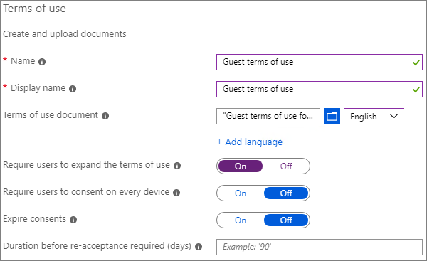

# 建立安全的來賓共用環境Create a secure guest sharing environment

在本文中，我們將逐一介紹用於在 Microsoft 365 中建立安全的來賓共用環境的各種選項。In this article, we'll walk through a variety of options for creating a secure guest sharing environment in Microsoft 365. 下列是可讓您了解可用選項的一些範例。These are examples to give you an idea of the options available. 您可以用不同的組合使用這些程序，以符合貴組織的安全性和合規性需求。You can use these procedures in different combinations to meet the security and compliance needs of your organization.

本文包括：This article includes:

- 為來賓設定多重要素驗證。Setting up multi-factor authentication for guests.
- 為來賓設定使用規定。Setting up a terms of use for guests.
- 設定每季來賓存取權檢閱，以定期驗證來賓是否繼續需要小組和網站的使用權限。Setting up quarterly guest access reviews to periodically validate whether guests continue to need permissions to teams and sites.
- 將來賓限制為僅限網頁存取未受管理的裝置。Restricting guests to web-only access for unmanaged devices.
- 設定工作階段逾時原則，以確保來賓每天進行驗證。Configuring a session timeout policy to ensure guests authenticate daily.
- 為高敏感性專案建立敏感性資訊類型。Creating a sensitive information type for a highly sensitive project.
- 自動將高敏感性標籤指派給包含敏感性資訊類型的文件。Automatically assigning a sensitivity label to documents that contain a sensitive information type.
- 自動從具有敏感度標籤的檔案移除來賓存取。Automatically removing guest access from files with a sensitivity label.

本文中所述的部分選項要求來賓在 Azure Active Directory 中擁有帳戶。Some of the options discussed in this article require guests to have an account in Azure Active Directory. 若要確保共用檔案和資料夾時目錄中包含來賓，請使用 [SharePoint 和 OneDrive 與 Azure AD B2B 整合 (預覽版)](https://docs.microsoft.com/sharepoint/sharepoint-azureb2b-integration-preview)。To ensure that guests are included in the directory when you share files and folders with them, use the [SharePoint and OneDrive integration with Azure AD B2B Preview](https://docs.microsoft.com/sharepoint/sharepoint-azureb2b-integration-preview).

請注意，我們不會在本文中討論啟用來賓共用設定。Note that we won't discuss enabling guest sharing settings in this article. 如需針對不同案例啟用來賓共用的詳細資訊，請參閱[與組織外部人員共同作業](collaborate-with-people-outside-your-organization.md)。See [Collaborating with people outside your organization](collaborate-with-people-outside-your-organization.md) for details about enabling guest sharing for different scenarios.

## 為來賓設定多重要素驗證Set up multi-factor authentication for guests

多重要素驗證可大幅降低帳戶遭入侵的機會。Multi-factor authentication greatly reduces the chances of an account being compromised. 由於來賓可能使用不符合任何控管原則或最佳做法的個人電子郵件帳戶，因此要求來賓進行多重要數驗證特別重要。Since guests may be using personal email accounts that don't adhere to any governance policies or best practices, it's especially important to require multi-factor authentication for guests. 若來賓的使用者名稱和密碼遭竊，要求第二個驗證要素能大幅降低未知人員存取網站和檔案的機會。If a guest's username and password is stolen, requiring a second factor of authentication greatly reduces the chances of unknown parties gaining access to your sites and files.

在此範例中，我們將使用 Azure Active Directory 中的條件式存取原則為來賓設定多重要素驗證。In this example, we'll set up multi-factor authentication for guests by using a conditional access policy in Azure Active Directory.

若要為來賓設定多重要素驗證To set up multi-factor authentication for guests

1. 移至 [[Azure 條件式存取原則]](https://portal.azure.com/#blade/Microsoft_AAD_IAM/ConditionalAccessBlade)。Go to [Azure conditional access policies](https://portal.azure.com/#blade/Microsoft_AAD_IAM/ConditionalAccessBlade).
2. 在 [條件式存取 | 原則 **]** 刀鋒視窗中，按一下 [新增原則 **]**。On the **Conditional Access | Policies** blade, click **New policy**.
3. 在 [名稱 **]** 欄位中，輸入名稱。In the **Name** field, type a name.
4. 在 **[指派]** 底下，按一下 **[使用者和群組]**。Under **Assignments**, click **Users and groups**.
5. 在 **[使用者和群組]** 刀鋒視窗中，選取 **[選取使用者與群組]**，選取 **[所有來賓和外部使用者]** 核取方塊。On the **Users and groups** blade, select **Select users and groups**, select the **All guests and external users** check box.
6. 在 **[指派]** 底下，按一下 **雲端應用程式或動作**。Under **Assignments**, click **Cloud apps or actions**.
7. 在 **雲端應用程式或動作** 刀鋒視窗中，選取 **[包含]** 索引標籤上的 **[所有雲端應用程式]**。On the **Cloud apps or actions** blade, select **All cloud apps** on the **Include** tab.
8. 在 **[存取控制]** 底下，按一下 **[授與]**。Under **Access controls**, click **Grant**.
9. 在 **[授與]** 刀鋒視窗中，選取 **[需要多重要素驗證]** 核取方塊，然後按一下 **[選取]**。On the **Grant** blade, select the **Require multi-factor authentication** check box, and then click **Select**.
10. 在 **[新增]** 刀鋒視窗的 **[啟用原則]** 底下，按一下 **[開啟]**，然後按一下 **[建立]**。On the **New** blade, under **Enable policy**, click **On**, and then click **Create**.

現在，來賓必須先註冊多重要素驗證，才能存取共用的內容、網站或小組。Now, guest will be required to enroll in multi-factor authentication before they can access shared content, sites, or teams.

### 其他資訊More information

[規劃 Azure AD Multi-Factor Authentication 部署Planning an Azure AD Multi-Factor Authentication deployment](https://docs.microsoft.com/azure/active-directory/authentication/howto-mfa-getstarted)

## 為來賓設定使用規定Set up a terms of use for guests

在某些情況下，來賓可能沒有與貴組織簽署保密合約或其他法律合約。In some situations guests may not have signed non-disclosure agreements or other legal agreements with your organization. 在來賓存取與他們共用的檔案之前，您可以要求來賓同意使用規定。You can require guests to agree to a terms of use before accessing files that are shared with them. 使用規定可在來賓首次嘗試存取共用檔案或網站時顯示。The terms of use can be displayed the first time they attempt to access a shared file or site.

若要建立使用規定，您必須先在 Word 或其他撰寫程式建立文件，然後將文件儲存為 .pdf 檔案。To create a terms of use, you first need to create the document in Word or another authoring program, and then save it as a .pdf file. 然後便能將此檔案上傳到 Azure AD。This file can then be uploaded to Azure AD.

若要建立 Azure AD 使用規定To create an Azure AD terms of use

1. 以全域管理員、安全性系統管理員或條件式存取系統管理員的身分登入 Azure。Sign in to Azure as a Global Administrator, Security Administrator, or Conditional Access Administrator.
2. 瀏覽至 [[使用規定]](https://aka.ms/catou)。Navigate to [Terms of use](https://aka.ms/catou).
3. 按一下 **[新增規定]**。Click **New terms**.

   

4. 輸入 [名稱 **]** 和 [顯示名稱 **]**。Type a **Name** and **Display name**.
6. 在 **使用規定文件**，瀏覽及選取您建立的 PDF 檔案。For **Terms of use document**, browse to the pdf file that you created and select it.
7. 選取使用規定文件的語言。Select the language for your terms of use document.
8. 將 **[要求使用者展開使用規定]** 設為 **[開啟]**。Set **Require users to expand the terms of use** to **On**.
9. 在 **[條件式存取]** 底下的 **[強制使用條件式存取原則範本]** 清單中，選擇 **[稍後建立條件式存取原則]**。Under **Conditional Access**, in the **Enforce with Conditional Access policy template** list choose **Create conditional access policy later**.
10. 按一下 **[建立]**。Click **Create**.

建立使用規定後，下一個步驟是建立條件式存取原則，以顯示來賓的使用規定。Once you've created the terms of use, the next step is to create a conditional access policy that displays the terms of use to guests.

若要建立條件式存取原則To create a conditional access policy

1. 移至 [[Azure 條件式存取原則]](https://portal.azure.com/#blade/Microsoft_AAD_IAM/ConditionalAccessBlade)。Go to [Azure conditional access policies](https://portal.azure.com/#blade/Microsoft_AAD_IAM/ConditionalAccessBlade).
2. 在 [條件式存取 | 原則 **]** 刀鋒視窗中，按一下 [新增原則 **]**。On the **Conditional Access | Policies** blade, click **New policy**.
3. 在 [名稱 **]** 方塊中，輸入名稱。In the **Name** box, type a name.
4. 在 **[指派]** 底下，按一下 **[使用者和群組]**。Under **Assignments**, click **Users and groups**.
5. 在 **[使用者和群組]** 刀鋒視窗中，選取 **[選取使用者與群組]**，選取 **[所有來賓和外部使用者]** 核取方塊。On the **Users and groups** blade, select **Select users and groups**, select the **All guests and external users** check box.
6. 在 **[指派]** 底下，按一下 **雲端應用程式或動作**。Under **Assignments**, click **Cloud apps or actions**.
7. 在 **[包含]** 索引標籤上，選取 **[選取應用程式]**，然後按一下 **[選取]**。On the **Include** tab, select **Select apps**, and then click **Select**.
8. 在 **[選取]** 刀鋒視窗中，選取 **Microsoft Teams**、**Office 365 SharePoint Online** 和 **Outlook Groups**，然後按一下 **[選取]**。On the **Select** blade, select **Microsoft Teams**, **Office 365 SharePoint Online**, and **Outlook Groups**, and then click **Select**.
9. 在 **[存取控制]** 底下，按一下 **[授與]**。Under **Access controls**, click **Grant**.
10. 在 **[授與]** 刀鋒視窗中，選取 **[來賓使用規定]**，然後按一下 **[選取]**。On the **Grant** blade, select **Guest terms of use**, and then click **Select**.
11. 在 **[新增]** 刀鋒視窗的 **[啟用原則]** 底下，按一下 **[開啟]**，然後按一下 **[建立]**。On the **New** blade, under **Enable policy**, click **On**, and then click **Create**.

現在，在來賓首次嘗試存取貴組織中的內容、小組或網站時，必須接受使用規定。Now, the first time a guest attempts to access content or a team or site in your organization, they will be required to accept the terms of use.

> [!NOTE]
> 使用條件式存取需要 Azure AD Premium P1 授權。Using Conditional Access requires an Azure AD Premium P1 license. 如需詳細資訊，請參閱[何謂條件式存取](https://docs.microsoft.com/azure/active-directory/conditional-access/overview)。For more information, see [What is Conditional Access](https://docs.microsoft.com/azure/active-directory/conditional-access/overview).

### 詳細資訊More information

[Azure Active Directory 使用規定Azure Active Directory terms of use](https://docs.microsoft.com/azure/active-directory/conditional-access/terms-of-use)

## 設定來賓存取權檢閱Set up guest access reviews

透過 Azure AD 中的存取權檢閱，您可以自動定期檢閱各小組和群組的使用者存取權。With access reviews in Azure AD, you can automate a periodic review of user access to various teams and groups. 透過特別要求來賓的存取權檢閱，您可以協助確保來賓不會在非必要時持續存取貴組織的敏感性資訊。By requiring an access review for guests specifically, you can help ensure guests do not retain access to your organization's sensitive information for longer than is necessary.

設定來賓存取權檢閱To set up a guest access review

1. 在 [Identity Governance 頁面](https://portal.azure.com/#blade/Microsoft_AAD_ERM/DashboardBlade)的左側功能表中，按一下 **[存取權檢閱]**。On the [Identity Governance page](https://portal.azure.com/#blade/Microsoft_AAD_ERM/DashboardBlade), in the left menu, click **Access reviews**.
2. 按一下 **[新增存取權檢閱]**。Click **New access review**.
3. 選擇 **Teams + 群組** 選項。Choose the **Teams + Groups** option.
4. 選擇 **來賓使用者的所有 Microsoft 365 群組** 選項。Choose the **All Microsoft 365 groups with guest users** option. 如果您想要排除任何群組，請按一下 **[選取排除群組]**。Click **Select group(s) to exclude** if you want to exclude any groups.
5. 選擇 **[僅來賓使用者]** 選項，然後按一下 **[下一步 : 檢閱]**。Choose the **Guest users only** option, and then click **Next: Reviews**.
6. 在 **[選取檢閱者]** 下，選擇 **[群組擁有者]**。Under **Select reviewers**, choose **Group Owner(s)**.
7. 按一下 **[選取遞補檢閱者]**，選擇誰是遞補檢閱者，然後按一下 **[選取]**。Click **Select fallback reviewers**, choose who should be the fallback reviewers, and then click **Select**.
8. 在 **[指定檢閱週期]** 下，選擇 **[季度]**。Under **Specify recurrence of review**, choose **Quarterly**.
9. 選取開始日期和期間。Select a start date and duration.
10. 針對 **[結束]**，選擇 **[永不]**，然後按一下 **[下一步 : 設定]**。For **End**, choose **Never**, and then click **Next: Settings**.

    

11. 在 **[設定]** 索引標籤上，檢閱符合您商務規則的設定。On the **Settings** tab, review the settings for compliance with your business rules.

    

12. 選取 **[下一步 : 檢閱 + 建立]**。Click **Next: Review + Create**.
13. 輸入 **[檢閱名稱]** 並檢閱設定。Type a **Review name** and review the settings.
14. 按一下 **[建立]**。Click **Create**.

請注意，來賓可取得小組或群組，或個別檔案和資料夾的存取權。It's important to note that guests can be given access to teams or groups, or to individual files and folders. 取得檔案和資料夾存取權時，系統可能不會將來賓新增至任何特定群組。When given access to files and folders, guests may not be added to any particular group. 如果您要對不屬於某小組或群組的來賓執行存取權檢閱，您可以在 Azure AD 中建立動態群組以包含所有來賓，然後建立該群組的存取權檢閱。If you want to do access reviews on guests who don't belong to a team or group, you can create a dynamic group in Azure AD to contain all guests and then create an access review for that group. 網站擁有者也可以管理[網站的來賓到期日](https://support.microsoft.com/office/25bee24f-42ad-4ee8-8402-4186eed74dea)Site owners can also manage [guest expiration for the site](https://support.microsoft.com/office/25bee24f-42ad-4ee8-8402-4186eed74dea)

### 詳細資訊More information

[使用 Azure AD 存取權檢閱來管理來賓存取權Manage guest access with Azure AD access reviews](https://docs.microsoft.com/azure/active-directory/governance/manage-guest-access-with-access-reviews)

[在 Azure AD 存取權檢閱中建立群組或應用程式的存取權檢閱Create an access review of groups or applications in Azure AD access reviews](https://docs.microsoft.com/azure/active-directory/governance/create-access-review)

## 為來賓設定僅限網頁存取Set up web-only access for guests

您可以要求來賓僅使用網頁瀏覽器存取小組、網站和檔案，以縮小受攻擊面，並輕鬆進行管理。You can reduce your attack surface and ease administration by requiring guests to access your teams, sites, and files by using a web browser only.

若為 Microsoft 365 群組和 Teams，這會使用 Azure AD 條件式存取原則來完成。For Microsoft 365 Groups and Teams, this is done with an Azure AD conditional access policy. 若為 SharePoint，這會在 SharePoint 系統管理中心設定。For SharePoint, this is configured in the SharePoint admin center. (您也可以[使用敏感度標籤將來賓限制在僅限 Web 存取](https://docs.microsoft.com/microsoft-365/compliance/sensitivity-labels-teams-groups-sites)。)(You can also [use sensitivity labels to restrict guests to web-only access](https://docs.microsoft.com/microsoft-365/compliance/sensitivity-labels-teams-groups-sites).)

為群組和小組將來賓限制在僅限 Web 存取：To restrict guests to web-only access for Groups and Teams:

1. 移至 [[Azure 條件式存取原則]](https://portal.azure.com/#blade/Microsoft_AAD_IAM/ConditionalAccessBlade)。Go to [Azure conditional access policies](https://portal.azure.com/#blade/Microsoft_AAD_IAM/ConditionalAccessBlade).
2. 在 [條件式存取 - 原則 **]** 刀鋒視窗上，按一下 [新增原則 **]**。On the **Conditional Access - Policies** blade, click **New policy**.
3. 在 [名稱 **]** 方塊中，輸入名稱。In the **Name** box, type a name.
4. 在 **[指派]** 底下，按一下 **[使用者和群組]**。Under **Assignments**, click **Users and groups**.
5. 在 **[使用者和群組]** 刀鋒視窗中，選取 **[選取使用者與群組]**，選取 **[所有來賓和外部使用者]** 核取方塊。On the **Users and groups** blade, select **Select users and groups**, select the **All guests and external users** check box.
6. 在 **[指派]** 底下，按一下 **雲端應用程式或動作**。Under **Assignments**, click **Cloud apps or actions**.
7. 在 **[包含]** 索引標籤上，選取 **[選取應用程式]**，然後按一下 **[選取]**。On the **Include** tab, select **Select apps**, and then click **Select**.
8. 在 [選取 **]** 刀鋒視窗上，選取 **Microsoft Teams** 和 **Outlook Groups**，然後按一下 [選取 **]**。On the **Select** blade, select **Microsoft Teams** and **Outlook Groups**, and then click **Select**.
9. 按一下 **[指派]** 底下的 **[條件]**。Under **Assignments**, click **Conditions**.
10. 在 **[條件]** 刀鋒視窗中，按一下 **[用戶端應用程式]**。On the **Conditions** blade, click **Client apps**.
11. 在 [用戶端應用程式 **]** 刀鋒視窗上，對 [設定 **]** 按一下 [是 **]**，然後選取 [行動裝置應用程式和桌面用戶端 **]**、[Exchange ActiveSync 用戶端 **]** 和 [其他用戶端 **]** 設定。On the **Client apps** blade, click **Yes** for **Configure**, and then select the **Mobile apps and desktop clients**, **Exchange ActiveSync clients**, and **Other clients** settings. 清除 [瀏覽 **]** 核取方塊。Clear the **Browser** check box.

    

12. 按一下 [完成 **]**。Click **Done**.
13. 在 **[存取控制]** 底下，按一下 **[授與]**。Under **Access controls**, click **Grant**.
14. 在 **[授與]** 刀鋒視窗中，選取 **[裝置需要標記為合規]** 和 **[需要已加入混合式 Azure AD 的裝置]**。 On the **Grant** blade, select **Require device to be marked as compliant** and **Require Hybrid Azure AD joined device**.
15. 在 **[針對多個控制項]** 底下，選取 **[需要其中一個選取的控制項]**，然後按一下 **[選取]**。Under **For multiple controls**, select **Require one of the selected controls**, and then click **Select**.
16. 在 **[新增]** 刀鋒視窗的 **[啟用原則]** 底下，按一下 **[開啟]**，然後按一下 **[建立]**。On the **New** blade, under **Enable policy**, click **On**, and then click **Create**.

為 SharePoint 將來賓限制在僅限 Web 存取To restrict guests to web-ony access for SharePoint

1. 在 [SharePoint 系統管理中心](https://admin.microsoft.com/sharepoint)，展開 [原則 **]**，然後按一下 [存取控制 **]**。In the [SharePoint admin center](https://admin.microsoft.com/sharepoint), expand **Policies** and click **Access control**.
2. 按一下 [未受管理的裝置 **]**。Click **Unmanaged devices**.
3. 選取 [允許有限的僅限 Web 存取 **]** 選項，然後按一下 [儲存 **]**。Select the **Allow limited, web-only access** option, and then click **Save**.

請注意，SharePoint 系統管理中心的此設定會在 Azure AD 中建立支援的條件式存取原則。Note that this setting in the SharePoint admin center creates a supporting conditional access policy in Azure AD.

## 為來賓設定工作階段逾時。Configure a session timeout for guests

若來賓的裝置不安全，要求來賓定期驗證可降低未知的使用者存取貴組織內容的可能性。Requiring guests to authenticate on a regular basis can reduce the possibility of unknown users accessing your organization's content if a guest's device isn't kept secure. 您可以在 Azure AD 中設定來賓的工作階段逾時條件式存取原則。You can configure a session timeout conditional access policy for guests in Azure AD.

若要設定來賓工作階段逾時原則To configure a guest session timeout policy

1. 移至 [[Azure 條件式存取原則]](https://portal.azure.com/#blade/Microsoft_AAD_IAM/ConditionalAccessBlade)。Go to [Azure conditional access policies](https://portal.azure.com/#blade/Microsoft_AAD_IAM/ConditionalAccessBlade).
2. 在 **[條件式存取原則]** 刀鋒視窗中，按一下 **[新增原則]**。On the **Conditional Access - Policies** blade, click **New policy**.
3. 在 **[名稱]** 方塊中，輸入 *來賓工作階段逾時*。In the **Name** box, type *Guest session timeout*.
4. 在 **[指派]** 底下，按一下 **[使用者和群組]**。Under **Assignments**, click **Users and groups**.
5. 在 **[使用者和群組]** 刀鋒視窗中，選取 **[選取使用者與群組]**，選取 **[所有來賓和外部使用者]** 核取方塊。On the **Users and groups** blade, select **Select users and groups**, select the **All guests and external users** check box.
6. 在 **[指派]** 底下，按一下 **雲端應用程式或動作**。Under **Assignments**, click **Cloud apps or actions**.
7. 在 **[包含]** 索引標籤上，選取 **[選取應用程式]**，然後按一下 **[選取]**。On the **Include** tab, select **Select apps**, and then click **Select**.
8. 在 **[選取]** 刀鋒視窗中，選取 **Microsoft Teams**、**Office 365 SharePoint Online** 和 **Outlook Groups**，然後按一下 **[選取]**。On the **Select** blade, select **Microsoft Teams**, **Office 365 SharePoint Online**, and **Outlook Groups**, and then click **Select**.
9. 在 **[存取控制]** 底下，按一下 **[工作階段]**。Under **Access controls**, click **Session**.
10. 在 **[工作階段]** 刀鋒視窗中，選取 **[登入頻率]**。On the **Session** blade, select **Sign-in frequency**.
11. 選取 **1**，並在時間週期選取 **[天]** ，然後按一下 **[選取]**。Select **1** and **Days** for the time period, and then click **Select**.
12. 在 **[新增]** 刀鋒視窗的 **[啟用原則]** 底下，按一下 **[開啟]**，然後按一下 **[建立]**。On the **New** blade, under **Enable policy**, click **On**, and then click **Create**.

## 建立高敏感度專案的敏感性資訊類型Create a sensitive information type for a highly sensitive project

敏感性資訊類型是預先定義的字串，可用於原則工作流程中，以強制執行法規遵循需求。Sensitive information types are predefined strings that can be used in policy workflows to enforce compliance requirements. Microsoft 365 合規性中心隨附超過 100 種敏感性資訊類型，包括駕照編號、信用卡號、銀行帳號等。The Microsoft 365 Compliance Center comes with over one hundred sensitive information types, including driver's license numbers, credit card numbers, bank account numbers, etc.

您可以建立自訂敏感性資訊類型以協助管理貴組織的特定內容。You can create custom sensitive information types to help manage content specific to your organization. 在此範例中，我們將建立高敏感度專案的敏感性資訊類型。In this example, we'll create a custom sensitive information type for a highly sensitive project. 然後，我們可以使用此敏感性資訊類型自動套用敏感性標籤。We can then use this sensitive information type to automatically apply a sensitivity label.

若要建立敏感性資訊類型To create a sensitive information type

1. 在 [Microsoft 365 合規性中心](https://compliance.microsoft.com)的左側瀏覽窗格中，展開 **[分類]**，然後按一下 **[敏感性資訊類型]**。In the [Microsoft 365 Compliance Center](https://compliance.microsoft.com), in the left navigation, expand **Classification**, and then click **Sensitive info types**.
2. 按一下 **[建立]**。Click **Create**.
3. 在 **名稱** 和 **描述** 輸入 **Saturn 專案**，然後按一下 **[下一步]**。For **Name** and **Description**, type **Project Saturn**, and then click **Next**.
4. 按一下 **[新增元素]**。Click **Add an element**.
5. 在 **[偵測內容包含]** 清單中，選取 **[關鍵字]**，然後在關鍵字方塊中輸入 *Saturn 專案*。On the **Detect content containing** list, select **Keywords**, and then type *Project Saturn* in the keyword box.
6. 按一下 **[下一步]**，然後按一下 **[完成]**。Click **Next**, and then click **Finish**.
7. 若系統詢問您是否要測試敏感性資訊類型，請按一下 **[否]**。If asked if you would like to test the sensitive information type, click **No**.

### 詳細資訊More information

[自訂敏感性資訊類型Custom sensitive information types](https://docs.microsoft.com/Office365/SecurityCompliance/custom-sensitive-info-types)

## 建立自動標籤原則，以根據敏感性資訊類型指派敏感度標籤Create an auto-labeling policy to assign a sensitivity label based on a sensitive information type

如果您在組織中使用敏感度標籤，則可以自動將標籤套用至包含所定義敏感性資訊類型的檔案。If you are using sensitivity labels in your organization, you can automatically apply a label to files that contain defined sensitive information types. 

建立自動套用標籤原則To create an auto-labeling policy

1. 開啟 [Microsoft 365 合規性系統管理中心](https://compliance.microsoft.com)。Open the [Microsoft 365 compliance admin center](https://compliance.microsoft.com).
2. 在左側導覽中，按一下 [資訊保護 **]**。In the left navigation, click **Information protection**.
3. 在 [自動加上標籤 **]** 索引標籤上，按一下 [建立自動加上標籤原則 **]**。On the **Auto-labeling** tab, click **Create auto-labeling policy**.
4. 在 [選擇要套用此標籤的資訊 **]** 頁面上，選擇 [自訂 **]**，然後按 [下一步 **]**。On the **Choose info you want this label applied to** page, choose **Custom** and click **Next**.
5. 輸入原則的名稱和描述，然後按 [下一步 **]**。Type a name and description for the policy and click **Next**.
6. 在 [選擇您要套用標籤的位置 **]** 頁面上，開啟 [SharePoint 網站 **]**，然後按一下 [選擇網站 **]**。On the **Choose locations where you want to apply the label** page, turn on **SharePoint sites** and click **Choose sites**.
7. 新增您要開啟自動加上標籤的網站 URL，然後按一下 [完成 **]**。Add the URLs for the sites where you want to turn on auto-labeling and click **Done**.
8. 按 [下一步 **]**。Click **Next**.
9. 在 [設定一般或進階規則 **]** 頁面上，選擇 [一般規則 **]**，然後按 [下一步 **]**。On the **Set up common or advanced rules** page, choose **Common rules** and click **Next**.
10. 在 [定義所有位置的內容規則 **]** 頁面上，按一下 [新增規則 **]**。On the **Define rules for content in all locations** page, click **New rule**.
11. 在 [新增規則 **]** 頁面上，為規則命名，按一下 [新增條件 **]**，然後按一下 [內容包含敏感性資訊類型 **]**。On the **New rule** page, give the rule a name, click **Add condition**, and then click **Content contains sensitive info types**.
12. 按一下 [新增 **]**，按一下 [敏感性資訊類型 **]**，選擇您要使用的敏感性資訊類型，按一下 [新增 **]**，然後按一下 [儲存 **]**。Click **Add**, click **Sensitive info types**, choose the sensitive info types that you want to use, click **Add**, and then click **Save**.
13. 按 [下一步 **]**。Click **Next**.
14. 按一下 [選擇標籤 **]**，選取您要使用的標籤，然後按一下 [新增 **]**。Click **Choose a label**, select the label you want to use, and then click **Add**.
15. 按 [下一步 **]**。Click **Next**.
16. 將原則保留為模擬模式，然後按 [下一步 **]**。Leave the policy in simulation mode and click **Next**.
17. 按一下 [建立原則 **]**，然後按一下 [完成 **]**。Click **Create policy**, and then click **Done**.

建立原則後，當使用者在文件中輸入「Saturn 專案」時，自動標籤原則將在掃描檔案時自動套用指定的標籤。With the policy in place, when a user types "Project Saturn" into a document, the auto-labeling policy will automatically apply the specified label when it scans the file.

### 其他資訊More information

[自動將敏感性標籤套用到內容Apply a sensitivity label to content automatically](https://docs.microsoft.com/microsoft-365/compliance/apply-sensitivity-label-automatically)

## 建立 DLP 原則以移除高敏感性檔案的來賓存取Create a DLP policy to remove guest access to highly sensitive files

您可以使用[資料外洩防護 (DLP)](https://docs.microsoft.com/microsoft-365/compliance/data-loss-prevention-policies) 以防止不必要的來賓共用敏感性內容。You can use [data loss prevention (DLP)](https://docs.microsoft.com/microsoft-365/compliance/data-loss-prevention-policies) to prevent unwanted guest sharing of sensitive content. 資料外洩防護可以根據檔案的敏感度標籤採取動作，並移除來賓存取。Data loss prevention can take action based on a file's sensitivity label and remove guest access.

建立 DLP 規則To create a DLP rule

1. 在 Microsoft 365 合規性系統管理中心中，移至 [資料外外洩防護頁面](https://compliance.microsoft.com/datalossprevention)。In the Microsoft 365 compliance admin center, go to the [Data loss prevention page](https://compliance.microsoft.com/datalossprevention).
2. 按一下 **[建立原則]**。Click **Create policy**.
3. 選擇 **[自訂]** ，然後按一下 **[下一步]**。Choose **Custom** and click **Next**.
4. 輸入原則的名稱，並按 **[下一步]**。Type a name for the policy and click **Next**.
5. 在 **[套用原則的位置]** 頁面上，關閉 **SharePoint 網站** 和 **OneDrive 帳戶** 以外的所有設定，然後按一下 **[下一步]**。On the **Locations to apply the policy** page turn off all settings except **SharePoint sites** and **OneDrive accounts**, and then click **Next**.
6. 在 **[定義原則設定]** 頁面上，按一下 **[下一步]**。On the **Define policy settings** page, click **Next**.
7. 在 **[自訂進階資料外洩防護規則]** 頁面上，按一下 **[建立規則]**，然後輸入規則的名稱。On the **Customize advanced DLP rules** page, click **Create rule** and type a name for the rule.
8. 在 [條件 **]** 底下，按一下 [新增條件 **]**，並選擇 [內容包含 **]**。Under **Conditions**, click **Add condition**, and choose **Content contains**.
9. 按一下 [新增 **]**，選擇 [敏感度標籤 **]**，選擇您要使用的標籤，然後按一下 [新增 **]**。Click **Add**, choose **Sensitivity labels**, choose the labels you want to use, and click **Add**.

   

10. 在 [動作 **]** 底下，按一下 [新增動作 **]**，然後選擇 [限制存取或加密 Microsoft 365 位置中的內容 **]**。Under **Actions** click **Add an action** and choose **Restrict access or encrypt the content in Microsoft 365 locations**.
11. 選取 [限制存取或在 Microsoft 365 位置中加密內容 **]** 核取方塊，然後選擇 [只有組織外的人員 **]** 選項。Select the **Restrict access or encrypt the content in Microsoft 365 locations** check box and then choose the **Only people outside your organization** option.

      

12. 按一下 **[儲存]**，然後按 **[下一步]**。Click **Save** and then click **Next**.
13. 選擇您的測試選項，然後按一下 **[下一步]**。Choose your test options and click **Next**.
14. 按一下 [提交 **]**，然後按一下 [完成 **]**。Click **Submit**, and then click **Done**.

請注意，如果來賓是網站或小組整體的成員，則此原則不會移除存取。It's important to note that this policy doesn't remove access if the guest is a member of the site or team as a whole. 如果您計劃讓具有來賓成員的網站或團隊擁有高敏感度文件，請考慮[在 Teams 中使用私人頻道](https://support.microsoft.com/office/de3e20b0-7494-439c-b7e5-75899ebe6a0e)，且只允許組織中的成員使用私人頻道。If you plan to have highly sensitive documents in a site or team with guest members, consider using [private channels in Teams](https://support.microsoft.com/office/de3e20b0-7494-439c-b7e5-75899ebe6a0e) and only allowing members of your organization in the private channels.

## 其他選項Additional options

Microsoft 365 和 Azure Active Directory 中有一些其他選項可以協助保護您的來賓共用環境。There are some additional options in Microsoft 365 and Azure Active Directory that can help secure your guest sharing environment.

- 您可以建立允許或拒絕共用網域的清單，以限制要共用的使用者。You can create a list of allowed or denied sharing domains to limit who users can share with. 如需詳細資訊，請參閱[依網域限制 SharePoint 和 OneDrive 內容的共用](https://docs.microsoft.com/sharepoint/restricted-domains-sharing)和[允許或封鎖對特定組織的 B2B 使用者的邀請](https://docs.microsoft.com/azure/active-directory/b2b/allow-deny-list)。See [Restrict sharing of SharePoint and OneDrive content by domain](https://docs.microsoft.com/sharepoint/restricted-domains-sharing) and [Allow or block invitations to B2B users from specific organizations](https://docs.microsoft.com/azure/active-directory/b2b/allow-deny-list) for more information.
- 您可以限制使用者可以連線到哪些其他 Azure Active Directory 租用戶。You can limit which other Azure Active Directory tenants your users can connect to. 如需詳細資訊，請參閱[使用租用戶限制管理 SaaS 雲端應用程式的存取](https://docs.microsoft.com/azure/active-directory/manage-apps/tenant-restrictions)。See [Use tenant restrictions to manage access to SaaS cloud applications](https://docs.microsoft.com/azure/active-directory/manage-apps/tenant-restrictions) for information.
- 您可以建立受管理環境，讓合作夥伴能夠協助管理來賓帳戶。You can create a managed environment where partners can help manage guest accounts. 如需詳細資訊，請參閱[建立 B2B 外部網路](https://docs.microsoft.com/Office365/Enterprise/b2b-extranet)。See [Create a B2B extranet with managed guests](https://docs.microsoft.com/Office365/Enterprise/b2b-extranet) for information.

## 另請參閱See Also

[與來賓共用時限制意外暴露檔案Limit accidental exposure to files when sharing with guests](share-limit-accidental-exposure.md)

[與未驗證使用者共用檔案和資料夾的最佳做法Best practices for sharing files and folders with unauthenticated users](best-practices-anonymous-sharing.md)

[使用受管理來賓建立 B2B 外部網路Create a B2B extranet with managed guests](b2b-extranet.md)
