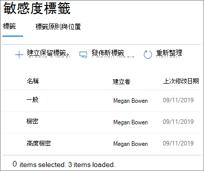
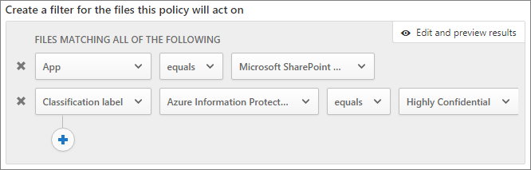

# 建立安全的來賓共用環境Create a secure guest sharing environment

在本文中，我們將逐一介紹用於在 Microsoft 365 中建立安全的來賓共用環境的各種選項。In this article, we'll walk through a variety of options for creating a secure guest sharing environment in Microsoft 365. 這是範例案例，讓您了解可用的選項。This is an example scenario to give you an idea of the options available. 您可以用不同的組合使用這些程序，以符合貴組織的安全性和合規性需求。You can use these procedures in different combinations to meet the security and compliance needs of your organization. 在本文的結尾，我們將逐步說明測試案例，以了解這些選項的共同運作方式。At the end of the article, we'll walk through a test case to see how some of these options work together.

此案例包括：This scenario includes:

- 為來賓設定多重要素驗證。Setting up multi-factor authentication for guests.
- 為來賓設定使用規定。Setting up a terms of use for guests.
- 設定每季來賓存取權檢閱，以定期驗證來賓是否繼續需要小組和網站的使用權限。Setting up quarterly guest access reviews to periodically validate whether guests continue to need permissions to teams and sites.
- 將來賓限制為僅限網頁存取未受管理的裝置。Restricting guests to web-only access for unmanaged devices.
- 設定工作階段逾時原則，以確保來賓每天進行驗證。Configuring a session timeout policy to ensure guests authenticate daily.
- 建立及發佈敏感度標籤以分類內容。Creating and publishing sensitivity labels to classify content.
- 建立高敏感度專案的敏感性資訊類型。Creating a sensitive information type for a highly sensitive project.
- 自動將 [高敏感度]\* \*標籤指派給包含敏感性資訊類型的文件。Automatically assigning a *highly sensitive* label to documents that contain the sensitive information type.
- 自動從標示為 [高敏感度]\*\* 的檔案移除來賓存取權。Automatically removing guest access from files labeled as *highly sensitive*.

本文中所述的部分選項要求來賓在 Azure Active Directory 中擁有帳戶。Some of the options discussed in this article require guests to have an account in Azure Active Directory. 若要確保共用檔案和資料夾時目錄中包含來賓，請使用 [SharePoint 和 OneDrive 與 Azure AD B2B 整合 (預覽版)](https://docs.microsoft.com/sharepoint/sharepoint-azureb2b-integration-preview)。To ensure that guests are included in the directory when you share files and folders with them, use the [SharePoint and OneDrive integration with Azure AD B2B Preview](https://docs.microsoft.com/sharepoint/sharepoint-azureb2b-integration-preview).

請注意，我們不會在本文中討論啟用來賓共用設定。Note that we won't discuss enabling guest sharing settings in this article. 如需針對不同案例啟用來賓共用的詳細資訊，請參閱[與組織外部人員共同作業](collaborate-with-people-outside-your-organization.md)。See [Collaborating with people outside your organization](collaborate-with-people-outside-your-organization.md) for details about enabling guest sharing for different scenarios.

## 為來賓設定多重要素驗證Set up multi-factor authentication for guests

多重要素驗證可大幅降低帳戶遭入侵的機會。Multi-factor authentication greatly reduces the chances of an account being compromised. 由於來賓使用者可能使用不符合任何控管原則或最佳做法的個人電子郵件帳戶，因此要求來賓進行多重要素驗證特別重要。Since guest users may be using personal email accounts that don't adhere to any governance policies or best practices, it's especially important to require multi-factor authentication for guests. 若來賓使用者的使用者名稱和密碼遭竊，要求第二個驗證要素能大幅降低未知人員存取網站和檔案的機會。If a guest user's username and password is stolen, requiring a second factor of authentication greatly reduces the chances of unknown parties gaining access to your sites and files.

在此範例中，我們將使用 Azure Active Directory 中的條件式存取原則為來賓設定多重要素驗證。In this example, we'll set up multi-factor authentication for guests by using a conditional access policy in Azure Active Directory.

若要為來賓設定多重要素驗證To set up multi-factor authentication for guests
1. 在 Microsoft Azure 中，搜尋*條件式存取*。In Microsoft Azure, search for *Conditional access*.
2. 在 **[條件式存取原則]** 刀鋒視窗中，按一下 **[新增原則]**。On the **Conditional Access - Policies** blade, click **New policy**.
3. 在 **[名稱]** 欄位中，輸入*來賓 MFA*。In the **Name** field, type *Guest MFA*.
4. 在 **[指派]** 底下，按一下 **[使用者和群組]**。Under **Assignments**, click **Users and groups**.
5. 在 **[使用者和群組]** 刀鋒視窗中，選取 **[選取使用者與群組]**，選取 **[所有來賓和外部使用者]** 核取方塊。On the **Users and groups** blade, select **Select users and groups**, select the **All guests and external users** check box.
6. 在 **[指派]** 底下，按一下**雲端應用程式或動作**。Under **Assignments**, click **Cloud apps or actions**.
7. 在 **雲端應用程式或動作** 刀鋒視窗中，選取 **[包含]** 索引標籤上的 **[所有雲端應用程式]**。On the **Cloud apps or actions** blade, select **All cloud apps** on the **Include** tab.
8. 在 **[存取控制]** 底下，按一下 **[授與]**。Under **Access controls**, click **Grant**.
9. 在 **[授與]** 刀鋒視窗中，選取 **[需要多重要素驗證]** 核取方塊，然後按一下 **[選取]**。On the **Grant** blade, select the **Require multi-factor authentication** check box, and then click **Select**.
10. 在 **[新增]** 刀鋒視窗的 **[啟用原則]** 底下，按一下 **[開啟]**，然後按一下 **[建立]**。On the **New** blade, under **Enable policy**, click **On**, and then click **Create**.

現在，來賓必須先註冊多重要素驗證，才能存取共用的內容、網站或小組。Now, guest will be required to enroll in multi-factor authentication before they can access shared content, sites, or teams.

### 詳細資訊More information

[規劃雲端式 Azure Multi-Factor Authentication 部署Planning a cloud-based Azure Multi-Factor Authentication deployment](https://docs.microsoft.com/azure/active-directory/authentication/howto-mfa-getstarted)

## 為來賓設定使用規定Set up a terms of use for guests

通常來賓使用者可能沒有與貴組織簽署保密合約或其他法律合約。Often times guest users may not have signed non-disclosure agreements or other legal agreements with your organization. 在來賓存取與他們共用的檔案之前，您可以要求來賓同意使用規定。You can require guests to agree to a terms of use before accessing files that are shared with them. 使用規定可在來賓首次嘗試存取共用檔案或網站時顯示。The terms of use can be displayed the first time they attempt to access a shared file or site.

若要建立使用規定，您必須先在 Word 或其他撰寫程式建立文件，然後將文件儲存為 .pdf 檔案。To create a terms of use, you first need to create the document in Word or another authoring program, and then save it as a .pdf file. 然後便能將此檔案上傳到 Azure AD。This file can then be uploaded to Azure AD.

若要建立 Azure AD 使用規定To create an Azure AD terms of use
1. 以全域管理員、安全性系統管理員或條件式存取系統管理員的身分登入 Azure。Sign in to Azure as a Global Administrator, Security Administrator, or Conditional Access Administrator.
2. 瀏覽至 [[使用規定]](https://aka.ms/catou)。Navigate to [Terms of use](https://aka.ms/catou).
3. 按一下 **[新增規定]**。Click **New terms**. 
   
4. 在 **[名稱]** 和 **[顯示名稱]** 方塊中，輸入*來賓使用規定*。In the **Name** and **Display name** boxes, type *Guest terms of use*.
6. 在**使用規定文件**，瀏覽及選取您建立的 PDF 檔案。For **Terms of use document**, browse to the pdf file that you created and select it.
7. 選取使用規定文件的語言。Select the language for your terms of use document.
8. 將 **[要求使用者展開使用規定]** 設為 **[開啟]**。Set **Require users to expand the terms of use** to **On**.
9. 在 **[條件式存取]** 底下的 **[強制使用條件式存取原則範本]** 清單中，選擇 **[稍後建立條件式存取原則]**。Under **Conditional Access**, in the **Enforce with Conditional Access policy template** list choose **Create conditional access policy later**.
10. 按一下 **[建立]**。Click **Create**.

建立使用規定後，下一個步驟是建立條件式存取原則，以顯示來賓使用者的使用規定。Once you've created the terms of use, the next step is to create a conditional access policy that displays the terms of use to guest users.

若要建立條件式存取原則To create a conditional access policy
1. 在 Microsoft Azure 中，搜尋*條件式存取*。In Microsoft Azure, search for *Conditional access*.
2. 在 **[條件式存取原則]** 刀鋒視窗中，按一下 **[新增原則]**。On the **Conditional Access - Policies** blade, click **New policy**.
3. 在 **[名稱]** 方塊中，輸入*來賓使用者的使用規定原則*。In the **Name** box, type *Guest user terms of use policy*.
4. 在 **[指派]** 底下，按一下 **[使用者和群組]**。Under **Assignments**, click **Users and groups**.
5. 在 **[使用者和群組]** 刀鋒視窗中，選取 **[選取使用者與群組]**，然後選取 **[所有來賓和外部使用者]** 核取方塊，然後按一下 **[完成]**。On the **Users and groups** blade, select **Select users and groups**, select the **All guests and external users** check box, and then click **Done**.
6. 在 **[指派]** 底下，按一下**雲端應用程式或動作**。Under **Assignments**, click **Cloud apps or actions**.
7. 在 **[包含]** 索引標籤上，選取 **[選取應用程式]**，然後按一下 **[選取]**。On the **Include** tab, select **Select apps**, and then click **Select**.
8. 在 **[選取]** 刀鋒視窗中，選取 **Microsoft Teams**、**Office 365 SharePoint Online** 和 **Outlook Groups**，然後按一下 **[選取]**。On the **Select** blade, select **Microsoft Teams**, **Office 365 SharePoint Online**, and **Outlook Groups**, and then click **Select**.
9. 在 **[雲端應用程式或動作]** 刀鋒視窗中，按一下 **[完成]**。On the **Cloud apps or actions** blade, click **Done**.
10. 在 **[存取控制]** 底下，按一下 **[授與]**。Under **Access controls**, click **Grant**.
11. 在 **[授與]** 刀鋒視窗中，選取 **[來賓使用規定]**，然後按一下 **[選取]**。On the **Grant** blade, select **Guest terms of use**, and then click **Select**.
12. 在 **[新增]** 刀鋒視窗的 **[啟用原則]** 底下，按一下 **[開啟]**，然後按一下 **[建立]**。On the **New** blade, under **Enable policy**, click **On**, and then click **Create**.

現在，來賓使用者首次嘗試存取貴組織中的內容、小組或網站時，必須接受使用規定。Now, the first time a guest user attempts to access content or a team or site in your organization, they will be required to accept the terms of use.

> [!NOTE]
> 使用條件式存取需要 Azure AD Premium P1 授權。Using Conditional Access requires an Azure AD Premium P1 license. 如需詳細資訊，請參閱[何謂條件式存取](https://docs.microsoft.com/azure/active-directory/conditional-access/overview)。For more information, see [What is Conditional Access](https://docs.microsoft.com/azure/active-directory/conditional-access/overview).

### 詳細資訊More information
[Azure Active Directory 使用規定Azure Active Directory terms of use](https://docs.microsoft.com/azure/active-directory/conditional-access/terms-of-use)

## 設定來賓存取權檢閱Set up guest access reviews

透過 Azure AD 中的存取權檢閱，您可以自動定期檢閱各小組和群組的使用者存取權。With access reviews in Azure AD, you can automate a periodic review of user access to various teams and groups. 透過特別要求來賓的存取權檢閱，您可以協助確保來賓使用者不會在非必要時持續存取貴組織的敏感性資訊。By requiring an access review for guests specifically, you can help ensure guest users do not retain access to your organization's sensitive information for longer than is necessary.

存取權檢閱可組織為程式。Access reviews can be organized into programs. 程式是一組類似的存取權檢閱，可用於組織存取權檢閱，以便進行報告和稽核。A program is a grouping of similar access reviews that can be used to organize access reviews for reporting and auditing purposes.

在此範例中，我們將建立來賓存取權檢閱程式。In this example, we'll create a program for guest access reviews.

若要建立程式To create a program
1. 登入 Azure 入口網站，並開啟 [Identity Governance 頁面](https://portal.azure.com/#blade/Microsoft_AAD_ERM/DashboardBlade)。Sign in to the Azure portal and open the [Identity Governance page](https://portal.azure.com/#blade/Microsoft_AAD_ERM/DashboardBlade).
2. 按一下左方功能表中的 **[程式]**。In the left menu, click **Programs**
3. 按一下 **[新增程式]**。Click **New program**.
4. 在 **[名稱]** 方塊中，輸入*來賓存取權檢閱程式*。In the **Name** box, type *Guest access review program*.
5. 在 **[描述]** 方塊中，輸入*用於來賓存取權檢閱的程式*。In the **Description** box, type *Program for guest access reviews*.
6. 按一下 **[建立]**。Click **Create**.

程式建立後，我們就可以建立來賓存取權檢閱，並將其與程式建立關聯。Once the program has been created, we can create a guest access review and associate it with the program.

若要設定來賓使用者存取權檢閱To set up a guest user access review
1. 在 [Identity Governance 頁面](https://portal.azure.com/#blade/Microsoft_AAD_ERM/DashboardBlade)的左側功能表中，按一下 **[存取權檢閱]**。On the [Identity Governance page](https://portal.azure.com/#blade/Microsoft_AAD_ERM/DashboardBlade), in the left menu, click **Access reviews**.
2. 按一下 **[新增存取權檢閱]**。Click **New access review**. 
   
3. 在 **[名稱]** 方塊中，輸入*每季來賓存取權檢閱*。In the **Name** box, type *Quarterly guest access review*.
4. 在 **[頻率]** 選擇 **[每季]**。For **Frequency**, choose **Quarterly**.
5. 在 **[結束]** 選擇 **[永不]**。For **End**, choose **Never**.
6. 在 **[範圍]**，選擇 **[僅限來賓使用者]**。For **Scope**, choose **Guest users only**.
7. 按一下 **[群組]**，選取要包含在存取權檢閱中的群組，然後按一下 **[選取]**。Click **Group**, select the groups that you want to include in the access review, and then click **Select**.
8. 按一下 **[程式]** 底下的 **[連結至程式]**。Under **Programs**, click **Link to program**.
9. 在 **[選取程式]** 刀鋒視窗中，選擇 **[來賓存取權檢閱程式]**On the **Select a program** blade, choose **Guest access review program**
10. 按一下 **[開始]**。Click **Start**.

系統會針對您指定的每個群組建立個別存取權檢閱。A separate access review is created for each group that you specify. 每個群組的群組擁有者每季會收到電子郵件，以核准或拒絕來賓對其群組的存取權。Group owners of each groups will be emailed quarterly to approve or deny guest access to their groups.

請注意，來賓可取得小組或群組，或個別檔案和資料夾的存取權。It's important to note that guests can be given access to teams or groups, or to individual files and folders. 取得檔案和資料夾存取權時，系統可能不會將來賓新增至任何特定群組。When given access to files and folders, guests may not be added to any particular group. 如果您要對不屬於某小組或群組的來賓使用者執行存取權檢閱，您可以在 Azure AD 中建立動態群組以包含所有來賓，然後建立該群組的存取權檢閱。If you want to do access reviews on guest users who don't belong to a team or group, you can create a dynamic group in Azure AD to contain all guests and then create an access review for that group.

### 詳細資訊More information
[使用 Azure AD 存取權檢閱來管理來賓存取權Manage guest access with Azure AD access reviews](https://docs.microsoft.com/azure/active-directory/governance/manage-guest-access-with-access-reviews)

[在 Azure AD 存取權檢閱中建立群組或應用程式的存取權檢閱Create an access review of groups or applications in Azure AD access reviews](https://docs.microsoft.com/azure/active-directory/governance/create-access-review)

## 為來賓使用者設定僅限網頁存取Set up web-only access for guest users

您可以要求來賓使用者僅使用網頁瀏覽器存取小組、網站和檔案，以縮小受攻擊面，並輕鬆進行管理。You can reduce your attack surface and ease administration by requiring guest users to access your teams, sites, and files by using a web browser only. Azure AD 條件式存取原則已設定完成。This is done with an Azure AD conditional access policy.

若要限制來賓僅使用網頁存取To restrict guests to web-ony access
1. 在 Microsoft Azure 中，搜尋*條件式存取*。In Microsoft Azure, search for *Conditional access*.
2. 在 **[條件式存取原則]** 刀鋒視窗中，按一下 **[新增原則]**。On the **Conditional Access - Policies** blade, click **New policy**.
3. 在 **[名稱]** 方塊中，輸入*來賓使用者瀏覽器存取*。In the **Name** box, type *Guest user browser access*.
4. 在 **[指派]** 底下，按一下 **[使用者和群組]**。Under **Assignments**, click **Users and groups**.
5. 在 **[使用者和群組]** 刀鋒視窗中，選取 **[選取使用者與群組]**，然後選取 **[所有來賓和外部使用者]** 核取方塊，然後按一下 **[完成]**。On the **Users and groups** blade, select **Select users and groups**, select the **All guests and external users** check box, and then click **Done**.
6. 在 **[指派]** 底下，按一下**雲端應用程式或動作**。Under **Assignments**, click **Cloud apps or actions**.
7. 在 **[包含]** 索引標籤上，選取 **[選取應用程式]**，然後按一下 **[選取]**。On the **Include** tab, select **Select apps**, and then click **Select**.
8. 在 **[選取]** 刀鋒視窗中，選取 **Microsoft Teams**、**Office 365 SharePoint Online** 和 **Outlook Groups**，然後按一下 **[選取]**。On the **Select** blade, select **Microsoft Teams**, **Office 365 SharePoint Online**, and **Outlook Groups**, and then click **Select**.
9. 在 **[雲端應用程式或動作]** 刀鋒視窗中，按一下 **[完成]**。On the **Cloud apps or actions** blade, click **Done**.
10. 按一下 **[指派]** 底下的 **[條件]**。Under **Assignments**, click **Conditions**.
11. 在 **[條件]** 刀鋒視窗中，按一下 **[用戶端應用程式]**。On the **Conditions** blade, click **Client apps**.
12. 在 **[用戶端應用程式]** 刀鋒視窗中，按一下 **[是]** 進行 **[設定]**，然後選取 **[行動裝置 App 及桌面用戶端]** 和 **[新式驗證用戶端]** 設定。On the **Client apps** blade, click **Yes** for **Configure**, and then select the **Mobile apps and desktop clients** and **Modern authentication clients** settings. 
    
13. 按一下 **[完成]**，然後在 **[條件]** 刀鋒視窗中，再按一下 **[完成]**。Click **Done**, and then on the **Conditions** blade, click **Done** again.
14. 在 **[存取控制]** 底下，按一下 **[授與]**。Under **Access controls**, click **Grant**.
15. 在 **[授與]** 刀鋒視窗中，選取 **[裝置需要標記為合規]** 和 **[需要已加入混合式 Azure AD 的裝置]**。 On the **Grant** blade, select **Require device to be marked as compliant** and **Require Hybrid Azure AD joined device**.
16. 在 **[針對多個控制項]** 底下，選取 **[需要其中一個選取的控制項]**，然後按一下 **[選取]**。Under **For multiple controls**, select **Require one of the selected controls**, and then click **Select**.
17. 在 **[新增]** 刀鋒視窗的 **[啟用原則]** 底下，按一下 **[開啟]**，然後按一下 **[建立]**。On the **New** blade, under **Enable policy**, click **On**, and then click **Create**.

## 設定來賓使用者的工作階段逾時Configure a session timeout for guest users

若來賓使用者的裝置不安全，要求來賓定期驗證可降低未知的使用者存取貴組織內容的可能性。Requiring guests to authenticate on a regular basis can reduce the possibility of unknown users accessing your organization's content if a guest user's device isn't kept secure. 您可以在 Azure AD 中設定來賓使用者的工作階段逾時條件式存取原則。You can configure a session timeout conditional access policy for guest users in Azure AD.

若要設定來賓工作階段逾時原則To configure a guest session timeout policy
1. 在 Microsoft Azure 中，搜尋*條件式存取*。In Microsoft Azure, search for *Conditional access*.
2. 在 **[條件式存取原則]** 刀鋒視窗中，按一下 **[新增原則]**。On the **Conditional Access - Policies** blade, click **New policy**.
3. 在 **[名稱]** 方塊中，輸入*來賓工作階段逾時*。In the **Name** box, type *Guest session timeout*.
4. 在 **[指派]** 底下，按一下 **[使用者和群組]**。Under **Assignments**, click **Users and groups**.
5. 在 **[使用者和群組]** 刀鋒視窗中，選取 **[選取使用者與群組]**，然後選取 **[所有來賓和外部使用者]** 核取方塊，然後按一下 **[完成]**。On the **Users and groups** blade, select **Select users and groups**, select the **All guests and external users** check box, and then click **Done**.
6. 在 **[指派]** 底下，按一下**雲端應用程式或動作**。Under **Assignments**, click **Cloud apps or actions**.
7. 在 **[包含]** 索引標籤上，選取 **[選取應用程式]**，然後按一下 **[選取]**。On the **Include** tab, select **Select apps**, and then click **Select**.
8. 在 **[選取]** 刀鋒視窗中，選取 **Microsoft Teams**、**Office 365 SharePoint Online** 和 **Outlook Groups**，然後按一下 **[選取]**。On the **Select** blade, select **Microsoft Teams**, **Office 365 SharePoint Online**, and **Outlook Groups**, and then click **Select**.
9. 在 **[雲端應用程式或動作]** 刀鋒視窗中，按一下 **[完成]**。On the **Cloud apps or actions** blade, click **Done**.
10. 在 **[存取控制]** 底下，按一下 **[工作階段]**。Under **Access controls**, click **Session**.
11. 在 **[工作階段]** 刀鋒視窗中，選取 **[登入頻率]**。On the **Session** blade, select **Sign-in frequency**.
12. 選取 **1**，並在時間週期選取 **[天]** ，然後按一下 **[選取]**。Select **1** and **Days** for the time period, and then click **Select**.
13. 在 **[新增]** 刀鋒視窗的 **[啟用原則]** 底下，按一下 **[開啟]**，然後按一下 **[建立]**。On the **New** blade, under **Enable policy**, click **On**, and then click **Create**.

## 建立敏感度標籤Create sensitivity labels

您可透過多種方式使用敏感度標籤來分類及保護貴組織的資訊。Sensitivity labels can be used in a variety of ways to classify and protect your organization's information. 在此範例中，我們將說明如何使用標籤來協助您管理來賓對共用檔案和資料夾的存取權。In this example, we'll look at how labels can be used to help you manage guest access to shared files and folders.

首先，我們會在 Microsoft 365 合規性中心建立三個敏感度標籤：First, we'll create three sensitivity labels in the Microsoft 365 Compliance Center:

- 一般General
- 敏感度sensitive
- 高敏感度Highly sensitive

使用下列程序建立 *[一般]* 和 *[敏感度]* 標籤。Use the following procedure to create the *General* and *sensitive* labels.

若要建立分類標籤 ([一般] 和 [敏感度])To create a classification label (General and sensitive)
1. 在 [Microsoft 365 合規性中心](https://compliance.microsoft.com)的左側瀏覽窗格中，展開 **[分類]**，然後按一下 **[敏感度標籤]**。In the [Microsoft 365 Compliance Center](https://compliance.microsoft.com), in the left navigation, expand **Classification**, and then click **Sensitivity labels**.
2. 按一下 [建立標籤]\*\*\*\*。Click **Create a label**.
3. 在 **[標籤名稱]** 中，輸入 *[一般]* 或 *[敏感度]*。In **Label name**, type *General* or *sensitive*.
4. 在 **[工具提示]** 中，輸入*可與員工、來賓和合作夥伴共用的一般資訊*，或輸入*敏感度資訊，只與員工和授權來賓共用*，然後按一下 **[下一步]**。In **Tooltip**, type *General information that can be shared with employees, guests, and partners* or *sensitive information. Share only with employees and authorized guests*, and then click **Next**.
5. 將加密**關閉**，然後按一下 **[下一步]**。Leave encryption **Off** and click **Next**.
6. 將內容標記**關閉**，然後按一下 **[下一步]**。Leave content marking **Off** and click **Next**.
7. 將端點資料外洩防護**關閉**，然後按一下 **[下一步]**。Leave endpoint data loss prevention **Off** and click **Next**.
8. 將自動標籤**關閉**，然後按一下 **[下一步]**。Leave auto labeling **Off** and click **Next**.
9. 按一下 [建立]\*\*\*\*。Click **Create**.

我們可以使用 *[高敏感度]* 標籤在文件上自動加上浮水印與標籤。With the *Highly sensitive* label, we'll add automatic watermarking of documents with the label.

若要建立分類標籤 (高敏感度)To create a classification label (Highly sensitive)
1. 按一下 [建立標籤]\*\*\*\*。Click **Create a label**.
2. 在 **[標籤名稱]** 中，輸入 *[高度敏感度]*。In **Label name**, type *Highly sensitive*.
3. 在 **[工具提示]** 中，輸入*高敏感度資訊，請勿與來賓共用*，然後按一下 **[下一步]**。In **Tooltip**, type *Highly sensitive information. Do not share with guests*, and then click **Next**.
4. 將加密**關閉**，然後按一下 **[下一步]**。Leave encryption **Off** and click **Next**.
5. 將內容標記**開啟**，選取 **[新增頁首]** 核取方塊，然後按一下 **[自訂文字]**。Turn content marking **On**, select the **Add a header** check box, and then click **Customize text**.
6. 在頁首文字輸入*高敏感度*，然後按一下 **[儲存]**。Type *Highly sensitive* for the header text and click **Save**.
7. 在**內容標記**頁面上，將內容標記**開啟**。On the **Content marking** page, turn content marking **On**.
8. 選取 **[新增浮水印]** 核取方塊，然後按一下 **[自訂文字]**。Select the **Add a watermark** check box, and then click **Customize text**.
9. 在**浮水印文字**輸入*高敏感度*。For **Watermark text**, type *Highly sensitive*.
10. 在**字型大小**輸入 *24*，然後按一下 **[儲存]**。Type *24* for **Font size**, and then click **Save**.
11. 在**內容標記**頁面上，按一下 **[下一步]**。On the **Content marking** page, click **Next**.
12. 將端點資料外洩防護**關閉**，然後按一下 **[下一步]**。Leave endpoint data loss prevention **Off** and click **Next**.
13. 將自動標籤**關閉**，然後按一下 **[下一步]**。Leave auto labeling **Off** and click **Next**.
14. 按一下 **[建立]**。Click **Create**.

建立標籤後，下一個步驟是發佈標籤。Once you've created the labels, the next step is to publish them. 

若要發佈標籤To publish labels
1. 在**敏感度標籤**頁面上，按一下 **[發佈標籤]**。On the **Sensitivity labels** page, click **Publish labels**.
2. 按一下 **[選擇要發佈的標籤]**。Click **Choose labels to publish**.
3. 按一下 **[新增]**，選取您所建立的標籤，然後按一下 **[新增]**。Click **Add**, select the labels that you created, and then click **Add**.
4. 按一下 **[完成]**。Click **Done**.
5. 按一下 **[下一步]**。Click **Next**.
6. 將使用者和群組設為**全部**，然後按一下 **[下一步]**。Leave the users and groups set to **All** and click **Next**.
7. 在 **[預設將此標籤套用到文件和電子郵件]** 清單中，選擇 **[一般]**，然後按一下 **[下一步]**。In the **Apply this label by default to documents and email** list, choose **General**, and then click **Next**.
8. 在**原則設定**頁面上的名稱輸入*文件敏感度*，然後按一下 **[下一步]**。On the **Policy settings** page, type *Document sensitivity* for the name, and then click **Next**.
9. 按一下 **[發佈]**。Click **Publish**.

發佈標籤後，Office 桌面 App 的使用者便能使用標籤。With the labels published, they're available to users of Office desktop apps. 當使用者套用 **[高敏感度]** 標籤時，浮水印會自動新增到文件。When users apply the **Highly sensitive** label, a watermark is automatically added to the document.

### 詳細資訊More information
[敏感度標籤概觀Overview of sensitivity labels](https://docs.microsoft.com/Office365/SecurityCompliance/sensitivity-labels)

## 建立高敏感度專案的敏感性資訊類型Create a sensitive information type for a highly sensitive project

敏感性資訊類型是預先定義的字串，可用於原則工作流程中，以強制執行法規遵循需求。Sensitive information types are predefined strings that can be used in policy workflows to enforce compliance requirements. Microsoft 365 合規性中心隨附超過 100 種敏感性資訊類型，包括駕照編號、信用卡號、銀行帳號等。The Microsoft 365 Compliance Center comes with over one hundred sensitive information types, including driver's license numbers, credit card numbers, bank account numbers, etc.

您可以建立自訂敏感性資訊類型以協助管理貴組織的特定內容。You can create custom sensitive information types to help manage content specific to your organization. 在此範例中，我們將建立高敏感度專案的敏感性資訊類型。In this example, we'll create a custom sensitive information type for a highly sensitive project. 然後，我們可以使用此敏感性資訊類型自動套用分類標籤。We can then use this sensitive information type to automatically apply a classification label.

若要建立敏感性資訊類型To create a sensitive information type
1. 在 [Microsoft 365 合規性中心](https://compliance.microsoft.com)的左側瀏覽窗格中，展開 **[分類]**，然後按一下 **[敏感性資訊類型]**。In the [Microsoft 365 Compliance Center](https://compliance.microsoft.com), in the left navigation, expand **Classification**, and then click **Sensitive info types**.
2. 按一下 **[建立]**。Click **Create**.
3. 在**名稱**和**描述**輸入 **Saturn 專案**，然後按一下 **[下一步]**。For **Name** and **Description**, type **Project Saturn**, and then click **Next**.
4. 按一下 **[新增元素]**。Click **Add an element**.
5. 在 **[偵測內容包含]** 清單中，選取 **[關鍵字]**，然後在關鍵字方塊中輸入 *Saturn 專案*。On the **Detect content containing** list, select **Keywords**, and then type *Project Saturn* in the keyword box.
6. 按一下 **[下一步]**，然後按一下 **[完成]**。Click **Next**, and then click **Finish**.
7. 若系統詢問您是否要測試敏感性資訊類型，請按一下 **[否]**。If asked if you would like to test the sensitive information type, click **No**.

### 詳細資訊More information
[自訂敏感性資訊類型Custom sensitive information types](https://docs.microsoft.com/Office365/SecurityCompliance/custom-sensitive-info-types)

## 建立原則以根據敏感性資訊類型指派標籤Create a policy to assign a label based on a sensitive information type

建立敏感性資訊類型後，我們可以在 Microsoft Cloud App Security 中建立檔案原則，以將 *[高敏感度]* 標籤自動套用至包含 *Saturn 專案*字串的文件。Once the sensitive information type is created, we can create a file policy in Microsoft Cloud App Security to apply the *Highly sensitive* label to documents that contain the *Project Saturn* string automatically.

> [!NOTE]
> 有複寫程序可讓敏感度標籤在 Cloud App Security 中使用。There is a replication process that makes sensitivity labels available in Cloud App Security. 您可能無法立即查看原則可用的標籤。You may not see the label available for a policy right away.

若要建立以敏感性資訊類型為基礎的檔案原則To create a sensitive information type-based file policy
1. 開啟 [Microsoft Cloud App Security](https://portal.cloudappsecurity.com)。Open [Microsoft Cloud App Security](https://portal.cloudappsecurity.com).
2. 在左側瀏覽窗格中，展開 **[控制]**，然後按一下 **[原則]**。In the left navigation, expand **Control**, and then click **Policies**.
3. 按一下 **[建立原則]**，然後選擇 **[檔案原則]**。Click **Create policy**, and then choose **File policy**.
4. 在**原則名稱**中輸入 *Saturn 專案標籤*。For **Policy name**, type *Project Saturn labeling*.
5. 在 **[為套用這項原則的檔案建立篩選]** 底下，按兩下 X 以刪除預設篩選。Under **Create a filter for the files this policy will act on**, click X twice to delete the default filters.
7. 在 **[選取篩選器]** 清單中，選擇 **[應用程式]**，然後從 **[選取應用程式...]** 清單選取 **[Microsoft SharePoint Online]**。In the **Select a filter** list, choose **App**, and then select **Microsoft SharePoint Online** from the **Select apps...** list.
8. 在 **[檢查方法]** 底下，選擇 **[資料分類服務]**。Under **Inspection method**, choose **Data classification service**.
9. 在 **[選擇檢查類型]** 清單中，選擇 **[敏感性資訊類型]**。On the **Choose inspection type** list, choose **Sensitive information type**.
10. 搜尋並選取 *Saturn 專案*敏感度標籤，然後按一下 **[完成]**。Search for and select the *Project Saturn* sensitivity label, and then click **Done**. 
   
11. 在 **[控管]** 底下，展開 **[Microsoft SharePoint Online]**。Under **Governance**, expand **Microsoft SharePoint Online**.
12. 選取 **[套用分類標籤]** 核取方塊，然後選取 **[高敏感度]** 標籤。Select the **Apply classification label** check box and select the **Highly sensitive** label.
13. 按一下 [建立]\*\*\*\*。Click **Create**.

建立原則後，當使用者在文件中輸入「Saturn 專案」時，Cloud App Security 會在掃描檔案時自動套用 *[高敏感度]* 標籤。With the policy in place, when a user types "Project Saturn" into a document, Cloud App Security will automatically apply the *Highly sensitive* label when it scans the file.

### 詳細資訊More information
[檔案原則File policies](https://docs.microsoft.com/cloud-app-security/data-protection-policies)

## 建立原則以移除高敏感度檔案的來賓存取權Create a policy to remove guest access to highly sensitive files

在本文的範例中，具有 *[高敏感度]* 標籤的檔案不應與來賓共用。In the example in this article, files with the *Highly sensitive* label shouldn't be shared with guests. 我們可以在 Cloud App Security 中建立檔案原則，以自動移除具有該標籤的檔案。We can create a file policy in Cloud App Security that automatically removes guest access from files with that label.

請注意，這並不會妨礙使用者共用或重新共用這些檔案。Note that this doesn't prevent users from sharing or re-sharing these files. 您仍得信任使用者遵循儲存在允許來賓共用之網站中的檔案控管原則。You're still reliant on your users to follow your governance policies for files that are stored in sites that allow guest sharing. 不過，這是一個實用的工具，可讓您與來賓共用含敏感性資訊的檔案後，將來賓的檔案存取權移除。However, this can be a useful tool for removing guest access from files that had sensitive information added to them after they were shared with guests.

若要建立以標籤為基礎的檔案原則To create a label-based file policy
1. 開啟 [Microsoft Cloud App Security](https://portal.cloudappsecurity.com)。Open [Microsoft Cloud App Security](https://portal.cloudappsecurity.com).
2. 在左側瀏覽窗格中，展開 **[控制]**，然後按一下 **[原則]**。In the left navigation, expand **Control**, and then click **Policies**.
3. 按一下 **[建立原則]**，然後選擇 **[檔案原則]**。Click **Create policy**, and then choose **File policy**.
4. 在**原則名稱**中輸入 *Saturn 專案 - 移除來賓存取權*。For **Policy name**, type *Project Saturn - remove guest access*.
5. 在 **[為套用這項原則的檔案建立篩選]** 底下，按兩下 X 以刪除預設篩選。Under **Create a filter for the files this policy will act on**, click X twice to delete the default filters.
6. 在 **[選取篩選器]** 清單中，選擇 **[應用程式]**，然後從 **[選取應用程式...]** 清單選取 **[Microsoft SharePoint Online]**。In the **Select a filter** list, choose **App**, and then select **Microsoft SharePoint Online** from the **Select apps...** list.
7. 按一下 **[加入篩選]**。Click **Add a filter**.
8. 在 **[選取篩選器]** 清單中，選擇 **[分類標籤]**，然後從 **[選取篩選器...]** 清單選取 **[Azure 資訊保護]**。In the **Select a filter** list, choose **Classification label**, and then select **Azure Information Protection** from the **Select filter...** list.
9. 在 **[選取分類標籤]** 清單中，選取 **[高敏感度]**。In the **Select classification label** list, select **Highly sensitive**. 
   
10. 在 **[控管]** 底下，展開 **[Microsoft SharePoint Online]**。Under **Governance**, expand **Microsoft SharePoint Online**.
11. 選取 **[將原則對應摘要傳送給檔案擁有者]** 和 **[移除外部使用者]** 核取方塊。Select the **Send policy-match digest to file owner** and **Remove external users** check boxes.
12. 在自訂通知訊息輸入*此檔案具有高敏感度，公司原則禁止與來賓共用此檔案*。For the custom notification message, type *This file is highly sensitive. Company policy prohibits sharing it with guests*.
13. 按一下 [建立]\*\*\*\*。Click **Create**.

請注意，此原則會移除使用*特定人員*連結共用的檔案存取權。It's important to note, that this policy removes access for files shared using a *Specific people* link. 而不會移除未驗證 (*任何人*) 連結的存取權。It doesn't remove access from unauthenticated (*Anyone*) links. 如果來賓是整個網站或小組的成員，也不會移除存取權。It also doesn't remove access if the guest is a member of the site or team as a whole. 如果您計劃讓具有來賓成員的網站或團隊擁有高敏感度文件，請考慮[在 Teams 中使用私人頻道](https://support.office.com/article/60ef929a-4d68-418b-bf4f-5784db184ec9)，且只允許組織中的成員使用私人頻道。If you plan to have highly sensitive documents in a site or team with guest members, consider using [private channels in Teams](https://support.office.com/article/60ef929a-4d68-418b-bf4f-5784db184ec9) and only allowing members of your organization in the private channels.

## 測試解決方案Test the solution

若要測試本文所述的解決方案，請建立 Word 文件，並將該文件儲存到文件庫。To test the solution described in this article, create a Word document and save it to a document library. 與來賓使用者共用檔案。Share the file with a guest user. 來賓嘗試存取文件時，必須註冊多重要素驗證，然後接受使用規定。When the guest attempts to access the document, they should be required to enroll in multi-factor authentication, and then accept the terms of use.

一旦來賓取得文件的存取權，請在文件中輸入 *Saturn 專案*並儲存文件。Once the guest has access to the document, type *Project Saturn* in the document and save it. Cloud App Security 掃描文件時，系統應套用 *[高敏感度]* 標籤，來賓使用者便無法再存取該文件。Once Cloud App Security scans the document, the *Highly sensitive* label should be applied and the guest user should no longer have access to it.

您可以以各種組合來使用本文所述的工具，為貴組織建立具生產力且安全的來賓共用環境。You can use the tools described in this article in various combinations to help create a productive but safe guest sharing environment for your organization.

## 其他選項Additional options

Microsoft 365 和 Azure Active Directory 中有一些其他選項可以協助保護您的來賓共用環境。There are some additional options in Microsoft 365 and Azure Active Directory that can help secure your guest sharing environment.

- 您可以建立允許或拒絕共用網域的清單，以限制要共用的使用者。You can create a list of allowed or denied sharing domains to limit who users can share with. 如需詳細資訊，請參閱[依網域限制 SharePoint 和 OneDrive 內容的共用](https://docs.microsoft.com/sharepoint/restricted-domains-sharing)和[允許或封鎖對特定組織的 B2B 使用者的邀請](https://docs.microsoft.com/azure/active-directory/b2b/allow-deny-list)。See [Restrict sharing of SharePoint and OneDrive content by domain](https://docs.microsoft.com/sharepoint/restricted-domains-sharing) and [Allow or block invitations to B2B users from specific organizations](https://docs.microsoft.com/azure/active-directory/b2b/allow-deny-list) for more information.
- 您可以限制使用者可以連線到哪些其他 Azure Active Directory 租用戶。You can limit which other Azure Active Directory tenants your users can connect to. 如需詳細資訊，請參閱[使用租用戶限制管理 SaaS 雲端應用程式的存取](https://docs.microsoft.com/azure/active-directory/manage-apps/tenant-restrictions)。See [Use tenant restrictions to manage access to SaaS cloud applications](https://docs.microsoft.com/azure/active-directory/manage-apps/tenant-restrictions) for information.
- 您可以建立受管理環境，讓合作夥伴能夠協助管理來賓帳戶。You can create a managed environment where partners can help manage guest accounts. 如需詳細資訊，請參閱[建立 B2B 外部網路](https://docs.microsoft.com/Office365/Enterprise/b2b-extranet)。See [Create a B2B extranet with managed guests](https://docs.microsoft.com/Office365/Enterprise/b2b-extranet) for information.

## 另請參閱See Also

[與來賓共用時限制意外暴露檔案Limit accidental exposure to files when sharing with guests](share-limit-accidental-exposure.md)

[與未驗證使用者共用檔案和資料夾的最佳做法Best practices for sharing files and folders with unauthenticated users](best-practices-anonymous-sharing.md)

[使用受管理來賓建立 B2B 外部網路Create a B2B extranet with managed guests](b2b-extranet.md)
