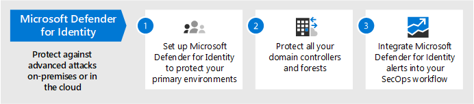

# 跨 Microsoft 365 設定威脅防護功能Configure threat protection capabilities across Microsoft 365

請遵循下列步驟來設定跨 Microsoft 365 的威脅防護。Follow these steps to configure threat protection across Microsoft 365.

## 步驟1：設定多重要素驗證和條件式存取原則Step 1: Set up multi-factor authentication and Conditional Access policies

[多重要素驗證](/azure/active-directory/authentication/concept-mfa-howitworks) (MFA) 要求使用者使用撥打電話或驗證器應用程式來驗證其身分識別。[Multi-factor authentication](/azure/active-directory/authentication/concept-mfa-howitworks) (MFA) requires users to verify their identity with a phone call or authenticator app. [條件式存取原則](/azure/active-directory/conditional-access/overview) 定義必須滿足的特定需求，使用者才能存取 Microsoft 365 中的應用程式和資料。[Conditional access policies](/azure/active-directory/conditional-access/overview) define certain requirements that must be met in order for users to access apps and data in Microsoft 365. MFA 和條件式存取原則共同運作，以保護您的組織。MFA and Conditional Access policies work together to protect your organization. 例如，如果有人嘗試使用未啟用 MFA 的帳戶登入行動裝置，且條件式存取原則要求 MFA 生效，該使用者將無法登入。For example, if someone attempts to sign in from a mobile device using an account that  is not enabled for MFA, and a Conditional Access policy requires MFA to be in effect, that user will be prevented from signing in.  

Microsoft 已測試並建議一組特定的條件式存取和相關原則，以保護所有 SaaS 應用程式的存取，尤其是 Microsoft 365。Microsoft has tested and recommends a specific set of Conditional Access and related policies for protecting access to all of your SaaS applications, especially Microsoft 365. 建議使用原則進行基準、機密和高管制的保護。Policies are recommended for baseline, sensitive, and highly regulated protection. 從執行基準保護的原則開始。Begin by implementing the policies for baseline protection. 

設定身分 
 [請參閱較大版本的此影像](https://github.com/MicrosoftDocs/microsoft-365-docs/raw/public/microsoft-365/media/microsoft-365-policies-configurations/Identity_device_access_policies_byplan.png)
[See a larger version of this image](https://github.com/MicrosoftDocs/microsoft-365-docs/raw/public/microsoft-365/media/microsoft-365-policies-configurations/Identity_device_access_policies_byplan.png)

### 若要執行 Microsoft 365 的基準保護To implement baseline protection for Microsoft 365

 

1. [設定必要條件，包含 AZURE AD Identity Protection](../security/office-365-security/identity-access-prerequisites.md)。[Configure prerequisites, including Azure AD Identity Protection](../security/office-365-security/identity-access-prerequisites.md).
2. [設定一般身分識別和裝置存取原則](../security/office-365-security/identity-access-policies.md) ，以進行基準保護。[Configure common identity and device access policies](../security/office-365-security/identity-access-policies.md) for baseline protection.
3. 設定 [來賓使用者](../security/office-365-security/identity-access-policies-guest-access.md)、 [Microsoft 團隊](../security/office-365-security/teams-access-policies.md)、 [Exchange online](../security/office-365-security/secure-email-recommended-policies.md)和 [SharePoint 線上及 OneDrive](../security/office-365-security/sharepoint-file-access-policies.md)的原則。Configure policies for [guest users](../security/office-365-security/identity-access-policies-guest-access.md), [Microsoft Teams](../security/office-365-security/teams-access-policies.md), [Exchange Online](../security/office-365-security/secure-email-recommended-policies.md), and [SharePoint Online and OneDrive](../security/office-365-security/sharepoint-file-access-policies.md).

### 保護身分識別的詳細資訊More information about protecting identities

- [身分識別與裝置存取設定Identity and device access configurations](../security/office-365-security/microsoft-365-policies-configurations.md)
- [Azure MFA 的安全性指導方針Security guidance for Azure MFA](/azure/active-directory/authentication/multi-factor-authentication-security-best-practices)

## 步驟2：設定 Microsoft Defender 身分識別Step 2: Configure Microsoft Defender for Identity

[Microsoft Defender For Identity](/azure-advanced-threat-protection/what-is-atp) 是雲端式的安全性解決方案，可搭配您的內部部署 Active Directory 網域服務與您的內部部署 Active Directory 網域服務 (AD DS) 信號來識別、偵測和調查組織中的高級威脅、遭到破壞的身分識別，以及惡意的內幕程式列動。[Microsoft Defender for Identity](/azure-advanced-threat-protection/what-is-atp) is a cloud-based security solution that works with your on-premises Active Directory Domain Services (AD DS) signals to identify, detect, and investigate advanced threats, compromised identities, and malicious insider actions directed at your organization.

Microsoft Defender for Identity 可讓安全性作業 (SecOps) 分析員和安全性專業人員，以偵測混合式環境中的高級攻擊：Microsoft Defender for Identity enables security operations (SecOps) analysts and security professionals struggling to detect advanced attacks in hybrid environments to:
- 使用以教學為基礎的分析來監控使用者、實體行為和活動。Monitor users, entity behavior, and activities with learning-based analytics.
- 保護儲存在 Active Directory 中的使用者身分識別和認證。Protect user identities and credentials stored in Active Directory.
- 識別並調查整個狙殺鍊中的可疑使用者活動和進階攻擊。Identify and investigate suspicious user activities and advanced attacks throughout the kill chain.
- 以簡單的時間表提供清楚的事件資訊，以進行快速分級。Provide clear incident information on a simple timeline for fast triage.

### 設定 Microsoft Defender 身分識別To set up Microsoft Defender for Identity

 

1. 為身分[識別設定 Microsoft Defender](/azure-advanced-threat-protection/install-atp-step1)以保護主要環境。[Set up Microsoft Defender for Identity](/azure-advanced-threat-protection/install-atp-step1) to protect your primary environments.
2. 保護所有的 [網域控制站](/azure-advanced-threat-protection/atp-sensor-monitoring) 和 [樹](/azure-advanced-threat-protection/atp-multi-forest)系。Protect all your [domain controllers](/azure-advanced-threat-protection/atp-sensor-monitoring) and [forests](/azure-advanced-threat-protection/atp-multi-forest).
3. 將 [Microsoft Defender 的身分識別警示](/azure-advanced-threat-protection/suspicious-activity-guide?tabs=external) 整合到您的安全性作業中 (SecOps) 工作流程。Integrate [Microsoft Defender for Identity alerts](/azure-advanced-threat-protection/suspicious-activity-guide?tabs=external) into your security operations (SecOps) workflow.

### Microsoft Defender 身分識別的詳細資訊More information about Microsoft Defender for Identity

- [什麼是適用於身分識別的 Microsoft Defender？What is Microsoft Defender for Identity?](/azure-advanced-threat-protection/what-is-atp)
- [影片： Microsoft Defender 身分識別簡介Video: Introduction to Microsoft Defender for Identity](https://www.youtube.com/watch?reload=9&v=EGY2m8yU_KE)
- [用於身分識別部署的 Microsoft DefenderMicrosoft Defender for Identity deployment](/azure-advanced-threat-protection/what-is-atp#whats-next)

## 步驟3：開啟 Microsoft 365 DefenderStep 3: Turn on Microsoft 365 Defender

[Microsoft 365 Defender](../security/mtp/microsoft-threat-protection.md) 會將信號和分割功能結合成單一解決方案。[Microsoft 365 Defender](../security/mtp/microsoft-threat-protection.md) combines signals and orchestrates capabilities into a single solution. 透過整合的 Microsoft 365 Defender 解決方案，安全性專業人員可以結合每一種產品接收及決定威脅的完整範圍和影響，以結合威脅。如何進入環境、受到影響的內容，以及目前對組織的影響。With the integrated Microsoft 365 Defender solution, security professionals can stitch together the threat signals that each of these products receive and determine the full scope and impact of the threat; how it entered the environment, what it's affected, and how it's currently impacting the organization. Microsoft 365 Defender 採取自動動作，以防止或停止攻擊及自我修復受影響的信箱、端點和使用者身分識別。Microsoft 365 Defender takes automatic action to prevent or stop the attack and self-heal affected mailboxes, endpoints, and user identities.

Microsoft 365 Defender 在工作負載中統一的提醒、事件、自動化調查和回應，以及高級搜尋 (Microsoft Defender for Identity、Microsoft Defender for Office 365、Microsoft Defender for Endpoint 及 Microsoft Cloud App Security) 成為單一玻璃體驗的單一窗格。Microsoft 365 Defender unifies alerts, incidents, automated investigation and response, and advanced hunting across workloads (Microsoft Defender for Identity, Microsoft Defender for Office 365, Microsoft Defender for Endpoint, and Microsoft Cloud App Security) into a single pane of glass experience. 在您設定一或多個 Office 365 服務的 Defender 後，請開啟 Microsoft 365 Defender。After you have configured one or more of your Defender for Office 365 services, turn on Microsoft 365 Defender. 新功能會連續新增至 Microsoft 365 Defender;請考慮改為接收預覽功能。New features are added continually to Microsoft 365 Defender; consider opting in to receive preview features.

### 設定 Microsoft 365 DefenderTo set up Microsoft 365 Defender

 

1. [複查必要條件](../security/mtp/prerequisites.md)。[Review the prerequisites](../security/mtp/prerequisites.md).
2. [開啟 Microsoft 365 Defender](../security/mtp/mtp-enable.md)。[Turn on Microsoft 365 Defender](../security/mtp/mtp-enable.md).
3. [加入宣告預覽功能](../security/mtp/preview.md)。[Opt in for preview features](../security/mtp/preview.md).

### Microsoft 365 Defender 的詳細資訊More information about Microsoft 365 Defender

- [什麼是 Microsoft 365 Defender?What is Microsoft 365 Defender?](../security/mtp/microsoft-threat-protection.md)
- [Microsoft 365 Defender 的新功能What's new in Microsoft 365 Defender](../security/mtp/whats-new.md)

## 步驟4：設定適用于 Office 的 Microsoft Defender 365Step 4: Configure Microsoft Defender for Office 365

[Microsoft Defender For Office 365](../security/office-365-security/office-365-atp.md) 針對電子郵件中的惡意威脅 (附件和 URLs) 、Office 檔和共同作業工具進行保護。[Microsoft Defender for Office 365](../security/office-365-security/office-365-atp.md) safeguards your organization against malicious threats in email messages (attachments and URLs), Office documents, and collaboration tools. 下表列出 microsoft 365 E5 包含的 Microsoft Defender for Office 365 功能和功能：The following table lists Microsoft Defender for Office 365 features and capabilities that are included in Microsoft 365 E5:

|設定、保護及偵測功能Configuration, protection, and detection capabilities|自動化、調查、修正及教育功能Automation, investigation, remediation, and education capabilities|
|---|---|
|[安全附件Safe Attachments](../security/office-365-security/atp-safe-attachments.md) [安全連結Safe Links](../security/office-365-security/atp-safe-links.md) [安全文件Safe Documents](../security/office-365-security/safe-docs.md) [適用於 SharePoint、OneDrive 及 Microsoft Teams 的 ATPATP for SharePoint, OneDrive, and Microsoft Teams](../security/office-365-security/atp-for-spo-odb-and-teams.md) [適用於 Office 365 的 Defender 中的反網路釣魚防護Anti-phishing in Defender for Office 365 protection](../security/office-365-security/set-up-anti-phishing-policies.md#exclusive-settings-in-anti-phishing-policies-in-microsoft-defender-for-office-365)|[威脅追蹤工具Threat Trackers](../security/office-365-security/threat-trackers.md) [威脅總管Threat Explorer](../security/office-365-security/threat-explorer.md) [自動調查及回應Automated investigation and response](../security/office-365-security/office-365-air.md) [攻擊模擬器Attack Simulator](../security/office-365-security/attack-simulator.md)|
|

透過 Microsoft Defender for Office 365，您組織中的人員可以更安全地溝通和展開電子郵件內容和 Office 檔的威脅防護。With Microsoft Defender for Office 365, people across your organization can communicate and collaborate more securely, with threat protection for their email content and Office documents.

### 設定 Microsoft Defender for Office 365To set up Microsoft Defender for Office 365

 

1. [安裝和設定您的 Microsoft Defender For Office 365 原則](../security/office-365-security/protect-against-threats.md)。[Set up and configure your Microsoft Defender for Office 365 policies](../security/office-365-security/protect-against-threats.md).
2. [查看和使用您的 Microsoft Defender For Office 365 報告](../security/office-365-security/view-reports-for-atp.md)。[View and use your Microsoft Defender for Office 365 reports](../security/office-365-security/view-reports-for-atp.md).
3. [使用威脅調查和回應功能](../security/office-365-security/office-365-ti.md)。[Use threat investigation and response capabilities](../security/office-365-security/office-365-ti.md).

### Microsoft Defender for Office 365 的詳細資訊More information about Microsoft Defender for Office 365

- [Microsoft Defender for Office 365 簡介Microsoft Defender for Office 365 overview](../security/office-365-security/office-365-atp.md)
- [Microsoft Defender for Office 365 的新功能What's new in Microsoft Defender for Office 365](../security/office-365-security/whats-new-in-office-365-atp.md)

## 步驟5：設定 Microsoft Defender for EndpointStep 5: Configure Microsoft Defender for Endpoint

[Microsoft Defender For Endpoint](/windows/security/threat-protection) 會保護您的組織裝置 (也稱為端點) 從 cyberthreats、高級攻擊和資料違例。[Microsoft Defender for Endpoint](/windows/security/threat-protection) protects your organizations devices (also referred to as endpoints) from cyberthreats, advanced attacks, and data breaches. 安全小組在管理其端點的安全性時，效率會更高。Security teams can be more efficient in managing the security of their endpoints. 穩健的工具可協助組織使用具有 [威脅和弱點管理](/windows/security/threat-protection/microsoft-defender-atp/next-gen-threat-and-vuln-mgt)的漏洞偵測，以不斷處理未經修補的系統。Robust tools help organizations keep up with unpatched systems using  vulnerability detection with [Threat and Vulnerability management](/windows/security/threat-protection/microsoft-defender-atp/next-gen-threat-and-vuln-mgt). 自動偵測和修正功能，例如 [攻擊面降低](/windows/security/threat-protection/microsoft-defender-atp/overview-attack-surface-reduction)、 [下一代保護](/windows/security/threat-protection/windows-defender-antivirus/windows-defender-antivirus-in-windows-10)、 [端點偵測和回應](/windows/security/threat-protection/microsoft-defender-atp/overview-endpoint-detection-response)，以及 [自動調查和修正](/windows/security/threat-protection/microsoft-defender-atp/automated-investigations) ，可協助您保護裝置安全地抵禦惡意程式碼。Automated detection and remediation capabilities, such as [attack surface reduction](/windows/security/threat-protection/microsoft-defender-atp/overview-attack-surface-reduction), [next-generation protection](/windows/security/threat-protection/windows-defender-antivirus/windows-defender-antivirus-in-windows-10), [endpoint detection and response](/windows/security/threat-protection/microsoft-defender-atp/overview-endpoint-detection-response), and [automated investigation and remediation](/windows/security/threat-protection/microsoft-defender-atp/automated-investigations) help keep your devices safe from malware. 在這些功能上，客戶可以取得主動通知，並在需要時與 Microsoft 威脅專家（自願加入受管理的搜尋服務的一部分）接洽。On top of these capabilities, customers can get proactive notifications and consult with Microsoft Threat Experts on demand, as part of the opt-in managed hunting service. 

### 設定 Microsoft Defender for EndpointSet up Microsoft Defender for Endpoint

 

1. 為[Microsoft Defender For Endpoint 部署準備您的環境](/windows/security/threat-protection/microsoft-defender-atp/deployment-phases)。[Prepare your environment for Microsoft Defender for Endpoint deployment](/windows/security/threat-protection/microsoft-defender-atp/deployment-phases).
2. [設定您的 Microsoft Defender For Endpoint 部署](/windows/security/threat-protection/micros.oft-defender-atp/production-deployment)。[Set up your Microsoft Defender for Endpoint deployment](/windows/security/threat-protection/micros.oft-defender-atp/production-deployment).
3. [在 Microsoft Defender For Endpoint service 上架](/windows/security/threat-protection/microsoft-defender-atp/onboarding)上。[Onboard to the Microsoft Defender for Endpoint service](/windows/security/threat-protection/microsoft-defender-atp/onboarding).
4. [完成最常見的安全性系統管理](/windows/security/threat-protection/microsoft-defender-atp/tvm-security-recommendation)工作。[Complete your top security administrative tasks](/windows/security/threat-protection/microsoft-defender-atp/tvm-security-recommendation).

### Microsoft Defender for Endpoint 的詳細資訊More information about Microsoft Defender for Endpoint

- [深入瞭解 Microsoft Defender For Endpoint](/windows/security/threat-protection)。[Learn more about Microsoft Defender for Endpoint](/windows/security/threat-protection).
- [嘗試 Microsoft Defender For Endpoint 評估實驗室](/windows/security/threat-protection/microsoft-defender-atp/evaluation-lab)。[Try the Microsoft Defender for Endpoint evaluation lab](/windows/security/threat-protection/microsoft-defender-atp/evaluation-lab).

## 步驟6：設定 Microsoft Cloud App SecurityStep 6: Configure Microsoft Cloud App Security

[Microsoft Cloud App security](/cloud-app-security) 是雲端存取安全性經紀人，可支援記錄檔收集、API 連接器及反向 proxy。[Microsoft Cloud App Security](/cloud-app-security) is a Cloud Access Security Broker that supports log collection, API connectors, and reverse proxy. Microsoft Cloud App Security 提供豐富的知名度、控制資料旅行和完善的分析，以在所有雲端服務之間識別及打擊 cyberthreats。Microsoft Cloud App Security provides rich visibility, control over data travel, and sophisticated analytics to identify and combat cyberthreats across all your cloud services. 使用 Microsoft Cloud App Security，您的安全性作業可以保護組織的機密資訊、防範 cyberthreats 和異常、探索及監視存取組織資料的應用程式，以及協助確保組織的雲端應用程式符合規範需求。With Microsoft Cloud App Security, your security operations can protect your organization's sensitive information, protect against cyberthreats and anomalies, discover and monitor apps that access your organization's data, and help make sure your organization's cloud apps meet compliance requirements.

### 設定 Microsoft Cloud App SecuritySet up Microsoft Cloud App Security

 

1. [設定入口網站和其他基本需求](/cloud-app-security/general-setup)。[Set up the portal and other basic requirements](/cloud-app-security/general-setup).
2. [設定 cloud discovery](/cloud-app-security/set-up-cloud-discovery) 和 [connect 應用程式](/cloud-app-security/enable-instant-visibility-protection-and-governance-actions-for-your-apps)。[Set up cloud discovery](/cloud-app-security/set-up-cloud-discovery) and [connect apps](/cloud-app-security/enable-instant-visibility-protection-and-governance-actions-for-your-apps).
3. [為特色式應用程式部署條件式存取應用程式控制](/cloud-app-security/proxy-deployment-aad)。[Deploy Conditional Access App Control for featured apps](/cloud-app-security/proxy-deployment-aad).
4. [使用調查工具及儀表板](/cloud-app-security/investigate)。[Use the investigation tools and dashboards](/cloud-app-security/investigate).

### Microsoft Cloud App Security 的詳細資訊More information about Microsoft Cloud App Security

- [查看新的功能與功能](/cloud-app-security/release-notes)。[Review new features and capabilities](/cloud-app-security/release-notes).
- [深入瞭解 Microsoft Cloud App Security](/cloud-app-security/what-is-cloud-app-security)。[Learn more about Microsoft Cloud App Security](/cloud-app-security/what-is-cloud-app-security).

## 步驟7：監控狀態並採取動作Step 7: Monitor status and take actions

設定並部署威脅防護服務和功能之後，下一步是監視威脅偵測，並採取適當的動作。After you have set up and deployed your threat protection services and capabilities, your next step is to monitor threat detections, and take appropriate actions. 您最好的起點是 Microsoft 365 的安全性中心 ([https://security.microsoft.com](https://security.microsoft.com)) ，您可以在其中監視和管理您的所有 Microsoft 身分識別、資料、裝置、應用程式和基礎結構的安全性。Your best starting point is the Microsoft 365 security center ([https://security.microsoft.com](https://security.microsoft.com)), where you can monitor and managing security across your Microsoft identities, data, devices, apps, and infrastructure. 

Microsoft 365 的安全性中心專為安全性管理員及安全性作業小組特別設計。The Microsoft 365 security center is specifically intended for security admins and security operations teams. 在 Microsoft 365 的安全性中心，您可以：In the Microsoft 365 security center, you can:
- 以 [安全得分](../security/mtp/microsoft-secure-score.md)查看組織的整體安全性健康情況。View the overall security health of your organization with [Secure Score](../security/mtp/microsoft-secure-score.md).
- [監視和查看](../security/mtp/overview-security-center.md) 您的身分識別、資料、裝置、應用程式和基礎結構狀態的報告。[Monitor and view reports](../security/mtp/overview-security-center.md) on the status of your identities, data, devices, apps, and infrastructure.
- 透過 [事件](../security/mtp/incident-queue.md)連接警示上的點。Connect the dots on alerts through [incidents](../security/mtp/incident-queue.md).
- 使用 [自動調查和修正](../security/mtp/mtp-autoir.md) 來處理威脅。Use [automated investigation and remediation](../security/mtp/mtp-autoir.md) to address threats.
- [主動搜尋威脅](../security/mtp/advanced-hunting-overview.md)，例如入侵企圖或破壞您電子郵件、資料、裝置和身分識別的活動。[Proactively hunt for threats](../security/mtp/advanced-hunting-overview.md), such as intrusion attempts or breach activity affecting your email, data, devices, and identities.
- 透過威脅分析[瞭解最新的攻擊活動](../security/mtp/latest-attack-campaigns.md)和技術。[Understand the latest attack campaigns](../security/mtp/latest-attack-campaigns.md) and techniques with threat analytics.
- ...還有更多！... and more!

### Microsoft 365 安全中心的詳細資訊More information about the Microsoft 365 security center

- [開始使用 Microsoft 365 的安全性中心](../security/mtp/overview-security-center.md)。[Get started with the Microsoft 365 security center](../security/mtp/overview-security-center.md).
- [監視和查看報告](../security/mtp/overview-security-center.md)。[Monitor and view reports](../security/mtp/overview-security-center.md).
- [請參閱 Microsoft 365 中的安全性入口網站](../security/mtp/portals.md)。[See the security portals in Microsoft 365](../security/mtp/portals.md).

## 步驟8：訓練使用者Step 8: Train users

訓練使用者可將您的使用者與安全性作業小組儲存在許多時間和不滿。Training users can save your users and security operations team much time and frustration. 聰明的使用者不太可能開啟附件或按一下可疑電子郵件訊息中的連結，也很可能避免可疑的網站。Savvy users are less likely to open attachments or click links in questionable email messages, and they are more likely to avoid suspicious websites. 

Harvard 甘迺迪 School [Cybersecurity 活動手冊](https://go.microsoft.com/fwlink/?linkid=2015598&amp;clcid=0x409) 提供好的指導方針，可為組織內的安全性感知建立強大的文化，包括訓練使用者來識別網路釣魚攻擊。The Harvard Kennedy School [Cybersecurity Campaign Handbook](https://go.microsoft.com/fwlink/?linkid=2015598&amp;clcid=0x409) provides excellent guidance on establishing a strong culture of security awareness within your organization, including training users to identify phishing attacks. 

Microsoft 365 提供下列資源，協助您在組織中告知使用者：Microsoft 365 provides the following resources to help inform users in your organization:

|概念Concept  |資源Resources  |
|---------|---------|
|Microsoft 365Microsoft 365     |[可自訂的教學路徑Customizable learning pathways](/office365/customlearning/) 
這些資源可協助您將組織中使用者的訓練放在一起These resources can help you put together training for end users in your organization        |
|Microsoft 365 安全性Microsoft 365 security |[學習模組：使用 Microsoft 365 內建的智慧安全性保護您的組織Learning module: Secure your organization with built-in, intelligent security from Microsoft 365](/learn/modules/security-with-microsoft-365) 
此模組可讓您描述 Microsoft 365 安全性功能如何協同運作，並闡明這些安全性功能的優點。This module enables you to describe how Microsoft 365 security features work together and to articulate the benefits of these security features. |
|多重要素驗證Multi-factor authentication     | [雙步驟驗證：其他驗證頁面為何？Two-step verification: What is the additional verification page?](/azure/active-directory/user-help/multi-factor-authentication-end-user-first-time) 
本文可協助使用者瞭解哪些多重要素驗證，以及如何在您的組織中使用它。This article helps end users understand what multi-factor authentication is and why it's being used at your organization.    |

除了這項指導之外，Microsoft 也建議您的使用者採取本文所述的動作： [保護您的帳戶和裝置免受駭客和惡意](https://support.office.com/article/066d6216-a56b-4f90-9af3-b3a1e9a327d6.aspx)代碼的攻擊。In addition to this guidance, Microsoft recommends that your users take the actions described in this article: [Protect your account and devices from hackers and malware](https://support.office.com/article/066d6216-a56b-4f90-9af3-b3a1e9a327d6.aspx). 這些動作包括：These actions include:
- 使用強式密碼Using strong passwords
- 保護裝置Protecting devices 
- 在 Windows 10 和 Mac 電腦上啟用非管理裝置的安全性功能 () Enabling security features on Windows 10 and Mac PCs (for unmanaged devices)
    
Microsoft 也建議您採取下列文章中建議的動作來保護其個人電子郵件帳戶：Microsoft also recommends that users protect their personal email accounts by taking the actions recommended in the following articles:
- [協助保護您的 Outlook.com 電子郵件帳戶Help protect your Outlook.com email account](https://support.microsoft.com/office/help-protect-your-outlook-com-email-account-a4f20fc5-4307-4ece-8231-6d4d4bd8a9ba)
- [使用2步驟驗證保護您的 Gmail 帳戶Protect your Gmail account with 2-step verification](https://go.microsoft.com/fwlink/?linkid=2015688&amp;clcid=0x409)