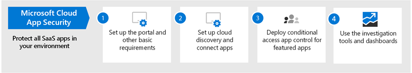

# 跨 Microsoft 365 設定威脅防護功能

請遵循下列步驟來設定跨 Microsoft 365 的威脅防護。

## 步驟1：設定多重要素驗證和條件式存取原則

[多重要素驗證](https://docs.microsoft.com/azure/active-directory/authentication/concept-mfa-howitworks) (MFA) 要求使用者使用撥打電話或驗證器應用程式來驗證其身分識別。 [條件式存取原則](https://docs.microsoft.com/azure/active-directory/conditional-access/overview) 定義必須滿足的特定需求，使用者才能存取 Microsoft 365 中的應用程式和資料。 MFA 和條件式存取原則共同運作，以保護您的組織。 例如，如果有人嘗試使用未啟用 MFA 的帳戶登入行動裝置，且條件式存取原則要求 MFA 生效，該使用者將無法登入。  

Microsoft 已測試並建議一組特定的條件式存取和相關原則，以保護所有 SaaS 應用程式的存取，尤其是 Microsoft 365。 建議使用原則進行基準、機密和高管制的保護。 從執行基準保護的原則開始。 

設定身分 
 [請參閱較大版本的此影像](https://github.com/MicrosoftDocs/microsoft-365-docs/raw/public/microsoft-365/media/microsoft-365-policies-configurations/Identity_device_access_policies_byplan.png)

### 若要執行 Microsoft 365 的基準保護

 

1. [設定必要條件，包含 Azure Identity Protection](../security/office-365-security/identity-access-prerequisites.md)。
2. [設定一般身分識別和裝置存取原則](../security/office-365-security/identity-access-policies.md) ，以進行基準保護。
3. 設定 [來賓使用者](../security/office-365-security/identity-access-policies-guest-access.md)、 [Microsoft 團隊](../security/office-365-security/teams-access-policies.md)、 [Exchange online](../security/office-365-security/secure-email-recommended-policies.md)和 [SharePoint 線上及 OneDrive](../security/office-365-security/sharepoint-file-access-policies.md)的原則。

### 保護身分識別的詳細資訊

- [身分識別與裝置存取設定](../security/office-365-security/microsoft-365-policies-configurations.md)
- [Azure MFA 的安全性指導方針](https://docs.microsoft.com/azure/active-directory/authentication/multi-factor-authentication-security-best-practices)

## 步驟2：設定 Microsoft Defender 身分識別

[Microsoft Defender For Identity](https://docs.microsoft.com/azure-advanced-threat-protection/what-is-atp) 是雲端式的安全性解決方案，可與您的內部部署 [Azure Active Directory](https://docs.microsoft.com/azure/active-directory/fundamentals/active-directory-whatis) 信號搭配使用，以識別、偵測和調查組織中的高級威脅、受損身分識別和惡意有問必答動作。

Microsoft Defender for Identity 可讓安全性作業 (SecOps) 分析員和安全性專業人員，以偵測混合式環境中的高級攻擊：
- 使用以教學為基礎的分析來監控使用者、實體行為和活動。
- 保護儲存在 Active Directory 中的使用者身分識別和認證。
- 識別並調查整個狙殺鍊中的可疑使用者活動和進階攻擊。
- 以簡單的時間表提供清楚的事件資訊，以進行快速分級。

### 設定 Microsoft Defender 身分識別

 

1. 為身分[識別設定 Microsoft Defender](https://docs.microsoft.com/azure-advanced-threat-protection/install-atp-step1)以保護主要環境。
2. 保護所有的 [網域控制站](https://docs.microsoft.com/azure-advanced-threat-protection/atp-sensor-monitoring) 和 [樹](https://docs.microsoft.com/azure-advanced-threat-protection/atp-multi-forest)系。
3. 將 [Microsoft Defender 的身分識別警示](https://docs.microsoft.com/azure-advanced-threat-protection/suspicious-activity-guide?tabs=external) 整合到您的安全性作業中 (SecOps) 工作流程。

### Microsoft Defender 身分識別的詳細資訊

- [Microsoft Defender 身分識別為何？](https://docs.microsoft.com/azure-advanced-threat-protection/what-is-atp)
- [影片： Microsoft Defender 身分識別簡介](https://www.youtube.com/watch?reload=9&v=EGY2m8yU_KE)
- [用於身分識別部署的 Microsoft Defender](https://docs.microsoft.com/azure-advanced-threat-protection/what-is-atp#whats-next)

## 步驟3：開啟 Microsoft 365 Defender

[Microsoft 365 Defender](https://docs.microsoft.com/microsoft-365/security/mtp/microsoft-threat-protection) 會將信號和分割功能結合成單一解決方案。 透過整合的 Microsoft 365 Defender 解決方案，安全性專業人員可以結合每一種產品接收及決定威脅的完整範圍和影響，以結合威脅。如何進入環境、受到影響的內容，以及目前對組織的影響。 Microsoft 365 Defender 採取自動動作，以防止或停止攻擊及自我修復受影響的信箱、端點和使用者身分識別。

Microsoft 365 Defender 在工作負載中統一的提醒、事件、自動化調查和回應，以及高級搜尋 (Microsoft Defender for Identity、Microsoft Defender for Office 365、Microsoft Defender for Endpoint 及 Microsoft Cloud App Security) 成為單一玻璃體驗的單一窗格。 在您設定一或多個 Office 365 服務的 Defender 後，請開啟 Microsoft 365 Defender。 新功能會連續新增至 Microsoft 365 Defender;請考慮改為接收預覽功能。

### 設定 Microsoft 365 Defender

 

1. [複查必要條件](https://docs.microsoft.com/microsoft-365/security/mtp/prerequisites)。
2. [開啟 Microsoft 365 Defender](https://docs.microsoft.com/microsoft-365/security/mtp/mtp-enable)。
3. [加入宣告預覽功能](https://docs.microsoft.com/microsoft-365/security/mtp/preview)。

### Microsoft 365 Defender 的詳細資訊

- [何謂 Microsoft 365 Defender？](https://docs.microsoft.com/microsoft-365/security/mtp/microsoft-threat-protection)
- [Microsoft 365 Defender 的新功能](https://docs.microsoft.com/microsoft-365/security/mtp/whats-new)

## 步驟4：設定適用于 Office 的 Microsoft Defender 365

[Microsoft Defender For Office 365](https://docs.microsoft.com/microsoft-365/security/office-365-security/office-365-atp) 針對電子郵件中的惡意威脅 (附件和 URLs) 、Office 檔和共同作業工具進行保護。 下表列出 microsoft 365 E5 包含的 Microsoft Defender for Office 365 功能和功能：

|設定、保護及偵測功能|自動化、調查、修正及教育功能|
|---|---|
|[安全附件](https://docs.microsoft.com/microsoft-365/security/office-365-security/atp-safe-attachments) [安全連結](https://docs.microsoft.com/microsoft-365/security/office-365-security/atp-safe-links) [安全文件](https://docs.microsoft.com/microsoft-365/security/office-365-security/safe-docs) [適用於 SharePoint、OneDrive 及 Microsoft Teams 的 ATP](https://docs.microsoft.com/microsoft-365/security/office-365-security/atp-for-spo-odb-and-teams) [在 Office 365 的 Defender 中的反網路釣魚保護](https://docs.microsoft.com/microsoft-365/security/office-365-security/set-up-anti-phishing-policies#exclusive-settings-in-atp-anti-phishing-policies)|[威脅追蹤工具](https://docs.microsoft.com/microsoft-365/security/office-365-security/threat-trackers) [威脅總管](https://docs.microsoft.com/microsoft-365/security/office-365-security/threat-explorer) [自動調查及回應](https://docs.microsoft.com/microsoft-365/security/office-365-security/office-365-air) [攻擊模擬器](https://docs.microsoft.com/microsoft-365/security/office-365-security/attack-simulator)|
|

透過 Microsoft Defender for Office 365，您組織中的人員可以更安全地溝通和展開電子郵件內容和 Office 檔的威脅防護。

### 設定 Microsoft Defender for Office 365

 

1. [安裝和設定您的 Microsoft Defender For Office 365 原則](https://docs.microsoft.com/microsoft-365/security/office-365-security/protect-against-threats)。
2. [查看和使用您的 Microsoft Defender For Office 365 報告](https://docs.microsoft.com/microsoft-365/security/office-365-security/view-reports-for-atp)。
3. [使用威脅調查和回應功能](https://docs.microsoft.com/microsoft-365/security/office-365-security/office-365-ti)。

### Microsoft Defender for Office 365 的詳細資訊

- [Microsoft Defender for Office 365 簡介](https://docs.microsoft.com/microsoft-365/security/office-365-security/office-365-atp)
- [Microsoft Defender for Office 365 的新功能](https://docs.microsoft.com/microsoft-365/security/office-365-security/whats-new-in-office-365-atp)

## 步驟5：設定 Microsoft Defender for Endpoint

[Microsoft Defender For Endpoint](https://docs.microsoft.com/windows/security/threat-protection) 會保護您的組織裝置 (也稱為端點) 從 cyberthreats、高級攻擊和資料違例。 安全小組在管理其端點的安全性時，效率會更高。 穩健的工具可協助組織使用具有 [威脅和弱點管理](https://docs.microsoft.com/windows/security/threat-protection/microsoft-defender-atp/next-gen-threat-and-vuln-mgt)的漏洞偵測，以不斷處理未經修補的系統。 自動偵測和修正功能，例如 [攻擊面降低](https://docs.microsoft.com/windows/security/threat-protection/microsoft-defender-atp/overview-attack-surface-reduction)、 [下一代保護](https://docs.microsoft.com/windows/security/threat-protection/windows-defender-antivirus/windows-defender-antivirus-in-windows-10)、 [端點偵測和回應](https://docs.microsoft.com/windows/security/threat-protection/microsoft-defender-atp/overview-endpoint-detection-response)，以及 [自動調查和修正](https://docs.microsoft.com/windows/security/threat-protection/microsoft-defender-atp/automated-investigations) ，可協助您保護裝置安全地抵禦惡意程式碼。 在這些功能上，客戶可以取得主動通知，並在需要時與 Microsoft 威脅專家（自願加入受管理的搜尋服務的一部分）接洽。 

### 設定 Microsoft Defender for Endpoint

 

1. [準備您的 Microsoft Defender 以進行端點部署](https://docs.microsoft.com/windows/security/threat-protection/microsoft-defender-atp/deployment-phases)。
2. [設定 Microsoft Defender for Endpoint 部署](https://docs.microsoft.com/windows/security/threat-protection/micros.oft-defender-atp/production-deployment)
3. [在 Microsoft Defender For Endpoint service 上架](https://docs.microsoft.com/windows/security/threat-protection/microsoft-defender-atp/onboarding)上。
4. [完成最常見的安全性系統管理](https://docs.microsoft.com/windows/security/threat-protection/microsoft-defender-atp/tvm-security-recommendation)工作。

### Microsoft Defender for Endpoint 的詳細資訊

- [深入瞭解 Microsoft Defender For Endpoint](https://docs.microsoft.com/windows/security/threat-protection)。
- [嘗試 Microsoft Defender For Endpoint 評估實驗室](https://docs.microsoft.com/windows/security/threat-protection/microsoft-defender-atp/evaluation-lab)。

## 步驟6：設定 Microsoft Cloud App Security

[Microsoft Cloud App security](https://docs.microsoft.com/cloud-app-security) 是雲端存取安全性經紀人，可支援記錄檔收集、API 連接器及反向 proxy。 Microsoft Cloud App Security 提供豐富的知名度、控制資料旅行和完善的分析，以在所有雲端服務之間識別及打擊 cyberthreats。 使用 Microsoft Cloud App Security，您的安全性作業可以保護組織的機密資訊、防範 cyberthreats 和異常、探索及監視存取組織資料的應用程式，以及協助確保組織的雲端應用程式符合規範需求。

### 設定 Microsoft Cloud App Security

 

1. [設定入口網站和其他基本需求](https://docs.microsoft.com/cloud-app-security/general-setup)。
2. [設定 cloud discovery](https://docs.microsoft.com/cloud-app-security/set-up-cloud-discovery) 和 [connect 應用程式](https://docs.microsoft.com/cloud-app-security/enable-instant-visibility-protection-and-governance-actions-for-your-apps)。
3. [為特色式應用程式部署條件式存取應用程式控制](https://docs.microsoft.com/cloud-app-security/proxy-deployment-aad)。
4. [使用調查工具及儀表板](https://docs.microsoft.com/cloud-app-security/investigate)。

### Microsoft Cloud App Security 的詳細資訊

- [查看新的功能與功能](https://docs.microsoft.com/cloud-app-security/release-notes)。
- [深入瞭解 Microsoft Cloud App Security](https://docs.microsoft.com/cloud-app-security/what-is-cloud-app-security)。

## 步驟7：監控狀態並採取動作

設定並部署威脅防護服務和功能之後，下一步是監視威脅偵測，並採取適當的動作。 您最好的起點是 Microsoft 365 的安全性中心 ([https://security.microsoft.com](https://security.microsoft.com)) ，您可以在其中監視和管理您的所有 Microsoft 身分識別、資料、裝置、應用程式和基礎結構的安全性。 

Microsoft 365 的安全性中心專為安全性管理員及安全性作業小組特別設計。 在 Microsoft 365 的安全性中心，您可以：
- 以 [安全得分](https://docs.microsoft.com/microsoft-365/security/mtp/microsoft-secure-score)查看組織的整體安全性健康情況。
- [監視和查看](https://docs.microsoft.com/microsoft-365/security/mtp/monitoring-and-reporting) 您的身分識別、資料、裝置、應用程式和基礎結構狀態的報告。
- 透過 [事件](https://docs.microsoft.com/microsoft-365/security/mtp/incident-queue)連接警示上的點。
- 使用 [自動調查和修正](https://docs.microsoft.com/microsoft-365/security/mtp/mtp-autoir) 來處理威脅。
- [主動搜尋威脅](https://docs.microsoft.com/microsoft-365/security/mtp/advanced-hunting-overview)，例如入侵企圖或破壞您電子郵件、資料、裝置和身分識別的活動。
- 透過威脅分析[瞭解最新的攻擊活動](https://docs.microsoft.com/microsoft-365/security/mtp/latest-attack-campaigns)和技術。
- ...還有更多！

### Microsoft 365 安全中心的詳細資訊

- [開始使用 Microsoft 365 的安全性中心](https://docs.microsoft.com/microsoft-365/security/mtp/overview-security-center)。
- [監視和查看報告](https://docs.microsoft.com/microsoft-365/security/mtp/monitoring-and-reporting)。
- [請參閱 Microsoft 365 中的安全性入口網站](https://docs.microsoft.com/microsoft-365/security/mtp/portals)。

## 步驟8：訓練使用者

訓練使用者可將您的使用者與安全性作業小組儲存在許多時間和不滿。 聰明的使用者不太可能開啟附件或按一下可疑電子郵件訊息中的連結，也很可能避免可疑的網站。 

Harvard 甘迺迪 School [Cybersecurity 活動手冊](https://go.microsoft.com/fwlink/?linkid=2015598&amp;clcid=0x409) 提供好的指導方針，可為組織內的安全性感知建立強大的文化，包括訓練使用者來識別網路釣魚攻擊。 

Microsoft 365 提供下列資源，協助您在組織中告知使用者：

|概念  |資源  |
|---------|---------|
|Microsoft 365     |[可自訂的教學路徑](https://docs.microsoft.com/office365/customlearning/) 
這些資源可協助您將組織中使用者的訓練放在一起        |
|Microsoft 365 安全性 |[學習模組：使用 Microsoft 365 內建的智慧安全性保護您的組織](https://docs.microsoft.com/learn/modules/security-with-microsoft-365) 
此模組可讓您描述 Microsoft 365 安全性功能如何協同運作，並闡明這些安全性功能的優點。 |
|多重要素驗證     | [雙步驟驗證：其他驗證頁面為何？](https://docs.microsoft.com/azure/active-directory/user-help/multi-factor-authentication-end-user-first-time) 
本文可協助使用者瞭解哪些多重要素驗證，以及如何在您的組織中使用它。    |

除了這項指導之外，Microsoft 也建議您的使用者採取本文所述的動作： [保護您的帳戶和裝置免受駭客和惡意](https://support.office.com/article/066d6216-a56b-4f90-9af3-b3a1e9a327d6.aspx)代碼的攻擊。 這些動作包括：
- 使用強式密碼
- 保護裝置 
- 在 Windows 10 和 Mac 電腦上啟用非管理裝置的安全性功能 () 
    
Microsoft 也建議您採取下列文章中建議的動作來保護其個人電子郵件帳戶：
- [協助保護您的 Outlook.com 電子郵件帳戶](https://support.microsoft.com/office/help-protect-your-outlook-com-email-account-a4f20fc5-4307-4ece-8231-6d4d4bd8a9ba)
- [使用2步驟驗證保護您的 Gmail 帳戶](https://go.microsoft.com/fwlink/?linkid=2015688&amp;clcid=0x409)
