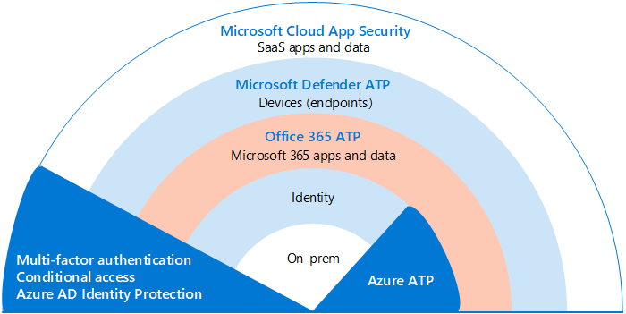
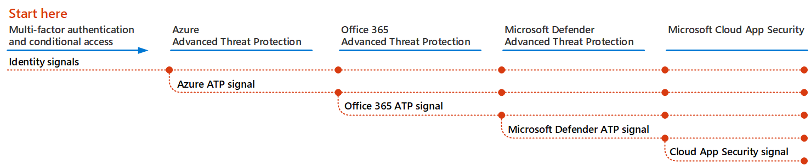

# 跨 Microsoft 365 部署威脅防護功能Deploy threat protection capabilities across Microsoft 365

[惡意](https://docs.microsoft.com/windows/security/threat-protection/intelligence/understanding-malware)代碼和複雜的 cyberattacks （例如[fileless 威脅](https://docs.microsoft.com/windows/security/threat-protection/intelligence/fileless-threats)）都是常見的時機。[Malware](https://docs.microsoft.com/windows/security/threat-protection/intelligence/understanding-malware), and sophisticated cyberattacks, such as [fileless threats](https://docs.microsoft.com/windows/security/threat-protection/intelligence/fileless-threats), are a common occurrence. 企業必須保護自己及其客戶。Businesses need to protect themselves and their customers. 網路安全性攻擊可能會造成組織的主要問題，包括從失去信任到財務 woes、業務威脅停機等等。Cyber security attacks can cause major problems for your organization, ranging from a loss of trust to financial woes, business-threatening downtime, and more. 防護威脅很重要，但決定組織的時間、精力和資源的位置，可能會有很大的難度。Protecting against threats is important, but it can be challenging to determine where to focus your organization's time, effort, and resources. 

Microsoft 的安全性解決方案已內置於我們的產品和服務中。Microsoft security solutions are built into our products and services. 「自動化」和「機器學習」功能可減少安全性小組的負載，以確保處理適當的專案。Automation and machine learning capabilities reduce the load on your security teams to make sure the right items are addressed. Microsoft 安全性解決方案的強項是以 trillions 在我們每天處理的[智慧安全性圖形](https://cloud-platform-assets.azurewebsites.net/intelligent-security-graph)中的信號來建立。And the strength of Microsoft security solutions is built on trillions of signals we process every day in our [Intelligent Security Graph](https://cloud-platform-assets.azurewebsites.net/intelligent-security-graph). Microsoft 365 的安全性解決方案包括[Microsoft 威脅防護](https://docs.microsoft.com/microsoft-365/security/mtp/microsoft-threat-protection)，這會在您的電子郵件、資料、裝置和身分識別間的信號，以繪製對您組織的高級威脅的圖片。Microsoft 365 security solutions include [Microsoft Threat Protection](https://docs.microsoft.com/microsoft-365/security/mtp/microsoft-threat-protection), which brings together signals across your email, data, devices, and identities to paint a picture of advanced threats against your organization.

觀賞這段影片，瞭解部署程式的概況。Watch this video for an overview of the deployment process.

> [!VIDEO https://www.microsoft.com/videoplayer/embed/RE4vsI7]

使用本文作為實施威脅防護解決方案的指南。Use this article as a guide for implementing your threat protection solution.

## Microsoft 365 E5 中的威脅防護Threat protection in Microsoft 365 E5

[Microsoft 365 E5](https://www.microsoft.com/microsoft-365/enterprise-e5-business-software?activetab=pivot%3aoverviewtab)可讓您使用可自我調整的內建智慧來保護您的組織。[Microsoft 365 E5](https://www.microsoft.com/microsoft-365/enterprise-e5-business-software?activetab=pivot%3aoverviewtab) enables you to protect your organization with adaptive, built-in intelligence. 使用 Microsoft 365 E5 中的威脅防護功能，您可以偵測並調查內部部署和雲端環境中的高級威脅、受到損害的身分識別和惡意動作。With the threat protection features in Microsoft 365 E5, you can detect and investigate advanced threats, compromised identities, and malicious actions across your on-premises and cloud environment.

在 Microsoft 365 E5 中，預設會整合威脅防護功能。In Microsoft 365 E5, threat protection capabilities are integrated by default. 每項功能的信號增加了偵測及回應威脅的整體能力。Signals from each capability add strength to the overall ability to detect and respond to threats. 整合的一組功能可為組織（特別是多國組織）提供最佳保護，與執行非 Microsoft 產品相較。The combined set of capabilities offers the best protection for organizations, especially multi-national organizations, compared to running non-Microsoft products. 下圖說明本文所述的 Microsoft 365 E5 威脅防護服務和功能。The following image depicts the threat protection services and capabilities in Microsoft 365 E5 that are described in this article.

一旦您部署任何高級威脅防護功能，您就可以開啟 Microsoft 威脅防護，使信號和資料集中在一個位置。As soon as you deploy any of the advanced threat protection capabilities, you can turn on Microsoft Threat Protection, which brings the signals and data together into one place. 

下圖描述部署這些個別功能的建議路徑。The following illustration depicts a recommended path for deploying these individual capabilities. 

|解決方案/功能Solution/capabilities  |描述Description  |
|---------|---------|
|多重要素驗證和條件式存取Multi-factor authentication and conditional access     |防護遭到損害的身分識別和裝置。Protect against compromised identities and devices. 請從這種保護開始，因為它是基礎。Begin with this protection because it's foundational. 此指南中建議的設定包括 Azure AD 身分識別保護為先決條件。The configuration recommended in this guidance includes Azure AD Identity Protection as a prerequisite.     |
|Azure 進階威脅防護Azure Advanced Threat Protection     |  以雲端為基礎的安全性解決方案，可利用您的內部部署 Active Directory 信號來識別、偵測和調查您組織中的高級威脅、遭到破壞的身分識別，以及惡意的內幕程式列動。A cloud-based security solution that leverages your on-premises Active Directory signals to identify, detect, and investigate advanced threats, compromised identities, and malicious insider actions directed at your organization. 著重于 Azure 高級威脅防護接下來，因為它會保護您的部署和雲端基礎結構、沒有相依性或必要條件，而且可提供立即的利益。Focus on Azure Advanced Threat Protection next because it protects your on-prem and your cloud infrastructure, has no dependencies or prerequisites, and can provide immediate benefit.       | 
|Office 365 進階威脅防護Office 365 Advanced Threat Protection     | 保護您的組織免受電子郵件訊息、連結 (URLs) 和共同作業工具帶來的惡意威脅。Safeguards your organization against malicious threats posed by email messages, links (URLs), and collaboration tools. 針對惡意程式碼、網路釣魚、欺騙及其他攻擊類型的保護。Protections for malware, phishing, spoofing, and other attack types. 建議您先設定 Office 365 的高級威脅防護，因為變更控制會從委任系統移轉設定，而其他考慮可能需要較長時間進行部署。Configuring Office 365 Advanced Threat Protection is recommended next because change control, migrating settings from incumbent system, and other considerations can take longer to deploy.   附注：請務必設定所有 Office 365 訂閱中所包含的威脅防護功能 (Exchange Online Protection) 。Note: Make sure to configure the threat protection capabilities that are included in all Office 365 subscriptions (Exchange Online Protection).       |
|Microsoft Defender 進階威脅防護Microsoft Defender Advanced Threat Protection    | Endpoint protection 平臺，可協助避免、偵測、調查和回應高級威脅。An endpoint protection platform that helps prevent, detect, investigate, and respond to advanced threats. Microsoft Defender 高級威脅防護可能需要一些時間才能部署，但設定可與其他功能同時進行。Microsoft Defender Advanced Threat Protection can take some time to deploy, but configuration can be done in parallel with other capabilities.   |
|Microsoft Cloud App SecurityMicrosoft Cloud App Security     |   雲端存取安全性經紀人，用於探索、調查和控管。A cloud access security broker for discovery, investigation, and governance. 您可以及早啟用 Microsoft Cloud App Security，以開始收集資料和洞察力。You can enable Microsoft Cloud App Security early to begin collecting data and insights. 在您的 SaaS 應用程式中實施資訊和其他有針對性的保護，需要規劃，而且可能需要更多時間。Implementing information and other targeted protection across your SaaS apps involves planning and can take more time.       | 

> [!TIP]
> 具有多個安全小組的組織可以並存執行這些功能。Organizations with multiple security teams can implement these capabilities in parallel.

## 部署威脅防護解決方案Deploy your threat protection solution

若要確定您的組織有可能獲得最佳保護，請安裝並部署您的安全性解決方案，以包含下列步驟：To make sure your organization has the best protection possible, set up and deploy your security solution to include the following steps:

1. [設定多重要素驗證和條件式存取原則Set up multi-factor authentication and conditional access policies](deploy-threat-protection-configure.md#step-1-set-up-multi-factor-authentication-and-conditional-access-policies)
2. [設定 Azure 高級威脅防護Configure Azure Advanced Threat Protection](deploy-threat-protection-configure.md#step-2-configure-azure-advanced-threat-protection)
3. [開啟 Microsoft 威脅防護Turn on Microsoft Threat Protection](deploy-threat-protection-configure.md#step-3-turn-on-microsoft-threat-protection)
4. [設定 Office 365 的高級威脅防護Configure Office 365 Advanced Threat Protection](deploy-threat-protection-configure.md#step-4-configure-office-365-advanced-threat-protection)
5. [設定 Microsoft Defender 高級威脅防護Configure Microsoft Defender Advanced Threat Protection](deploy-threat-protection-configure.md#step-5-configure-microsoft-defender-advanced-threat-protection)
6. [設定 Microsoft Cloud App SecurityConfigure Microsoft Cloud App Security](deploy-threat-protection-configure.md#step-6-configure-microsoft-cloud-app-security)
7. [監視狀態並採取動作Monitor status and take actions](deploy-threat-protection-configure.md#step-7-monitor-status-and-take-actions)
8. [訓練使用者Train users](deploy-threat-protection-configure.md#step-8-train-users)

您可以平行設定威脅防護功能，因此，如果您有多個安全小組負責不同的服務，他們就可以同時設定組織的保護功能。Your threat protection features can be configured in parallel, so if you have multiple security teams responsible for different services, they can configure your organization’s protection features at the same time. 下圖說明部署威脅防護功能的高層級流程。The following diagram illustrates the high-level process for deploying threat protection capabilities. 

 

