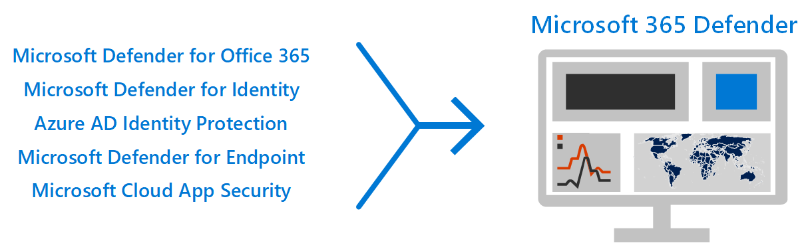

# 跨 Microsoft 365 E5 部署威脅防護功能Deploy threat protection capabilities across Microsoft 365 E5

此解決方案說明跨 Microsoft 365 E5 的強大威脅防護功能，並說明威脅防護很重要的原因。This solution describes powerful threat protection capabilities across Microsoft 365 E5 and explains why threat protection is important. 請閱讀本文，以取得 Microsoft 365 E5 威脅防護的概況，以及如何為您的組織進行安裝和設定。Read this article to get an overview of threat protection in Microsoft 365 E5 and how to approach setup and configuration for your organization.

## 威脅防護為何很重要Why threat protection is important 

[惡意](/windows/security/threat-protection/intelligence/understanding-malware)代碼和複雜的 cyberattacks （例如 [fileless 威脅](/windows/security/threat-protection/intelligence/fileless-threats)）都是常見的時機。[Malware](/windows/security/threat-protection/intelligence/understanding-malware), and sophisticated cyberattacks, such as [fileless threats](/windows/security/threat-protection/intelligence/fileless-threats), are a common occurrence. 企業必須以有效的 IT 安全性功能來保護自己及其客戶。Businesses need to protect themselves and their customers with effective IT security capabilities. Cyberattacks 可能會造成組織的主要問題，包括從失去信任到財務 woes、業務威脅停機等等。Cyberattacks can cause major problems for your organization, ranging from a loss of trust to financial woes, business-threatening downtime, and more. 防護威脅很重要，但決定組織的時間、精力和資源的位置，可能會有很大的難度。Protecting against threats is important, but it can be challenging to determine where to focus your organization's time, effort, and resources. Microsoft 365 E5 可提供協助。Microsoft 365 E5 can help. 

Microsoft 的安全性解決方案已內置於我們的產品和服務中。Microsoft security solutions are built into our products and services. 「自動化」和「機器學習」功能可減少安全性小組的負載，以確保處理適當的專案。Automation and machine learning capabilities reduce the load on your security teams to make sure the right items are addressed. Microsoft 安全性解決方案的強項是以 trillions 在我們每天處理的 [智慧安全性圖形](/graph/security-concept-overview)中的信號來建立。And the strength of Microsoft security solutions is built on trillions of signals we process every day in our [Intelligent Security Graph](/graph/security-concept-overview). Microsoft 365 的安全性解決方案包括 [microsoft 365 Defender](../security/defender/microsoft-365-defender.md)，此解決方案會透過您的電子郵件、資料、裝置和身分識別，以繪製您組織的高級威脅圖片。Microsoft 365 security solutions include [Microsoft 365 Defender](../security/defender/microsoft-365-defender.md), a solution that brings together signals across your email, data, devices, and identities to paint a picture of advanced threats against your organization.

觀看這段影片以獲取部署程序概觀。Watch this video for an overview of the deployment process.
  
> [!VIDEO https://www.microsoft.com/videoplayer/embed/RE4vsI7]

## Microsoft 365 E5 中的威脅防護Threat protection in Microsoft 365 E5

[Microsoft 365 E5](https://www.microsoft.com/microsoft-365/enterprise-e5-business-software?activetab=pivot%3aoverviewtab) 可讓您使用可自我調整的內建智慧來保護您的組織。[Microsoft 365 E5](https://www.microsoft.com/microsoft-365/enterprise-e5-business-software?activetab=pivot%3aoverviewtab) enables you to protect your organization with adaptive, built-in intelligence. 使用 Microsoft 365 E5 中的威脅防護功能，您可以偵測並調查內部部署和雲端環境中的高級威脅、受到損害的身分識別和惡意動作。With the threat protection features in Microsoft 365 E5, you can detect and investigate advanced threats, compromised identities, and malicious actions across your on-premises and cloud environment.

在 Microsoft 365 E5 中，預設會整合威脅防護功能。In Microsoft 365 E5, threat protection capabilities are integrated by default. 每項功能的信號增加了偵測及回應威脅的整體能力。Signals from each capability add strength to the overall ability to detect and respond to threats. 整合的一組功能可為組織（特別是多國組織）提供最佳保護，與執行非 Microsoft 產品相較。The combined set of capabilities offers the best protection for organizations, especially multi-national organizations, compared to running non-Microsoft products. 下圖說明本文所述的 Microsoft 365 E5 威脅防護服務和功能。The following image depicts the threat protection services and capabilities in Microsoft 365 E5 that are described in this article.

Microsoft 365 Defender 會將信號和資料一起帶入整合的 [Microsoft 365 安全性中心](/microsoft-365/security/defender/overview-security-center)。Microsoft 365 Defender brings the signals and data together into a [unified Microsoft 365 security center](/microsoft-365/security/defender/overview-security-center). 

> [!div class="mx-imgBorder"]
> 

下圖描述部署這些個別功能的建議路徑。The following illustration depicts a recommended path for deploying these individual capabilities. 

> [!div class="mx-imgBorder"]
> 

|解決方案/功能Solution/capabilities  |描述Description  |
|---------|---------|
|多重要素驗證和條件式存取Multi-factor authentication and Conditional Access     |防護遭到損害的身分識別和裝置。Protect against compromised identities and devices. 請從這種保護開始，因為它是基礎。Begin with this protection because it's foundational. 此指南中建議的設定包括 Azure AD 身分識別保護為先決條件。The configuration recommended in this guidance includes Azure AD Identity Protection as a prerequisite.     |
|適用於身分識別的 Microsoft DefenderMicrosoft Defender for Identity     |  使用內部部署 Active Directory 網域服務的雲端式安全性解決方案 (AD DS) 信號來識別、偵測和調查組織中的高級威脅、遭到破壞的身分識別，以及惡意的內幕程式列動。A cloud-based security solution that uses your on-premises Active Directory Domain Services (AD DS) signals to identify, detect, and investigate advanced threats, compromised identities, and malicious insider actions directed at your organization. 著重于 Microsoft Defender for Identity，因為它會保護您的內部部署和雲端基礎結構、沒有相依性或必要條件，而且可以提供立即的安全性效益。Focus on Microsoft Defender for Identity next because it protects your on-premises and cloud infrastructure, has no dependencies or prerequisites, and can provide immediate security benefits. | 
|適用於 Office 365 的 Microsoft DefenderMicrosoft Defender for Office 365     | 保護您的組織免受電子郵件訊息、連結 (URLs) 和共同作業工具帶來的惡意威脅。Safeguards your organization against malicious threats posed by email messages, links (URLs), and collaboration tools. 針對惡意程式碼、網路釣魚、欺騙及其他攻擊類型的保護。Protections for malware, phishing, spoofing, and other attack types. 建議您先設定 Microsoft Defender for Office 365，因為變更控制、從委任系統移轉設定，以及其他考慮可能需要較長時間進行部署。Configuring Microsoft Defender for Office 365 is recommended next because change control, migrating settings from incumbent system, and other considerations can take longer to deploy. 
**附注**：請務必設定所有 Office 365 訂閱中所包含的威脅防護功能 (Exchange Online protection) 。**NOTE**: Make sure to configure the threat protection capabilities that are included in all Office 365 subscriptions (Exchange Online Protection).       |
|適用於端點的 Microsoft DefenderMicrosoft Defender for Endpoint    | Endpoint protection 平臺，可協助避免、偵測、調查和回應高級威脅。An endpoint protection platform that helps prevent, detect, investigate, and respond to advanced threats.  Defender for Endpoint 可能需要一些時間才能部署，但設定可與其他功能同時進行。Defender for Endpoint can take some time to deploy, but configuration can be done in parallel with other capabilities.   |
|Microsoft Cloud App SecurityMicrosoft Cloud App Security     |   雲端存取安全性經紀人，用於探索、調查和控管。A cloud access security broker for discovery, investigation, and governance. 您可以及早啟用 Microsoft Cloud App Security，以開始收集資料和洞察力。You can enable Microsoft Cloud App Security early to begin collecting data and insights. 在您的 SaaS 應用程式中實施資訊和其他有針對性的保護，需要規劃，而且可能需要更多時間。Implementing information and other targeted protection across your SaaS apps involves planning and can take more time.       | 

> [!TIP]
> 具有多個安全小組的組織可以平行執行這些功能。Organizations who have multiple security teams can implement these capabilities in parallel. 

## 規劃部署威脅防護解決方案Plan to deploy your threat protection solution

下圖說明部署威脅防護功能的高層級流程。The following diagram illustrates the high-level process for deploying threat protection capabilities. 

若要確定您的組織有可能獲得最佳保護，請使用包含下列步驟的程式來設定和部署您的安全性解決方案：To make sure your organization has the best protection possible, set up and deploy your security solution with a process that includes the following steps:

1. [設定多重要素驗證和條件式存取原則](deploy-threat-protection-configure.md#step-1-set-up-multi-factor-authentication-and-conditional-access-policies)。[Set up multi-factor authentication and Conditional Access policies](deploy-threat-protection-configure.md#step-1-set-up-multi-factor-authentication-and-conditional-access-policies).
2. [設定 Microsoft Defender 身分識別](deploy-threat-protection-configure.md#step-2-configure-microsoft-defender-for-identity)。[Configure Microsoft Defender for Identity](deploy-threat-protection-configure.md#step-2-configure-microsoft-defender-for-identity).
3. [開啟 Microsoft 365 Defender](deploy-threat-protection-configure.md#step-3-turn-on-microsoft-365-defender)。[Turn on Microsoft 365 Defender](deploy-threat-protection-configure.md#step-3-turn-on-microsoft-365-defender).
4. [設定 Office 365 的 Defender](deploy-threat-protection-configure.md#step-4-configure-microsoft-defender-for-office-365)。[Configure Defender for Office 365](deploy-threat-protection-configure.md#step-4-configure-microsoft-defender-for-office-365).
5. [設定 Microsoft Defender For Endpoint](deploy-threat-protection-configure.md#step-5-configure-microsoft-defender-for-endpoint)。[Configure Microsoft Defender for Endpoint](deploy-threat-protection-configure.md#step-5-configure-microsoft-defender-for-endpoint).
6. [設定 Microsoft Cloud App Security](deploy-threat-protection-configure.md#step-6-configure-microsoft-cloud-app-security)。[Configure Microsoft Cloud App Security](deploy-threat-protection-configure.md#step-6-configure-microsoft-cloud-app-security).
7. [監視狀態並採取動作](deploy-threat-protection-configure.md#step-7-monitor-status-and-take-actions)。[Monitor status and take actions](deploy-threat-protection-configure.md#step-7-monitor-status-and-take-actions).
8. [訓練使用者](deploy-threat-protection-configure.md#step-8-train-users)。[Train users](deploy-threat-protection-configure.md#step-8-train-users).

您可以平行設定威脅防護功能，因此，如果您有多個網路安全小組負責不同的服務，則可以同時設定組織的保護功能。Your threat protection features can be configured in parallel, so if you have multiple network security teams responsible for different services, they can configure your organization’s protection features at the same time.

## 下一步Next step

繼續 [跨 Microsoft 365 設定威脅防護功能](deploy-threat-protection-configure.md)。Continue to [Configure threat protection capabilities across Microsoft 365](deploy-threat-protection-configure.md).

