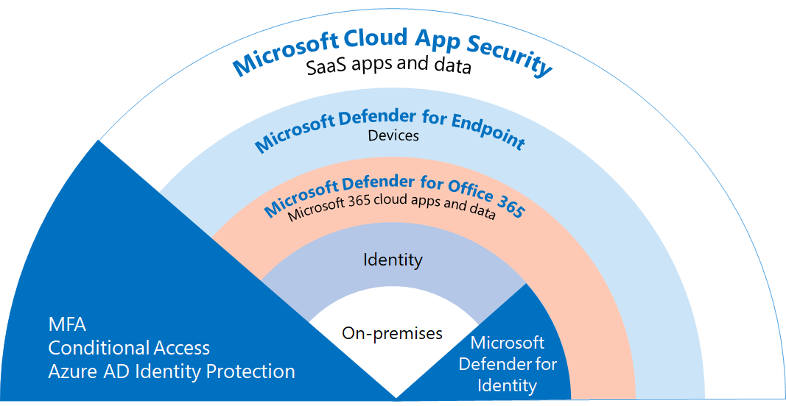

# 跨 Microsoft 365 E5 部署威脅防護功能

此解決方案說明跨 Microsoft 365 E5 的強大威脅防護功能，並說明威脅防護很重要的原因。 請閱讀本文，以取得 Microsoft 365 E5 威脅防護的概況，以及如何為您的組織進行安裝和設定。

## 威脅防護為何很重要 

[惡意](/windows/security/threat-protection/intelligence/understanding-malware)代碼和複雜的 cyberattacks （例如 [fileless 威脅](/windows/security/threat-protection/intelligence/fileless-threats)）都是常見的時機。 企業必須以有效的 IT 安全性功能來保護自己及其客戶。 Cyberattacks 可能會造成組織的主要問題，包括從失去信任到財務 woes、業務威脅停機等等。 防護威脅很重要，但決定組織的時間、精力和資源的位置，可能會有很大的難度。 Microsoft 365 E5 可提供協助。 

Microsoft 的安全性解決方案已內置於我們的產品和服務中。 「自動化」和「機器學習」功能可減少安全性小組的負載，以確保處理適當的專案。 Microsoft 安全性解決方案的強項是以 trillions 在我們每天處理的 [智慧安全性圖形](/graph/security-concept-overview)中的信號來建立。 Microsoft 365 的安全性解決方案包括 [microsoft 365 Defender](../security/defender/microsoft-365-defender.md)，此解決方案會透過您的電子郵件、資料、裝置和身分識別，以繪製您組織的高級威脅圖片。

觀看這段影片以獲取部署程序概觀。
  
> [!VIDEO https://www.microsoft.com/videoplayer/embed/RE4vsI7]

## Microsoft 365 E5 中的威脅防護

[Microsoft 365 E5](https://www.microsoft.com/microsoft-365/enterprise-e5-business-software?activetab=pivot%3aoverviewtab) 可讓您使用可自我調整的內建智慧來保護您的組織。 使用 Microsoft 365 E5 中的威脅防護功能，您可以偵測並調查內部部署和雲端環境中的高級威脅、受到損害的身分識別和惡意動作。

在 Microsoft 365 E5 中，預設會整合威脅防護功能。 每項功能的信號增加了偵測及回應威脅的整體能力。 整合的一組功能可為組織（特別是多國組織）提供最佳保護，與執行非 Microsoft 產品相較。 下圖說明本文所述的 Microsoft 365 E5 威脅防護服務和功能。

Microsoft 365 Defender 會將信號和資料一起帶入整合的 [Microsoft 365 安全性中心](/microsoft-365/security/defender/overview-security-center)。 

> [!div class="mx-imgBorder"]
> 

下圖描述部署這些個別功能的建議路徑。 

> [!div class="mx-imgBorder"]
> 

|解決方案/功能  |描述  |
|---------|---------|
|多重要素驗證和條件式存取     |防護遭到損害的身分識別和裝置。 請從這種保護開始，因為它是基礎。 此指南中建議的設定包括 Azure AD 身分識別保護為先決條件。     |
|適用於身分識別的 Microsoft Defender     |  使用內部部署 Active Directory 網域服務的雲端式安全性解決方案 (AD DS) 信號來識別、偵測和調查組織中的高級威脅、遭到破壞的身分識別，以及惡意的內幕程式列動。 著重于 Microsoft Defender for Identity，因為它會保護您的內部部署和雲端基礎結構、沒有相依性或必要條件，而且可以提供立即的安全性效益。 | 
|適用於 Office 365 的 Microsoft Defender     | 保護您的組織免受電子郵件訊息、連結 (URLs) 和共同作業工具帶來的惡意威脅。 針對惡意程式碼、網路釣魚、欺騙及其他攻擊類型的保護。 建議您先設定 Microsoft Defender for Office 365，因為變更控制、從委任系統移轉設定，以及其他考慮可能需要較長時間進行部署。 
**附注**：請務必設定所有 Office 365 訂閱中所包含的威脅防護功能 (Exchange Online protection) 。       |
|適用於端點的 Microsoft Defender    | Endpoint protection 平臺，可協助避免、偵測、調查和回應高級威脅。  Defender for Endpoint 可能需要一些時間才能部署，但設定可與其他功能同時進行。   |
|Microsoft Cloud App Security     |   雲端存取安全性經紀人，用於探索、調查和控管。 您可以及早啟用 Microsoft Cloud App Security，以開始收集資料和洞察力。 在您的 SaaS 應用程式中實施資訊和其他有針對性的保護，需要規劃，而且可能需要更多時間。       | 

> [!TIP]
> 具有多個安全小組的組織可以平行執行這些功能。 

## 規劃部署威脅防護解決方案

下圖說明部署威脅防護功能的高層級流程。 

若要確定您的組織有可能獲得最佳保護，請使用包含下列步驟的程式來設定和部署您的安全性解決方案：

1. [設定多重要素驗證和條件式存取原則](deploy-threat-protection-configure.md#step-1-set-up-multi-factor-authentication-and-conditional-access-policies)。
2. [設定 Microsoft Defender 身分識別](deploy-threat-protection-configure.md#step-2-configure-microsoft-defender-for-identity)。
3. [開啟 Microsoft 365 Defender](deploy-threat-protection-configure.md#step-3-turn-on-microsoft-365-defender)。
4. [設定 Office 365 的 Defender](deploy-threat-protection-configure.md#step-4-configure-microsoft-defender-for-office-365)。
5. [設定 Microsoft Defender For Endpoint](deploy-threat-protection-configure.md#step-5-configure-microsoft-defender-for-endpoint)。
6. [設定 Microsoft Cloud App Security](deploy-threat-protection-configure.md#step-6-configure-microsoft-cloud-app-security)。
7. [監視狀態並採取動作](deploy-threat-protection-configure.md#step-7-monitor-status-and-take-actions)。
8. [訓練使用者](deploy-threat-protection-configure.md#step-8-train-users)。

您可以平行設定威脅防護功能，因此，如果您有多個網路安全小組負責不同的服務，則可以同時設定組織的保護功能。

## 下一步

繼續 [跨 Microsoft 365 設定威脅防護功能](deploy-threat-protection-configure.md)。

