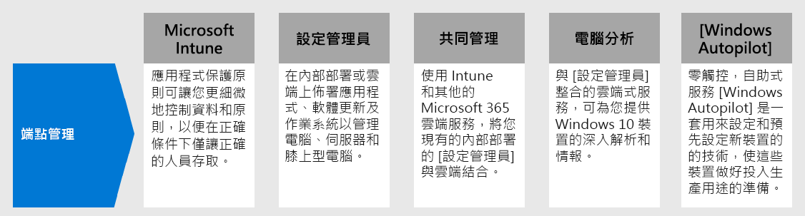

# 步驟 3： 為您的裝置、電腦和其他端點部署端點管理

若雇用遠端工作者，您必須支援日益增加的個人裝置。 端點管理是原則型的安全性方法，要求裝置必須符合特定準則，才能獲得存取資源的授權。 Microsoft 端點管理員提供新式的工作場所和新式管理功能，讓您的資料在雲端和內部部署中保持安全。 

端點管理員提供可管理行動裝置、電腦、虛擬機器、嵌入式裝置及伺服器的服務和工具，並結合您可能已經知道且正在使用的服務。

## Microsoft Intune

當您不管理用來存取組織資料的裝置時，Intune 的設計在於協助您保護資料。 與 Azure AD 條件式存取結合的 Intune 應用程式防護原則，可讓您在行動裝置上精細控制資料。 Intune 還能讓您定義全面的原則，只允許適當的人員在正確的條件下存取您的公司資料，並在 Office、Outlook 和其他行動裝置應用程式中控制資料的使用方式，確保資料的安全無虞。

如需詳細資訊，請參閱 [Microsoft Intune 概觀](https://docs.microsoft.com/intune/fundamentals/what-is-intune)。

## Configuration Manager

Configuration Manager 是一種內部部署管理解決方案，可管理網路或網際網路上的桌上型電腦、伺服器和膝上型電腦。 您可以在雲端啟用此功能，讓它與 Intune、Azure AD、Microsoft Defender ATP 和其他雲端服務整合。 使用 Configuration Manager 部署應用程式、軟體更新及作業系統。 您也可以即時監視合規性、查詢和操作用戶端，以及執行更多動作。

如需詳細資訊，請參閱 [Configuration Manager 概觀](https://docs.microsoft.com/mem/configmgr/core/understand/introduction)。

## 共同管理

共同管理會使用 Intune 和其他 Microsoft 365 雲端服務，將您現有的內部部署 Configuration Manager 投資與雲端結合。 您可以選擇將 Configuration Manager 或 Intune 設定為七個不同工作負載群組的管理單位。

共同管理屬於端點管理員中的部分功能，其使用雲端功能，包括條件式存取。 您可以將部分工作保留在內部部署中，同時使用 Intune 在雲端中執行其他工作。

如需詳細資訊，請參閱[共同管理概觀](https://docs.microsoft.com/mem/configmgr/comanage/overview)。

## 電腦分析

桌面分析是與 Configuration Manager 整合的雲端型服務，可提供深入解析與情報，讓您對 Windows 用戶端做出正確決策。 它會結合組織的資料，與從連線到 Microsoft 雲端服務的上百萬裝置上彙總的資料。 使用桌面分析，您可以建立在組織中執行的應用程式庫存、評估與最新 Windows 10 功能更新的應用程式相容性、找出相容性問題，並收到根據支援雲端的資料深入解析的緩解建議、建立代表最少裝置集的整個應用程式和驅動程式資產的試驗組，並將 Windows 10 部署到試驗和生產管理裝置。

如需詳細資訊，請參閱[桌面分析概觀](https://docs.microsoft.com/mem/configmgr/desktop-analytics/overview)。

## Windows Autopilot

Windows Autopilot 是一種零觸控、自助式 Windows 部署平台。 其中包含用來設定和預先設定新裝置的技術集合，讓這些技術可供生產使用。 您也可以使用 Windows Autopilot 來重設、重新利用和復原裝置。 這個解決方案能讓 IT 部門透過簡單易行的流程，幾乎不需要管理任何基礎架構即可實現上述目標。 從使用者的角度來看，只需要幾個簡單的操作就能將裝置準備就緒。 從 IT 專業人員的角度，使用者唯一需要進行的互動就是連線網路和驗證認證。

如需詳細資訊，請參閱 [Windows Autopilot 概觀](https://docs.microsoft.com/windows/deployment/windows-autopilot/windows-autopilot)。

## 適用於端點管理的系統管理技術資源

- [註冊受管理裝置以取得安全性，利用非受管理裝置的應用程式設定，以及使用裝置和應用程式原則](https://docs.microsoft.com/microsoft-365/enterprise/mobility-infrastructure) (部分機器翻譯)
- [如何註冊不同類型的裝置，以進行行動裝置管理 (MDM) ](https://docs.microsoft.com/mem/intune/enrollment/device-enrollment)
- [如何向使用者說明 Microsoft Intune](https://docs.microsoft.com/mem/intune/fundamentals/end-user-educate)
 
## 步驟 3 的結果

您正在使用端點管理員功能套件來管理行動裝置、電腦、虛擬機器、嵌入式裝置及伺服器。

## 後續步驟

繼續[步驟 4](empower-people-to-work-remotely-teams-productivity-apps.md)，以為內部部署應用程式和服務提供遠端存取。
