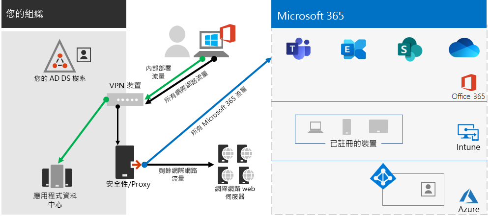
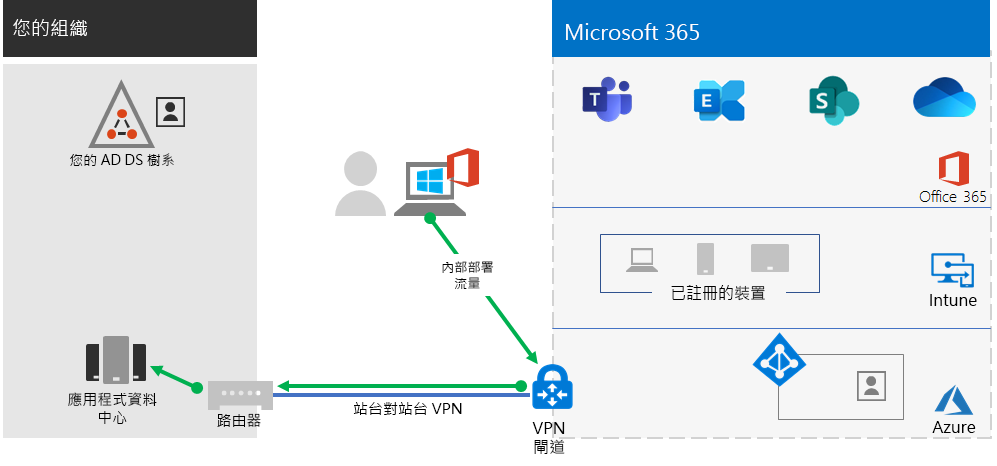

# 步驟 2：Step 2. 可遠端存取內部部署應用程式和服務Provide remote access to on-premises apps and services

如果貴組織使用遠端存取 VPN 解決方案 (通常 VPN 伺服器安裝在網路的邊緣，而 VPN 用戶端則安裝在使用者的裝置上)，您的使用者就可以使用遠端存取 VPN 連線存取內部部署應用程式和伺服器。If your organization uses a remote access VPN solution, typically with VPN servers on the edge of your network and VPN clients installed on your users' devices, your users can use remote access VPN connections to access on-premises apps and servers. 但您可能需要將 Microsoft 365 雲端服務的流量最佳化。But you may need to optimize traffic to Microsoft 365 cloud-based services.

如果您的使用者沒有使用 VPN 解決方案，您可以使用 Azure Active Directory (Azure AD) 應用程式 Proxy 和 Azure 點對站台 (P2S) VPN 提供存取權，端視您所有的應用程式是否為 Web 架構而定。If your users do not use a VPN solution, you can use Azure Active Directory (Azure AD) Application Proxy and Azure Point-to-Site (P2S) VPN to provide access, depending on whether all your apps are web-based.

有三種主要設定：There are three primary configurations:

1. 您已經在使用遠端存取 VPN 解決方案。You are already using a remote access VPN solution.
2. 您沒有使用遠端存取 VPN 解決方案、您有混合式身分識別，而且您只需要遠端存取內部部署的 Web 架構應用程式。You are not using a remote access VPN solution, you have hybrid identity, and you need remote access only to on-premises web-based apps.
3. 您沒有使用遠端存取 VPN 解決方案、您需要存取內部部署應用程式，而且其中部分應用程式並非 Web 架構。You are not using a remote access VPN solution and you need access to on-premises apps, some of which are not web-based.

請參閱此流程圖，了解本文所述的遠端存取設定選項。See this flowchart for the remote access configuration options discussed in this article.

使用遠端存取連線時，您也可以使用[遠端桌面](https://support.microsoft.com/help/4028379/windows-10-how-to-use-remote-desktop)，將您的使用者連線到內部部署電腦。With remote access connections, you can also use [Remote Desktop](https://support.microsoft.com/help/4028379/windows-10-how-to-use-remote-desktop) to connect your users to an on-premises PC. 例如，遠端工作者可以從 Windows、iOS 或 Android 裝置，使用遠端桌面連線到其辦公室中的電腦。For example, a remote worker can use Remote Desktop to connect to the PC in their office from their Windows, iOS or Android device. 從遠端連線之後，他們就可以像坐在電腦前面一樣使用電腦。Once they are remotely connected, they can use it as if they were sitting in front of it.

## 針對 Microsoft 365 雲端服務，將遠端存取 VPN 用戶端的效能最佳化Optimize performance for remote access VPN clients to Microsoft 365 cloud services

如果您的遠端工作者使用傳統的 VPN 用戶端取得貴組織網路的遠端存取權，請確認 VPN 用戶端支援分割通道。If your remote workers are using a traditional VPN client to obtain remote access to your organization network, verify that the VPN client has split tunneling support.

如果沒有分割通道，您所有的遠端工作流量都會透過 VPN 連線傳送，其中必須先將流量轉送給貴組織的邊緣裝置、進行處理，然後透過網際網路傳送。Without split tunneling, all of your remote work traffic gets sent across the VPN connection, where it must be forwarded to your organization’s edge devices, get processed, and then sent on the Internet.

Microsoft 365 流量必須透過貴組織進行間接路由，這可能是從距離 VPN 用戶端實體位置很遠的位置轉送到 Microsoft 網路進入點。Microsoft 365 traffic must take an indirect route through your organization, which could be the forwarded to a Microsoft network entry point far away from the VPN client’s physical location. 這種間接路徑可增加網路流量的延遲，並降低整體效能。This indirect path adds latency to the network traffic and decreases overall performance. 

您可以利用分割通道設定 VPN 用戶端，以排除透過 VPN 連線傳送到組織網路的特定類型流量。With split tunneling, you can configure your VPN client to exclude specific types of traffic from being sent over the VPN connection to the organization network.

若要將 Microsoft 365 雲端資源的存取最佳化，請設定分割通道 VPN 用戶端，排除透過 VPN 連線到**最佳化**類別 Microsoft 365 端點的流量。To optimize access to Microsoft 365 cloud resources, configure your split tunneling VPN clients to exclude traffic to the **Optimize** category Microsoft 365 endpoints over the VPN connection. 如需詳細資訊，請參閱 [Office 365 端點類別](https://docs.microsoft.com/office365/enterprise/office-365-network-connectivity-principles#new-office-365-endpoint-categories) (部分機器翻譯)。For more information, see [Office 365 endpoint categories](https://docs.microsoft.com/office365/enterprise/office-365-network-connectivity-principles#new-office-365-endpoint-categories). 請參閱[這裡](https://docs.microsoft.com/office365/enterprise/urls-and-ip-address-ranges)的最佳化類別端點清單。See the list of Optimize category endpoints [here](https://docs.microsoft.com/office365/enterprise/urls-and-ip-address-ranges).

如此可讓 VPN 用戶端直接透過網際網路傳送和接收重要的 Microsoft 365 雲端服務流量，並透過最接近的進入點到 Microsoft 網路。This allows the VPN client to send and receive crucial Microsoft 365 cloud service traffic directly over the Internet and to the nearest entry point into the Microsoft network.

如需詳細資訊和指導方針，請參閱[使用 VPN 分割通道將遠端使用者的 Office 365 連線能力最佳化](https://docs.microsoft.com/office365/enterprise/office-365-vpn-split-tunnel)。For more information and guidance, see [Optimize Office 365 connectivity for remote users using VPN split tunneling](https://docs.microsoft.com/office365/enterprise/office-365-vpn-split-tunnel).

## 當您的所有應用程式都為 Web 應用程式且您擁有混合式身分識別時，部署遠端存取Deploy remote access when all your apps are web apps and you have hybrid identity

如果您的遠端工作者並未使用傳統的 VPN 用戶端，且您的內部部署使用者帳戶和群組已與 Azure AD 同步處理，則您可以使用 Azure AD 應用程式 Proxy，為內部網路伺服器上託管的 Web 架構應用程式，提供安全的遠端存取。If your remote workers are not using a traditional VPN client and your on-premises user accounts and groups are synchronized with Azure AD, you can use Azure AD Application Proxy to provide secure remote access for web-based applications hosted on intranet servers. Web 架構應用程式包括 SharePoint 網站、Outlook Web Access 伺服器或其他任何 Web 架構企業營運應用程式。Web-based applications include SharePoint sites, Outlook Web Access servers, or any other web-based line of business applications. 

以下是 Azure AD 應用程式 Proxy 的元件。Here are the components of Azure AD Application Proxy.

如需詳細資訊，請參閱這個 [Azure AD 應用程式 Proxy 概觀](https://docs.microsoft.com/azure/active-directory/manage-apps/application-proxy) (部分機器翻譯)。For more information, see this [overview of Azure AD Application Proxy](https://docs.microsoft.com/azure/active-directory/manage-apps/application-proxy).

## 並非所有應用程式都是 Web 應用程式時，部署遠端存取Deploy remote access when not all your apps are web apps

如果您的遠端工作者並未使用傳統的 VPN 用戶端，且您的任何應用程式都不是 Web 架構，則您可以使用 Azure 點對站台 (P2S) VPN。If your remote workers are not using a traditional VPN client and any of your apps are not web-based, you can use an Azure Point-to-Site (P2S) VPN.

P2S VPN 連線會透過 Azure 虛擬網路，建立遠端工作者裝置到貴組織網路的安全連線。A P2S VPN connection creates a secure connection from a remote worker’s device to your organization network through an Azure virtual network. 

如需詳細資訊，請參閱這個 [P2S VPN 概觀](https://docs.microsoft.com/azure/vpn-gateway/point-to-site-about) (部分機器翻譯)。For more information, see this [overview of P2S VPN](https://docs.microsoft.com/azure/vpn-gateway/point-to-site-about).

## 部署 Windows 虛擬桌面，以便為使用個人裝置的遠端工作者提供遠端存取Deploy Windows Virtual Desktop to provide remote access for remote workers using personal devices 

為支援只能使用其個人和非受管理裝置的遠端工作者，請使用 Azure 中的 Windows 虛擬桌面建立並配置虛擬桌面，讓您的使用者可以在家使用。To support remote workers who can only use their personal and unmanaged devices, use Windows Virtual Desktop in Azure to create and allocate virtual desktops for your users to use from home.

虛擬化的電腦可以充當連線至貴組織網路的電腦使用。Virtualized PCs can act just like PCs connected to your organization network.

如需詳細資訊，請參閱這個 [Windows 虛擬桌面的概觀](https://docs.microsoft.com/azure/virtual-desktop/overview)。For more information, see [this overview of Windows Virtual Desktop](https://docs.microsoft.com/azure/virtual-desktop/overview).

## 適用於遠端存取的系統管理技術資源Admin technical resources for remote access

- [如何快速優化遠端員工的 Office 365 流量，並降低基礎結構負載](https://techcommunity.microsoft.com/t5/office-365-blog/how-to-quickly-optimize-office-365-traffic-for-remote-staff-amp/ba-p/1214571) (英文)[How to quickly optimize Office 365 traffic for remote staff & reduce the load on your infrastructure](https://techcommunity.microsoft.com/t5/office-365-blog/how-to-quickly-optimize-office-365-traffic-for-remote-staff-amp/ba-p/1214571)
- [使用 VPN 分割通道將遠端使用者的 Office 365 連線能力最佳化Optimize Office 365 connectivity for remote users using VPN split tunneling](https://docs.microsoft.com/office365/enterprise/office-365-vpn-split-tunnel)

## 步驟 2 的結果Results of Step 2

為您的遠端工作者部署遠端存取解決方案之後：After deployment of a remote access solution for your remote workers:

| 遠端存取設定Remote access configuration | 結果Results |
|:-------|:-----|
| 遠端存取 VPN 解決方案已就緒A remote access VPN solution is in place | 您已經針對分割通道以及 Microsoft 365 端點的最佳化類別，設定您的遠端存取 VPN 用戶端。You have configured your remote access VPN client for split tunneling and for the Optimize category of Microsoft 365 endpoints. |
| 沒有遠端存取 VPN 解決方案，而且您只需要遠端存取內部部署的 Web 架構應用程式No remote access VPN solution and you need remote access only to on-premises web-based apps | 您已經設定 Azure 應用程式 Proxy。You have configured Azure Application Proxy. |
| 沒有遠端存取 VPN 解決方案、您需要存取內部部署應用程式，而且其中部分應用程式並非 Web 架構No remote access VPN solution and you need access to on-premises apps, some of which are not web-based | 您已經設定 Azure P2S VPN。You have configured Azure P2S VPN. |
| 遠端工作者正在家中使用其個人裝置Remote workers are using their personal devices from home | 您已經設定 Windows 虛擬桌面。You have configured Windows Virtual Desktop. |
|||

## 後續步驟Next step

繼續執行[步驟 3](empower-people-to-work-remotely-manage-endpoints.md) 以管理裝置、電腦及其他端點。Continue with [Step 3](empower-people-to-work-remotely-manage-endpoints.md) to manage your devices, PCs, and other endpoints.
