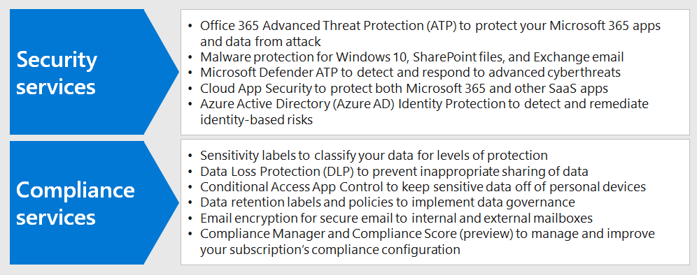

# 步驟 3：為遠端工作者部署安全性與合規性Step 3: Deploy security and compliance for remote workers

對於從未，或很少進辦公室的某些遠端工作者來說，安全性和合規性是整體解決方案的重要組成部分。For remote workers, some of whom never go into the office or who go infrequently, security and compliance are an important part of the overall solution. 他們所有的通訊都會透過網際網路進行，而不是局限於組織內部網路。All of their communications occur over the Internet instead of being confined to an organizational intranet. 

您和您的工作者可以做一些事情來保持生產力，同時降低網路安全風險並持續遵守內部原則和資料法規。There are things you and your workers can do to remain productive while decreasing cybersecurity risk and maintaining compliance with your internal policies and data regulations.

遠端工作需要下列安全性與合規性元素：Remote work needs these elements of security and compliance:

- 對遠端工作者使用的生產力應用程式 (例如 Microsoft Teams) 進行存取管制Controlled access to the productivity apps that remote workers use, such as Microsoft Teams 
- 管制存取和保護遠端工作者建立和使用的資料，例如聊天交談或共用檔案Controlled access to and protection of the data that remote workers create and use, such as chat conversations or shared files
- 保護 Windows 10 裝置不受惡意程式碼及其他類型的網路攻擊Protection of Windows 10 devices from malware and other types of cyberattacks
- 保護電子郵件、檔案和網站，並以一致的方式標記敏感度和保護層級Protection of email, files, and site with consistent labeling for levels of sensitivity and protection
- 防止資訊外洩Prevention of leaked information
- 遵守地區資料法規Adherence to regional data regulations

## 安全性Security

使用 Microsoft 365 的安全性功能來保護您的應用程式和資料。Protect your applications and data with these security features of Microsoft 365.

| 功能Capability or feature | 描述Description | 授權Licensing |
|:-------|:-----|:-------|
| Office 365 進階威脅防護（ATP）Office 365 Advanced Threat Protection (ATP) | 保護您的 Microsoft 365 應用程式和資料不受攻擊，例如電子郵件訊息、Office 文件和共同作業工具。Protect your Microsoft 365 apps and data—such as email messages, Office documents, and collaboration tools—from attack.    Office ATP 會收集並分析來自應用程式的訊號，以進行偵測、調查，並修正安全風險，並抵禦電子郵件訊息、連結 (Url) 和共同作業工具所帶來的惡意威脅，以保護組織。Office ATP collects and analyzes signals from your apps for detection, investigation, and remediation of security risks and safeguards your organization against malicious threats posed by email messages, links (URLs), and collaboration tools. | Microsoft 365 E3 或 E5Microsoft 365 E3 or E5 | 
| 惡意程式碼防護Malware protection | Microsoft Defender 防毒軟體和 Device Guard 提供裝置型惡意程式碼保護功能。‎Microsoft Defender Antivirus and Device Guard provides device-based malware protection.    SharePoint‎ Online 會自動掃描檔案上傳是否有已知的惡意程式碼。SharePoint‎ Online automatically scans file uploads for known malware. ‎‎   Exchange Online Protection‎ (‎EOP‎) 可保護雲端信箱。Exchange Online Protection‎ (‎EOP‎) secures cloud mailboxes. | Microsoft 365 E3 或 E5Microsoft 365 E3 or E5 |
| Microsoft Defender ATPMicrosoft Defender ATP | 保護組織的裝置不受網路威脅和資料外洩，並偵測、調查及應變進階威脅。Protect your organization’s devices from cyberthreats and data breaches and detect, investigate, and respond to advanced threats. | Microsoft 365 E5Microsoft 365 E5 |
| Cloud App SecurityCloud App Security | 保護您的雲端服務不受攻擊，包括 Microsoft 365 和其他 SaaS 應用程式。Protect your cloud-based services—both Microsoft 365 and other SaaS apps— from attack. | Microsoft 365 E5 或個別的 Cloud App Security 授權Microsoft 365 E5 or individual Cloud App Security licenses |
| Azure AD Identity ProtectionAzure AD Identity Protection  | 自動化身分識別風險的偵測和修正。Automate detection and remediation of identity-based risks.   建立以風險為基礎的條件式存取原則，對於有風險的登入要求多重要素驗證 (MFA)。Create risk-based Conditional Access policies to require multi-factor authentication (MFA) for risky sign-ins. | Microsoft 365 E5 或 E3 (含 Azure AD Premium P2 授權)Microsoft 365 E5 or E3 with Azure AD Premium P2 licenses |
||||

如需詳細資訊，請參閱[開始使用 Microsoft 365 合規性的快速工作](../compliance/compliance-quick-tasks.md) (部分機器翻譯)。See [Quick tasks for getting started with Microsoft 365 compliance](../compliance/compliance-quick-tasks.md) for more information.

## 合規性Compliance

遵守內部原則或管理法規需求，並遵循下列 Microsoft 365 合規性功能。Comply with internal policies or regulatory requirements with these compliance features of Microsoft 365.

| 功能Capability or feature | 描述Description | 授權Licensing |
|:-------|:-----|:-------|
| 敏感度標籤Sensitivity labels | 在電子郵件、文件或網站上套用具有不同保護層級的標籤，可以在不影響使用者工作效率和共同作業能力的情況下對組織的資料進行分類和保護。Classify and protect your organization's data without hindering the productivity of users and their ability to collaborate by placing labels with various levels of protection on email, files, or sites. | Microsoft 365 E3 或 E5Microsoft 365 E3 or E5 |
| 資料外洩防護 (DLP)Data Loss Protection (DLP) | 偵測、警告，並封鎖風險、不慎或不當的共用，例如共用包含個人資訊的資料 (內部和外部)。Detect, warn, and block risky, inadvertent, or inappropriate sharing, such as sharing of data containing personal information, both internally and externally. | Microsoft 365 E3 或 E5Microsoft 365 E3 or E5 | 
| 條件式存取應用程式控制Conditional Access App Control | 防止敏感性資料遭下載至使用者的個人裝置。Prevent sensitive data from being downloaded to users' personal devices. | Microsoft 365 E3 或 E5Microsoft 365 E3 or E5 |
| 資料保留標籤和原則Data retention labels and policies | 實施資訊控管控制，例如資料的保留時間以及對客戶個人資料儲存的要求，以符合組織的原則或資料法規。Implement information governance controls, such as how long to keep data and requirements on the storage of personal data on customers, to comply with your organization's policies or data regulations. | Microsoft 365 E3 或 E5Microsoft 365 E3 or E5 |
| Office 郵件加密 (OME)Office message encryption (OME) | 在組織內外的人員之間傳送和接收加密的電子郵件訊息，包含管制資料，例如客戶的個人資料。Send and receive encrypted email messages between people inside and outside your organization that contains regulated data, such as personal data on customers. | Microsoft 365 E3 或 E5Microsoft 365 E3 or E5 |
| 合規性管理員Compliance Manager | 使用 Microsoft 服務信任入口網站中的這個工作流程型風險評估工具來管理與 Microsoft 雲端服務相關的合規性活動。Manage regulatory compliance activities related to Microsoft cloud services with this workflow-based risk assessment tool in the Microsoft Service Trust Portal. | Microsoft 365 E3 或 E5Microsoft 365 E3 or E5 |
| 合規性分數 (預覽)Compliance Score (preview) | 在 Microsoft 365 合規性中心中，查看合規性設定的整體分數以及改善建議。See an overall score of your current compliance configuration and recommendations for improving it in the Microsoft 365 Compliance Center. | Microsoft 365 E3 或 E5Microsoft 365 E3 or E5 |
| 通訊合規性Communication Compliance  | 針對貴組織中不適當的郵件進行偵測、捕獲並採取修正動作。Detect, capture, and take remediation actions for inappropriate messages in your organization. | Microsoft 365 E5 或具有合規性或測試人員風險管理附加元件的 Microsoft 365 E3 Microsoft 365 E5 or Microsoft 365 E3 with the Compliance or Insider Risk Management add-ons |
| 測試人員風險管理Insider Risk Management |  偵測、調查和處理貴組織中的惡意和疏忽活動。Detect, investigate, and act on malicious and inadvertent activities in your organization. 即使工作者使用非管理裝置，Microsoft 365 也能偵測這些類型的活動。Microsoft 365 can detect these kinds of activities even when a worker is using an unmanaged device. | Microsoft 365 E5 或具有合規性或測試人員風險管理附加元件的 Microsoft 365 E3 Microsoft 365 E5 or Microsoft 365 E3 with the Compliance or Insider Risk Management add-ons |
||||

如需詳細資訊，請參閱[安全性團隊支援在家工作的 12 個首要工作](../security/top-security-tasks-for-remote-work.md)。See [Top 12 tasks for security teams to support working from home](../security/top-security-tasks-for-remote-work.md) for more information.

## 步驟 3 的結果Results of Step 3

針對您的遠端工作者，您已實施：For your remote workers, you have implemented:

- 安全性：Security:
  - 對遠端工作者用來進行通訊和共同作業的應用程式和資料進行存取管制Controlled access to apps and data that remote workers use to communicate and collaborate
  - 針對雲端服務資料、電子郵件和 Windows 10 裝置進行惡意程式碼保護Malware protection for cloud service data, email, and Windows 10 devices 
- 合規性：Compliance:
  - 以一致的方式標記敏感度和保護層級Consistent labeling for levels of sensitivity and protection
  - 防止資訊洩漏的原則Policies to prevention information leakage
  - 遵守地區資料法規Adherence to regional data regulations

## 下一步Next step

繼續執行[步驟 4](empower-people-to-work-remotely-manage-endpoints.md) 以管理裝置、電腦及其他端點。Continue with [Step 4](empower-people-to-work-remotely-manage-endpoints.md) to manage your devices, PCs, and other endpoints.
