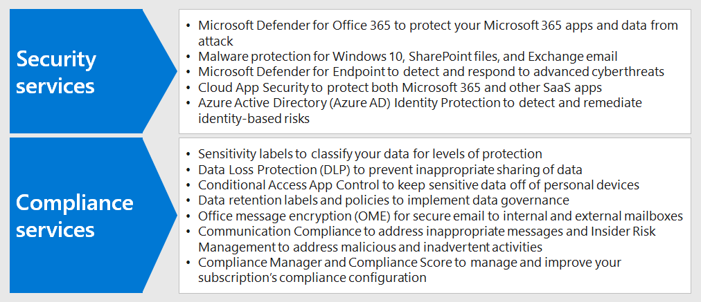

# 步驟 3：為遠端工作者部署安全性與合規性

對於從未，或很少進辦公室的某些遠端工作者來說，安全性和合規性是整體解決方案的重要組成部分。 他們所有的通訊都會透過網際網路進行，而不是局限於組織內部網路。 

您和您的工作者可以做一些事情來保持生產力，同時降低網路安全風險並持續遵守內部原則和資料法規。

遠端工作需要下列安全性與合規性元素：

- 對遠端工作者使用的生產力應用程式 (例如 Microsoft Teams) 進行存取管制 
- 管制存取和保護遠端工作者建立和使用的資料，例如聊天交談或共用檔案
- 保護 Windows 10 裝置不受惡意程式碼及其他類型的網路攻擊
- 保護電子郵件、檔案和網站，並以一致的方式標記敏感度和保護層級
- 防止資訊外洩
- 遵守地區資料法規

以下是可為遠端工作者提供安全性與合規性服務的 Microsoft 365 功能。

## 安全性

使用 Microsoft 365 的安全性功能來保護您的應用程式和資料。

| 功能 | 描述 | 授權 |
|:-------|:-----|:-------|
| Office 365 進階威脅防護（ATP） | 保護您的 Microsoft 365 應用程式和資料不受攻擊，例如電子郵件訊息、Office 文件和共同作業工具。    Office ATP 會收集並分析來自應用程式的訊號，以進行偵測、調查，並修正安全風險，並抵禦電子郵件訊息、連結 (Url) 和共同作業工具所帶來的惡意威脅，以保護組織。 | Microsoft 365 E3 或 E5 | 
| 惡意程式碼防護 | Microsoft Defender 防毒軟體和 Device Guard 提供裝置型惡意程式碼保護功能。    SharePoint‎ Online 會自動掃描檔案上傳是否有已知的惡意程式碼。 ‎   Exchange Online Protection‎ (‎EOP‎) 可保護雲端信箱。 | Microsoft 365 E3 或 E5 |
| Microsoft Defender ATP | 保護組織的裝置不受網路威脅和資料外洩，並偵測、調查及應變進階威脅。 | Microsoft 365 E5 |
| Cloud App Security | 保護您的雲端服務不受攻擊，包括 Microsoft 365 和其他 SaaS 應用程式。 | Microsoft 365 E5 或個別的 Cloud App Security 授權 |
| Azure AD Identity Protection  | 自動化身分識別風險的偵測和修正。   建立以風險為基礎的條件式存取原則，對於有風險的登入要求多重要素驗證 (MFA)。 | Microsoft 365 E5 或 E3 (含 Azure AD Premium P2 授權) |
||||

如需詳細資訊，請參閱[安全性團隊支援在家工作的 12 個首要工作](../security/top-security-tasks-for-remote-work.md)。

## 合規性

遵守內部原則或管理法規需求，並遵循下列 Microsoft 365 合規性功能。

| 功能 | 描述 | 授權 |
|:-------|:-----|:-------|
| 敏感度標籤 | 在電子郵件、文件或網站上套用具有不同保護層級的標籤，可以在不影響使用者工作效率和共同作業能力的情況下對組織的資料進行分類和保護。 | Microsoft 365 E3 或 E5 |
| 資料外洩防護 (DLP) | 偵測、警告，並封鎖風險、不慎或不當的共用，例如共用包含個人資訊的資料 (內部和外部)。 | Microsoft 365 E3 或 E5 | 
| 條件式存取應用程式控制 | 防止敏感性資料遭下載至使用者的個人裝置。 | Microsoft 365 E3 或 E5 |
| 資料保留標籤和原則 | 實施資訊控管控制，例如資料的保留時間以及對客戶個人資料儲存的要求，以符合組織的原則或資料法規。 | Microsoft 365 E3 或 E5 |
| Office 郵件加密 (OME) | 在組織內外的人員之間傳送和接收加密的電子郵件訊息，包含管制資料，例如客戶的個人資料。 | Microsoft 365 E3 或 E5 |
| 合規性管理員 | 使用 Microsoft 服務信任入口網站中的這個工作流程型風險評估工具來管理與 Microsoft 雲端服務相關的合規性活動。 | Microsoft 365 E3 或 E5 |
| 合規性管理員 | 在 Microsoft 365 合規性中心中，查看您目前合規性設定的整體分數以及改善建議。 | Microsoft 365 E3 或 E5 |
| 通訊合規性  | 針對貴組織中不適當的郵件進行偵測、捕獲並採取修正動作。 | Microsoft 365 E5 或具有合規性或測試人員風險管理附加元件的 Microsoft 365 E3  |
| 測試人員風險管理 |  偵測、調查和處理組織中的惡意和疏忽風險。 即使工作者使用非管理裝置，Microsoft 365 也能偵測這些類型的風險。 | Microsoft 365 E5 或具有合規性或測試人員風險管理附加元件的 Microsoft 365 E3  |
||||

如需詳細資訊，請參閱[開始使用 Microsoft 365 合規性的快速工作](../compliance/compliance-quick-tasks.md)。

## 步驟 3 的結果

針對您的遠端工作者，您已實施：

- 安全性
  - 對遠端工作者用來進行通訊和共同作業的應用程式和資料進行存取管制
  - 針對雲端服務資料、電子郵件和 Windows 10 裝置進行惡意程式碼保護 
- 合規性
  - 以一致的方式標記敏感度和保護層級
  - 防止資訊洩漏的原則
  - 遵守地區資料法規

## 下一步

繼續執行[步驟 4](empower-people-to-work-remotely-manage-endpoints.md) 以管理裝置、電腦及其他端點。
