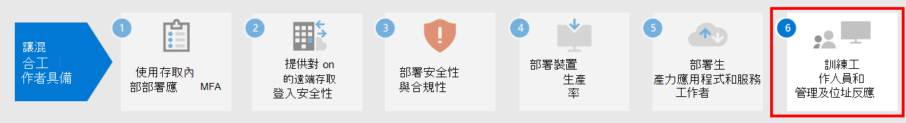

# 步驟 5：Step 5. 部署遠端工作者生產力應用程式和服務Deploy remote worker productivity apps and services

為提高生產力，人員之間必須能夠溝通並共同作業。To be productive, people need to communicate and collaborate with one another. 他們需要開會、透過語音和文字交談、建立新內容、共用資訊和檔案、交換電子郵件，以及管理行事曆和工作。They need to meet, chat by voice and text, create new content and share information and files, exchange email, and manage calendars and tasks. Microsoft 365 為這些關鍵功能提供雲端服務：Microsoft 365 provides cloud-based services for all of these key functions:

- 若要讓在不同地方工作的人員保持聯繫，請使用 Microsoft Teams，為組織、部門，以及小組和個人，提供適用於會議、交談和檔案儲存的共同交流中心。To keep people connected while they work apart, use Microsoft Teams, which provides a common hub of communication for meetings, chats, and file storage for the organization, departments, and for small teams and individuals. 
- 若要交換電子郵件及管理行事曆、連絡人和工作，請使用 Exchange Online 和 Outlook 用戶端。For exchanging email and managing calendars, contacts, and tasks, use Exchange Online and the Outlook client.
- 若要儲存及共同處理檔案，請使用 SharePoint 和 OneDrive。For storing and collaborating on files, use SharePoint and OneDrive. 您可以在網頁瀏覽器內或在 Teams 內使用它們。You can use them within a web browser or within Teams.
- 若要建立新內容或共同處理現有內容，Microsoft 365 App 是安裝在您本機電腦上的 Word、PowerPoint、Excel 和 Outlook 版本，而且會收到持續的功能和安全性更新。For creating new content or collaborating on existing content, Microsoft 365 Apps are versions of Word, PowerPoint, Excel, and Outlook that are installed on your local computer and receive ongoing feature and security updates.

## 讓人員透過 Microsoft Teams 保持聯繫Keep people connected with Microsoft Teams

Teams 可讓您在同一個地方交談、開會、通話和共同作業。Teams allows you to chat, meet, call, and collaborate all in one place. 數百萬個人每天都在 Teams 中完成自己的工作，因為此工具可將您從遠端工作所需的一切都整合到一個中樞，以進行團隊作業。Millions of people get their work done in Teams every day because it brings together everything you need to work remotely into a hub for teamwork. 

如需詳細指導方針，請參閱[支援使用 Microsoft Teams 的遠端工作者](https://docs.microsoft.com/microsoftteams/support-remote-work-with-teams)。For detailed guidance, see [Support remote workers using Microsoft Teams](https://docs.microsoft.com/microsoftteams/support-remote-work-with-teams). 

觀看[使用 Microsoft Teams 啟用混合式工作網路廣播](https://resources.techcommunity.microsoft.com/enabling-hybrid-work/)，以取得將 Teams 用於遠端工作的指導方針和示範。Watch the [Enabling hybrid work with Microsoft Teams webcasts](https://resources.techcommunity.microsoft.com/enabling-hybrid-work/) for guidance and demos on using Teams for remote work.

### 聊天和交談Chat and conversations

聊天和往來交談位於 Teams 中央，可支援個別的一對一聊天和群組聊天與交談。Chat and threaded conversations are at the center of Teams with support for individual 1:1 chats and group chats and conversations. 遠端工作者可以使用群組聊天或一對一訊息中的 GIF、貼紙和表情圖示來分享資訊、觀點和個性。Remote workers can share information, opinions, and personality by using gifs, stickers, and emojis in group chats or one-to-one messages.

### 會議和召集會議Meetings and conferencing 

Teams 當然可以協助您維護與遠端工作者之間的溝通與資訊共用，尤其是支援多達 250 人的會議。Teams can certainly help maintain communications and information sharing with remote workers, especially with meetings that support up to 250 people. Teams 會議可與組織內外的人員進行互動式共同作業會議。Teams meetings enable interactive, collaborative meetings with people inside and outside your organization. 遠端工作者可以使用 Teams 會議進行日常活動，包括週期性的專案檢查點、跟進同事的進度、集思廣益的會議，以及方便與客戶交談。Remote workers can use Teams meetings for day-to-day activities including recurring project checkpoints, catching-up with colleagues, brainstorming sessions, and facilitating conversations with customers. 

### 通話Calling

Teams 支援在使用者甚至是使用同盟的其他組織之間進行直接 VoIP 通話。Teams supports direct VoIP calling between users and even other organizations using federation. 其與會議使用相同的轉碼器，且不需要額外的 PSTN 費用，就能在全球提供卓越的音訊。It uses the same codecs as meetings and provide great audio world-wide without additional PSTN charges. 不過，有些使用者可能需要專用的電話號碼，才能在遠端工作時撥打外部電話。However, some users may need a dedicated phone number to take external calls when working remotely. Teams 可以為這些使用者快速提供雲端電話服務，撥打及接聽電話。Teams can quickly provide cloud phone service for these users to make and receive phone calls.

### 應用程式和工作流程Apps and workflows

Teams 為應用程式和工作流程提供一個平台，您可以從電腦版、網頁版和行動版的 Teams 存取這個平台。Teams provides a platform for apps and workflows that can be accessed from the desktop, web, and mobile versions of Teams. Teams 提供數百個由 Microsoft 發行的應用程式和第三方應用程式，以吸引使用者、支援生產力，並將常用的商務服務整合到 Teams 中。Teams provides hundreds of apps published by Microsoft and by third parties to engage users, support productivity, and integrate commonly used business services into Teams. 使用者和系統管理員也可以使用低程式碼 Power Apps 和 Power Automate 開發工具，為 Teams 建立自訂的應用程式和自動化的工作流程。Users and Admins can also create custom apps and automated workflows for Teams using the low-code Power Apps and Power Automate development tools.

應用程式和工作流程可以透過收集和共用關鍵資訊、將重複的工作自動化，並允許其與互動式 Bot 交談，讓遠端工作者在 Teams 中更具生產力。Apps and workflows let remote workers be more productive in Teams, by collecting and sharing critical information, automating repetitive tasks, and allowing them to chat with interactive bot. 將應用程式釘選到頻道或 Teams 應用程式列，可讓使用者在相關空間中輕鬆存取這些應用程式，而且系統管理員可以釘選應用程式，以便對每個人都應該使用的應用程式，提高其認知度和採用率。Pinning apps to a channel or the Teams app bar is a great way for users to make these apps easily accessible in a relevant space, and admins can pin apps to drive awareness and adoption of the apps that everyone should be using.

## 使用 Exchange Online 和 Outlook 交換電子郵件並管理行事曆、連絡人和工作Exchange email and manage calendars, contacts, and tasks with Exchange Online and Outlook

遠端工作者可以透過 Outlook，在同一個地方使用電子郵件、行事曆、連絡人、工作等等，隨時保持聯繫並井井有條。With Outlook, remote workers can stay connected and organized with email, calendars, contacts, tasks, and more—together in one place. Outlook 可以根據與您相關的內容，協助您隨時掌握進度並排列優先順序。Outlook helps you stay on track and prioritize your day based on what’s relevant to you. Outlook 可讓您直接從 OneDrive 共用附件、規劃並加入 Teams 會議、查看和共用行事曆，以及為其他人提供委派權限。Outlook enables you to share attachments right from OneDrive, plan and join Teams meetings, view and share calendars, and provide delegate permissions to others. 了解公司和個人承諾中接下來將要發生的事情，以及需要注意的事情，可以協助遠端工作者將重點放在重要的工作上。Knowing what’s coming up next across both work and personal commitments and what needs attention can help remote workers focus on what matters. Outlook 可為遠端工作者提供實用的方式來管理其時間，並能輕鬆地找到所需的資訊，包括檔案、組織中的人員等等。Outlook provides helpful ways for remote workers to manage their time and to find what they need easily, including files, people in the organization, and more. 

請參閱 [本文](../security/office-365-security/secure-email-recommended-policies.md) 以了解資料存取原則所建議使用的身分識別和裝置，並保護支援新式驗證和 [限制存取] 的組織的電子郵件和電子郵件用戶。See [this article](../security/office-365-security/secure-email-recommended-policies.md) for the recommended identity and device access policies to protect organizational email and email clients that support modern authentication and Conditional Access.

## 使用 SharePoint 和 OneDrive 儲存和共同處理檔案Store and collaborate on files with SharePoint and OneDrive

對於內容共同作業，遠端工作者可以使用 SharePoint 和 OneDrive 資料夾作為雲端中用來儲存和共用檔案、共同撰寫、溝通及共同作業的集中位置。For content collaboration, remote workers can use SharePoint and OneDrive folders as a central place in the cloud to store and share files, co-author, communicate, and collaborate. 遠端工作者可以從網頁瀏覽器、Teams 和 Office 應用程式的任何位置安全地工作。Remote workers can securely work from anywhere from a web browser, from Teams, and from Office apps.

您可能必須將文件從以下位置移轉至 SharePoint 或 OneDrive：You might have to migrate your documents to SharePoint or OneDrive from:

- [SharePoint Server 小組網站SharePoint Server Team Sites](https://docs.microsoft.com/sharepointmigration/sp-teams-sites-migration-guide)
- [MySitesMySites](https://docs.microsoft.com/sharepointmigration/mysites-to-onedrive-migration-guide)
- [檔案共用File shares](https://docs.microsoft.com/sharepointmigration/fileshare-to-odsp-migration-guide)
- [BoxBox](https://docs.microsoft.com/sharepointmigration/box-to-onedrive-and-sharepoint-migration-guide)

若要保護 SharePoint 和 OneDrive，請參閱[此文章](../security/office-365-security/sharepoint-file-access-policies.md)的建議身分識別和裝置存取原則。To protect SharePoint and OneDrive, see [this article](../security/office-365-security/sharepoint-file-access-policies.md) for the recommended identity and device access policies.

## 使用 Microsoft 365 Apps 建立並共同處理內容Create and collaborate on content with Microsoft 365 Apps

Microsoft 365 Apps 對於企業而言，是最具生產力且安全的 Office 體驗，可讓使用者隨時隨地順利地共同作業。Microsoft 365 Apps is the most productive and secure Office experience for enterprises, allowing people to work together seamlessly from anywhere, anytime. 遠端工作者可以同時與多人共同處理文件、即時查看編輯及變更，並與其他人在任何筆記型電腦、電腦或行動裝置上共同撰寫。Remote workers can collaborate on a document with multiple people simultaneously, see edits and changes in real time, and coauthor with others on any laptop, PC, or mobile device.

如需詳細資訊，請參閱 [Microsoft 365 Apps 的部署指南](https://docs.microsoft.com/deployoffice/deployment-guide-microsoft-365-apps)。For more information, see the [Deployment guide for Microsoft 365 Apps](https://docs.microsoft.com/deployoffice/deployment-guide-microsoft-365-apps).

## 適用於生產力應用程式和服務的系統管理技術資源Admin technical resources for productivity apps and services

- [支援使用 Microsoft Teams 的遠端工作者Support remote workers using Microsoft Teams](https://docs.microsoft.com/microsoftteams/support-remote-work-with-teams)
- [使用 Microsoft Teams 啟用混合式工作網路廣播Enabling hybrid work with Microsoft Teams webcasts](https://resources.techcommunity.microsoft.com/enabling-hybrid-work/)
- [Teams 客戶成功套件下載Teams Customer Success Kit download](https://www.microsoft.com/download/details.aspx?id=54244)
- [推動 Teams 採用的工具Tools for driving Teams adoption](https://docs.microsoft.com/microsoftteams/adopt-tools-and-downloads) 
- [建立 Microsoft Teams 的變更管理策略](https://docs.microsoft.com/MicrosoftTeams/change-management-strategy) (部分機器翻譯)[Create a change management strategy for Microsoft Teams](https://docs.microsoft.com/MicrosoftTeams/change-management-strategy)
- [擁有三層防護的 TeamsTeams with three tiers of protection](configure-teams-three-tiers-protection.md)

## 以生產力應用程式和服務作為使用者培訓資源User training resources for productivity apps and services

- [在 Office 和 Microsoft 365 上訓練您的使用者Train your users on Office and Microsoft 365](https://support.microsoft.com/office/train-your-users-on-office-and-microsoft-365-7cba3c97-7f19-46ed-a1c6-763971a26c27)
- [使用網頁版 OfficeUse Office for the web](https://support.microsoft.com/office/get-started-with-office-for-the-web-in-microsoft-365-5622c7c9-721d-4b3d-8cb9-a7276c2470e5)

## 下一步Next step

如需訓練使用者並監視其是否成功，請繼續進行[步驟 6](empower-people-to-work-remotely-train-monitor-usage.md)。Continue with [Step 6](empower-people-to-work-remotely-train-monitor-usage.md) to train your users and monitor their success.
