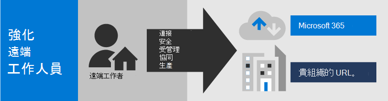
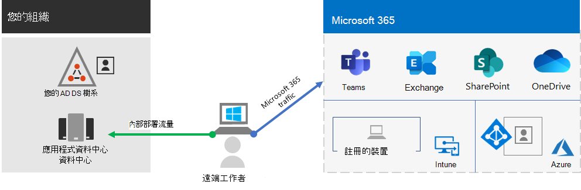
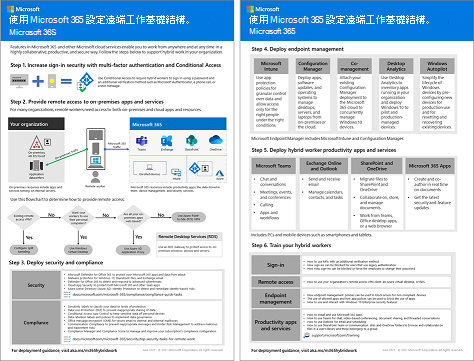
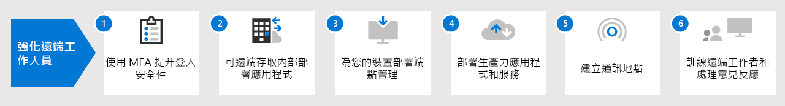

# 使用 Microsoft 365 設定混合式工作基礎結構。

若要保護及最佳化工作者的生產力和共同作業，您必須允許現場和遠端工作者能輕鬆而安全地存取貴組織的內部部署和雲端式資訊、工具和資源。 此解決方案會執行重要基礎結構層部署的步驟，讓您的工作者無論身在何處，都能夠完成最佳工作。

混合式工作者可以在現場或不同地點的遠端工作。 允許員工在辦公室以外的地點工作對許多組織的以下目的非常重要:

- 雇用並保留不想搬家或需要彈性工作環境的員工。
- 縮短工作人員的通勤時間，讓他們有更多時間來提高生產力，並在下班後從事能放鬆壓力的活動。
- 節省辦公室空間。

Microsoft 365 具備讓您的混合式工作者能夠在現場或遠端工作的功能。

> [!NOTE]
> 如果您是 Microsoft 365 新使用者，請參閱[這些資源](https://www.microsoft.com/microsoft-365)。

觀看此影片以取得部署程序的概觀。
 
 
> [!VIDEO https://www.microsoft.com/videoplayer/embed/RE4F1af]

為了讓管理現場和雲端式基礎結構的 IT 專業人員能夠實現混合式工作者生產力，此解決方案提供下列重要功能：

- 連接

  工作者必須能夠隨時隨地都能存取：

  - 您的 Microsoft 365 訂閱中的雲端服務和資料。

  - 組織資源，例如內部部署應用程式資料中心所提供的資源。

- 安全

  以 Microsoft 365 和 Windows 10 的多重要素驗證（MFA）和內建安全性功能保護登入，避免惡意程式碼、惡意攻擊和資料遺失。

- 受管理

  您可以透過安全性設定、允許的應用程式和要求系統運作狀態符合要求來從雲端管理您的混合式工作者的裝置。

- 共同作業和生產力

  透過以下高度共同作業的方式，您的混合式工作者可以像在內部部署工作時一樣高效:

  - 以 Teams 進行線上會議和聊天會話。

  - 透過 SharePoint 和 OneDrive，使用全域協助工具和即時共同作業的雲端式檔案儲存空間以共用工作區。

  - 共用工作和工作流程來劃分並完成工作。

若要取得無縫登入體驗，您的內部部署 Active Directory 網域服務 (AD DS) 使用者帳戶應與 Azure Active Directory (Azure AD) 同步處理。 為了保護您的 Windows 10 裝置，應在 Intune 中註冊。 以下是基礎結構的高階檢視。

若要為您的混合式工作者啟用 Microsoft 365 的功能，請使用這些 Microsoft 365 功能。

| 功能 | 描述 | 授權 |
|:-------|:-----|:-------|
| 採用安全性預設值強制執行 MFA   | 要求第二種形式的登入驗證，以防止身分識別和裝置遭到入侵。安全性預設值要求所有使用者帳戶使用 MFA。   | Microsoft 365 E3 或 E5 |
| 使用條件式存取強制執行 MFA| 根據具有條件式存取原則的登入屬性，要求使用 MFA。    | Microsoft 365 E3 或 E5 |
| 使用風險型條件式存取強制執行 MFA   | 根據使用適用於身分識別的 Microsoft Defender 的使用者登入的風險，要求使用 MFA。 | Microsoft 365 E5 或 E3 (含 Azure AD Premium P2 授權) |
| 自助式密碼重設 (SSPR)    | 允許您的使用者重設或解除鎖定他們的密碼或帳戶。  | Microsoft 365 E3 或 E5 |
| Azure AD 應用程式 Proxy    | 針對內部網路伺服器上的網頁型應用程式，提供安全的遠端存取。   | 需要個別付費的 Azure 訂閱 |
| Azure 點對站 VPN   | 透過 Azure 虛擬網路，建立從遠端工作者裝置到您內部網路的安全連線。   | 需要個別付費的 Azure 訂閱 |
| Windows 虛擬桌面   | 支援只能在 Azure 中執行虛擬桌面才能使用其個人和不受管理裝置的遠端工作者。 | 需要個別付費的 Azure 訂閱 |
| 遠端桌面服務 (RDS) | 允許員工連線到您內部網路上的 Windows 型電腦。 | Microsoft 365 E3 或 E5 |
| 遠端桌面服務閘道   | 加密通訊並防止 RDS 主機直接暴露在網際網路上。 | 需要不同的 Windows Server 授權 |
| Microsoft Intune | 管理裝置和應用程式。   | Microsoft 365 E3 或 E5 |
| 功能 | 在您的裝置上管理軟體安裝、更新及設定 | 需要個別的 Configuration Manager 授權 |
| 電腦分析 | 判斷 Windows 用戶端的更新準備就緒狀況。   | 需要個別的 Configuration Manager 授權 |
| Windows Autopilot | 設定並預先設定新的 Windows 10 裝置，以提高生產力。   | Microsoft 365 E3 或 E5 |
| Microsoft Teams、Exchange Online、SharePoint Online 和 OneDrive、Microsoft 365 Apps、Microsoft Power Platform 和 Yammer | 建立、溝通與共同作業。 | Microsoft 365 E3 或 E5 |
||||

如需安全性與合規性準則，請參閱[為遠端工作者部署安全性與合規性](empower-people-to-work-remotely-security-compliance.md)。

如需這份解決方案的 2 頁摘要，請參閱[強化混合式工作者能力的海報](https://download.microsoft.com/download/9/b/b/9bb5fa79-74e9-497b-87c5-4021e53d9fc2/hybrid-worker-infrastructure.pdf)。

您也可以用 [PowerPoint](https://download.microsoft.com/download/9/b/b/9bb5fa79-74e9-497b-87c5-4021e53d9fc2/hybrid-worker-infrastructure.pptx) 格式下載此海報，以及用 Letter、Legal 或 Tabloid (11 x 17) 大小的紙張列印此海報。

## 為您所有的員工提供混合式工作能力

您可以使用這些設備使您的所有員工在任何地方都能保持生產力：

- 現代化設備（例如 Surface 膝上型電腦和 Windows 10），具有可透過網路直接存取 Microsoft 365 雲端應用程式和服務的功能、安全性和效能。

- 任何裝置，包含在家中使用的舊版膝上型電腦或桌上型電腦，可透過快速部署 [Windows 10 版的虛擬桌面](empower-people-to-work-remotely-remote-access.md#deploy-windows-virtual-desktop-to-provide-remote-access-for-remote-workers-using-personal-devices)，間接存取 Microsoft 365 雲端應用程式和服務。 此選項可提供高效能、強大的安全性和簡化版的 IT 管理。

## 後續步驟

使用下列步驟以保護和最佳化對組織的伺服器和雲端服務的存取，並將混合式工作者的生產力提升至最大。

1. [使用 MFA 提升登入安全性](empower-people-to-work-remotely-secure-sign-in.md)
2. [可遠端存取內部部署應用程式和服務](empower-people-to-work-remotely-remote-access.md)
3. [部署安全性與合規性服務](empower-people-to-work-remotely-security-compliance.md)
4. [為您的裝置、電腦和其他端點部署端點管理](empower-people-to-work-remotely-manage-endpoints.md)
5. [部署混合式工作者生產力應用程式和服務](empower-people-to-work-remotely-teams-productivity-apps.md)
6. [訓練工作者和處理使用上的意見反應](empower-people-to-work-remotely-train-monitor-usage.md)

若要了解虛構但有代表性的多國組織如何設定其混合式工作基礎結構，請參閱[針對混合式工作的 Contoso COVID-19 回應和基礎架構](contoso-remote-onsite-work.md)。
