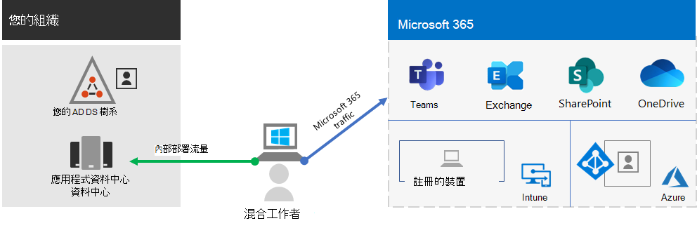
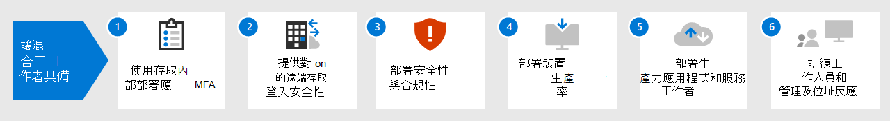

# 使用 Microsoft 365 強化遠端工作者Empower remote workers with Microsoft 365

貴組織可能必須讓工作人員能夠從家裡安全地存取貴組織的內部部署與雲端式資訊、工具及資源。Your business may need to enable your workers to have secure access to your organization's on-premises and cloud-based information, tools, and resources from their homes. 允許員工遠端辦公對許多組織達到以下目的非常重要:Allowing workers to work away from the office is important for many organizations to:

- 節省辦公室空間。Save on office space.
- 聘用並留住不願意調派的工作人員。Hire and retain workers who are unwilling to relocate.
- 縮短工作人員的通勤時間，讓他們有更多時間來提高生產力，並在下班後放鬆壓力。Reduce worker commuting, leaving them with more time to be productive and for stress-reducing activities outside of work.

Microsoft 365 具備讓您的工作人員能夠遠端作業的功能。Microsoft 365 has the capabilities to empower your workers to work remotely.

觀看這段影片以獲取部屬程序概觀。Watch this video for an overview of the deployment process.
 
> [!VIDEO https://www.microsoft.com/videoplayer/embed/RE4F1af]

此解決方案提供這些關鍵功能。This solution provides these key capabilities.

- 連接Connected

  遠端工作人員必須能夠隨時隨地存取：From anywhere in the world and at any time, remote workers are able to access: 

  - 您的 Microsoft 365 訂閱中的雲端服務和資料。Cloud-based services and data in your Microsoft 365 subscription. 

  - 組織資源，例如內部部署應用程式資料中心所提供的資源。Organization resources, such those offered by on-premises application datacenters.

- 安全Secure

  以 Microsoft 365 和 Windows 10 的多重要素驗證（MFA）和內建安全性功能保護登入，避免惡意程式碼、惡意攻擊和資料遺失。Sign-ins are secured with multi-factor authentication (MFA) and built-in security features of Microsoft 365 and Windows 10 protect against malware, malicious attacks, and data loss.

- 受管理Managed

  您可以透過安全性設定、允許的應用程式和對系統健康的符合要求以雲端來管理您的遠端工作人員的裝置。Your remote worker's devices can be managed from the cloud with security settings, allowed apps, and to require compliance with system health.

- 共同作業和生產力Collaborative and productive

  透過以下高度協作的方式，您的遠端工作人員可以像在內部部屬工作時一樣高效:Your remote workers can be as productive as on-premises in a highly collaborative way with:

  - 以 Teams 進行線上會議和聊天會話。Online meetings and chat sessions with Teams. 

  - 透過 SharePoint 和 OneDrive，使用全域協助工具和即時共同作業的雲端式檔案儲存空間以共用工作區。Shared workspaces for cloud-based file storage with global accessibility and real-time collaboration with SharePoint and OneDrive.

  - 共用工作和工作流程來劃分並完成工作。Shared tasks and workflows to divide up the work and get things done. 

若要取得無縫登入體驗，您的內部部署 Active Directory 網域服務 (AD DS) 使用者帳戶應與 Azure Active Directory (Azure AD) 同步處理。For a seamless sign-in experience, your on-premises Active Directory Domain Services (AD DS) user accounts should be synchronized with Azure Active Directory (Azure AD). 為了保護您的 Windows 10 裝置，應在 Intune 中註冊。To protect your Windows 10 devices, they should be enrolled in Intune. 以下是基礎結構的高階檢視。Here is a high-level view of the infrastructure.

若要為您的遠端工作者啟用 Microsoft 365 的功能，請使用這些 Microsoft 365 功能。To enable the capabilities of Microsoft 365 for your remote workers, use these Microsoft 365 features.

| 功能Capability or feature | 描述Description | 授權Licensing |
|:-------|:-----|:-------|
| 採用安全性預設值強制執行 MFAMFA enforced with security defaults   | 要求第二種形式的登入驗證，以防止身分識別和裝置遭到入侵。安全性預設值要求所有使用者帳戶使用 MFA。Protect against compromised identities and devices by requiring a second form of authentication for sign-ins. Security defaults requires MFA for all user accounts.   | Microsoft 365 E3 或 E5Microsoft 365 E3 or E5 |
| 使用條件式存取強制執行 MFAMFA enforced with Conditional Access| 根據具有條件式存取原則的登入屬性，要求使用 MFA。Require MFA based on the properties of the sign-in with Conditional Access policies.    | Microsoft 365 E3 或 E5Microsoft 365 E3 or E5 | 
| 使用風險型條件式存取強制執行 MFAMFA enforced with risk-based Conditional Access   | 根據使用適用於身分識別的 Microsoft Defender 的使用者登入的風險，要求使用 MFA。Require MFA based on the risk of the user sign-in with Microsoft Defender for Identity. | Microsoft 365 E5 或 E3 (含 Azure AD Premium P2 授權)Microsoft 365 E5 or E3 with Azure AD Premium P2 licenses | 
| 自助式密碼重設 (SSPR)Self-Service Password Reset (SSPR)    | 允許您的使用者重設或解除鎖定他們的密碼或帳戶。Allow your users to reset or unlock their passwords or accounts.  | Microsoft 365 E3 或 E5Microsoft 365 E3 or E5 |
| Azure AD 應用程式 ProxyAzure AD Application Proxy    | 針對內部網路伺服器上的網頁型應用程式，提供安全的遠端存取。Provide secure remote access for web-based applications hosted on intranet servers.   | 需要個別付費的 Azure 訂閱Requires separate paid Azure subscription |
| Azure 點對站 VPNAzure Point-to-Site VPN   | 透過 Azure 虛擬網路，建立從遠端工作者裝置到您內部網路的安全連線。Create a secure connection from a remote worker’s device to your intranet through an Azure virtual network.   | 需要個別付費的 Azure 訂閱Requires separate paid Azure subscription |
| Windows 虛擬桌面Windows Virtual Desktop   | 支援只能在 Azure 中執行虛擬桌面才能使用其個人和不受管理裝置的遠端工作者。Support remote workers who can only use their personal and unmanaged devices with virtual desktops running in Azure. | 需要個別付費的 Azure 訂閱Requires separate paid Azure subscription |
| 遠端桌面服務 (RDS)Remote Desktop Services (RDS) | 允許員工連線到您內部網路上的 Windows 型電腦。Allow employees to connect into Windows-based computers on your intranet. | Microsoft 365 E3 或 E5Microsoft 365 E3 or E5 | 
| 遠端桌面服務閘道Remote Desktop Services Gateway   | 加密通訊並防止 RDS 主機直接暴露在網際網路上。Encrypt communications and prevent the RDS hosts from being directly exposed to the Internet. | 需要不同的 Windows Server 授權Requires separate Windows Server licenses |
| Microsoft IntuneMicrosoft Intune | 管理裝置和應用程式。Manage devices and applications.   | Microsoft 365 E3 或 E5Microsoft 365 E3 or E5 | 
| 功能Configuration Manager | 在您的裝置上管理軟體安裝、更新及設定Manage software installations, updates, and settings on your devices | 需要個別的 Configuration Manager 授權Requires separate Configuration Manager licenses |
| 電腦分析Desktop Analytics | 判斷 Windows 用戶端的更新準備就緒狀況。Determine the update readiness of your Windows clients.   | 需要個別的 Configuration Manager 授權Requires separate Configuration Manager licenses |
| Windows AutopilotWindows Autopilot | 設定並預先設定新的 Windows 10 裝置，以提高生產力。Set up and pre-configure new Windows 10 devices for productive use.   | Microsoft 365 E3 或 E5Microsoft 365 E3 or E5 |
| Microsoft Teams、Exchange Online、SharePoint Online 和 OneDrive、Microsoft 365 Apps、Microsoft Power Platform 和 YammerMicrosoft Teams, Exchange Online, SharePoint Online and OneDrive, Microsoft 365 Apps, Microsoft Power Platform, and Yammer | 建立、溝通與共同作業。Create, communicate, and collaborate. | Microsoft 365 E3 或 E5Microsoft 365 E3 or E5 |
||||

如需安全性與合規性準則，請參閱[為遠端工作者部署安全性與合規性](empower-people-to-work-remotely-security-compliance.md)。For security and compliance criteria, see [Deploy security and compliance for remote workers](empower-people-to-work-remotely-security-compliance.md).

 如需這份解決方案的2頁摘要，請參閱 [[強化遠端工作人員] 海報](../downloads/empower-remote-workers.pdf)。For a 2-page summary of this solution, see the [Empower remote workers poster](../downloads/empower-remote-workers.pdf).

您也可以以 [PDF](https://github.com/MicrosoftDocs/microsoft-365-docs/raw/public/microsoft-365/downloads/empower-remote-workers.pdf) 或 [PowerPoint](https://download.microsoft.com/download/5/1/1/511b77a9-a34c-4ea7-af2a-32b07f20b780/empower-remote-workers.pptx) 格式下載此海報，然後使用 Letter、Legal 或 Tabloid (11 x 17) 大小的紙張列印此海報。You can also download this poster in [PDF](https://github.com/MicrosoftDocs/microsoft-365-docs/raw/public/microsoft-365/downloads/empower-remote-workers.pdf) or  [PowerPoint](https://download.microsoft.com/download/5/1/1/511b77a9-a34c-4ea7-af2a-32b07f20b780/empower-remote-workers.pptx) formats and print it on letter, legal, or tabloid (11 x 17) size paper.

## 為您所有的員工提供遠端工作能力Provide remote working for all of your workers

您可以使用這些設備使您的所有員工在任何地方都能保持生產力：You can enable all of your workers to stay productive from anywhere with these devices:

- 現代化設備（例如 Surface 膝上型電腦和 Windows 10），具有可透過網路直接存取 Microsoft 365 雲端應用程式和服務的功能、安全性和效能。A modern device, such as a Surface laptop and Windows 10, which has the features, security, and performance to access Microsoft 365 cloud apps and services directly over the web.

- 任何裝置，包含在家中使用的舊版膝上型電腦或桌上型電腦，可透過快速部署 [Windows 10 版的虛擬桌面](empower-people-to-work-remotely-remote-access.md#deploy-windows-virtual-desktop-to-provide-remote-access-for-remote-workers-using-personal-devices)，間接存取 Microsoft 365 雲端應用程式和服務。Any device including older laptops or desktops used from home, which can access Microsoft 365 cloud apps and services indirectly through a quickly deployed [Windows 10-based virtual desktop](empower-people-to-work-remotely-remote-access.md#deploy-windows-virtual-desktop-to-provide-remote-access-for-remote-workers-using-personal-devices). 此選項可提供高效能、強大的安全性和簡化版的 IT 管理。This option provides high performance, strong security, and simplified IT management.

## 後續步驟Next steps

使用下列步驟以保護和最佳化對組織的伺服器和雲端服務的存取，並將遠端工作者的生產力提升至最大。Use these steps to secure and optimize access to your organization's servers and cloud services and maximize your remote worker's productivity.

1. [使用 MFA 提升登入安全性Increase sign-in security with MFA](empower-people-to-work-remotely-secure-sign-in.md)
2. [可遠端存取內部部署應用程式和服務Provide remote access to on-premises apps and services](empower-people-to-work-remotely-remote-access.md)
3. [部署安全性與合規性服務Deploy security and compliance services](empower-people-to-work-remotely-security-compliance.md)
4. [為您的裝置、電腦和其他端點部署端點管理Deploy endpoint management for your devices, PCs, and other endpoints](empower-people-to-work-remotely-manage-endpoints.md)
5. [部署遠端工作者生產力應用程式和服務Deploy remote worker productivity apps and services](empower-people-to-work-remotely-teams-productivity-apps.md)
6. [訓練遠端工作者和處理使用上的意見反應Train remote workers and address usage feedback](empower-people-to-work-remotely-train-monitor-usage.md)

如需 Microsoft 所提供、有關支援遠端工作者的最新資訊，請參閱[啟用 Microsoft Teams 混合式工作網站](https://resources.techcommunity.microsoft.com/enabling-hybrid-work/) (英文)。For the latest information from Microsoft about supporting remote workers, see the [Enabling hybrid work with Microsoft Teams site](https://resources.techcommunity.microsoft.com/enabling-hybrid-work/).

若要瞭解虛構但代表性多國組織如何提升其遠端工作者的能力，請參閱 [針對遠端和辦公室工作的 Contoso COVID-19 回應和基礎架構](contoso-remote-onsite-work.md)。To see how a fictional but representative multi-national organization empowered its remote workers, see [Contoso's COVID-19 response and infrastructure for remote and onsite work](contoso-remote-onsite-work.md).
